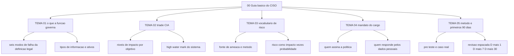

# Guia básico do CISO

A ENISA publicou em 19 de setembro de 2022 o European Cybersecurity Skills Framework, com 12 role profiles. O CISO está entre eles. O cargo, portanto, tem descrição pública antes de você escrever a sua, e o que essa descrição pressupõe é vocabulário: cinco temas, entre 25 e 40 minutos cada, para separar o que a função decide do que a função apenas supervisiona.

## 1. Introdução

### 1.1 O que é esta área
Cinco temas que respondem a três perguntas. O que a segurança da informação protege; como se mede o que se perde; e quem responde por quê.

Ficam dentro do escopo: a definição legal de segurança da informação, a tríade confidencialidade–integridade–disponibilidade com seus níveis de impacto, o vocabulário de ameaça, vulnerabilidade e risco, as obrigações que recaem sobre o cargo e o método de estudo que este roadmap usa.

Ficam fora: arquitetura, configuração de produto, escolha de fornecedor e operação de ferramenta. Um CISO governa sem saber editar uma regra de firewall. Não governa sem saber o que está assinando.

O limite com a área 01 é declarado, não deixado ao leitor. Esta área fica com o vocabulário — o sentido exato de confidencialidade, integridade e disponibilidade — e com a categorização de impacto do FIPS 199, que atribui LOW, MODERATE ou HIGH a um ativo. A área 01 retoma o mesmo assunto por outro ângulo: a competição entre os objetivos e as decisões de arquitetura que ela força.

### 1.2 Por que isso importa para o CISO
A Resolução CMN nº 4.893, de 26 de fevereiro de 2021, determina no art. 7º que as instituições autorizadas a funcionar pelo Banco Central designem diretor responsável pela política de segurança cibernética e pela execução do plano de ação e de resposta a incidentes. Repare no que a norma cobra: execução, não intenção.

Na mesma instituição, a Lei nº 13.709/2018, art. 41, exige que o controlador indique um encarregado pelo tratamento de dados pessoais. Outra função, outro nome, outro interlocutor. Duas obrigações com entregáveis distintos recaem sobre pessoas diferentes, e o relatório que serve a uma não serve à outra. Quem confunde os escopos entrega o mesmo documento aos dois e responde por nenhum.

### 1.3 O que você será capaz de fazer ao final
- Nomear os seis modos de falha que a definição legal de segurança da informação cobre e dizer quais ativos da sua organização estão sob cada um.
- Atribuir nível de impacto, LOW, MODERATE ou HIGH, a confidencialidade, integridade e disponibilidade de um ativo, com justificativa escrita.
- Escrever uma linha de registro de risco separando ameaça, vulnerabilidade, impacto e probabilidade, com um responsável nomeado.
- Apontar qual documento da sua organização designa quem responde pela política de segurança e quem responde pelos dados pessoais.
- Montar uma agenda de 90 dias com três marcos e o critério que prova que cada um aconteceu.

### 1.4 Os temas desta área, em prosa
O TEMA-01 fixa o que a segurança da informação protege — acesso, uso, divulgação, interrupção, modificação e destruição não autorizados de informação e de sistemas — e mostra por que esse recorte define o perímetro da sua governança. O TEMA-02 pega os três objetivos da tríade e mostra como cada um recebe um nível de impacto, com a consequência operacional como critério. O TEMA-03 separa os três substantivos que a maioria usa como sinônimo: ameaça, vulnerabilidade e risco, e mostra como transformá-los em linha de registro com dono. O TEMA-04 reúne o que terceiros escreveram sobre o cargo: a norma brasileira que exige um responsável designado, a lei de dados que cria o encarregado, o regime europeu que responsabiliza a administração e os frameworks que o mercado usa como régua. O TEMA-05 fecha com o método: pré-teste, recuperação ativa, revisão espaçada em D+1, D+7 e D+30, e a agenda dos primeiros 90 dias.

## 2. Objetivos de aprendizagem (terminais)

| # | Objetivo | Bloom | Temas que o sustentam |
|---|---|---|---|
| 1 | Descrever o perímetro de governança do CISO citando os seis modos de falha da definição legal e nomeando três ativos cobertos pela sua política. | entender | TEMA-01 |
| 2 | Aplicar a categorização por impacto a um ativo real, atribuindo LOW, MODERATE ou HIGH a cada objetivo da tríade com a consequência operacional como justificativa. | aplicar | TEMA-02, TEMA-01 |
| 3 | Separar ameaça, vulnerabilidade e risco em um registro de risco próprio, com impacto, probabilidade e responsável nomeados. | aplicar | TEMA-03 |
| 4 | Avaliar as obrigações legais e de mercado que recaem sobre o cargo, apontando o documento que exige cada entregável. | avaliar | TEMA-04 |
| 5 | Construir uma agenda de 90 dias com três marcos verificáveis, cada um ligado a um artefato existente ou a produzir. | criar | TEMA-05 |

## 3. Diagrama dos tópicos

## 4. Temas

| # | tema_id | Tema | Nível | Tempo |
|---|---|---|---|---|
| 1 | TEMA-01 | O que é segurança da informação e o que o CISO governa | base | 30-40 min |
| 2 | TEMA-02 | A tríade CIA na prática | base | 30-40 min |
| 3 | TEMA-03 | Ameaças, vulnerabilidades e risco: o vocabulário mínimo | base | 30-40 min |
| 4 | TEMA-04 | O mandato do CISO: o que a lei e o mercado esperam | base | 30-40 min |
| 5 | TEMA-05 | Como usar este roadmap e a trilha dos primeiros 90 dias | base | 25-35 min |

## 5. Pré-requisitos e sequência

É a porta de entrada do roadmap: nenhuma área precisa vir antes. O TEMA-03 supõe o TEMA-02; o TEMA-05 supõe os quatro anteriores, porque a agenda dos 90 dias é montada com o vocabulário deles.

| Antes | Esta área | Depois |
|---|---|---|
| — | 00-guia-basico, ordem de estudo 1 | [01 Fundamentos](../01-fundamentos/README.md), ordem 2 |
| — | 00-guia-basico | [17 Liderança e gestão do CISO](../17-lideranca-ciso/README.md), ordem 3 |
| — | 00-guia-basico | [02 Governança, risco e compliance](../02-governanca-risco-compliance/README.md), ordem 4 |

## 6. Certificações desta área

| Certificação | Sigla | O que cobre aqui |
|---|---|---|
| Certified Chief Information Security Officer, EC-Council | CCISO | TEMA-01 e TEMA-04: governança e o papel do executivo de segurança |
| Certified Information Security Manager, ISACA | CISM | TEMA-03 e TEMA-04: risco e governança de segurança |

Ver: [90-certificacoes/](../90-certificacoes/README.md).

## 7. Conexões com outras áreas

Relações de saída dos temas desta área que apontam para fora dela, agregadas do frontmatter
`relacoes`. A visão consolidada está em [mapa-relacoes.md](../mapa-relacoes.md); as regras, em
[templates/RELACOES-TEMAS.md](../templates/RELACOES-TEMAS.md). Alvos marcados como pendentes
ainda não foram escritos.

| Tema daqui | Relação | Destino | Por que |
|---|---|---|---|
| TEMA-01 | aplicado_em | 02-governanca-risco-compliance#TEMA-01 | o perímetro definido aqui é o que a política precisa cobrir por escrito, e política é artefato da área 02 |
| TEMA-02 | aprofundado_por | 01-fundamentos#TEMA-02 | a introdução aplica os três pilares a um ativo; a área 01 define os objetivos de segurança com precisão formal |
| TEMA-03 | complementa | 02-governanca-risco-compliance#TEMA-03 | risco estimado em unidade comparável só decide algo quando há critério de aceite declarado, e o apetite de risco pertence à área 02 |
| TEMA-04 | aplicado_em | 17-lideranca-ciso#TEMA-01 | o mandato formal descrito aqui é o que sustenta autoridade e verba no exercício do cargo tratado na área 17 |
| TEMA-05 | aplicado_em | 17-lideranca-ciso#TEMA-06 | a ordem de estudo e a fila de revisão são o insumo do plano de maturidade do programa |

## 8. Atividades práticas e laboratórios

| # | Atividade | O que a prática demonstra | Pré-requisito técnico |
|---|---|---|---|
| 1 | Listar os cinco tipos de informação mais sensíveis da organização e escrever, para cada um, a consequência de uma divulgação indevida. | Que o perímetro de governança se define por informação, não por servidor. | nenhum |
| 2 | Pedir a três áreas diferentes a definição de "incidente grave" e comparar as três respostas. | Onde o vocabulário de risco está sendo usado com sentidos incompatíveis. | nenhum |
| 3 | Localizar no organograma quem foi formalmente designado para responder pela política de segurança e quem responde pelos dados pessoais. | Se o mandato está documentado ou apenas suposto. | nenhum |
| 4 | Escrever três linhas de registro de risco com a mesma estrutura: ativo, ameaça, vulnerabilidade, impacto, probabilidade, dono. | Que a linha padronizada é o que permite comparar riscos de áreas distintas. | nenhum |

## 9. Checkpoint da área

Avaliação intercalada, com itens retirados dos temas desta área em ordem diferente da ordem de estudo. Nenhum item novo é criado aqui.

1. Um sistema de aquisições de uma contratante contém informação contratual sensível e informação administrativa de rotina. Qual é o nível de impacto do sistema em confidencialidade, integridade e disponibilidade, e por quê? (TEMA-02)
2. Numa instituição autorizada pelo Banco Central, quantas pessoas diferentes o desenho normativo aponta como responsáveis, e por qual entregável cada uma responde? (TEMA-04)
3. Uma conta administrativa sem segundo fator de autenticação: isso é ameaça, vulnerabilidade ou risco? (TEMA-03)
4. Liste os seis modos de falha que a definição legal de segurança da informação cobre e diga qual deles é o mais provável na sua organização hoje. (TEMA-01)
5. Qual é o intervalo de revisão que você deve aplicar a um tema que acertou sem consultar, e o que muda se errar? (TEMA-05)

Conferir respostas e critério

1. Confidencialidade MODERATE, integridade MODERATE, disponibilidade LOW. O sistema recebe o valor mais alto de cada objetivo entre os tipos de informação residentes nele; a informação contratual é MODERATE em confidencialidade e integridade, a administrativa é LOW nas três, e o resultado é o high water mark. (FIPS 199, exemplo 4.)
2. Dois. Um diretor designado responde pela política de segurança cibernética e pela execução do plano de ação e de resposta a incidentes (Resolução CMN nº 4.893/2021, art. 7º); o encarregado responde pelo tratamento de dados pessoais (Lei nº 13.709/2018, art. 41). A norma não proíbe a mesma pessoa nos dois papéis, mas exige duas designações.
3. Vulnerabilidade. Fraqueza em sistema, procedimento ou controle interno que pode ser explorada ou disparada por uma fonte de ameaça. Sozinha, sem fonte de ameaça e sem impacto, não é risco.
4. Acesso não autorizado, uso, divulgação, interrupção, modificação e destruição, aplicados a informação e a sistemas de informação. A segunda parte é autoral e vale o critério de ter citado a consequência, não o susto.
5. D+1, D+7 e D+30. Acerto sem consulta mantém o intervalo; erro rebaixa o item e ele volta pela metade do prazo, D+3 no lugar de D+7 e D+7 no lugar de D+30.

Critério para seguir adiante: acertar 4 dos 5 itens sem consultar os temas. Errar o item 2 é motivo para reler o TEMA-04 antes de avançar — é o que sustenta a sua autoridade formal.

## 10. Termos desta área

Termos que o glossário central deve conter, com definição e fonte.

- segurança da informação
- confidencialidade
- integridade
- disponibilidade
- tipo de informação
- categoria de segurança
- nível de impacto
- ameaça
- fonte de ameaça
- vulnerabilidade
- risco
- risco aceito
- encarregado pelo tratamento de dados pessoais
- política de segurança cibernética

## 11. Fontes verificadas

| # | Título | Tipo | URL | Acessado em | Confiança |
|---|---|---|---|---|---|
| 1 | FIPS PUB 199 — Standards for Security Categorization of Federal Information and Information Systems | primaria | https://nvlpubs.nist.gov/nistpubs/FIPS/NIST.FIPS.199.pdf | "2026-09-25" | alta |
| 2 | ENISA European Cybersecurity Skills Framework — Role Profiles, publicado em 19/09/2022 | primaria | https://www.enisa.europa.eu/publications/european-cybersecurity-skills-framework-role-profiles | "2026-09-25" | alta |
| 3 | NIST Cybersecurity Framework 2.0 — seis funções, entre elas Govern | primaria | https://www.nist.gov/cyberframework | "2026-09-25" | alta |
| 4 | CSEC2017 — Cybersecurity Curricula, oito Knowledge Areas | primaria | https://www.acm.org/binaries/content/assets/education/curricula-recommendations/csec2017.pdf | "2026-09-25" | alta |
| 5 | Resolução CMN nº 4.893, de 26/02/2021, art. 7º — designação de diretor responsável | primaria | https://www.bcb.gov.br/estabilidadefinanceira/exibenormativo?tipo=RESOLU%C3%87%C3%83O%20CMN&numero=4893 | "2026-09-25" | alta |
| 6 | Lei nº 13.709/2018, art. 41 — indicação de encarregado pelo tratamento de dados pessoais | primaria | https://www.planalto.gov.br/ccivil_03/_ato2015-2018/2018/lei/L13709.htm | "2026-09-25" | alta |

---

| Navegação | |
|---|---|
| Próximo | [01 Fundamentos de segurança da informação](../01-fundamentos/README.md) |
| Home | [README](../README.md) |
