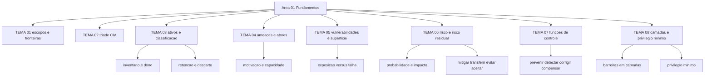

# Fundamentos de segurança da informação

O CSRC Glossary do NIST mantém verbetes separados para confidencialidade, integridade e disponibilidade, cada um rastreando a definição até o 44 U.S.C. § 3542, a lei federal americana de onde esse vocabulário saiu. Esta área começa por essas definições porque elas aparecem sem tradução livre na prova do Security+, no relatório do auditor e na apólice de seguro. Quando o CISO não domina esse vocabulário, o sintoma é sempre o mesmo: compra-se ferramenta para um problema que ninguém conseguiu nomear.

## 1. Introdução

### 1.1 O que é esta área

Fundamentos cobre o vocabulário e as distinções que as outras dezesseis áreas pressupõem: o que é informação protegida, o que é ativo, o que é ameaça, o que é vulnerabilidade, o que é risco e o que é controle. Oito temas, cada um com uma ideia central.

Fica fora desta área a mecânica de implementação. Como o firewall filtra, como o IAM provisiona um papel, como o SOC faz triagem: isso pertence às áreas 04 a 16. Também fica fora a gestão de programa — apetite de risco, política, ISMS, auditoria —, que é a área 02. Aqui se aprende a nomear antes de decidir onde gastar.

A tríade não é reapresentada aqui. O vocabulário de confidencialidade, integridade e disponibilidade e a escala de impacto do FIPS 199 ficaram em [00/TEMA-02](../00-guia-basico/TEMA-02-triade-cia.md). Esta área pega os objetivos já nomeados e trata do que acontece quando eles competem entre si: o trade-off que toda decisão de arquitetura força e o custo de sustentar um objetivo no nível mais alto que os dados exigem.

### 1.2 Por que isso importa para o CISO

Em uma reunião de orçamento, a pergunta que trava a decisão costuma ser simples: aquela falha no portal é problema de segurança da informação, de segurança cibernética ou de privacidade? Cada resposta aponta para um dono diferente, um orçamento diferente e uma obrigação de comunicação diferente.

Considere um achado de auditoria: o banco de dados de clientes está sem criptografia em repouso. O CISO que responde "confidencialidade comprometida, com impacto alto e probabilidade média, risco residual inaceitável para o nível de classificação desses dados" sai da reunião com verba aprovada. O CISO que responde "é uma vulnerabilidade crítica, precisamos corrigir" entrega a decisão para quem argumentar melhor sobre prioridade, e geralmente perde para o time que promete receita.

### 1.3 O que você será capaz de fazer ao final

- Classificar uma situação real de incidente ou achado nos três escopos — segurança da informação, segurança cibernética e privacidade —, indicando o dono da decisão em cada um.
- Explicar confidencialidade, integridade e disponibilidade pelas definições do NIST e apontar qual objetivo uma decisão de arquitetura sacrifica.
- Montar um inventário de ativos com dono, classificação e prazo de descarte a partir de fontes que já existem na empresa.
- Descrever a superfície de ataque de um serviço exposto, separando exposição de vulnerabilidade.
- Avaliar um risco com probabilidade, impacto e risco residual, escolhendo entre mitigar, transferir, evitar e aceitar com critério escrito.
- Distribuir verba de controle entre as funções preventiva, detectiva e corretiva, justificando a proporção.

### 1.4 Os temas desta área, em prosa

O [TEMA-01](TEMA-01-seguranca-informacao-cibernetica-privacidade.md) separa três escopos que o mercado trata como sinônimos: proteger a informação, proteger o ambiente digital e garantir que o tratamento de dado pessoal seja legítimo. O [TEMA-02](TEMA-02-triade-cia-e-objetivos-de-seguranca.md) trata dos três objetivos que definem o que significa "protegido", e mostra que eles competem entre si. O [TEMA-03](TEMA-03-ativos-classificacao-ciclo-de-vida.md) responde o que precisa ser protegido e por quanto tempo, do inventário ao descarte.

O [TEMA-04](TEMA-04-ameacas-atores-motivacoes.md) descreve quem ataca e por quê. O [TEMA-05](TEMA-05-vulnerabilidades-superficie-de-ataque.md) descreve por onde se entra, distinguindo a falha interna do ponto alcançável de fora. O [TEMA-06](TEMA-06-risco-probabilidade-impacto.md) junta os dois anteriores em risco: probabilidade, impacto e o que sobra depois do controle. O [TEMA-07](TEMA-07-controles-preventivos-detectivos.md) classifica os controles pela função que cumprem, e o [TEMA-08](TEMA-08-defesa-em-profundidade-menor-privilegio.md) mostra como empilhá-los e como limitar o dano quando uma camada cede.

## 2. Objetivos de aprendizagem (terminais)

| # | Objetivo | Bloom | Temas que o sustentam |
|---|---|---|---|
| 1 | Classificar 10 situações do próprio ambiente nos três escopos de segurança, justificando cada classificação pela definição de fonte primária e nomeando o dono da decisão. | entender | TEMA-01 |
| 2 | Explicar os objetivos de confidencialidade, integridade e disponibilidade conforme o NIST e indicar qual objetivo é sacrificado em uma decisão de arquitetura dada. | entender | TEMA-02 |
| 3 | Construir um inventário de 15 ativos de um processo de negócio, com dono, classificação, retenção e forma de descarte. | aplicar | TEMA-03, TEMA-04 |
| 4 | Descrever a superfície de ataque de um serviço exposto, listando o que é alcançável antes de listar o que está falho. | analisar | TEMA-05 |
| 5 | Avaliar um risco identificado com probabilidade, impacto e risco residual, escolhendo a resposta entre mitigar, transferir, evitar e aceitar. | avaliar | TEMA-06, TEMA-07 |
| 6 | Distribuir a verba de um plano de controles entre as funções preventiva, detectiva e corretiva, justificando a proporção por escrito. | criar | TEMA-07, TEMA-08 |

## 3. Diagrama dos tópicos

## 4. Temas

| # | tema_id | Tema | Nível | Tempo |
|---|---|---|---|---|
| 1 | TEMA-01 | Segurança da informação, segurança cibernética e privacidade | base | 30-40 min |
| 2 | TEMA-02 | Objetivos de segurança em conflito e o custo do high water mark | base | 25-35 min |
| 3 | TEMA-03 | Ativos, classificação e ciclo de vida da informação | base | 30-40 min |
| 4 | TEMA-04 | Ameaças, atores e motivações | base | 25-35 min |
| 5 | TEMA-05 | Vulnerabilidades, exposição e superfície de ataque | base | 25-35 min |
| 6 | TEMA-06 | Risco: probabilidade, impacto e risco residual | intermediario | 35-45 min |
| 7 | TEMA-07 | Controles: preventivos, detectivos, corretivos e compensatórios | intermediario | 30-40 min |
| 8 | TEMA-08 | Defesa em profundidade e o princípio do menor privilégio | intermediario | 30-40 min |

## 5. Pré-requisitos e sequência

O [00-guia-basico](../00-guia-basico/README.md) vem antes porque define o vocabulário do cargo e a leitura do roadmap. Depois desta área, a sequência natural é [02-governanca-risco-compliance](../02-governanca-risco-compliance/README.md), onde risco medido vira apetite declarado e política aprovada.

| Antes | Esta área | Depois |
|---|---|---|
| 00-guia-basico | 01-fundamentos | 02-governanca-risco-compliance |

Dentro da área, a ordem dos temas é sugestão. Quem já opera inventário de ativos pode ler TEMA-06 antes de TEMA-04 sem prejuízo: risco depende de ameaça e vulnerabilidade, e os dois voltam a aparecer no TEMA-06.

## 6. Certificações desta área

Apenas siglas e o que cada credencial usa desta área. Domínios, pesos e custo ficam em [90-certificacoes/](../90-certificacoes/README.md); os pesos por domínio do Security+ SY0-701 foram confirmados em fonte primária e estão registrados em [99-fontes/registro-verificacao.md](../99-fontes/registro-verificacao.md).

| Certificação | Sigla | O que cobre aqui |
|---|---|---|
| CompTIA Security+ | Security+ | Vocabulário de ameaça, vulnerabilidade, risco e controle |
| ISC2 Certified in Cybersecurity | CC | Fundamentos de segurança e princípios de proteção |
| ISC2 CISSP | CISSP | Base conceitual dos 8 domínios; esta área é pré-requisito de leitura |
| ISACA CISM | CISM | Ligação entre risco medido e decisão de gestão |

## 7. Conexões com outras áreas

Relações de saída dos temas desta área que apontam para fora dela, agregadas do frontmatter
`relacoes`. A visão consolidada está em [mapa-relacoes.md](../mapa-relacoes.md); as regras, em
[templates/RELACOES-TEMAS.md](../templates/RELACOES-TEMAS.md). Alvos marcados como pendentes
ainda não foram escritos.

| Tema daqui | Relação | Destino | Por que |
|---|---|---|---|
| TEMA-01 | nao_confundir_com | 14-dados-privacidade#TEMA-01 | proteger o dado contra acesso indevido não é o mesmo que decidir se o tratamento de dado pessoal é legítimo; destino planejado, número provisório |
| TEMA-02 | aplicado_em | 07-criptografia-segredos#TEMA-01 | confidencialidade e integridade só se sustentam em primitivas criptográficas concretas |
| TEMA-03 | aplicado_em | 14-dados-privacidade#TEMA-02 | classificar ativo e inventariar dado pessoal são a mesma disciplina com obrigação legal distinta |
| TEMA-04 | aplicado_em | 12-vulnerabilidades-threat-intel#TEMA-03 | saber quem ataca determina qual inteligência vale pagar |
| TEMA-05 | aplicado_em | 12-vulnerabilidades-threat-intel#TEMA-02 | superfície de ataque é o que a priorização por risco real precisa medir |
| TEMA-06 | complementa | 02-governanca-risco-compliance#TEMA-03 | risco medido só vira decisão quando existe apetite declarado, e o limiar de aceitação é definido fora desta área |
| TEMA-07 | aplicado_em | 02-governanca-risco-compliance#TEMA-05 | a taxonomia de controles é o que permite escolher um framework e justificar o gasto |
| TEMA-08 | aplicado_em | 04-identidade-acesso#TEMA-04 | o princípio do menor privilégio só existe quando papéis e políticas de acesso o implementam; destino planejado, número provisório |
| TEMA-08 | complementa | 04-identidade-acesso#TEMA-02 | o princípio do menor privilégio só se realiza no modelo de autorização, onde atributo, política e ponto de decisão o transformam em decisão executável |

## 8. Atividades práticas e laboratórios

| # | Atividade | O que a prática demonstra | Pré-requisito técnico |
|---|---|---|---|
| 1 | Classificar 10 situações dos últimos 12 meses da sua empresa nos três escopos do TEMA-01 | Que a fronteira entre segurança, ciber e privacidade muda o dono da decisão | nenhum |
| 2 | Escrever a definição do NIST de confidencialidade, integridade e disponibilidade de memória e conferir | Onde a memória do gestor substitui a definição por uma versão mais fraca | nenhum |
| 3 | Montar inventário de 15 ativos de um processo de negócio, com dono, classificação, retenção e descarte | Que ativo sem dono não tem controle decidível | planilha eletrônica |
| 4 | Desenhar a superfície de ataque de um serviço exposto à internet, em quatro camadas | Que o alcance do atacante é maior que a lista de falhas do relatório de varredura | acesso à arquitetura do serviço |
| 5 | Avaliar 3 riscos reais em matriz 5x5, com risco residual declarado | Que corrigir tudo não zera risco e que aceitar exige registro | nenhum |
| 6 | Levantar, para 4 camadas, o controle preventivo e o detectivo existentes e o ausente | Onde a verba de detecção está zerada | conversa com a equipe de operações |

## 9. Checkpoint da área

Cinco itens retirados dos temas, fora da ordem original. Responda antes de abrir o gabarito.

1. O que a definição do NIST exige para que algo seja tratado como ativo, e por que o dono do ativo não é o time de TI? (TEMA-03)
2. Um risco com probabilidade baixa e impacto alto entra na fila antes de um com probabilidade alta e impacto baixo? Que critério decide? (TEMA-06)
3. Um vazamento de dado pessoal por falha de configuração pode ser tratado apenas como incidente de segurança? Justifique em duas linhas. (TEMA-01)
4. Auditoria exige MFA em um sistema legado que não suporta o recurso. Descreva o controle compensatório e quem precisa concordar com ele. (TEMA-07)
5. Uma credencial de analista é comprometida em uma rede sem segmentação. O que o princípio do menor privilégio teria limitado? (TEMA-08)

Conferir respostas e critério

1. A definição do glossário do NIST fala de "item de valor para o alcance dos objetivos de missão e negócio da organização". Dono do ativo é quem responde pelo uso e pelo impacto no negócio; o time de TI opera o ativo, autoriza acesso e não decide quanto tempo o dado fica retido.
2. Depende do impacto declarado no critério de classificação de risco da empresa. Pesar probabilidade e impacto exige uma escala aprovada, e é essa escala que ordena a fila, não a intuição do analista.
3. Não. O mesmo evento atinge confidencialidade, expõe o canal e levanta questão de finalidade e necessidade do tratamento. São três avaliações com donos diferentes.
4. Controle compensatório é aquele que substitui o exigido quando o requisito não é atendido, com efeito equivalente aceito por quem exigiu. No caso: restringir origem de rede, registrar sessão e exigir aprovação nominal por acesso, com aceite formal do auditor.
5. O alcance da credencial. Menor privilégio reduz o conjunto de recursos que aquela identidade consegue ler ou alterar, e portanto o tamanho do dano possível com a mesma senha roubada.

Critério para seguir adiante: acertar 80% ou mais sem consultar os temas. Erro no item 2 ou no item 4 indica que risco e controle ainda estão fundidos na sua cabeça; releia TEMA-06 e TEMA-07 antes de seguir.

## 10. Termos desta área

Termos que o glossário central precisa conter; as definições curtas ficam em [glossario.md](../glossario.md).

- ativo (asset)
- classificação da informação
- ciclo de vida da informação
- confidencialidade
- integridade
- disponibilidade
- tríade CIA
- ameaça (threat)
- fonte de ameaça
- vulnerabilidade
- exposição
- superfície de ataque (attack surface)
- risco
- risco inerente
- risco residual
- apetite de risco
- controle (security control)
- controle compensatório
- defesa em profundidade (defense in depth)
- menor privilégio (least privilege)

## 11. Fontes verificadas

| # | Título | Tipo | URL | Acessado em | Confiança |
|---|---|---|---|---|---|
| 1 | NIST CSRC Glossary — information security | primaria | https://csrc.nist.gov/glossary/term/information_security | "2026-09-25" | alta |
| 2 | NIST CSRC Glossary — confidentiality | primaria | https://csrc.nist.gov/glossary/term/confidentiality | "2026-09-25" | alta |
| 3 | NIST CSRC Glossary — integrity | primaria | https://csrc.nist.gov/glossary/term/integrity | "2026-09-25" | alta |
| 4 | NIST CSRC Glossary — availability | primaria | https://csrc.nist.gov/glossary/term/availability | "2026-09-25" | alta |
| 5 | NIST CSRC Glossary — risk | primaria | https://csrc.nist.gov/glossary/term/risk | "2026-09-25" | alta |
| 6 | NIST CSRC Glossary — threat | primaria | https://csrc.nist.gov/glossary/term/threat | "2026-09-25" | alta |
| 7 | NIST CSRC Glossary — vulnerability | primaria | https://csrc.nist.gov/glossary/term/vulnerability | "2026-09-25" | alta |
| 8 | NIST CSRC Glossary — security control | primaria | https://csrc.nist.gov/glossary/term/security_control | "2026-09-25" | alta |
| 9 | NIST CSRC Glossary — defense in depth | primaria | https://csrc.nist.gov/glossary/term/defense_in_depth | "2026-09-25" | alta |
| 10 | NIST CSRC Glossary — least privilege | primaria | https://csrc.nist.gov/glossary/term/least_privilege | "2026-09-25" | alta |
| 11 | NIST Cybersecurity Framework 2.0 — NIST SP 1299 | primaria | https://nvlpubs.nist.gov/nistpubs/SpecialPublications/NIST.SP.1299.pdf | "2026-09-25" | alta |
| 12 | CompTIA Security+ SY0-701 Exam Objectives | primaria | https://assets.ctfassets.net/82ripq7fjls2/6TYWUym0Nudqa8nGEnegjG/0f9b974d3b1837fe85ab8e6553f4d623/CompTIA-Security-Plus-SY0-701-Exam-Objectives.pdf | "2026-09-25" | alta |

---

| Navegação | |
|---|---|
| Anterior | [00 Guia básico do CISO](../00-guia-basico/README.md) |
| Próximo | [17 Liderança e gestão do CISO](../17-lideranca-ciso/README.md) |
| Home | [README](../README.md) |
