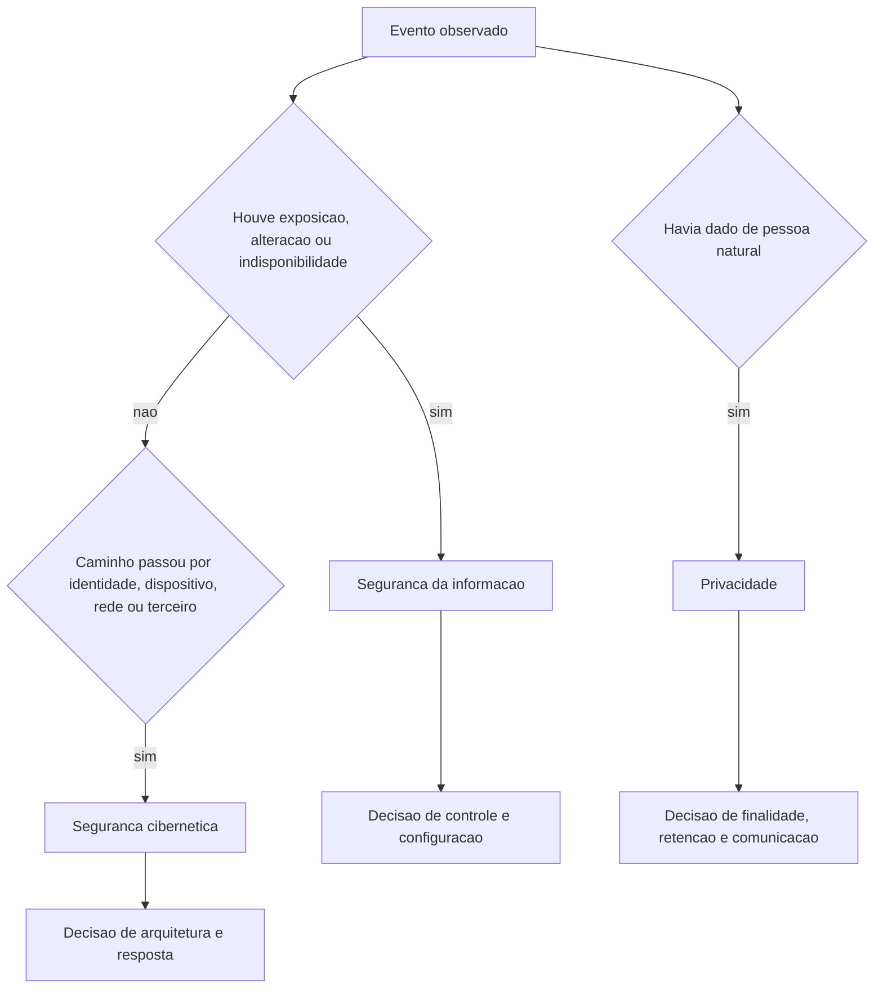

# Segurança da informação, segurança cibernética e privacidade

Três escopos distintos convivem na mesma frase do dia a dia: "precisamos proteger os dados dos clientes". Quem separa os três evita comprar a ferramenta errada e evita prometer no board algo que não está sob sua autoridade.

## 1. Objetivo de aprendizagem

Ao final deste tema você deve conseguir: classificar 10 situações do próprio ambiente nos três escopos (segurança da informação, segurança cibernética e privacidade), citando a definição que sustenta a classificação e nomeando o dono da decisão em cada caso.

## 2. Pré-requisitos

Nenhum. Este é o tema de abertura da área.

## 3. Pré-teste

Responda de palpite, antes de ler o resto. Anote a confiança de 1 a 5.

1. Na sua empresa, um alerta de malware e um pedido de exclusão de dado pessoal caem na mesma fila? Aposte sim ou não.
   Confiança: ___
2. Chute: a definição de segurança da informação que você usa no discurso cita quantos objetivos? Anote o número.
   Confiança: ___
3. Antes de ler: se um auditor perguntasse quem responde pela finalidade do tratamento de um cadastro de cliente, qual área você apontaria primeiro?
   Confiança: ___

## 4. Caso real

Um analista de RH envia, por e-mail sem proteção, uma planilha com nome, CPF e salário de toda a folha para uma consultoria de folha de pagamento. O e-mail chega ao destinatário correto. Não há invasão, não há malware, não há senha roubada.

Na manhã seguinte, o CISO, o jurídico e o RH discutem três vezes o mesmo evento sem se entender: o jurídico fala em dano ao titular, o RH fala em processo operacional, a segurança fala em canal sem controle. A pergunta que o caso deixa aberta: esse evento é um problema só, ou três problemas com donos diferentes?

## 5. Conteúdo

### 5.1 Conceito

O glossário do CSRC, do NIST, registra o verbete *information security* assim: "The protection of information and information systems from unauthorized access, use, disclosure, disruption, modification, or destruction in order to provide confidentiality, integrity, and availability". A mesma página aponta a origem: FIPS 200, rastreando até o 44 U.S.C. § 3542. A definição é curta e cobra duas coisas ao mesmo tempo: proteger a informação e proteger os sistemas que a processam.

Segurança cibernética cobre um recorte maior. Onde a segurança da informação parte do dado e do sistema, a cibersegurança parte do ambiente digital como um todo: identidades, dispositivos, redes, serviços de terceiros, cadeia de suprimentos. Um incidente que derruba o provedor de nuvem contratado não viola a confidencialidade de nenhum dado seu, e ainda assim é incidente de cibersegurança. A definição oficial do NIST para *cybersecurity* não foi conferida nesta execução: NAO CONFIRMADO em fonte oficial.

Privacidade olha para outra pergunta. Não é se o dado está acessível, é se o tratamento dele tem justificativa legítima: para que foi coletado, se o uso atual cabe nessa finalidade, se o volume é o necessário e por quanto tempo fica guardado. No Brasil a matéria é regulada pela LGPD, Lei nº 13.709/2018, cujo conteúdo não foi conferido em fonte oficial nesta execução: NAO CONFIRMADO em fonte oficial. Trate o nome da lei como referência de busca, não como fundamento: nenhuma obrigação, prazo ou definição dela deve ser citada por este documento.

Os três escopos se sobrepõem sem se substituir. Um mesmo evento pode estar dentro dos três ao mesmo tempo, e cada escopo tem uma autoridade de decisão diferente. O erro de gestão mais caro é assumir que herdar o escopo maior significa herdar a autoridade dos três.

### 5.2 Como funciona

A separação se apoia em quatro perguntas, nesta ordem. Primeiro: houve exposição, alteração ou indisponibilidade de informação? Se sim, é segurança da informação. Segundo: o caminho usado atravessou identidade, dispositivo, rede ou fornecedor? Se sim, é cibersegurança. Terceiro: havia dado de pessoa natural no conjunto? Se sim, entra a avaliação de privacidade. Quarto: quem era o responsável por autorizar aquele uso?

Uma consequência prática: a resposta técnica dos três costuma divergir. Segurança da informação pede cifra no arquivo. Cibersegurança pede trilha de auditoria do canal e autenticação forte no remetente. Privacidade pergunta por que a consultoria precisava da folha inteira, e não de dez linhas selecionadas.

### 5.3 Exemplo resolvido

Mesmo evento do caso real, resolvido por escopo.

Passo 1, segurança da informação. O arquivo saiu do controle da organização. O objetivo mais atingido é confidencialidade. Integridade e disponibilidade permanecem intactas até prova em contrário. Primeira linha do relatório: exposição de confidencialidade de dado de folha.

Passo 2, cibersegurança. O canal foi e-mail sem proteção, o remetente tinha conta válida e o destino é um terceiro. A pergunta deixa de ser o arquivo e passa a ser o controle do caminho: o e-mail saía com alguma política de DLP? A conta tinha MFA? O destinatário externo estava em lista aprovada?

Passo 3, privacidade. Coletou-se mais do que o necessário. A consultoria precisava de nome, CPF, salário e endereço? O período de retenção do arquivo na caixa postal da consultoria foi definido? Havia contrato de tratamento? Cada resposta negativa vira ação de outro dono.

Passo 4, decisão. O CISO lidera os passos 1 e 2, com ação de contenção do e-mail, revisão das regras de saída e verificação de quem mais recebeu. A comunicação sobre titulares e a exigência contratual dependem da função de privacidade e do jurídico. Uma única reunião, três decisões, três donos.

### 5.4 Problema de completar

Caso novo: uma exportação do sistema de RH com histórico de afastamentos médicos fica em um diretório de rede compartilhado com toda a diretoria por seis meses. Ninguém de fora acessou.

Preencha as etapas e feche as duas últimas.

1. Escopo de segurança da informação: objetivo atingido e qual não foi. __________
2. Escopo de cibersegurança: caminho e controle ausente. __________
3. Escopo de privacidade: pergunta central sobre o dado e sobre o prazo. __________
4. Donos das decisões de cada um dos três itens. __________
5. Ação da primeira semana e registro a produzir. __________

## 6. Por que isso importa para o CISO

A verba de privacidade e a verba de segurança não saem do mesmo lugar, e quase nunca têm o mesmo aprovador. Quando o CISO aceita ser o único dono visível dos três escopos, ele passa a responder por decisões de finalidade e retenção que o negócio nunca lhe delegou. O resultado aparece no primeiro incidente: cobram dele a comunicação ao titular e à autoridade, e ele descobre que não controla a base de dados que originou o problema.

Há um efeito operacional direto. O orçamento de segurança da informação se justifica por redução de probabilidade. O de privacidade se justifica por conformidade e por risco de sanção. São narrativas diferentes no comitê, mesmo quando compram o mesmo produto.

## 7. Aplicação prática

Escolha três eventos dos últimos 12 meses que chegaram até você, incluindo quase-acidentes. Para cada um, escreva cinco linhas: escopo principal, escopo secundário se houver, objetivo de segurança atingido, dono da decisão técnica e dono da decisão sobre o dado.

Depois, responda por escrito: em quantos dos três a decisão final não era sua? Esse número é a medida da sua dependência externa, e vale levar para a próxima conversa de governança.

## 8. Autoexplicação

Explique em três frases, sem consultar o texto, a diferença entre os três escopos. Em seguida, ligue a explicação a algo que você já faz hoje: por exemplo, o relatório de incidentes que sua equipe entrega à diretoria. Ele separa escopo ou mistura tudo em um total de ocorrências?

## 9. Erros comuns e equívocos

| Equívoco | Por que está errado | O que é correto |
|---|---|---|
| Segurança da informação e segurança cibernética são sinônimos | O primeiro parte do dado e do sistema; o segundo inclui ambiente digital e terceiros | Separe pelo caminho: se envolve identidade, dispositivo, rede ou fornecedor, é cibersegurança |
| Privacidade é sinônimo de confidencialidade | Confidencialidade trata de quem acessa; privacidade trata de legitimidade, finalidade e retenção | Um dado público pode gerar problema de privacidade se coletado sem base e mantido além do prazo |
| Segurança da informação é problema exclusivo do time de segurança | A definição do NIST cobre informação e sistemas, e o dono do dado está no negócio | O CISO define o controle; o dono do ativo responde pelo uso e pelo prazo |
| Se o jurídico cuida de privacidade, o CISO não precisa acompanhar | O mesmo incidente aparece nos três escopos e a resposta técnica é a mesma | O CISO entra nos dois; o que muda é quem assina a comunicação |
| Incidente sem invasão não gera obrigação | Envio por canal inseguro expõe dado sem ataque nenhum | Exposição sem invasão continua sendo evento tratável |

## 10. Recuperação ativa

Responda tudo antes de abrir o gabarito.

1. Qual é o texto da definição de segurança da informação usada pelo NIST e quais objetivos ela menciona?
2. Cite uma decisão que muda de dono quando o caso é classificado como privacidade em vez de segurança da informação.
3. Por que tratar LGPD como sinônimo de ISO/IEC 27001 está errado?
4. Um evento sem dado pessoal e sem exposição de informação ainda pode ser incidente de cibersegurança? Dê um exemplo.

Conferir respostas

1. "The protection of information and information systems from unauthorized access, use, disclosure, disruption, modification, or destruction in order to provide confidentiality, integrity, and availability", registro do glossário do NIST com origem em FIPS 200 e no 44 U.S.C. § 3542.
2. Definir e aprovar o prazo de retenção de um dado pessoal, ou decidir a finalidade do tratamento. Essas decisões pertencem ao negócio e à função de privacidade, com apoio jurídico.
3. Porque uma norma de gestão de controles não decide finalidade, base legal nem prazo de retenção, e uma lei de proteção de dados não define catálogo de controles nem escopo de certificação. Os objetos são diferentes.
4. Sim. Um ataque de negação de serviço contra um serviço de nuvem derruba a operação sem expor ou alterar informação, e circula pelos escopos de cibersegurança e de disponibilidade.

## 11. Revisão espaçada

| Intervalo | O que fazer | Se errar |
|---|---|---|
| D+1 | Responder à seção 10 sem reler | Rebaixar: repetir em D+1 |
| D+7 | Reescrever a seção 7 com três eventos novos | Rebaixar: repetir em D+3 |
| D+30 | Classificar um incidente que tenha ocorrido e conferir o dono da decisão | Rebaixar: repetir em D+7 |

## 12. Conexões com outros temas

Leitura humana do `relacoes` do frontmatter — que é a fonte. Relações que saem desta área
também aparecem em [mapa-relacoes.md](../mapa-relacoes.md). Regras em
[templates/RELACOES-TEMAS.md](../templates/RELACOES-TEMAS.md).

| Relação | Alvo | Por que |
|---|---|---|
| complementa | 01-fundamentos#TEMA-02 | os três objetivos do TEMA-02 são o critério com que se avalia o que este tema delimita |
| nao_confundir_com | 14-dados-privacidade#TEMA-01 | proteger o dado contra acesso indevido não é o mesmo que decidir se o tratamento de dado pessoal é legítimo; destino planejado, número provisório |

## 13. Certificações e leitura recomendada

O peso por domínio do Security+ SY0-701 foi confirmado em fonte primária e está registrado em [99-fontes/registro-verificacao.md](../99-fontes/registro-verificacao.md); o detalhe da credencial pertence a [90-certificacoes/](../90-certificacoes/README.md).

| Certificação | Domínio | Recurso | Tipo | Fonte |
|---|---|---|---|---|
| Security+ | Fundamentos de segurança e risco | CompTIA Security+ SY0-701 Exam Objectives | primaria | https://assets.ctfassets.net/82ripq7fjls2/6TYWUym0Nudqa8nGEnegjG/0f9b974d3b1837fe85ab8e6553f4d623/CompTIA-Security-Plus-SY0-701-Exam-Objectives.pdf |
| CISSP | Cobertura geral do tema | ISC2 CISSP Certification Exam Outline | primaria | https://www.isc2.org/certifications/cissp/cissp-certification-exam-outline |

## 14. Fontes verificadas

| # | Título | Tipo | URL | Acessado em | Confiança |
|---|---|---|---|---|---|
| 1 | NIST CSRC Glossary — information security | primaria | https://csrc.nist.gov/glossary/term/information_security | "2026-09-25" | alta |
| 2 | NIST CSRC Glossary — integrity | primaria | https://csrc.nist.gov/glossary/term/integrity | "2026-09-25" | alta |
| 3 | NIST Cybersecurity Framework 2.0 — NIST SP 1299 | primaria | https://nvlpubs.nist.gov/nistpubs/SpecialPublications/NIST.SP.1299.pdf | "2026-09-25" | alta |

---

| Navegação | |
|---|---|
| Área | [01 Fundamentos de segurança da informação](./README.md) |
| Próximo tema | [TEMA-02](TEMA-02-triade-cia-e-objetivos-de-seguranca.md) |
| Home | [README](../README.md) |
