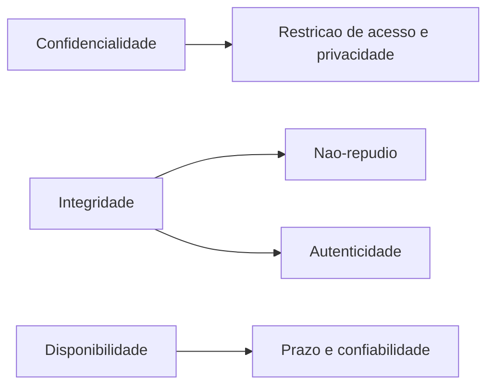

# Objetivos de segurança em conflito e o custo do high water mark

A tríade CIA aparece em toda proposta comercial de segurança e quase nunca é usada para decidir. As definições oficiais são mais específicas do que o resumo de corredor, e é essa especificidade que dá poder de argumentação ao CISO.

## 1. Objetivo de aprendizagem

Ao final deste tema você deve conseguir: explicar os três objetivos conforme as definições registradas pelo NIST e, diante de uma decisão de arquitetura concreta, indicar qual objetivo ela fortalece e qual ela sacrifica.

## 2. Pré-requisitos

[TEMA-01](TEMA-01-seguranca-informacao-cibernetica-privacidade.md), que delimita os escopos em que esses objetivos valem. O vocabulário dos três objetivos e a categorização de impacto do FIPS 199 em LOW, MODERATE e HIGH vieram de [00-guia-basico/TEMA-02](../00-guia-basico/TEMA-02-triade-cia.md): o que muda aqui é que os objetivos competem entre si, cada decisão de arquitetura troca um pelo outro, e o high water mark que sobe o sistema inteiro por causa de um único tipo de informação HIGH cobra o preço em controles e em orçamento.

## 3. Pré-teste

Responda de palpite, antes de ler o resto. Anote a confiança de 1 a 5.

1. Palpite: uma única política de segurança consegue melhorar os três objetivos ao mesmo tempo? Escreva um conflito que você já viveu.
   Confiança: ___
2. Chute: quando a empresa liga criptografia em todos os notebooks, qual objetivo você aposta que sofre primeiro no dia a dia?
   Confiança: ___
3. Antes de ler: a sua norma de disponibilidade fala em prazo, ou só em "sistema no ar"? Anote o que está escrito hoje.
   Confiança: ___

## 4. Caso real

Uma empresa de logística sofre uma tentativa de fraude: o criminoso envia, do domínio do fornecedor de transporte, um e-mail com a fatura alterada e a conta bancária trocada. Nenhuma informação foi exposta, o sistema de e-mails não caiu, nada foi apagado.

Ainda assim, o analista de contas a pagar aprovou o pagamento. Quando o CISO leva o caso ao comitê, o diretor financeiro pergunta qual controle falhou. A pergunta que o caso deixa aberta: qual dos três objetivos foi violado, se nada foi lido, alterado ou desligado?

## 5. Conteúdo

### 5.1 Conceito

Confidencialidade, no registro do glossário do NIST: "Preserving authorized restrictions on information access and disclosure, including means for protecting personal privacy and proprietary information". A origem citada é o FIPS 200, rastreando ao 44 U.S.C. § 3542, o mesmo texto legal que fundamenta a definição de segurança da informação. Note a palavra "authorized": confidencialidade não exige sigilo absoluto, exige que quem acessa esteja autorizado a acessar.

Integridade: "Guarding against improper information modification or destruction, and includes ensuring information nonrepudiation and authenticity". Esta é a definição mais mal citada da tríade. Ela não fala apenas de alteração indevida: inclui não-repúdio e autenticidade. Se um terceiro consegue afirmar algo em nome do seu domínio, integridade foi atingida mesmo com o dado intacto.

Disponibilidade: "Ensuring timely and reliable access to and use of information". Duas condições, "timely" e "reliable". Um sistema que responde em 40 segundos falha na primeira; um que responde rápido e perde pedidos no caminho falha na segunda. Disponibilidade também é medida por quem usa, não por quem opera.

A tríade costuma ser ampliada por outros objetivos — autenticidade, não-repúdio, rastreabilidade, privacidade. A definição de integridade acima já absorve dois deles, e a de confidencialidade absorve privacidade como meio, não como fim. Guardar a lista fechada em três itens limita a análise; o glossário do NIST lista os termos um por um, e vale consultá-los no verbete antes de usar qualquer um deles em política.

### 5.2 Como funciona

Os três objetivos competem por recursos e por configuração. Cada decisão de arquitetura move o ponto de equilíbrio, e o custo aparece no objetivo oposto.

Criptografia de disco ilustra o mecanismo. Cobre confidencialidade em caso de perda do equipamento. Se a chave de recuperação se perder, um chamado de suporte vira dano definitivo à disponibilidade. Backup deixa de ser redundância e passa a ser o único caminho de volta, o que cria cópias adicionais a proteger.

Redundância de servidores tem o mesmo desenho invertido. Cada réplica melhora disponibilidade e amplia o número de pontos onde confidencialidade pode falhar. Duas cópias exigem o dobro de controle de acesso, e a segunda cópia quase sempre fica em ambiente menos monitorado que a original.

Autenticação forte empurra o trade-off para o usuário. Aumenta integridade e autenticidade ao dificultar uso de credencial roubada, e pressiona disponibilidade quando o segundo fator não funciona para o plantonista às três da manhã. Por isso a decisão de MFA precisa de caminho alternativo documentado, e não de exceção informal.

### 5.3 Exemplo resolvido

Volte ao caso da fatura alterada e classifique objetivo por objetivo.

Passo 1, confidencialidade. Nada foi exposto. O criminoso usou informação que já circulava — nome do fornecedor, número da fatura, formato do documento. Confidencialidade não foi o problema central, embora a lista de fornecedores e de contatos de contas a pagar seja ativo classificado.

Passo 2, integridade. A definição inclui autenticidade e não-repúdio. O e-mail aparentava vir do domínio do fornecedor e não era dele. A decisão de pagamento se apoiou em um documento cujo autor não podia ser comprovado. Falha de integridade, sem alteração de dado interno.

Passo 3, disponibilidade. Sistemas no ar, prazos cumpridos. Não houve impacto.

Passo 4, decisão. A resposta correta ao diretor financeiro: falhou integridade, na dimensão de autenticidade e não-repúdio. Consequência prática: o controle a comprar é verificação de autenticidade da origem — assinatura de e-mail, política de rejeição, dupla confirmação de alteração bancária por canal fora da mensagem. Comprar mais firewall não atende a esse objetivo.

### 5.4 Problema de completar

Caso novo: para cumprir uma exigência interna, o time de plataforma ativou bloqueio de sessão após cinco minutos de inatividade no sistema de faturamento. O sistema é usado por técnicos que trabalham em campo com as mãos ocupadas.

Complete e feche as duas últimas etapas.

1. Objetivo principal da medida e objetivo secundário. __________
2. Objetivo afetado e para quem. __________
3. Dado observável que prova o efeito em 30 dias. __________
4. Ajuste que preserva os dois lados, com o critério de aceite. __________
5. Como registrar a decisão para a próxima revisão de controles. __________

## 6. Por que isso importa para o CISO

A tríade é o formato em que o comitê aceita discutir verba. Quando o CISO apresenta "vamos reforçar a segurança", a resposta é sempre "quanto custa". Quando apresenta "esta decisão troca 30 minutos de indisponibilidade por redução de exposição em equipamento perdido", a discussão vira escolha, com dono e critério.

Há um efeito no orçamento de controle. Objetivos diferentes compram produtos diferentes. Confidencialidade compra criptografia e controle de acesso. Integridade compra assinatura, trilha de auditoria e segregação de função. Disponibilidade compra redundância, capacidade e testagem de recuperação. Um plano que lista as três palavras na mesma frase, sem apontar qual delas consome cada linha de verba, não sustenta uma decisão de prioridade.

## 7. Aplicação prática

Pegue a última arquitetura aprovada na sua empresa — migração de nuvem, novo portal, troca de provedor. Escreva três colunas: objetivo fortalecido, objetivo sacrificado, quem aceitou o sacrifício. Se a terceira coluna estiver vazia, o sacrifício foi aceito por padrão, e ninguém assinou.

Depois escolha um sistema interno e pergunte ao dono do processo o que é pior: ficar fora do ar duas horas em dia útil, ou ter um registro alterado sem que ninguém perceba. A resposta ordena os controles dos próximos 12 meses.

## 8. Autoexplicação

Explique em três frases a diferença entre integridade e disponibilidade, sem consultar o texto. Ligue a explicação ao seu sistema de RH ou de faturamento: qual dos dois objetivos, se violado, produziria uma conversa mais difícil com o conselho?

## 9. Erros comuns e equívocos

| Equívoco | Por que está errado | O que é correto |
|---|---|---|
| Integridade significa apenas não alterar dados | A definição do NIST inclui não-repúdio e autenticidade | Fraude por falsa identidade de remetente é falha de integridade |
| Confidencialidade exige sigilo total | A definição fala de restrições autorizadas de acesso e divulgação | O critério é autorização, não ocultação |
| Disponibilidade se mede por uptime do servidor | A definição exige acesso pontual e confiável ao uso | Latência e perda de transação contam como indisponibilidade |
| A tríade tem três itens e nada mais | Autenticidade, não-repúdio e rastreabilidade aparecem como objetivos próprios na política de muitas empresas | Nomeie o objetivo extra em vez de escondê-lo dentro de outro |
| Melhorar um objetivo nunca piora outro | Toda configuração move o equilíbrio | Declare o trade-off e o dono do sacrifício |

## 10. Recuperação ativa

Responda tudo antes de abrir o gabarito.

1. Escreva o texto do NIST para integridade e explique por que autenticidade aparece nele.
2. Uma política de criptografia de disco atrasou em 40 minutos o atendimento em um posto de saúde. Qual objetivo foi afetado e por quê?
3. Dê um exemplo de controle que melhora dois objetivos e piora um terceiro.
4. Por que a definição de disponibilidade cita prazo e confiabilidade, e não apenas funcionamento?

Conferir respostas

1. "Guarding against improper information modification or destruction, and includes ensuring information nonrepudiation and authenticity". Autenticidade entra porque garantir que o dado não foi alterado não serve de nada se o autor declarado dele pode ser falsificado.
2. Disponibilidade, na dimensão de prazo e confiabilidade. Registro do glossário do NIST: "Ensuring timely and reliable access to and use of information".
3. Autenticação multifator melhora integridade e autenticidade, e expõe disponibilidade quando o segundo fator fica fora do ar para quem está em plantão.
4. Porque a informação precisa estar acessível no momento em que o negócio a usa, com resultado íntegro. Servidor no ar entregando resposta errada ou tardia continua sendo falha de disponibilidade.

## 11. Revisão espaçada

| Intervalo | O que fazer | Se errar |
|---|---|---|
| D+1 | Escrever as três definições de memória e comparar com o glossário | Rebaixar: repetir em D+1 |
| D+7 | Reanalisar o caso da fatura alterada sem reler a seção 5.3 | Rebaixar: repetir em D+3 |
| D+30 | Aplicar a seção 7 a uma arquitetura nova | Rebaixar: repetir em D+7 |

## 12. Conexões com outros temas

Leitura humana do `relacoes` do frontmatter — que é a fonte. Relações que saem desta área
também aparecem em [mapa-relacoes.md](../mapa-relacoes.md). Regras em
[templates/RELACOES-TEMAS.md](../templates/RELACOES-TEMAS.md).

| Relação | Alvo | Por que |
|---|---|---|
| aplicado_em | 07-criptografia-segredos#TEMA-01 | confidencialidade e integridade só se sustentam em primitivas criptográficas concretas |
| complementa | 01-fundamentos#TEMA-01 | os objetivos definidos aqui são o critério com que se avalia o escopo delimitado no TEMA-01 |
| complementa | 01-fundamentos#TEMA-03 | a classificação de um ativo é a tríade aplicada a um item concreto, com dono e prazo |

## 13. Certificações e leitura recomendada

| Certificação | Domínio | Recurso | Tipo | Fonte |
|---|---|---|---|---|
| Security+ | Fundamentos de segurança | CompTIA Security+ SY0-701 Exam Objectives | primaria | https://assets.ctfassets.net/82ripq7fjls2/6TYWUym0Nudqa8nGEnegjG/0f9b974d3b1837fe85ab8e6553f4d623/CompTIA-Security-Plus-SY0-701-Exam-Objectives.pdf |
| CISSP | Cobertura geral do tema | ISC2 CISSP Certification Exam Outline | primaria | https://www.isc2.org/certifications/cissp/cissp-certification-exam-outline |
| CC | Cobertura geral do tema | ISC2 Certified in Cybersecurity | primaria | https://www.isc2.org/certifications/cc |

## 14. Fontes verificadas

| # | Título | Tipo | URL | Acessado em | Confiança |
|---|---|---|---|---|---|
| 1 | NIST CSRC Glossary — confidentiality | primaria | https://csrc.nist.gov/glossary/term/confidentiality | "2026-09-25" | alta |
| 2 | NIST CSRC Glossary — integrity | primaria | https://csrc.nist.gov/glossary/term/integrity | "2026-09-25" | alta |
| 3 | NIST CSRC Glossary — availability | primaria | https://csrc.nist.gov/glossary/term/availability | "2026-09-25" | alta |

---

| Navegação | |
|---|---|
| Área | [01 Fundamentos de segurança da informação](./README.md) |
| Tema anterior | [TEMA-01](TEMA-01-seguranca-informacao-cibernetica-privacidade.md) |
| Próximo tema | [TEMA-03](TEMA-03-ativos-classificacao-ciclo-de-vida.md) |
| Home | [README](../README.md) |
