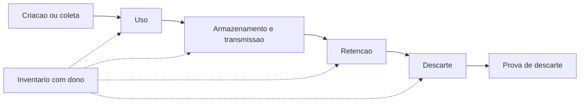

# Ativos, classificação e ciclo de vida da informação

Nenhum controle é decidível antes de existir inventário. O número de ativos sem dono é o principal indicador de maturidade de um programa, e ele costuma ser maior do que o CISO imagina.

## 1. Objetivo de aprendizagem

Ao final deste tema você deve conseguir: montar o inventário de 15 ativos de um processo de negócio com dono nomeado, nível de classificação justificado, prazo de retenção e forma de descarte, a partir de fontes de dados que a empresa já possui.

## 2. Pré-requisitos

[TEMA-02](TEMA-02-triade-cia-e-objetivos-de-seguranca.md). Sem os objetivos de segurança não existe critério para atribuir nível a um ativo.

## 3. Pré-teste

Responda de palpite, antes de ler o resto. Anote a confiança de 1 a 5.

1. Chute: quantos ativos a sua empresa declararia ter se o inventário fosse fechado hoje? Marque uma ordem de grandeza.
   Confiança: ___
2. Palpite: o mesmo servidor pode ser ativo em uma empresa e irrelevante em outra? Sim ou não, e por quê na sua leitura de hoje.
   Confiança: ___
3. Quem você apontaria como dono do conjunto de dados de clientes: o time que administra o banco, a área comercial ou ninguém? Aposte um nome.
   Confiança: ___

## 4. Caso real

No fim de um ciclo de auditoria, o auditor pede prova de descarte de dados de clientes inativos. A empresa não tem essa prova. A busca encontra quatro conjuntos de dados vivos: a base de produção, uma cópia restaurada para teste em 2019, um arquivo compactado em um servidor de arquivos de um setor que mudou de nome duas vezes, e 3.400 registros dentro de uma ferramenta de marketing contratada como serviço.

Nenhum dos quatro conjuntos tem dono nomeado. O jurídico pergunta quem autorizou a guarda. A pergunta que o caso deixa aberta: quantos ativos de informação a empresa mantém sem saber que mantém, e qual deles decide o custo de um incidente?

## 5. Conteúdo

### 5.1 Conceito

Ativo, no glossário do NIST, é "an item of value to the achievement of organizational mission/business objectives". A definição tem uma consequência incômoda: o valor é definido pelo objetivo de negócio, não pela tecnologia envolvida. Um script de 300 linhas que calcula o preço de venda pode ser mais valioso que um servidor caro.

O mesmo verbete registra outra definição, vinda do CNSSI 4009-2022: "a distinguishable entity that provides a service or capability", com a observação de que ativos são pessoas, entidades físicas ou informação. Isso amplia o inventário para além dos itens de TI. Um contrato com fornecedor, a conta de e-mail de um diretor e a sala onde ficam os servidores entram na lista.

Classificação é o resultado de uma pergunta única: qual o impacto de uma falha de confidencialidade, integridade ou disponibilidade neste ativo? O nível atribuído passa a determinar o conjunto de controles, o prazo de guarda e o rigor do descarte. Sem esse vínculo, o nível vira etiqueta decorativa e a política perde função.

Existem catálogos de classificação em norma, e as versões vigentes das normas de gestão não foram conferidas nesta execução: NAO CONFIRMADO em fonte oficial para o número de controles do Anexo A da ISO/IEC 27001:2022 e para o ano da edição em vigor. Não cite contagem de controles nem ano de edição antes de confirmar no catálogo oficial.

### 5.2 Como funciona

O inventário é a tabela. O ciclo de vida é o estado de cada linha ao longo do tempo. Os dois se mantêm juntos, ou nenhum dos dois sobrevive ao primeiro trimestre.

Cinco campos fazem um inventário ser utilizável. Nome do ativo, dono nomeado com cargo, nível de classificação, prazo de retenção e forma de descarte prevista. Faltando dono, ninguém responde pela decisão. Faltando retenção, a cópia vive para sempre. Faltando descarte previsto, a auditoria encontra o que o caso real mostrou.

O nível de classificação define o custo. Um ativo no nível mais alto recebe cifra, controle de acesso nominal, trilha de auditoria e descarte certificado. Se todo o inventário sobe para o nível mais alto, o custo por ativo iguala o orçamento e a única saída prática é reduzir o escopo do programa. Classificar demais é a forma mais rápida de não proteger nada.

Há duas armadilhas na mecânica. A primeira é tratar o dono do ativo como sinônimo de administrador de sistema: o administrador opera, o dono responde pelo uso. A segunda é classificar apenas o dado em repouso e esquecer as cópias derivadas — backup, réplica de leitura, ambiente de teste, exportação em planilha. Cada cópia é um ativo com o mesmo nível.

### 5.3 Exemplo resolvido

Uma clínica odontológica com três unidades decide montar o inventário de um processo único: atendimento de paciente com plano de saúde. Seis ativos entram na primeira versão.

| Ativo | Dono | Nível | Retenção | Descarte previsto |
|---|---|---|---|---|
| Prontuário clínico no sistema de gestão | Diretora clínica | alto | prazo definido em contrato com o plano, a confirmar | expurgo no sistema com registro de trilha |
| Planilha de faturamento de convênios | Coordenadora financeira | alto | até fechamento da competência mais auditoria do plano | destruição lógica do arquivo e das cópias em e-mail |
| Servidor de arquivos da unidade central | Gerente de TI | intermediario | conforme os arquivos armazenados | sobrescrita e descarte físico do disco |
| Notebook da dentista plantonista | própria dentista | alto | vida útil do equipamento | apagamento criptográfico pelo disco cifrado |
| Conta de e-mail do financeiro | Coordenadora financeira | alto | enquanto durar o vínculo mais retenção fiscal | desativação e expurgo da caixa |
| Contrato assinado com o plano de saúde | Diretoria | intermediario | prazo contratual e prescricional, a confirmar com o jurídico | digitalização e guarda do original |

Leitura da tabela: dois itens carregam "a confirmar", e é isso que a primeira versão deve mostrar. Inventário que nasce completo nasceu falso. O valor do exercício é expor a decisão pendente com nome do dono ao lado.

Nível alto aqui não significa "dado sensível" por definição legal — significa que uma falha de confidencialidade ou integridade nesse ativo interrompe receita, gera questionamento do paciente ou trava o repasse do convênio. O critério é sempre o impacto no objetivo de negócio.

### 5.4 Problema de completar

Três ativos novos entram no inventário da mesma clínica. Complete as colunas e feche as duas últimas etapas.

| Ativo | Dono | Nível | Retenção | Descarte previsto |
|---|---|---|---|---|
| Foto de radiografia guardada no celular da dentista | __________ | __________ | __________ | __________ |
| Sistema de gestão contratado como serviço | __________ | __________ | __________ | __________ |
| Lista de pacientes com parcelas em atraso, em arquivo de texto | __________ | __________ | __________ | __________ |

1. Qual dos três tem o pior descarte previsto hoje, e por quê? __________
2. Que ação de 30 dias reduz o número de cópias não inventariadas do caso real? __________

## 6. Por que isso importa para o CISO

O inventário define o denominador de qualquer métrica que o CISO apresenta. "Cobrimos 92% dos ativos críticos com autenticação forte" é uma frase forte ou vazia, dependendo de o inventário ter 200 ou 2.000 linhas. Sem denominador, a métrica vira opinião na segunda pergunta do conselho.

Há também efeito direto na apólice e no contrato. Seguradora pede quantidade e classificação de registros; contrato de nuvem pede o escopo de dados tratados; o processo de resposta a incidente precisa saber a quem comunicar primeiro. Os três pedidos se respondem com a mesma tabela, e nenhum se responde com uma planilha desatualizada de dois anos.

## 7. Aplicação prática

Escolha um processo de negócio com começo e fim claros — fechamento de folha, abertura de conta, emissão de laudo. Liste 15 ativos, incluindo pessoas e contratos. Para cada linha: dono com cargo, nível, retenção e descarte.

Depois responda três perguntas por escrito. Quantas linhas ficaram sem dono? Quantas têm prazo de retenção definido por alguém fora da TI? Quantas dependem de um fornecedor para serem descartadas? As respostas são o seu mapa de dependências.

## 8. Autoexplicação

Explique em três frases por que o dono do ativo não pode ser o time de TI. Ligue a explicação a um sistema que você usa hoje: quem, fora da TI, hoje poderia dizer que aquele dado não é mais necessário?

## 9. Erros comuns e equívocos

| Equívoco | Por que está errado | O que é correto |
|---|---|---|
| Inventário de ativos é inventário de servidores | A definição inclui pessoas, entidades físicas e informação | Contrato, conta, sala e planilha entram na lista |
| Classificar tudo como confidencial protege mais | O custo do controle mais alto passa a valer para tudo, e o programa perde foco | Níveis diferentes compram conjuntos de controle diferentes |
| Dono do ativo é o administrador do sistema | O administrador opera; o dono responde pelo uso e pelo prazo | Nomeie o dono com cargo, no negócio |
| Backup e ambiente de teste não são ativos | Cada cópia tem o mesmo nível do original e quase nenhum controle | Inventarie as cópias derivadas, com o mesmo nível |
| Retenção é assunto de arquivamento, não de segurança | O prazo determina há quanto tempo um vazamento pode doer | Retenção é campo obrigatório do inventário |
| Descarte sem registro é descarte | Sem prova, a auditoria trata o dado como existente | Registre o descarte com data, método e responsável |

## 10. Recuperação ativa

Responda tudo antes de abrir o gabarito.

1. Escreva a definição de ativo registrada no glossário do NIST e explique por que ela depende do negócio.
2. Por que o dono do ativo não pode ser o time de TI?
3. Quais três campos do inventário precisam existir antes de decidir o conjunto de controles de um ativo?
4. Uma auditoria pede prova de descarte e a empresa tem quatro cópias do conjunto de dados. O que faltava no inventário para o descarte ser executável?
5. Qual o efeito de classificar todos os ativos no nível mais alto?

Conferir respostas

1. "An item of value to the achievement of organizational mission/business objectives". O valor é atribuído pelo objetivo de negócio, então o mesmo item pode ser ativo em uma empresa e irrelevante em outra.
2. Porque a decisão do que fazer com o dado (usar, compartilhar, guardar, descartar) pertence a quem responde pela consequência no negócio. O time de TI opera e não decide prazo nem finalidade.
3. Dono nomeado com cargo, nível de classificação e prazo de retenção, com a forma de descarte declarada.
4. A lista completa de cópias derivadas, cada uma com dono e localização. O descarte é executável quando se sabe onde estão todas as réplicas e quem responde por cada uma.
5. O custo do controle mais rigoroso passa a valer para todo o inventário, o orçamento não fecha e o caminho prático vira reduzir o escopo do programa.

## 11. Revisão espaçada

| Intervalo | O que fazer | Se errar |
|---|---|---|
| D+1 | Refazer a tabela da seção 5.3 sem consultar | Rebaixar: repetir em D+1 |
| D+7 | Adicionar cinco ativos novos ao inventário da seção 7 | Rebaixar: repetir em D+3 |
| D+30 | Testar um descarte real e guardar a prova | Rebaixar: repetir em D+7 |

## 12. Conexões com outros temas

Leitura humana do `relacoes` do frontmatter — que é a fonte. Relações que saem desta área
também aparecem em [mapa-relacoes.md](../mapa-relacoes.md). Regras em
[templates/RELACOES-TEMAS.md](../templates/RELACOES-TEMAS.md).

| Relação | Alvo | Por que |
|---|---|---|
| aplicado_em | 01-fundamentos#TEMA-07 | o nível de classificação é o que define qual conjunto de controles o ativo recebe |
| aplicado_em | 14-dados-privacidade#TEMA-02 | classificar ativo e inventariar dado pessoal são a mesma disciplina com obrigação legal distinta |
| complementa | 01-fundamentos#TEMA-02 | a classificação é a tríade aplicada a um item concreto, e sem os objetivos não há critério de nível |

## 13. Certificações e leitura recomendada

| Certificação | Domínio | Recurso | Tipo | Fonte |
|---|---|---|---|---|
| Security+ | Fundamentos de segurança | CompTIA Security+ SY0-701 Exam Objectives | primaria | https://assets.ctfassets.net/82ripq7fjls2/6TYWUym0Nudqa8nGEnegjG/0f9b974d3b1837fe85ab8e6553f4d623/CompTIA-Security-Plus-SY0-701-Exam-Objectives.pdf |
| CISM | Governança da informação | ISACA CISM Exam Content Outline | primaria | https://www.isaca.org/credentialing/cism/cism-exam-content-outline |
| CISSP | Cobertura geral do tema | ISC2 CISSP Certification Exam Outline | primaria | https://www.isc2.org/certifications/cissp/cissp-certification-exam-outline |

## 14. Fontes verificadas

| # | Título | Tipo | URL | Acessado em | Confiança |
|---|---|---|---|---|---|
| 1 | NIST CSRC Glossary — asset | primaria | https://csrc.nist.gov/glossary/term/asset | "2026-09-25" | alta |
| 2 | NIST CSRC Glossary — confidentiality | primaria | https://csrc.nist.gov/glossary/term/confidentiality | "2026-09-25" | alta |
| 3 | NIST Cybersecurity Framework 2.0 — NIST SP 1299 | primaria | https://nvlpubs.nist.gov/nistpubs/SpecialPublications/NIST.SP.1299.pdf | "2026-09-25" | alta |

---

| Navegação | |
|---|---|
| Área | [01 Fundamentos de segurança da informação](./README.md) |
| Tema anterior | [TEMA-02](TEMA-02-triade-cia-e-objetivos-de-seguranca.md) |
| Próximo tema | [TEMA-04](TEMA-04-ameacas-atores-motivacoes.md) |
| Home | [README](../README.md) |
