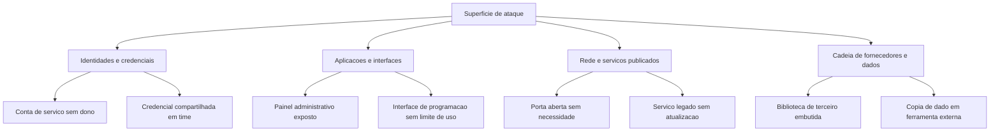

# Vulnerabilidades, exposição e superfície de ataque

Relatório de varredura lista falhas. Ele não lista o que o atacante alcança. A diferença entre as duas coisas é a informação que decide prioridade, e ela quase nunca está no relatório.

## 1. Objetivo de aprendizagem

Ao final deste tema você deve conseguir: descrever a superfície de ataque de um serviço exposto, distribuindo os pontos em quatro famílias, e separar o que é alcançável de fora daquilo que está falho internamente.

## 2. Pré-requisitos

[TEMA-04](TEMA-04-ameacas-atores-motivacoes.md), porque vulnerabilidade só importa na presença de uma fonte de ameaça.

## 3. Pré-teste

Responda de palpite, antes de ler o resto. Anote a confiança de 1 a 5.

1. Chute: quantos sistemas da sua empresa estão publicados na internet hoje? Anote a estimativa antes de pedir o número ao time.
   Confiança: ___
2. Palpite: tirar um serviço da internet reduz mais risco do que aplicar o patch pendente dele, ou menos? Escolha.
   Confiança: ___
3. Antes de ler: qual artefato você levaria para provar a superfície de ataque da empresa — relatório de varredura, diagrama de rede ou inventário? Escolha um e escreva por quê.
   Confiança: ___

## 4. Caso real

No fim de 2021, a divulgação de uma falha em uma biblioteca de registro de logs usada por milhares de aplicações Java virou um problema de inventário, e não de correção. Empresas que sabiam aplicar a atualização não sabiam onde estavam todas as instâncias da biblioteca, inclusive dentro de produtos de fornecedores. A referência oficial do caso é a identificação CVE-2021-44228 no catálogo do NVD, que não foi conferida nesta execução: NAO CONFIRMADO em fonte oficial.

O time de segurança tinha a correção e não tinha a lista. A pergunta que o caso deixa aberta: o que precisa existir antes para que uma falha de gravidade máxima seja tratável em horas, e não em semanas?

## 5. Conteúdo

### 5.1 Conceito

Vulnerabilidade, no glossário do NIST: "Weakness in an information system, system security procedures, internal controls, or implementation that could be exploited or triggered by a threat source". A definição é mais larga do que a prática de mercado. Procedimento deficiente, controle interno mal desenhado e erro de implementação entram no mesmo verbete que a falha de código. Uma política de troca de senha que depende de memória do usuário é vulnerabilidade, mesmo com todo o software atualizado.

Superfície de ataque, no mesmo glossário, com origem no NIST SP 800-53 Rev. 5: "The set of points on the boundary of a system, a system component, or an environment where an attacker can try to enter, cause an effect on, or extract data from, that system, component, or environment". Três verbos definem a fronteira: entrar, causar efeito e extrair dado. Uma interface de administração que só permite desligar um serviço já é superfície, mesmo sem expor informação.

Exposição é um predicado, não uma qualidade. O mesmo ponto está exposto para alguém em rede corporativa e não exposto para a internet, e a pergunta útil é sempre "exposto para quem, a partir de onde". Um banco de dados sem cifra atrás de dois controles de rede tem exposição diferente de outro idêntico com porta aberta para o mundo, e o relatório que ignora essa diferença produz prioridade errada.

A definição de ameaça já liga os dois lados: ela fala do potencial de a fonte de ameaça "successfully exploit a particular information system vulnerability". Falha sem fonte de ameaça com acesso não produz incidente, e fonte de ameaça sem falha alcançável produz tentativa frustrada. Priorizar exige os dois.

### 5.2 Como funciona

Descrever superfície é listar pontos por família, antes de qualquer scanner. Quatro famílias cobrem a maior parte do que se vê em um serviço exposto.

A ordem importa. Reduzir superfície tem prioridade sobre corrigir falha, porque um ponto que deixa de existir não precisa ser atualizado, monitorado nem auditado. Desligar um painel administrativo que passou a ser acessado por rede interna remove uma família inteira de trabalho futuro.

Existem três movimentos de redução, e eles custam pouco. Desligar o que ninguém usa. Restringir a origem de rede de quem usa. Reduzir o número de identidades que alcançam o ponto. Cada movimento tem efeito permanente e não depende de fornecedor.

A correção entra depois, e a ordem entre correções segue a mesma lógica de exposição: falha alcançável de fora, em ponto sem autenticação, supera em prioridade falha crítica inalcançável. O relatório de varredura entrega a gravidade da falha; a superfície entrega o alcance. A prioridade nasce da combinação, e é o elo que falta na maioria dos planos.

Resta um ponto que o CISO precisa aceitar. Inventário incompleto produz superfície desconhecida, e superfície desconhecida não entra em gráfico. O caso real é sobre isso: o problema não era a falha, era não saber onde ela estava.

### 5.3 Exemplo resolvido

Portal de autoatendimento de um plano de saúde, com 6 pontos identificados. Objetivo: ordenar as ações da semana.

| # | Ponto | Família | Exposto a quem | Vulnerabilidade conhecida | Ação |
|---|---|---|---|---|---|
| 1 | Painel administrativo do portal | Aplicação | internet, descoberto por varredura | versão antiga com falha pública | retirar da internet hoje e aplicar atualização na sequência |
| 2 | Interface de programação de consulta de beneficiário | Aplicação | parceiros cadastrados | sem limite de requisições | limitar taxa e exigir autenticação por parceiro |
| 3 | Conta de serviço do integrador de faturamento | Identidade | rede interna, usada por script | senha fixa desde a implantação | rotacionar e vincular à identidade do script |
| 4 | Porta de banco de dados no servidor de relatórios | Rede | internet, restrita por regra antiga | sem falha conhecida | remover a publicação; não há consumidor externo |
| 5 | Biblioteca embutida no módulo de anexos | Fornecedor | indireto, via aplicação | dependência desatualizada | cobrar plano de correção do fornecedor e monitorar |
| 6 | Exportação de beneficiários usada por corretor externo | Dados | terceiro, por e-mail | planilha sem controle de destino | reduzir colunas, estabelecer prazo de descarte e registrar |

Leitura da tabela. O item 1 tem exposição e falha ao mesmo tempo, e por isso vem primeiro. O item 4 não tem falha conhecida e ainda assim vem antes do item 5: remover exposição desnecessária encerra a discussão em vez de adiá-la para o próximo ciclo de atualização. O item 5 depende de terceiro e por isso recebe controle de acompanhamento, não promessa de prazo próprio.

### 5.4 Problema de completar

Caso novo: uma indústria conecta o sistema de apontamento de produção à rede corporativa para gerar relatórios para a diretoria.

| # | Ponto | Família | Exposto a quem | Vulnerabilidade | Ação |
|---|---|---|---|---|---|
| 1 | Estação de operação na fábrica com sessão aberta | __________ | __________ | __________ | __________ |
| 2 | Serviço de banco do apontamento acessível pela rede corporativa | __________ | __________ | __________ | __________ |
| 3 | Fornecedor de manutenção com acesso remoto permanente | __________ | __________ | __________ | __________ |

1. Qual dos três pede redução de superfície antes de correção, e por quê? __________
2. O que precisa existir para o item 3 deixar de ser risco permanente? __________

## 6. Por que isso importa para o CISO

Contagem de vulnerabilidades é a métrica que mais engana o CISO. O número sobe com o tamanho do inventário, e por isso cai quando a empresa melhora. Quando o conselho pede redução desse número e o CISO obedece, a consequência é reduzir a frequência de varredura e perder visibilidade.

A métrica que sustenta decisão é outra: quantos pontos expostos à internet ainda existem, e quantos foram removidos neste trimestre. Ela mede trabalho com efeito permanente, resiste à manipulação de escopo e conversa com risco sem exigir conhecimento técnico do conselho.

## 7. Aplicação prática

Pegue a arquitetura do serviço mais exposto da sua empresa e desenhe as quatro famílias da seção 5.2, preenchendo cada uma com o que existe. Sem scanner, sem fornecedor: use o que a equipe de operações já sabe.

Depois marque, em cada ponto, quem consegue alcançá-lo hoje: internet, parceiro, rede interna, administrador local. Conte quantos pontos são alcançáveis de fora sem autenticação. Esse número é o seu principal indicador de exposição, e vale mais do que qualquer nota de risco agregada.

## 8. Autoexplicação

Explique em três frases por que reduzir superfície pode valer mais do que corrigir a falha que o relatório apontou. Ligue a explicação a uma decisão que você já tomou: alguma vez aprovou exceção de firewall para um serviço que ninguém mais usava?

## 9. Erros comuns e equívocos

| Equívoco | Por que está errado | O que é correto |
|---|---|---|
| Vulnerabilidade é falha de software | A definição inclui procedimento, controle interno e implementação | Processo deficiente é vulnerabilidade tanto quanto código |
| Fora do escopo do scanner significa sem exposição | O scanner mede falha conhecida, não alcance | Descreva a superfície antes de rodar a varredura |
| Corrigir tudo é sempre a resposta | Ponto removido não precisa de correção, monitoramento nem auditoria | Reduza o que ninguém usa antes de atualizar o que sobra |
| Gravidade do fabricante define a prioridade | Gravidade ignora se o ponto é alcançável | Combine alcance e falha para priorizar |
| Superfície de ataque é assunto de aplicação web | A definição fala de sistema, componente e ambiente | Identidade, rede, terceiro e dado também compõem a superfície |
| Inventário de superfície pode esperar o inventário de ativos | Sem o segundo, o primeiro é desconhecido em parte | Trate os dois levantamentos como o mesmo trabalho |

## 10. Recuperação ativa

Responda tudo antes de abrir o gabarito.

1. Escreva a definição de superfície de ataque registrada pelo NIST e diga quais três verbos ela usa.
2. Por que reduzir superfície pode valer mais do que corrigir a falha apontada pela varredura?
3. Um sistema sem vulnerabilidade conhecida está publicado na internet. Ele tem risco? Por quê?
4. Como separar exposição de vulnerabilidade em um relatório para a diretoria?
5. Qual o erro de tratar "fora do escopo da varredura" como "sem exposição"?

Conferir respostas

1. "The set of points on the boundary of a system, a system component, or an environment where an attacker can try to enter, cause an effect on, or extract data from, that system, component, or environment". Os verbos são entrar, causar efeito e extrair dado.
2. Porque ponto removido deixa de existir como trabalho futuro: não precisa de atualização, monitoramento, auditoria nem exceção documentada. A correção trata de um ponto que continua existindo.
3. Sim. Falha não conhecida não é ausência de falha, e exposição por si só cria a oportunidade para fonte de ameaça com acesso. Risco depende também do impacto do ativo.
4. Separe em duas colunas: quem alcança o ponto e o que se sabe sobre falha nele. A prioridade vem da combinação, não de nenhum dos dois isolado.
5. A varredura cobre o que foi incluído no escopo. Fora dele, a informação de alcance continua válida, e o ponto segue alcançável por quem tem acesso.

## 11. Revisão espaçada

| Intervalo | O que fazer | Se errar |
|---|---|---|
| D+1 | Reescrever as duas definições de memória | Rebaixar: repetir em D+1 |
| D+7 | Refazer a tabela da seção 5.3 com outro serviço | Rebaixar: repetir em D+3 |
| D+30 | Contar os pontos alcançáveis de fora sem autenticação e comparar com o mês anterior | Rebaixar: repetir em D+7 |

## 12. Conexões com outros temas

Leitura humana do `relacoes` do frontmatter — que é a fonte. Relações que saem desta área
também aparecem em [mapa-relacoes.md](../mapa-relacoes.md). Regras em
[templates/RELACOES-TEMAS.md](../templates/RELACOES-TEMAS.md).

| Relação | Alvo | Por que |
|---|---|---|
| aplicado_em | 12-vulnerabilidades-threat-intel#TEMA-02 | superfície de ataque é o que a priorização por risco real precisa medir |
| complementa | 01-fundamentos#TEMA-04 | ameaça sem falha alcançável não gera incidente; os dois lados do par precisam ser lidos juntos |
| nao_confundir_com | 01-fundamentos#TEMA-06 | vulnerabilidade é a falha interna medida em existência; risco é a combinação dela com ameaça e impacto |

## 13. Certificações e leitura recomendada

| Certificação | Domínio | Recurso | Tipo | Fonte |
|---|---|---|---|---|
| Security+ | Fundamentos de segurança e gerenciamento de vulnerabilidades | CompTIA Security+ SY0-701 Exam Objectives | primaria | https://assets.ctfassets.net/82ripq7fjls2/6TYWUym0Nudqa8nGEnegjG/0f9b974d3b1837fe85ab8e6553f4d623/CompTIA-Security-Plus-SY0-701-Exam-Objectives.pdf |
| CISSP | Cobertura geral do tema | ISC2 CISSP Certification Exam Outline | primaria | https://www.isc2.org/certifications/cissp/cissp-certification-exam-outline |

## 14. Fontes verificadas

| # | Título | Tipo | URL | Acessado em | Confiança |
|---|---|---|---|---|---|
| 1 | NIST CSRC Glossary — vulnerability | primaria | https://csrc.nist.gov/glossary/term/vulnerability | "2026-09-25" | alta |
| 2 | NIST CSRC Glossary — attack surface | primaria | https://csrc.nist.gov/glossary/term/attack_surface | "2026-09-25" | alta |
| 3 | NIST CSRC Glossary — threat | primaria | https://csrc.nist.gov/glossary/term/threat | "2026-09-25" | alta |

---

| Navegação | |
|---|---|
| Área | [01 Fundamentos de segurança da informação](./README.md) |
| Tema anterior | [TEMA-04](TEMA-04-ameacas-atores-motivacoes.md) |
| Próximo tema | [TEMA-06](TEMA-06-risco-probabilidade-impacto.md) |
| Home | [README](../README.md) |
