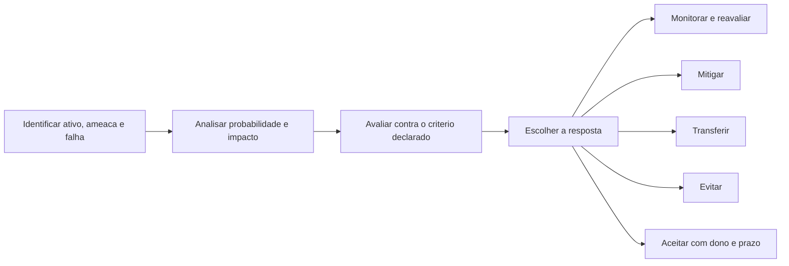

# Risco: probabilidade, impacto e risco residual

Risco é o único conceito desta área que aparece na ata do conselho. Sem ele, segurança compete por verba usando adjetivo; com ele, compete usando número e critério.

## 1. Objetivo de aprendizagem

Ao final deste tema você deve conseguir: avaliar um risco identificado com probabilidade, impacto e risco residual, escolhendo entre mitigar, transferir, evitar e aceitar, com o critério de decisão escrito e o dono nomeado.

## 2. Pré-requisitos

[TEMA-02](TEMA-02-triade-cia-e-objetivos-de-seguranca.md) fornece os objetivos que definem impacto, e [TEMA-05](TEMA-05-vulnerabilidades-superficie-de-ataque.md) fornece o lado da falha. Sem os dois, a probabilidade fica arbitrária.

## 3. Pré-teste

Responda de palpite, antes de ler o resto. Anote a confiança de 1 a 5.

1. Chute: qual escala a sua empresa usa hoje para probabilidade — percentual, faixa de 1 a 5, ou nenhuma? Anote.
   Confiança: ___
2. Palpite: quantos riscos a sua empresa tem aceitos por escrito, com assinatura? Escreva o número ou "nenhum".
   Confiança: ___
3. Antes de ler: quem aprova o valor máximo de exposição de um evento único na sua organização? Aposte um cargo.
   Confiança: ___

## 4. Caso real

Uma distribuidora de médio porte descobre que o painel de administração do sistema de pedidos está publicado na internet, sem autenticação multifator, com a versão da semana anterior. O gestor de TI classifica como "risco alto" e pede 180 mil reais para trocar o sistema.

O CISO propõe outra coisa: retirar a publicação hoje, ativar autenticação multifator em 30 dias e manter o sistema. Custo estimado: pequeno. No fim do ano, o mesmo relatório aparece com "risco alto" em três itens diferentes, com custos propostos que somam mais que o orçamento anual de segurança. A pergunta que o caso deixa aberta: o que separa o risco que exige verba do risco que exige decisão de governança neste trimestre?

## 5. Conteúdo

### 5.1 Conceito

Risco, no glossário do NIST: "A measure of the extent to which an entity is threatened by a potential circumstance or event, and typically is a function of: (i) the adverse impact, or magnitude of harm, that would arise if the circumstance or event occurs; and (ii) the likelihood of occurrence". A página registra duas origens para o verbete: a OMB Circular A-130 e o NIST SP 800-30 Rev. 1, a publicação de avaliação de risco.

Duas consequências saem dessa definição. A primeira: risco não é sinônimo de ameaça, de vulnerabilidade nem de impacto. É uma medida composta, e quem apresenta só um dos componentes não está falando de risco. A segunda: sem magnitude de dano declarada em unidade compreensível, a medida não serve para comparar dois itens.

Risco residual, no mesmo glossário: "Portion of risk remaining after security measures have been applied". O verbete registra também a formulação do NISTIR 8286, "risk that remains after risk responses have been documented and performed". As duas frases cobram coisas diferentes. A primeira pede que exista controle; a segunda pede que a resposta esteja documentada e executada. Um controle aprovado e não implantado não altera risco residual, ainda que apareça no plano.

Vale fixar o vocabulário de três termos que aparecem juntos. Risco inerente é o risco antes dos controles. Risco residual é o que sobra depois. Apetite de risco é o limiar a partir do qual o risco deixa de ser aceitável sem decisão de nível superior, e esse limiar é matéria da área 02, não deste tema. Apresentar risco residual sem apetite declarado deixa a decisão sem régua.

### 5.2 Como funciona

O cálculo qualitativo roda em cinco etapas, e a ordem é o que impede a discussão de travar.

Primeiro se define a escala, depois se pontua. Escala de probabilidade ancorada em observação — quantas vezes por ano algo parecido aconteceu — produz resultado comparável. Impacto precisa de âncora em unidade de negócio: horas de parada, valor de transação interrompida, número de clientes afetados, obrigação contratual descumprida. Escala de "1 a 5" sem âncora produz notas que mudam conforme quem preenche.

Depois se escolhe a resposta. Mitigar reduz probabilidade ou impacto com um controle. Transferir move a consequência financeira para um terceiro, por apólice ou cláusula contratual, sem reduzir a probabilidade do evento. Evitar remove a atividade que gera o risco. Aceitar registra a decisão de conviver com o risco residual, com dono e prazo de revisão.

Três armadilhas aparecem na prática. A primeira é usar o produto de probabilidade por impacto como se fosse dinheiro: a multiplicação ordena itens, não estima prejuízo. A segunda é declarar risco residual igual a zero depois de comprar ferramenta. A terceira é aceitar risco sem registro: sem dono e sem data de revisão, o risco aceito volta como surpresa no pior momento.

### 5.3 Exemplo resolvido

Três riscos de uma loja virtual, com números ilustrativos para mostrar o mecanismo. Escala de probabilidade de 1 a 5 ancorada em frequência anual observada, escala de impacto de 1 a 5 ancorada em horas de parada e perda de receita. O apetite da empresa, suposto neste exemplo, é não aceitar risco de impacto 4 ou 5 sem decisão da diretoria.

| # | Risco | Probabilidade | Impacto | Risco inerente | Controle escolhido | Risco residual | Resposta |
|---|---|---|---|---|---|---|---|
| 1 | Painel administrativo publicado sem MFA | 3 | 5 | 15 | retirar publicação e ativar MFA | 3 | mitigar |
| 2 | Conta de serviço do integrador com senha fixa | 4 | 4 | 16 | rotacionar e vincular ao script | 6 | mitigar |
| 3 | Backup sem teste de restauração | 2 | 5 | 10 | testar restauração trimestralmente | 4 | mitigar com evidência |

Passo a passo do item 1. Risco inerente 15, acima do apetite suposto. Primeira medida: remover a publicação, que reduz probabilidade de acesso externo, sem custo relevante. Segunda: ativar autenticação multifator, que reduz probabilidade de uso de credencial roubada. Risco residual 3, dentro do apetite, com decisão registrada e dono nomeado.

O item 2 mostra por que risco residual não acompanha o risco inerente. O controle reduz o alcance da credencial, não a possibilidade de ela ser usada. Residual 6 permanece acima do apetite para impacto 4, e por isso a decisão precisa de registro formal e prazo de revisão.

O item 3 tem risco inerente menor e continua prioritário na prática, porque afeta a capacidade de recuperação de todos os outros riscos. Ordenação por número puro não substitui julgamento: dois itens com a mesma pontuação podem ter urgências diferentes conforme o ativo que protegem.

### 5.4 Problema de completar

Caso novo: uma clínica tem dois riscos na fila. Escala igual à do exemplo, apetite suposto: não aceitar impacto 5 sem decisão da diretoria.

| # | Risco | Probabilidade | Impacto | Inerente | Controle escolhido | Residual | Resposta |
|---|---|---|---|---|---|---|---|
| 1 | Prontuário acessível por senha compartilhada entre recepção e enfermagem | 4 | 5 | __________ | identidade nominal por usuário | __________ | __________ |
| 2 | Equipamento de imagem com sistema operacional fora de suporte do fornecedor | 2 | 4 | __________ | segmentar a rede do equipamento | __________ | __________ |

1. Qual dos dois exige decisão da diretoria mesmo depois do controle? __________
2. Que evidência precisa existir para o risco residual do item 2 ser considerado aceito? __________

## 6. Por que isso importa para o CISO

O orçamento de segurança se defende com risco residual aceito e registrado, não com risco evitado. A pergunta do comitê de auditoria é sempre a mesma: o que a empresa decidiu conviver, por quanto tempo e quem assinou. Um programa que reduz todos os riscos a zero no relatório perde credibilidade no primeiro incidente.

Há também o efeito sobre a apólice e o contrato. Seguradora e cliente corporativo avaliam risco residual, não risco inerente. Um CISO que reporta só risco inerente inflaciona o problema; um que reporta só risco residual esconde o que ainda depende de controle não implantado.

## 7. Aplicação prática

Escolha três riscos reais que já estão na sua lista. Defina a escala de probabilidade e a de impacto por escrito, com âncora observável, antes de pontuar qualquer item. Registre: risco inerente, controle escolhido com data prevista de operação, risco residual e resposta.

Depois faça o teste da régua. Leve a lista a alguém de negócio e peça que reclassifique os três sem ver suas notas. Divergência de dois pontos em um mesmo item indica âncora fraca, não erro do colega.

## 8. Autoexplicação

Explique em três frases por que risco residual não é o risco depois de comprar a ferramenta. Ligue a explicação a um controle que você já aprovou: ele está em operação hoje, ou apenas no plano?

## 9. Erros comuns e equívocos

| Equívoco | Por que está errado | O que é correto |
|---|---|---|
| Vulnerabilidade crítica é risco crítico | Gravidade da falha ignora ameaça com acesso e impacto no negócio | Risco combina falha, ameaça, probabilidade e impacto |
| Multiplicar pontuação estima prejuízo | O produto ordena itens e não mede dinheiro | Use a pontuação para ordenar e outra técnica para estimar valor |
| Risco residual é zero depois do controle | A definição fala de porção remanescente | Declare o que sobra e quem aceita |
| Controle aprovado reduz risco | A formulação do NISTIR 8286 exige resposta documentada e executada | Registre a data de entrada em operação |
| Aceitar risco é omissão | Aceitar é uma das respostas possíveis, com dono e prazo | Formalize com dono, justificativa e data de revisão |
| Escala de 1 a 5 dispensa definição | Sem âncora, a nota muda com quem preenche | Defina observação para probabilidade e unidade de negócio para impacto |

## 10. Recuperação ativa

Responda tudo antes de abrir o gabarito.

1. Escreva a definição de risco do NIST e identifique os dois fatores que ela cita.
2. Um risco com probabilidade baixa e impacto alto entra na fila antes de um com probabilidade alta e impacto baixo? Que critério decide?
3. Explique risco residual para um diretor financeiro em duas frases.
4. Por que aceitar um risco residual exige registro, dono e prazo?
5. Qual a diferença entre transferir e mitigar?

Conferir respostas

1. "A measure of the extent to which an entity is threatened by a potential circumstance or event, and typically is a function of: (i) the adverse impact, or magnitude of harm, that would arise if the circumstance or event occurs; and (ii) the likelihood of occurrence". Os fatores são impacto adverso e probabilidade de ocorrência.
2. Depende do critério declarado, e não da intuição. O que ordena a fila é a escala aprovada, com o apetite de risco definido fora da área de segurança.
3. É a parte do risco que continua existindo depois que os controles entram em operação. É o que a empresa decidiu conviver, e por isso precisa de assinatura e prazo.
4. Porque risco aceito sem dono volta como surpresa, e a auditoria cobra a decisão. O registro transforma omissão em decisão rastreável.
5. Mitigar reduz probabilidade ou impacto com um controle. Transferir move a consequência financeira para terceiro, por apólice ou contrato, e a probabilidade do evento permanece a mesma.

## 11. Revisão espaçada

| Intervalo | O que fazer | Se errar |
|---|---|---|
| D+1 | Reescrever a definição de risco residual sem consultar | Rebaixar: repetir em D+1 |
| D+7 | Repontuar os três riscos da seção 7 com a escala que você escreveu | Rebaixar: repetir em D+3 |
| D+30 | Verificar quais controles entraram em operação de fato e atualizar o risco residual | Rebaixar: repetir em D+7 |

## 12. Conexões com outros temas

Leitura humana do `relacoes` do frontmatter — que é a fonte. Relações que saem desta área
também aparecem em [mapa-relacoes.md](../mapa-relacoes.md). Regras em
[templates/RELACOES-TEMAS.md](../templates/RELACOES-TEMAS.md).

| Relação | Alvo | Por que |
|---|---|---|
| complementa | 01-fundamentos#TEMA-07 | o risco residual é o que sobra depois que o controle escolhido entra em operação |
| complementa | 02-governanca-risco-compliance#TEMA-03 | risco medido só vira decisão quando existe apetite declarado, e o limiar de aceitação é definido fora desta área |
| nao_confundir_com | 01-fundamentos#TEMA-05 | vulnerabilidade mede a existência da falha; risco combina falha, ameaça e impacto |

## 13. Certificações e leitura recomendada

| Certificação | Domínio | Recurso | Tipo | Fonte |
|---|---|---|---|---|
| Security+ | Fundamentos de segurança e risco | CompTIA Security+ SY0-701 Exam Objectives | primaria | https://assets.ctfassets.net/82ripq7fjls2/6TYWUym0Nudqa8nGEnegjG/0f9b974d3b1837fe85ab8e6553f4d623/CompTIA-Security-Plus-SY0-701-Exam-Objectives.pdf |
| CISM | Governança e gestão de risco da informação | ISACA CISM Exam Content Outline | primaria | https://www.isaca.org/credentialing/cism/cism-exam-content-outline |
| CISSP | Cobertura geral do tema | ISC2 CISSP Certification Exam Outline | primaria | https://www.isc2.org/certifications/cissp/cissp-certification-exam-outline |

## 14. Fontes verificadas

| # | Título | Tipo | URL | Acessado em | Confiança |
|---|---|---|---|---|---|
| 1 | NIST CSRC Glossary — risk | primaria | https://csrc.nist.gov/glossary/term/risk | "2026-09-25" | alta |
| 2 | NIST CSRC Glossary — residual risk | primaria | https://csrc.nist.gov/glossary/term/residual_risk | "2026-09-25" | alta |
| 3 | NIST CSRC Glossary — threat | primaria | https://csrc.nist.gov/glossary/term/threat | "2026-09-25" | alta |
| 4 | NIST CSRC Glossary — vulnerability | primaria | https://csrc.nist.gov/glossary/term/vulnerability | "2026-09-25" | alta |

---

| Navegação | |
|---|---|
| Área | [01 Fundamentos de segurança da informação](./README.md) |
| Tema anterior | [TEMA-05](TEMA-05-vulnerabilidades-superficie-de-ataque.md) |
| Próximo tema | [TEMA-07](TEMA-07-controles-preventivos-detectivos.md) |
| Home | [README](../README.md) |
