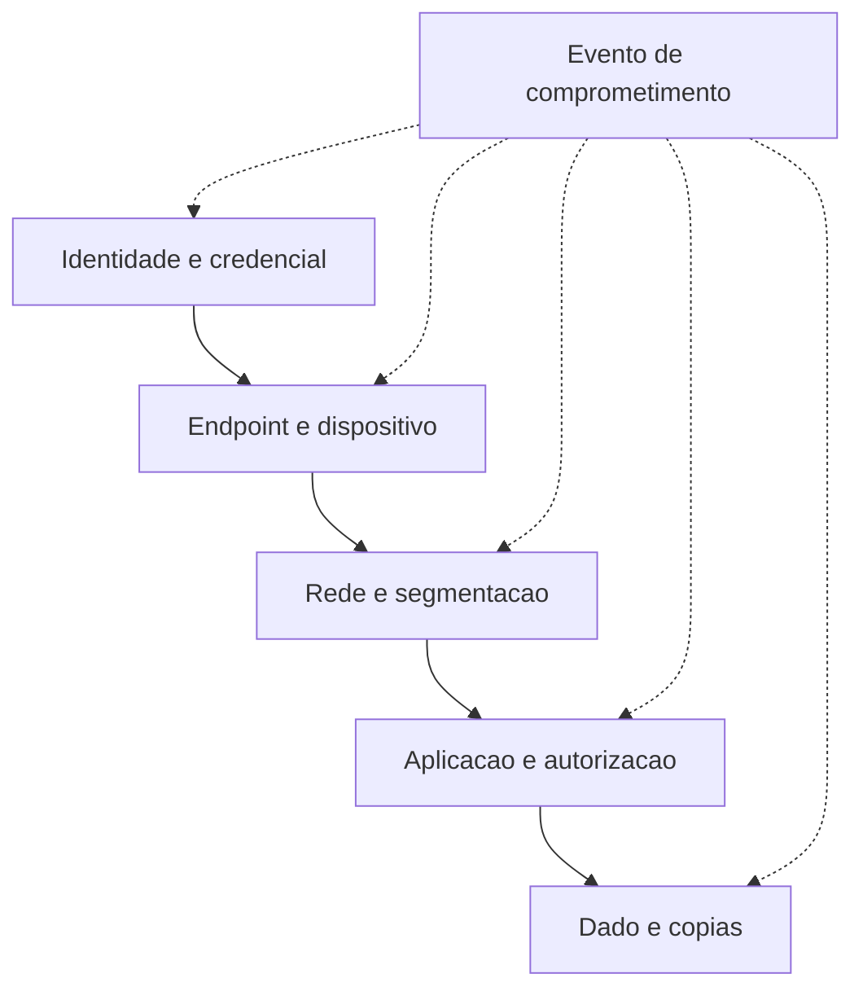

# Defesa em profundidade e o princípio do menor privilégio

Uma camada de defesa não resiste ao comprometimento de uma credencial. Duas coisas resolvem isso: mais barreiras no caminho e menos alcance para quem já passou. São decisões diferentes, com custos diferentes.

## 1. Objetivo de aprendizagem

Ao final deste tema você deve conseguir: projetar controle em camadas para um serviço, aplicar o menor privilégio a identidades humanas e de máquina, e justificar qual camada contém o dano quando uma barreira falha.

## 2. Pré-requisitos

[TEMA-07](TEMA-07-controles-preventivos-detectivos.md). Os dois princípios deste tema organizam controles que já foram classificados por função.

## 3. Pré-teste

Responda de palpite, antes de ler o resto. Anote a confiança de 1 a 5.

1. Chute: quantas camadas distintas a sua empresa tem contra o mesmo ataque de credencial roubada? Conte de cabeça.
   Confiança: ___
2. Palpite: qual controle a liderança aprova mais fácil — mais uma camada de bloqueio ou revisão trimestral de acessos? Escolha.
   Confiança: ___
3. Antes de ler: quantas contas de serviço da sua empresa passam por revisão de privilégio? Anote o número ou "nenhuma".
   Confiança: ___

## 4. Caso real

Na revisão anual de acessos, uma empresa encontra uma conta de serviço criada em 2016 para um script de conciliação contábil. A conta tem privilégio administrativo no domínio inteiro, senha nunca alterada e nenhum dono identificado. O script que a justificava foi desativado em 2019.

Ninguém sabe se a senha vazou. Ninguém sabe quantos sistemas a conta pode alcançar. A pergunta que o caso deixa aberta: o que determina o tamanho do dano se essa credencial estiver nas mãos de alguém, e qual das duas decisões — camadas ou privilégio — muda esse tamanho mais rápido?

## 5. Conteúdo

### 5.1 Conceito

Defesa em profundidade, no glossário do NIST: "Information security strategy integrating people, technology, and operations capabilities to establish variable barriers across multiple layers and missions of the organization". A página registra três origens para o verbete: o NIST SP 800-172r3, o NIST SP 800-30 Rev. 1 e o NIST SP 800-39, os dois últimos citando o CNSSI 4009.

Duas palavras dessa definição carregam a ideia inteira. "Variable" indica que as barreiras não são iguais entre camadas: cada obstáculo deve ser de natureza diferente do anterior, para que a mesma técnica não derrube os dois. "People, technology, and operations" indica que o empilhamento não é só técnico: procedimento, treinamento e capacidade de resposta contam como camadas.

Menor privilégio, no mesmo glossário: "A security principle that a system should restrict the access privileges of users (or processes acting on behalf of users) to the minimum necessary to accomplish assigned tasks". A mesma página traz uma segunda variante de arquitetura, em que cada entidade recebe o mínimo de recursos e autorizações necessário para cumprir sua função. Repare no parêntese: processos agindo em nome de usuários entram no princípio. Conta de serviço, script de integração e chave de aplicação respondem pela mesma regra.

Os dois princípios resolvem problemas distintos e se reforçam. Defesa em profundidade atua sobre o caminho: aumenta o número de obstáculos até o ativo. Menor privilégio atua sobre o alcance: reduz o que cada identidade consegue fazer depois de autenticada. Um programa com camadas e sem limite de privilégio protege a entrada e deixa o interior aberto: quem entra com credencial válida circula como um usuário legítimo.

### 5.2 Como funciona

Cinco camadas cobrem a maior parte das arquiteturas corporativas. O critério de desenho é a diferença de natureza entre elas, e não a quantidade de produtos.

| Camada | O que ela segura | O que acontece quando falta |
|---|---|---|
| Identidade e credencial | uso da credencial roubada | senha capturada vira acesso sem obstáculo |
| Endpoint e dispositivo | execução e movimento a partir da estação | atacante opera da estação do usuário como se fosse ele |
| Rede e segmentação | deslocamento lateral entre sistemas | uma credencial alcança sistemas sem relação com a função |
| Aplicação e autorização | ação dentro do sistema | permissão ampla transforma leitura em alteração |
| Dado e cópias | extração e uso posterior | dado é levado e continua utilizável fora de controle |

O menor privilégio se aplica em quatro frentes, e a quarta é a que mais rende. Privilégio de usuário nominal, com permissão por função. Privilégio de conta administrativa separada da conta de uso diário. Privilégio de tempo, com elevação concedida por janela e revertida ao final. Privilégio de máquina, que cobre contas de serviço, chaves de aplicação e identidades de integração.

A revisão periódica é o mecanismo que impede a decadência. Permissão concedida para um projeto raramente é removida ao fim do projeto, e sem revisão ela se acumula. Um processo de revisão com dono nomeado por sistema, executado em ciclo definido, transforma o menor privilégio de intenção em estado verificável.

Existe uma tensão que o CISO administra sem ilusão. Menor privilégio gera atrito: pedido de acesso, aprovação, prazo. Reduzir o atrito com permissão ampla e permanente resolve o chamado de hoje e cria o incidente do ano seguinte. O ajuste passa por identidade dedicada à automação, elevação por janela e caminho de exceção com prazo.

### 5.3 Exemplo resolvido

Credencial de um analista financeiro comprometida por página de phishing. O analista trabalha no escritório, usa estação corporativa e tem acesso ao sistema de pagamentos.

Passo 1, camada de identidade. Autenticação multifator por aplicativo bloqueia o uso da senha capturada em outro dispositivo. Efeito: contém o incidente antes que ele comece.

Passo 2, suponha que o multifator tenha sido contornado, como ocorre com solicitação de aprovação repetida até o usuário aceitar. A camada de endpoint entra: alerta de execução de ferramenta de acesso remoto fora do padrão da estação. Efeito: reduz o tempo de descoberta.

Passo 3, suponha que a execução passe sem alerta tratado. A camada de rede entra: o sistema de pagamentos aceita conexão apenas do segmento financeiro, e o servidor de banco de dados não responde a partir da estação. Efeito: limita o deslocamento.

Passo 4, suponha que o atacante alcance o servidor de pagamentos usando a aplicação web. A camada de aplicação entra: o perfil do analista permite consultar e preparar lote, não aprovar. A dupla aprovação obriga a segunda credencial, de outro setor. Efeito: impede a ação financeira.

Passo 5, suponha que o atacante consiga aprovação. A camada de dado entra: limite de valor por lote, janela de pagamento e trilha de auditoria por operação tornam a fraude detectável e revertível em prazo curto. Efeito: reduz impacto.

Passo 6, leitura. Cada camada foi suficiente para conter o caso, e nenhuma delas é infalível. O que a análise mostra é o alcance: sem o passo 4, o mesmo analista teria autorização para aprovar qualquer valor, e a única barreira restante seria a detecção posterior.

### 5.4 Problema de completar

Caso novo: credencial de suporte de TI comprometida, com acesso a servidores de aplicação.

| Camada | Controle existente hoje | O que conteria | O que falta |
|---|---|---|---|
| Identidade | __________ | __________ | __________ |
| Endpoint | __________ | __________ | __________ |
| Rede | __________ | __________ | __________ |
| Aplicação | __________ | __________ | __________ |
| Dado | __________ | __________ | __________ |

1. Qual camada contém o dano mais rápido neste caso, e por quê? __________
2. Que decisão de menor privilégio reduziria o alcance da conta de suporte em 30 dias? __________

## 6. Por que isso importa para o CISO

Defesa em profundidade é o argumento que sustenta orçamento recorrente, porque aceita uma premissa que o negócio entende: alguma barreira vai falhar. Apresentar o plano como sucessão de barreiras de natureza diferente explica por que o segundo controle não é duplicação do primeiro, e por que cortar a verba de detecção depois de comprar prevenção deixa o programa pior.

Menor privilégio tem efeito direto em contrato e em auditoria. Cliente corporativo e seguradora perguntam sobre revisão de acesso e sobre contas administrativas. A conta de serviço com privilégio de domínio do caso real é o achado que aparece em quase toda avaliação de maturidade, e ele não se resolve com produto: resolve com dono nomeado e ciclo de revisão.

## 7. Aplicação prática

Escolha um sistema crítico e liste o que a identidade de um usuário comum consegue fazer nele hoje. Peça ao time a lista de permissões do perfil, sem interpretar. Marque o que não é necessário para a função descrita no manual do sistema.

Depois faça o mesmo para uma identidade de máquina: a conta usada por um script, integração ou agente. Contas de máquina costumam ter privilégio maior e revisão mais rara. As duas listas formam o seu plano de menor privilégio do trimestre.

## 8. Autoexplicação

Explique em três frases por que defesa em profundidade sem menor privilégio deixa o interior exposto. Ligue a explicação a uma credencial que você usa hoje: quantos sistemas ela alcança além daqueles que sua função exige?

## 9. Erros comuns e equívocos

| Equívoco | Por que está errado | O que é correto |
|---|---|---|
| Defesa em profundidade é empilhar produtos iguais | A definição pede barreiras de natureza variada entre camadas | Cada camada deve resistir a uma técnica diferente |
| Menor privilégio vale só para pessoas | A definição inclui processos agindo em nome de usuários | Conta de serviço e chave de aplicação seguem a mesma regra |
| Permissão ampla reduz atrito e não faz mal | Permissão permanente sobrevive ao projeto que a justificou | Eleve por janela e reverte ao final |
| Defesa em profundidade substitui detecção | Camadas reduzem probabilidade e não eliminam falha | Detecção reduz o tempo até a descoberta |
| Conta administrativa separada resolve o problema | Separar contas não limita o alcance dentro do domínio | Combine separação de conta com privilégio mínimo e revisão |
| Revisão de acesso é anual e suficiente | Permissão acumula entre revisões e migra de função | Revisão com dono nomeado por sistema, em ciclo definido |

## 10. Recuperação ativa

Responda tudo antes de abrir o gabarito.

1. Escreva a definição de defesa em profundidade registrada pelo NIST e diga quais três capacidades a estratégia integra.
2. Escreva a definição de menor privilégio e explique por que ela alcança processos e não apenas pessoas.
3. Uma credencial de analista é comprometida em uma rede sem segmentação. O que o menor privilégio teria limitado?
4. Qual dos dois princípios exige revisão periódica de acessos, e por quê?
5. Por que duas camadas de mesma natureza não formam defesa em profundidade?

Conferir respostas

1. "Information security strategy integrating people, technology, and operations capabilities to establish variable barriers across multiple layers and missions of the organization". Integra pessoas, tecnologia e operações.
2. "A security principle that a system should restrict the access privileges of users (or processes acting on behalf of users) to the minimum necessary to accomplish assigned tasks". O parêntese alcança scripts, integrações e contas de serviço que agem em nome de um usuário ou de um sistema.
3. O número de sistemas e funções que a credencial alcança. Com privilégio mínimo, a mesma credencial roubada lê e altera menos, e o deslocamento lateral encontra limites.
4. Menor privilégio, porque permissão concedida raramente é removida por iniciativa própria e tende a acumular ao longo do tempo.
5. Porque a mesma técnica derruba as duas. Barreiras só somam quando exigem do atacante capacidades ou caminhos diferentes.

## 11. Revisão espaçada

| Intervalo | O que fazer | Se errar |
|---|---|---|
| D+1 | Listar de memória as cinco camadas e o que cada uma segura | Rebaixar: repetir em D+1 |
| D+7 | Refazer a seção 7 com outra identidade de máquina | Rebaixar: repetir em D+3 |
| D+30 | Verificar se a permissão marcada como desnecessária foi removida | Rebaixar: repetir em D+7 |

## 12. Conexões com outros temas

Leitura humana do `relacoes` do frontmatter — que é a fonte. Relações que saem desta área
também aparecem em [mapa-relacoes.md](../mapa-relacoes.md). Regras em
[templates/RELACOES-TEMAS.md](../templates/RELACOES-TEMAS.md).

| Relação | Alvo | Por que |
|---|---|---|
| aplicado_em | 04-identidade-acesso#TEMA-04 | o princípio do menor privilégio só existe quando papéis e políticas de acesso o implementam; destino planejado, número provisório |
| complementa | 01-fundamentos#TEMA-07 | empilhar controles e limitar privilégio são as duas formas de fazer o controle sobreviver à falha do vizinho |
| complementa | 04-identidade-acesso#TEMA-02 | o princípio do menor privilégio só se realiza no modelo de autorização, onde atributo, política e ponto de decisão o transformam em decisão executável |

## 13. Certificações e leitura recomendada

| Certificação | Domínio | Recurso | Tipo | Fonte |
|---|---|---|---|---|
| Security+ | Fundamentos de segurança e arquitetura | CompTIA Security+ SY0-701 Exam Objectives | primaria | https://assets.ctfassets.net/82ripq7fjls2/6TYWUym0Nudqa8nGEnegjG/0f9b974d3b1837fe85ab8e6553f4d623/CompTIA-Security-Plus-SY0-701-Exam-Objectives.pdf |
| CISSP | Arquitetura e engenharia de segurança | ISC2 CISSP Certification Exam Outline | primaria | https://www.isc2.org/certifications/cissp/cissp-certification-exam-outline |

## 14. Fontes verificadas

| # | Título | Tipo | URL | Acessado em | Confiança |
|---|---|---|---|---|---|
| 1 | NIST CSRC Glossary — defense in depth | primaria | https://csrc.nist.gov/glossary/term/defense_in_depth | "2026-09-25" | alta |
| 2 | NIST CSRC Glossary — least privilege | primaria | https://csrc.nist.gov/glossary/term/least_privilege | "2026-09-25" | alta |
| 3 | NIST CSRC Glossary — attack surface | primaria | https://csrc.nist.gov/glossary/term/attack_surface | "2026-09-25" | alta |

---

| Navegação | |
|---|---|
| Área | [01 Fundamentos de segurança da informação](./README.md) |
| Tema anterior | [TEMA-07](TEMA-07-controles-preventivos-detectivos.md) |
| Home | [README](../README.md) |
