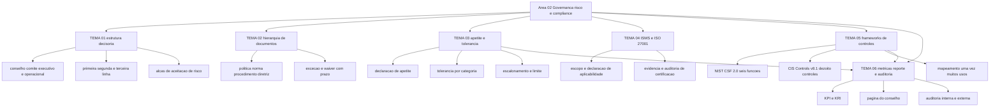

# Governança, risco e compliance (GRC)

A ISO/IEC 27001:2022 tem 19 páginas e é o documento que define requisitos, não o que ensina a implementar. A ISO informa, na mesma página do padrão, que mais de 70.000 certificados ISO/IEC 27001 foram reportados em 150 países conforme o ISO Survey 2022 ([iso.org](https://www.iso.org/standard/27001), acessado em 2026-09-25). Esta área trata do que existe antes do firewall: quem decide, o que está escrito, quanto risco a empresa aceita, qual sistema de gestão sustenta isso, qual framework traduz o serviço de segurança e como tudo isso é medido e verificado. Sem essa camada, o CISO vira o único ponto de aceitação de risco da empresa, e aceitação sem alçada escrita é a mesma coisa que decisão perdida no corredor.

## 1. Introdução

### 1.1 O que é esta área

GRC cobre seis assuntos: a estrutura decisória e as alçadas, a hierarquia de documentos, o apetite e a tolerância ao risco, o sistema de gestão de segurança da informação, os frameworks de controles e o sistema de métricas e auditoria. Está dentro do escopo tudo o que se assina: política aprovada, risco aceito, exceção concedida, relatório ao conselho, plano de ação de auditoria.

Está fora do escopo a mecânica técnica. Como o cofre de senha guarda credencial é [04-identidade-acesso](../04-identidade-acesso/README.md); como o SOC faz triagem é [10-operacoes-soc](../10-operacoes-soc/README.md); qual controle de endpoint está instalado é [06-endpoint-plataforma](../06-endpoint-plataforma/README.md). Também fica fora o detalhe de custo e peso de credencial, que pertence a [90-certificacoes](../90-certificacoes/README.md), e o calendário de estudo, que pertence a [91-trilhas](../91-trilhas/README.md).

### 1.2 Por que isso importa para o CISO

A IIA publicou em julho de 2020 que o órgão de governança é quem determina o apetite da organização ao risco, e que papéis de segunda linha, entre eles segurança da informação e de tecnologia, fornecem apoio, monitoramento e questionamento sobre risco ([theiia.org](https://www.theiia.org/globalassets/site/communication/2020/three-lines-model-updated.pdf), acessado em 2026-09-25). Quem chega ao cargo sem essa leitura costuma assumir decisões que não são suas.

Considere um caso concreto. O time de infraestrutura pede para manter um servidor de banco de dados sem suporte de fornecedor por mais dois anos por causa de um sistema de faturamento. O CISO responde "não podemos, é risco inaceitável". A diretoria financeira responde que o risco do desligamento é maior. Não existe critério escrito para resolver o impasse, então o impasse se resolve por hierarquia, e o CISO perde. Com apetite declarado, a conversa muda de natureza: existe um limite financeiro de aceitação, um dono nomeado para o risco e uma data de revisão. A decisão deixa de ser gosto pessoal e passa a ser aplicação de critério aprovado.

### 1.3 O que você será capaz de fazer ao final

- Desenhar o mapa de direitos de decisão de segurança da empresa, com quatro decisões nomeadas e quem assina cada uma.
- Classificar um documento existente como política, norma, procedimento ou diretriz, e reescrever o que estiver no nível errado.
- Escrever uma declaração de apetite de risco com limite financeiro, tolerâncias por categoria e regra de escalonamento.
- Explicar o que a ISO/IEC 27001:2022 exige de um sistema de gestão, o que é opcional e o que o certificado não garante.
- Escolher entre NIST CSF 2.0 e CIS Controls para uma decisão específica, justificando pela saída que cada um produz.
- Montar a página de reporte ao conselho com indicadores ligados ao apetite e uma decisão pedida por escrito.

### 1.4 Os temas desta área, em prosa

O [TEMA-01](TEMA-01-papel-governanca-estrutura-decisoria.md) define quem decide o quê, onde ficam os comitês e onde termina a autoridade do CISO. O [TEMA-02](TEMA-02-politica-norma-procedimento-diretriz.md) trata dos quatro níveis de documento e do que torna cada um verificável. O [TEMA-03](TEMA-03-apetite-tolerancia-risco.md) converte risco medido em critério de aceitação com valor, dono e prazo.

O [TEMA-04](TEMA-04-isms-iso-27001.md) cobre o sistema de gestão que torna esse conjunto auditável e o que o certificado prova. O [TEMA-05](TEMA-05-frameworks-nist-csf-2-cis-controls.md) compara os dois catálogos que o mercado usa para escolher e comunicar controles. O [TEMA-06](TEMA-06-metricas-reporte-auditoria.md) fecha o ciclo: o que se mede, o que sobe para o conselho e o que a auditoria independente confirma.

## 2. Objetivos de aprendizagem (terminais)

| # | Objetivo | Bloom | Temas que o sustentam |
|---|---|---|---|
| 1 | Mapear os direitos de decisão de segurança de uma empresa, nomeando para 6 decisões o aprovador, o consultado, o informado e o responsável pela execução. | aplicar | TEMA-01, TEMA-02 |
| 2 | Reescrever 5 trechos de política no nível correto da hierarquia documental, com verbo de obrigação e critério verificável. | aplicar | TEMA-02 |
| 3 | Redigir uma declaração de apetite de risco com limite financeiro, 3 tolerâncias e regra de escalonamento, pronta para aprovação do conselho. | criar | TEMA-03 |
| 4 | Definir o escopo de um sistema de gestão de segurança da informação e justificar por escrito a inclusão e a exclusão de unidades. | avaliar | TEMA-04 |
| 5 | Escolher entre NIST CSF 2.0 e CIS Controls para uma decisão de priorização, justificando pela saída esperada de cada framework. | avaliar | TEMA-04, TEMA-05 |
| 6 | Construir a página de reporte trimestral ao conselho, com indicadores ligados ao apetite, movimento no trimestre e decisão pedida. | criar | TEMA-06 |

## 3. Diagrama dos tópicos

## 4. Temas

| # | tema_id | Tema | Nível | Tempo |
|---|---|---|---|---|
| 1 | TEMA-01 | Papel da governança de segurança e a estrutura decisória | intermediario | 35-45 min |
| 2 | TEMA-02 | Política, norma, procedimento e diretriz | intermediario | 30-40 min |
| 3 | TEMA-03 | Apetite e tolerância ao risco | avancado | 40-50 min |
| 4 | TEMA-04 | ISMS e ISO/IEC 27001 | intermediario | 40-50 min |
| 5 | TEMA-05 | Frameworks de controles: NIST CSF 2.0 e CIS Controls | intermediario | 35-45 min |
| 6 | TEMA-06 | Métricas, reporte ao board e auditoria | avancado | 40-50 min |

## 5. Pré-requisitos e sequência

O [00-guia-basico](../00-guia-basico/README.md) fornece o vocabulário do cargo e o [01-fundamentos](../01-fundamentos/README.md) entrega o risco medido com probabilidade, impacto e risco residual. Sem os dois, o TEMA-03 vira discussão sobre adjetivos. Depois desta área, o caminho mais curto é [10-operacoes-soc](../10-operacoes-soc/README.md), porque o CSF 2.0 diz o que detectar, e [17-lideranca-ciso](../17-lideranca-ciso/README.md), porque o mesmo conjunto volta como orçamento e comunicação.

| Antes | Esta área | Depois |
|---|---|---|
| 00-guia-basico | 02-governanca-risco-compliance | 10-operacoes-soc |
| 01-fundamentos | 02-governanca-risco-compliance | 17-lideranca-ciso |

Dentro da área, TEMA-01 e TEMA-02 podem ser lidos em qualquer ordem. TEMA-03 depende de risco já medido, e TEMA-06 depende de TEMA-03: sem apetite declarado não existe semáforo na página do conselho.

## 6. Certificações desta área

Apenas siglas e o que cada credencial usa desta área. Domínios, pesos, custo e validade ficam em [90-certificacoes/](../90-certificacoes/README.md).

| Certificação | Sigla | O que cobre aqui |
|---|---|---|
| ISACA Certified Information Security Manager | CISM | Governança, gestão de risco, programa e resposta: os quatro domínios do exame |
| ISACA Certified in Risk and Information Systems Control | CRISC | Risco de TI e controles: sustenta TEMA-03 e TEMA-05 |
| ISC2 CISSP | CISSP | Domínios de governança e gestão de risco da credencial |
| ISACA COBIT | COBIT | Objetivos de governança e gestão usados em auditoria de TI |

A ISACA informa que o exam content outline do CISM tem 150 questões em 4 domínios, com pesos 17%, 20%, 33% e 30%, e que haverá atualização do outline válida a partir de 3 de novembro de 2026 ([isaca.org](https://www.isaca.org/credentialing/cism/cism-exam-content-outline), acessado em 2026-09-25). Quem for prestar o exame depois dessa data estuda pelo outline novo, não por este roadmap.

## 7. Conexões com outras áreas

Relações de saída dos temas desta área que apontam para fora dela, agregadas do frontmatter
`relacoes`. A visão consolidada está em [mapa-relacoes.md](../mapa-relacoes.md); as regras, em
[templates/RELACOES-TEMAS.md](../templates/RELACOES-TEMAS.md). Alvos marcados como pendentes
ainda não foram escritos.

| Tema daqui | Relação | Destino | Por que |
|---|---|---|---|
| TEMA-01 | complementa | 17-lideranca-ciso#TEMA-02 | alçada interna só fecha quando se sabe a posição do cargo na estrutura e a linha de reporte ao conselho; destino planejado |
| TEMA-02 | aplicado_em | 15-fatores-humanos#TEMA-03 | a norma só muda comportamento quando o programa de conscientização a traduz para a rotina de quem executa; destino planejado |
| TEMA-03 | complementa | 00-guia-basico#TEMA-03 | risco medido só decide quando há apetite declarado, e o registro de risco daquela área é a entrada deste tema |
| TEMA-03 | complementa | 01-fundamentos#TEMA-06 | probabilidade e impacto ganham critério de aceitação: sem limiar aprovado, o risco residual não tem contra o que ser comparado |
| TEMA-03 | complementa | 11-resposta-forense#TEMA-05 | a tolerância a indisponibilidade declarada no apetite de risco é o teto que o RTO do processo crítico não pode ultrapassar |
| TEMA-03 | nao_confundir_com | 17-lideranca-ciso#TEMA-03 | apetite declara quanto risco se aceita; orçamento decide quanto se paga para reduzir risco já declarado |
| TEMA-04 | aplicado_em | 08-cloud#TEMA-06 | a exigência do ISMS só chega ao fornecedor se estiver no contrato e na cláusula de auditoria; destino planejado |
| TEMA-04 | complementa | 17-lideranca-ciso#TEMA-06 | o programa de segurança e o ISMS descrevem o mesmo objeto em linguagens diferentes |
| TEMA-04 | nao_confundir_com | 14-dados-privacidade#TEMA-06 | certificado de segurança da informação não atesta a legalidade do tratamento de dado pessoal; são dois sistemas de gestão com objetos diferentes; destino planejado |
| TEMA-05 | aplicado_em | 12-vulnerabilidades-threat-intel#TEMA-01 | o controle de gestão de vulnerabilidades só vira processo com inventário, prazo e fechamento registrados; destino planejado |
| TEMA-05 | complementa | 10-operacoes-soc#TEMA-03 | o framework define os resultados a detectar e o caso de uso do SOC implementa a detecção; destino planejado |
| TEMA-06 | complementa | 17-lideranca-ciso#TEMA-03 | o número que sobe ao conselho é o mesmo que disputa orçamento no ciclo seguinte; destino planejado |
| TEMA-06 | nao_confundir_com | 13-ofensiva-pentest#TEMA-01 | teste ofensivo aponta falha pontual em um alvo; auditoria verifica se o sistema de gestão opera como declarado; destino planejado |

## 8. Atividades práticas e laboratórios

| # | Atividade | O que a prática demonstra | Pré-requisito técnico |
|---|---|---|---|
| 1 | Listar as 6 decisões de segurança tomadas nos últimos 90 dias e quem assinou cada uma | Quantas decisões foram tomadas sem alçada formal | nenhum |
| 2 | Classificar 10 documentos de segurança existentes em política, norma, procedimento ou diretriz | Onde a empresa escreveu procedimento e chamou de política | acesso ao repositório de documentos |
| 3 | Escrever uma declaração de apetite de risco de uma página e submetê-la ao patrocinador executivo | Que o documento só vale depois de aprovado por quem tem mandato | nenhum |
| 4 | Desenhar o escopo de um ISMS para uma unidade de negócio, com exclusões justificadas | Que escopo largo demais torna a primeira auditoria impossível | leitura da ISO/IEC 27001:2022 |
| 5 | Montar uma matriz que ligue 5 controles ao mesmo tempo a CSF 2.0, CIS Controls e Anexo A da ISO/IEC 27001 | Que um controle bem escolhido atende três frameworks com uma evidência | planilha eletrônica |
| 6 | Escrever a página de reporte trimestral com 5 indicadores e 1 decisão pedida | Que indicador sem decisão pedida é relatório, não gestão | acesso aos dados de incidentes e exposição |

## 9. Checkpoint da área

Cinco itens retirados dos temas, fora da ordem em que aparecem. Responda antes de abrir o gabarito.

1. Em uma empresa sem declaração de apetite aprovada, quem aceita formalmente um risco alto e como isso aparece na ata? (TEMA-03)
2. Um documento de 40 páginas descreve o passo a passo de revogação de acesso e foi aprovado pelo conselho. Em que nível da hierarquia ele deveria estar e quem deveria assiná-lo? (TEMA-02)
3. O CSF 2.0 tem seis funções e a função Govern fica no centro do diagrama. O que muda no plano anual da empresa por causa disso? (TEMA-05)
4. O CISO assina a declaração de aplicabilidade do ISMS. O que exatamente ele está afirmando com essa assinatura? (TEMA-04)
5. Um indicador de tempo médio de correção de vulnerabilidade crítica ficou pior por dois trimestres seguidos sem que nada fosse pedido ao conselho. Que erro de desenho de reporte isso revela? (TEMA-06)

Conferir respostas e critério

1. Sem declaração aprovada não existe aceitação formal; o risco fica aceito por omissão, e a ata registra o tema como pendente ou sem responsável. A correção é declarar quem aceita, até qual valor e por quanto tempo.
2. Procedimento operacional, do dono da operação de identidade, não do conselho. Aprovação no nível errado apaga a diferença entre regra estável e passo a passo que muda a cada troca de ferramenta.
3. Govern deixa de ser uma etapa posterior às outras cinco e passa a produzir as entradas delas: contexto, estratégia, papéis, política e supervisão. Na prática, o orçamento do ano seguinte é definido antes dos projetos de proteção, e não depois.
4. Que os controles marcados como aplicáveis estão implementados e que os marcados como não aplicáveis têm justificativa aceita pelo dono do risco. A declaração é o elo entre o resultado da avaliação de risco e o que a auditoria vai testar.
5. Que o indicador não tem limiar nem ação pré-acordada. Indicador ligado à tolerância obriga a uma decisão quando cruza o limite; sem limite, ele só descreve o passado.

Critério para seguir adiante: acertar 80% ou mais sem consultar os temas. Erro no item 1 ou no item 5 indica que apetite e reporte ainda não estão ligados entre si; releia o TEMA-03 antes de seguir.

## 10. Termos desta área

Termos que o glossário central precisa conter; as definições curtas ficam em [glossario.md](../glossario.md).

- governança de segurança da informação
- alçada de decisão (decision rights)
- comitê de segurança
- primeira, segunda e terceira linha (three lines model)
- política de segurança da informação
- norma (standard)
- procedimento
- diretriz (guideline)
- exceção e waiver
- apetite de risco (risk appetite)
- tolerância ao risco (risk tolerance)
- limite de risco
- declaração de apetite de risco (risk appetite statement)
- ISMS (information security management system)
- escopo do ISMS
- declaração de aplicabilidade (statement of applicability)
- não conformidade
- ação corretiva
- risco aceito
- certificação e auditoria de certificação
- auditoria interna
- evidência de auditoria
- indicador de desempenho (KPI)
- indicador de risco (KRI)
- reporte ao conselho
- framework de controles

## 11. Fontes verificadas

| # | Título | Tipo | URL | Acessado em | Confiança |
|---|---|---|---|---|---|
| 1 | ISO/IEC 27001:2022 — Requirements | primaria | https://www.iso.org/standard/27001 | "2026-09-25" | alta |
| 2 | ISO/IEC 27002:2022 — Information security controls | primaria | https://www.iso.org/standard/75652.html | "2026-09-25" | alta |
| 3 | ABNT NBR ISO/IEC 27001:2022 Versão Corrigida:2023 — catálogo ABNT | primaria | https://abntcatalogo.com.br/sebrae/norma.aspx?Q=WXV0VDkwSGkvd0Z5K2xqb0pOczhybU0xUGFhRllraFE4anAvT2lBQzNxbz0= | "2026-09-25" | alta |
| 4 | The NIST Cybersecurity Framework (CSF) 2.0 — NIST CSWP 29 | primaria | https://nvlpubs.nist.gov/nistpubs/CSWP/NIST.CSWP.29.pdf | "2026-09-25" | alta |
| 5 | NIST CSF 2.0 Resource and Overview Guide — NIST SP 1299 | primaria | https://nvlpubs.nist.gov/nistpubs/SpecialPublications/NIST.SP.1299.pdf | "2026-09-25" | alta |
| 6 | NIST CSRC Glossary — risk tolerance | primaria | https://csrc.nist.gov/glossary/term/risk_tolerance | "2026-09-25" | alta |
| 7 | NIST SP 800-39 — Managing Information Security Risk | primaria | https://csrc.nist.gov/pubs/sp/800/39/final | "2026-09-25" | alta |
| 8 | NIST SP 800-30 Rev. 1 — Guide for Conducting Risk Assessments | primaria | https://csrc.nist.gov/pubs/sp/800/30/r1/final | "2026-09-25" | alta |
| 9 | CIS Critical Security Controls v8.1 — lista dos 18 controles | primaria | https://www.cisecurity.org/controls/cis-controls-list | "2026-09-25" | alta |
| 10 | ISACA — CISM Exam Content Outline | primaria | https://www.isaca.org/credentialing/cism/cism-exam-content-outline | "2026-09-25" | alta |
| 11 | The IIA's Three Lines Model, julho de 2020 | primaria | https://www.theiia.org/globalassets/site/communication/2020/three-lines-model-updated.pdf | "2026-09-25" | alta |

Itens que **não** foram confirmados em fonte oficial nesta execução e que aparecem marcados nos temas: a contagem de controles do Anexo A da ISO/IEC 27001:2022 e os temas em que se organizam. O número total de safeguards do CIS Controls v8.1 e a distribuição por implementation group. A duração e o ciclo de auditoria de certificação, que seguem documentos obrigatórios do IAF. E o número de certificados ISO/IEC 27001 emitidos no Brasil, que exigiria recorte do ISO Survey por país.

---

| Navegação | |
|---|---|
| Anterior | [17 Liderança e gestão do CISO](../17-lideranca-ciso/README.md) |
| Próximo | [14 Dados, privacidade e LGPD/GDPR](../14-dados-privacidade/README.md) |
| Home | [README](../README.md) |
