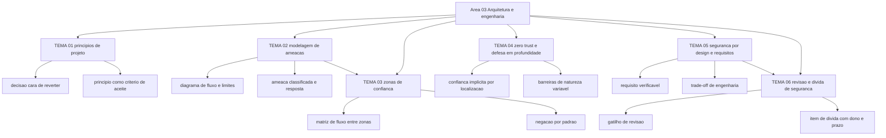

# Arquitetura e engenharia de segurança

A revisão 1 do NIST SP 800-160 Volume 1 saiu em novembro de 2022 e substituiu a edição de março de 2018. O título — Engineering Trustworthy Secure Systems — carrega a tese da área: segurança de sistema é produto de engenharia, com requisito, trade-off e verificação, e não um produto aplicado na véspera do go-live. Seis temas tratam das decisões que ficam caras de reverter depois que o sistema já está em produção.

## 1. Introdução

### 1.1 O que é esta área

Arquitetura de segurança é o conjunto de decisões que definem o que alcança o quê, quem prova identidade em nome de quem, e qual barreira contém o dano depois que uma barreira vizinha falha. Esta área cobre os princípios que orientam essas decisões, o método para descobrir onde elas erram, as fronteiras de rede e de identidade, os dois padrões que organizam o desenho (zero trust e defesa em profundidade), o requisito não funcional que obriga o desenho a existir, e a revisão que mede o que ficou por fazer.

Fica fora da área a operação do controle. Configurar firewall, escrever política de acesso, operar SIEM, corrigir vulnerabilidade: isso pertence às áreas 04 a 12. Também fica fora a gestão do programa — apetite de risco, política aprovada, ISMS, auditoria —, que é a área 02. Aqui se decide o que as ferramentas vão proteger e com que pressuposto.

### 1.2 Por que isso importa para o CISO

A revisão de 2022 do SP 800-160 declara que o documento foi escrito para servir de base a programas de formação, a certificações profissionais e a critérios de avaliação. Isso interessa ao CISO por um motivo prático: quando o auditor ou o cliente corporativo pergunta como a empresa decide arquitetura, a resposta aceitável é um critério, não um organograma.

O efeito aparece na mesa de contrato. Um requisito de segregação de função escrito no desenho entra na especificação como uma frase. O mesmo requisito descoberto depois do sistema em produção vira alteração de modelo de dados, migração, retreino e nova rodada de teste. A diferença entre os dois não é técnica, é de sequência — e quem controla a sequência é quem aprova o desenho.

Há ainda um efeito de negociação interna. Toda arquitetura troca uma proteção por outra coisa: latência, custo, prazo, usabilidade. O SP 800-160 lista "engineering trades" entre as palavras-chave do documento. Discutir a troca em termos explícitos muda a conversa do comitê de "segurança atrasa projeto" para "esta é a proteção que estamos comprando e esta é a que estamos deixando de comprar".

### 1.3 O que você será capaz de fazer ao final

- Separar, em um desenho existente, decisão de arquitetura de configuração de produto, e nomear o princípio que sustenta cada decisão cara de reverter.
- Produzir um modelo de ameaças de um serviço, com diagrama de fluxo de dados, limites de confiança, ameaças identificadas e resposta registrada para cada uma.
- Desenhar zonas de confiança e a matriz de fluxo entre elas, indicando o que cada zona contém, o que cruza a fronteira e quem aprova exceção.
- Avaliar uma arquitetura contra os pressupostos de zero trust, listando a confiança implícita que permanece e a barreira que contém o dano.
- Escrever requisito não funcional de segurança verificável, com critério de aceite que outra pessoa consegue testar.
- Conduzir revisão de arquitetura com critério publicado e registrar item de dívida de segurança com dono, prazo e risco associado.

### 1.4 Os temas desta área, em prosa

O [TEMA-01](TEMA-01-principios-arquitetura-seguranca.md) apresenta os princípios de projeto e o critério que separa decisão de arquitetura de ajuste de configuração. O [TEMA-02](TEMA-02-modelagem-de-ameacas.md) ensina o método de modelagem de ameaças, das quatro perguntas ao diagrama de fluxo de dados com limites de confiança. O [TEMA-03](TEMA-03-segmentacao-zonas-de-confianca.md) trata das zonas de confiança e da matriz de fluxo que substitui a rede plana. O [TEMA-04](TEMA-04-padroes-zero-trust-defesa-em-profundidade.md) compara dois padrões que respondem a falhas diferentes: confiança implícita por localização e dependência de uma única barreira. O [TEMA-05](TEMA-05-seguranca-por-design-requisitos-nao-funcionais.md) transforma intenção em requisito verificável. O [TEMA-06](TEMA-06-revisao-arquitetura-divida-de-seguranca.md) fecha o ciclo com a revisão periódica e o registro da dívida que sobra entre revisões.

## 2. Objetivos de aprendizagem (terminais)

| # | Objetivo | Bloom | Temas que o sustentam |
|---|---|---|---|
| 1 | Classificar 10 decisões de um desenho existente em arquitetura ou configuração, justificando cada uma pelo princípio que a sustenta. | analisar | TEMA-01 |
| 2 | Produzir um modelo de ameaças de um serviço real, com diagrama de fluxo, limites de confiança, ameaças classificadas e resposta escrita para cada ameaça. | aplicar | TEMA-02 |
| 3 | Desenhar zonas de confiança e a matriz de fluxo de um ambiente, declarando o que é negado por padrão e quem aprova exceção. | criar | TEMA-03 |
| 4 | Avaliar uma arquitetura contra os pressupostos de zero trust e contra a definição de defesa em profundidade, indicando a confiança implícita remanescente. | avaliar | TEMA-04 |
| 5 | Escrever 5 requisitos não funcionais de segurança com critério de aceite testável por terceiro. | criar | TEMA-05 |
| 6 | Conduzir uma revisão de arquitetura com critério publicado e registrar a dívida de segurança em itens com dono e prazo. | avaliar | TEMA-06 |

## 3. Diagrama dos tópicos

## 4. Temas

| # | tema_id | Tema | Nível | Tempo |
|---|---|---|---|---|
| 1 | TEMA-01 | Princípios de arquitetura de segurança | intermediario | 30-40 min |
| 2 | TEMA-02 | Modelagem de ameaças | intermediario | 35-50 min |
| 3 | TEMA-03 | Segmentação e zonas de confiança | intermediario | 30-45 min |
| 4 | TEMA-04 | Padrões de arquitetura: zero trust e defesa em profundidade | intermediario | 35-45 min |
| 5 | TEMA-05 | Segurança por design e requisitos não funcionais | intermediario | 30-40 min |
| 6 | TEMA-06 | Revisão de arquitetura e dívida de segurança | avancado | 30-45 min |

## 5. Pré-requisitos e sequência

O [01 Fundamentos](../01-fundamentos/README.md) vem antes porque fornece o vocabulário de ativo, risco e controle que aparece em toda decisão de desenho. O [02 Governança, risco e compliance](../02-governanca-risco-compliance/README.md) também vem antes: critério de risco aceito e política aprovada são o insumo que transforma preferência técnica em requisito.

| Antes | Esta área | Depois |
|---|---|---|
| 01-fundamentos, 02-governanca-risco-compliance | 03-arquitetura-engenharia | 04-identidade-acesso, 05-rede-infraestrutura |

Dentro da área, a ordem dos temas é sugestão. Quem já opera com diagrama de fluxo pode começar pelo TEMA-03 e voltar ao TEMA-01 depois: as zonas de confiança são um caso particular do princípio de negação por padrão, e o TEMA-01 sistematiza o critério que a matriz de fluxo aplica.

## 6. Certificações desta área

Apenas siglas e o que cada credencial usa desta área. Domínios, pesos e custo ficam em [90-certificacoes/](../90-certificacoes/README.md).

| Certificação | Sigla | O que cobre aqui |
|---|---|---|
| ISC2 CISSP | CISSP | O domínio de arquitetura e engenharia de segurança; nomes de domínio NAO CONFIRMADO em fonte oficial nesta execução, a contagem de 8 domínios está registrada em 99-fontes |
| CompTIA SecurityX | SecurityX | Desenho de arquitetura e integração de controles; substitui o CASP+, exame CAS-005, sem nomes de domínio confirmados nesta execução |

Ver: [90-certificacoes/](../90-certificacoes/README.md).

## 7. Conexões com outras áreas

Relações de saída dos temas desta área que apontam para fora dela, agregadas do frontmatter
`relacoes`. A visão consolidada está em [mapa-relacoes.md](../mapa-relacoes.md); as regras, em
[templates/RELACOES-TEMAS.md](../templates/RELACOES-TEMAS.md). Alvos marcados como pendentes
ainda não foram escritos.

| Tema daqui | Relação | Destino | Por que |
|---|---|---|---|
| TEMA-01 | aplicado_em | 06-endpoint-plataforma#TEMA-02 | a linha de base de hardening é o princípio de negação por padrão escrito para um tipo de ativo; destino planejado, número provisório |
| TEMA-02 | aplicado_em | 09-aplicacoes-devsecops#TEMA-03 | o mesmo método, aplicado ao desenho de uma aplicação dentro do ciclo de desenvolvimento; destino planejado, número provisório |
| TEMA-02 | aprofundado_por | 12-vulnerabilidades-threat-intel#TEMA-04 | aqui a ameaça é enumerada por categoria; o catálogo de técnicas observadas em campo e a ligação com o atacante real estão na área 12; destino planejado, número provisório |
| TEMA-03 | aplicado_em | 10-operacoes-soc#TEMA-02 | o desenho de zona determina quais fluxos existem e, por consequência, o que a telemetria de rede consegue provar; destino planejado, número provisório |
| TEMA-03 | complementa | 05-rede-infraestrutura#TEMA-03 | a zona de confiança define o que precisa ser isolado e por qual critério; a configuração de VLAN, firewall e política de fluxo executa o isolamento; destino planejado, número provisório |
| TEMA-04 | aplicado_em | 08-cloud#TEMA-02 | o acesso em nuvem é onde o padrão de zero trust encosta na política de identidade do provedor; destino planejado, número provisório |
| TEMA-04 | complementa | 04-identidade-acesso#TEMA-06 | zero trust só se sustenta com identidade forte: sem autenticação de sujeito e de dispositivo confiável, o padrão vira intenção sem controle; destino planejado, número provisório |
| TEMA-05 | aplicado_em | 09-aplicacoes-devsecops#TEMA-01 | o requisito não funcional aprovado é o que o ciclo de desenvolvimento tem de verificar a cada entrega; destino planejado, número provisório |
| TEMA-06 | aplicado_em | 02-governanca-risco-compliance#TEMA-06 | dívida de segurança medida é matéria de reporte ao comitê e de evidência de auditoria; destino planejado, número provisório |
| TEMA-06 | nao_confundir_com | 12-vulnerabilidades-threat-intel#TEMA-06 | dívida de desenho adiada e vulnerabilidade pendente de correção têm dono, prazo e instrumento de medição diferentes; destino planejado, número provisório |

## 8. Atividades práticas e laboratórios

| # | Atividade | O que a prática demonstra | Pré-requisito técnico |
|---|---|---|---|
| 1 | Pegar 10 mudanças aprovadas no último trimestre e classificar cada uma em arquitetura ou configuração | Que a maior parte do esforço de segurança se gasta em ajuste de baixo custo de reversão | acesso às atas de mudança |
| 2 | Desenhar o diagrama de fluxo de dados de um serviço, com limites de confiança marcados | Onde o dado cruza fronteira, e quem atua em cada lado | desenho da solução ou conversa com o arquiteto |
| 3 | Montar a matriz de fluxo entre zonas do ambiente e marcar o que hoje atravessa por padrão | Quanto do ambiente se sustenta em regra permissiva herdada | inventário de rede ou planilha |
| 4 | Listar os pressupostos de confiança implícita que a arquitetura atual ainda usa | Onde a localização de rede ainda substitui autenticação e autorização | nenhum |
| 5 | Reescrever o requisito de segurança de um edital em requisito verificável com critério de aceite | A diferença entre intenção declarada e exigência contratual | acesso ao edital ou à minuta |
| 6 | Rodar uma revisão de arquitetura de 90 minutos com critério publicado e registrar 5 itens de dívida | Que revisão sem critério e sem registro não muda o desenho | nenhum |

## 9. Checkpoint da área

Cinco itens retirados dos temas, fora da ordem original. Responda antes de abrir o gabarito.

1. Um firewall libera a porta do banco de dados apenas para a rede administrativa. Essa é uma decisão de arquitetura ou de configuração, e sob qual princípio ela se justifica? (TEMA-01)
2. Quais são as quatro perguntas que o processo de modelagem de ameaças precisa responder, e em qual etapa entra o diagrama de fluxo de dados? (TEMA-02)
3. A rede é plana e a conta de suporte alcança qualquer servidor. O que uma matriz de fluxo com negação por padrão muda nesse alcance? (TEMA-03)
4. Um desenho autentica o usuário no acesso à VPN e confia no dispositivo porque ele está na rede interna. Qual pressuposto de zero trust está violado? (TEMA-04)
5. Um edital exige "solução segura e aderente às boas práticas". Por que esse texto não é um requisito verificável, e o que falta nele? (TEMA-05)
6. Uma funcionalidade de exportação foi entregue sem limite de volume. É dívida de segurança ou vulnerabilidade? Justifique em duas linhas e diga quem assina o prazo. (TEMA-06)

Conferir respostas e critério

1. Configuração, com efeito de arquitetura. A regra é reversível em minutos; o que sustenta a escolha é a mediação completa — nenhum caminho alternativo chega ao banco sem passar por um ponto de verificação.
2. O que estamos construindo, o que pode dar errado, o que faremos a respeito e se fizemos um trabalho suficiente. O diagrama de fluxo de dados pertence à primeira pergunta, a decomposição do sistema.
3. Reduz o conjunto de destinos que a credencial alcança. A permissão passa a depender do par origem e destino declarado, e o que não está na matriz é negado, o que limita o deslocamento lateral.
4. O pressuposto de que autenticação e autorização de sujeito e de dispositivo são funções discretas, executadas antes de estabelecer a sessão com o recurso. Confiar no dispositivo pela rede interna é confiança implícita por localização.
5. Porque não define critério observável nem forma de verificação. Falta o objeto protegido, o limite quantitativo ou a condição de aceite e a evidência exigida.
6. Dívida de segurança: não há falha explorável imediata, há decisão de desenho que adia o limite. O prazo é assinado por quem responde pelo serviço, não pelo time que executa a correção.

Critério para seguir adiante: acertar 80% ou mais sem consultar os temas. Erro no item 4 ou no item 6 indica confusão entre pressuposto de arquitetura e item de configuração; releia TEMA-04 e TEMA-06 antes de seguir.

## 10. Termos desta área

Termos que o glossário central precisa conter; as definições curtas ficam em [glossario.md](../glossario.md).

- arquitetura de segurança (security architecture)
- princípio de projeto
- mediação completa (complete mediation)
- negação por padrão (fail-safe defaults)
- economia de mecanismo (economy of mechanism)
- separação de privilégio (separation of privilege)
- modelo de ameaças (threat model)
- diagrama de fluxo de dados (DFD)
- limite de confiança (trust boundary)
- STRIDE
- zona de confiança (trust zone)
- microssegmentação (microsegmentation)
- zero trust
- confiança implícita
- defesa em profundidade (defense in depth)
- requisito não funcional
- critério de aceite
- trade-off de engenharia (engineering trade)
- revisão de arquitetura
- dívida de segurança (security debt)

## 11. Fontes verificadas

| # | Título | Tipo | URL | Acessado em | Confiança |
|---|---|---|---|---|---|
| 1 | NIST SP 800-160 Vol. 1 Rev. 1 — Engineering Trustworthy Secure Systems, publicado em novembro de 2022, substitui a edição de 03/2018 | primaria | https://csrc.nist.gov/pubs/sp/800/160/v1/r1/final | "2026-09-25" | alta |
| 2 | NIST SP 800-207 — Zero Trust Architecture, publicado em agosto de 2020 | primaria | https://csrc.nist.gov/pubs/sp/800/207/final | "2026-09-25" | alta |
| 3 | NIST SP 800-154 — Guide to Data-Centric System Threat Modeling, initial public draft de março de 2016 | primaria | https://csrc.nist.gov/pubs/sp/800/154/ipd | "2026-09-25" | alta |
| 4 | NIST SP 800-53 Rev. 5 — catálogo de controles de segurança e privacidade | primaria | https://csrc.nist.gov/pubs/sp/800/53/r5/upd1/final | "2026-09-25" | alta |
| 5 | NIST CSRC Glossary — defense in depth, conforme SP 800-53 Rev. 5 | primaria | https://csrc.nist.gov/glossary/term/defense_in_depth | "2026-09-25" | alta |
| 6 | NIST CSRC Glossary — least privilege, conforme SP 800-12 Rev. 1 e CNSSI 4009 | primaria | https://csrc.nist.gov/glossary/term/least_privilege | "2026-09-25" | alta |
| 7 | OWASP Threat Modeling Cheat Sheet — quatro perguntas, STRIDE, respostas e validação | primaria | https://cheatsheetseries.owasp.org/cheatsheets/Threat_Modeling_Cheat_Sheet.html | "2026-09-25" | alta |
| 8 | MITRE ATT&CK — Lateral Movement, tactic TA0008 | primaria | https://attack.mitre.org/tactics/TA0008/ | "2026-09-25" | alta |
| 9 | Saltzer e Schroeder — The Protection of Information in Computer Systems | primaria | https://web.mit.edu/Saltzer/www/publications/protection/ | "2026-09-25" | alta |
| 10 | Defining Security Debt: A Case Study Based on Practice, DOI 10.1007/978-3-031-78386-9_4 | academica | https://link.springer.com/chapter/10.1007/978-3-031-78386-9_4 | "2026-09-25" | media |

---

| Navegação | |
|---|---|
| Anterior | [08 Segurança em cloud](../08-cloud/README.md) |
| Próximo | [06 Segurança de endpoint e plataforma](../06-endpoint-plataforma/README.md) |
| Home | [README](../README.md) |
