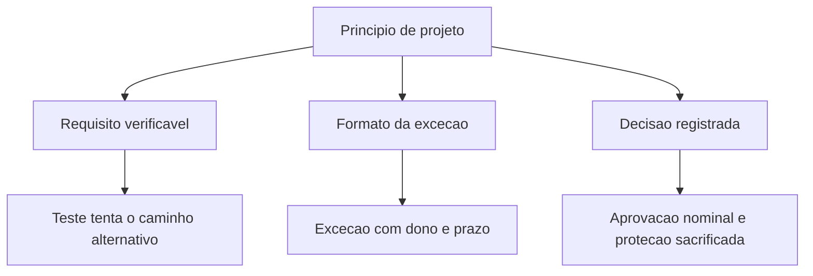

# Princípios de arquitetura de segurança

Uma ideia central: princípio de projeto é critério de decisão reutilizável, e arquitetura é o subconjunto das decisões cujo custo de reversão é alto o bastante para exigir critério.

## 1. Objetivo de aprendizagem

Ao final deste tema você deve conseguir: classificar 10 decisões de um desenho existente em arquitetura ou configuração, justificando cada uma pelo princípio de projeto que a sustenta e pelo custo de reversão envolvido.

## 2. Pré-requisitos

Nenhum. O vocabulário de risco e de controle vem do [01 Fundamentos](../01-fundamentos/README.md); este tema trabalha o critério que transforma esse vocabulário em decisão de desenho.

## 3. Pré-teste

Responda de palpite, antes de ler o resto. Anote a confiança de 1 a 5.

1. Chute: quantas decisões de arquitetura de segurança da sua empresa estão registradas por escrito com o nome de quem aprovou? Anote o número.
   Confiança: ___
2. Palpite: um princípio de projeto de 1975 ainda decide casos em um serviço em contêiner? Escolha sim ou não e escreva por quê.
   Confiança: ___
3. Antes de ler: quem revisa o desenho de um sistema antes de ele entrar em produção na sua empresa — segurança, a própria área ou ninguém? Aposte.
   Confiança: ___

## 4. Caso real

O paper de Jerome Saltzer e Michael Schroeder, publicado em 1975 sob o título The Protection of Information in Computer Systems, lista oito princípios de projeto para sistemas que precisam proteger informação. Meio século depois, o glossário do NIST registra a definição de menor privilégio sob o NIST SP 800-12 Rev. 1, com origem declarada no CNSSI 4009: a arquitetura de segurança deve conceder a cada entidade o mínimo de recursos e autorizações de que ela precisa para cumprir sua função.

A distância entre as duas datas é o dado interessante. Princípio de projeto envelhece devagar; a tecnologia que o implementa envelhece rápido. O mesmo glossário do NIST registra a definição de defesa em profundidade sob o NIST SP 800-53 Rev. 5, com a ideia de barreiras variáveis em várias camadas, e a palavra usada ali é "variável" — não "redundante".

A pergunta que o caso deixa aberta: se o princípio sobrevive cinquenta anos, por que ele ainda está ausente de desenhos que a empresa considera maduros?

## 5. Conteúdo

### 5.1 Conceito

Princípio de projeto é uma regra curta que responde "como decidir" sem depender do produto da moda. O paper de 1975 enumera oito: economia de mecanismo, negação por padrão, mediação completa, projeto aberto, separação de privilégio, menor privilégio, menor mecanismo comum e aceitabilidade psicológica. Nenhum deles exige tecnologia específica, e é por isso que continuam válidos.

Arquitetura de segurança, para efeito de decisão, é o conjunto das escolhas com custo de reversão alto. Isto é uma definição de trabalho, e a palavra que importa é reversão. Trocar uma regra de firewall é barato; escolher em que ponto do fluxo o dado é decifrado não é. A mesma pessoa, com o mesmo vocabulário, aprova as duas coisas — e só uma delas merece constar como decisão de arquitetura, com justificativa escrita.

O NIST SP 800-160 Volume 1 Rev. 1, publicado em novembro de 2022, trata disso como disciplina: o documento descreve princípios, conceitos, atividades e tarefas para engenharia de sistemas confiáveis, aplicáveis dentro de esforços de engenharia de sistemas, e lista entre suas palavras-chave "security architecture", "security design", "security requirements" e "engineering trades". A expressão "engineering trades" é a que o gestor precisa levar consigo: decisão de arquitetura sempre troca proteção por outra coisa, e a troca fica explícita ou fica escondida.

Quatro princípios resolvem a maior parte das discussões práticas. Negação por padrão: o que não foi permitido de forma explícita não passa. Mediação completa: não existe caminho alternativo que alcance o ativo sem passar por um ponto de verificação. Separação de privilégio: nenhuma entidade isolada completa uma ação crítica. Menor privilégio: cada entidade recebe o mínimo de recursos e autorizações que sua função exige, e "entidade" inclui processos que agem em nome de usuários.

### 5.2 Como funciona

O princípio entra no trabalho por três portas, e cada porta tem um dono diferente.

A primeira é a porta do requisito. Um princípio declarado na política de arquitetura vira frase verificável no requisito não funcional do sistema. "Não existe caminho alternativo para o banco de dados além do serviço de dados" é mediação completa escrita de forma testável; o time de teste consegue tentar os caminhos e reprovar o que passar por fora.

A segunda é a porta da exceção. Toda arquitetura real tem exceção, e o princípio define o formato dela: exceção tem prazo, dono e risco associado. Sem isso, o princípio não foi violado uma vez — foi revogado em silêncio.

A terceira é a porta da decisão documentada. Onde há troca, existe registro. Um registro de decisão de arquitetura com quatro campos — decisão, princípio que a sustenta, proteção sacrificada, quem aprovou — sobrevive à troca de gestor. Sem esse registro, a arquitetura herdada é um conjunto de escolhas sem autoria, e a primeira pergunta de auditoria ("por que está assim?") não tem resposta.

Custo de reversão é o critério de classificação, e ele não é binário. Uma escala de três degraus funciona na prática: reversível em dias (configuração), reversível em meses com projeto (decisão tática) e irreversível sem reprojetar (decisão de arquitetura). A pergunta que separa os degraus não é "quão importante é", e sim "quantos sistemas, contratos e pessoas precisam mudar para desfazer isto".

### 5.3 Exemplo resolvido

Um serviço de pagamento em uma varejista. Cinco decisões chegam à mesa na mesma reunião.

Decisão 1: o serviço de pagamento fica em uma sub-rede própria, com regra que admite apenas o serviço de pedidos na porta de aplicação. Reversão: uma regra, em minutos. Classificação: configuração. Princípio: negação por padrão. O que a sustenta: o default do grupo de segurança é negar.

Decisão 2: o número do cartão não trafega até o serviço de pedidos; o serviço de pedidos recebe apenas um token de referência. Reversão: mudança de contrato de interface entre dois sistemas, com migração de dados históricos. Classificação: arquitetura. Princípio: menor privilégio aplicado a dado, e economia de mecanismo — menos lugares onde o dado sensível existe. Proteção sacrificada: consulta direta ao histórico de cartão por outros sistemas, com prejuízo para relatórios.

Decisão 3: toda operação de estorno exige aprovação de um segundo analista de outro turno. Reversão: mudança de processo e de tela, com treinamento. Classificação: arquitetura, no limite. Princípio: separação de privilégio. Proteção sacrificada: tempo de atendimento ao cliente em horário de pico.

Decisão 4: o registro de auditoria das operações de pagamento é gravado em armazenamento separado, com retenção definida e sem permissão de alteração pelo serviço de pagamento. Reversão: projeto de integração e mudança de contrato de retenção. Classificação: arquitetura. Princípio: mediação completa do registro — nenhuma ação crítica sem trilha fora do alcance de quem a executou.

Decisão 5: o log de acesso à aplicação é reconfigurado para incluir o identificador do dispositivo. Reversão: uma alteração de configuração de log. Classificação: configuração. Princípio: nenhum diretamente; é insumo para detecção, o que pertence à área 10.

O que o exercício demonstra é que o volume de decisões está na configuração e o custo está na arquitetura. A reunião costuma gastar o tempo na decisão 5, que é reversível, e aprovar a decisão 2 por decurso de prazo.

### 5.4 Problema de completar

Mesmo serviço, quatro decisões novas. Complete a tabela.

| Decisão | Custo de reversão | Classificação | Princípio | Proteção sacrificada |
|---|---|---|---|---|
| O serviço aceita apenas conexão de entrada, sem saída direta para a internet | ______ | ______ | ______ | ______ |
| O fornecedor de antifraude recebe o token e o valor, e não recebe o identificador do cliente | ______ | ______ | ______ | ______ |
| A chave de assinatura de token fica em cofre gerenciado, e não em variável de ambiente | ______ | ______ | ______ | ______ |
| O estorno acima de um limite exige aprovação da diretoria financeira | ______ | ______ | ______ | ______ |

Responda ainda: qual das quatro decisões é a única em que a aceitabilidade psicológica, o oitavo princípio do paper de 1975, decide se a decisão sobrevive ao primeiro mês de operação? Justifique em duas linhas.

## 6. Por que isso importa para o CISO

Arquitetura é a única parte do programa de segurança em que a decisão de hoje limita orçamento por vários anos. Comprar um produto tem prazo de contrato; escolher onde o dado é decifrado define o que será possível auditar, segmentar e detectar depois.

O efeito prático aparece quando o CISO precisa recusar. Uma equipe pede liberação ampla de rede para resolver um problema de hoje. Quem tem princípio escrito e critério de reversão responde com uma alternativa: a exceção com prazo, o dono e o risco associado. Quem não tem, escolhe entre autorizar tudo ou travar o negócio — e nas duas opções perde.

Há um terceiro efeito, de reputação técnica. O SP 800-160 Rev. 1 declara que o documento serve de base para critérios de avaliação. Auditorias de maturidade e clientes corporativos usam esse tipo de referência para pedir evidência de que existe critério de desenho. Um registro de decisão com princípio declarado é evidência barata de produzir e cara de improvisar na hora da diligência.

## 7. Aplicação prática

Pegue as dez últimas mudanças aprovadas na sua empresa, do comitê de mudança ou do rastreador de chamados. Para cada uma, escreva duas frases: o que exatamente muda no ambiente e quanto tempo levaria para desfazer.

Depois classifique em configuração, decisão tática ou arquitetura. O resultado típico é desanimador na primeira vez: quase tudo é configuração. Em seguida, escolha as três decisões de arquitetura que você gostaria de ter participado antes da aprovação e escreva, para cada uma, o princípio que a sustentaria e a proteção que ela sacrifica. Esse parágrafo é o que você leva ao próximo comitê.

## 8. Autoexplicação

Explique em três frases por que princípio de projeto não é preferência pessoal. Ligue a explicação ao seu ambiente: escolha um sistema que você governa e diga qual decisão de desenho dele você desfaria hoje se pudesse, e o que impede.

## 9. Erros comuns e equívocos

| Equívoco | Por que está errado | O que é correto |
|---|---|---|
| Princípio é discurso de arquiteto, configuração é trabalho real | Princípio é critério de decisão e só existe quando chega ao teste e à exceção | Escreva o princípio como requisito verificável e como formato de exceção |
| Arquitetura é o desenho grande, configuração é o detalhe | O critério é custo de reversão, e existem decisões pequenas irreversíveis | Classifique pela reversão, não pelo tamanho |
| Duas camadas iguais formam defesa em profundidade | A definição registrada pelo NIST fala de barreiras variáveis entre camadas | Cada camada precisa exigir do atacante uma capacidade diferente |
| Mediação completa significa ter autenticação | Mediação completa exige que todo caminho passe pelo ponto de verificação, inclusive caminhos administrativos | Procure o caminho que contorna o serviço, não o que passa por ele |
| Menor privilégio vale só para pessoas | A definição alcança entidades, incluindo processos que agem em nome de usuários | Aplique a scripts, integrações e contas de serviço, que costumam ter mais permissão |
| Exceção aprovada é falha de governança | Exceção é parte normal da operação; o problema é exceção sem dono e sem prazo | Padronize o formato da exceção em vez de proibi-la |

## 10. Recuperação ativa

Responda tudo antes de abrir o gabarito.

1. Cite quatro dos oito princípios listados no paper de 1975 e explique cada um em uma frase.
2. Escreva a definição de menor privilégio registrada pelo glossário do NIST e diga por que ela alcança processos e não apenas pessoas.
3. Qual é o critério prático que separa decisão de arquitetura de ajuste de configuração?
4. Por que o vocabulário da definição de defesa em profundidade usa "barreiras variáveis"?
5. O que um registro de decisão de arquitetura precisa conter para sobreviver à troca de gestor?

Conferir respostas

1. São oito, e quatro deles bastam para decidir a maior parte dos casos: negação por padrão, em que o que não foi autorizado explicitamente é negado; mediação completa, em que nenhum caminho alcança o ativo sem passar por um ponto de verificação; separação de privilégio, em que uma ação crítica exige mais de uma entidade; menor privilégio, em que cada entidade recebe o mínimo necessário para sua função. Os outros quatro são economia de mecanismo, projeto aberto, menor mecanismo comum e aceitabilidade psicológica.
2. "A security architecture is designed so that each entity is granted the minimum system resources and authorizations that the entity needs to perform its function", com origem declarada no CNSSI 4009 sob o NIST SP 800-12 Rev. 1. A palavra "entity" alcança processos que agem em nome de usuários, o que cobre contas de serviço, integrações e agentes automatizados.
3. Custo de reversão. Se desfazer exige mudar contrato, modelo de dados, integração ou processo de várias equipes, é decisão de arquitetura; se desfazer é uma alteração de configuração em minutos, não é.
4. Porque barreiras de mesma natureza são derrubadas pela mesma técnica. Variedade, e não quantidade, é o que obriga o adversário a usar caminhos e capacidades diferentes.
5. A decisão tomada, o princípio que a sustenta, a proteção que se aceitou sacrificar e o nome de quem aprovou. Sem a terceira e a quarta colunas, o registro não permite reconstruir a troca nem cobrar autoria.

## 11. Revisão espaçada

| Intervalo | O que fazer | Se errar |
|---|---|---|
| D+1 | Listar de memória os oito princípios e os quatro que você mais usa | Rebaixar: repetir em D+1 |
| D+7 | Refazer a seção 7 com as mudanças aprovadas da semana | Rebaixar: repetir em D+3 |
| D+30 | Levar um registro de decisão de arquitetura a um comitê e observar a reação | Rebaixar: repetir em D+7 |

## 12. Conexões com outros temas

Leitura humana do `relacoes` do frontmatter — que é a fonte. Relações que saem desta área
também aparecem em [mapa-relacoes.md](../mapa-relacoes.md). Regras em
[templates/RELACOES-TEMAS.md](../templates/RELACOES-TEMAS.md).

| Relação | Alvo | Por que |
|---|---|---|
| aplicado_em | 06-endpoint-plataforma#TEMA-02 | a linha de base de hardening é o princípio de negação por padrão escrito para um tipo de ativo; destino planejado, número provisório |
| complementa | 03-arquitetura-engenharia#TEMA-02 | o princípio de projeto só vira decisão defensável quando o modelo de ameaças mostra qual adversário e qual caminho ele frustra |

## 13. Certificações e leitura recomendada

| Certificação | Domínio | Recurso | Tipo | Fonte |
|---|---|---|---|---|
| CISSP | Cobertura geral do tema | ISC2 CISSP Certification Exam Outline | primaria | https://www.isc2.org/certifications/cissp/cissp-certification-exam-outline |
| SecurityX | Cobertura geral do tema | CompTIA SecurityX | primaria | https://www.comptia.org/en-us/blog/introducing-comptia-securityx/ |

Leitura direta: [The Protection of Information in Computer Systems, de Saltzer e Schroeder](https://web.mit.edu/Saltzer/www/publications/protection/) e [NIST SP 800-160 Vol. 1 Rev. 1, Engineering Trustworthy Secure Systems](https://csrc.nist.gov/pubs/sp/800/160/v1/r1/final).

## 14. Fontes verificadas

| # | Título | Tipo | URL | Acessado em | Confiança |
|---|---|---|---|---|---|
| 1 | Saltzer e Schroeder — The Protection of Information in Computer Systems, publicado em 1975, seção I com os princípios de projeto | primaria | https://web.mit.edu/Saltzer/www/publications/protection/ | "2026-09-25" | alta |
| 2 | Cópia institucional do paper de 1975 com a enumeração dos oito princípios | secundaria | https://www.cs.virginia.edu/~evans/cs551/saltzer/ | "2026-09-25" | media |
| 3 | NIST SP 800-160 Vol. 1 Rev. 1 — publicado em novembro de 2022, palavras-chave security architecture, security design, security requirements e engineering trades | primaria | https://csrc.nist.gov/pubs/sp/800/160/v1/r1/final | "2026-09-25" | alta |
| 4 | NIST CSRC Glossary — least privilege, texto do NIST SP 800-12 Rev. 1 sob origem CNSSI 4009 | primaria | https://csrc.nist.gov/glossary/term/least_privilege | "2026-09-25" | alta |
| 5 | NIST CSRC Glossary — defense in depth, texto do NIST SP 800-53 Rev. 5 | primaria | https://csrc.nist.gov/glossary/term/defense_in_depth | "2026-09-25" | alta |

---

| Navegação | |
|---|---|
| Área | [03 Arquitetura e engenharia de segurança](./README.md) |
| Próximo tema | [TEMA-02](TEMA-02-modelagem-de-ameacas.md) |
| Home | [README](../README.md) |
