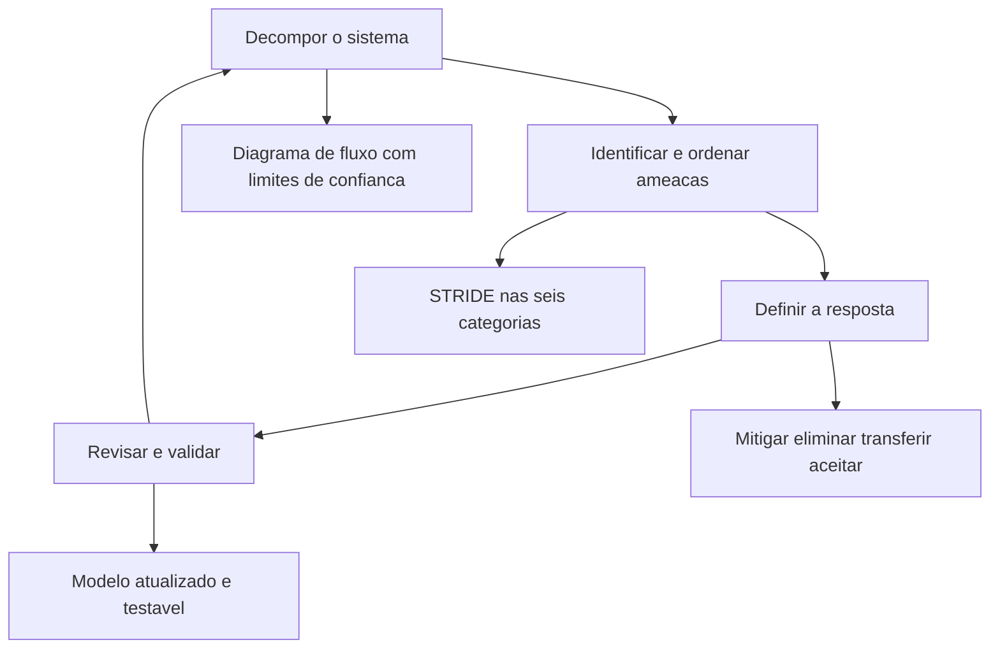
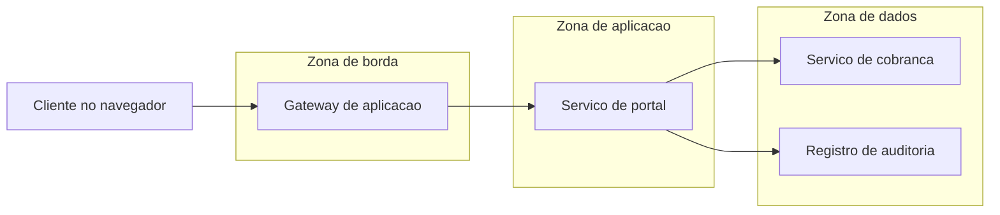

# Modelagem de ameaças

Uma ideia central: modelagem de ameaças é um processo de quatro perguntas que produz um artefato mantido junto com o sistema — e não uma reunião de risco que termina em ata.

## 1. Objetivo de aprendizagem

Ao final deste tema você deve conseguir: produzir um modelo de ameaças de um serviço real, com diagrama de fluxo de dados, limites de confiança marcados, ameaças classificadas por categoria e resposta escrita para cada ameaça.

## 2. Pré-requisitos

Nenhum. O vocabulário de fonte de ameaça e de risco usado aqui vem do [01 Fundamentos](../01-fundamentos/README.md); o princípio que orienta a resposta está no [TEMA-01](TEMA-01-principios-arquitetura-seguranca.md).

## 3. Pré-teste

Responda de palpite, antes de ler o resto. Anote a confiança de 1 a 5.

1. Chute: em quantos projetos do último ano a sua empresa fez modelagem de ameaças? Anote o número ou "nenhum".
   Confiança: ___
2. Palpite: existe norma internacional consolidada para o processo de modelagem de ameaças? Aposte sim ou não.
   Confiança: ___
3. Antes de ler: quantas ameaças a última modelagem da sua empresa identificou? Anote, ou diga se nunca houve uma.
   Confiança: ___

## 4. Caso real

O NIST publicou em março de 2016 o SP 800-154, Guide to Data-Centric System Threat Modeling, como initial public draft. O período de comentários encerrou em 15 de abril de 2016. Uma nota de planejamento datada de 23 de janeiro de 2025 registra que o NIST pretende finalizar a publicação.

Nove anos entre o rascunho e a intenção de finalizar. O documento descreve modelagem de ameaças como forma de avaliação de risco que modela os lados do ataque e da defesa de uma entidade lógica — um dado, uma aplicação, um host, um sistema ou um ambiente — e afirma que a metodologia proposta não pretende substituir as existentes, e sim definir princípios fundamentais.

A pergunta que o caso deixa aberta: se o método de referência de um instituto nacional fica nove anos em rascunho, o que uma empresa deve usar enquanto isso — e como justificar a escolha em auditoria?

## 5. Conteúdo

### 5.1 Conceito

A própria OWASP registra que não existe padrão de indústria universalmente aceito para o processo de modelagem de ameaças. O que existe é convergência em três atividades: modelar o sistema, identificar e ordenar ameaças, e decidir a resposta. Sobre esse consenso, a OWASP propõe quatro perguntas que o processo precisa responder, tomadas do Threat Modeling Manifesto: o que estamos construindo, o que pode dar errado, o que vamos fazer a respeito e se fizemos um trabalho suficiente.

O NIST trata o assunto como forma de avaliação de risco. O SP 800-154 descreve a modelagem como o exercício que representa os lados do ataque e da defesa de uma entidade lógica, e a variante data-centric concentra o esforço nos tipos de dado que precisam de proteção dentro dos sistemas. Essa escolha importa para o CISO: modelar por dado responde "o que protejo e por quê", enquanto modelar por sistema responde "o que construí".

O artefato é o que separa modelagem de reunião. Um modelo mantido contém o diagrama atual, a lista de ameaças com a resposta acordada, os requisitos que saíram dali e a data da última revisão. Sem o artefato, seis meses depois ninguém sabe se a ameaça foi tratada, aceita ou esquecida — e o mesmo debate se repete com as mesmas pessoas.

### 5.2 Como funciona

A primeira etapa é decompor o sistema, e o diagrama de fluxo de dados é o instrumento mais comum. Ele precisa mostrar cinco coisas: fluxos de dado, depósitos de dado, processos, entidades externas e limites de confiança. Limite de confiança é a linha em que o nível de confiança muda — do navegador para o gateway, do gateway para o serviço, do serviço para o banco. Sem essa linha marcada, a etapa seguinte não tem onde apoiar.

A segunda etapa enumera ameaças. O STRIDE organiza seis categorias, cada uma ligada ao atributo de segurança que ela viola: spoofing contra autenticação, tampering contra integridade, repudiation contra contabilidade, information disclosure contra confidencialidade, denial of service contra disponibilidade e elevation of privileges contra autorização. A varredura percorre cada elemento do diagrama e cada fronteira, e pergunta quais dessas seis se aplicam ali.

A terceira etapa decide. As respostas são quatro: mitigar, eliminar, transferir e aceitar. Cada ameaça recebe uma delas, com registro. Mitigação que não vira requisito não existe: a OWASP observa que a mitigação precisa ser acionável e anexada à especificação do sistema, não apenas anotada no documento.

A quarta etapa revisa. O critério de revisão é objetivo: o diagrama ainda representa o sistema, todas as ameaças foram listadas, cada uma tem resposta acordada, a mitigação escolhida é testável, e o modelo está documentado e acessível a quem precisa. A revisão deve ser feita com as partes interessadas, e não apenas com os times de segurança e desenvolvimento.

Duas armadilhas de ordenação. A primeira é tentar estimar probabilidade antes de ter histórico: a OWASP registra que a ordenação por probabilidade vezes impacto é a teoria, e que os dois fatores são difíceis de calcular — uma lista ordenada com base em exposição e alcance é mais útil do que uma matriz preenchida por intuição. A segunda é fazer modelagem só no fim do projeto, o que a converte em inventário de problemas sem espaço para solução.

### 5.3 Exemplo resolvido

Serviço de segunda via de fatura, exposto na internet, com autenticação de cliente e integração com o sistema de cobrança.

Etapa 1, decomposição. Fluxo: cliente autentica no portal, solicita segunda via, o portal consulta o serviço de cobrança, o serviço devolve o documento, o portal registra o evento.

Limites de confiança: entre o navegador e o gateway, o dado vem de ambiente não controlado; entre o gateway e o portal, a sessão passa a ser autenticada; entre o portal e a cobrança, muda o nível de privilégio, porque o serviço de cobrança confia no portal para identificar o cliente.

Etapa 2, varredura com STRIDE. No limite navegador-gateway: spoofing de sessão, se o identificador de sessão for previsível; information disclosure, se o documento ficar em cache no dispositivo; denial of service, se a solicitação não tiver limite de frequência. No limite gateway-portal: elevation of privileges, se o portal aceitar papel vindo do pedido. No limite portal-cobrança: spoofing interno, se o serviço de cobrança aceitar qualquer chamada da rede de aplicação sem verificar o cliente informado.

Etapa 3, resposta para cada ameaça. Sessão previsível: mitigar com identificador aleatório de tamanho definido e rotação na autenticação, virando requisito de teste. Cache no dispositivo: mitigar com cabeçalho de não armazenamento e validação no dispositivo de teste. Sem limite de frequência: mitigar com limite por cliente e por endereço, mais alerta acima do limite. Papel vindo do pedido: eliminar a leitura de papel do pedido e derivar o papel do registro de identidade. Chamada interna sem verificação do cliente: mitigar exigindo que o serviço de cobrança valide a titularidade antes de gerar o documento, e não apenas que a chamada venha de dentro.

Etapa 4, revisão. Quem revisa: dono do serviço, arquiteto, operação e o responsável pelo atendimento, porque o limite de frequência muda o comportamento visível ao cliente. Critério: cada uma das cinco ameaças tem resposta testável? A mitigação 3 tem critério numérico? A mitigação 5 está no contrato da interface?

O que o exemplo mostra é o resultado específico do método: três limites de confiança geraram cinco ameaças e cinco respostas rastreáveis a requisitos, e nenhuma delas exigiu conhecer o atacante pelo nome.

### 5.4 Problema de completar

Caso novo: integração entre o sistema de folha e o banco para pagamento de salários, executada por um serviço que roda à noite.

| Elemento | Ameaça pelo STRIDE | Atributo violado | Resposta escolhida | Requisito que nasce dela |
|---|---|---|---|---|
| Arquivo de remessa em diretório compartilhado | ______ | ______ | ______ | ______ |
| Credencial do serviço no servidor de aplicação | ______ | ______ | ______ | ______ |
| Chamada ao banco sem confirmação de recibo | ______ | ______ | ______ | ______ |
| Relatório de pagamento enviado por e-mail | ______ | ______ | ______ | ______ |

Responda ainda: qual dessas quatro ameaças é a única em que a resposta correta é transferir, e qual é o efeito dessa escolha sobre o registro de risco? Escreva em três linhas.

## 6. Por que isso importa para o CISO

O modelo de ameaças é o documento que permite dizer "não" com alternativa. Quando a área de negócio pede prazo menor, o modelo mostra quais ameaças ficaram sem resposta e o que cada uma custa em risco — não em opinião. Sem ele, a negociação vira disputa de autoridade, e o prazo vence.

Há um efeito de contrato. A resposta escolhida para uma ameaça é a matéria-prima do requisito não funcional e da cláusula de segurança com fornecedor. Empresas que modelam por dado, como propõe o SP 800-154, conseguem responder à pergunta de diligência de cliente corporativo sobre tipo específico de dado e seu caminho.

Existe ainda o custo de não modelar, medido em retrabalho. Ameaça descoberta no desenho muda uma frase da especificação; descoberta em produção muda integração e migração. A decisão que o CISO toma aqui é de processo: exigir modelo antes da aprovação de arquitetura, ainda que simplificado, e definir quem assina a revisão.

## 7. Aplicação prática

Escolha um serviço que já esteja em produção e tenha um dono nomeado. Desenhe, no papel, o diagrama de fluxo com cinco elementos: entidades externas, processos, depósitos de dado, fluxos e limites de confiança. Não use ferramenta: o objetivo é a discussão, não o desenho.

Depois convide duas pessoas — o dono do serviço e alguém da operação — para 60 minutos. Percorra cada limite marcado e pergunte quais das seis categorias do STRIDE se aplicam. Para cada ameaça, escreva a resposta e o requisito que dela nasce. Termine escolhendo a data da próxima revisão e registrando quem a convoca.

## 8. Autoexplicação

Explique em três frases por que limite de confiança é o elemento que faz o método funcionar. Conecte ao seu ambiente: em qual ponto de um serviço seu o nível de privilégio muda, e quem verifica a identidade do chamador nesse ponto?

## 9. Erros comuns e equívocos

| Equívoco | Por que está errado | O que é correto |
|---|---|---|
| Modelagem de ameaças é uma reunião | Reunião não deixa artefato mantido, e o sistema muda depois dela | Produza diagrama, lista de ameaças, respostas e data de revisão |
| Sem atacante identificado não há ameaça relevante | As categorias do STRIDE descrevem classes de falha, e várias se aplicam sem adversário dedicado | Percorra as categorias por elemento e por limite de confiança |
| A matriz de probabilidade e impacto resolve a prioridade | Os dois fatores são difíceis de calcular e ignoram o custo de corrigir | Ordene por exposição, alcance e esforço de correção |
| Mitigação anotada é mitigação feita | Mitigação precisa virar requisito testável, anexado à especificação | Escreva o requisito e o critério de teste que o verifica |
| Modelar uma vez e arquivar | O sistema muda e o modelo desatualizado dá falsa segurança | Revisite na mudança de arquitetura, na entrada de novo dado e no incidente |
| Modelar só no fim do projeto | Sobra pouco espaço de projeto para responder às ameaças encontradas | Modele no desenho e refaça a cada mudança relevante |

## 10. Recuperação ativa

Responda tudo antes de abrir o gabarito.

1. Enuncie as quatro perguntas do processo e diga quem as propôs como formulação corrente.
2. Quais cinco elementos o diagrama de fluxo de dados precisa mostrar para sustentar a etapa de identificação?
3. Liste as seis categorias do STRIDE com o atributo de segurança que cada uma viola.
4. Quais são as quatro respostas possíveis a uma ameaça identificada, e o que falta para uma mitigação existir de fato?
5. Como o NIST descreve modelagem de ameaças no SP 800-154, e qual é a diferença da variante data-centric?
6. Cite o critério objetivo da etapa de revisão e validação.

Conferir respostas

1. O que estamos construindo, o que pode dar errado, o que vamos fazer a respeito e se fizemos um trabalho suficiente. A OWASP registra essa formulação no Threat Modeling Cheat Sheet como as quatro perguntas do Threat Modeling Manifesto.
2. Fluxos de dado, depósitos de dado, processos, entidades externas e limites de confiança.
3. Spoofing contra autenticação, tampering contra integridade, repudiation contra contabilidade, information disclosure contra confidencialidade, denial of service contra disponibilidade e elevation of privileges contra autorização.
4. Mitigar, eliminar, transferir e aceitar. Para a mitigação existir, ela precisa ser formulada como requisito acionável e anexada à especificação do sistema, com forma de testar.
5. Como uma forma de avaliação de risco que modela os lados do ataque e da defesa de uma entidade lógica — dado, aplicação, host, sistema ou ambiente. Na variante data-centric, o foco são os tipos de dado que precisam de proteção dentro dos sistemas.
6. O diagrama ainda representa o sistema, todas as ameaças foram identificadas, cada ameaça tem resposta acordada, as mitigações são testáveis e o modelo está documentado e acessível. A revisão envolve as partes interessadas, não apenas segurança e desenvolvimento.

## 11. Revisão espaçada

| Intervalo | O que fazer | Se errar |
|---|---|---|
| D+1 | Repetir as seis categorias do STRIDE e o atributo de cada uma | Rebaixar: repetir em D+1 |
| D+7 | Refazer a seção 7 em outro serviço, só com a decomposição | Rebaixar: repetir em D+3 |
| D+30 | Conduzir a revisão de um modelo existente com o critério da etapa 4 | Rebaixar: repetir em D+7 |

## 12. Conexões com outros temas

Leitura humana do `relacoes` do frontmatter — que é a fonte. Relações que saem desta área
também aparecem em [mapa-relacoes.md](../mapa-relacoes.md). Regras em
[templates/RELACOES-TEMAS.md](../templates/RELACOES-TEMAS.md).

| Relação | Alvo | Por que |
|---|---|---|
| aplicado_em | 09-aplicacoes-devsecops#TEMA-03 | o mesmo método, aplicado ao desenho de uma aplicação dentro do ciclo de desenvolvimento; destino planejado, número provisório |
| aprofundado_por | 12-vulnerabilidades-threat-intel#TEMA-04 | aqui a ameaça é enumerada por categoria; o catálogo de técnicas observadas em campo e a ligação com o atacante real estão na área 12; destino planejado, número provisório |
| complementa | 03-arquitetura-engenharia#TEMA-01 | o princípio de projeto só vira decisão defensável quando o modelo de ameaças mostra qual adversário e qual caminho ele frustra |

## 13. Certificações e leitura recomendada

| Certificação | Domínio | Recurso | Tipo | Fonte |
|---|---|---|---|---|
| CISSP | Cobertura geral do tema | ISC2 CISSP Certification Exam Outline | primaria | https://www.isc2.org/certifications/cissp/cissp-certification-exam-outline |
| SecurityX | Cobertura geral do tema | CompTIA SecurityX | primaria | https://www.comptia.org/en-us/blog/introducing-comptia-securityx/ |

Leitura direta: [OWASP Threat Modeling Cheat Sheet](https://cheatsheetseries.owasp.org/cheatsheets/Threat_Modeling_Cheat_Sheet.html) e [NIST SP 800-154, Guide to Data-Centric System Threat Modeling, draft de março de 2016](https://csrc.nist.gov/pubs/sp/800/154/ipd).

## 14. Fontes verificadas

| # | Título | Tipo | URL | Acessado em | Confiança |
|---|---|---|---|---|---|
| 1 | OWASP Threat Modeling Cheat Sheet — quatro perguntas, quatro etapas, STRIDE, respostas e critério de validação | primaria | https://cheatsheetseries.owasp.org/cheatsheets/Threat_Modeling_Cheat_Sheet.html | "2026-09-25" | alta |
| 2 | NIST SP 800-154, initial public draft — publicado em março de 2016, comentários encerrados em 15/04/2016, nota de planejamento de 23/01/2025 sobre finalização | primaria | https://csrc.nist.gov/pubs/sp/800/154/ipd | "2026-09-25" | alta |
| 3 | MITRE ATT&CK — Lateral Movement, tactic TA0008 | primaria | https://attack.mitre.org/tactics/TA0008/ | "2026-09-25" | alta |
| 4 | MITRE ATT&CK — Remote Services, technique T1021 | primaria | https://attack.mitre.org/techniques/T1021/ | "2026-09-25" | alta |

---

| Navegação | |
|---|---|
| Área | [03 Arquitetura e engenharia de segurança](./README.md) |
| Tema anterior | [TEMA-01](TEMA-01-principios-arquitetura-seguranca.md) |
| Próximo tema | [TEMA-03](TEMA-03-segmentacao-zonas-de-confianca.md) |
| Home | [README](../README.md) |
