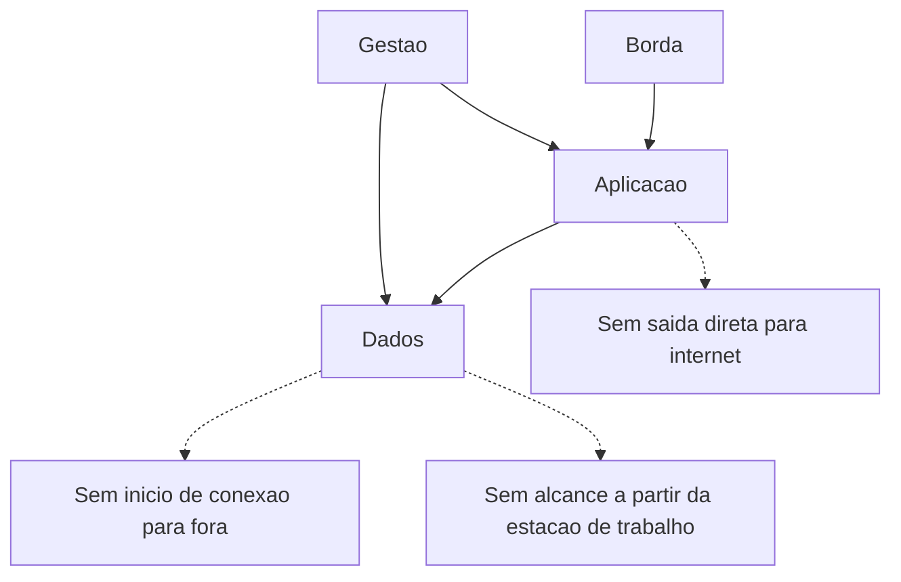

# Segmentação e zonas de confiança

Uma ideia central: zona de confiança é a unidade em que o desenho decide o que uma credencial comprometida consegue alcançar, e a matriz de fluxo é o documento que prova essa decisão.

## 1. Objetivo de aprendizagem

Ao final deste tema você deve conseguir: desenhar zonas de confiança e a matriz de fluxo de um ambiente, declarando o que é negado por padrão, quem aprova exceção e qual regra contém o deslocamento lateral de uma credencial comprometida.

## 2. Pré-requisitos

[TEMA-02](TEMA-02-modelagem-de-ameacas.md). Os limites de confiança marcados no diagrama de fluxo são o insumo direto das zonas desenhadas aqui.

## 3. Pré-teste

Responda de palpite, antes de ler o resto. Anote a confiança de 1 a 5.

1. Chute: quantas zonas de confiança a sua rede tem hoje, contando as que existem só no diagrama? Anote.
   Confiança: ___
2. Palpite: a sua empresa sabe listar quantos ativos há em cada zona? Sim, não, ou em parte.
   Confiança: ___
3. Antes de ler: por qual caminho você aposta que um atacante com uma credencial comum se move primeiro dentro da sua rede? Escreva o palpite.
   Confiança: ___

## 4. Caso real

O MITRE registra a tática de movimento lateral, TA0008, como o conjunto de técnicas que adversários usam para entrar e controlar sistemas remotos em uma rede. Depois da exploração inicial, a progressão típica é explorar a rede em busca do alvo, e então pivotar por vários sistemas e contas até alcançá-lo. A técnica T1021, Remote Services, descreve o passo central: usar contas válidas para entrar em um serviço que aceita conexão remota, como telnet, SSH ou VNC, e operar como o usuário autenticado. A página registra oito sub-técnicas.

A palavra que sustenta esse passo é "contas válidas". Não há falha a corrigir, não há vulnerabilidade a explorar — há uma credencial legítima entrando em um serviço legítimo, de um ponto da rede que o desenho considera interno.

A pergunta que o caso deixa aberta: se a credencial é válida e o serviço é legítimo, o que resta ao desenho além de reduzir o número de destinos que essa credencial alcança?

## 5. Conteúdo

### 5.1 Conceito

O NIST SP 800-207, publicado em agosto de 2020, afirma que o zero trust parte de não conceder confiança implícita a ativos ou contas por causa da localização física ou de rede, e que a localização da rede deixou de ser o principal componente da postura de segurança de um recurso. A implicação para segmentação é direta: a zona de confiança continua útil como contenção, e deixa de ser útil como justificativa de acesso.

Zona de confiança, na prática de desenho, é um agrupamento de ativos que compartilham o mesmo nível de exposição e o mesmo conjunto de destinos que precisam alcançar. O critério de agrupamento não é organograma nem tecnologia: é o dano que uma credencial comprometida ali dentro pode causar e o alcance que ela ganha a partir dali.

Segmentar reduz o alcance; não reduz a quantidade de credenciais. Uma empresa pode ter quarenta VLANs e ainda permitir que a conta de suporte alcance os quarenta segmentos. Nesse caso houve trabalho de rede e nenhum ganho de contenção, porque a matriz de fluxo continua com uma linha que liga tudo.

### 5.2 Como funciona

O desenho começa pela lista de zonas, e a lista começa pelos dados e pelas funções, não pelos equipamentos. Quatro zonas resolvem a maioria dos ambientes: borda, aplicação, dados e gestão. A zona de gestão é a que mais falta em desenhos reais e a que mais rende, porque é por ela que passa o movimento lateral.

O segundo passo é a matriz de fluxo. Linhas são origens, colunas são destinos, e cada célula responde uma pergunta: este par precisa de comunicação, em qual porta e com qual identidade? A regra de preenchimento é negação por padrão: célula vazia significa negado, e o que não está escrito não passa.

O terceiro passo é declarar o que a zona não permite. Uma zona que hospeda o banco de dados não deve iniciar conexão para a internet; uma zona de estação de trabalho não deve alcançar diretamente a zona de dados. Essas duas frases eliminam a maior parte do movimento lateral documentado em TA0008, porque retiram do atacante os caminhos que ele percorre depois de obter a credencial.

O quarto passo é tratar a exceção. Toda matriz real tem exceções: um sistema legado, um fornecedor com acesso remoto, uma integração que ninguém lembra ter criado. Exceção sem prazo vira arquitetura permanente e o desenho perde sentido. Padronize: exceção tem origem, destino, porta, dono, prazo e a regra que a substitui.

Microssegmentação é o mesmo raciocínio aplicado com granularidade menor, até a carga de trabalho, e ela costuma aparecer como requisito em ambiente de containers, onde o endereço muda e a identidade da carga de trabalho é o critério estável. A decisão entre segmentar por rede ou por identidade pertence ao desenho: rede é mais simples de auditar, identidade sobrevive à mudança de endereço.

### 5.3 Exemplo resolvido

Indústria de médio porte, rede plana com um domínio único. Todas as estações, servidores de aplicação, servidores de banco e controladores industriais estão no mesmo intervalo de endereços.

Passo 1, zonas. Borda, aplicação, dados, gestão e estação de trabalho. Os controladores industriais ficam em zona própria, porque a credencial que os alcança tem efeito físico.

Passo 2, matriz de fluxo, quatro linhas representativas.

| Origem | Destino | Porta e protocolo | Identidade exigida | Observação |
|---|---|---|---|---|
| Borda | Aplicação | porta de aplicação | nenhuma, pré-autenticação | apenas serviço publicado |
| Aplicação | Dados | porta de banco | conta de serviço do serviço | uma conta por serviço |
| Gestão | Aplicação e dados | porta de administração | conta administrativa com segundo fator | janela de manutenção |
| Estação de trabalho | Dados | negado | — | nenhuma exceção concedida |

Passo 3, o que a zona nega. A zona de dados não inicia conexão para fora. A estação de trabalho não alcança a zona de dados. A zona de gestão aceita conexão apenas em janela definida, com registro. O controlador industrial aceita apenas comandos da estação de engenharia, em endereço e porta fixos.

Passo 4, exceção tratada. Um fornecedor de ERP pede acesso direto ao banco. A resposta tem formato: origem na faixa do fornecedor, destino em um único servidor, porta específica, conta nominal, validade de 90 dias, alternativa a construir no trimestre seguinte — acesso por serviço intermediário com registro de consulta. O prazo e a alternativa entram na ata.

O que o exemplo demonstra é a diferença entre ter segmentos e ter matriz. Os segmentos já existiam na rede antes do exercício, como VLANs de infraestrutura. O que faltava era a regra escrita de quem alcança quem, e a decisão sobre o que a zona nega.

### 5.4 Problema de completar

Ambiente novo: uma clínica com prontuário eletrônico, laboratório de análises, rede de convênio e estação de recepção.

| Origem | Destino | Porta e protocolo | Identidade exigida | Justificativa |
|---|---|---|---|---|
| Recepção | Prontuário | ______ | ______ | ______ |
| Laboratório | Prontuário | ______ | ______ | ______ |
| Convênio | Prontuário | ______ | ______ | ______ |
| Estação de recepção | Banco de resultados do laboratório | ______ | ______ | ______ |

Responda ainda: a zona do laboratório precisa de saída para a internet para enviar laudos a um serviço externo. Escreva as duas linhas de decisão que faltam — qual destino é permitido e qual identidade a chamada carrega — e diga quem responde pela exceção.

## 6. Por que isso importa para o CISO

Segmentação é a decisão de arquitetura com melhor relação entre custo e efeito no que diz respeito a incidente de resgate. Quando o adversário usa conta válida e serviço legítimo, a única barreira que ainda limita o dano é o alcance da credencial. Reduzir endereços alcançáveis reduz a quantidade de sistemas que precisam ser recuperados.

O custo aparece na operação, e o CISO paga por ele de duas formas. A primeira é o chamado do usuário que perdeu acesso a algo, o que é resolvido com processo de exceção, não com regra permissiva. A segunda é a auditoria da matriz: quem mantém, com que frequência e contra qual fonte de verdade. Uma matriz que ninguém revisa volta a ser rede plana em doze meses.

Há um efeito indireto em contrato de seguro e em avaliação de maturidade: redução de escopo é o argumento que transforma "temos segmentação" em número — quantos sistemas ficam expostos se a credencial de suporte for comprometida hoje.

## 7. Aplicação prática

Desenhe a matriz de fluxo do seu ambiente com cinco linhas e cinco colunas, usando as zonas do item 5.2. Preencha cada célula com permitido, negado ou exceção. Para as células "permitido", verifique na configuração real se elas estão restritas a porta e identidade, ou se estão abertas por intervalo de endereço. As abertas por intervalo são a sua lista de trabalho.

Depois escolha a zona de gestão e responda três perguntas por escrito: quais ativos estão nela, quais contas a alcançam, e qual registro existe dessa atividade. Se a resposta à terceira pergunta for "nenhum", o item entra na sua dívida de segurança com dono e prazo.

## 8. Autoexplicação

Explique em três frases por que segmentar não reduz a quantidade de credenciais comprometíveis, e sim o conjunto de destinos que cada credencial alcança. Conecte ao seu ambiente: qual conta, se comprometida hoje, alcançaria o maior número de sistemas?

## 9. Erros comuns e equívocos

| Equívoco | Por que está errado | O que é correto |
|---|---|---|
| Ter VLAN é ter segmentação | VLAN separa tráfego e não restringe fluxo entre uma VLAN e outra sem regra explícita | Escreva a matriz de fluxo e configure nela a negação por padrão |
| Rede interna é zona de confiança | O SP 800-207 afirma que a localização não concede confiança implícita | Trate a localização como contenção, não como autorização |
| Segmentar por identidade dispensa segmentar por rede | Rede restringe caminho; identidade restringe ator, e as duas atuam em camadas diferentes | Combine as duas: caminho negado é melhor que ator verificado |
| Exceção de acesso remoto de fornecedor é inevitável e permanente | Exceção permanente reintroduz o caminho que a zona fechou | Dê prazo, dono e a regra que a substitui |
| Matriz de fluxo é documento de rede | Ela é documento de decisão de arquitetura, e o dono é quem responde pelo risco | Revise a matriz a cada mudança relevante e registre quem aprovou |
| Microssegmentação exige trocar toda a rede | Microssegmentação é granularidade de regra, não substituição de infraestrutura | Comece pelas cargas de trabalho que mais contêm dado sensível |

## 10. Recuperação ativa

Responda tudo antes de abrir o gabarito.

1. Escreva como o MITRE ATT&CK define a tática de movimento lateral e cite a técnica central em que a conta válida é o instrumento.
2. O que o NIST SP 800-207 afirma sobre confiança implícita e localização de rede?
3. Qual é o critério para agrupar ativos em uma zona de confiança?
4. Quais são os quatro passos do desenho de zonas apresentados no tema, na ordem?
5. Por que a zona de gestão é a que mais rende quando é separada?
6. Que campos mínimos uma exceção precisa ter para não virar arquitetura permanente?

Conferir respostas

1. Movimento lateral, tactic TA0008, reúne as técnicas que adversários usam para entrar e controlar sistemas remotos em uma rede, explorando a rede para achar o alvo e pivotando por vários sistemas e contas. A técnica central citada é T1021, Remote Services, em que o adversário usa contas válidas para entrar em um serviço que aceita conexão remota, como telnet, SSH ou VNC.
2. Que o zero trust parte de não conceder confiança implícita a ativos ou contas com base apenas na localização física ou de rede ou na propriedade do ativo, e que a localização da rede deixou de ser o principal componente da postura de segurança do recurso.
3. O nível de exposição compartilhado, o dano que uma credencial comprometida dentro dela pode causar e o conjunto de destinos a que os ativos da zona precisam chegar.
4. Listar zonas a partir de dados e funções, montar a matriz de fluxo com negação por padrão, declarar o que cada zona não permite e tratar as exceções com prazo e dono.
5. Porque é por ela que passa o movimento lateral: é a zona com maior privilégio e menor número de usuários legítimos, e a que costuma concentrar protocolos administrativos aceitos por muitos destinos.
6. Origem, destino, porta, identidade, dono, prazo e a regra ou arquitetura que substitui a exceção ao final do prazo.

## 11. Revisão espaçada

| Intervalo | O que fazer | Se errar |
|---|---|---|
| D+1 | Desenhar de memória as quatro zonas e a regra de negação por padrão | Rebaixar: repetir em D+1 |
| D+7 | Refazer a seção 7 com outro processo de negócio | Rebaixar: repetir em D+3 |
| D+30 | Verificar se uma exceção vencida foi de fato removida | Rebaixar: repetir em D+7 |

## 12. Conexões com outros temas

Leitura humana do `relacoes` do frontmatter — que é a fonte. Relações que saem desta área
também aparecem em [mapa-relacoes.md](../mapa-relacoes.md). Regras em
[templates/RELACOES-TEMAS.md](../templates/RELACOES-TEMAS.md).

| Relação | Alvo | Por que |
|---|---|---|
| aplicado_em | 10-operacoes-soc#TEMA-02 | o desenho de zona determina quais fluxos existem e, por consequência, o que a telemetria de rede consegue provar; destino planejado, número provisório |
| complementa | 05-rede-infraestrutura#TEMA-03 | a zona de confiança define o que precisa ser isolado e por qual critério; a configuração de VLAN, firewall e política de fluxo executa o isolamento; destino planejado, número provisório |
| nao_confundir_com | 03-arquitetura-engenharia#TEMA-04 | segmentar por localização de rede não é o mesmo que eliminar a confiança implícita na localização; a zona contém o deslocamento, o padrão zero trust muda o que a localização autoriza |

## 13. Certificações e leitura recomendada

| Certificação | Domínio | Recurso | Tipo | Fonte |
|---|---|---|---|---|
| CISSP | Cobertura geral do tema | ISC2 CISSP Certification Exam Outline | primaria | https://www.isc2.org/certifications/cissp/cissp-certification-exam-outline |
| SecurityX | Cobertura geral do tema | CompTIA SecurityX | primaria | https://www.comptia.org/en-us/blog/introducing-comptia-securityx/ |

Leitura direta: [MITRE ATT&CK, tactic TA0008 e technique T1021](https://attack.mitre.org/tactics/TA0008/).

## 14. Fontes verificadas

| # | Título | Tipo | URL | Acessado em | Confiança |
|---|---|---|---|---|---|
| 1 | MITRE ATT&CK — Lateral Movement, tactic TA0008, definição e progressão típica | primaria | https://attack.mitre.org/tactics/TA0008/ | "2026-09-25" | alta |
| 2 | MITRE ATT&CK — Remote Services, technique T1021, uso de contas válidas e oito sub-técnicas | primaria | https://attack.mitre.org/techniques/T1021/ | "2026-09-25" | alta |
| 3 | NIST SP 800-207 — confiança implícita e localização de rede | primaria | https://csrc.nist.gov/pubs/sp/800/207/final | "2026-09-25" | alta |
| 4 | OWASP Threat Modeling Cheat Sheet — limites de confiança como elemento do diagrama de fluxo | primaria | https://cheatsheetseries.owasp.org/cheatsheets/Threat_Modeling_Cheat_Sheet.html | "2026-09-25" | alta |

---

| Navegação | |
|---|---|
| Área | [03 Arquitetura e engenharia de segurança](./README.md) |
| Tema anterior | [TEMA-02](TEMA-02-modelagem-de-ameacas.md) |
| Próximo tema | [TEMA-04](TEMA-04-padroes-zero-trust-defesa-em-profundidade.md) |
| Home | [README](../README.md) |
