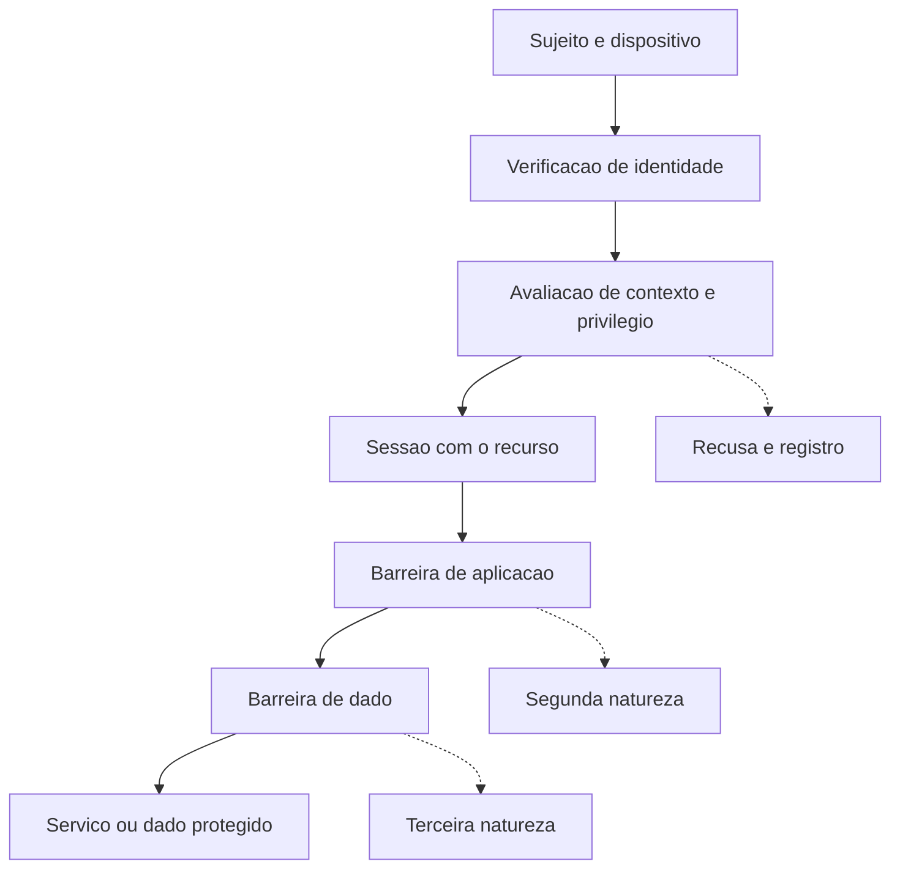

# Padrões de arquitetura: zero trust e defesa em profundidade

Uma ideia central: zero trust e defesa em profundidade respondem a duas falhas distintas — confiança concedida por localização e dependência de uma única barreira —, e tratá-las como sinônimos deixa as duas sem solução.

## 1. Objetivo de aprendizagem

Ao final deste tema você deve conseguir: avaliar uma arquitetura contra os pressupostos de zero trust e contra a definição de defesa em profundidade, listando a confiança implícita que permanece e nomeando qual barreira contém o dano quando uma delas falha.

## 2. Pré-requisitos

[TEMA-01](TEMA-01-principios-arquitetura-seguranca.md). O padrão de arquitetura é o princípio aplicado a um problema recorrente: aqui, confiança e contenção.

## 3. Pré-teste

Responda de palpite, antes de ler o resto. Anote a confiança de 1 a 5.

1. Chute: quantos sistemas da sua empresa exigem verificação do dispositivo além da senha? Anote o número.
   Confiança: ___
2. Palpite: um projeto de zero trust começa comprando ferramenta ou revendo as identidades administrativas? Escolha um.
   Confiança: ___
3. Antes de ler: qual confiança implícita da sua empresa você removeria primeiro? Escreva e guarde para comparar com o critério do tema.
   Confiança: ___

## 4. Caso real

Em agosto de 2020, o NIST publicou o SP 800-207, Zero Trust Architecture. O resumo do documento começa afirmando que zero trust é o termo para um conjunto em evolução de paradigmas que deslocam as defesas do perímetro estático baseado em rede para o foco em usuários, ativos e recursos. Diz também que autenticação e autorização, de sujeito e de dispositivo, são funções distintas executadas antes de estabelecer a sessão com um recurso corporativo.

O documento explica de onde veio a mudança: usuários remotos, dispositivos pessoais no trabalho e ativos em nuvem que não ficam dentro de um perímetro de rede de propriedade da empresa. O mesmo resumo registra uma consequência que costuma passar despercebida: o foco passa a ser proteger recursos — ativos, serviços, fluxos de trabalho, contas —, e não segmentos de rede.

A pergunta que o caso deixa aberta: se a localização de rede deixa de ser o principal componente da postura de segurança, o que resta ao desenho de arquitetura para conter um adversário que já está dentro com credencial válida?

## 5. Conteúdo

### 5.1 Conceito

Zero trust é uma premissa, não um produto. A premissa: nenhum ativo ou conta recebe confiança pelo simples fato de estar dentro de uma rede, de pertencer à empresa ou de ter sido autenticado uma única vez. Dela decorrem duas consequências de desenho: autenticação e autorização de sujeito e de dispositivo são verificadas antes de abrir a sessão com o recurso, e cada acesso é avaliado no seu próprio contexto.

Defesa em profundidade, no glossário do NIST sob o SP 800-53 Rev. 5, é a estratégia de segurança que integra capacidades de pessoas, tecnologia e operações para estabelecer barreiras variáveis ao longo de várias camadas e dimensões da organização. "Variável" é a palavra técnica: barreiras de natureza diferente entre camadas, de forma que a mesma técnica não derrube duas.

Os dois padrões não competem. Zero trust decide quem pode, com base em identidade e contexto verificados a cada sessão. Defesa em profundidade decide o que acontece quando a decisão estiver errada — quantas barreiras, de naturezas distintas, separam quem passou do ativo que importa. Uma empresa pode adotar zero trust e manter uma única barreira entre a credencial e o dado: o acesso estará corretamente autorizado e o dano, sem contenção.

Há um terceiro elemento que liga os dois: o menor privilégio. O glossário do NIST o define, sob o SP 800-12 Rev. 1 com origem no CNSSI 4009, como o princípio pelo qual a arquitetura concede a cada entidade o mínimo de recursos e autorizações necessário para cumprir sua função. Sem ele, a autorização por sessão apenas formaliza um alcance grande.

### 5.2 Como funciona

A adoção começa pelo inventário da confiança implícita existente. Para cada caminho de acesso relevante, três perguntas. O que autoriza este acesso hoje: identidade, localização ou propriedade do dispositivo? A decisão é tomada uma vez na entrada, ou em cada sessão e cada recurso? O que mais fica alcançável depois que este acesso é concedido?

O resultado é uma lista de pressupostos, e cada um deles é uma decisão a tomar. Um serviço interno que aceita qualquer um da rede corporativa sem verificar o usuário é confiança implícita por localização. Um servidor que aceita conexão administrativa de qualquer estação do escritório é a mesma coisa, aplicada a protocolo administrativo. A técnica T1021 do MITRE ATT&CK descreve exatamente esse caminho: entrar em um serviço que aceita conexão remota usando contas válidas.

A segunda parte é a lista de barreiras entre o caminho e o ativo, com a natureza de cada uma. Naturezas diferentes significam exigências diferentes: algo que o atacante precisa saber, ter, ser ou fazer. Duas senhas na mesma tela são uma única barreira de natureza única. Uma barreira de rede, uma de autenticação com fator físico e uma de aprovação por outro setor são três naturezas distintas.

Roadmap de adoção que evita o pior erro. Comece pelas identidades administrativas, porque é por elas que passa o movimento lateral. Siga pelas identidades de máquina, que costumam ter privilégio maior e revisão mais rara. Depois imponha verificação por sessão nos recursos que contêm dado crítico. Por último, retire as regras de rede que existiam apenas para compensar a ausência de verificação — retirar antes de verificar derruba a operação, e o projeto morre com má reputação.

### 5.3 Exemplo resolvido

Empresa com VPN, rede interna considerada confiável e servidores de aplicação administrados por área técnica. A avaliação segue as três perguntas.

Caminho 1: analista acessa o sistema financeiro pela VPN. Autorização hoje: a VPN autentica o usuário, e o sistema financeiro confia na rede interna. Decisão: uma vez, na entrada. Alcançável depois: qualquer serviço que aceite conexão da rede interna, incluindo servidores administrativos.

Conclusão: confiança implícita por localização, em dois níveis. Correção: verificação por sessão no sistema financeiro, com autorização derivada do papel e não da rede, e autenticação de dispositivo antes da sessão. Barreira que permanece: a aplicação continua exigindo perfil próprio, o que é a segunda natureza.

Caminho 2: suporte de TI acessa servidor de aplicação por protocolo remoto, de qualquer estação do escritório. Autorização: autenticação de domínio, sem verificação de origem. Decisão: uma vez por sessão, mas para qualquer destino. Alcançável: todos os servidores de aplicação, com a mesma credencial.

Conclusão: confiança implícita na estação de trabalho, e alcance sem limite. Correção: estação de salto dedicada, com registro de sessão, janela de manutenção e aprovação por chamado; retirar o protocolo administrativo do alcance das estações comuns. Barreira: a estação de salto deixa de ser caminho e passa a ser ponto de verificação, com trilha.

Caminho 3: serviço de integração acessa o banco com conta de aplicação. Autorização: credencial em arquivo de configuração, sem expiração. Decisão: nunca reavaliada. Alcançável: todas as tabelas do banco.

Conclusão: privilégio excessivo para identidade de máquina. Correção: credencial de vida curta, emitida para a carga de trabalho, com permissão restrita às tabelas necessárias. Barreira: o registro de consulta por identidade, que antes não existia porque todas as consultas usavam a mesma conta.

O que o exemplo demonstra é a ordem de ataque ao problema. Nem identidade nem barreira resolvem sozinhas, e as duas correções mais baratas estão nos caminhos administrativos.

### 5.4 Problema de completar

Avalie o caminho a seguir e complete a tabela.

Caminho: aplicação na nuvem acessa um serviço de banco de dados gerenciado usando chave estática guardada em variável de ambiente, com regra de rede que permite o acesso de qualquer endereço do projeto.

| Pergunta | Resposta |
|---|---|
| O que autoriza o acesso hoje | ______ |
| A decisão é por sessão ou uma vez | ______ |
| O que mais fica alcançável depois do acesso | ______ |
| Confiança implícita identificada | ______ |
| Correção de identidade | ______ |
| Correção de privilégio | ______ |
| Barreira de segunda natureza | ______ |

Responda ainda: a empresa afirma ter zero trust porque exige segundo fator no portal do provedor de nuvem. Essa afirmação se sustenta? Justifique em três linhas com base na definição do SP 800-207.

## 6. Por que isso importa para o CISO

Zero trust virou item de fornecedor, e a maior parte das propostas que chegam ao CISO trata o assunto como aquisição. O SP 800-207 permite separar as duas coisas: se o vendedor não descreve como a identidade de sujeito e de dispositivo é verificada antes de cada sessão com o recurso, ele está vendendo rede, não premissa.

Defesa em profundidade é o argumento que sustenta verba recorrente em vez de verba de projeto. Explicar ao comitê que prevenção reduz a probabilidade de falha e detecção reduz o tempo de convivência com a falha muda a conversa sobre cortar o orçamento de detecção depois de uma compra grande de prevenção.

Existe, ainda, a consequência orçamentária do alcance. Zero trust encarece a gestão de identidade e a engenharia de autorização por recurso, e barateia o controle de dano. Empresas que fazem só a primeira metade ficam com um ambiente corretamente autenticado e tolerante à propagação interna de uma sessão roubada.

## 7. Aplicação prática

Escolha os três caminhos de acesso administrativo mais usados na sua empresa e, para cada um, responda as três perguntas do item 5.2 por escrito, com o nome de quem responde. Em seguida, liste as barreiras existentes entre esse caminho e o ativo mais crítico que ele alcança, e classifique cada barreira pela natureza: algo que o atacante precisa saber, ter, ser ou fazer.

Se duas barreiras tiverem a mesma natureza, escreva isso no resultado. O registro de duas barreiras iguais é o achado que transforma a conversa de arquitetura em item de plano com prazo.

## 8. Autoexplicação

Explique em três frases a diferença entre conceder confiança por identidade verificada e empilhar barreiras de naturezas distintas. Conecte ao seu ambiente: qual acesso hoje é autorizado por localização de rede, e quem assinaria a mudança?

## 9. Erros comuns e equívocos

| Equívoco | Por que está errado | O que é correto |
|---|---|---|
| Zero trust é produto | É um conjunto de princípios de desenho, e o resumo do SP 800-207 fala de paradigmas, não de tecnologia | Verifique se a proposta descreve decisão por sessão e por recurso |
| Ter VPN e segundo fator é ser zero trust | Se depois da entrada o acesso continua autorizado por localização, a confiança implícita permaneceu | Avalie cada recurso, não apenas a entrada na rede |
| Zero trust dispensa segmentação | O próprio SP 800-207 fala de proteger recursos e não segmentos, e contenção continua sendo camada separada | Combine decisão por identidade com caminho restrito |
| Defesa em profundidade é ter dois produtos de segurança | A definição fala de barreiras variáveis entre camadas e dimensões | Cada barreira precisa exigir do atacante algo diferente |
| Detecção é acessório depois da prevenção | Detecção reduz o tempo de convivência com a falha e cobre o que a prevenção não pega | Trate prevenção e detecção como camadas de naturezas distintas |
| Menor privilégio vale só para pessoas | A definição do NIST alcança entidades, incluindo processos que agem em nome de usuários | Aplique às contas de serviço e às identidades de carga de trabalho |

## 10. Recuperação ativa

Responda tudo antes de abrir o gabarito.

1. Transcreva a afirmação do SP 800-207 sobre confiança implícita e diga o que o documento coloca no lugar do perímetro estático.
2. Quais duas funções o resumo do SP 800-207 declara serem distintas e executadas antes de estabelecer a sessão com um recurso?
3. Escreva a definição de defesa em profundidade registrada pelo glossário do NIST e explique o efeito da palavra "variável".
4. Escreva a definição de menor privilégio e diga por que ela é o que liga identidade e contenção.
5. Em que ordem o tema propõe começar a adoção, e por que a última etapa é retirar regras de rede?
6. Um serviço aceita conexão administrativa de qualquer estação do escritório com autenticação de domínio. Qual pressuposto de zero trust está violado e qual barreira falta?

Conferir respostas

1. "Zero trust assumes there is no implicit trust granted to assets or user accounts based solely on their physical or network location or on asset ownership". No lugar do perímetro estático, o foco passa a ser usuários, ativos e recursos — o documento fala em proteger recursos e não segmentos de rede.
2. Autenticação e autorização, tanto de sujeito quanto de dispositivo, como funções distintas executadas antes de estabelecer a sessão com o recurso corporativo.
3. Estratégia que integra capacidades de pessoas, tecnologia e operações para estabelecer barreiras variáveis ao longo de várias camadas e dimensões da organização. "Variável" significa que as barreiras têm naturezas diferentes, para que a mesma técnica não derrube duas de uma vez.
4. Conceder a cada entidade o mínimo de recursos e autorizações necessário para cumprir sua função, alcançando processos que agem em nome de usuários. Ela limita o alcance de uma sessão corretamente autenticada, e é isso que impede que a decisão por identidade seja apenas uma formalidade.
5. Começar pelas identidades administrativas, seguir pelas identidades de máquina, impor verificação por sessão nos recursos com dado crítico e, por último, retirar as regras de rede que existiam para compensar a falta de verificação. A retirada vem por último porque remover o caminho antes de verificar a identidade derruba a operação.
6. Está violado o pressuposto de que a autorização de dispositivo e sujeito é função discreta avaliada antes da sessão: a localização da estação faz o papel de autorização. Falta a barreira de segunda natureza — por exemplo, verificação de dispositivo, aprovação por chamado ou janela de manutenção com registro de sessão.

## 11. Revisão espaçada

| Intervalo | O que fazer | Se errar |
|---|---|---|
| D+1 | Repetir as três perguntas de avaliação de confiança implícita | Rebaixar: repetir em D+1 |
| D+7 | Refazer a seção 7 em outro caminho administrativo | Rebaixar: repetir em D+3 |
| D+30 | Voltar ao achado de barreiras de mesma natureza e verificar se virou item com prazo | Rebaixar: repetir em D+7 |

## 12. Conexões com outros temas

Leitura humana do `relacoes` do frontmatter — que é a fonte. Relações que saem desta área
também aparecem em [mapa-relacoes.md](../mapa-relacoes.md). Regras em
[templates/RELACOES-TEMAS.md](../templates/RELACOES-TEMAS.md).

| Relação | Alvo | Por que |
|---|---|---|
| aplicado_em | 08-cloud#TEMA-02 | o acesso em nuvem é onde o padrão de zero trust encosta na política de identidade do provedor; destino planejado, número provisório |
| complementa | 04-identidade-acesso#TEMA-06 | zero trust só se sustenta com identidade forte: sem autenticação de sujeito e de dispositivo confiável, o padrão vira intenção sem controle; destino planejado, número provisório |
| nao_confundir_com | 03-arquitetura-engenharia#TEMA-03 | segmentar por localização de rede não é o mesmo que eliminar a confiança implícita na localização; a zona contém o deslocamento, o padrão zero trust muda o que a localização autoriza |

## 13. Certificações e leitura recomendada

| Certificação | Domínio | Recurso | Tipo | Fonte |
|---|---|---|---|---|
| CISSP | Cobertura geral do tema | ISC2 CISSP Certification Exam Outline | primaria | https://www.isc2.org/certifications/cissp/cissp-certification-exam-outline |
| SecurityX | Cobertura geral do tema | CompTIA SecurityX | primaria | https://www.comptia.org/en-us/blog/introducing-comptia-securityx/ |

Leitura direta: [NIST SP 800-207, Zero Trust Architecture, agosto de 2020](https://csrc.nist.gov/pubs/sp/800/207/final) e [NIST SP 800-207A, publicação complementar ao SP 800-207; título completo NAO CONFIRMADO em fonte oficial nesta execução](https://csrc.nist.gov/pubs/sp/800/207/a/final).

## 14. Fontes verificadas

| # | Título | Tipo | URL | Acessado em | Confiança |
|---|---|---|---|---|---|
| 1 | NIST SP 800-207 — Zero Trust Architecture, publicado em agosto de 2020, resumo com confiança implícita, funções discretas de autenticação e autorização e foco em recursos | primaria | https://csrc.nist.gov/pubs/sp/800/207/final | "2026-09-25" | alta |
| 2 | NIST SP 800-207A — A Zero Trust Architecture Model for Access Control in Cloud-Native Applications, publicação complementar indicada na página do SP 800-207 | primaria | https://csrc.nist.gov/pubs/sp/800/207/a/final | "2026-09-25" | alta |
| 3 | NIST CSRC Glossary — defense in depth, texto do NIST SP 800-53 Rev. 5 | primaria | https://csrc.nist.gov/glossary/term/defense_in_depth | "2026-09-25" | alta |
| 4 | NIST CSRC Glossary — least privilege, texto do NIST SP 800-12 Rev. 1 sob origem CNSSI 4009 | primaria | https://csrc.nist.gov/glossary/term/least_privilege | "2026-09-25" | alta |
| 5 | MITRE ATT&CK — Remote Services, technique T1021 | primaria | https://attack.mitre.org/techniques/T1021/ | "2026-09-25" | alta |

---

| Navegação | |
|---|---|
| Área | [03 Arquitetura e engenharia de segurança](./README.md) |
| Tema anterior | [TEMA-03](TEMA-03-segmentacao-zonas-de-confianca.md) |
| Próximo tema | [TEMA-05](TEMA-05-seguranca-por-design-requisitos-nao-funcionais.md) |
| Home | [README](../README.md) |
