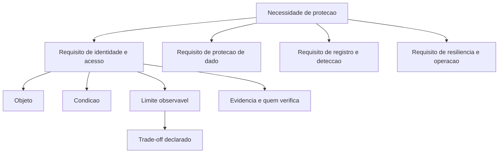

# Segurança por design e requisitos não funcionais

Uma ideia central: segurança entra no desenho por meio de requisito verificável, e o que não tem critério de aceite não é requisito — é intenção declarada.

## 1. Objetivo de aprendizagem

Ao final deste tema você deve conseguir: escrever 5 requisitos não funcionais de segurança com critério de aceite testável por terceiro, cada um ligado ao risco que reduz e ao dono que responde por ele.

## 2. Pré-requisitos

[TEMA-01](TEMA-01-principios-arquitetura-seguranca.md). O princípio de projeto é a origem do requisito: "não existe caminho alternativo até o dado" é mediação completa escrita em forma verificável.

## 3. Pré-teste

Responda de palpite, antes de ler o resto. Anote a confiança de 1 a 5.

1. Chute: quantos requisitos não funcionais de segurança aparecem no último contrato de fornecedor que você leu? Anote o número.
   Confiança: ___
2. Palpite: corrigir um problema de segurança depois da entrega custa quantas vezes mais do que resolvê-lo no desenho? Anote uma ordem de grandeza.
   Confiança: ___
3. Antes de ler: quem testa o requisito de segurança de um serviço contratado — a sua área técnica, o fornecedor ou ninguém? Aposte.
   Confiança: ___

## 4. Caso real

O NIST publicou o SP 800-160 Volume 1 em março de 2018 e o substituiu pela revisão 1 em novembro de 2022, com versões em consulta pública em janeiro e junho daquele ano. A revisão 1 descreve princípios, conceitos, atividades e tarefas para engenharia de sistemas confiáveis, aplicáveis dentro de esforços de engenharia de sistemas, e declara que a publicação serve de base para programas de formação, certificações profissionais e outros critérios de avaliação.

Quatro anos entre a edição e a revisão, em um documento que trata de fundamentos. O mesmo documento lista, entre suas palavras-chave, "security requirements", "protection needs", "engineering trades", "verification" e "validation" — o vocabulário que separa intenção de exigência.

A pergunta que o caso deixa aberta: se a referência de engenharia envelhece em quatro anos, o que acontece com um requisito de segurança escrito sem versão, sem métrica e sem forma de verificação?

## 5. Conteúdo

### 5.1 Conceito

Segurança por design significa que a proteção é decidida na mesma etapa em que o sistema é decidido. O material da OWASP sobre modelagem de ameaças registra o argumento de custo: identificar a questão de segurança no desenho permite que a segurança seja parte do sistema, em vez de aplicada por cima depois. A expressão usada ali é direta — built-in em vez de bolt-on.

Requisito não funcional de segurança é a frase que transforma essa decisão em obrigação verificável. Ele não descreve função do produto, descreve propriedade do sistema: quanto tempo até detectar, qual algoritmo mínimo, quem precisa aprovar, quanto tempo o registro permanece, qual taxa de erro é aceitável.

O NIST SP 800-160 Rev. 1 trata o assunto dentro da engenharia de sistemas, e o faz com duas palavras que o gestor aproveita: "protection needs" e "engineering trades". A primeira obriga a dizer o que precisa ser protegido e contra o quê. A segunda obriga a declarar o que se perde na escolha — latência, custo, autonomia da equipe, prazo.

### 5.2 Como funciona

Um requisito verificável tem quatro partes, e a ausência de qualquer uma o torna inútil em auditoria. A primeira é o objeto: qual ativo, dado, interface ou processo está sendo tratado. A segunda é a condição: sob qual situação o requisito vale. A terceira é o limite: o número, o prazo ou a propriedade observável que precisa ser atingida. A quarta é a evidência: o que a equipe entrega para provar, e quem verifica.

Escrever "criptografia em trânsito" não atende. Escrever "todo tráfego entre o serviço de pedidos e o serviço de pagamento usa TLS na versão mínima definida pela política, verificado por varredura automatizada a cada entrega, com falha bloqueando a promoção" atende: objeto, condição, limite verificável e evidência.

Existem quatro famílias de requisito não funcional de segurança que cobrem a maior parte das necessidades. Requisito de identidade e acesso: quem prova o quê antes de cada operação sensível. Requisito de proteção de dado: em que estado o dado é cifrado, com qual gestão de chave e por quanto tempo é retido. Requisito de registro e detecção: o que é registrado, onde o registro é armazenado, por quanto tempo e quem consegue lê-lo. Requisito de resiliência e operação: limite de taxa, comportamento sob falha, tempo de recuperação e comportamento por padrão quando a verificação estiver indisponível.

O trade-off é explícito e tem que ser nomeado. Negação por padrão quando o serviço de identidade cai significa indisponibilidade; disponibilidade significa aceitar acesso sem verificação. Nenhuma das duas opções é técnica — é decisão de negócio, e o requisito é o lugar onde ela fica escrita. O SP 800-160 nomeia esse exercício como parte da engenharia de sistemas confiáveis.

### 5.3 Exemplo resolvido

Pedido de negócio: "precisamos de um portal de autoatendimento, e ele tem que ser seguro". Quatro frases chegam ao time de arquitetura. O trabalho é convertê-las em requisitos.

Frase 1: o cliente só vê os próprios dados. Requisito: toda consulta do portal é executada no contexto do identificador do titular autenticado, e nenhuma consulta aceita identificador informado pelo cliente; a verificação é feita por teste automatizado que tenta acessar registro de outro titular e exige recusa. Dono: serviço de portal. Risco reduzido: exposição de dado de outro titular por falha de autorização.

Frase 2: o portal precisa ser rápido. Requisito: a consulta de extrato responde em até o limite definido pela área de negócio no percentil acordado, com o limite medido em ambiente de produção e reportado semanalmente. Aqui o requisito é de desempenho, e o de segurança acompanha: o limite de taxa por titular e por endereço não pode ser reduzido para atender à meta de vazão; se a meta dependê-lo, a decisão sobe ao comitê. Dono: dono do serviço. Risco reduzido: indisponibilidade por volume de requisições.

Frase 3: o cliente precisa recuperar a senha sozinho. Requisito: a recuperação exige segundo fator previamente cadastrado; a resposta à solicitação não revela se o identificador existe; cada solicitação é registrada com origem e resultado. Evidência: caso de teste de resposta uniforme e revisão mensal do registro. Dono: identificação. Risco reduzido: tomada de conta e enumeração de clientes.

Frase 4: a auditoria precisa enxergar tudo. Requisito: toda operação de leitura e escrita em dado de cliente gera evento com identificador do titular, identificador do solicitante, resultado e origem; o evento é gravado em armazenamento separado do serviço que o gerou, com retenção definida pela política de retenção e permissão de leitura restrita a perfis nomeados. Evidência: amostra de 20 eventos confrontada com a operação. Dono: segurança e tecnologia, conjuntamente. Risco reduzido: incapacidade de reconstituir incidente.

O que o exemplo demonstra é o custo de reescrever quatro frases. Cada requisito ganhou limite observável, evidência e dono. Nenhum deles exigiu tecnologia específica, e todos podem ser testados por alguém que não participou do projeto.

### 5.4 Problema de completar

Contrato novo: serviço terceirizado de folha de pagamento, com integração por arquivo e painel de consulta.

| Frase de negócio | Objeto | Condição | Limite observável | Evidência e quem verifica | Dono |
|---|---|---|---|---|---|
| O fornecedor precisa entregar com segurança | ______ | ______ | ______ | ______ | ______ |
| Ninguém pode ver o salário dos outros | ______ | ______ | ______ | ______ | ______ |
| Precisamos saber se algo estranho acontecer | ______ | ______ | ______ | ______ | ______ |
| O serviço não pode ficar fora do ar | ______ | ______ | ______ | ______ | ______ |

Responda ainda: qual das quatro linhas tem a decisão de trade-off mais difícil, e qual cláusula do contrato precisa carregar essa decisão? Escreva em três linhas.

## 6. Por que isso importa para o CISO

Requisito verificável é o instrumento que faz a segurança sobreviver à pressão de prazo. Uma frase sem limite é negociada a cada reunião; um critério de aceite aprovado entra na definição de pronto e a discussão passa a ser sobre a evidência, não sobre a vontade.

O efeito em contrato é o mais visível. Cláusula genérica de segurança não produz obrigação executável. Requisito com objeto, limite e evidência produz: gera aceite formal, gera recusa documentada, gera desconto ou glosa. O mesmo vale para o edital do lado de dentro, entre área de negócio e time interno.

Existe um efeito de orçamento. Quando a troca é declarada — indisponibilidade contra verificação, latência contra inspeção —, o custo aparece no lugar certo, que é a decisão de negócio. O CISO deixa de ser o departamento que atrasa e passa a ser quem apresenta o preço da proteção escolhida.

## 7. Aplicação prática

Pegue três cláusulas de segurança de um contrato vigente ou de um edital em andamento e reescreva cada uma no formato de quatro partes: objeto, condição, limite observável, evidência. Não é preciso ler o contrato inteiro: três cláusulas bastam para o exercício.

Depois responda duas perguntas por cláusula. Quem verificaria isso hoje, com qual ferramenta e em qual prazo? Se a resposta for "ninguém", escreva o requisito em branco ao lado do original e leve os dois à próxima negociação de contrato.

## 8. Autoexplicação

Explique em três frases por que "solução segura" não é requisito. Conecte ao seu ambiente: qual cláusula de segurança você assinou nos últimos doze meses que não tinha limite observável nem evidência definida?

## 9. Erros comuns e equívocos

| Equívoco | Por que está errado | O que é correto |
|---|---|---|
| Requisito não funcional é detalhe técnico do time | É a obrigação verificável que liga risco a entrega, e o dono é quem responde pelo risco | Escreva objeto, condição, limite e evidência, com dono nomeado |
| "Aderente às melhores práticas" é requisito | Não define objeto, limite nem forma de verificação | Nomeie a referência, a versão e o critério observável |
| Segurança por design é revisar no fim do projeto | No fim sobram poucas decisões abertas e o custo já está contratado | Decida na etapa de desenho, com modelo de ameaças como insumo |
| Todo requisito de segurança custa disponibilidade | O custo depende da escolha, e a escolha é de negócio | Declare o trade-off e registre quem o aprovou |
| Métrica de segurança é assunto de dashboard | Métrica sem limite acordado não gera obrigação nem bloqueio de entrega | Amarre o limite ao critério de aceite da entrega |
| Requisito verificável exige ferramenta cara | Um caso de teste escrito à mão verifica muitos requisitos | Comece pelo critério testável e depois automatize |

## 10. Recuperação ativa

Responda tudo antes de abrir o gabarito.

1. Descreva a diferença entre segurança construída no desenho e segurança aplicada por cima, usando o argumento de custo registrado pela OWASP.
2. Quais são as quatro partes de um requisito verificável?
3. Liste as quatro famílias de requisito não funcional de segurança apresentadas no tema.
4. Escreva um requisito de proteção de dado para um serviço de assinatura digital, com as quatro partes preenchidas.
5. Qual é a diferença entre "protection needs" e "engineering trades" no vocabulário do SP 800-160 Rev. 1?
6. Por que um requisito sem evidência definida é negociado a cada reunião?

Conferir respostas

1. Identificar a questão de segurança na fase de desenho permite que a segurança faça parte do sistema, em vez de ser acrescentada depois, com custo maior de mudança e risco de conflito com decisões já tomadas.
2. Objeto, condição, limite observável e evidência com quem verifica.
3. Identidade e acesso, proteção de dado, registro e detecção, resiliência e operação.
4. Resposta aberta. O requisito precisa nomear o objeto — por exemplo, o documento assinado e a chave de assinatura —, a condição, o limite observável — por exemplo, verificação de integridade antes da entrega e chave em cofre com acesso registrado —, e a evidência, com quem verifica.
5. "Protection needs" é a declaração do que precisa ser protegido e contra o quê; "engineering trades" é a análise explícita do que se sacrifica para obter essa proteção.
6. Porque sem evidência não há aceite nem recusa formalmente registrada, e a decisão sobre cumprir ou não volta a depender de quem argumenta melhor na reunião.

## 11. Revisão espaçada

| Intervalo | O que fazer | Se errar |
|---|---|---|
| D+1 | Repetir as quatro partes do requisito verificável | Rebaixar: repetir em D+1 |
| D+7 | Reescrever três cláusulas de contrato no formato completo | Rebaixar: repetir em D+3 |
| D+30 | Verificar se um requisito reescrito entrou no contrato seguinte | Rebaixar: repetir em D+7 |

## 12. Conexões com outros temas

Leitura humana do `relacoes` do frontmatter — que é a fonte. Relações que saem desta área
também aparecem em [mapa-relacoes.md](../mapa-relacoes.md). Regras em
[templates/RELACOES-TEMAS.md](../templates/RELACOES-TEMAS.md).

| Relação | Alvo | Por que |
|---|---|---|
| aplicado_em | 09-aplicacoes-devsecops#TEMA-01 | o requisito não funcional aprovado é o que o ciclo de desenvolvimento tem de verificar a cada entrega; destino planejado, número provisório |
| complementa | 03-arquitetura-engenharia#TEMA-06 | requisito que não entrou no desenho reaparece como dívida de segurança na revisão, e a revisão é o instrumento que mede a sobra |

## 13. Certificações e leitura recomendada

| Certificação | Domínio | Recurso | Tipo | Fonte |
|---|---|---|---|---|
| CISSP | Cobertura geral do tema | ISC2 CISSP Certification Exam Outline | primaria | https://www.isc2.org/certifications/cissp/cissp-certification-exam-outline |
| SecurityX | Cobertura geral do tema | CompTIA SecurityX | primaria | https://www.comptia.org/en-us/blog/introducing-comptia-securityx/ |

Leitura direta: [NIST SP 800-160 Vol. 1 Rev. 1, palavras-chave security requirements e engineering trades](https://csrc.nist.gov/pubs/sp/800/160/v1/r1/final).

## 14. Fontes verificadas

| # | Título | Tipo | URL | Acessado em | Confiança |
|---|---|---|---|---|---|
| 1 | NIST SP 800-160 Vol. 1 Rev. 1 — Engineering Trustworthy Secure Systems, publicado em novembro de 2022, substitui a edição de março de 2018; palavras-chave security requirements, protection needs, engineering trades, verification, validation e assessment criteria | primaria | https://csrc.nist.gov/pubs/sp/800/160/v1/r1/final | "2026-09-25" | alta |
| 2 | OWASP Threat Modeling Cheat Sheet — segurança identificada no desenho, construída no sistema em vez de acrescentada depois | primaria | https://cheatsheetseries.owasp.org/cheatsheets/Threat_Modeling_Cheat_Sheet.html | "2026-09-25" | alta |

---

| Navegação | |
|---|---|
| Área | [03 Arquitetura e engenharia de segurança](./README.md) |
| Tema anterior | [TEMA-04](TEMA-04-padroes-zero-trust-defesa-em-profundidade.md) |
| Próximo tema | [TEMA-06](TEMA-06-revisao-arquitetura-divida-de-seguranca.md) |
| Home | [README](../README.md) |
