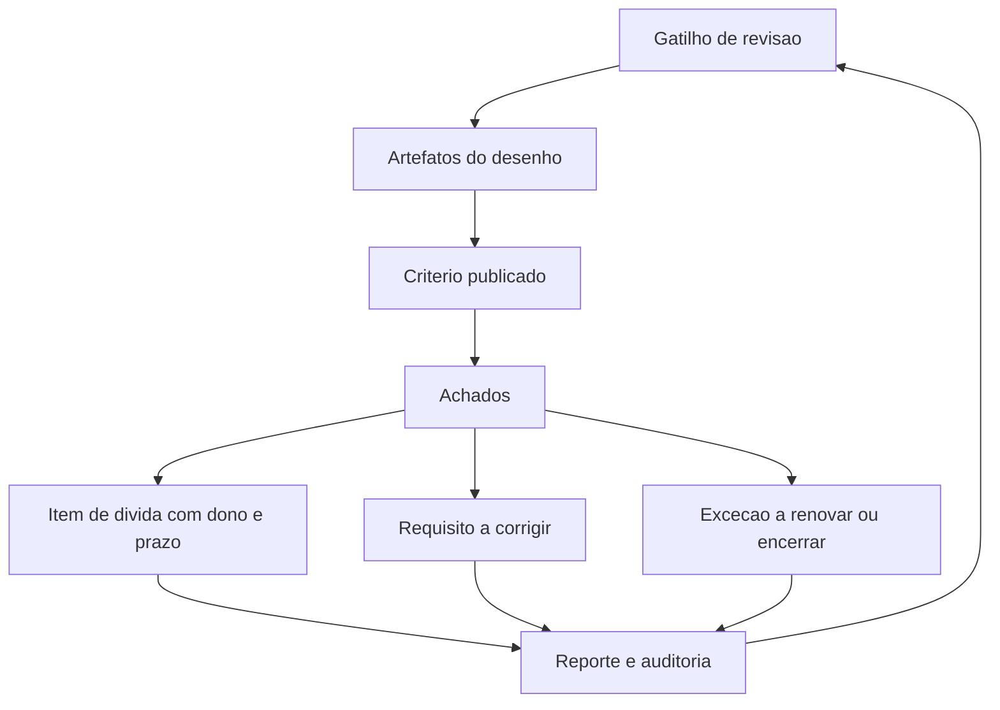

# Revisão de arquitetura e dívida de segurança

Uma ideia central: revisão de arquitetura é um evento com gatilho, critério publicado e registro; dívida de segurança é o passivo que a revisão contabiliza em itens com dono e prazo.

## 1. Objetivo de aprendizagem

Ao final deste tema você deve conseguir: conduzir uma revisão de arquitetura com critério publicado e registrar a dívida de segurança em itens com dono, prazo e risco associado, distinguindo-a de vulnerabilidade pendente de correção.

## 2. Pré-requisitos

[TEMA-01](TEMA-01-principios-arquitetura-seguranca.md) e [TEMA-04](TEMA-04-padroes-zero-trust-defesa-em-profundidade.md). O princípio fornece o critério e o padrão fornece a referência contra a qual a arquitetura é comparada.

## 3. Pré-teste

Responda de palpite, antes de ler o resto. Anote a confiança de 1 a 5.

1. Chute: quem convoca uma revisão de arquitetura na sua empresa hoje — um incidente, uma auditoria ou ninguém? Aposte.
   Confiança: ___
2. Palpite: a sua empresa tem registro de decisões de desenho adiadas? Quantos itens você estima.
   Confiança: ___
3. Antes de ler: dívida de segurança aparece no seu orçamento como projeto ou como risco aceito? Escolha.
   Confiança: ___

## 4. Caso real

Um estudo de caso publicado pela Springer, com DOI 10.1007/978-3-031-78386-9_4 e título Defining Security Debt, declara entre seus objetivos fornecer uma definição de dívida de segurança, encontrar a relação entre essa dívida e a dívida técnica, encontrar a diferença entre dívida de segurança e vulnerabilidades de segurança e identificar padrões de acumulação. O resumo do capítulo registra que o método foi entrevistar profissionais de software de um conglomerado internacional.

Duas observações úteis para o gestor. A primeira: o trabalho existe porque as três distinções — dívida de segurança, dívida técnica e vulnerabilidade — ainda não estão consolidadas. A segunda: procurar definição de dívida de segurança em norma primária não produziu resultado nesta execução, o que está registrado como NAO CONFIRMADO em fonte oficial.

A pergunta que o caso deixa aberta: se o conceito não tem definição normativa, como o CISO registra dívida de segurança na auditoria sem que cada item seja reclassificado como vulnerabilidade pendente?

## 5. Conteúdo

### 5.1 Conceito

Revisão de arquitetura é a verificação de que o desenho implementado continua sendo o desenho aprovado, e de que as premissas que o sustentavam ainda valem. A OWASP fecha o processo de modelagem de ameaças com a pergunta "fizemos um trabalho suficiente?", e enumera o que verificar: se o diagrama ainda representa o sistema, se todas as ameaças foram identificadas, se cada uma tem resposta acordada, se as mitigações escolhidas são testáveis e se o modelo está documentado e acessível a quem tem necessidade de conhecer.

O NIST SP 800-160 Volume 1 Rev. 1 lista "review", "verification", "validation" e "assessment criteria" entre as palavras-chave e declara que a publicação serve de base para critérios de avaliação. Um critério de avaliação publicado é o que permite que duas pessoas cheguem à mesma conclusão sobre o mesmo desenho.

Dívida de segurança é o que sobra depois da revisão: a proteção que se decidiu adiar, com prazo e dono. O que a distingue de uma vulnerabilidade é o fato gerador. Vulnerabilidade é falha concreta que pode ser explorada hoje, e seu tratamento pertence à gestão de vulnerabilidades. Dívida de segurança é decisão de desenho tomada com informação insuficiente ou prazo insuficiente, e seu tratamento é reprojetar — não aplicar correção pontual.

### 5.2 Como funciona

A revisão precisa de gatilho, e gatilho definido é o que separa rotina de improviso. Quatro eventos justificam convocação: mudança de arquitetura, entrada de novo tipo de dado ou novo fluxo, incidente com causa ligada a desenho e renovação de contrato de fornecedor relevante. Revisão anual sem gatilho tende a virar leitura de documento.

O insumo é um conjunto de artefatos que já existem se os temas anteriores foram aplicados: diagrama de fluxo com limites de confiança, lista de ameaças com resposta, matriz de fluxo entre zonas, lista de requisitos não funcionais e o registro das decisões com o princípio que as sustenta. Sem esses artefatos, a revisão degenera em opinião.

O critério de avaliação precisa ser publicado antes da reunião. Quatro perguntas bastam. O desenho atual corresponde ao que está documentado? Alguma premissa de confiança deixou de valer? Algum requisito aprovado está sem evidência de verificação? Alguma exceção venceu ou deixou de ter dono?

O registro do achado tem cinco campos: o que está diferente do aprovado, qual risco isso cria, quem é o dono, qual o prazo e qual o custo estimado de resolver. Os três primeiros campos separam dívida de opinião; os dois últimos separam dívida de intenção.

Sobre a medição, uma recomendação prática: conte itens e idade dos itens, não apenas quantidade. Quarenta itens de dois meses e oito itens de três anos descrevem situações diferentes. O indicador que costuma sobreviver ao comitê é o número de itens acima do prazo acordado no próprio registro.

### 5.3 Exemplo resolvido

Revisão de arquitetura de um serviço de assinatura eletrônica, convocada por dois gatilhos simultâneos: entrada de novo fluxo com dado de saúde e renovação do contrato do serviço de armazenamento.

Achado 1. O diagrama de fluxo documentado mostra três zonas; o ambiente tem cinco, porque duas foram criadas em projeto posterior sem atualização do documento. Diferença entre documentado e implementado. Risco: o modelo de ameaças deixa de cobrir dois caminhos. Dono: arquiteto do serviço. Prazo: 30 dias. Custo: uma oficina e a atualização do diagrama.

Achado 2. A matriz de fluxo autoriza a estação de trabalho a alcançar a zona de dados por uma exceção concedida dois anos antes, sem prazo. Premissa que deixou de valer — a exceção era para um sistema que foi descontinuado. Risco: caminho direto até dado sensível. Dono: gestor de infraestrutura. Prazo: 60 dias. Custo: baixo, remoção de regra com teste em ambiente de homologação.

Achado 3. O requisito de registro de auditoria foi aprovado com retenção definida e evidência mensal; a última amostra verificada tem oito meses. Requisito sem evidência de verificação. Risco: perda de capacidade de reconstituir incidente sem que ninguém perceba. Dono: segurança e tecnologia. Prazo: 15 dias para retomar a amostra, 90 dias para automatizar. Custo: médio.

Achado 4. O novo fluxo com dado de saúde usa o mesmo armazenamento do fluxo antigo, com a mesma chave e a mesma política de acesso. Decisão adiada por prazo: a segregação exige mudança de contrato com o fornecedor e reprojeto da biblioteca de acesso. Dono: dono do produto. Prazo: 180 dias. Risco associado: ampliação do alcance de uma credencial comprometida sobre dado de classificação mais restrita.

Achado 5. Contrato de armazenamento renovado sem cláusula de notificação de incidente em prazo definido. Não é dívida técnica, é lacuna contratual com efeito de segurança. Dono: compras com segurança. Prazo: próxima janela de aditivo.

O que o exemplo demonstra é a diferença de tratamento. O achado 2 é melhoria imediata de configuração de alto efeito; o achado 4 é dívida de desenho, com prazo longo e risco declarado; o achado 5 sai da fila de tecnologia e entra na de contrato. Misturar os três em uma lista única de "pendências de segurança" faz com que a remoção de uma regra e o reprojeto de uma biblioteca pareçam o mesmo trabalho.

### 5.4 Problema de completar

Revisão convocada depois de um incidente em que uma credencial de suporte foi usada para acessar servidor fora da função da conta. Complete o registro.

| Achado | Tipo | Risco criado | Dono | Prazo | Evidência de encerramento |
|---|---|---|---|---|---|
| Conta de suporte com permissão em todos os servidores | ______ | ______ | ______ | ______ | ______ |
| Protocolo administrativo aceito de qualquer estação | ______ | ______ | ______ | ______ | ______ |
| Diagrama de fluxo sem as duas zonas criadas no último ano | ______ | ______ | ______ | ______ | ______ |
| Exceção de acesso remoto de fornecedor vencida há 14 meses | ______ | ______ | ______ | ______ | ______ |

Responda ainda: qual dos quatro achados é dívida de segurança e não vulnerabilidade, e por qual critério você chegou a essa conclusão? Escreva em três linhas.

## 6. Por que isso importa para o CISO

Revisão com critério é o que torna a arquitetura auditável sem depender da memória de quem a desenhou. O NIST SP 800-160 Rev. 1 declara que a publicação serve de base para critérios de avaliação; adotar um critério publicado antes da diligência do cliente ou do auditor reduz a chance de a conversa ser sobre percepção.

Dívida de segurança registrada é proteção política do CISO. A pergunta "por que isso ainda está assim?" tem três respostas possíveis: ninguém sabia, sabíamos e não priorizamos, ou sabíamos e o negócio aceitou com dono e prazo. Só a terceira sobrevive a uma mudança de gestão ou a um incidente com apuração.

Existe, ainda, o efeito na fila de trabalho. Sem categoria própria, todo achado de arquitetura compete com correção de vulnerabilidade e perde, porque a vulnerabilidade tem data de divulgação e a dívida não tem. Criar a categoria e o campo de idade dá à dívida o relógio que ela não tinha.

## 7. Aplicação prática

Escolha um serviço crítico e responda as quatro perguntas do critério de avaliação do item 5.2 por escrito, sozinho, em 30 minutos. Não convoque reunião neste primeiro momento: o objetivo é saber se os artefatos existem.

Se alguma resposta for "não sei", o primeiro item da sua dívida é a ausência do artefato. Depois marque a data de 60 dias e repita o exercício com o dono do serviço presente. Compare as duas respostas: a diferença entre elas costuma ser maior que os achados técnicos.

## 8. Autoexplicação

Explique em três frases por que dívida de segurança precisa de categoria própria no registro. Conecte ao seu ambiente: qual decisão de desenho você adiou nos últimos seis meses, e ela está registrada com dono e prazo?

## 9. Erros comuns e equívocos

| Equívoco | Por que está errado | O que é correto |
|---|---|---|
| Revisão anual é suficiente | O desenho muda entre revisões, e um ano é tempo suficiente para a exceção virar arquitetura | Defina gatilhos de convocação além do calendário |
| Dívida de segurança é vulnerabilidade não corrigida | O fato gerador é diferente: decisão de desenho adiada versus falha explorável hoje | Separe as filas e os instrumentos de medição |
| Revisão serve para achar culpa | Sem critério publicado, a reunião vira disputa de memória | Publique o critério antes e avalie o desenho, não as pessoas |
| Achado sem dono continua vivo | Sem dono, o item não tem quem o apresente no comitê nem quem decida o prazo | Nomeie dono, prazo e evidência de encerramento em cada linha |
| Dívida técnica e dívida de segurança são a mesma coisa | A primeira afeta manutenção; a segunda afeta risco, e o custo de corrigir cresce com o alcance do desenho | Trate a dívida de segurança como item de risco, com reporte próprio |
| Contar itens basta como métrica | Quantidade não mostra o envelhecimento nem a concentração em um sistema | Meça também idade do item e concentração por serviço |

## 10. Recuperação ativa

Responda tudo antes de abrir o gabarito.

1. Enumere o que a quarta pergunta do processo de modelagem de ameaças exige verificar.
2. Quais são os quatro gatilhos de convocação de revisão apresentados no tema?
3. Quais artefatos a revisão usa como insumo, e por que a ausência deles compromete o resultado?
4. Descreva os cinco campos do registro de achado e o que cada par de campos separa.
5. Qual é o critério que distingue dívida de segurança de vulnerabilidade, e o que muda no tratamento?
6. Cite um indicador de dívida de segurança que sobrevive ao comitê e explique por que ele funciona melhor que a contagem simples.

Conferir respostas

1. Se o diagrama ainda representa o sistema, se todas as ameaças foram identificadas, se cada ameaça tem resposta acordada, se as mitigações escolhidas são testáveis e se o modelo está documentado e acessível a quem tem necessidade de conhecer.
2. Mudança de arquitetura, entrada de novo tipo de dado ou novo fluxo, incidente com causa ligada a desenho e renovação de contrato de fornecedor relevante.
3. Diagrama de fluxo com limites de confiança, lista de ameaças com resposta, matriz de fluxo entre zonas, lista de requisitos não funcionais e registro das decisões com o princípio que as sustenta. Sem eles, os achados ficam presos à opinião dos presentes.
4. O que está diferente do aprovado, o risco criado, o dono, o prazo e o custo estimado. Os três primeiros campos separam dívida de opinião; os dois últimos separam dívida de intenção.
5. O fato gerador: vulnerabilidade é falha explorável hoje; dívida de segurança é decisão de desenho adiada. O tratamento da vulnerabilidade é correção pontual na fila de remediação; o da dívida é reprojeto com risco declarado.
6. O número de itens acima do prazo acordado no próprio registro. Ele funciona melhor porque mede envelhecimento, e envelhecimento é o que transforma decisão adiada em arquitetura permanente.

## 11. Revisão espaçada

| Intervalo | O que fazer | Se errar |
|---|---|---|
| D+1 | Repetir os quatro gatilhos e as quatro perguntas do critério | Rebaixar: repetir em D+1 |
| D+7 | Refazer a seção 7 em outro serviço, sem consultar o critério | Rebaixar: repetir em D+3 |
| D+30 | Verificar se o primeiro item de dívida registrado foi encerrado com evidência | Rebaixar: repetir em D+7 |

## 12. Conexões com outros temas

Leitura humana do `relacoes` do frontmatter — que é a fonte. Relações que saem desta área
também aparecem em [mapa-relacoes.md](../mapa-relacoes.md). Regras em
[templates/RELACOES-TEMAS.md](../templates/RELACOES-TEMAS.md).

| Relação | Alvo | Por que |
|---|---|---|
| aplicado_em | 02-governanca-risco-compliance#TEMA-06 | dívida de segurança medida é matéria de reporte ao comitê e de evidência de auditoria; destino planejado, número provisório |
| complementa | 03-arquitetura-engenharia#TEMA-05 | requisito que não entrou no desenho reaparece como dívida de segurança na revisão, e a revisão é o instrumento que mede a sobra |
| nao_confundir_com | 12-vulnerabilidades-threat-intel#TEMA-06 | dívida de desenho adiada e vulnerabilidade pendente de correção têm dono, prazo e instrumento de medição diferentes; destino planejado, número provisório |

## 13. Certificações e leitura recomendada

| Certificação | Domínio | Recurso | Tipo | Fonte |
|---|---|---|---|---|
| CISSP | Cobertura geral do tema | ISC2 CISSP Certification Exam Outline | primaria | https://www.isc2.org/certifications/cissp/cissp-certification-exam-outline |
| SecurityX | Cobertura geral do tema | CompTIA SecurityX | primaria | https://www.comptia.org/en-us/blog/introducing-comptia-securityx/ |

Leitura direta: [Defining Security Debt: A Case Study Based on Practice, DOI 10.1007/978-3-031-78386-9_4](https://link.springer.com/chapter/10.1007/978-3-031-78386-9_4).

## 14. Fontes verificadas

| # | Título | Tipo | URL | Acessado em | Confiança |
|---|---|---|---|---|---|
| 1 | OWASP Threat Modeling Cheat Sheet — quarta pergunta e lista de verificação de revisão e validação | primaria | https://cheatsheetseries.owasp.org/cheatsheets/Threat_Modeling_Cheat_Sheet.html | "2026-09-25" | alta |
| 2 | NIST SP 800-160 Vol. 1 Rev. 1 — palavras-chave review, verification, validation e assessment criteria | primaria | https://csrc.nist.gov/pubs/sp/800/160/v1/r1/final | "2026-09-25" | alta |
| 3 | Defining Security Debt: A Case Study Based on Practice, objetivos declarados do estudo no resumo do capítulo | academica | https://link.springer.com/chapter/10.1007/978-3-031-78386-9_4 | "2026-09-25" | media |

---

| Navegação | |
|---|---|
| Área | [03 Arquitetura e engenharia de segurança](./README.md) |
| Tema anterior | [TEMA-05](TEMA-05-seguranca-por-design-requisitos-nao-funcionais.md) |
| Home | [README](../README.md) |
