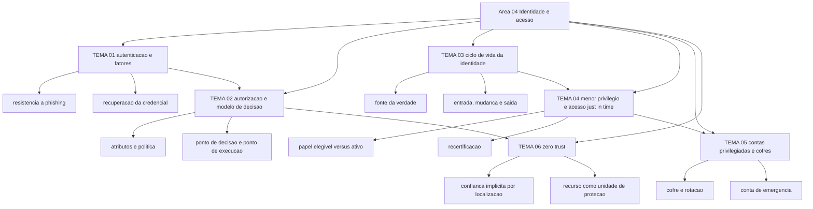

# Identidade, acesso e zero trust

O NIST publicou o SP 800-63B-4 em 31 de julho de 2025, substituindo a edição de 02 de março de 2020, e passou a exigir que agências federais dos Estados Unidos requeiram autenticação resistente a phishing de servidores, contratados e parceiros. A mesma revisão manda o verificador oferecer pelo menos uma opção resistente a phishing já no nível de garantia 2, onde a maioria das empresas brasileiras parou. Seis temas tratam do que acontece quando identidade vira o ponto de decisão do acesso.

## 1. Introdução

### 1.1 O que é esta área

Identidade e acesso é o conjunto de decisões que respondem a duas perguntas separadas: quem é o sujeito que pede acesso, e o que esse sujeito pode fazer sobre qual recurso. A primeira pergunta se resolve com autenticação; a segunda, com autorização. Em volta das duas vive o ciclo de vida da identidade, que cria, altera e retira acesso ao longo do tempo, a disciplina de limitar o privilégio ao mínimo necessário, a gestão das contas que carregam poder administrativo e o padrão de arquitetura que remove a confiança dada pela localização de rede.

Fica fora da área o controle de rede que executa a contenção (área 05), a mecânica de chave e certificado por dentro (área 07), a política de acesso específica de cada provedor de nuvem (área 08) e o processo de resposta a incidente quando uma conta é comprometida (área 11). Aqui se decide o modelo: quais fatores, quais atributos, quais políticas, quais alçadas.

### 1.2 Por que isso importa para o CISO

O CISSP, na revisão vigente desde 15/04/2024, dá 13% do exame ao domínio Identity and Access Management. É o segundo maior peso do exame, empatado com o domínio de rede. O peso existe porque a maior parte das invasões que viram crise usa credencial legítima em vez de falha de software: quem entra com usuário e senha válidos não precisa explorar vulnerabilidade nenhuma.

Para quem assumiu o cargo com pouca base técnica, esta área é a de melhor retorno por real investido na primeira metade do mandato. Autenticação resistente a phishing, retirada de acesso no desligamento e acesso administrativo just-in-time são controles que mudam o resultado de um incidente sem exigir troca de arquitetura de rede ou reescrita de aplicação. E são verificáveis em auditoria com evidência simples: relatório de fatores ativos, lista de contas sem dono, log de ativação de papel privilegiado.

Há uma consequência de linguagem. O board entende "todos os acessos administrativos precisam de aprovação nominal e expiram em duas horas" melhor do que entende "implantamos gestão de identidade privilegiada". A primeira frase traz prazo e alçada; a segunda traz o nome de um produto.

### 1.3 O que você será capaz de fazer ao final

- Classificar um requisito de acesso como problema de autenticação ou de autorização, e apontar a evidência que prova cada um.
- Escolher o nível de garantia de autenticação exigido por um sistema a partir do risco e do dado que ele expõe, justificando custo de suporte e caminho de recuperação.
- Escrever o modelo de decisão de acesso de um serviço, com atributos, política, ponto de decisão e ponto de execução, e testá-lo contra mudança de função e desligamento.
- Desenhar o fluxo de entrada, mudança e saída de pessoas e contas, declarando a fonte da verdade, o prazo de retirada e a evidência arquivada.
- Justificar acesso just-in-time e cofre de credenciais para um conjunto nomeado de contas privilegiadas, com métrica de adoção e critério de exceção.
- Avaliar a arquitetura de acesso atual contra os pressupostos do NIST SP 800-207 e listar a confiança implícita que permanece.

### 1.4 Os temas desta área, em prosa

A área abre pela prova de identidade — autenticação com fatores, MFA e FIDO2 — e passa à decisão
sobre o que essa identidade pode fazer, em autorização com RBAC e ABAC. Depois trata do ciclo de
vida da identidade e da governança de acesso, do menor privilégio com acesso just-in-time e revisão
periódica, e da gestão de contas privilegiadas em cofres de senha. Fecha onde o perímetro de rede
perdeu força: zero trust, com a identidade no centro da decisão.

## 2. Objetivos de aprendizagem (terminais)

| # | Objetivo | Bloom | Temas que o sustentam |
|---|---|---|---|
| 1 | Distinguir autenticação de autorização e classificar 10 requisitos de acesso de uma aplicação na camada correta, indicando a evidência que prova cada um. | analisar | TEMA-01, TEMA-02 |
| 2 | Selecionar o nível de garantia de autenticação de 3 sistemas, justificando a escolha por exposição do dado, resistência a phishing e caminho de recuperação da credencial. | avaliar | TEMA-01 |
| 3 | Escrever o modelo de decisão de acesso de um serviço, com atributos, política e pontos de decisão e de execução, e testá-lo contra 3 mudanças de contexto. | criar | TEMA-02 |
| 4 | Projetar o fluxo de entrada, mudança e saída de acesso, declarando a fonte da verdade, o prazo de retirada e a evidência que fica arquivada. | criar | TEMA-03, TEMA-04 |
| 5 | Justificar a adoção de acesso just-in-time e de cofre de credenciais para um conjunto nomeado de contas privilegiadas, com métrica de adoção e critério de exceção. | avaliar | TEMA-04, TEMA-05 |
| 6 | Avaliar a arquitetura de acesso atual contra os pressupostos do NIST SP 800-207, listando onde a localização de rede ainda substitui autenticação e autorização. | avaliar | TEMA-06 |

## 3. Diagrama dos tópicos

## 4. Temas

| # | tema_id | Tema | Nível | Tempo |
|---|---|---|---|---|
| 1 | TEMA-01 | Autenticação: fatores, MFA e FIDO2 | intermediario | 40-55 min |
| 2 | TEMA-02 | Autorização: RBAC, ABAC e o modelo de decisão | intermediario | 40-50 min |
| 3 | TEMA-03 | Ciclo de vida da identidade e governança de acesso | intermediario | 35-45 min |
| 4 | TEMA-04 | Menor privilégio, acesso just-in-time e revisão de acessos | intermediario | 35-50 min |
| 5 | TEMA-05 | PAM: contas privilegiadas e cofres de senha | avancado | 40-55 min |
| 6 | TEMA-06 | Zero trust: identidade como novo perímetro | avancado | 35-45 min |

## 5. Pré-requisitos e sequência

O [01 Fundamentos](../01-fundamentos/README.md) vem antes porque o princípio do menor privilégio, o vocabulário de controle e a distinção entre ativo e risco aparecem em toda decisão de acesso. O [03 Arquitetura e engenharia](../03-arquitetura-engenharia/README.md) também vem antes: sem o desenho de zonas e o método de modelagem de ameaças, o modelo de autorização não sabe o que precisa negar por padrão.

| Antes | Esta área | Depois |
|---|---|---|
| 01-fundamentos, 03-arquitetura-engenharia | 04-identidade-acesso | 05-rede-infraestrutura, 07-criptografia-segredos, 08-cloud |

Dentro da área, a sequência sugerida é a ordem da tabela: TEMA-01 e TEMA-02 se leem juntos, TEMA-03 e TEMA-04 se leem juntos, TEMA-05 depende de TEMA-04 e TEMA-06 fecha o arco. Quem já opera gestão de acesso pode começar pelo TEMA-04 e voltar: a revisão periódica de acessos é o teste prático de tudo o que os temas anteriores afirmam.

## 6. Certificações desta área

| Certificação | Sigla | O que cobre aqui |
|---|---|---|
| ISC2 CISSP | CISSP (D5) | Domain 5, Identity and Access Management, com 13% de peso no exame; subtemas 5.2 a 5.6 cobrem estratégia de autenticação, autorização, ciclo de provisão e sistemas de autenticação |
| Microsoft Azure Security Engineer Associate | AZ-500 | Controles de identidade e acesso em Azure; nomes de domínio e pesos NAO CONFIRMADO em fonte oficial nesta execução |

Detalhe de domínio, peso e custo pertence a [90-certificacoes/](../90-certificacoes/README.md).

## 7. Conexões com outras áreas

Relações de saída dos temas desta área que apontam para fora dela, agregadas do frontmatter
`relacoes`. A visão consolidada está em [mapa-relacoes.md](../mapa-relacoes.md); as regras, em
[templates/RELACOES-TEMAS.md](../templates/RELACOES-TEMAS.md). Alvos marcados como pendentes
ainda não foram escritos.

| Tema daqui | Relação | Destino | Por que |
|---|---|---|---|
| TEMA-01 | aprofundado_por | 07-criptografia-segredos#TEMA-02 | o desafio-resposta de um autenticador FIDO2 é criptografia de chave pública amarrada à origem; a mecânica de chave, certificado e cadeia de confiança fica na área 07 |
| TEMA-01 | complementa | 07-criptografia-segredos#TEMA-01 | o segundo fator por chave pública só se explica pela mecânica assimétrica, e a autenticação decide o que essa chave prova |
| TEMA-02 | aplicado_em | 09-aplicacoes-devsecops#TEMA-06 | o modelo de decisão vira escopo de token e checagem no gateway de API, que é onde a autorização encosta no código; destino planejado, número provisório |
| TEMA-02 | complementa | 01-fundamentos#TEMA-08 | o princípio do menor privilégio só se realiza no modelo de autorização, onde atributo, política e ponto de decisão o transformam em decisão executável |
| TEMA-03 | aplicado_em | 02-governanca-risco-compliance#TEMA-06 | a prova de que contas nascem e morrem com autorização registrada é evidência de auditoria e matéria de reporte ao comitê |
| TEMA-03 | aplicado_em | 15-fatores-humanos#TEMA-03 | a retirada de acesso no desligamento só executa no prazo se o gestor e o RH agirem; sem isso a norma de saída não sai do documento; destino planejado, número provisório |
| TEMA-04 | aplicado_em | 05-rede-infraestrutura#TEMA-03 | privilégio mínimo de rede exige segmentação, porque o alcance de uma credencial é limitado pelo que a rede permite alcançar; destino planejado, número provisório |
| TEMA-05 | nao_confundir_com | 07-criptografia-segredos#TEMA-05 | cofre de credencial humana privilegiada não substitui o cofre de segredo de aplicação, e o dono do acesso é diferente em cada caso |
| TEMA-05 | nao_confundir_com | 15-fatores-humanos#TEMA-05 | o cofre de credencial controla o empréstimo e o registro da credencial privilegiada; risco interno trata a decisão de quem já tem o acesso |
| TEMA-06 | aplicado_em | 08-cloud#TEMA-02 | a política de identidade do provedor de nuvem é onde a decisão por recurso do zero trust vira configuração executável; destino planejado, número provisório |
| TEMA-06 | complementa | 03-arquitetura-engenharia#TEMA-04 | zero trust na identidade e zero trust na arquitetura são as duas metades do mesmo padrão: uma prova quem é e qual é o estado do dispositivo, a outra decide o que o desenho protege e o que contém o dano |

## 8. Atividades práticas e laboratórios

| # | Atividade | O que a prática demonstra | Pré-requisito técnico |
|---|---|---|---|
| 1 | Listar os fatores de autenticação ativos por sistema e marcar quais são resistentes a phishing | Quantos sistemas da empresa ainda dependem de segredo compartilhado reutilizável | acesso ao diretório ou à lista de aplicações |
| 2 | Escolher 3 sistemas e escrever o nível de garantia de autenticação exigido para cada um, com a razão | Onde o controle ficou abaixo do que o dado exposto pede | nenhum |
| 3 | Extrair a lista de acessos de um sistema e classificar cada linha em papel, grupo e exceção individual | Quantas concessões fora de papel existem e quem as autorizou | exportação de acessos |
| 4 | Rodar uma recertificação de 20 acessos com prazo de 10 dias e medir a taxa de resposta | Que revisão sem prazo e sem consequência não reduz acesso | planilha e e-mail |
| 5 | Inventariar contas privilegiadas e classificar cada uma em humana, compartilhada, serviço ou emergência | Quantas contas administrativas não têm dono nomeado | nenhum |
| 6 | Listar 5 decisões de acesso que hoje usam a rede interna como condição suficiente | Onde a localização ainda substitui autenticação e autorização | conversa com a equipe de infraestrutura |

## 9. Checkpoint da área

Seis itens retirados dos temas, fora da ordem original. Responda antes de abrir o gabarito.

1. Um aplicativo usa senha e código por SMS. Ele atende ao nível de garantia 2 do NIST SP 800-63B-4 e é resistente a phishing? (TEMA-01)
2. Um papel de leitura de relatórios passa a permitir exportar a base de clientes. Isso é mudança de autenticação ou de autorização, e onde ela deveria ser registrada? (TEMA-02)
3. O RH cadastra a pessoa no sistema de folha e o time de TI cria a conta no diretório manualmente. Qual é o risco principal desse desenho? (TEMA-03)
4. Um administrador de nuvem tem papel permanente atribuído. Que propriedade do acesso just-in-time está ausente e o que ela mudaria em um incidente? (TEMA-04)
5. A equipe compartilha a senha do usuário de banco usado pela aplicação de folha. Quais produtos de auditoria ficam impossíveis com essa prática? (TEMA-05)
6. Um servidor de banco aceita conexão sem autenticação de dispositivo porque está na rede interna. Qual pressuposto do zero trust está violado? (TEMA-06)

Conferir respostas e critério

1. Atende ao nível 2, mas não é resistente a phishing. A revisão de 2025 exige que o verificador ofereça pelo menos uma opção resistente a phishing já no nível 2, e o código por SMS é um fator de posse que pode ser interceptado ou repassado por engenharia social.
2. Autorização. A identidade não mudou; mudou o conjunto de operações permitidas sobre o objeto. O registro pertence à definição do papel e à matriz de acesso, com autorizador nomeado e data.
3. Perda de rastreabilidade da autorização. Sem a fonte da verdade, não existe prova de quem autorizou o acesso, e a retirada no desligamento depende de uma pessoa lembrar de agir em dois sistemas.
4. Ausência de temporalidade e de aprovação na ativação. Com papel permanente, o comprometimento da conta vale por tempo indeterminado; com papel elegível, o atacante ainda precisa passar por aprovação, justificativa e fator adicional para ativar.
5. Atribuição, revogação e rotação. Não é possível saber qual pessoa usou a credencial em qual momento, nem retirar o acesso de uma pessoa específica, nem trocar a senha sem quebrar a aplicação.
6. O pressuposto de que autenticação e autorização de sujeito e de dispositivo são funções executadas antes de estabelecer a sessão com o recurso. Confiar no dispositivo pela localização é confiança implícita.

Critério para seguir adiante: acertar 80% ou mais sem consultar os temas. Erro no item 1 ou no item 4 indica confusão entre força do fator e temporalidade do acesso; releia TEMA-01 e TEMA-04 antes de seguir.

## 10. Termos desta área

Termos que o glossário central precisa conter; as definições ficam em [glossario.md](../glossario.md).

- autenticação (authentication)
- autorização (authorization)
- fator de autenticação
- autenticador (authenticator)
- nível de garantia de autenticação (AAL)
- resistência a phishing (phishing resistance)
- FIDO2, WebAuthn e CTAP
- passkey, passkey sincronizada e passkey vinculada ao dispositivo
- autenticação multifator (MFA)
- intenção de autenticação (authentication intent)
- resistência a replay
- sessão e tempo limite de inatividade
- RBAC, ABAC, MAC e DAC
- atributo (attribute)
- ponto de decisão de política (PDP)
- ponto de execução de política (PEP)
- identidade, conta e entitlement
- provisão e desprovisão (provisioning, deprovisioning)
- SCIM
- conta órfã (orphan account)
- conta de serviço (service account)
- menor privilégio (least privilege)
- acesso just-in-time (JIT)
- papel elegível e papel ativo
- recertificação e revisão de acesso
- PAM (privileged access management)
- cofre de credenciais (credential vault)
- conta de emergência (break-glass)
- segregação de função (segregation of duties)
- zero trust
- confiança implícita
- perímetro de identidade

## 11. Fontes verificadas

| # | Título | Tipo | URL | Acessado em | Confiança |
|---|---|---|---|---|---|
| 1 | NIST SP 800-63B-4 — Digital Identity Guidelines: Authentication and Authenticator Management, final de 31/07/2025, substitui o SP 800-63B de 02/03/2020 | primaria | https://csrc.nist.gov/pubs/sp/800/63/b/4/final | "2026-09-25" | alta |
| 2 | NIST SP 800-63B-4 — Authentication Assurance Levels, seção normativa com a tabela de requisitos por nível | primaria | https://pages.nist.gov/800-63-4/sp800-63b/aal/ | "2026-09-25" | alta |
| 3 | NIST SP 800-207 — Zero Trust Architecture, agosto de 2020, final em 11/08/2020 | primaria | https://csrc.nist.gov/pubs/sp/800/207/final | "2026-09-25" | alta |
| 4 | NIST SP 800-162 — Guide to Attribute Based Access Control, janeiro de 2014 com atualizações de 02/08/2019 | primaria | https://csrc.nist.gov/pubs/sp/800/162/upd2/final | "2026-09-25" | alta |
| 5 | NIST CSRC Glossary — least privilege, conforme CNSSI 4009-2022, SP 800-12 Rev. 1 e SP 800-53 Rev. 5 | primaria | https://csrc.nist.gov/glossary/term/least_privilege | "2026-09-25" | alta |
| 6 | OWASP Authentication Cheat Sheet — força de senha, proteção contra ataques automatizados, FIDO, OIDC e reautenticação | primaria | https://cheatsheetseries.owasp.org/cheatsheets/Authentication_Cheat_Sheet.html | "2026-09-25" | alta |
| 7 | OWASP Secrets Management Cheat Sheet — ciclo de vida do segredo, auditoria, cofre e conta de emergência | primaria | https://cheatsheetseries.owasp.org/cheatsheets/Secrets_Management_Cheat_Sheet.html | "2026-09-25" | alta |
| 8 | FIDO Alliance — Passkeys, com definição de passkey, FIDO2 como WebAuthn mais CTAP e autenticação entre dispositivos | primaria | https://fidoalliance.org/passkeys/ | "2026-09-25" | alta |
| 9 | ISC2 CISSP Certification Exam Outline, vigente desde 15/04/2024, com 8 domínios e pesos por domínio | primaria | https://www.isc2.org/certifications/cissp/cissp-certification-exam-outline | "2026-09-25" | alta |
| 10 | Microsoft Entra Privileged Identity Management — PIM, papéis elegíveis e ativos, aprovação, revisões e trilha de auditoria | primaria | https://learn.microsoft.com/en-us/entra/id-governance/privileged-identity-management/pim-configure | "2026-09-25" | alta |
| 11 | Microsoft Entra ID Governance — ciclo de vida da identidade, gestão de direitos, revisões de acesso e contas órfãs | primaria | https://learn.microsoft.com/en-us/entra/id-governance/identity-governance-overview | "2026-09-25" | alta |
| 12 | IETF RFC 7644 — System for Cross-domain Identity Management: Protocol, Standards Track, setembro de 2015 | primaria | https://datatracker.ietf.org/doc/rfc7644/ | "2026-09-25" | alta |

---

| Navegação | |
|---|---|
| Anterior | [15 Fatores humanos e cultura de segurança](../15-fatores-humanos/README.md) |
| Próximo | [05 Segurança de rede e infraestrutura](../05-rede-infraestrutura/README.md) |
| Home | [README](../README.md) |
