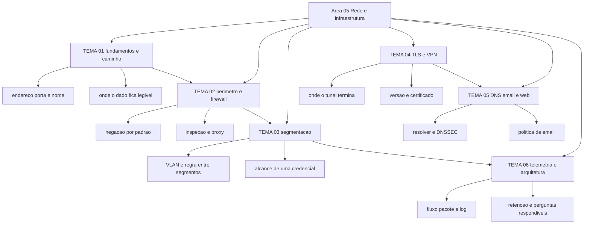

# Segurança de rede e infraestrutura

O guia de política de firewall do NIST está na revisão 1, de setembro de 2009, e continua sendo a referência citada quando alguém precisa definir o que um firewall faz. Ele define firewall como dispositivo ou programa que controla o fluxo de tráfego entre redes ou hosts com posturas de segurança diferentes. Essa definição é o ponto de partida da área: seis temas sobre os pontos do caminho onde uma decisão pode ser tomada, sobre o que cada ponto deixa passar e sobre o que fica registrado depois.

## 1. Introdução

### 1.1 O que é esta área

Esta área cobre o caminho que o tráfego percorre: endereçamento e nomes, o ponto de entrada e a política que o governa, a divisão interna em segmentos, a proteção de transporte entre dois pontos, os três serviços que decidem para onde o usuário vai, e a telemetria que sobra de tudo isso. São seis temas, cada um com uma ideia central.

Fica fora da área a decisão de desenho de zonas de confiança, que pertence a [03-arquitetura-engenharia](../03-arquitetura-engenharia/README.md), e a operação do SOC, que pertence a [10-operacoes-soc](../10-operacoes-soc/README.md). Aqui se decide e se configura o que atravessa a rede; lá se desenha a intenção e se opera a detecção.

### 1.2 Por que isso importa para o CISO

Duas perguntas de auditoria dependem inteiramente desta área. A primeira é quem pode alcançar o quê, com qual identidade e com qual registro. A segunda é onde o dado trafega legível. Nenhuma das duas se responde com organograma de ferramentas; as duas se respondem com regra escrita e com telemetria existente.

O custo de ignorar aparece em dois lugares concretos. Na contenção de um incidente, bloquear na borda é a primeira ação de uma resposta, e ela depende de existir alguém capaz de escrever e publicar a regra em minutos, sem que o pedido se perca em reunião. Na negociação de renovação de contrato de rede ou de link, é a matriz de fluxo que define se um novo fornecedor entra com acesso amplo ou com acesso a um serviço específico.

Há ainda o efeito no orçamento de armazenamento. Retenção de fluxo e de pacote tem curva de custo própria, e a decisão sobre quanto guardar precisa vir antes do incidente, não durante. Uma organização que descobre a falta do log no meio da resposta paga o preço em prazo de comunicação a regulador e cliente.

### 1.3 O que você será capaz de fazer ao final

- Descrever o caminho de um fluxo entre dois pontos da sua rede, marcando cada ponto onde existe controle e cada ponto onde não existe.
- Avaliar uma política de firewall contra o princípio de negação por padrão, listando as regras que contrariam a política e a data da última revisão.
- Desenhar segmentos e a regra de fluxo entre eles, declarando o que uma credencial comprometida alcançaria hoje.
- Julgar se uma conexão protegida usa versão e configuração aceitáveis, e identificar onde o tráfego volta a ser legível.
- Verificar o estado de resolução de nomes, de autenticação de e-mail e de acesso web, com a lista do que falta em cada um.
- Definir a telemetria de rede que a operação precisa receber, com fonte, retenção e pergunta que ela responde.

### 1.4 Os temas desta área, em prosa

O [TEMA-01](TEMA-01-fundamentos-de-rede-para-o-gestor.md) estabelece o vocabulário do caminho: endereço, porta, nome e salto, com a pergunta de onde o dado é legível. O [TEMA-02](TEMA-02-perimetro-firewall-inspecao.md) trata da fronteira e da política que a governa, incluindo inspeção e proxy. O [TEMA-03](TEMA-03-segmentacao-vlan-microssegmentacao.md) trata do que acontece dentro da fronteira: segmento, regra entre segmentos e microssegmentação.

O [TEMA-04](TEMA-04-criptografia-de-transporte-tls-vpn.md) cobre a proteção do transporte, com TLS e VPN, e a pergunta de onde o túnel termina. O [TEMA-05](TEMA-05-dns-email-web.md) cobre os três serviços que o usuário aciona antes de qualquer outro sistema: resolução de nome, e-mail e acesso web. O [TEMA-06](TEMA-06-monitoramento-de-trafego-arquitetura.md) fecha com telemetria e com a arquitetura que a torna possível.

## 2. Objetivos de aprendizagem (terminais)

| # | Objetivo | Bloom | Temas que o sustentam |
|---|---|---|---|
| 1 | Descrever o caminho de um fluxo real entre dois pontos, nomeando cada salto onde um controle é aplicável e cada ponto onde o conteúdo fica legível. | entender | TEMA-01 |
| 2 | Avaliar uma política de firewall contra o princípio de negação por padrão, listando regras permissivas sem justificativa e a data da última revisão. | avaliar | TEMA-02 |
| 3 | Desenhar segmentos e a regra de fluxo entre eles, declarando o alcance de uma credencial comprometida antes e depois da mudança. | criar | TEMA-03 |
| 4 | Julgar a adequação de versão, certificado e ponto de término de uma conexão protegida, indicando onde o tráfego é legível. | avaliar | TEMA-04 |
| 5 | Verificar o estado de DNSSEC, de autenticação de e-mail e de HTTPS de um domínio próprio, com a lista do que falta para cada controle. | analisar | TEMA-05 |
| 6 | Definir a telemetria de rede a coletar, com fonte, retenção e a pergunta que cada fonte responde, dentro de um limite de custo declarado. | criar | TEMA-06 |

## 3. Diagrama dos tópicos

## 4. Temas

| # | tema_id | Tema | Nível | Tempo |
|---|---|---|---|---|
| 1 | TEMA-01 | Fundamentos de rede para o gestor | base | 30-40 min |
| 2 | TEMA-02 | Perímetro, firewall e inspeção | intermediario | 35-45 min |
| 3 | TEMA-03 | Segmentação, VLAN e microssegmentação | intermediario | 35-50 min |
| 4 | TEMA-04 | Criptografia de transporte: TLS e VPN | intermediario | 35-45 min |
| 5 | TEMA-05 | Segurança de DNS, e-mail e web | intermediario | 35-50 min |
| 6 | TEMA-06 | Monitoramento de tráfego e arquitetura de rede segura | intermediario | 40-55 min |

## 5. Pré-requisitos e sequência

A área de identidade vem antes porque acesso remoto e decisão por identidade determinam o que a rede precisa entregar. Sem o vocabulário de sujeito, dispositivo e política de acesso, o TEMA-04 discute túnel sem discutir quem entra nele.

| Antes | Esta área | Depois |
|---|---|---|
| 04-identidade-acesso | 05-rede-infraestrutura | 07-criptografia-segredos, 10-operacoes-soc |

Dentro da área, a ordem sugerida é a da tabela. Quem precisa decidir sobre um incidente aberto pode começar pelo [TEMA-06](TEMA-06-monitoramento-de-trafego-arquitetura.md) e voltar ao [TEMA-01](TEMA-01-fundamentos-de-rede-para-o-gestor.md) depois: a pergunta de telemetria não depende do vocabulário completo, e a lacuna que ela revela costuma motivar o resto da leitura.

## 6. Certificações desta área

Apenas siglas. Domínios, pesos e custo pertencem a [90-certificacoes/](../90-certificacoes/README.md) e não foram conferidos nesta execução.

| Certificação | Sigla | O que cobre aqui |
|---|---|---|
| CompTIA Network+ | Network+ | Vocabulário de endereçamento, comutação, roteamento e serviços de rede |
| CompTIA Security+ | Security+ | Controles de rede, arquitetura e operação de segurança; nomes de domínio NAO CONFIRMADO em fonte oficial nesta execução |
| ISC2 CISSP | CISSP | Domínio de segurança de comunicação e rede; nomes de domínio NAO CONFIRMADO em fonte oficial nesta execução |

Ver: [90-certificacoes/](../90-certificacoes/README.md).

## 7. Conexões com outras áreas

Relações de saída dos temas desta área que apontam para fora dela, agregadas do frontmatter
`relacoes`. A visão consolidada está em [mapa-relacoes.md](../mapa-relacoes.md); as regras, em
[templates/RELACOES-TEMAS.md](../templates/RELACOES-TEMAS.md). Alvos marcados como pendentes
ainda não foram escritos.

| Tema daqui | Relação | Destino | Por que |
|---|---|---|---|
| TEMA-01 | aplicado_em | 03-arquitetura-engenharia#TEMA-02 | o limite de confiança marcado no diagrama de fluxo só descreve a realidade quando o fluxo nomeado corresponde ao caminho que existe na rede |
| TEMA-01 | aprofundado_por | 07-criptografia-segredos#TEMA-01 | aqui o tráfego é tratado como legível no caminho até existir proteção; a mecânica de cifra, chave e autenticação está na área 07; destino planejado, número provisório |
| TEMA-02 | aplicado_em | 02-governanca-risco-compliance#TEMA-02 | a política de firewall é a norma aprovada que descreve o que o dispositivo executa, com dono, exceção e prazo |
| TEMA-02 | aplicado_em | 11-resposta-forense#TEMA-03 | bloquear na borda é a primeira ação de contenção e depende de alguém capaz de publicar a regra durante o incidente; destino planejado, número provisório |
| TEMA-03 | aplicado_em | 06-endpoint-plataforma#TEMA-06 | a regra de microssegmentação depende de identidade da carga de trabalho e de agente no host para ser aplicada abaixo do endereço; destino planejado, número provisório |
| TEMA-03 | complementa | 03-arquitetura-engenharia#TEMA-03 | segmentação é decisão de arquitetura antes de ser configuração de switch: a zona de confiança define o que isolar e por qual critério, e VLAN, firewall e política de fluxo executam o isolamento |
| TEMA-04 | aplicado_em | 04-identidade-acesso#TEMA-06 | túnel de acesso remoto vira decisão por identidade e por estado do dispositivo quando o padrão de zero trust é aplicado; destino planejado, número provisório |
| TEMA-04 | complementa | 07-criptografia-segredos#TEMA-03 | o TLS da rede é o mesmo protocolo que a área de criptografia detalha: aqui se decide onde o túnel começa e termina, lá está a mecânica de chave, certificado e cadeia de confiança; destino planejado, número provisório |
| TEMA-05 | aplicado_em | 10-operacoes-soc#TEMA-03 | o registro do resolver é uma das poucas fontes que mostram consulta a domínio de comando e controle antes de qualquer bloqueio; destino planejado, número provisório |
| TEMA-05 | complementa | 15-fatores-humanos#TEMA-02 | o controle de e-mail reduz o alcance do clique que o programa de conscientização tenta evitar, e os dois medem o mesmo fenômeno por lados diferentes; destino planejado, número provisório |
| TEMA-06 | aplicado_em | 10-operacoes-soc#TEMA-02 | sem captura de tráfego não há telemetria de rede no SOC, e o que não é exportado não vira caso de uso; destino planejado, número provisório |
| TEMA-06 | complementa | 11-resposta-forense#TEMA-04 | o fluxo e o pacote retidos são a evidência técnica da investigação, e retenção e integridade são decisão tomada na rede antes do incidente; destino planejado, número provisório |

## 8. Atividades práticas e laboratórios

| # | Atividade | O que a prática demonstra | Pré-requisito técnico |
|---|---|---|---|
| 1 | Escolher 5 sistemas internos e desenhar o caminho de cada um até o usuário, marcando onde há controle | Que parte do caminho não tem ponto de decisão nenhum | acesso à topologia ou conversa com a equipe de rede |
| 2 | Pedir a política de firewall vigente, contar as regras com origem e destino abertos e anotar a data da última revisão | Que a política existe no dispositivo e frequentemente não existe como documento aprovado | nenhum |
| 3 | Levantar os segmentos existentes e escrever a regra de fluxo entre eles em uma matriz de 5 por 5 | A distância entre ter segmento e ter regra entre segmentos | inventário de VLAN ou planilha |
| 4 | Inventariar versão de TLS e validade de certificado dos 10 serviços próprios mais usados | Quantos serviços ainda aceitam versão antiga e quantos vencem nos próximos 90 dias | acesso a um scanner ou a comandos de linha de comando |
| 5 | Consultar o registro de política de e-mail e o estado de DNSSEC do próprio domínio | Que política em modo de observação registra e não bloqueia | acesso ao painel do domínio |
| 6 | Listar as fontes de telemetria de rede hoje existentes e a pergunta que cada uma responde | Qual pergunta de investigação a organização não consegue responder hoje | conversa com a operação |

## 9. Checkpoint da área

Cinco itens retirados dos temas, fora da ordem original. Responda antes de abrir o gabarito.

1. O RFC 1918 reserva três blocos de endereço para uso privado e declara no capítulo de considerações de segurança que problemas de segurança não são tratados nele. O que isso implica para quem argumenta que "a rede interna é protegida porque usa endereço privado"? (TEMA-01)
2. Uma regra permite qualquer origem para qualquer destino na porta de banco de dados, com justificativa "integração". Qual é a crítica correta e qual é o primeiro passo para corrigir? (TEMA-02)
3. A empresa tem 40 VLANs e a conta de suporte alcança todas elas. Houve ganho de contenção? Justifique em duas linhas. (TEMA-03)
4. Um serviço web termina TLS no balanceador e envia o tráfego em claro para dois servidores de aplicação. Quem vê o dado, e que perguntas o CISO deve fazer sobre esse trecho? (TEMA-04)
5. Qual é a diferença entre o controle que autentica o domínio que enviou a mensagem e o controle que valida a resposta do resolver de nomes? (TEMA-05)
6. Um alerta de exfiltração chega na sexta-feira às 18h. Não há registro de fluxo dos últimos 30 dias e não há captura de pacote. Que perguntas ficam sem resposta? (TEMA-06)

Conferir respostas e critério

1. Que o endereço privado não carrega garantia de segurança alguma: o RFC 1918 trata de alocação de endereço e de agregação de rota, e a seção 6 declara explicitamente que problemas de segurança não são tratados ali. Endereço privado reduz o alcance externo e nada diz sobre quem alcança o quê dentro da rede.
2. O critério está errado: regra sem origem, destino e identidade declarados não é política, é permissão aberta com rótulo. O primeiro passo é obter a lista dos clientes reais que usam aquela integração e converter a regra em regras nominais com origem, porta e registro.
3. Não. A quantidade de segmentos não altera o alcance da credencial; o que altera é a matriz de fluxo. Quarenta VLANs com uma linha que liga tudo produzem exatamente o mesmo dano de uma rede plana.
4. Quem vê o dado em claro nesse trecho é quem opera o balanceador e a rede entre ele e a aplicação, incluindo o hypervisor e qualquer ponto de captura. As perguntas são: o trecho é curto e dentro do mesmo limite de confiança, existe outra terminação em trânsito, e quem tem acesso administrativo a esses pontos.
5. São camadas diferentes. O controle de e-mail autentica o domínio remetente e publica uma política sobre o que fazer com a mensagem que falha; o controle do DNS valida a resposta de nome, provando que ela veio da zona autoritativa. Um não cobre o outro.
6. Ficam sem resposta o destino, o volume, a periodicidade e a origem do movimento, porque fluxo e captura são as fontes que respondem essas perguntas. Os registros de firewall e de resolver ainda podem mostrar destino de nome, e essa diferença define o que entra no relatório.

Critério para seguir adiante: acertar 80% ou mais sem consultar os temas. Erro no item 3 ou no item 6 indica que a leitura ainda trata segmento como sinônimo de contenção e telemetria como detalhe operacional; releia TEMA-03 e TEMA-06.

## 10. Termos desta área

Termos que o glossário central precisa conter; as definições curtas ficam em [glossario.md](../glossario.md).

- endereço privado (private address)
- máscara de sub-rede e CIDR
- porta e protocolo de transporte
- tradução de endereço de rede (NAT)
- resolver recursivo e servidor autoritativo
- resolução de nomes (DNS)
- firewall de rede e firewall de host
- política de firewall
- negação por padrão (default deny)
- zona desmilitarizada (DMZ)
- inspeção de estado (stateful inspection)
- proxy
- proteção de fronteira (boundary protection)
- segmentação de rede
- VLAN
- microssegmentação
- fluxo leste-oeste e norte-sul
- túnel (tunnel)
- TLS
- certificado de servidor
- sigilo direto (forward secrecy)
- VPN de acesso remoto e VPN site a site
- IPsec
- DNSSEC
- DNS cifrado
- domínio de comando e controle (C2)
- SPF, DKIM e política de e-mail
- HSTS
- exportação de fluxo (IPFIX)
- captura de pacote
- espelhamento de porta (SPAN) e tap
- retenção de telemetria

## 11. Fontes verificadas

| # | Título | Tipo | URL | Acessado em | Confiança |
|---|---|---|---|---|---|
| 1 | NIST SP 800-41 Rev. 1 — Guidelines on Firewalls and Firewall Policy, setembro de 2009, substitui a edição de 02/2002 | primaria | https://csrc.nist.gov/pubs/sp/800/41/r1/final | "2026-09-25" | alta |
| 2 | NIST SP 800-52 Rev. 2 — Guidelines for the Selection, Configuration, and Use of TLS Implementations, agosto de 2019 | primaria | https://csrc.nist.gov/pubs/sp/800/52/r2/final | "2026-09-25" | alta |
| 3 | NIST SP 800-77 Rev. 1 — Guide to IPsec VPNs, junho de 2020 | primaria | https://csrc.nist.gov/pubs/sp/800/77/r1/final | "2026-09-25" | alta |
| 4 | NIST SP 800-81 Rev. 3 — Secure Domain Name System (DNS) Deployment Guide, março de 2026 | primaria | https://csrc.nist.gov/pubs/sp/800/81/r3/final | "2026-09-25" | alta |
| 5 | NIST SP 800-81-2 — retirado em 19/03/2026 e substituído pelo SP 800-81 Rev. 3 | primaria | https://csrc.nist.gov/pubs/sp/800/81/2/final | "2026-09-25" | alta |
| 6 | NIST SP 800-207 — Zero Trust Architecture, agosto de 2020 | primaria | https://csrc.nist.gov/pubs/sp/800/207/final | "2026-09-25" | alta |
| 7 | NIST SP 800-92 — Guide to Computer Security Log Management, setembro de 2006 | primaria | https://csrc.nist.gov/pubs/sp/800/92/final | "2026-09-25" | alta |
| 8 | NIST CSRC Glossary — boundary protection, texto do NIST SP 800-53 Rev. 5 | primaria | https://csrc.nist.gov/glossary/term/boundary_protection | "2026-09-25" | alta |
| 9 | RFC 1918 / BCP 5 — Address Allocation for Private Internets, fevereiro de 1996; blocos 10/8, 172.16/12 e 192.168/16 | primaria | https://www.rfc-editor.org/info/rfc1918/ | "2026-09-25" | alta |
| 10 | RFC 9846 — TLS 1.3, que obsoleta o RFC 8446 e o RFC 5246 | primaria | https://www.rfc-editor.org/info/rfc9846/ | "2026-09-25" | alta |
| 11 | RFC 7011 — Specification of the IP Flow Information Export (IPFIX) Protocol, setembro de 2013 | primaria | https://www.rfc-editor.org/info/rfc7011/ | "2026-09-25" | alta |
| 12 | RFC 7489 — Domain-based Message Authentication, Reporting, and Conformance (DMARC) | primaria | https://www.rfc-editor.org/info/rfc7489/ | "2026-09-25" | alta |
| 13 | CISA — Enhanced Email and Web Security, derivado da Binding Operational Directive 18-01 | primaria | https://www.cisa.gov/resources-tools/resources/enhanced-email-and-web-security | "2026-09-25" | media |

---

| Navegação | |
|---|---|
| Anterior | [04 Identidade, acesso e zero trust](../04-identidade-acesso/README.md) |
| Próximo | [07 Criptografia e gestão de segredos](../07-criptografia-segredos/README.md) |
| Home | [README](../README.md) |
