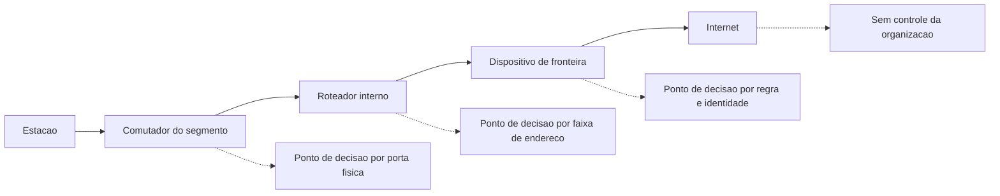

# Fundamentos de rede para o gestor

Uma ideia central: todo tráfego atravessa uma sequência de pontos, e cada ponto é ou um lugar onde alguém pode decidir, ou um lugar onde nada é decidido e o conteúdo apenas passa.

## 1. Objetivo de aprendizagem

Ao final deste tema você deve conseguir: descrever o caminho de um fluxo real entre dois pontos da sua rede, nomeando cada salto onde um controle é aplicável e cada ponto onde o conteúdo fica legível sem proteção adicional.

## 2. Pré-requisitos

Nada. Este é o primeiro tema da área. O vocabulário de ativo e de superfície de ataque em [01-fundamentos](../01-fundamentos/README.md) ajuda a nomear o que está em cada ponta do caminho.

## 3. Pré-teste

Responda de palpite, antes de ler o resto. Anote a confiança de 1 a 5.

1. Chute: quantas regras de firewall a sua empresa tem hoje? Anote a estimativa antes de pedir o número.
   Confiança: ___
2. Palpite: quando alguém digita o nome de um sistema interno no navegador, quantos serviços são consultados antes de o primeiro dado sair da estação? Anote um número.
   Confiança: ___
3. Antes de ler: em quantos pontos do caminho entre a sua estação e um sistema na nuvem um terceiro consegue ler o conteúdo trafegado? Aposte um número.
   Confiança: ___

## 4. Caso real

O RFC 1918, publicado em fevereiro de 1996 e ainda em vigor como BCP 5, reserva três blocos de endereço para uso interno: 10/8, 172.16/12 e 192.168/16. O documento é explícito sobre a motivação — conservar espaço de endereço global e conter o crescimento da tabela de rotas — e igualmente explícito no capítulo 6: "Security issues are not addressed in this memo".

Trinta anos depois, a confusão persiste em comitês de risco: "nossa rede interna é protegida porque usa faixa privada". O RFC não prometeu isso. Endereço privado não é roteável na internet pública, o que impede alcance externo; ele não diz nada sobre quem alcança o quê dentro da empresa. O NIST SP 800-207, de agosto de 2020, parte do mesmo ponto por outro caminho, ao afirmar que não se concede confiança implícita a ativos ou contas por causa da localização física ou de rede.

A pergunta que o caso deixa aberta: se o endereço privado não é controle, o que ele é, e em que ponto do caminho a decisão de acesso realmente acontece?

## 5. Conteúdo

### 5.1 Conceito

Um fluxo de rede é identificado por cinco elementos: endereço de origem, porta de origem, endereço de destino, porta de destino e protocolo de transporte. É sobre essa quíntupla que a maior parte das decisões de rede é escrita. Nome de sistema não aparece em regra de firewall, e é por isso que a resolução de nomes tem capítulo próprio nesta área.

O RFC 1918 descreve a consequência operacional de um endereçamento privado: hosts com endereço privado não têm conectividade IP com fora da empresa, e alcançam serviços externos por meio de gateways mediadores. Quem opera o gateway vê a conexão, e é ali que a decisão sobre o que sai fica registrada.

O NIST SP 800-81 Rev. 3, de março de 2026, descreve o DNS como parte integrante de qualquer arquitetura de rede corporativa, e afirma que um ataque contra a infraestrutura de DNS de uma empresa ameaça toda operação de rede dessa empresa. O argumento é estrutural: quase todo acesso começa por uma consulta de nome, e quem controla a resposta escolhe o destino.

Para o gestor, o vocabulário útil é curto: endereço, porta, nome, salto e ponto de decisão. Um fluxo sem nenhum ponto de decisão em todo o percurso é um fluxo sobre o qual não existe política, nem registro, nem limite.

### 5.2 Como funciona

A estação monta o pacote com endereço e porta de destino, resolve o nome antes, e entrega o pacote ao primeiro salto, que é o comutador local. O comutador decide por endereço físico dentro do segmento. O roteador decide por faixa de endereço, e escolhe o próximo salto. Ao cruzar a fronteira, um dispositivo de proteção de fronteira inspeciona e aplica a política.

O NIST SP 800-53 Rev. 5 define proteção de fronteira como o monitoramento e controle de comunicações na interface externa de um sistema, para prevenir e detectar comunicações maliciosas e outras comunicações não autorizadas por meio de dispositivos de proteção de fronteira. Note a escolha de palavras: monitorar e controlar, e a referência explícita a dispositivos, no plural. Fronteira não é um equipamento único.

Entre dois sistemas internos, o caminho costuma ter comutador e roteador e nenhum dispositivo de inspeção. Esse é o trecho leste-oeste, e é onde a maior parte do movimento lateral acontece em incidentes reais. Entre o usuário e a internet, o caminho tem mais pontos de decisão; entre dois servidores do mesmo segmento, muitas vezes tem zero.

### 5.3 Exemplo resolvido

Ambiente hipotético: analista da recepção abre um sistema de gestão hospedado em servidor interno.

Passo 1, nome. A estação consulta o resolver configurado. O resolver é da própria empresa, e a resposta dele é o que a estação aceita. Ponto de decisão: quem opera o resolver pode registrar e pode bloquear.

Passo 2, endereço. A resposta traz um endereço dentro da faixa 10/8. Nada aqui prova que o servidor é legítimo; prova apenas que a zona respondeu.

Passo 3, caminho. O pacote sai da estação, passa pelo comutador do segmento de estações, cruza o roteador interno e chega ao segmento do servidor. Não há inspeção nesse trecho.

Passo 4, legibilidade. O sistema é servido por HTTPS. Entre a estação e o servidor, o conteúdo está cifrado ponta a ponta; em qualquer ponto intermediário vê-se endereço de origem, endereço de destino, porta, volume e horário.

Passo 5, registro. O que existe para responder depois "quem acessou este servidor às 3h da manhã": registro do servidor web, registro de autenticação e, se configurado, registro de fluxo no roteador ou no firewall. Sem o terceiro, não há como saber o que foi tentado e recusado.

O que o exemplo demonstra é que o caminho interno tem dois pontos de decisão reais, o resolver e o servidor, e nenhum ponto de observação no meio. Quem não desenhou esse trecho não tem como afirmar depois o que passou por ali.

### 5.4 Problema de completar

Mesma empresa, agora um notebook da diretoria acessando o webmail hospedado em provedor externo.

| Etapa | O que acontece | Ponto de decisão | O que fica registrado |
|---|---|---|---|
| 1 | Resolução do nome | ______ | ______ |
| 2 | Saída para a internet | ______ | ______ |
| 3 | Estabelecimento do canal protegido | ______ | ______ |
| 4 | Autenticação no serviço externo | ______ | ______ |

Complete as quatro linhas e responda: se a diretoria usar um resolver público em vez do resolver da empresa, qual das quatro linhas perde o registro, e o que a organização deixa de conseguir afirmar em uma investigação?

## 6. Por que isso importa para o CISO

O orçamento de rede se justifica por pontos de decisão, não por quilômetros de cabo. Quando o comitê pede redução de custo, a pergunta que separa corte de risco é objetiva: qual ponto de decisão deixa de existir, e qual pergunta de investigação fica sem resposta por causa disso.

A segunda consequência é contratual. Gateway mediador, resolver e dispositivo de fronteira são pontos por onde passa dado de negócio e dado pessoal, e por isso aparecem em cláusula de auditoria, em avaliação de fornecedor e em pedido de evidência. Quem não sabe onde os pontos estão não consegue escrever a cláusula.

A terceira é a conversa com o board sobre "a rede interna é segura". A resposta tecnicamente correta, sustentada pelo RFC 1918 e pelo SP 800-207, é que a localização não autentica ninguém e que a proteção vem de quem decide o acesso a cada recurso. Dizer isso uma vez, com fonte, evita repetir a discussão a cada incidente.

## 7. Aplicação prática

Escolha cinco sistemas que a sua área usa todos os dias. Para cada um, desenhe o caminho até o usuário em quatro colunas: nome consultado, endereço de destino, pontos de decisão atravessados e fontes de registro existentes. Marque com um traço a coluna em que não houver nada.

Depois responda por escrito duas perguntas. Quantos dos cinco caminhos têm mais de um ponto de decisão. E, para o sistema mais crítico da lista, se um acesso suspeito ocorrer às 3h da manhã, qual registro provará o que aconteceu. Se a resposta à segunda pergunta for "nenhum", o item entra na sua lista de prioridades com dono e prazo.

## 8. Autoexplicação

Explique em três frases por que o endereço privado não é um controle de segurança, e diga qual ponto de decisão da sua rede hoje faz esse papel. Conecte com algo que você já faz: quem na sua empresa responde quando alguém pede "liberar acesso" para um novo fornecedor?

## 9. Erros comuns e equívocos

| Equívoco | Por que está errado | O que é correto |
|---|---|---|
| Rede interna com faixa privada é rede protegida | O RFC 1918 trata de alocação de endereço e afirma no capítulo 6 que questões de segurança não são tratadas nele | A faixa privada contém alcance externo; o controle do que é alcançado dentro vem da regra e da identidade |
| Regra de firewall pode citar nome de serviço | Dispositivo de rede aplica política sobre endereço, porta e protocolo | Nome entra na conversa de negócio; a regra precisa do endereço e da porta correspondentes |
| Estar na rede interna equivale a estar autenticado | O SP 800-207 afirma que não se concede confiança implícita por localização física ou de rede | Autenticação e autorização são funções executadas antes de estabelecer a sessão com o recurso |
| Todo acesso começa no firewall | Acesso entre dois sistemas do mesmo segmento pode não cruzar nenhum dispositivo de inspeção | Desenhe o caminho leste-oeste, que é onde falta ponto de decisão |
| HTTPS resolve o problema de visibilidade | Cifra o conteúdo e mantém visíveis endereço, porta, volume e horário | Combine proteção de transporte com registro de fluxo e de resolução |
| Aumentar a faixa de endereços privados dá mais segurança | A escolha da faixa é decisão de plano de endereçamento e de operação | Trate plano de endereçamento como decisão de arquitetura, não como medida de proteção |

## 10. Recuperação ativa

Responda tudo antes de abrir o gabarito.

1. Quais são os cinco elementos que identificam um fluxo, e por que o nome do sistema não é um deles?
2. O que o RFC 1918 afirma no capítulo de considerações de segurança, e como esse texto é usado para responder ao argumento "a rede interna é protegida"?
3. Quais são os três blocos de endereço reservados para uso privado pelo RFC 1918?
4. Como o NIST SP 800-53 Rev. 5 define proteção de fronteira, e por que a definição fala em dispositivos no plural?
5. Por que o NIST SP 800-81 Rev. 3 afirma que um ataque ao DNS ameaça toda a operação de rede da empresa?
6. Em um caminho entre dois servidores do mesmo segmento, quantos pontos de decisão costumam existir, e o que isso implica para a detecção?

Conferir respostas

1. Endereço de origem, porta de origem, endereço de destino, porta de destino e protocolo de transporte. O nome é resolvido antes, para um endereço; a política de rede é escrita sobre a quíntupla.
2. Afirma que problemas de segurança não são tratados no documento. Endereço privado contém alcance externo e não diz nada sobre o que é alcançado dentro da empresa, o que exige regra explícita e identidade.
3. 10.0.0.0 a 10.255.255.255, prefixo 10/8; 172.16.0.0 a 172.31.255.255, prefixo 172.16/12; 192.168.0.0 a 192.168.255.255, prefixo 192.168/16.
4. Como monitoramento e controle de comunicações na interface externa de um sistema, para prevenir e detectar comunicações maliciosas e não autorizadas por meio de dispositivos de proteção de fronteira. A fronteira é lógica e pode ser composta por mais de um equipamento, inclusive função implementada em software.
5. Porque a operação de rede da empresa depende de resolução de nomes: quem controla a resposta escolhe para onde o tráfego vai, e a indisponibilidade do serviço interrompe o resto.
6. Nenhum ou um, quando o comutador aplica alguma política. Sem ponto de inspeção, o que sobra é o registro do próprio host e o fluxo do roteador, e a detecção depende de telemetria do endpoint.

## 11. Revisão espaçada

| Intervalo | O que fazer | Se errar |
|---|---|---|
| D+1 | Desenhar de memória o caminho de um fluxo, com os pontos de decisão | Rebaixar: repetir em D+1 |
| D+7 | Refazer a seção 7 para outro grupo de cinco sistemas | Rebaixar: repetir em D+3 |
| D+30 | Verificar se algum fluxo crítico ganhou ponto de registro desde a primeira passagem | Rebaixar: repetir em D+7 |

## 12. Conexões com outros temas

Leitura humana do `relacoes` do frontmatter — que é a fonte. Relações que saem desta área
também aparecem em [mapa-relacoes.md](../mapa-relacoes.md). Regras em
[templates/RELACOES-TEMAS.md](../templates/RELACOES-TEMAS.md).

| Relação | Alvo | Por que |
|---|---|---|
| aplicado_em | 03-arquitetura-engenharia#TEMA-02 | o limite de confiança marcado no diagrama de fluxo só descreve a realidade quando o fluxo nomeado corresponde ao caminho que existe na rede |
| aprofundado_por | 07-criptografia-segredos#TEMA-01 | aqui o tráfego é tratado como legível no caminho até existir proteção; a mecânica de cifra, chave e autenticação está na área 07; destino planejado, número provisório |

## 13. Certificações e leitura recomendada

| Certificação | Domínio | Recurso | Tipo | Fonte |
|---|---|---|---|---|
| Network+ | Cobertura geral do tema | CompTIA Network+ | primaria | https://www.comptia.org/certifications/network |
| Security+ | Cobertura geral do tema | CompTIA Security+ | primaria | https://www.comptia.org/certifications/security |

Leitura direta: [RFC 1918, Address Allocation for Private Internets](https://www.rfc-editor.org/info/rfc1918/) e [NIST SP 800-81 Rev. 3, Secure DNS Deployment Guide](https://csrc.nist.gov/pubs/sp/800/81/r3/final).

O detalhe de cada credencial pertence a [90-certificacoes/](../90-certificacoes/README.md).

## 14. Fontes verificadas

| # | Título | Tipo | URL | Acessado em | Confiança |
|---|---|---|---|---|---|
| 1 | RFC 1918 / BCP 5 — três blocos privados, gateways mediadores e a seção 6 que declara não tratar de segurança | primaria | https://www.rfc-editor.org/info/rfc1918/ | "2026-09-25" | alta |
| 2 | NIST SP 800-207 — ausência de confiança implícita por localização física ou de rede | primaria | https://csrc.nist.gov/pubs/sp/800/207/final | "2026-09-25" | alta |
| 3 | NIST SP 800-81 Rev. 3 — DNS como parte integrante da arquitetura de rede corporativa e o impacto de um ataque ao serviço | primaria | https://csrc.nist.gov/pubs/sp/800/81/r3/final | "2026-09-25" | alta |
| 4 | NIST CSRC Glossary — boundary protection, texto do NIST SP 800-53 Rev. 5 | primaria | https://csrc.nist.gov/glossary/term/boundary_protection | "2026-09-25" | alta |

---

| Navegação | |
|---|---|
| Área | [05 Segurança de rede e infraestrutura](./README.md) |
| Próximo tema | [TEMA-02](TEMA-02-perimetro-firewall-inspecao.md) |
| Home | [README](../README.md) |
