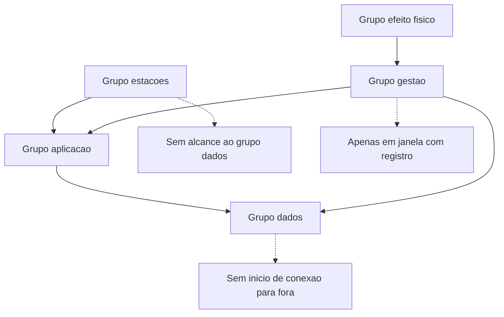

# Segmentação, VLAN e microssegmentação

Uma ideia central: segmentar é reduzir o conjunto de destinos que uma credencial comprometida alcança, e a VLAN sozinha não reduz nada.

## 1. Objetivo de aprendizagem

Ao final deste tema você deve conseguir: desenhar os segmentos do seu ambiente e a regra de fluxo entre eles, declarando por escrito o alcance de uma credencial comprometida antes e depois da mudança.

## 2. Pré-requisitos

[TEMA-02](TEMA-02-perimetro-firewall-inspecao.md). Sem a disciplina de regra com origem, destino, porta e dono, a matriz de fluxo vira uma lista de intenções.

## 3. Pré-teste

Responda de palpite, antes de ler o resto. Anote a confiança de 1 a 5.

1. Chute: quantas VLANs a sua rede tem, e quantas delas têm regra de firewall entre si? Anote os dois números.
   Confiança: ___
2. Palpite: se a conta de suporte fosse comprometida hoje, quantos servidores ela alcançaria? Aposte um número.
   Confiança: ___
3. Antes de ler: em quantas exceções de segmentação a sua empresa sabe dizer quem pediu e quando expiram? Anote uma proporção.
   Confiança: ___

## 4. Caso real

O NIST SP 800-207, publicado em agosto de 2020, afirma que zero trust parte de não conceder confiança implícita a ativos ou contas com base apenas na localização física ou de rede, e que a arquitetura zero trust foca em proteger recursos — ativos, serviços, fluxos de trabalho, contas — e não segmentos de rede, porque a localização deixou de ser o componente principal da postura de segurança de um recurso.

Uma rede corporativa brasileira de médio porte fez o movimento inverso. Segmentou tudo: quarenta VLANs por andar, por tipo de equipamento e por área. Manteve, para não gerar chamado, uma regra que libera a VLAN de gestão para todas as outras, nas portas administrativas. O resultado em auditoria interna foi direto: a conta de inventário, comprometida por um script em uma estação de trabalho, alcançou 312 dos 340 servidores em menos de vinte minutos.

A quantidade de VLANs não era protegida por nada. O que existia era organização de tráfego, com uma regra de gestão que anulava a contenção.

A pergunta que o caso deixa aberta: se a VLAN não é o controle, onde a decisão de contenção é de fato escrita, e como se prova que ela funciona?

## 5. Conteúdo

### 5.1 Conceito

Segmentação é uma decisão sobre alcance. O critério de agrupamento não é organograma nem tipo de equipamento: é o dano que uma credencial comprometida dentro do grupo pode causar e o conjunto de destinos de que o grupo precisa para trabalhar. Duas máquinas no mesmo andar podem pertencer a grupos diferentes; duas máquinas em prédios diferentes, ao mesmo.

VLAN é um mecanismo de camada de enlace. Ela cria domínios de difusão separados dentro da mesma infraestrutura física, e isso resolve ruído e organização. Ela não cria decisão de acesso: entre duas VLANs existe um roteador, e o que passa por ele depende de uma regra que alguém escreveu.

O NIST SP 800-41 Rev. 1 inclui firewall de host entre as tecnologias que enumera, ao lado de firewall de rede, filtragem de pacote e proxy. Isso importa aqui por um motivo prático: em ambiente de contêiner e de carga de trabalho que muda de endereço, o agente no host é o ponto onde a regra sobrevive à mudança de endereço.

A definição de proteção de fronteira do NIST SP 800-53 Rev. 5 fala de monitoramento e controle na interface externa de um sistema. Microssegmentação é a mesma ideia aplicada à interface de cada carga de trabalho: cada serviço passa a ter a sua própria fronteira, e o que a atravessa está escrito.

### 5.2 Como funciona

O trabalho começa pela lista de grupos, e a lista sai dos dados e das funções. Cinco grupos resolvem a maior parte dos ambientes corporativos: estações de trabalho, aplicação, dados, gestão e um grupo para o que tem efeito físico, como controlador industrial ou dispositivo médico conectado.

O segundo passo é a matriz de fluxo. Cada célula responde: este par precisa de comunicação, em qual porta, com qual identidade e por qual motivo. Célula vazia significa negado. A regra de preenchimento é a negação por padrão do [TEMA-02](TEMA-02-perimetro-firewall-inspecao.md), aplicada entre grupos em vez de entre internet e empresa.

O terceiro passo é declarar o que cada grupo não permite. O grupo de dados não inicia conexão para fora. A estação de trabalho não alcança o grupo de dados. O grupo de gestão aceita conexão em janela definida, com registro. Essas frases eliminam a maior parte dos caminhos que um adversário percorre depois de obter uma credencial válida.

O quarto passo é tratar a exceção. Toda matriz tem exceções legítimas: sistema legado, acesso de fornecedor, integração esquecida. A exceção tem origem, destino, porta, identidade, dono, prazo e a regra que a substitui. Exceção sem prazo vira arquitetura invisível.

Em ambiente de contêiner, o endereço muda a cada implantação e a identidade da carga de trabalho é o critério estável. Em ambiente de servidor tradicional, o endereço ainda é estável o suficiente para uma regra de matriz. A escolha entre os dois modelos é decisão de arquitetura; a lista de destinos que cada serviço precisa continua sendo o mesmo exercício.

### 5.3 Exemplo resolvido

Ambiente hipotético: uma clínica com prontuário eletrônico, laboratório, convênio e recepção, com uma VLAN única herdada do provedor de sistema.

Passo 1, grupos. Estação de atendimento, prontuário, laboratório, integração de convênio e gestão de infraestrutura.

Passo 2, matriz de fluxo.

| Origem | Destino | Porta e protocolo | Identidade | Motivo |
|---|---|---|---|---|
| Estação de atendimento | Prontuário | porta de aplicação, web | usuário nominal com segundo fator | registro de atendimento |
| Laboratório | Prontuário | porta de aplicação, web | conta de serviço do analisador | envio de resultado |
| Integração de convênio | Prontuário | porta de serviço de integração | certificado de cliente do integrador | autorização prévia |
| Gestão de infraestrutura | Prontuário e laboratório | porta administrativa | conta administrativa com segundo fator | manutenção em janela definida |
| Estação de atendimento | Laboratório | negado | — | nenhuma exceção |

Passo 3, o que cada grupo não permite. O grupo do prontuário não inicia conexão para fora. O laboratório acessa apenas o serviço de integração do prontuário, na porta de resultado. A estação de atendimento não alcança o laboratório nem o banco de resultado.

Passo 4, exceção. O laboratório envia laudo a um serviço externo. A regra fica: origem no servidor de integração do laboratório, destino no endereço do serviço externo, porta de web, com registro de saída e alerta de volume. Dono: gerente do laboratório. Prazo: revisão em 12 meses.

O ganho mensurável: antes, uma conta de recepção comprometida alcançava o banco de resultados. Depois, não alcança, e a tentativa deixa registro no dispositivo que aplica a regra entre os grupos.

### 5.4 Problema de completar

Mesma clínica, novo serviço: portal do paciente com resultado de exame na web, hospedado em provedor externo.

| Origem | Destino | Porta e protocolo | Identidade | Motivo |
|---|---|---|---|---|
| Portal externo | Prontuário | ______ | ______ | ______ |
| Estação de atendimento | Portal externo | ______ | ______ | ______ |
| Laboratório | Portal externo | ______ | ______ | ______ |

Complete a tabela e responda: o portal externo precisa consultar o prontuário. Escreva as três condições que essa consulta deve cumprir para não transformar a fronteira do grupo de dados em acesso aberto a partir da internet, e diga quem responde por essa regra.

## 6. Por que isso importa para o CISO

Segmentação é a decisão de rede com melhor relação entre custo e efeito sobre o tamanho de um incidente. Quando o adversário usa conta válida e serviço legítimo, a única barreira que ainda limita o dano é o alcance da credencial. Reduzir destinos alcançáveis reduz o número de sistemas que precisam ser investigados e recuperados.

O custo aparece na operação. O primeiro é o chamado do usuário que perdeu acesso a algo, resolvido com processo de exceção e não com regra permissiva. O segundo é a manutenção da matriz: quem atualiza, com que frequência e contra qual fonte de verdade. Uma matriz que ninguém revisa volta a ser rede plana em doze meses.

Há um terceiro efeito, em escopo de auditoria e de avaliação de fornecedor. A pergunta que reduz escopo tem forma numérica: quantos sistemas ficam expostos se a credencial de suporte for comprometida hoje. Quem não tem a matriz responde com adjetivo, e resposta com adjetivo não reduz escopo nem prêmio de seguro.

## 7. Aplicação prática

Monte a matriz de fluxo do seu ambiente em cinco linhas por cinco colunas, usando os grupos da seção 5.2. Preencha cada célula com permitido, negado ou exceção. Nas células permitidas, verifique na configuração real se a regra restringe porta e identidade ou se libera faixa inteira de endereços. As liberadas por faixa são a sua lista de trabalho.

Depois escolha a regra entre a estação de trabalho e o grupo de gestão, se ela existir, e responda três perguntas: existe, quem escreveu e o que ela permite. Em seguida, escreva a frase que resume a exposição atual da conta de suporte da sua empresa, com número de servidores alcançados. Essa frase é a que vai para a próxima discussão de orçamento.

## 8. Autoexplicação

Explique em três frases por que quarenta VLANs com uma regra ampla de gestão equivalem a uma rede plana. Conecte ao seu ambiente: qual conta, se comprometida hoje, teria o maior alcance, e o que você faria nos próximos trinta dias com essa informação?

## 9. Erros comuns e equívocos

| Equívoco | Por que está errado | O que é correto |
|---|---|---|
| Ter VLAN é ter segmentação | VLAN separa tráfego e não restringe fluxo entre grupos sem regra explícita | Escreva a matriz de fluxo e configure a negação por padrão nela |
| Rede interna é zona de confiança | O SP 800-207 afirma que a localização não concede confiança implícita | Use a localização como contenção e decida acesso por identidade |
| Segmentar por identidade dispensa segmentar por endereço | Restringir caminho e restringir ator atuam em camadas diferentes | Combine os dois: caminho negado é melhor que ator verificado |
| Exceção de fornecedor é permanente | Exceção permanente reabre o caminho que o grupo fechou | Exceção com prazo, dono e a regra que a substitui |
| Microssegmentação exige trocar toda a infraestrutura | É granularidade de regra, não substituição de equipamento | Comece pelas cargas que tratam dado mais sensível e cresça por risco |
| Matriz de fluxo é documento da equipe de rede | É documento de decisão de risco, e o dono responde pelo impacto | Revise a matriz com o dono do risco e registre quem aprovou cada exceção |

## 10. Recuperação ativa

Responda tudo antes de abrir o gabarito.

1. Qual é o critério correto para agrupar ativos em um segmento?
2. O que uma VLAN faz e o que ela não faz?
3. O que o NIST SP 800-207 afirma sobre confiança implícita, localização de rede e foco em recursos?
4. Quais são os quatro passos do desenho apresentados no tema, na ordem?
5. Que campos mínimos uma exceção precisa ter para não virar arquitetura invisível?
6. Por que a lista de tecnologias do NIST SP 800-41 Rev. 1 inclui firewall de host, e o que isso resolve em ambiente de contêiner?

Conferir respostas

1. O dano que uma credencial comprometida dentro do grupo pode causar e o conjunto de destinos de que o grupo precisa para operar. Nem organograma, nem tipo de equipamento.
2. Cria domínios de difusão separados na mesma infraestrutura física, o que reduz ruído e organiza o plano de endereçamento. Não cria decisão de acesso: entre duas VLANs o que passa depende da regra escrita no dispositivo que as conecta.
3. Que zero trust não concede confiança implícita a ativos ou contas com base apenas na localização física ou de rede, e que a arquitetura foca em proteger recursos — ativos, serviços, fluxos de trabalho e contas — e não segmentos de rede.
4. Listar os grupos a partir de dados e funções; montar a matriz de fluxo com negação por padrão; declarar o que cada grupo não permite; tratar as exceções com dono, prazo e regra substituta.
5. Origem, destino, porta, identidade, dono, prazo e a regra ou arquitetura que substitui a exceção ao final do prazo.
6. Porque existe firewall de host em cada servidor e carga de trabalho, e a regra sobrevive à mudança de endereço. Em contêiner, o endereço muda a cada implantação, e o agente no host é o ponto estável para aplicar a política.

## 11. Revisão espaçada

| Intervalo | O que fazer | Se errar |
|---|---|---|
| D+1 | Desenhar de memória os cinco grupos e a regra de negação por padrão | Rebaixar: repetir em D+1 |
| D+7 | Refazer a matriz de fluxo para outro processo de negócio | Rebaixar: repetir em D+3 |
| D+30 | Verificar se uma exceção vencida foi removida e registrar o resultado | Rebaixar: repetir em D+7 |

## 12. Conexões com outros temas

Leitura humana do `relacoes` do frontmatter — que é a fonte. Relações que saem desta área
também aparecem em [mapa-relacoes.md](../mapa-relacoes.md). Regras em
[templates/RELACOES-TEMAS.md](../templates/RELACOES-TEMAS.md).

| Relação | Alvo | Por que |
|---|---|---|
| aplicado_em | 06-endpoint-plataforma#TEMA-06 | a regra de microssegmentação depende de identidade da carga de trabalho e de agente no host para ser aplicada abaixo do endereço; destino planejado, número provisório |
| complementa | 03-arquitetura-engenharia#TEMA-03 | segmentação é decisão de arquitetura antes de ser configuração de switch: a zona de confiança define o que isolar e por qual critério, e VLAN, firewall e política de fluxo executam o isolamento |

## 13. Certificações e leitura recomendada

| Certificação | Domínio | Recurso | Tipo | Fonte |
|---|---|---|---|---|
| Network+ | Cobertura geral do tema | CompTIA Network+ | primaria | https://www.comptia.org/certifications/network |
| Security+ | Cobertura geral do tema | CompTIA Security+ | primaria | https://www.comptia.org/certifications/security |

Leitura direta: [NIST SP 800-207, Zero Trust Architecture](https://csrc.nist.gov/pubs/sp/800/207/final).

O detalhe de cada credencial pertence a [90-certificacoes/](../90-certificacoes/README.md).

## 14. Fontes verificadas

| # | Título | Tipo | URL | Acessado em | Confiança |
|---|---|---|---|---|---|
| 1 | NIST SP 800-207 — confiança implícita, localização de rede e foco em recursos em vez de segmentos, agosto de 2020 | primaria | https://csrc.nist.gov/pubs/sp/800/207/final | "2026-09-25" | alta |
| 2 | NIST CSRC Glossary — boundary protection, texto do NIST SP 800-53 Rev. 5 | primaria | https://csrc.nist.gov/glossary/term/boundary_protection | "2026-09-25" | alta |
| 3 | NIST SP 800-41 Rev. 1 — firewall de host e de rede entre as tecnologias de firewall, setembro de 2009 | primaria | https://csrc.nist.gov/pubs/sp/800/41/r1/final | "2026-09-25" | alta |

---

| Navegação | |
|---|---|
| Área | [05 Segurança de rede e infraestrutura](./README.md) |
| Tema anterior | [TEMA-02](TEMA-02-perimetro-firewall-inspecao.md) |
| Próximo tema | [TEMA-04](TEMA-04-criptografia-de-transporte-tls-vpn.md) |
| Home | [README](../README.md) |
