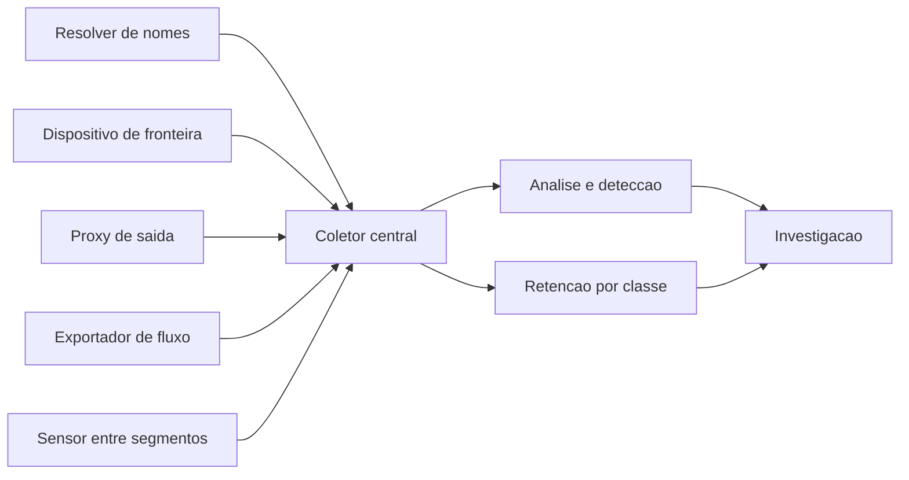

# Monitoramento de tráfego e arquitetura de rede segura

Uma ideia central: a telemetria que existe hoje determina as perguntas que a investigação de amanhã vai conseguir responder.

## 1. Objetivo de aprendizagem

Ao final deste tema você deve conseguir: definir a telemetria de rede a coletar, declarando para cada fonte a pergunta que ela responde, o tempo de retenção e o custo, dentro de um limite de orçamento escrito.

## 2. Pré-requisitos

[TEMA-02](TEMA-02-perimetro-firewall-inspecao.md) e [TEMA-03](TEMA-03-segmentacao-vlan-microssegmentacao.md). Sem registro no dispositivo de fronteira e sem regra entre segmentos, não existe ponto de onde a telemetria possa sair.

## 3. Pré-teste

Responda de palpite, antes de ler o resto. Anote a confiança de 1 a 5.

1. Chute: quantas fontes de telemetria de rede a sua empresa coleta hoje? Anote a estimativa antes de perguntar ao time.
   Confiança: ___
2. Palpite: por quanto tempo o registro de fluxo é mantido na sua empresa, e por quanto tempo o registro de consulta de nome? Aposte os dois prazos.
   Confiança: ___
3. Antes de ler: se um servidor interno falar com um destino externo desconhecido às 2h da manhã, o que sobra de prova no dia seguinte? Escreva o palpite.
   Confiança: ___

## 4. Caso real

O guia de gestão de log de segurança do NIST é o SP 800-92, publicado em setembro de 2006, com final em 13 de setembro daquele ano. O resumo descreve o documento como orientação prática para desenvolver, implementar e manter práticas de gestão de log, cobrindo infraestrutura de gestão de log e os processos correspondentes, e declara explicitamente que apresenta as tecnologias de registro de um ponto de vista de alto nível.

Dois mil e seis é antes de quase tudo o que uma rede corporativa usa hoje. O documento continua sendo o guia do NIST sobre o assunto, e isso por si é informação para o CISO: a disciplina de gestão de log é antiga, e o que envelheceu foi a tecnologia, não a pergunta central sobre quem guarda o quê, por quanto tempo e com qual autorização de acesso.

Em paralelo, o protocolo de exportação de fluxo tem especificação própria. O RFC 7011, de setembro de 2013, especifica o IPFIX como meio de transmitir informação de fluxo de tráfego pela rede, e explica a necessidade que ele resolve: para transmitir informação de fluxo de um processo exportador para um processo coletor, são necessários uma representação comum dos dados de fluxo e um meio padrão de comunicá-los.

A pergunta que o caso deixa aberta: por que uma organização que tem registro de firewall, de servidor e de endpoint ainda descobre, no meio de um incidente, que não consegue responder "de onde veio e para onde foi"?

## 5. Conteúdo

### 5.1 Conceito

Telemetria de rede se organiza em três níveis de detalhe, com custos que diferem em duas ordens de grandeza. O primeiro é o registro de evento de dispositivo: firewall, proxy, servidor de autenticação. O segundo é o fluxo: metadados de sessão, sem conteúdo, exportados no formato do RFC 7011. O terceiro é o pacote completo, capturado por espelhamento de porta ou por tap.

Cada nível responde perguntas diferentes. Registro de dispositivo responde "esta regra foi aplicada e a conexão foi aceita ou negada". Fluxo responde "quanto, quando, de onde para onde, por qual porta e por quanto tempo". Pacote responde "o que exatamente foi enviado" — e essa resposta só existe se o conteúdo não estiver cifrado ou se existir chave disponível, o que o sigilo direto do TLS 1.3 tornou raro em tráfego de rede.

O guia do NIST trata de infraestrutura de gestão de log e de processos, e não de produto. A tradução para decisão de gestor tem três itens: padrão de formato e de horário, destino central com controle de acesso e integridade, e política de retenção por classe. Sem os três, o log existe e não serve como evidência.

A camada que mais falta em desenho de rede é o registro do resolver de nomes. O NIST SP 800-81 Rev. 3 inclui registro de DNS entre as palavras-chave e trata o serviço como parte de uma abordagem de zero trust e de defesa em profundidade. O motivo prático é conhecido de quem investiga: a maior parte das ferramentas de ataque consulta nomes antes de conectar, e essa consulta aparece no registro do resolver mesmo quando todo o resto do tráfego está cifrado.

### 5.2 Como funciona

Fluxo e pacote exigem pontos de coleta. Em ambiente físico, o espelhamento de porta copia o tráfego de uma porta para outra, e o tap faz a mesma coisa com menor impacto em desempenho e maior custo de instalação. Em ambiente virtual e em nuvem, a coleta costuma vir do comutador virtual ou do próprio provedor, e o exportador de fluxo é a opção de menor custo e menor impacto.

A escolha do ponto de coleta define o que se vê. Sensor no link de internet vê tráfego norte-sul. Sensor entre segmentos vê o que cruza aquela fronteira. Nenhum dos dois vê tráfego entre dois hosts do mesmo segmento sem regra entre eles, o que é o argumento técnico para a segmentação do [TEMA-03](TEMA-03-segmentacao-vlan-microssegmentacao.md): a segmentação cria fronteiras, e fronteiras criam pontos de observação.

Retenção é a decisão de custo. Fluxo agregado ocupa pouco espaço por dia e é viável guardar por meses. Registro de evento cresce com o número de dispositivos e de regras com registro ativo. Pacote completo cresce com o volume de tráfego, e a guarda de tudo por trinta dias é, em rede grande, um projeto de armazenamento com dono e orçamento próprios. A regra que evita desperdício é declarar, para cada fonte, a pergunta que ela responde e o tempo mínimo para responder essa pergunta.

Duas exigências técnicas atravessam tudo. A primeira é sincronismo de horário: registro com relógio desalinhado não permite reconstruir sequência, e a sequência é o que separa suspeita de fato. A segunda é integridade: se o log pode ser alterado por quem tem acesso ao servidor, ele não serve como prova.

### 5.3 Exemplo resolvido

Ambiente hipotético: alerta de possível exfiltração em um servidor de arquivos, às 2h de uma sexta-feira.

Pergunta 1: houve conexão de saída? Responde o registro do dispositivo de fronteira, se a regra tem registro ativo. Estado: existe, com registro apenas nas regras de negação. A conexão permitida não gerou linha.

Pergunta 2: qual volume e duração? Responde o fluxo. Estado: existe exportação de fluxo do roteador de borda, com retenção de 7 dias. O evento está coberto por 1 dia.

Pergunta 3: para qual destino e qual nome? Responde o fluxo em parte e o registro do resolver. Estado: o resolver da empresa não registra consulta. O destino aparece por endereço, sem o nome.

Pergunta 4: o que foi enviado? Responde captura de pacote. Estado: não existe captura. Sem chave e sem pacote, a resposta é impossível.

O que sobra da investigação: endereço de destino, volume aproximado e horário. Três das quatro perguntas ficam sem resposta, e duas delas são respondíveis com custo baixo — registro nas regras de firewall e registro de consulta no resolver. A decisão sai do incidente com dono, prazo e custo estimado, e é isso que o relatório final leva ao comitê.

### 5.4 Problema de completar

Ambiente novo: empresa com um link de internet, três segmentos, servidor de arquivos próprio, e-mail em serviço externo e endpoints gerenciados.

| Fonte de telemetria | Pergunta que responde | Retenção mínima | Custo relativo |
|---|---|---|---|
| Registro de regra de firewall | ______ | ______ | ______ |
| Exportação de fluxo | ______ | ______ | ______ |
| Registro do resolver | ______ | ______ | ______ |
| Registro de autenticação | ______ | ______ | ______ |
| Captura de pacote | ______ | ______ | ______ |

Complete a tabela e responda: se o orçamento só permitir três dessas fontes, quais três você manteria e qual pergunta ficaria sem resposta. Justifique com o tempo entre a detecção e a investigação, não com preferência técnica.

## 6. Por que isso importa para o CISO

A resposta "não temos esse log" é dita em reunião com regulador, cliente e advogado. Ela custa mais do que a retenção que faltou, porque transforma uma investigação em declaração de ignorância sobre o próprio ambiente.

A segunda consequência é de orçamento. Armazenamento de telemetria é custo recorrente e compete com detecção e com prevenção. A decisão defensável é por pergunta e por prazo, com custo escrito: uma linha por fonte, o que ela responde e por quanto tempo precisa ser guardada. Isso transforma a discussão de "quanto espaço precisamos" em "quais perguntas recusamos responder".

A terceira é de privacidade. Fluxo é metadado de sessão; pacote pode conter dado pessoal e conteúdo de comunicação. Guardar por mais tempo ou em maior detalhe aumenta a consequência de um vazamento desse acervo. Retenção e acesso precisam ser decididos junto, e revisados quando o volume cresce.

## 7. Aplicação prática

Liste as fontes de telemetria de rede que existem hoje na sua empresa e, ao lado de cada uma, escreva a pergunta que ela responde. Use as quatro perguntas da seção 5.3 como referência. Marque as perguntas sem fonte.

Depois escolha a pergunta mais importante que ficou sem fonte, estime o custo da fonte que a responde e leve três números para a próxima reunião de operação: o custo, o tempo de retenção mínimo e o dono. Peça decisão por escrito, com aceite ou recusa do custo. Recusa registrada também é decisão, e protege o CISO no incidente seguinte.

## 8. Autoexplicação

Explique em três frases por que a pergunta sobre sincronismo de horário é de gestão e não de detalhe técnico. Conecte ao seu ambiente: qual a pergunta de investigação que você mais teme ouvir do board, e qual fonte de telemetria atual responderia menos de metade dela?

## 9. Erros comuns e equívocos

| Equívoco | Por que está errado | O que é correto |
|---|---|---|
| Guardar todo o pacote resolve a investigação | Com sigilo direto, a chave da sessão não existe mais, e o custo de armazenamento cresce com o tráfego | Priorize registro de dispositivo, fluxo e registro do resolver antes de pacote |
| Registro é assunto de operação de TI | O guia do NIST trata de infraestrutura e de processo, com requisito de acesso e de retenção | Trate retenção, integridade e acesso como decisão de risco, com dono e prazo |
| Detecção por assinatura cobre o que falta em telemetria | Assinatura só encontra o que está descrito, e opera sobre a fonte que existe | Declare a fonte por pergunta e trate assinatura como consequência da coleta |
| Mais log é sempre melhor | Volume sem dono eleva custo, ruído de análise e impacto de vazamento do próprio acervo | Defina retenção por classe, com pergunta associada a cada fonte |
| Relógio desalinhado é detalhe de servidor | Sem sequência temporal, o evento não se correlaciona com outros registros | Exija sincronismo de horário em todos os dispositivos que geram registro |
| Segmentação é assunto de desempenho | Fronteira entre segmentos é o que cria ponto de observação do tráfego leste-oeste | Decida segmentação e pontos de coleta no mesmo projeto |

## 10. Recuperação ativa

Responda tudo antes de abrir o gabarito.

1. O que o resumo do NIST SP 800-92 declara como escopo do documento, e qual é a data de publicação?
2. O que o RFC 7011 especifica e qual necessidade operacional ele descreve como motivação?
3. Quais são os três níveis de detalhe da telemetria de rede apresentados no tema, e que pergunta cada um responde?
4. Por que a segmentação aumenta a capacidade de observação da rede?
5. Quais são as duas exigências técnicas que atravessam toda a telemetria, e o que cada uma garante?
6. Por que o registro do resolver de nomes continua útil quando o conteúdo do tráfego está cifrado?

Conferir respostas

1. Orientação prática para entender a necessidade de boa gestão de log de segurança e para desenvolver, implementar e manter essas práticas, cobrindo infraestrutura de gestão de log e processos, com tecnologias apresentadas em alto nível. Publicado em setembro de 2006, com final em 13/09/2006.
2. O protocolo IPFIX, que serve como meio de transmitir informação de fluxo de tráfego pela rede. A motivação declarada é a necessidade de uma representação comum dos dados de fluxo e de um meio padrão de comunicá-los de um processo exportador para um processo coletor.
3. Registro de evento de dispositivo, que responde se a regra foi aplicada e qual foi o resultado; fluxo, que responde volume, horário, origem, destino, porta e duração; e captura de pacote, que responderia pelo conteúdo, quando ele não está cifrado ou existe chave disponível.
4. Porque cria fronteiras, e tráfego que cruza fronteira passa por um ponto onde a coleta é possível. Sem segmento, o tráfego entre hosts do mesmo grupo não cruza ponto algum.
5. Sincronismo de horário e integridade. O primeiro permite reconstruir a sequência dos eventos entre fontes diferentes; a segunda permite tratar o registro como prova, e não como texto que qualquer administrador altera.
6. Porque a consulta de nome acontece antes da conexão, e quem opera o resolver vê o nome consultado mesmo que o conteúdo das sessões esteja cifrado ponta a ponta.

## 11. Revisão espaçada

| Intervalo | O que fazer | Se errar |
|---|---|---|
| D+1 | Citar de memória os três níveis de telemetria e a pergunta de cada um | Rebaixar: repetir em D+1 |
| D+7 | Refazer a seção 7 com foco em uma pergunta de investigação diferente | Rebaixar: repetir em D+3 |
| D+30 | Conferir se a decisão de retenção registrada foi implementada e se o dono mudou | Rebaixar: repetir em D+7 |

## 12. Conexões com outros temas

Leitura humana do `relacoes` do frontmatter — que é a fonte. Relações que saem desta área
também aparecem em [mapa-relacoes.md](../mapa-relacoes.md). Regras em
[templates/RELACOES-TEMAS.md](../templates/RELACOES-TEMAS.md).

| Relação | Alvo | Por que |
|---|---|---|
| aplicado_em | 10-operacoes-soc#TEMA-02 | sem captura de tráfego não há telemetria de rede no SOC, e o que não é exportado não vira caso de uso; destino planejado, número provisório |
| complementa | 11-resposta-forense#TEMA-04 | o fluxo e o pacote retidos são a evidência técnica da investigação, e retenção e integridade são decisão tomada na rede antes do incidente; destino planejado, número provisório |

## 13. Certificações e leitura recomendada

| Certificação | Domínio | Recurso | Tipo | Fonte |
|---|---|---|---|---|
| Network+ | Cobertura geral do tema | CompTIA Network+ | primaria | https://www.comptia.org/certifications/network |
| Security+ | Cobertura geral do tema | CompTIA Security+ | primaria | https://www.comptia.org/certifications/security |

Leitura direta: [NIST SP 800-92, Guide to Computer Security Log Management](https://csrc.nist.gov/pubs/sp/800/92/final) e [RFC 7011, IPFIX Protocol Specification](https://www.rfc-editor.org/info/rfc7011/).

O detalhe de cada credencial pertence a [90-certificacoes/](../90-certificacoes/README.md).

## 14. Fontes verificadas

| # | Título | Tipo | URL | Acessado em | Confiança |
|---|---|---|---|---|---|
| 1 | NIST SP 800-92 — escopo declarado no resumo e publicação em setembro de 2006 | primaria | https://csrc.nist.gov/pubs/sp/800/92/final | "2026-09-25" | alta |
| 2 | RFC 7011 — IPFIX como meio de transmitir informação de fluxo, setembro de 2013 | primaria | https://www.rfc-editor.org/info/rfc7011/ | "2026-09-25" | alta |
| 3 | NIST SP 800-81 Rev. 3 — registro de DNS entre as palavras-chave e o serviço dentro de abordagem de zero trust e defesa em profundidade | primaria | https://csrc.nist.gov/pubs/sp/800/81/r3/final | "2026-09-25" | alta |
| 4 | NIST SP 800-207 — foco em recursos e não em segmentos, com deslocamento das defesas do perímetro estático | primaria | https://csrc.nist.gov/pubs/sp/800/207/final | "2026-09-25" | alta |
| 5 | NIST SP 800-41 Rev. 1 — firewall como dispositivo ou programa que controla o fluxo entre posturas de segurança diferentes, setembro de 2009 | primaria | https://csrc.nist.gov/pubs/sp/800/41/r1/final | "2026-09-25" | alta |

---

| Navegação | |
|---|---|
| Área | [05 Segurança de rede e infraestrutura](./README.md) |
| Tema anterior | [TEMA-05](TEMA-05-dns-email-web.md) |
| Home | [README](../README.md) |
