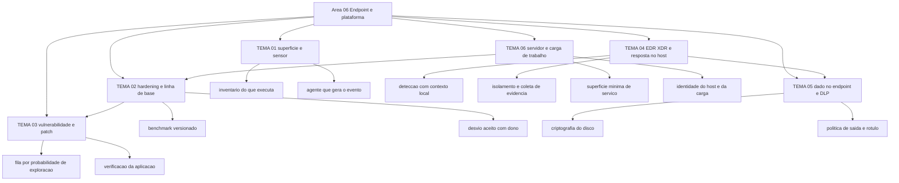

# Segurança de endpoint e plataforma

A lista de CIS Benchmarks traz recomendações prescritivas de configuração para mais de 25 famílias de produtos, com versões numeradas por sistema: Microsoft Windows 11 Enterprise 5.1.0, Microsoft Windows Server 2025 2.1.0, Red Hat Enterprise Linux 9 3.0.0, Apple macOS 26 Tahoe 1.1.0, Docker 1.8.0. Cada número desses descreve uma configuração que alguém precisa aplicar em milhares de máquinas e depois provar que aplicou. Esta área trata de como essa prova é produzida.

## 1. Introdução

### 1.1 O que é esta área

Endpoint é o dispositivo que executa código em nome de uma pessoa ou de um serviço: notebook, estação, telefone, servidor, instância em nuvem, contêiner. Plataforma é o sistema operacional, o firmware e a camada de virtualização que sustentam esse código. Esta área cobre seis decisões sobre esse par: o que o dispositivo expõe, com que configuração ele nasce, com que frequência ele recebe correção, o que ele observa sobre si mesmo, o que ele pode fazer com o dado que guarda e como servidores e cargas de trabalho entram nesse regime.

Fica fora da área o perímetro de rede, que é o [05-rede-infraestrutura](../05-rede-infraestrutura/README.md); a autenticação e o privilégio da identidade humana, que são o [04-identidade-acesso](../04-identidade-acesso/README.md); a operação da detecção e o ciclo de resposta, que são o [10-operacoes-soc](../10-operacoes-soc/README.md) e o [11-resposta-forense](../11-resposta-forense/README.md). Aqui ficam o estado do dispositivo, a configuração que ele carrega e a telemetria que ele emite.

### 1.2 Por que isso importa para o CISO

A revista do NIST SP 800-40, publicada em abril de 2022, nomeia explicitamente um conflito que aparece em quase toda organização: existe uma divisão entre donos de negócio e missão de um lado e a gestão de segurança e tecnologia do outro quanto ao valor de aplicar patch. O documento responde a esse conflito enquadrando patch como manutenção preventiva — custo de fazer negócio, não projeto com data de término. Quem assina o orçamento de TI precisa ouvir isso na linguagem que ele já usa para troca de pneu e revisão de elevador, senão a discussão vira preferência técnica.

O segundo efeito é de exposição a auditoria e a contrato. CIS Benchmarks e a família de controle de configuração existem como artefato nomeado e versionado. Quando um cliente corporativo pede evidência de que as estações seguem um padrão, a resposta verificável é o identificador do benchmark com a versão e a data de medição do desvio. A resposta que não sobrevive é "seguimos boas práticas".

O terceiro efeito é de custo afundado. Uma estação entregue sem criptografia de disco e sem controle de execução consome, depois, esforço de projeto para receber as duas coisas — e o esforço recai sobre o time que já está apagando incêndio. Decidir o estado inicial do dispositivo é decisão de uma vez só.

### 1.3 O que você será capaz de fazer ao final

- Descrever o parque de dispositivos em três tabelas: o que existe, o que roda em cada um e o que cada um observa sobre si mesmo.
- Escolher um benchmark publicado para cada família de sistema operacional do parque, fixar a versão e declarar por escrito o desvio aceito.
- Montar a fila de patch com critério de priorização declarado, distância entre detecção e correção e registro de verificação da aplicação.
- Explicar o que o agente de endpoint detection and response faz no dispositivo e qual é o limite de decisão que você concede a ele.
- Escrever a política de saída de dado do dispositivo, com o que é apenas registrado e o que é bloqueado.
- Descrever como servidores e cargas de trabalho entram no mesmo regime de linha de base, patch e telemetria, com o que muda.

### 1.4 Os temas desta área, em prosa

O [TEMA-01](TEMA-01-endpoint-superficie-e-sensor.md) separa as duas funções do dispositivo: ele é onde o código roda e é a única testemunha com contexto local do que rodou. O [TEMA-02](TEMA-02-hardening-e-linhas-de-base.md) trata da configuração com que a máquina nasce e do desvio que a organização decide aceitar. O [TEMA-03](TEMA-03-vulnerabilidades-e-patches-no-endpoint.md) cobre o ciclo de correção: identificar, priorizar, instalar e verificar. O [TEMA-04](TEMA-04-edr-xdr-e-resposta-no-host.md) descreve o que o agente observa, o que ele detém sozinho e o que ele entrega para a triagem. O [TEMA-05](TEMA-05-protecao-de-dados-no-endpoint-e-dlp.md) trata do dado no dispositivo: criptografia, rótulo e política de saída. O [TEMA-06](TEMA-06-servidores-e-cargas-de-trabalho.md) leva o mesmo regime para servidores, contêineres e cargas em nuvem, onde a superfície e o dono mudam.

## 2. Objetivos de aprendizagem (terminais)

| # | Objetivo | Bloom | Temas que o sustentam |
|---|---|---|---|
| 1 | Construir o inventário do parque em três eixos — dispositivo, software que executa e telemetria que emite — declarando a lacuna de cada eixo. | aplicar | TEMA-01 |
| 2 | Escolher e versionar um benchmark de configuração por família de sistema operacional, com registro do desvio aceito e do risco associado. | aplicar | TEMA-02 |
| 3 | Montar a fila de correção do parque com critério de priorização declarado e evidência de verificação por item fechado. | aplicar | TEMA-03 |
| 4 | Definir o escopo de resposta concedido ao agente de endpoint, distinguindo o que ele contém sozinho do que exige decisão humana. | avaliar | TEMA-04 |
| 5 | Escrever a política de saída de dado do dispositivo, separando monitoramento de bloqueio e declarando a base de classificação. | criar | TEMA-05 |
| 6 | Estender linha de base, patch e telemetria a servidores e cargas de trabalho, justificando onde o regime tem de ser diferente. | avaliar | TEMA-06 |

## 3. Diagrama dos tópicos

## 4. Temas

| # | tema_id | Tema | Nível | Tempo |
|---|---|---|---|---|
| 1 | TEMA-01 | Endpoint como superfície e como sensor | intermediario | 30-40 min |
| 2 | TEMA-02 | Hardening e linhas de base | intermediario | 35-45 min |
| 3 | TEMA-03 | Gestão de vulnerabilidades e patches no endpoint | intermediario | 35-45 min |
| 4 | TEMA-04 | EDR, XDR e resposta no host | intermediario | 35-45 min |
| 5 | TEMA-05 | Proteção de dados no endpoint e DLP | intermediario | 30-45 min |
| 6 | TEMA-06 | Segurança de servidores e cargas de trabalho | avancado | 35-50 min |

## 5. Pré-requisitos e sequência

O [01 Fundamentos](../01-fundamentos/README.md) fornece o vocabulário de ativo, superfície de ataque e controle. O [03 Arquitetura e engenharia](../03-arquitetura-engenharia/README.md) vem antes porque a linha de base é um princípio de arquitetura escrito para um tipo de ativo, e o TEMA-01 daquela área declara essa passagem explicitamente.

| Antes | Esta área | Depois |
|---|---|---|
| 01-fundamentos, 03-arquitetura-engenharia | 06-endpoint-plataforma | 10-operacoes-soc, 11-resposta-forense, 08-cloud |

Dentro da área a sequência é sugestão. Quem opera uma frota de servidores pode começar pelo TEMA-06 e voltar ao TEMA-02, porque o TEMA-06 reaplica o mesmo método de linha de base em contexto diferente.

## 6. Certificações desta área

Apenas siglas e o que cada credencial usa desta área. Domínios, pesos e custo ficam em [90-certificacoes/](../90-certificacoes/README.md).

| Certificação | Sigla | O que cobre aqui |
|---|---|---|
| Microsoft Certified Security Operations Analyst Associate | SC-200 | Operação de detecção e resposta sobre telemetria de endpoint e de nuvem; nomes de domínio NAO CONFIRMADO em fonte oficial nesta execução |
| GIAC Security Essentials | GSEC | Vocabulário e controles de segurança de sistema e de plataforma; nomes de domínio NAO CONFIRMADO em fonte oficial nesta execução |

Ver: [90-certificacoes/](../90-certificacoes/README.md).

## 7. Conexões com outras áreas

Relações de saída dos temas desta área que apontam para fora dela, agregadas do frontmatter
`relacoes`. A visão consolidada está em [mapa-relacoes.md](../mapa-relacoes.md); as regras, em
[templates/RELACOES-TEMAS.md](../templates/RELACOES-TEMAS.md). Alvos marcados como pendentes
ainda não foram escritos.

| Tema daqui | Relação | Destino | Por que |
|---|---|---|---|
| TEMA-01 | complementa | 10-operacoes-soc#TEMA-02 | o endpoint é a principal fonte de telemetria do SOC; sem os eventos do host, o caso de uso de detecção nasce cego |
| TEMA-02 | aplicado_em | 12-vulnerabilidades-threat-intel#TEMA-01 | o desvio de linha de base é a exposição configuracional que entra no inventário de vulnerabilidades |
| TEMA-03 | aplicado_em | 12-vulnerabilidades-threat-intel#TEMA-06 | o tempo entre detecção e correção no parque é o insumo da métrica de exposição e dívida de remediação |
| TEMA-03 | complementa | 12-vulnerabilidades-threat-intel#TEMA-02 | CVSS, EPSS e o catálogo de exploração em campo são o critério de priorização que a janela de patch do endpoint executa |
| TEMA-04 | aplicado_em | 11-resposta-forense#TEMA-03 | isolar a máquina e remover o artefato é a contenção e a erradicação executadas no host |
| TEMA-04 | complementa | 10-operacoes-soc#TEMA-04 | a resposta no host e a triagem do SOC são o mesmo incidente visto de dois lugares |
| TEMA-05 | aplicado_em | 14-dados-privacidade#TEMA-03 | retenção e descarte do dado no dispositivo são executados pelas ferramentas que aplicam o rótulo |
| TEMA-05 | complementa | 14-dados-privacidade#TEMA-02 | a política de saída só classifica o que a classificação de dado já declarou sensível |
| TEMA-06 | aplicado_em | 08-cloud#TEMA-01 | o modelo de responsabilidade compartilhada define até onde a correção do servidor e da imagem é sua |
| TEMA-06 | complementa | 08-cloud#TEMA-04 | a carga endurecida no host é a mesma que roda como contêiner ou instância em nuvem, com o mesmo problema de superfície |

## 8. Atividades práticas e laboratórios

| # | Atividade | O que a prática demonstra | Pré-requisito técnico |
|---|---|---|---|
| 1 | Contar os dispositivos que aparecem no inventário de gestão e comparar com o número de contas de usuário ativas | O tamanho da lacuna entre o que a empresa acha que tem e o que ela tem | exportação do inventário |
| 2 | Listar os processos com assinatura válida de fornecedor que executam ao final de um dia de trabalho em cinco estações | Que o catálogo de executáveis legítimos é menor do que parece e cabe em uma planilha | acesso a uma estação |
| 3 | Pegar o benchmark CIS da família dominante do parque e marcar 20 itens, indicando quais já estão aplicados | O desvio real entre a configuração pretendida e a configuração de fábrica | benchmark baixado, sem ferramenta de varredura |
| 4 | Levantar o percentual de dispositivos que recebeu atualização de sistema operacional nos últimos 30 dias | Quanto do parque está fora do ciclo de correção | relatório de gestão de atualização |
| 5 | Perguntar ao time quem decide isolar uma máquina durante um incidente e em que prazo | Onde está a lacuna entre detecção e resposta | nenhum |
| 6 | Escrever, em uma página, o que a empresa bloquearia hoje se alguém tentasse copiar dado de cliente para um pendrive | Se existe política de saída de dado e se ela está publicada | nenhum |

## 9. Checkpoint da área

Seis itens retirados dos temas, fora da ordem original. Responda antes de abrir o gabarito.

1. Um agente registra o processo, o pai do processo e a linha de comando. Por que o processo pai muda a leitura do evento? (TEMA-01)
2. Existe um benchmark publicado para o sistema operacional do parque. Ainda assim, a empresa tem de registrar o desvio. Por qual motivo? (TEMA-02)
3. A mesma correção tem CVSS 9.8 e probabilidade de exploração de 0,02 nos próximos 30 dias. O que a empresa faz com esse número? (TEMA-03)
4. O agente de endpoint bloqueia sozinho um arquivo malicioso e não avisa ninguém. Qual é o risco de governança dessa configuração? (TEMA-04)
5. A política de saída mostra um aviso ao usuário e permite que ele confirme a cópia. Em que situação essa escolha é defensável? (TEMA-05)
6. Um servidor de banco de dados roda sem atualização há dois anos porque a janela de manutenção é curta. Qual argumento de risco sustenta a mudança dessa decisão? (TEMA-06)

Conferir respostas e critério

1. Porque o processo pai diz quem iniciou o quê. Um interpretador de script iniciado por um navegador é um evento diferente do mesmo interpretador iniciado por uma tarefa administrativa. Sem o pai, o evento descreve o mecanismo e apaga a origem.
2. Porque desvio não é exceção a esconder, é decisão de risco. Aplicar o benchmark inteiro quebra aplicação de negócio; o item não aplicado precisa de dono, prazo e justificativa para que a decisão possa ser revista e para que a auditoria veja critério, não esquecimento.
3. Prioriza. Probabilidade estimada e ranking percentual dizem onde o esforço limitado de correção produz mais redução de risco primeiro. Score de severidade sem probabilidade ordena por pior caso, não por risco provável.
4. A resposta foi delegada a um algoritmo sem trilha de decisão. O bloqueio precisa gerar alerta com contexto, alguém precisa ter o direito de revisar a decisão e precisa existir registro de que ela ocorreu. Sem isso, a organização não consegue provar que agiu nem detectar bloqueio indevido em produção.
5. Quando o dado é de baixa sensibilidade, quando o usuário é o dono do processo de negócio e quando o registro da justificativa é capturado. Se a mesma política cobrir dado de cliente, o bloqueio sem opção de contorno é a escolha proporcional.
6. O servidor sem correção acumula duas dívidas: vulnerabilidade conhecida e ausência de suporte do fornecedor. O argumento que muda a decisão é de continuidade de negócio — a janela curta não elimina o risco, ela transfere o risco para o dia em que a correção for obrigatória e não houver mais versão suportada.

Critério para seguir adiante: acertar 80% ou mais sem consultar os temas. Erro no item 2 ou no item 5 indica confusão entre desvio aceito e ausência de controle; releia TEMA-02 e TEMA-05 antes de seguir.

## 10. Termos desta área

Termos que o glossário central precisa conter; as definições ficam em [glossario.md](../glossario.md).

- endpoint
- superfície de ataque de dispositivo
- telemetria de host
- agente de endpoint
- hardening
- linha de base de configuração (baseline)
- benchmark de configuração
- desvio de configuração (configuration drift)
- imagem dourada (golden image)
- application control
- lista de permitidos (allowlist)
- aplicação de patch (patching)
- tempo de correção (mean time to remediate)
- endpoint detection and response (EDR)
- extended detection and response (XDR)
- isolamento de host (host isolation)
- criptografia de disco (full disk encryption)
- data loss prevention (DLP)
- classificação de dado
- ambiente de execução (runtime)
- identidade do host (host identity)
- hardening de servidor
- carga de trabalho (workload)
- contêiner

## 11. Fontes verificadas

| # | Título | Tipo | URL | Acessado em | Confiança |
|---|---|---|---|---|---|
| 1 | CIS Benchmarks List — recomendações prescritivas para mais de 25 famílias de produtos, com versões 5.1.0 do Windows 11 Enterprise e 2.1.0 do Windows Server 2025 | primaria | https://www.cisecurity.org/cis-benchmarks | "2026-09-25" | alta |
| 2 | NIST SP 800-40 Rev. 4 — publicado em abril de 2022, substitui a Rev. 3 de 22/07/2013, DOI 10.6028/NIST.SP.800-40r4 | primaria | https://csrc.nist.gov/pubs/sp/800/40/r4/final | "2026-09-25" | alta |
| 3 | NIST SP 800-61 Rev. 3 — publicado em abril de 2025, substitui a Rev. 2 de 06/08/2012, DOI 10.6028/NIST.SP.800-61r3 | primaria | https://csrc.nist.gov/pubs/sp/800/61/r3/final | "2026-09-25" | alta |
| 4 | NIST SP 800-167 — Guide to Application Whitelisting, outubro de 2015, DOI 10.6028/NIST.SP.800-167 | primaria | https://csrc.nist.gov/pubs/sp/800/167/final | "2026-09-25" | alta |
| 5 | NIST SP 800-128 — setembro de 2011, retirado em 10 de outubro de 2019 e substituído por SP 800-128 upd1; família de controle Configuration Management | primaria | https://csrc.nist.gov/pubs/sp/800/128/final | "2026-09-25" | alta |
| 6 | MITRE ATT&CK — Execution, tactic TA0002, 20 técnicas, criado em 17/10/2018, modificado em 25/04/2025, versão v19 | primaria | https://attack.mitre.org/tactics/TA0002/ | "2026-09-25" | alta |
| 7 | Microsoft Learn — Application Control for Windows, atualizado em 19/08/2026 | primaria | https://learn.microsoft.com/en-us/windows/security/application-security/application-control/app-control-for-business/appcontrol | "2026-09-25" | alta |
| 8 | Microsoft Learn — Microsoft Defender for Endpoint overview, atualizado em 28/07/2026 | primaria | https://learn.microsoft.com/en-us/defender-endpoint/microsoft-defender-endpoint | "2026-09-25" | alta |
| 9 | Microsoft Learn — Learn about data loss prevention, atualizado em 26/06/2026 | primaria | https://learn.microsoft.com/en-us/purview/dlp-learn-about-dlp | "2026-09-25" | alta |
| 10 | FIRST — EPSS, probabilidade estimada de exploração de um CVE publicado nos próximos 30 dias | primaria | https://www.first.org/epss/ | "2026-09-25" | alta |
| 11 | CISA — Known Exploited Vulnerabilities Catalog, mantido pela CISA e estabelecido pela Binding Operational Directive 22-01 | primaria | https://www.cisa.gov/known-exploited-vulnerabilities-catalog | "2026-09-25" | media |

A página do CISA KEV não renderizou em duas tentativas de leitura direta nesta execução; o conteúdo citado veio do índice de busca do domínio cisa.gov, com confiança média. Os nomes de domínio das certificações SC-200 e GSEC não foram conferidos nesta execução e estão marcados como NAO CONFIRMADO em fonte oficial.

---

| Navegação | |
|---|---|
| Anterior | [03 Arquitetura e engenharia de segurança](../03-arquitetura-engenharia/README.md) |
| Próximo | [10 Operações de segurança e SOC](../10-operacoes-soc/README.md) |
| Home | [README](../README.md) |
