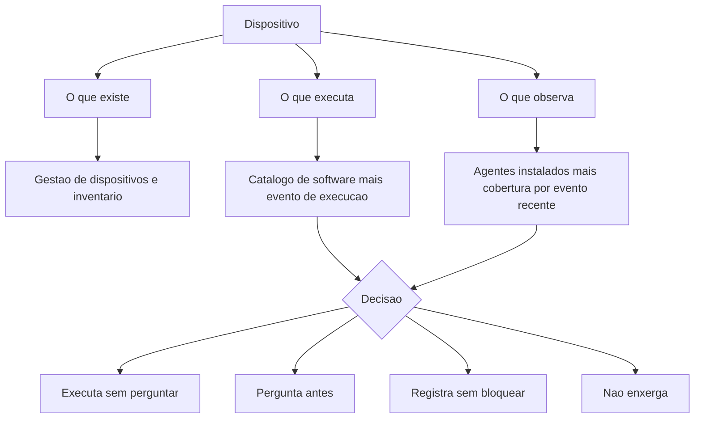

# Endpoint como superfície e como sensor

Uma ideia central: o dispositivo é, na mesma hora, o lugar onde o código do atacante precisa rodar e a única testemunha que enxerga o contexto local dessa execução. Tratar as duas funções como uma só decisão é o erro que produz parque sem inventário e detecção sem dado.

## 1. Objetivo de aprendizagem

Ao final deste tema você deve conseguir: descrever um dispositivo em três eixos — o que executa, com que privilégio executa e o que ele registra sobre essa execução — identificando a lacuna de cada eixo em um parque existente, com o nome de quem responde por fechar a lacuna.

## 2. Pré-requisitos

Nenhum. O conceito de ativo e de superfície de ataque vem do [01 Fundamentos](../01-fundamentos/README.md). Este tema aplica esse vocabulário a um tipo de ativo específico.

## 3. Pré-teste

Responda de palpite, antes de ler o resto. Anote a confiança de 1 a 5.

1. Quantos dispositivos a sua empresa tem sob gestão? Qual é a fonte desse número e há quanto tempo ela foi medida?
   Confiança: ___
2. Quantos processos diferentes executam em uma estação comum durante um dia de trabalho? Chute um número.
   Confiança: ___
3. Se um funcionário executa um programa indesejado hoje, o que a sua organização consegue provar amanhã sobre o que aconteceu?
   Confiança: ___

## 4. Caso real

A tática Execution do MITRE ATT&CK, identificada como TA0002, está descrita como o conjunto de técnicas que resultam em código controlado pelo adversário rodando em um sistema local ou remoto. A página da tática registra 20 técnicas, foi criada em 17 de outubro de 2018, teve a última modificação em 25 de abril de 2025 e está na versão v19 do catálogo.

Vale olhar a lista pelo que ela revela sobre o dispositivo. Entre as 20 técnicas estão Command and Scripting Interpreter, com sub-técnicas para PowerShell, Windows Command Shell e Unix Shell; Hijack Execution Flow, que sequestra o mecanismo de carregamento de biblioteca; SaaS ou serviços de sistema como System Services e Scheduled Task/Job; e User Execution, em que a ação da pessoa é o gatilho. Nenhuma delas depende de um arquivo com assinatura maliciosa. Quase todas reaproveitam um programa legítimo que já está instalado e autorizado na máquina.

O catálogo também publica a data de criação de cada técnica, e essa data é uma medida de quanto tempo um defensor teve para reagir. A tática inteira existe desde 2018.

A pergunta que o caso deixa aberta: se quase toda execução maliciosa usa binário legítimo, o que exatamente um antivírus deveria estar procurando?

## 5. Conteúdo

### 5.1 Conceito

Superfície, no dispositivo, é o conjunto de caminhos pelos quais código chega à memória e passa a executar com a identidade de alguém. Isso inclui o executável que o usuário abre por clique, o macro de um documento, o script que o navegador dispara, a tarefa agendada que roda de madrugada, o serviço que sobe com o sistema, a biblioteca que um programa carrega do diretório errado e o pacote que o gestor de dependência baixa da internet. Contar só a primeira categoria produz um inventário que não corresponde à realidade.

Sensor, no dispositivo, é a capacidade de reconstruir o que aconteceu depois que aconteceu. O valor está no contexto local: qual processo iniciou o processo, qual arquivo foi tocado, qual conexão saiu da máquina, qual conta de serviço estava ativa. Uma peça dessa informação isolada diz pouco; a cadeia de processos com o tempo de cada passo é o que permite decidir se aquilo foi operação normal ou intrusão.

As duas funções convivem no mesmo dispositivo e disputam recursos comuns. Todo sensor consome CPU, disco e rede, e todo controle de execução pode quebrar um processo de negócio. A decisão prática é sempre sobre onde colocar a linha: o que a máquina pode executar sem perguntar, o que ela pergunta antes, o que ela registra sem bloquear e o que ela nem enxerga. As quatro faixas são decisões de risco distintas, com custos distintos.

O NIST SP 800-167, publicado em outubro de 2015, define lista de permitidos como a relação de aplicações e componentes de aplicação autorizados em uma organização, e descreve a tecnologia de whitelisting como o mecanismo que usa essa relação para controlar quais aplicações podem executar em um host. O sentido da pergunta muda com essa definição. Num parque sem lista, a pergunta é se o programa é malicioso; num parque com lista, a pergunta é se o programa está autorizado — e a segunda pergunta tem resposta verificável.

### 5.2 Como funciona

O sensor funciona por gancho no núcleo do sistema operacional. O agente registra o evento no momento em que ele ocorre, antes que o processo possa esconder o rastro, e assina o registro para que ele não seja falsificável depois. Cada evento carrega identificador do processo, identificador do processo pai, conta que executou, linha de comando, arquivo executado e horário. A cadeia se forma porque o identificador do pai liga um evento ao anterior.

O inventário se forma por três perguntas, e cada uma tem uma fonte diferente. O que existe é respondido pelo sistema de gestão de dispositivos e pelo inventário de ativos. O que executa é respondido pelo catálogo de software instalado mais a telemetria de execução. O que observa é respondido pela lista de agentes instalados e pela cobertura efetiva de cada um, medida em número de máquinas que enviam evento nos últimos sete dias.

A terceira pergunta é a que costuma mentir. Um agente instalado que parou de enviar evento é indistinguível de um agente saudável em qualquer planilha de implantação. A métrica que não mente é a de máquinas com evento recente, separada por tipo de evento.

O privilégio é o eixo que liga superfície e sensor. Uma conta administrativa local transforma qualquer caminho de execução em caminho com poder de alterar o próprio sensor. Por isso a linha de privilégio precisa ser decidida junto com a linha de execução: de nada adianta bloquear a execução de um script se a mesma pessoa tem permissão de escrever na pasta em que o sensor carrega os próprios componentes.

### 5.3 Exemplo resolvido

Uma empresa com 400 dispositivos, entre estações e notebooks, quer responder se o parque tem inventário, catálogo de execução e cobertura de telemetria. Cinco passos.

Passo 1 — contar o que existe. O sistema de gestão de dispositivos informa 382 máquinas. O diretório de identidade informa 431 contas de usuário com sessão ativa nos últimos 90 dias. A diferença de 49 não é necessariamente 49 máquinas: parte é pessoa com dois computadores, parte é consultor externo, parte é máquina que nunca entrou na gestão. A tarefa aqui não é fechar a conta, é nomear a causa da diferença por amostragem de 20 casos.

Passo 2 — listar o que executa. Em cinco estações escolhidas ao acaso, coletar os executáveis distintos que rodaram em um dia de trabalho, com o caminho completo e a assinatura digital. O resultado típico fica em algumas centenas de itens, e a maior parte se concentra em umas poucas dezenas de fabricantes. Esse é o material da lista de permitidos.

Passo 3 — separar legítimo de autorizado. Do catálogo do passo 2 saem três grupos. O primeiro é software corporativo com dono declarado. O segundo é software de fabricante de sistema operacional e de driver. O terceiro é o que ninguém reconhece — ferramenta portátil, utilitário gratuito, programa de fabricante desconhecido, jogo instalado por alguém. O terceiro grupo é o objetivo do exercício.

Passo 4 — medir o sensor. Para cada agente instalado, contar quantas máquinas enviaram algum evento nos últimos sete dias, e repetir a contagem por tipo de evento. O número que interessa não é a cobertura total e sim a cobertura do tipo de evento que sustenta o caso de uso de detecção — criação de processo, por exemplo.

Passo 5 — cruzar com privilégio. Levantar quantas pessoas têm conta administrativa local na própria máquina. Cada conta dessas é um caminho pelo qual o sensor pode ser desligado antes de gerar o evento.

O que o exercício entrega: a lista do terceiro grupo do passo 3, o número de máquinas no escuro do passo 4 e a contagem de contas administrativas do passo 5. São três decisões com dono diferente, e nenhuma delas exige comprar ferramenta nova.

### 5.4 Problema de completar

Mesma empresa, agora com o resultado dos cinco passos na mão. Complete a tabela e depois responda à pergunta final.

| Lacuna encontrada | Decisão de risco correspondente | Dono provável | Prazo razoável |
|---|---|---|---|
| 49 dispositivos fora da gestão de dispositivos | ______ | ______ | ______ |
| 12 executáveis sem dono declarado em uso recorrente | ______ | ______ | ______ |
| Nenhum evento de criação de processo em 63 máquinas | ______ | ______ | ______ |
| 118 contas com privilégio administrativo local | ______ | ______ | ______ |

Responda ainda: se a empresa só pudesse resolver uma das quatro lacunas neste trimestre, qual delas reduz mais a chance de um incidente passar sem ser percebido? Justifique em três linhas, indicando o que a sua escolha deixa de cobrir.

## 6. Por que isso importa para o CISO

O número que o CISO leva ao comitê não é o total de dispositivos, é o total de dispositivos que a organização consegue reconstruir. Um parque de 5.000 máquinas em que 300 enviam evento de processo é um parque de 300 máquinas com testemunha e 4.700 sem.

A consequência aparece na conversa com o jurídico e com o regulador. O NIST SP 800-61 Rev. 3, publicado em abril de 2025, foi escrito para integrar resposta a incidente cibernético às atividades de gestão de risco do NIST Cybersecurity Framework 2.0. A primeira dessas atividades é saber o que existe e o que é observado. Sem essas duas respostas, a notificação de incidente vira estimativa.

Há também o efeito sobre o orçamento de ferramenta. Vendedor de plataforma de endpoint vende cobertura; a cobertura contratada não é a cobertura efetiva. A cláusula que interessa no contrato é a que define o que conta como dispositivo protegido e qual métrica o fornecedor se obriga a reportar. Medir a cobertura por evento recente antes de assinar muda a posição de negociação.

## 7. Aplicação prática

Escolha três pessoas da empresa de áreas diferentes e peça autorização para sentar dez minutos ao lado de cada uma no fim do dia. Anote, sem interromper, todo programa que abre e todo site que o navegador carrega. Não é auditoria, é amostragem.

Depois compare as três listas e responda por escrito: quantos itens aparecem em mais de uma lista, quantos itens você não sabia que a empresa usava e quantos deles alguém consegue justificar como ferramenta de trabalho. O parágrafo que sai dessa comparação é o melhor argumento que existe para começar o catálogo de execução, e custa três visitas.

## 8. Autoexplicação

Explique em três frases por que o mesmo evento de processo precisa do identificador do processo pai para ser útil. Ligue a explicação ao seu ambiente: escolha um sistema que você governa e diga, sem consultar nada, quantas máquinas dele enviam evento de execução para algum lugar.

## 9. Erros comuns e equívocos

| Equívoco | Por que está errado | O que é correto |
|---|---|---|
| Endpoint é sinônimo de estação de trabalho | O servidor, a instância em nuvem e o contêiner executam código e têm identidade própria | Trate servidor e carga de trabalho como endpoint, com regime próprio |
| Antivírus com assinatura atualizada resolve execução | A maior parte das técnicas de execução reaproveita binário legítimo já instalado | Controle o que pode executar por autorização, e mantenha o antivírus ao lado disso |
| Agente instalado significa agente funcionando | Instalação é registro em inventário, não prova de envio de evento | Meça cobertura por tipo de evento e por janela de tempo |
| Inventário de dispositivo é inventário de software | O mesmo equipamento pode ter centenas de executáveis distintos em um dia | Mantenha as duas listas e cruze uma com a outra |
| Privilégio administrativo local é questão de conforto do usuário | A conta administrativa altera o próprio sensor e o próprio controle de execução | Trate privilégio local como decisão de segurança, com prazo e justificativa |
| Bloquear tudo que não está na lista é o objetivo final | Bloqueio sem catálogo consolidado para a operação no primeiro dia útil | Passe primeiro por auditoria, publique o catálogo e só então aplique a política |

## 10. Recuperação ativa

Responda tudo antes de abrir o gabarito.

1. Quais são os três eixos de descrição de um dispositivo e qual é a fonte de dado de cada um?
2. O que a definição de lista de permitidos do NIST SP 800-167 muda na pergunta que o defensor faz sobre um programa?
3. Por que a tática Execution do MITRE ATT&CK reúne técnicas que não dependem de arquivo malicioso?
4. Qual métrica substitui a contagem de agentes instalados, e por quê?
5. Como o privilégio administrativo local afeta a função de sensor do dispositivo?

Conferir respostas

1. O que existe, o que executa e o que observa. O primeiro vem do sistema de gestão de dispositivos e do inventário de ativos; o segundo, do catálogo de software instalado combinado com a telemetria de execução; o terceiro, da lista de agentes instalados combinada com a cobertura medida em máquinas que enviaram evento recente, separada por tipo de evento.
2. Troca a pergunta "este programa é malicioso?" por "este programa está autorizado?". A segunda tem resposta verificável contra uma lista publicada e não depende de julgamento sobre intenção.
3. Porque o adversário alcança execução reaproveitando componentes legítimos do sistema — interpretadores de comando e script, serviços, tarefas agendadas, sequestro do caminho de carregamento de biblioteca, ferramentas de fornecedor com assinatura válida e a própria ação do usuário. Nenhum desses caminhos requer um binário novo e detectável por assinatura.
4. A contagem de máquinas que enviaram evento recente, por tipo de evento. Instalação é estado de inventário; envio de evento é comportamento observado, e é o comportamento que sustenta a detecção.
5. A conta administrativa local tem permissão para parar o serviço do agente, alterar sua configuração ou escrever na pasta de onde ele carrega componentes. O sensor passa a operar sob o controle do mesmo sujeito que ele deveria observar.

## 11. Revisão espaçada

| Intervalo | O que fazer | Se errar |
|---|---|---|
| D+1 | Responder à seção 10 sem reler | Rebaixar: repetir em D+1 |
| D+7 | Medir a cobertura de telemetria de um tipo de evento no seu parque | Rebaixar: repetir em D+3 |
| D+30 | Repetir o cruzamento das três listas do passo 3 com dados do mês | Rebaixar: repetir em D+7 |

## 12. Conexões com outros temas

Leitura humana do `relacoes` do frontmatter — que é a fonte. Relações que saem desta área
também aparecem em [mapa-relacoes.md](../mapa-relacoes.md). Regras em
[templates/RELACOES-TEMAS.md](../templates/RELACOES-TEMAS.md).

| Relação | Alvo | Por que |
|---|---|---|
| complementa | 06-endpoint-plataforma#TEMA-04 | o dispositivo só vira sensor quando o agente transforma o evento local em detecção investigável, e é isso que o TEMA-04 detalha |
| complementa | 10-operacoes-soc#TEMA-02 | o endpoint é a principal fonte de telemetria do SOC; sem os eventos do host, o caso de uso de detecção nasce cego |

## 13. Certificações e leitura recomendada

| Certificação | Domínio coberto | Recurso | Tipo | Fonte |
|---|---|---|---|---|
| SC-200 | Operação de detecção e resposta sobre telemetria de endpoint e de nuvem | Microsoft Learn — Application Control for Windows | primaria | https://learn.microsoft.com/en-us/windows/security/application-security/application-control/app-control-for-business/appcontrol |
| GSEC | Vocabulário e controles de segurança de sistema e de plataforma | NIST SP 800-167 — Guide to Application Whitelisting | primaria | https://csrc.nist.gov/pubs/sp/800/167/final |

Leitura recomendada: [MITRE ATT&CK — Execution, tactic TA0002](https://attack.mitre.org/tactics/TA0002/).

## 14. Fontes verificadas

| # | Título | Tipo | URL | Acessado em | Confiança |
|---|---|---|---|---|---|
| 1 | MITRE ATT&CK — Execution, tactic TA0002, 20 técnicas, criado em 17/10/2018, modificado em 25/04/2025, versão v19 | primaria | https://attack.mitre.org/tactics/TA0002/ | "2026-09-25" | alta |
| 2 | NIST SP 800-167 — Guide to Application Whitelisting, outubro de 2015, DOI 10.6028/NIST.SP.800-167 | primaria | https://csrc.nist.gov/pubs/sp/800/167/final | "2026-09-25" | alta |
| 3 | NIST SP 800-128 — agosto de 2011, retirado em 10 de outubro de 2019, substituído por SP 800-128 upd1 | primaria | https://csrc.nist.gov/pubs/sp/800/128/final | "2026-09-25" | alta |
| 4 | NIST SP 800-61 Rev. 3 — Incident Response Recommendations and Considerations for Cybersecurity Risk Management, abril de 2025 | primaria | https://csrc.nist.gov/pubs/sp/800/61/r3/final | "2026-09-25" | alta |

---

| Navegação | |
|---|---|
| Área | [06 Segurança de endpoint e plataforma](./README.md) |
| Próximo tema | [TEMA-02](TEMA-02-hardening-e-linhas-de-base.md) |
| Home | [README](../README.md) |
