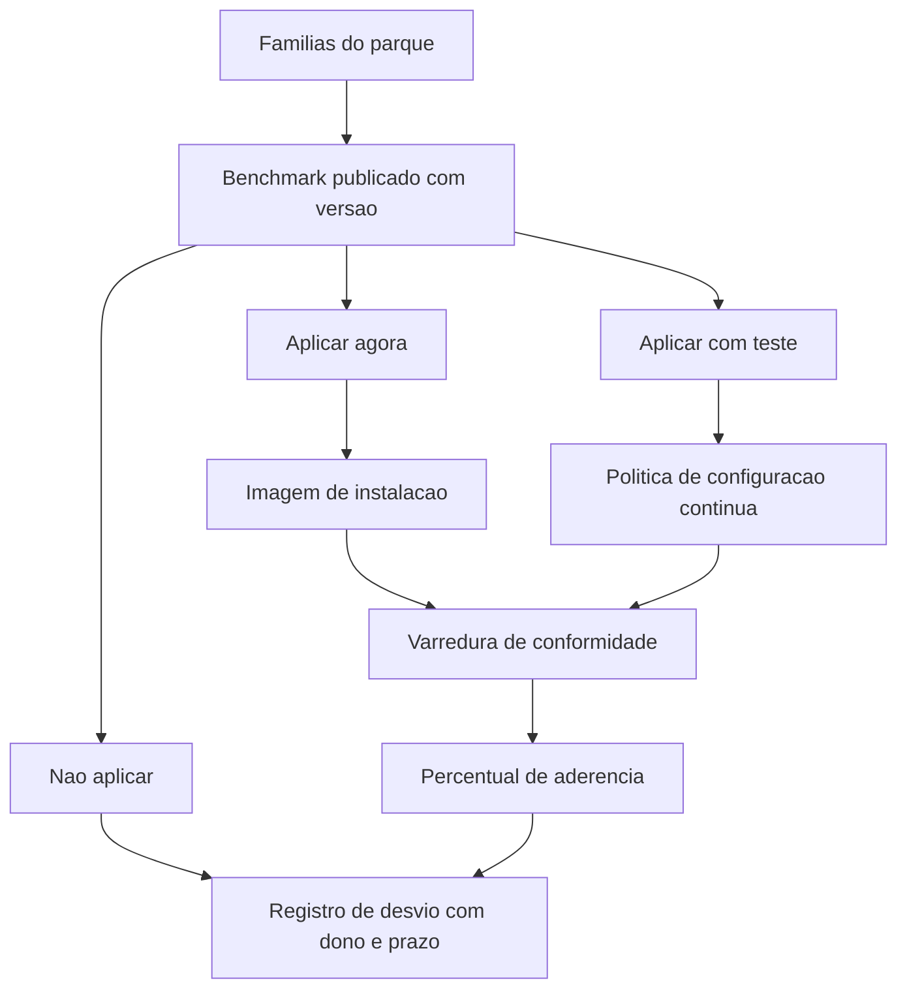

# Hardening e linhas de base

Uma ideia central: linha de base é uma configuração escrita, com versão declarada, aplicada por padrão a todo um grupo de máquinas, cujo desvio só existe acompanhado de dono, prazo e risco aceito.

## 1. Objetivo de aprendizagem

Ao final deste tema você deve conseguir: escolher e versionar um benchmark de configuração por família de sistema operacional do parque, produzindo o registro de desvio aceito com dono, prazo e risco associado, e apontando a evidência usada para medir a aderência.

## 2. Pré-requisitos

O [TEMA-01](TEMA-01-endpoint-superficie-e-sensor.md) vem antes porque a linha de base só é aplicável a uma família de máquinas que a organização sabe que existe. O vocabulário de negação por padrão e de custo de reversão vem do [03 Arquitetura e engenharia](../03-arquitetura-engenharia/TEMA-01-principios-arquitetura-seguranca.md).

## 3. Pré-teste

Responda de palpite, antes de ler o resto. Anote a confiança de 1 a 5.

1. Qual é o padrão de configuração que a sua empresa aplica hoje em uma estação Windows nova? Quem escreveu esse padrão?
   Confiança: ___
2. Se um item de configuração precisa ficar desligado por causa de um sistema de negócio, onde essa decisão está registrada?
   Confiança: ___
3. Existe diferença entre a configuração com que a máquina foi entregue e a configuração que ela tem hoje? Como você provaria?
   Confiança: ___

## 4. Caso real

A lista de CIS Benchmarks se define como recomendações prescritivas de configuração para mais de 25 famílias de produtos e se apresenta como esforço de consenso de especialistas. Um detalhe operacional dessa lista costuma passar desapercebido: cada entrada tem número de versão. Entre as versões vigentes publicadas estão Microsoft Windows 11 Enterprise 5.1.0, Microsoft Windows Server 2025 2.1.0, Microsoft Windows Server 2022 5.1.0, Apple macOS 26 Tahoe 1.1.0, Red Hat Enterprise Linux 9 3.0.0, Ubuntu Linux 24.04 LTS 2.0.0, Docker 1.8.0, Kubernetes 2.0.1, Google Chrome 3.0.0, Microsoft Edge 4.0.0 e Microsoft Defender Antivirus 1.0.0.

A lista também mantém uma seção de DISA STIG, com versões para Microsoft Windows 11 STIG 1.2.0, Microsoft Windows Server 2022 STIG 3.0.0, Red Hat Enterprise Linux 10 STIG 1.0.0 e Kubernetes STIG 1.1.0. Existem ainda versões recortadas para gestão móvel, como Microsoft Intune for Windows 11 5.0.0, e variantes com o sufixo Cloud-tailored para macOS.

O número de versão é o que permite uma frase que sobrevive a auditoria: "estações Windows 11 seguem CIS Microsoft Windows 11 Enterprise 5.1.0, com 7 itens não aplicados, listados no registro de desvio". Sem o número, a frase vira "seguimos as boas práticas do CIS", que não é verificável nem comparável entre dois trimestres.

A pergunta que o caso deixa aberta: o benchmark tem centenas de itens e a operação não tem tempo para aplicar todos. Como decidir quais ficam de fora sem transformar a decisão em esquecimento?

## 5. Conteúdo

### 5.1 Conceito

Hardening é a remoção e a restrição do que a máquina oferece por padrão. Sistema operacional nasce com serviços ligados, contas pré-criadas, protocolos legados, compartilhamentos administrativos, execução de script habilitada e funcionalidade de conveniência que serve a casos de uso variados. Cada item desses é uma superfície mantida por alguém que não é você. Hardening é o trabalho de decidir o que fica.

Linha de base é o resultado desse trabalho transformado em artefato. Um artefato de linha de base tem quatro propriedades que o distinguem de um documento de boas práticas: identifica a família e a versão do sistema alvo, tem número de versão próprio, é aplicado automaticamente a grupos de máquinas e é medido por varredura periódica que produz uma lista de itens conformes e não conformes. Documento sem essa quarta propriedade é intenção.

O NIST SP 800-128, publicado em agosto de 2011, descreve gestão de configuração voltada a segurança e usa a sigla SecCM para marcar esse foco. O objetivo declarado das atividades de SecCM é gerenciar e monitorar as configurações dos sistemas de informação para alcançar segurança adequada e minimizar o risco organizacional, ao mesmo tempo em que se sustenta a funcionalidade e os serviços de negócio desejados. A frase final é a que importa para o gestor: segurança adequada e funcionalidade desejada são objetivos simultâneos, e a linha de base é onde os dois se encontram. Esse documento foi retirado em 10 de outubro de 2019 e substituído pela sua atualização, o SP 800-128 upd1.

Desvio de linha de base é toda diferença entre o declarado e o medido. Existem dois tipos. O desvio permitido é o item que a organização decidiu não aplicar por razão de negócio, e ele vive no registro. O desvio não intencional é a configuração que mudou sozinha, por instalação de software, por atualização de fornecedor ou por alguém com privilégio. O segundo tipo é o que corrói a linha de base ao longo do tempo, e o único jeito de vê-lo é medir de novo.

### 5.2 Como funciona

A aplicação da linha de base acontece em três camadas, e cada uma resolve um problema diferente. A imagem de instalação resolve o problema do estado inicial: a máquina que sai da fábrica interna já sai com a configuração pretendida, sem depender de alguém lembrar de aplicar depois. A política de configuração contínua resolve o problema do desvio não intencional: um agente reaplica o valor declarado quando encontra diferença. A varredura de conformidade resolve o problema da prova: ela não corrige, ela mede e reporta.

A escolha do benchmark segue uma ordem prática. Primeiro, contar as famílias de sistema operacional do parque e a quantidade de máquinas em cada uma. Segundo, para a família dominante, baixar o benchmark publicado e verificar se a versão corresponde à versão do sistema em uso — benchmark de Windows 11 não se aplica a Windows 10. Terceiro, classificar os itens em três faixas: aplicar agora, aplicar com teste, e não aplicar. Quarto, para o terceiro grupo, escrever o desvio.

O registro de desvio é o artefato que sustenta a decisão. Quatro campos bastam: identificador do item e versão do benchmark, motivo de negócio em uma frase, dono nominal e data de reavaliação. Sem o dono nominal, o desvio é anônimo. Sem a data de reavaliação, ele é permanente. Nada impede que um desvio seja renovado a cada ciclo — o que não pode acontecer é ele sobreviver sem que ninguém tenha olhado.

Controle de execução entra nessa camada e merece atenção separada. A documentação da Microsoft sobre Application Control for Windows descreve a mudança de modelo: a máquina passa de um estado em que todo código roda a menos que o antivírus preveja que ele é ruim para um estado em que o código só roda se a política permitir. A mesma documentação registra que o alcance vai além de aplicativos, cobrindo scripts, instaladores, arquivos de lote e até sessões interativas de PowerShell, e lista duas tecnologias disponíveis no Windows para essa função. O NIST SP 800-167 trata do mesmo assunto pelo nome de lista de permitidos. A adoção segue o padrão de maturidade: primeiro auditoria, com o agente apenas registrando o que teria sido bloqueado; depois política em modo de avaliação; só então bloqueio, e por último com o conjunto de exceções já estável.

### 5.3 Exemplo resolvido

Uma empresa tem 620 estações Windows 11 e 40 servidores Windows Server 2022. O time de infraestrutura pede autorização para aplicar um benchmark. Cinco passos.

Passo 1 — escolher o benchmark e a versão. São duas famílias e dois benchmarks distintos. Para as estações, CIS Microsoft Windows 11 Enterprise 5.1.0. Para os servidores, CIS Microsoft Windows Server 2022 5.1.0. Registrar as duas escolhas em ata, com a data.

Passo 2 — classificar os itens em faixas. O time lê a lista do benchmark e marca cada item. Os itens que restringem execução de código não assinado, removem protocolo legado e reduzem superfície de serviço entram em aplicar agora. Os itens que alteram política de senha, política de auditoria ou configuração de rede entram em aplicar com teste, porque mudança de rede quebra integração. Os itens que exigem um componente que a empresa não usa entram em não aplicar, com o motivo "componente não instalado".

Passo 3 — montar a imagem. Os itens de aplicar agora vão para a imagem de instalação das estações. A partir desse momento, toda estação nova sai configurada. Isso não corrige as 620 existentes; para essas o caminho é a política de configuração contínua.

Passo 4 — rodar a varredura antes de mudar. Antes de aplicar qualquer coisa, medir. A primeira varredura costuma devolver aderência baixa, e esse número é a linha de base do projeto, não uma falha. Sem essa medição inicial não existe como provar melhoria depois.

Passo 5 — abrir o registro de desvio. Para cada item do terceiro grupo, escrever o motivo, o dono e a data de reavaliação. Os desvios que ninguém reivindica vão para o comitê de segurança como decisão pendente, não para a pilha de itens corrigidos.

O que sai desse trabalho, três meses depois: um número de aderência por família, um registro de desvio com sete a vinte linhas e uma decisão explícita sobre o que a empresa aceita não fazer. A decisão é o produto. O número é a evidência de que ela está sendo seguida.

### 5.4 Problema de completar

Mesma empresa, ciclo seguinte. O time trouxe cinco situações. Complete a tabela e responda à pergunta final.

| Situação | Tipo de desvio | Ação | Quem assina |
|---|---|---|---|
| Um item do benchmark desliga o protocolo legado que o sistema de laboratório usa para enviar exame | ______ | ______ | ______ |
| A política contínua reencontrou o valor antigo em 34 máquinas após instalação de software de fabricante | ______ | ______ | ______ |
| O benchmark foi atualizado de 5.1.0 para 5.2.0 e inclui 12 itens novos | ______ | ______ | ______ |
| Um item não foi aplicado porque exigia reinício e ninguém agendou a janela | ______ | ______ | ______ |
| Um fornecedor de sistema de negócio exige que uma conta com privilégio ampliado exista na máquina | ______ | ______ | ______ |

Responda ainda: em qual das cinco situações a organização corre mais risco de perder rastreabilidade da própria decisão? Justifique em duas linhas, indicando o registro que resolveria o problema.

## 6. Por que isso importa para o CISO

Linha de base é o único lugar do programa de endpoint em que a decisão de segurança é tomada de uma vez e cobrada continuamente. Aplicar na imagem custa uma janela de projeto; corrigir depois custa janela por máquina.

O efeito sobre auditoria é direto. Um percentual de aderência por família de sistema, com versão de benchmark declarada e registro de desvio datado, responde à pergunta de controle sem depender de narrativa. O mesmo conjunto de dados responde à pergunta de due diligence de cliente corporativo e à de seguradora cibernética.

Há um efeito menos visível, de disputa interna. Todo sistema de negócio que pede exceção de configuração está transferindo risco para a plataforma comum. O registro de desvio com dono nominal devolve essa transferência para quem a pediu. A conversa muda de "segurança não deixa" para "esta exceção está no nome de quem a solicitou, com prazo". Nenhuma dessas duas frases exige autoridade formal do CISO; a diferença está no registro.

## 7. Aplicação prática

Escolha a família de sistema operacional mais numerosa do seu parque. Baixe o benchmark publicado para essa família e selecione vinte itens, sem ferramenta de varredura. Para cada um, responda três perguntas em uma planilha: este item está aplicado hoje, quem sabe a resposta com certeza e como essa pessoa sabe.

O resultado esperado é que a coluna "quem sabe" fique vazia em boa parte das linhas e que a coluna "como sabe" traga respostas do tipo "acho que sim". Esse é o material que justifica a varredura de conformidade no próximo ciclo de orçamento — não a lista de vulnerabilidades, a incapacidade de provar o estado atual.

## 8. Autoexplicação

Explique em três frases por que uma linha de base sem varredura periódica não é um controle. Ligue ao seu ambiente: nomeie a máquina sob sua responsabilidade que você tem menos certeza de que está na configuração pretendida, e diga o que seria necessário para verificar.

## 9. Erros comuns e equívocos

| Equívoco | Por que está errado | O que é correto |
|---|---|---|
| Aplicar o benchmark inteiro é o objetivo | Item que quebra sistema de negócio gera exceção informal, e exceção informal não é medida | Classifique em aplicar agora, aplicar com teste e não aplicar, e registre o terceiro grupo |
| Endurecer de uma vez, sem medir antes | Sem medição inicial não existe como provar melhoria nem separar o que já estava bom | Rode a primeira varredura antes de mudar qualquer coisa |
| Linha de base é assunto de servidor | Estação de trabalho é a maior parte do parque e a porta de entrada mais comum | Cubra também o parque de estações, com benchmark próprio |
| Imagem de instalação resolve a linha de base | Ela corrige o estado inicial e não toca nas máquinas já instaladas | Combine imagem, política contínua e varredura |
| Desvio aceito é falha de conformidade | Desvio com dono, prazo e motivo é decisão de risco documentada | Trate o registro de desvio como parte do artefato, não como exceção a esconder |
| Controle de execução é ligar e esquecer | Política de execução mal calibrada bloqueia processo de negócio em produção | Passe por auditoria e modo de avaliação antes do bloqueio |

## 10. Recuperação ativa

Responda tudo antes de abrir o gabarito.

1. Quais são as quatro propriedades que distinguem um artefato de linha de base de um documento de boas práticas?
2. Qual é o objetivo declarado das atividades de gestão de configuração descrito pelo NIST SP 800-128, e qual é a situação daquele documento hoje?
3. O que a documentação da Microsoft sobre Application Control for Windows descreve como mudança de modelo de execução?
4. Descreva os dois tipos de desvio de linha de base e a diferença prática entre eles.
5. Quais quatro campos bastam no registro de desvio, e o que acontece quando o dono nominal está ausente?

Conferir respostas

1. Identifica a família e a versão do sistema alvo, tem número de versão próprio, é aplicado automaticamente a grupos de máquinas e é medido por varredura periódica que separa itens conformes de não conformes.
2. Gerenciar e monitorar as configurações dos sistemas para alcançar segurança adequada e minimizar o risco organizacional, sustentando a funcionalidade e os serviços de negócio desejados. O SP 800-128 de agosto de 2011 foi retirado em 10 de outubro de 2019 e substituído pela sua atualização, o SP 800-128 upd1.
3. A máquina passa de um estado em que todo código roda a menos que a solução de antivírus preveja que ele é ruim para um estado em que o código só roda se a política de controle de execução permitir. O alcance inclui scripts, instaladores, arquivos de lote e sessões interativas de PowerShell.
4. Desvio permitido, que é o item não aplicado por decisão de negócio e vive no registro; e desvio não intencional, que é a configuração alterada por instalação, atualização de fornecedor ou ação com privilégio. O primeiro é decisão; o segundo é degradação, e só a medição periódica o revela.
5. Identificador do item com a versão do benchmark, motivo de negócio, dono nominal e data de reavaliação. Sem dono nominal o desvio é anônimo, e ninguém tem motivo para revê-lo.

## 11. Revisão espaçada

| Intervalo | O que fazer | Se errar |
|---|---|---|
| D+1 | Escrever de memória as quatro propriedades do artefato de linha de base | Rebaixar: repetir em D+1 |
| D+7 | Preencher a planilha de vinte itens da seção 7 para outra família de sistema | Rebaixar: repetir em D+3 |
| D+30 | Revisar o registro de desvio e checar se os donos continuam nominais | Rebaixar: repetir em D+7 |

## 12. Conexões com outros temas

Leitura humana do `relacoes` do frontmatter — que é a fonte. Relações que saem desta área
também aparecem em [mapa-relacoes.md](../mapa-relacoes.md). Regras em
[templates/RELACOES-TEMAS.md](../templates/RELACOES-TEMAS.md).

| Relação | Alvo | Por que |
|---|---|---|
| aplicado_em | 12-vulnerabilidades-threat-intel#TEMA-01 | o desvio de linha de base é a exposição configuracional que entra no inventário de vulnerabilidades |
| nao_confundir_com | 06-endpoint-plataforma#TEMA-03 | linha de base corrige configuração herdada da organização; patch corrige código publicado pelo fornecedor |

## 13. Certificações e leitura recomendada

| Certificação | Domínio coberto | Recurso | Tipo | Fonte |
|---|---|---|---|---|
| SC-200 | Operação de detecção e resposta sobre telemetria de endpoint | Microsoft Learn — Application Control for Windows | primaria | https://learn.microsoft.com/en-us/windows/security/application-security/application-control/app-control-for-business/appcontrol |
| GSEC | Controles de sistema e de plataforma aplicados à configuração segura | NIST SP 800-128 upd1, a edição que substituiu a de 2011 | primaria | https://csrc.nist.gov/pubs/sp/800/128/upd1/final |

Leitura recomendada: [CIS Benchmarks List](https://www.cisecurity.org/cis-benchmarks).

## 14. Fontes verificadas

| # | Título | Tipo | URL | Acessado em | Confiança |
|---|---|---|---|---|---|
| 1 | CIS Benchmarks List — prescritivo para mais de 25 famílias, com versões 5.1.0 do Windows 11 Enterprise, 5.1.0 do Windows Server 2022 e 2.1.0 do Windows Server 2025 | primaria | https://www.cisecurity.org/cis-benchmarks | "2026-09-25" | alta |
| 2 | NIST SP 800-128 — agosto de 2011, retirado em 10 de outubro de 2019, substituído por SP 800-128 upd1, família de controle Configuration Management | primaria | https://csrc.nist.gov/pubs/sp/800/128/final | "2026-09-25" | alta |
| 3 | NIST SP 800-167 — Guide to Application Whitelisting, outubro de 2015 | primaria | https://csrc.nist.gov/pubs/sp/800/167/final | "2026-09-25" | alta |
| 4 | Microsoft Learn — Application Control for Windows, atualizado em 19/08/2026; modelo de execução por política, alcance sobre scripts e PowerShell | primaria | https://learn.microsoft.com/en-us/windows/security/application-security/application-control/app-control-for-business/appcontrol | "2026-09-25" | alta |

A existência do SP 800-128 upd1 foi confirmada pelo aviso de substituição na página da edição de 2011. O título completo e a data de publicação da atualização não foram lidos nesta execução: NAO CONFIRMADO em fonte oficial.

---

| Navegação | |
|---|---|
| Área | [06 Segurança de endpoint e plataforma](./README.md) |
| Tema anterior | [TEMA-01](TEMA-01-endpoint-superficie-e-sensor.md) |
| Próximo tema | [TEMA-03](TEMA-03-vulnerabilidades-e-patches-no-endpoint.md) |
| Home | [README](../README.md) |
