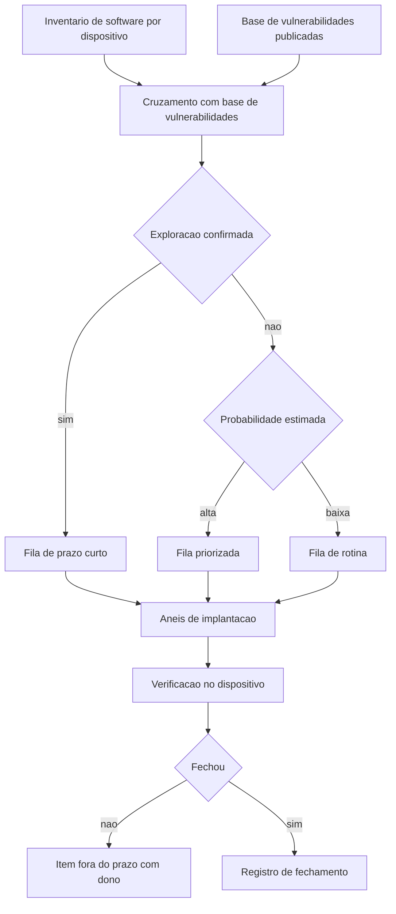

# Gestão de vulnerabilidades e patches no endpoint

Uma ideia central: correção no dispositivo é um ciclo de quatro etapas — identificar, priorizar, instalar e verificar — e o ciclo só fecha quando a verificação é feita no dispositivo, não na ferramenta que distribuiu o pacote.

## 1. Objetivo de aprendizagem

Ao final deste tema você deve conseguir: montar a fila de correção de um parque com critério de priorização declarado, anéis de implantação e evidência de verificação por item fechado, incluindo o tratamento explícito dos itens que ficam fora do prazo.

## 2. Pré-requisitos

O [TEMA-01](TEMA-01-endpoint-superficie-e-sensor.md) fornece o inventário sem o qual não existe fila. O [TEMA-02](TEMA-02-hardening-e-linhas-de-base.md) precisa vir antes porque a linha de base e o ciclo de patch compartilham o mesmo agente no dispositivo e disputam a mesma janela de manutenção.

## 3. Pré-teste

Responda de palpite, antes de ler o resto. Anote a confiança de 1 a 5.

1. Qual é o prazo que a sua empresa cumpre para corrigir uma vulnerabilidade crítica divulgada? Quem mediu esse prazo?
   Confiança: ___
2. A ferramenta de distribuição de atualização reporta sucesso em 98% das máquinas. Isso prova que o sistema foi corrigido?
   Confiança: ___
3. Quantos itens de correção crítica estão abertos há mais de 90 dias no seu parque?
   Confiança: ___

## 4. Caso real

O NIST publicou em abril de 2022 o SP 800-40 Rev. 4, sob o título Guide to Enterprise Patch Management Planning: Preventive Maintenance for Technology. O documento substitui a Rev. 3, de 22 de julho de 2013, e abre declarando um problema de linguagem, não de técnica: existe com frequência uma divisão entre donos de negócio e missão de um lado e a gestão de segurança e tecnologia do outro quanto ao valor de aplicar patch. A resposta do documento é reenquadrar a atividade como manutenção preventiva de tecnologia — custo de fazer negócio e parte necessária do que a organização precisa fazer para cumprir sua missão.

A mesma publicação dá a definição operacional do processo: identificar, priorizar, adquirir, instalar e verificar a instalação de patches, atualizações e upgrades em toda a organização. Cinco verbos, e o último é o que mais falta na prática. Adquirir e instalar são atividades com dono claro na infraestrutura. Verificar é a etapa que exige instrumentação no dispositivo.

Do lado da priorização, o FIRST mantém o EPSS, descrito como modelo de aprendizado de máquina orientado a dado que estima a probabilidade de um CVE publicado ser explorado em campo nos próximos 30 dias. O modelo publica uma probabilidade entre 0 e 1 com percentil de ranking, diariamente, para cada CVE, com acesso livre por arquivo CSV e por interface de programação. É um número sobre o futuro provável, e não sobre a gravidade do defeito.

A pergunta que o caso deixa aberta: por que a empresa corrige em ordem de nota de severidade quando existe uma estimativa publicada de probabilidade de exploração?

## 5. Conteúdo

### 5.1 Conceito

Vulnerabilidade no endpoint é uma condição de software, firmware ou configuração que pode ser explorada. Ela entra no parque por três portas: código do sistema operacional, software de terceiro instalado e componente embarcado que ninguém lembra que existe. A terceira porta é a que produz surpresa, porque o inventário de software costuma registrar apenas o que passou por processo de instalação gerenciada.

Patch é a correção publicada pelo fornecedor. Duas propriedades do patch escapam ao controle da organização: o fornecedor decide quando publicar e o fornecedor decide se continua suportando aquela versão. Quando o suporte termina, o ciclo de patch deixa de funcionar — não existe correção para publicar. A decisão passa a ser de substituição ou de isolamento, e nenhuma das duas se resolve com ferramenta de distribuição.

Priorização é onde o programa ganha ou perde credibilidade. Existem três sinais disponíveis e eles respondem a perguntas diferentes. A nota de severidade descreve o pior caso de um defeito técnico. A probabilidade de exploração estima a chance de alguém efetivamente usar aquele defeito nos próximos 30 dias. O catálogo de exploração em campo informa o que já foi usado contra organizações reais. Os três juntos ordenam a fila; qualquer um sozinho produz erro sistemático — severidade sem probabilidade gera fila longa de itens improváveis, e probabilidade sem severidade gera fila de itens baratos.

O NIST SP 800-40 Rev. 4 enquadra o ciclo como manutenção preventiva justamente para retirar a discussão do terreno de exceção. Manutenção preventiva tem orçamento recorrente, janela recorrente e métrica recorrente. Uma empresa que trata patch como projeto trata cada ciclo como negociação nova.

### 5.2 Como funciona

O ciclo começa pela identificação. É preciso cruzar três conjuntos: o inventário de software por dispositivo, a lista de componentes e versões daquele software e a base de vulnerabilidades publicadas. O produto desse cruzamento é uma lista de pares dispositivo e vulnerabilidade. Essa lista é grande, quase sempre maior do que a capacidade de correção, e por isso a etapa seguinte existe.

A priorização ordena os pares por três filtros aplicados em sequência. Primeiro, exploração confirmada em campo: se o item está no catálogo mantido pela CISA — que se descreve como fonte autoritativa de vulnerabilidades exploradas em campo, estabelecida pela Binding Operational Directive 22-01 — ele vai para o topo, com prazo curto. Segundo, probabilidade estimada de exploração, disponível diariamente para cada CVE. Terceiro, exposição do dispositivo: máquina com serviço exposto à internet, conta com privilégio ampliado ou dado sensível sobe na fila em relação a máquina isolada.

A instalação usa anéis. O primeiro anel é um conjunto pequeno e heterogêneo de máquinas, escolhido para representar as combinações de hardware e software do parque. O segundo anel é um grupo de voluntários ou de área de menor impacto. O terceiro anel é o restante, em ondas. O tempo entre anéis é o que converte um patch ruim em incidente em vinte máquinas, em vez de incidente em todas.

A verificação é a etapa que fecha o ciclo e a que exige mais cuidado. A ferramenta de distribuição reporta que o pacote foi entregue e instalado. O que prova a correção é o estado reportado pelo próprio dispositivo, obtido por agente que lê a versão do componente. Existem casos em que a instalação conclui, exige reinício e a máquina permanece em execução com o código antigo. Sem verificação no dispositivo, esses casos entram na estatística como sucesso.

### 5.3 Exemplo resolvido

Uma empresa tem 400 estações e 60 servidores. O ciclo mensal de correção trouxe 1.240 pares de dispositivo e vulnerabilidade. Seis passos.

Passo 1 — separar o que está em exploração confirmada. Cruzar a lista com o catálogo de vulnerabilidades exploradas em campo. Saem 14 pares, distribuídos em 9 dispositivos. Esses saem da fila normal e viram tarefa com prazo de dias.

Passo 2 — aplicar probabilidade estimada ao restante. Para cada CVE da lista, consultar a probabilidade de exploração publicada naquele dia e o percentil de ranking. Definir dois limites: probabilidade acima de um valor alto entra em fila priorizada; abaixo de um valor baixo fica em rotina. Os limites são decisão da organização e precisam estar escritos, senão cada analista usa o seu.

Passo 3 — ponderar exposição. Multiplicar a ordenação por contexto de dispositivo. Um item de probabilidade média em servidor com porta exposta passa à frente de um item de probabilidade média em estação sem dado sensível. Esse passo é o que dá utilidade ao inventário construído no TEMA-01.

Passo 4 — montar os anéis. Anel 1 com 12 máquinas que representam as combinações de hardware e software do parque. Anel 2 com 60 máquinas de duas áreas de apoio. Anel 3 com o restante, em três ondas semanais. Os itens de exploração confirmada seguem o mesmo caminho com tempo comprimido, e não pulam o anel 1.

Passo 5 — verificar no dispositivo. Trinta e seis horas depois de cada onda, coletar de cada máquina a versão do componente corrigido. Comparar com a versão publicada pelo fornecedor. As máquinas fora do esperado entram em lista de exceção com motivo: desligada, fora da rede, reinício pendente, instalação revertida.

Passo 6 — fechar o registro. Para cada item, guardar data de publicação, data de detecção, data de instalação e data de verificação. Quatro datas viram tempo de exposição. O item que não fechou dentro do prazo recebe dono nominal e novo prazo, e aparece na lista que sobe para o comitê.

O que o exercício entrega: um número de exposição por gravidade e um número de itens cronicamente fora do prazo. O segundo número é o que costuma surpreender. Ele quase sempre aponta para o mesmo punhado de máquinas, e a decisão sobre elas é de substituição ou isolamento, não de patch.

### 5.4 Problema de completar

Mesmo parque, ciclo seguinte. A ferramenta reportou 96% de sucesso na instalação. Cinco casos chegam à sua mesa. Complete a tabela e responda à pergunta final.

| Caso | Interpretação | Ação | Prazo |
|---|---|---|---|
| A instalação concluiu e o reinício foi adiado indefinidamente em 22 máquinas | ______ | ______ | ______ |
| Um fornecedor publicou a correção somente para a versão mais recente do produto, e o parque usa a anterior | ______ | ______ | ______ |
| A verificação no dispositivo mostra a versão antiga em 8 máquinas, e a ferramenta de distribuição reporta sucesso | ______ | ______ | ______ |
| O item está em exploração confirmada em campo segundo o catálogo de vulnerabilidades exploradas | ______ | ______ | ______ |
| A probabilidade estimada de exploração do item é baixa e a nota de severidade é alta | ______ | ______ | ______ |

Responda ainda: qual dos cinco casos exige decisão de arquitetura, e não de operação? Justifique em três linhas, indicando quem precisa assinar.

## 6. Por que isso importa para o CISO

Patch é a única atividade de segurança em que o resultado é auditável por amostragem simples: pegue dez máquinas ao acaso, leia a versão do componente, compare com a versão publicada pelo fornecedor. Nenhum controle do programa tem uma prova tão barata. Isso muda a conversa com auditor e com seguradora, porque a evidência pode ser reproduzida por terceiro.

O segundo efeito é de negociação interna. O SP 800-40 Rev. 4 registra que a resistência costuma vir de dono de negócio que enxerga janela de manutenção como parada de produção. Enquadrar a atividade como manutenção preventiva, com janela recorrente no calendário e não como pedido avulso, retira a discussão do campo da exceção. É uma mudança de embalagem com efeito real: orçamento recorrente é mais fácil de defender do que projeto anual.

O terceiro efeito é de priorização sob restrição. Sem critério escrito, a equipe corrige o que é fácil e reporta o que é bonito. Com critério escrito — exploração confirmada, probabilidade estimada, exposição do dispositivo — o CISO consegue justificar por que 200 itens de severidade máxima podem esperar e 9 itens de severidade média entram na fila de hoje. Essa justificativa é o que sustenta o número de aderência no comitê.

## 7. Aplicação prática

Escolha vinte CVEs que a sua equipe corrigiu no último trimestre. Para cada um, tente preencher quatro datas: publicação pelo fornecedor, detecção no inventário, instalação no dispositivo e verificação no dispositivo. Use chamado, ata de comitê ou mensagem de time; não precisa de ferramenta.

O resultado esperado é que as duas primeiras datas existam em quase todas as linhas e as duas últimas em poucas. Essa lacuna é o argumento para exigir verificação no dispositivo no próximo ciclo de ferramenta. Um segundo exercício, mais desconfortável: conte quantos itens abertos há mais de 90 dias e quantos estão concentrados em menos de dez máquinas.

## 8. Autoexplicação

Explique em três frases por que a nota de severidade sozinha não ordena fila de correção. Ligue ao seu ambiente: escolha um servidor com software descontinuado e descreva, sem consultar o fornecedor, qual seria o caminho de decisão se não existir mais correção publicada para aquela versão.

## 9. Erros comuns e equívocos

| Equívoco | Por que está errado | O que é correto |
|---|---|---|
| A ferramenta reportou sucesso, logo o item está corrigido | Instalação concluída com reinício pendente mantém o código antigo em execução | Verifique a versão do componente no próprio dispositivo |
| Severidade alta é prioridade alta | A nota descreve pior caso técnico e ignora a probabilidade de alguém explorar aquilo | Combine exploração confirmada, probabilidade estimada e exposição do dispositivo |
| Patch é projeto com data de término | Manutenção preventiva é recorrente, como revisão de elevador | Coloque janela recorrente no calendário e orçamento de base |
| Software descontinuado sai da conta quando sai do suporte | Sem correção publicada, o item nunca fecha por patch | Decida entre substituição, isolamento e aceite formal do risco |
| Instalar em todas as máquinas ao mesmo tempo é eficiência | Um patch defeituoso em todas as máquinas ao mesmo tempo vira incidente em todo o parque | Use anéis com intervalo entre ondas |
| O inventário de software instalado é suficiente | Componente embarcado e biblioteca de terceiro não aparecem nessa lista | Amplie o inventário por varredura de componentes no dispositivo |

## 10. Recuperação ativa

Responda tudo antes de abrir o gabarito.

1. Quais são as cinco etapas do processo de gestão de patch descritas pelo NIST SP 800-40 Rev. 4, e qual delas exige instrumentação no dispositivo?
2. O que o EPSS estima exatamente, com que horizonte temporal e com que frequência de atualização?
3. O que o catálogo de vulnerabilidades exploradas em campo mantido pela CISA representa, e por qual instrumento foi estabelecido?
4. Por que a verificação no dispositivo é indispensável mesmo quando a ferramenta de distribuição reporta sucesso?
5. Descreva os três filtros de priorização na ordem em que são aplicados e o que cada um resolve.

Conferir respostas

1. Identificar, priorizar, adquirir, instalar e verificar a instalação. A verificação é a etapa que exige instrumentação no dispositivo, porque só o próprio host pode reportar o estado da versão corrigida.
2. A probabilidade de um CVE publicado ser explorado em campo nos próximos 30 dias. O modelo publica um valor entre 0 e 1 com percentil de ranking, todos os dias, para cada CVE, com acesso livre por CSV e por interface de programação.
3. A relação de vulnerabilidades que foram efetivamente exploradas em campo, mantida como fonte autoritativa pela CISA e estabelecida pela Binding Operational Directive 22-01.
4. Porque a instalação pode concluir e o sistema continuar executando o código antigo até o reinício, e porque existem casos de reversão e de falha silenciosa. Só a leitura da versão no dispositivo separa instalação de correção.
5. Primeiro, exploração confirmada, que separa o que já está sendo usado de verdade; segundo, probabilidade estimada de exploração, que ordena o que ainda não foi usado por chance de uso; terceiro, exposição do dispositivo, que pondera a fila pelo valor e pela acessibilidade do alvo dentro do parque.

## 11. Revisão espaçada

| Intervalo | O que fazer | Se errar |
|---|---|---|
| D+1 | Listar de memória as cinco etapas do processo e os três filtros de priorização | Rebaixar: repetir em D+1 |
| D+7 | Preencher as quatro datas para dez CVEs do trimestre anterior | Rebaixar: repetir em D+3 |
| D+30 | Verificar por amostragem dez máquinas contra a versão publicada pelo fornecedor | Rebaixar: repetir em D+7 |

## 12. Conexões com outros temas

Leitura humana do `relacoes` do frontmatter — que é a fonte. Relações que saem desta área
também aparecem em [mapa-relacoes.md](../mapa-relacoes.md). Regras em
[templates/RELACOES-TEMAS.md](../templates/RELACOES-TEMAS.md).

| Relação | Alvo | Por que |
|---|---|---|
| aplicado_em | 12-vulnerabilidades-threat-intel#TEMA-06 | o tempo entre detecção e correção no parque é o insumo da métrica de exposição e dívida de remediação |
| complementa | 12-vulnerabilidades-threat-intel#TEMA-02 | CVSS, EPSS e o catálogo de exploração em campo são o critério de priorização que a janela de patch do endpoint executa |
| nao_confundir_com | 06-endpoint-plataforma#TEMA-02 | linha de base corrige configuração herdada da organização; patch corrige código publicado pelo fornecedor |

## 13. Certificações e leitura recomendada

| Certificação | Domínio coberto | Recurso | Tipo | Fonte |
|---|---|---|---|---|
| SC-200 | Operação de detecção e resposta sobre telemetria de endpoint, com vulnerabilidade e correção | Microsoft Defender Vulnerability Management | primaria | https://learn.microsoft.com/en-us/defender-endpoint/microsoft-defender-endpoint |
| GSEC | Controles de manutenção preventiva de sistema e de plataforma | NIST SP 800-40 Rev. 4 | primaria | https://csrc.nist.gov/pubs/sp/800/40/r4/final |

Leitura recomendada: [FIRST EPSS — metodologia e uso](https://www.first.org/epss/).

## 14. Fontes verificadas

| # | Título | Tipo | URL | Acessado em | Confiança |
|---|---|---|---|---|---|
| 1 | NIST SP 800-40 Rev. 4 — abril de 2022, substitui a Rev. 3 de 22/07/2013, DOI 10.6028/NIST.SP.800-40r4; ciclo de identificar, priorizar, adquirir, instalar e verificar | primaria | https://csrc.nist.gov/pubs/sp/800/40/r4/final | "2026-09-25" | alta |
| 2 | FIRST — EPSS, probabilidade de exploração em campo nos próximos 30 dias, publicada diariamente para cada CVE | primaria | https://www.first.org/epss/ | "2026-09-25" | alta |
| 3 | CISA — Known Exploited Vulnerabilities Catalog, estabelecido pela Binding Operational Directive 22-01 | primaria | https://www.cisa.gov/known-exploited-vulnerabilities-catalog | "2026-09-25" | media |
| 4 | NIST SP 800-61 Rev. 3 — abril de 2025, integração da resposta a incidente às atividades de gestão de risco do CSF 2.0 | primaria | https://csrc.nist.gov/pubs/sp/800/61/r3/final | "2026-09-25" | alta |

A página do catálogo de vulnerabilidades exploradas em campo não renderizou em duas tentativas de leitura direta nesta execução; a descrição citada veio do índice de busca do domínio cisa.gov, com confiança média. As datas-limite de correção previstas na Binding Operational Directive 22-01 não foram lidas e não são afirmadas aqui: NAO CONFIRMADO em fonte oficial.

---

| Navegação | |
|---|---|
| Área | [06 Segurança de endpoint e plataforma](./README.md) |
| Tema anterior | [TEMA-02](TEMA-02-hardening-e-linhas-de-base.md) |
| Próximo tema | [TEMA-04](TEMA-04-edr-xdr-e-resposta-no-host.md) |
| Home | [README](../README.md) |
