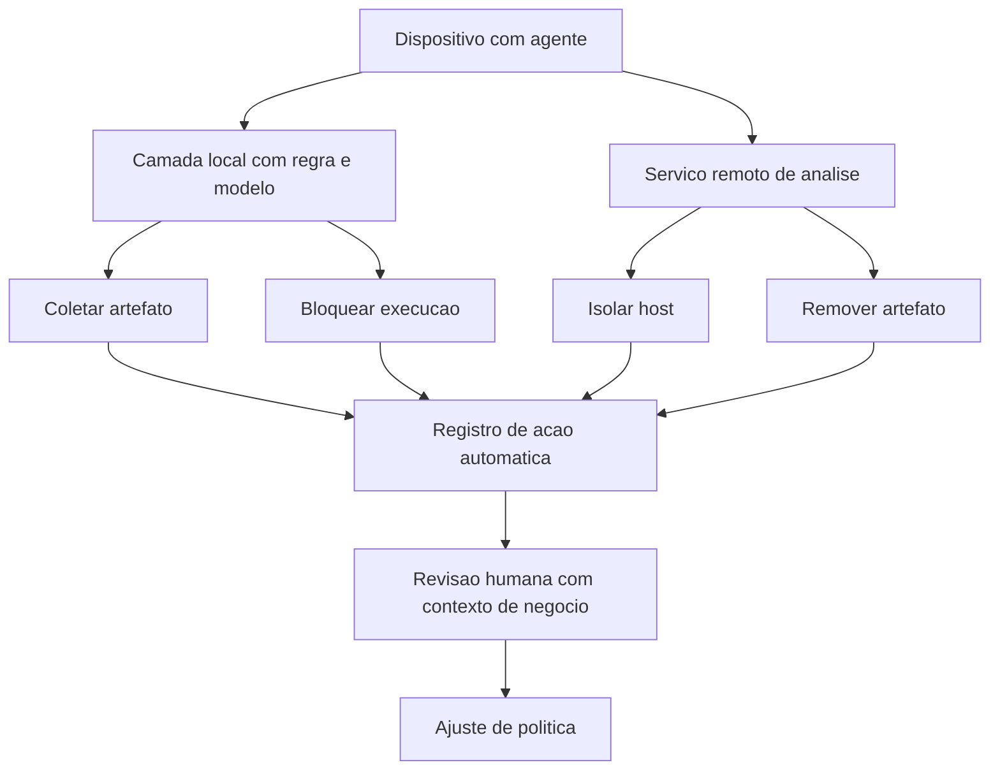

# EDR, XDR e resposta no host

Uma ideia central: o agente de endpoint é um ponto de decisão dentro do dispositivo, com prazo de milissegundos e sem humano na sala, e o que ele pode decidir sozinho é uma escolha da organização, escrita e registrada.

## 1. Objetivo de aprendizagem

Ao final deste tema você deve conseguir: definir o escopo de resposta concedido ao agente de endpoint, separando o que ele contém sozinho do que exige decisão humana, com o registro de cada ação automática e o critério de reversão.

## 2. Pré-requisitos

O [TEMA-01](TEMA-01-endpoint-superficie-e-sensor.md) vem antes porque a resposta no host depende da telemetria descrita lá. Sem evento de processo com contexto, a decisão automática do agente não tem em que se apoiar.

## 3. Pré-teste

Responda de palpite, antes de ler o resto. Anote a confiança de 1 a 5.

1. Quem descobre primeiro que uma máquina da sua empresa está comprometida: o antivírus, o plantão da madrugada ou o próprio usuário? Arrisque a ordem em que os três costumam aparecer.
   Confiança: ___
2. Se o agente de endpoint isolasse sozinho a máquina do diretor financeiro às 9h de uma segunda-feira, quanto tempo você estima até alguém reverter a decisão?
   Confiança: ___
3. De cada dez ações automáticas que o agente executa hoje, quantas alguém revisou depois? Se o número não existir, anote onde estaria a primeira pista.
   Confiança: ___

## 4. Caso real

A documentação da Microsoft para Defender for Endpoint descreve a plataforma como solução corporativa de segurança de endpoint voltada a prevenir, detectar, investigar e responder a ameaças avançadas em dispositivos. O alcance declarado de "endpoint" nessa página é mais largo do que a intuição sugere: a lista inclui laptops, telefones, tablets, computadores, pontos de acesso, roteadores e firewalls.

A parte que interessa ao argumento de XDR está duas frases abaixo. Segundo a documentação, a plataforma alimenta o portal unificado do Microsoft Defender com sinais de endpoint, e o portal correlaciona esses sinais com alertas de identidade, de e-mail e de cargas de trabalho em nuvem para formar visões completas de incidente. O texto da própria página usa o exemplo de rastrear um ataque do e-mail de phishing até o endpoint comprometido e daí até o movimento lateral, tudo em um lugar. É afirmação de fornecedor sobre produto — e o que ela registra é a razão de existir da categoria: a correlação entre domínios é o produto, e o agente é o fornecedor do insumo.

A mesma página lista as capacidades em um bloco: detecção e resposta em endpoint, proteção autônoma com interrupção automática de ataque, proteção de próxima geração com prevenção de ransomware, redução de superfície de ataque, gestão de vulnerabilidades e notificações de ataque em endpoint. Sistemas operacionais suportados incluem Windows, macOS, Linux, Android e iOS.

A pergunta que o caso deixa aberta: se a plataforma interrompe ataques sozinha, o que a organização precisa decidir — e o que ela deixa de ver quando não decide nada?

## 5. Conteúdo

### 5.1 Conceito

Endpoint detection and response é a categoria de produto que combina três coisas no mesmo agente: coleta contínua de eventos do sistema, análise que procura padrão de comportamento e capacidade de agir sobre o próprio dispositivo. A coleta contínua a distingue do antivírus tradicional, que examina arquivo em pontos discretos. A capacidade de agir a distingue de uma ferramenta de registro de evento, que só observa.

Extended detection and response é o mesmo raciocínio estendido para além do dispositivo, correlacionando sinais de endpoint com identidade, e-mail, rede e carga de trabalho em nuvem. A utilidade prática dessa correlação é reduzir o tempo de montar o episódio: em vez de cinco ferramentas com cinco linhas do tempo, uma linha do tempo com cinco fontes. O efeito colateral é de dependência: quanto mais a operação depende de correlação automática, mais grave fica a falha de uma das fontes.

Resposta no host é o conjunto de ações que o agente executa sobre o dispositivo. São quatro, em ordem crescente de impacto. Coletar o artefato para análise: baixo impacto, reversível. Bloquear a execução do arquivo ou do processo: reversível com ajuste de política. Isolar a máquina da rede mantendo o canal do agente: impacto operacional imediato, reversível. Remover ou restaurar arquivo e chave de registro: reversível apenas se houver cópia, e é a ação que destrói evidência.

Existe uma assimetria que o gestor precisa enxergar. A ação automática acontece com o contexto que o agente tem, e o agente só tem contexto local. Ele vê o processo e a linha de comando; não vê que aquela máquina está executando o fechamento contábil do mês nem que aquela conta de serviço é a que mantém a linha de produção em pé. A decisão de delegar contém, portanto, um componente de negócio que nenhum algoritmo do dispositivo conhece.

### 5.2 Como funciona

O agente coleta por gancho no núcleo do sistema operacional e envia evento para um serviço de análise que fica fora do dispositivo. A análise acontece em duas camadas. A camada local decide rápido, com regras e modelos que rodam na própria máquina, e é a que bloqueia arquivo em milissegundos. A camada remota decide devagar, com correlação entre máquinas e entre domínios, e é a que enxerga um adversário movendo pela rede. A separação existe porque latência e amplitude são objetivos em conflito.

A decisão sobre escopo passa por quatro perguntas, e cada uma tem resposta diferente por tipo de máquina. Qual ação o agente pode tomar sem aprovação. Qual exige aprovação de alguém disponível, e quanto tempo essa pessoa leva para responder. Qual exige aprovação do dono do serviço de negócio. Qual nunca é automática, em máquina nenhuma.

A quarta categoria existe e costuma ser esquecida. Existem dispositivos em que a perda de conectividade causa dano maior do que o incidente em curso — equipamento médico em uso em paciente, estação que controla processo industrial, servidor que sustenta comunicação de emergência. Para esses, a lista de ações automáticas é curta ou vazia, e a decisão é humana por desenho.

O registro fecha o desenho. Toda ação automática deixa rastro com cinco campos: horário, máquina, regra ou modelo que decidiu, ação executada e identificador do alerta correspondente. Sem esse registro, a organização não consegue responder à pergunta que aparece seis meses depois em auditoria: quantas máquinas esta política isolou, e alguém revisou cada caso.

### 5.3 Exemplo resolvido

Uma empresa com 400 estações e 60 servidores tem um agente com todas as ações automáticas ligadas. Uma parada de duas horas em um servidor de faturamento motivou a revisão. Cinco passos.

Passo 1 — inventariar as ações disponíveis no agente. Ler a documentação da versão instalada e listar cada ação de resposta, com a descrição do efeito e do modo de reverter. O resultado é uma lista de quatro a seis itens, e não de vinte.

Passo 2 — classificar as máquinas em três grupos. Grupo A, estações de trabalho com dado de baixa sensibilidade. Grupo B, servidores e estações com acesso a dado sensível. Grupo C, os dispositivos da quarta categoria: equipamento clínico, controlador de processo e qualquer máquina em que perder rede seja pior que o incidente.

Passo 3 — atribuir ações por grupo. No grupo A, coletar artefato e bloquear execução são automáticos; isolar exige aprovação do analista de plantão; remover nunca é automático. No grupo B, coletar é automático e as demais exigem aprovação. No grupo C, o agente apenas coleta e alerta, e toda ação é decisão humana.

Passo 4 — definir o tempo de aprovação e o caminho de escalonamento. Para cada ação que exige aprovação, escrever quem aprova em horário comercial e quem aprova fora dele, com um número de telefone. Ação que exige aprovação e não tem aprovador localizável às três da manhã é ação que não existe.

Passo 5 — revisar o registro semanalmente. Uma vez por semana, ler as ações automáticas do período e marcar cada uma como correta, incorreta ou duvidosa. Ação incorreta gera ajuste de política; ação duvidosa gera revisão de escopo. Esse passo é o que mantém o desenho vivo.

O que muda depois do exercício: o número de ações automáticas cai em quase toda organização, a quantidade de alertas revisados sobe e o tempo entre detecção e contenção fica mais honesto — porque passa a incluir o tempo de encontrar o aprovador.

### 5.4 Problema de completar

Mesma empresa, seis meses depois. Cinco situações chegam à revisão semanal. Complete a tabela e responda à pergunta final.

| Situação | Ação é adequada | Por quê | Que registro falta, se falta |
|---|---|---|---|
| O agente isolou sozinho uma estação de trabalho do grupo A às 2h da manhã | ______ | ______ | ______ |
| O agente removeu o arquivo detectado em uma estação do grupo A e a análise seguinte não tem o que examinar | ______ | ______ | ______ |
| O agente bloqueou a execução de um script assinado por fornecedor de sistema de negócio | ______ | ______ | ______ |
| O agente isolou um controlador de processo que pertence ao grupo C | ______ | ______ | ______ |
| O agente coletou artefato em um servidor do grupo B e ninguém abriu o caso por 48 horas | ______ | ______ | ______ |

Responda ainda: qual das cinco situações revela lacuna de desenho, e não de operação? Justifique em duas linhas, indicando o que muda na política.

## 6. Por que isso importa para o CISO

A resposta no host é a única parte do programa em que um algoritmo toma decisão com consequência de negócio em tempo real. Isso coloca três coisas na mesa do CISO, e todas as três são de governança.

A primeira é a delegação. Autorizar o agente a isolar máquina é transferir para o fornecedor e para o modelo uma decisão que a empresa assinava. A pergunta de auditoria é simples: existe registro de que essa delegação foi decidida, com escopo declarado e critério de revisão. Nos contratos e nos questionários de due diligence, esse item aparece sob o nome de gestão de ações automatizadas.

A segunda é a evidência. O NIST SP 800-61 Rev. 3, publicado em abril de 2025, integra as recomendações de resposta a incidente cibernético às atividades de gestão de risco descritas no NIST Cybersecurity Framework 2.0. A ação automática que apaga o artefato remove justamente o objeto que a fase de análise de incidente precisa. Sem regra explícita de coleta antes de remoção, o programa compra velocidade e paga em capacidade de explicar depois.

A terceira é a continuidade. Isolar máquina sem prazo de reversão definido é a forma mais rápida de produzir uma parada de produção com origem no próprio controle de segurança. O custo dessa parada entra na conversa com o dono do serviço, e o CISO precisa chegar nessa conversa com o escopo escrito antes de o evento acontecer, não depois.

## 7. Aplicação prática

Junte, na mesma sala, o responsável pelo agente de endpoint e o dono de um serviço crítico. Peça a lista das ações automáticas ligadas hoje e, para cada uma, faça a pergunta em voz alta: se esta ação disparar no seu serviço às três da manhã, o que acontece e quem você chama.

Marque as ações em que o dono do serviço não souber responder. Essas são as candidatas a sair do modo automático. Ao final da reunião, você tem uma lista curta de ações a revisar e, provavelmente, um aliado — porque a conversa deixou de ser sobre ferramenta de segurança e passou a ser sobre risco do serviço dele.

## 8. Autoexplicação

Explique em três frases por que a camada local do agente decide rápido e a camada remota decide devagar. Ligue ao seu ambiente: nomeie o dispositivo em que você não autorizaria nenhuma ação automática, e justifique a escolha em uma frase.

## 9. Erros comuns e equívocos

| Equívoco | Por que está errado | O que é correto |
|---|---|---|
| EDR é antivírus com nome novo | A diferença está na coleta contínua de evento e na capacidade de agir sobre o dispositivo | Trate como ponto de decisão com escopo definido, não como assinatura de arquivo |
| Ligar todas as ações automáticas é o estado desejado | Ação sem contexto de negócio contém dado legítimo em produção | Defina escopo por grupo de máquinas e por criticidade do serviço |
| Isolar a máquina é sempre a primeira ação | Isolamento interrompe serviço e pode custar mais que o incidente | Decida por tipo de dispositivo, com caminho de reversão declarado |
| Remover o artefato resolve o caso | A remoção apaga a evidência que a análise de incidente precisa | Colete antes de remover, e trate remoção como decisão humana |
| XDR elimina a necessidade de integrar fontes | A correlação depende das fontes; fonte ausente produz ponto cego silencioso | Meça a cobertura por fonte e por tipo de evento |
| Ação automática dispensa registro | Sem registro não existe revisão, e sem revisão a política não evolui | Registre horário, máquina, regra, ação e alerta de cada ação automática |

## 10. Recuperação ativa

Responda tudo antes de abrir o gabarito.

1. Quais são as três características que definem a categoria de detecção e resposta em endpoint, e qual delas a distingue do antivírus tradicional?
2. O que a documentação do fornecedor descreve como função do portal unificado na arquitetura de XDR?
3. Liste as quatro ações de resposta no host em ordem crescente de impacto e diga qual delas destrói evidência.
4. Quais são os quatro critérios usados para decidir se uma ação pode ser automática, e por que existe uma categoria de máquina em que nenhuma ação é automática?
5. Quais cinco campos o registro de ação automática precisa conter?

Conferir respostas

1. Coleta contínua de eventos do sistema, análise de comportamento e capacidade de agir sobre o próprio dispositivo. A coleta contínua é o que distingue do antivírus tradicional, que examina arquivo em pontos discretos.
2. Correlacionar os sinais do endpoint com alertas de identidade, de e-mail e de cargas de trabalho em nuvem, formando visões de incidente que permitem seguir o ataque de um e-mail de phishing até o endpoint comprometido e daí até o movimento lateral.
3. Coletar o artefato, bloquear a execução, isolar a máquina da rede mantendo o canal do agente, e remover ou restaurar arquivo e chave de registro. A remoção é a ação que destrói evidência.
4. Qual ação pode ocorrer sem aprovação; qual exige aprovação de alguém disponível e em quanto tempo; qual exige aprovação do dono do serviço de negócio; qual nunca é automática. A categoria de máquina existe para dispositivos em que perder conectividade causa dano maior que o incidente — equipamento em uso clínico, controle de processo e sistemas de emergência.
5. Horário, identificação da máquina, regra ou modelo que decidiu, ação executada e identificador do alerta correspondente.

## 11. Revisão espaçada

| Intervalo | O que fazer | Se errar |
|---|---|---|
| D+1 | Listar de memória as quatro ações de resposta e a ordem de impacto | Rebaixar: repetir em D+1 |
| D+7 | Revisar o registro de ações automáticas da semana e classificar cada uma | Rebaixar: repetir em D+3 |
| D+30 | Repetir a conversa da seção 7 com outro dono de serviço crítico | Rebaixar: repetir em D+7 |

## 12. Conexões com outros temas

Leitura humana do `relacoes` do frontmatter — que é a fonte. Relações que saem desta área
também aparecem em [mapa-relacoes.md](../mapa-relacoes.md). Regras em
[templates/RELACOES-TEMAS.md](../templates/RELACOES-TEMAS.md).

| Relação | Alvo | Por que |
|---|---|---|
| aplicado_em | 11-resposta-forense#TEMA-03 | isolar a máquina e remover o artefato é a contenção e a erradicação executadas no host |
| complementa | 06-endpoint-plataforma#TEMA-01 | o dispositivo só vira sensor quando o agente transforma o evento local em detecção investigável |
| complementa | 10-operacoes-soc#TEMA-04 | a resposta no host e a triagem do SOC são o mesmo incidente visto de dois lugares |

## 13. Certificações e leitura recomendada

| Certificação | Domínio coberto | Recurso | Tipo | Fonte |
|---|---|---|---|---|
| SC-200 | Operação de detecção e resposta sobre telemetria de endpoint e de nuvem | Microsoft Defender for Endpoint overview | primaria | https://learn.microsoft.com/en-us/defender-endpoint/microsoft-defender-endpoint |
| GSEC | Controles de segurança de sistema e de plataforma aplicados à resposta | NIST SP 800-61 Rev. 3 | primaria | https://csrc.nist.gov/pubs/sp/800/61/r3/final |

Leitura recomendada: [MITRE ATT&CK — Execution, tactic TA0002](https://attack.mitre.org/tactics/TA0002/).

## 14. Fontes verificadas

| # | Título | Tipo | URL | Acessado em | Confiança |
|---|---|---|---|---|---|
| 1 | Microsoft Learn — Microsoft Defender for Endpoint overview, atualizado em 28/07/2026; correlação de sinais de endpoint com identidade, e-mail e carga de trabalho | primaria | https://learn.microsoft.com/en-us/defender-endpoint/microsoft-defender-endpoint | "2026-09-25" | alta |
| 2 | NIST SP 800-61 Rev. 3 — abril de 2025, substitui a Rev. 2 de 06/08/2012, DOI 10.6028/NIST.SP.800-61r3 | primaria | https://csrc.nist.gov/pubs/sp/800/61/r3/final | "2026-09-25" | alta |
| 3 | MITRE ATT&CK — Execution, tactic TA0002, 20 técnicas, versão v19, modificado em 25/04/2025 | primaria | https://attack.mitre.org/tactics/TA0002/ | "2026-09-25" | alta |
| 4 | Microsoft Learn — Application Control for Windows, atualizado em 19/08/2026 | primaria | https://learn.microsoft.com/en-us/windows/security/application-security/application-control/app-control-for-business/appcontrol | "2026-09-25" | alta |

A página cita que a plataforma suporta um modelo zero trust e menciona nomes de recurso do produto, como interrupção automática de ataque e proteção preditiva, sem detalhar o mecanismo de cada um nesta leitura. O detalhamento técnico desses recursos ficou fora do escopo do tema: NAO CONFIRMADO em fonte oficial.

---

| Navegação | |
|---|---|
| Área | [06 Segurança de endpoint e plataforma](./README.md) |
| Tema anterior | [TEMA-03](TEMA-03-vulnerabilidades-e-patches-no-endpoint.md) |
| Próximo tema | [TEMA-05](TEMA-05-protecao-de-dados-no-endpoint-e-dlp.md) |
| Home | [README](../README.md) |
