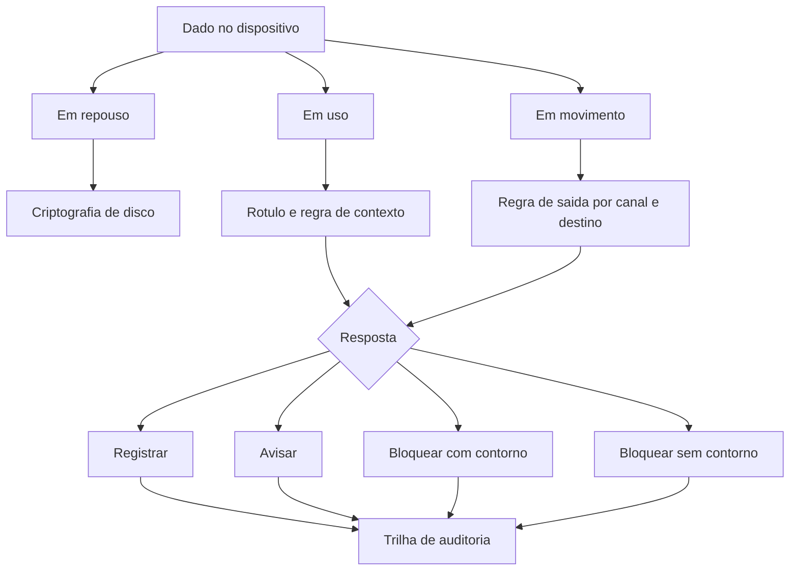

# Proteção de dados no endpoint e DLP

Uma ideia central: proteger dado no dispositivo exige duas camadas que resolvem problemas diferentes — tornar o dado ilegível onde ele repousa e decidir para onde ele pode ir — e a segunda só é aplicável sobre o que a primeira já classificou.

## 1. Objetivo de aprendizagem

Ao final deste tema você deve conseguir: escrever a política de proteção de dado no dispositivo separando criptografia de repouso, monitoramento e bloqueio de saída, com a base de classificação declarada para cada regra e o modo de implantação definido por fase.

## 2. Pré-requisitos

O [TEMA-01](TEMA-01-endpoint-superficie-e-sensor.md) fornece o inventário de dispositivos. O [TEMA-02](TEMA-02-hardening-e-linhas-de-base.md) precisa vir antes porque criptografia de disco e agente de política de saída são itens de linha de base, e um deles depende de módulo de segurança presente no hardware desde a fabricação.

## 3. Pré-teste

Responda de palpite, antes de ler o resto. Anote a confiança de 1 a 5.

1. Quantos notebooks da empresa estão com o disco criptografado hoje? Qual é a fonte desse número?
   Confiança: ___
2. Se alguém tentar copiar a base de clientes para um serviço de armazenamento pessoal em nuvem, o que acontece na sua empresa?
   Confiança: ___
3. Qual é a classificação formal de "dado de cliente" na sua organização, e quem decidiu essa classificação?
   Confiança: ___

## 4. Caso real

A documentação da Microsoft para prevenção de perda de dado descreve o mecanismo com uma frase que vale reter: a análise de conteúdo é profunda e não uma varredura simples de texto. A lista de métodos confirma isso — correspondência de palavra-chave, avaliação de expressão regular, validação por função interna, correspondência secundária em proximidade da correspondência primária e algoritmos de aprendizado de máquina.

A mesma página descreve o que a política pode fazer quando o conteúdo corresponde à regra. São cinco ações: mostrar aviso ao usuário alertando sobre a ação indevida; bloquear o compartilhamento e permitir que o usuário contorne o bloqueio registrando a justificativa; bloquear sem opção de contorno; trancar o item em repouso e movê-lo para local de quarentena; e suprimir a exibição do conteúdo em conversa de equipe. A segunda opção da lista é a que produz efeito cultural duradouro, porque transforma cada tentativa em uma explicação escrita do usuário.

Dois detalhes operacionais da mesma documentação merecem atenção de quem assina contrato de ferramenta. O primeiro é que as atividades monitoradas são gravadas por padrão no registro de auditoria e encaminhadas ao explorador de atividade; o segundo é que o ciclo de implantação recomendado passa por modo de simulação, em que as ações definidas na política não são aplicadas, antes de qualquer modo restritivo. A página também registra que as políticas passam a valer cerca de uma hora depois de ligadas.

A pergunta que o caso deixa aberta: se a ferramenta já sabe avaliar a política sem aplicá-la, por que quase toda implantação começa bloqueando?

## 5. Conteúdo

### 5.1 Conceito

Dado no dispositivo existe em três estados e cada um exige controle diferente. Em repouso, o dado está no disco e o risco é o acesso físico — notebook perdido, disco removido, máquina descartada sem apagar. Em uso, o dado está aberto na memória de uma aplicação e o risco é a captura de tela, o recorte para a área de transferência, o aplicativo não autorizado lendo o que não deveria. Em movimento, o dado sai do dispositivo e o risco é o destino — armazenamento pessoal, mensagem, cópia para meio removível.

Criptografia de disco resolve o repouso. Ela torna o conteúdo ilegível com o dispositivo desligado ou bloqueado, e não oferece proteção alguma com a sessão aberta. Isso a coloca na categoria de controle contra perda e roubo de equipamento, e não na categoria de controle contra usuário. Quem confunde as duas coisas reduz o programa a uma linha de configuração e chama isso de proteção de dado.

Prevenção de perda de dado endereça o dado em uso e em movimento. O mecanismo é sempre o mesmo: avaliar o conteúdo contra uma regra, e então escolher entre registrar, avisar, bloquear com contorno e bloquear sem contorno. A regra tem a forma "conteúdo de determinado tipo, saindo para determinado destino, por determinado canal". Sem as três partes, a regra gera barulho.

A camada que a maioria das organizações pula é a classificação. Uma regra de saída precisa saber o que é sensível, e existem duas formas de saber. A primeira é a classificação por conteúdo, em que a ferramenta procura padrão de dado na própria informação. A segunda é o rótulo, aplicado por quem cria ou por classificação automática, que viaja com o item. A segunda é mais precisa e mais difícil de manter; a primeira funciona sem depender de disciplina humana. Programas maduros usam as duas, com a primeira como rede de segurança da segunda.

### 5.2 Como funciona

A criptografia depende de um detalhe que se resolve na compra e não na configuração: o módulo de segurança presente no hardware e o processo de medição de integridade na inicialização. Máquina sem esse componente não oferece o mesmo nível de garantia, e a diferença precisa aparecer no inventário. A decisão prática da linha de base é dupla — habilitar a criptografia e guardar material de recuperação em local com controle de acesso separado do dispositivo.

A regra de saída se organiza por canal, e os canais são poucos: armazenamento removível, área de transferência, impressão, compartilhamento de rede, aplicação de nuvem não gerenciada e mensageria. Para cada canal, a organização escolhe o verbo. A escolha que produz resultado no primeiro mês é a combinação de registrar em todos os canais com bloquear em um ou dois, escolhidos pelo dano que causam. Meio removível e aplicação pessoal de armazenamento respondem pela maior parte do volume real.

O ciclo de implantação segue quatro fases. Na primeira, a política existe em modo de simulação e não aplica nada: o objetivo é medir volume e destino, e o produto é um relatório de onde o dado realmente anda. Na segunda, a política avisa o usuário sem bloquear, e o produto é o conjunto de justificativas escritas. Na terceira, uma regra de alto dano passa a bloquear sem contorno. Na quarta, o conjunto de regras é revisto com dado de uso real.

O volume é a variável que decide o ritmo. Uma política de bloqueio sobre um canal de alto tráfego gera milhares de eventos por dia e transforma a equipe de segurança em central de atendimento. O modo de simulação existe justamente para dar esse número antes da dor.

### 5.3 Exemplo resolvido

Uma empresa de serviços financeiros com 400 estações decide proteger dado de cliente no dispositivo. Cinco passos.

Passo 1 — medir o estado da criptografia. Contar, por modelo de equipamento, quantas máquinas têm criptografia de disco ativa e qual é o componente de hardware disponível em cada grupo. Separar as máquinas sem o componente. O resultado define duas ações: habilitar nas demais e decidir sobre o grupo restante.

Passo 2 — declarar a base de classificação. Antes de escrever qualquer regra, escrever a lista de categorias: dado de cliente, dado de colaborador, dado financeiro da empresa, dado de fornecedor, dado público. Para cada categoria, dizer quem a definiu e onde ela está registrada. Sem esse passo, cada regra de saída vira preferência de analista.

Passo 3 — ligar a política em modo de simulação. Medir por quatro semanas o que sairia do dispositivo e para onde. Registrar por canal, por destino e por categoria. O relatório típico mostra que a maior parte do tráfego legítimo está em dois ou três destinos de negócio que ninguém teria previsto.

Passo 4 — passar para o modo de aviso com registro de justificativa. Nesta fase nada é bloqueado e cada tentativa de saída produz uma frase escrita pelo usuário. O produto não é o bloqueio, é a lista de justificativas legítimas que a organização não conhecia. Essas justificativas viram exceção nomeada, e não exceção informal.

Passo 5 — bloquear uma regra por vez. Escolher o canal de maior dano e menor tráfego legítimo e bloqueá-lo sem opção de contorno. Manter todo o resto em aviso. Revisar em duas semanas o volume de eventos e a taxa de contorno. Só então repetir o processo com a regra seguinte.

O que o exercício entrega, ao fim de um trimestre: criptografia medida por modelo de equipamento, uma política com quatro fases documentadas, um conjunto de exceções nomeadas com o processo de negócio que as justifica e um número de eventos por canal que a equipe consegue tratar. O bloqueio é o último item da lista, e é o menor.

### 5.4 Problema de completar

Mesma empresa, primeiro mês de aviso. Cinco situações chegam à revisão. Complete a tabela e responda à pergunta final.

| Situação | Classificação | Resposta adequada | Justificativa aceitável |
|---|---|---|---|
| Analista financeiro envia planilha de conciliação por mensagem pessoal para trabalhar em casa | ______ | ______ | ______ |
| Equipe de vendas copia lista de contatos para serviço de armazenamento pessoal, afirmando ser o jeito combinado com a chefia | ______ | ______ | ______ |
| Suporte técnico imprime um relatório de chamado contendo nome e documento de cliente | ______ | ______ | ______ |
| Diretoria exporta apresentação de resultados para pendrive próprio antes da reunião de conselho | ______ | ______ | ______ |
| Desenvolvedor copia amostra de dado real de produção para ambiente de teste | ______ | ______ | ______ |

Responda ainda: qual das cinco situações revela lacuna de classificação e não de política de saída? Justifique em duas linhas, indicando a categoria que precisaria existir ou estar clara.

## 6. Por que isso importa para o CISO

A pergunta que o conselho e o regulador fazem sobre dado no dispositivo tem forma simples: onde está o dado e o que impede que ele saia. Criptografia de disco responde a primeira metade para o equipamento perdido. Política de saída responde a segunda metade para o usuário.

O efeito sobre notificação de incidente é direto. Um notebook roubado com disco criptografado e material de recuperação sob controle separado produz um incidente de disponibilidade. O mesmo notebook sem criptografia produz um incidente de confidencialidade, com obrigação de avaliação e possivelmente de comunicação a titulares e a autoridade. A diferença entre os dois casos é uma configuração, e é a configuração mais barata do programa.

Há um efeito de cultura que só aparece com a escolha do verbo. Bloquear sem contorno ensina que a organização não confia nas pessoas; registrar e avisar ensina onde está a linha; bloquear com justificativa escrita ensina as duas coisas e ainda produz o inventário de necessidades legítimas que a política não previa. Programas que começam bloqueando tudo costumam ser desligados em três meses por pressão de negócio, e o desligamento completo é pior que a ausência de política, porque encerra o assunto.

## 7. Aplicação prática

Pergunte ao time de infraestrutura qual é o processo de devolução de um notebook usado. Peça o documento, ou a ausência dele, e siga o caminho de uma máquina desde a saída até o descarte: quem apaga o disco, com que método, quem registra que o apagamento ocorreu, quem confere.

Esse exercício costuma revelar mais risco que a política de saída, porque o apagamento raramente é medido. O segundo exercício, mais direto: peça a lista de destinatários que mais recebem arquivos da empresa por mensagem e verifique quantos deles estão fora do domínio corporativo. Esse número decide se a primeira regra de bloqueio vale a pena neste trimestre.

## 8. Autoexplicação

Explique em três frases por que criptografia de disco não protege contra usuário. Ligue ao seu ambiente: escolha um conjunto de dado que a sua organização trata como sensível e descreva, em uma frase, o que aconteceria hoje se fosse copiado para um pendrive pessoal.

## 9. Erros comuns e equívocos

| Equívoco | Por que está errado | O que é correto |
|---|---|---|
| Criptografia de disco protege o dado em uso | Com a sessão aberta o sistema decifra para o usuário; a proteção vale para o equipamento desligado ou bloqueado | Trate criptografia como controle contra perda e roubo de equipamento |
| Classificação é etapa dispensável se a ferramenta detecta conteúdo | Detecção por conteúdo tem falso positivo e falso negativo e não cobre dado sem padrão reconhecível | Use rótulo e detecção por conteúdo em conjunto, com a segunda como rede de segurança |
| Bloquear tudo desde o primeiro dia é firmeza | Bloqueio sem medição prévia gera volume insustentável e a política acaba desligada | Comece em modo de simulação e avance uma regra por vez |
| Política de saída resolve o dado que sai por canal fora do dispositivo | Canal não coberto pela ferramenta permanece invisível | Cubra por canal e revise a lista de canais periodicamente |
| Apagar o disco é procedimento óbvio e sem risco | Sem método declarado e sem registro, o apagamento não é verificável | Defina método, responsável e evidência do descarte |
| Registro de auditoria é consequência automática da ferramenta | O registro existe, mas ninguém o lê nem o correlaciona com resposta | Coloque a leitura do registro na rotina semanal com critério definido |

## 10. Recuperação ativa

Responda tudo antes de abrir o gabarito.

1. Quais são os três estados do dado no dispositivo e qual controle endereça cada um?
2. Que tipo de análise a documentação do fornecedor descreve para identificar conteúdo sensível, e por que isso importa para o volume de falso positivo?
3. Liste as cinco ações de política de saída descritas pela documentação e diga qual delas produz inventário de necessidade legítima.
4. O que caracteriza o modo de simulação e por que ele precede qualquer modo restritivo?
5. Por que a classificação por rótulo e a classificação por conteúdo se complementam?

Conferir respostas

1. Em repouso, no disco, endereçado por criptografia de disco; em uso, na memória das aplicações, endereçado por rótulo e regra de contexto; em movimento, saindo do dispositivo, endereçado por regra de saída por canal e destino.
2. Análise profunda de conteúdo, com correspondência de palavra-chave, avaliação de expressão regular, validação por função interna, correspondência secundária em proximidade e algoritmos de aprendizado de máquina. Isso reduz o falso positivo típico da varredura simples de texto, mas não elimina nem o falso positivo nem o falso negativo.
3. Mostrar aviso ao usuário; bloquear com opção de contorno e registro de justificativa; bloquear sem opção de contorno; trancar o item em repouso e movê-lo para quarentena; suprimir a exibição do conteúdo em conversa de equipe. A segunda produz o inventário de necessidades legítimas, porque cada tentativa gera uma explicação escrita.
4. As ações definidas na política não são aplicadas; o objeto de medição é o volume e o destino do que sairia do dispositivo. Ele precede o modo restritivo porque o volume observado define o que a equipe consegue tratar.
5. Porque o rótulo é mais preciso e depende de disciplina na aplicação, enquanto a detecção por conteúdo funciona sem depender de comportamento humano e cobre o que ficou sem rótulo. A segunda cobre a falha da primeira.

## 11. Revisão espaçada

| Intervalo | O que fazer | Se errar |
|---|---|---|
| D+1 | Listar de memória os três estados do dado e os cinco verbos de política | Rebaixar: repetir em D+1 |
| D+7 | Ler o relatório de simulação e escolher a primeira regra a bloquear | Rebaixar: repetir em D+3 |
| D+30 | Revisar o processo de descarte de equipamento e conferir a evidência | Rebaixar: repetir em D+7 |

## 12. Conexões com outros temas

Leitura humana do `relacoes` do frontmatter — que é a fonte. Relações que saem desta área
também aparecem em [mapa-relacoes.md](../mapa-relacoes.md). Regras em
[templates/RELACOES-TEMAS.md](../templates/RELACOES-TEMAS.md).

| Relação | Alvo | Por que |
|---|---|---|
| aplicado_em | 14-dados-privacidade#TEMA-03 | retenção e descarte do dado no dispositivo são executados pelas ferramentas que aplicam o rótulo |
| complementa | 14-dados-privacidade#TEMA-02 | a política de saída só classifica o que a classificação de dado já declarou sensível |

## 13. Certificações e leitura recomendada

| Certificação | Domínio coberto | Recurso | Tipo | Fonte |
|---|---|---|---|---|
| SC-200 | Operação de detecção e resposta sobre telemetria de endpoint | Learn about data loss prevention | primaria | https://learn.microsoft.com/en-us/purview/dlp-learn-about-dlp |
| GSEC | Controles de proteção de dado em sistema e plataforma | NIST SP 800-128, gestão de configuração voltada a segurança | primaria | https://csrc.nist.gov/pubs/sp/800/128/final |

Leitura recomendada: [NIST SP 800-167 — Guide to Application Whitelisting](https://csrc.nist.gov/pubs/sp/800/167/final).

## 14. Fontes verificadas

| # | Título | Tipo | URL | Acessado em | Confiança |
|---|---|---|---|---|---|
| 1 | Microsoft Learn — Learn about data loss prevention, atualizado em 26/06/2026; análise profunda de conteúdo, cinco ações de política, ciclo com modo de simulação, registro em trilha de auditoria por padrão | primaria | https://learn.microsoft.com/en-us/purview/dlp-learn-about-dlp | "2026-09-25" | alta |
| 2 | NIST SP 800-167 — Guide to Application Whitelisting, outubro de 2015 | primaria | https://csrc.nist.gov/pubs/sp/800/167/final | "2026-09-25" | alta |
| 3 | NIST SP 800-128 — agosto de 2011, retirado em 10 de outubro de 2019 e substituído por SP 800-128 upd1 | primaria | https://csrc.nist.gov/pubs/sp/800/128/final | "2026-09-25" | alta |

O detalhamento do ciclo de vida de descarte de mídia e do método de apagamento não foi verificado em fonte primária nesta execução e não é afirmado no texto: NAO CONFIRMADO em fonte oficial.

---

| Navegação | |
|---|---|
| Área | [06 Segurança de endpoint e plataforma](./README.md) |
| Tema anterior | [TEMA-04](TEMA-04-edr-xdr-e-resposta-no-host.md) |
| Próximo tema | [TEMA-06](TEMA-06-servidores-e-cargas-de-trabalho.md) |
| Home | [README](../README.md) |
