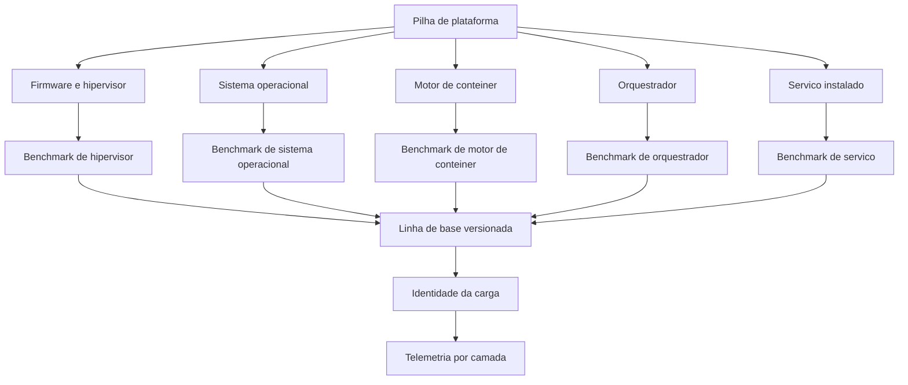

# Segurança de servidores e cargas de trabalho

Uma ideia central: o regime de servidor e de carga de trabalho é o mesmo regime do dispositivo — linha de base, correção e telemetria — com três premissas trocadas: não há pessoa na frente da tela, a superfície é serviço e não aplicativo, e a identidade que executa pertence à carga, não ao usuário.

## 1. Objetivo de aprendizagem

Ao final deste tema você deve conseguir: estender linha de base, ciclo de correção e telemetria a servidores e cargas de trabalho, justificando por escrito cada ponto em que o regime difere do usado em estações, com o dono de cada carga nomeado.

## 2. Pré-requisitos

O [TEMA-02](TEMA-02-hardening-e-linhas-de-base.md) fornece o método de linha de base, o [TEMA-03](TEMA-03-vulnerabilidades-e-patches-no-endpoint.md) o ciclo de correção e o [TEMA-04](TEMA-04-edr-xdr-e-resposta-no-host.md) o desenho de resposta. Este tema reaplica os três em contexto diferente.

## 3. Pré-teste

Responda de palpite, antes de ler o resto. Anote a confiança de 1 a 5.

1. Quantos servidores a empresa tem, e quantos deles executam serviço exposto à internet?
   Confiança: ___
2. Quem é o dono de cada servidor? Existe uma lista com nome e sobrenome?
   Confiança: ___
3. A carga de trabalho que roda em contêiner hoje receberia a mesma configuração de linha de base do servidor físico? Por quê?
   Confiança: ___

## 4. Caso real

A lista de CIS Benchmarks trata servidor e carga de trabalho como famílias separadas, com versões próprias. Entre as versões vigentes publicadas estão Microsoft Windows Server 2025 2.1.0, Microsoft Windows Server 2022 5.1.0, Red Hat Enterprise Linux 9 3.0.0, Ubuntu Linux 24.04 LTS 2.0.0, SUSE Linux Enterprise 16 1.0.0, VMware ESXi 8.0 1.4.0, Docker 1.8.0 e Kubernetes 2.0.1. Há também recortes por serviço, como Microsoft SQL Server 2022 1.3.0, PostgreSQL 18 1.0.0, NGINX 3.0.0 e Apache Tomcat 10.1 1.0.0.

Três observações caem dessa lista. A primeira é que o hipervisor virou família de benchmark: ESXi tem versão própria, o que confirma que a camada abaixo do sistema operacional também é superfície. A segunda é que o motor de contêiner tem benchmark próprio e o orquestrador tem outro, em versões distintas. A terceira é que serviço instalado tem benchmark próprio, separado do sistema operacional que o hospeda.

O MITRE ATT&CK reforça a terceira observação por outro caminho. Das 20 técnicas da tática Execution, várias tratam de execução em ambiente de carga de trabalho: Container Administration Command, que abusa de serviço de administração de contêiner como o daemon do Docker, o servidor de API do Kubernetes ou o kubelet; Deploy Container, que implanta contêiner para executar ou evadir, e cujo texto menciona a tentativa de escapar para o host; Container CLI/API como sub-técnica de interpretador de comando; Container Orchestration Job como sub-técnica de tarefa agendada; Cloud Administration Command, que abusa de serviço de gestão em nuvem para rodar comando dentro de máquina virtual; e ESXi Administration Command, que abusa de serviço de administração do hipervisor.

A pergunta que o caso deixa aberta: se cada camada tem benchmark próprio e cada camada tem técnica de execução própria, quem responde por cada camada na sua organização?

## 5. Conteúdo

### 5.1 Conceito

Servidor difere de estação em três aspectos que mudam o desenho, e não apenas o grau. O primeiro é a ausência de operador. Ninguém está na frente da máquina para receber um aviso de política, decidir sobre um alerta ou reiniciar depois de uma correção. Todo controle que dependa de decisão humana no dispositivo é inútil ali; a decisão precisa estar codificada antes. O segundo é que a superfície é serviço, e não aplicativo. Serviço escuta em porta, aceita entrada de rede e frequentemente existe para ser alcançado — o que muda o sentido de "reduzir superfície", porque não se trata de remover o serviço e sim de restringir quem alcança, com que credencial e com que versão.

O terceiro é a identidade. Em estação, quem executa é uma pessoa. Em servidor e em carga de trabalho, quem executa é uma conta de serviço, uma identidade gerenciada ou a identidade atribuída à carga pelo orquestrador. Essa identidade costuma ter permissão ampla, existir por anos e não passar por revisão de acesso, porque o processo de revisão foi desenhado para contas humanas. Toda técnica de execução em carga de trabalho depende de alcançar ou forjar essa identidade.

Carga de trabalho é o termo que cobre o que executa dentro dessas camadas: processo em máquina virtual, contêiner em nó de cluster, função sem servidor. Ela tem ciclo de vida mais curto que o servidor e é criada por declaração de configuração, não por instalação manual. Isso é vantagem e armadilha ao mesmo tempo. A vantagem é que a configuração pretendida está escrita em algum lugar e pode ser versionada. A armadilha é que a correção precisa chegar à imagem ou à declaração, e não ao processo em execução — corrigir a instância viva resolve até o próximo ciclo de recriação.

Firmware e hipervisor fecham a pilha. Máquina tem firmware com configuração própria, e o hipervisor sustenta todas as máquinas virtuais acima dele. Comprometer o hipervisor entrega todas as cargas hospedadas, e a lista de benchmarks trata isso como família separada por esse motivo.

### 5.2 Como funciona

O regime se estende por três decisões tomadas na mesma ordem do regime de estação, com uma diferença de ponto de aplicação em cada uma.

Linha de base: em estação, o ponto de aplicação é a imagem e depois a política contínua. Em servidor, o ponto é a automação de provisionamento, porque servidor não deve ser configurado à mão — a máquina precisa ser reproduzível a partir de declaração. Em carga de trabalho, o ponto é a imagem de contêiner e a definição de implantação. O benchmark de escolha segue a camada: sistema operacional, motor de contêiner, orquestrador e serviço, cada um com a sua versão.

Correção: em estação, o ciclo é por máquina e a janela é negociada com a pessoa que usa o equipamento. Em servidor, o ciclo é por grupo de serviço, e o que se negocia é a janela com o dono do serviço. Em carga de trabalho, o ciclo correto é reconstruir a partir da imagem corrigida, e o número que importa não é quantas máquinas receberam o pacote e sim quantas cargas em execução usam a imagem na versão corrigida. O SP 800-40 Rev. 4 mantém a mesma exigência de verificação da instalação; a mudança está em onde se verifica.

Telemetria: em estação, o agente observa processo iniciado por pessoa. Em servidor, o agente precisa observar também a alteração de configuração e a criação de tarefa de sistema, porque o ataque que se instala ali vive de persistência. Em carga de trabalho, a telemetria tem de vir de duas fontes — o agente no nó, que enxerga o motor de contêiner, e o registro de auditoria do orquestrador, que enxerga quem criou o quê. A segunda fonte é a que registra a identidade que executou a ação.

O dono é a decisão organizacional sem a qual as três anteriores degradam. Toda carga de trabalho precisa de um dono nomeado, com serviço de negócio associado e canal de contato. Sem isso, a janela de correção não tem com quem ser negociada, o alerta não tem para quem escalar e a carga órfã vive até alguém desligar a máquina por acidente.

### 5.3 Exemplo resolvido

Uma empresa tem 60 servidores virtuais e 14 cargas em contêiner em um cluster. Nenhuma das duas frotas tem regime próprio. Seis passos.

Passo 1 — montar o inventário por camada. Listar hipervisor, sistema operacional, motor de contêiner, orquestrador e serviços instalados. Para cada servidor, anotar os serviços que escutam em porta e quais deles são alcançáveis de fora da rede interna. Para cada carga, anotar a imagem, a versão e a identidade que ela usa.

Passo 2 — nomear dono. Para cada carga e cada servidor, escrever o nome da pessoa responsável e o serviço de negócio que depende dela. Os itens sem dono vão para uma lista separada — e essa lista é o primeiro produto do exercício, porque carga sem dono não recebe correção.

Passo 3 — escolher benchmarks por camada. Windows Server 2022 5.1.0 para os servidores Windows, Red Hat Enterprise Linux 9 3.0.0 para os Linux, Kubernetes 2.0.1 para o orquestrador, Docker 1.8.0 para o motor. Registrar as versões escolhidas e a data. A escolha por camada evita o erro comum de aplicar benchmark de sistema operacional e considerar o cluster coberto.

Passo 4 — aplicar na automação, não na máquina. A linha de base entra no processo de provisionamento dos servidores e na definição de implantação das cargas. Servidor cuja configuração foi ajustada à mão é marcado como divergente e recriado. Isso exige que o time aceite destruir e recriar máquina, o que é decisão de maturidade, não de ferramenta.

Passo 5 — corrigir por reconstrução. Para as cargas, o ciclo de correção passa a publicar imagem nova e substituir as instâncias em ondas. A métrica de aderência deixa de ser percentual de pacote instalado e passa a ser percentual de cargas em execução sobre a imagem na versão corrente.

Passo 6 — ligar a segunda fonte de telemetria. Habilitar o registro de auditoria do orquestrador e enviá-lo para o mesmo destino do agente do nó. O objetivo é conseguir responder, para qualquer criação de carga, qual identidade executou e a partir de onde.

O que o exercício entrega: um inventário por camada, uma lista de cargas órfãs, quatro versões de benchmark declaradas, uma métrica de aderência por imagem e uma fonte de telemetria que registra identidade. A lista de cargas órfãs costuma ser o item mais desconfortável e o mais útil.

### 5.4 Problema de completar

Mesma empresa, três meses depois. Cinco situações chegam à revisão. Complete a tabela e responda à pergunta final.

| Situação | Camada | Ação | Quem decide |
|---|---|---|---|
| Um servidor foi corrigido à mão no mês passado e o processo de provisionamento não tem o ajuste | ______ | ______ | ______ |
| Uma carga roda imagem de seis meses atrás porque a atualização quebra um teste | ______ | ______ | ______ |
| O agente do nó não enxerga quem criou a carga; a identidade está apenas no registro do orquestrador | ______ | ______ | ______ |
| Um serviço de banco de dados escuta em porta alcançável de fora da rede interna | ______ | ______ | ______ |
| Ninguém sabe quem responde por uma carga que processa relatórios noturnos | ______ | ______ | ______ |

Responda ainda: das cinco situações, qual exige decisão fora da área de segurança e por quê? Justifique em três linhas, indicando o que a área de segurança pode entregar sem essa decisão.

## 6. Por que isso importa para o CISO

Servidor e carga de trabalho concentram o dado. A estação é a porta de entrada mais comum; o servidor é onde o dado está e onde a parada dói. Um programa de endpoint que cobre apenas estações cobre a maioria dos dispositivos e uma minoria do risco.

O efeito sobre a conversa de continuidade é direto. A janela de correção de servidor é uma decisão sobre tempo de indisponibilidade, e portanto sobre receita. Levar essa decisão sem o dono nomeado do serviço significa discutir com a TI em vez de discutir com o negócio — e a TI não pode aceitar parada de produção. Nomear dono por carga é o que transforma a conversa de "segurança pede janela" em "o dono do serviço aceita este risco e este prazo".

Há um efeito de contrato e de atribuição de responsabilidade. Quando a carga roda em nuvem ou em cluster de terceiro, a fronteira entre o que a empresa corrige e o que o provedor corrige é o que determina a quem cabe a falha. Essa fronteira está declarada no modelo de responsabilidade compartilhada, e a área 08 a trata em detalhe. O CISO precisa dessa linha escrita para não assumir, em contrato, correção que não controla.

## 7. Aplicação prática

Escolha os cinco servidores mais críticos da empresa e faça uma pergunta simples ao time de infraestrutura: qual é o benchmark de configuração aplicado a eles, e em que versão. Anote a resposta literal de cada um.

Depois, escolha uma carga em contêiner e peça a imagem e a versão que está em execução agora. Compare com a última imagem publicada. A distância entre as duas versões é o tempo que a empresa leva para corrigir aquela carga. Com cinco respostas e uma distância, você tem material suficiente para justificar o próximo ciclo de trabalho sem comprar nada.

## 8. Autoexplicação

Explique em três frases por que corrigir a instância em execução não resolve o problema de uma carga de trabalho. Ligue ao seu ambiente: nomeie um servidor cuja configuração você não consegue reproduzir a partir de uma declaração, e diga o que isso impede.

## 9. Erros comuns e equívocos

| Equívoco | Por que está errado | O que é correto |
|---|---|---|
| Servidor é estação com mais memória | Não há operador para decidir, a superfície é serviço e a identidade que executa pertence à carga | Trate como regime próprio, com decisão codificada antes do evento |
| Aplicar o benchmark do sistema operacional cobre a carga | Motor de contêiner, orquestrador, hipervisor e serviço têm benchmarks próprios em versões distintas | Escolha um benchmark por camada e declare as versões |
| Corrigir o processo em execução resolve | A instância é recriada a partir da imagem antiga no próximo ciclo | Corrija a imagem e substitua as instâncias |
| Configurar servidor à mão e depois documentar | Documentação posterior diverge do estado real e a máquina deixa de ser reproduzível | Automatize o provisionamento e recrie a máquina divergente |
| Telemetria do nó cobre o que acontece na carga | Quem criou a carga e com qual identidade aparece no registro do orquestrador | Combine agente no nó com registro de auditoria do orquestrador |
| Carga sem dono é assunto administrativo | Sem dono não existe negociação de janela, escalonamento de alerta nem decisão de desligamento | Nomeie dono por carga antes de prometer prazo de correção |

## 10. Recuperação ativa

Responda tudo antes de abrir o gabarito.

1. Quais são os três aspectos em que servidor difere de estação, e por que o primeiro deles inviabiliza controle que dependa de decisão humana no dispositivo?
2. Quais camadas da pilha têm benchmark publicado próprio, segundo a lista verificada neste tema?
3. Por que a correção em carga de trabalho deve ocorrer na imagem e não na instância, e qual métrica de aderência corresponde a essa escolha?
4. Quais são as duas fontes de telemetria de uma carga em contêiner e o que cada uma responde?
5. Por que carga de trabalho sem dono nomeado inviabiliza o ciclo de correção?

Conferir respostas

1. Ausência de operador, superfície composta de serviço em vez de aplicativo e identidade pertencente à carga em vez de à pessoa. Sem operador, nenhum controle que espere uma decisão no momento do evento funciona, porque não há quem decida; a decisão tem de estar codificada na linha de base e na política antes.
2. Hipervisor, sistema operacional, motor de contêiner, orquestrador e serviço instalado. A lista verificada traz versões para VMware ESXi, Microsoft Windows Server, Red Hat Enterprise Linux, Ubuntu, SUSE Linux Enterprise, Docker, Kubernetes, Microsoft SQL Server, PostgreSQL, NGINX e Apache Tomcat.
3. Porque a instância tem ciclo de vida curto e é recriada a partir da imagem no próximo ciclo, o que desfaz a correção feita no processo em execução. A métrica correspondente é o percentual de cargas em execução sobre a imagem na versão corrente.
4. O agente no nó, que enxerga o motor de contêiner e o comportamento do processo, e o registro de auditoria do orquestrador, que responde quem criou a carga, quando e com qual identidade.
5. Porque a janela de correção precisa ser negociada com quem responde pelo serviço, o alerta precisa de destinatário e o desligamento de carga órfã precisa de decisão. Sem dono, o item entra na fila e nunca sai dela.

## 11. Revisão espaçada

| Intervalo | O que fazer | Se errar |
|---|---|---|
| D+1 | Listar de memória as camadas com benchmark próprio | Rebaixar: repetir em D+1 |
| D+7 | Levantar as versões de benchmark aplicadas nos cinco servidores mais críticos | Rebaixar: repetir em D+3 |
| D+30 | Comparar a imagem em execução com a última publicada em cinco cargas | Rebaixar: repetir em D+7 |

## 12. Conexões com outros temas

Leitura humana do `relacoes` do frontmatter — que é a fonte. Relações que saem desta área
também aparecem em [mapa-relacoes.md](../mapa-relacoes.md). Regras em
[templates/RELACOES-TEMAS.md](../templates/RELACOES-TEMAS.md).

| Relação | Alvo | Por que |
|---|---|---|
| aplicado_em | 08-cloud#TEMA-01 | o modelo de responsabilidade compartilhada define até onde a correção do servidor e da imagem é sua |
| complementa | 08-cloud#TEMA-04 | a carga endurecida no host é a mesma que roda como contêiner ou instância em nuvem, com o mesmo problema de superfície |

## 13. Certificações e leitura recomendada

| Certificação | Domínio coberto | Recurso | Tipo | Fonte |
|---|---|---|---|---|
| SC-200 | Operação de detecção e resposta sobre telemetria de servidor e de carga em nuvem | Microsoft Defender for Endpoint for servers | primaria | https://learn.microsoft.com/en-us/defender-endpoint/microsoft-defender-endpoint |
| GSEC | Controles de configuração segura de servidor e de plataforma | NIST SP 800-128, foco em gestão de configuração voltada a segurança | primaria | https://csrc.nist.gov/pubs/sp/800/128/final |

Leitura recomendada: [CIS Benchmarks List, seções de Kubernetes, Docker, VMware ESXi e sistemas servidores](https://www.cisecurity.org/cis-benchmarks).

## 14. Fontes verificadas

| # | Título | Tipo | URL | Acessado em | Confiança |
|---|---|---|---|---|---|
| 1 | CIS Benchmarks List — versões 2.1.0 do Windows Server 2025, 5.1.0 do Windows Server 2022, 3.0.0 do RHEL 9, 2.0.0 do Ubuntu Linux 24.04 LTS, 1.0.0 do SUSE Linux Enterprise 16, 1.4.0 do VMware ESXi 8.0, 1.8.0 do Docker e 2.0.1 do Kubernetes | primaria | https://www.cisecurity.org/cis-benchmarks | "2026-09-25" | alta |
| 2 | MITRE ATT&CK — Execution, tactic TA0002; Container Administration Command, Deploy Container, Container CLI/API, Container Orchestration Job, Cloud Administration Command e ESXi Administration Command | primaria | https://attack.mitre.org/tactics/TA0002/ | "2026-09-25" | alta |
| 3 | NIST SP 800-128 — agosto de 2011, retirado em 10 de outubro de 2019 e substituído por SP 800-128 upd1; objetivo de gerenciar e monitorar configurações para segurança adequada com funcionalidade de negócio | primaria | https://csrc.nist.gov/pubs/sp/800/128/final | "2026-09-25" | alta |
| 4 | NIST SP 800-40 Rev. 4 — abril de 2022; verificação da instalação como etapa do processo de gestão de patch | primaria | https://csrc.nist.gov/pubs/sp/800/40/r4/final | "2026-09-25" | alta |

Números de versão de benchmark citados correspondem às versões vigentes publicadas na data de acesso e mudam a cada ciclo de atualização do CIS: confirmar a versão antes de citar em ata. O texto da sub-técnica Escape to Host foi mencionado na descrição da técnica Deploy Container na página consultada e não foi lido em página própria nesta execução: NAO CONFIRMADO em fonte oficial.

---

| Navegação | |
|---|---|
| Área | [06 Segurança de endpoint e plataforma](./README.md) |
| Tema anterior | [TEMA-05](TEMA-05-protecao-de-dados-no-endpoint-e-dlp.md) |
| Home | [README](../README.md) |
