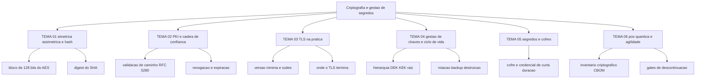

# Criptografia e gestão de segredos

Criptografia é o único controle que continua funcionando quando o perímetro, o firewall e a senha já falharam. O FIPS 197 especifica três instâncias do Rijndael — AES-128, AES-192 e AES-256 — e informa que todas transformam dados em blocos de 128 bits, com o sufixo indicando o tamanho da chave. Três números em uma frase, e os três números errados com mais frequência em questionário de fornecedor.

Esta área cobre o que decide se a proteção é real: qual algoritmo serve para qual finalidade, como um certificado prova a identidade de uma máquina, o que uma configuração de TLS aceita e recusa, quem consegue exportar a chave, onde vive o segredo de aplicação e o que fazer com um algoritmo que tem data de descontinuação.

## 1. Introdução

### 1.1 O que é esta área

Criptografia cobre quatro famílias de mecanismo: cifra simétrica, cifra assimétrica, função de hash e derivação de chave. Gestão de segredos cobre o material que essas famílias consomem — chaves, certificados, credenciais — e o ciclo de vida dele: geração, custódia, uso, rotação, backup, revogação e destruição.

Fica fora desta área a decisão de quem pode acessar o quê (área 04), a segmentação que contém o movimento lateral (área 05), a implementação de validação de entrada (área 09) e a obrigação legal de notificar incidente (área 11). Aqui se decide o material criptográfico e a política que o governa.

### 1.2 Por que isso importa para o CISO

Criptografia é o item de controle onde a distância entre o que a organização afirma e o que ela faz é maior. A frase "os dados são cifrados com AES-256" chega ao questionário do cliente, ao contrato e ao relatório de auditoria; raramente chega acompanhada de quem gera a chave, onde ela fica, quem consegue exportá-la e o que acontece quando o funcionário que a operava sai da empresa.

O FIPS 197 resolve uma parte do problema e cria outra: os três tamanhos de chave convivem, e a escolha entre eles é irrelevante se a chave de 256 bits estiver em um arquivo de configuração lido por qualquer pessoa com acesso ao servidor. O NIST SP 800-57 Part 1 Rev. 5 é a referência geral de gestão de material de chaveamento, e a página de gestão de chaves do CSRC registra que uma revisão 6 desse mesmo documento entrou em rascunho público inicial em 5 de dezembro de 2025, com comentários até 5 de fevereiro de 2026. Uma política de chaves que cita só a versão de um documento envelhece junto com ela.

### 1.3 O que você será capaz de fazer ao final

- Classificar qualquer operação criptográfica do seu ambiente como simétrica, assimétrica ou hash, dizendo o que ela prova e o que ela não prova.
- Reconstruir a cadeia de confiança de um certificado até a âncora e nomear em qual elo ela pode quebrar.
- Auditar a configuração de TLS de um serviço com critério verificável, decidindo entre aceitar, corrigir e tratar como emergência.
- Escrever o ciclo de vida de uma chave com dono e evidência por etapa, e o procedimento de resposta a comprometimento.
- Inventariar segredos de aplicação, classificá-los e definir prazo de validade para cada tipo.
- Montar um plano de migração pós-quântica com gates datados, priorizado pelo tempo de retenção do dado.

### 1.4 Os temas desta área, em prosa

[TEMA-01](TEMA-01-simetrica-assimetrica-hashing.md) separa as três famílias pelo que cada uma prova, e trata os dois nomes que quase todo mundo confunde: tamanho de chave e tamanho de bloco. [TEMA-02](TEMA-02-pki-certificados-cadeia-confianca.md) abre o certificado por dentro e mostra a validação de caminho, a revogação e o que uma autoridade certificadora não garante. [TEMA-03](TEMA-03-tls-na-pratica.md) leva o certificado para o protocolo: versão mínima, suites, onde o TLS termina e o que o handshake autentica.

[TEMA-04](TEMA-04-gestao-chaves-ciclo-vida.md) trata a hierarquia de chaves, a custódia em módulo validado e o que a destruição de uma chave faz com o dado que ela protegia. [TEMA-05](TEMA-05-gestao-segredos-cofres.md) trata os segredos de aplicação — credenciais que autenticam uma identidade — e o cofre que os entrega com prazo. [TEMA-06](TEMA-06-pos-quantica-agilidade-criptografica.md) trata o que fazer quando o algoritmo vence: inventário criptográfico, migração híbrida e gates de descontinuação.

## 2. Objetivos de aprendizagem (terminais)

| # | Objetivo | Bloom | Temas que o sustentam |
|---|---|---|---|
| 1 | Distinguir cifra simétrica, cifra assimétrica e função de hash pelo que cada uma prova e pelo que cada uma não prova, com um uso correto e um uso indevido por família | entender | TEMA-01 |
| 2 | Explicar a cadeia de confiança de um certificado até a âncora, nomeando três causas de quebra do caminho de validação e a evidência que expõe cada uma | entender | TEMA-02 |
| 3 | Avaliar a configuração de TLS de um serviço real contra critério verificável de versão, suite, cadeia e validade, classificando o resultado em aceitável, corrigir ou emergência | avaliar | TEMA-03 |
| 4 | Escrever o ciclo de vida de uma chave — geração, custódia, uso, rotação, backup, destruição e resposta a comprometimento — com dono e evidência por etapa | aplicar | TEMA-04, TEMA-05 |
| 5 | Montar um plano de migração pós-quântica com inventário criptográfico, prioridade por tempo de retenção do dado e gates de descontinuação datados | criar | TEMA-06 |

## 3. Diagrama dos tópicos

## 4. Temas

| # | tema_id | Tema | Nível | Tempo |
|---|---|---|---|---|
| 1 | TEMA-01 | Simétrica, assimétrica e hashing | base | 35-45 min |
| 2 | TEMA-02 | PKI, certificados e cadeia de confiança | intermediario | 35-45 min |
| 3 | TEMA-03 | TLS na prática | intermediario | 30-40 min |
| 4 | TEMA-04 | Gestão de chaves e ciclo de vida | avancado | 40-50 min |
| 5 | TEMA-05 | Gestão de segredos e cofres | intermediario | 30-40 min |
| 6 | TEMA-06 | Criptografia pós-quântica e agilidade criptográfica | intermediario | 35-45 min |

## 5. Pré-requisitos e sequência

| Antes | Esta área | Depois |
|---|---|---|
| [01 Fundamentos](../01-fundamentos/README.md), [02 Governança, risco e compliance](../02-governanca-risco-compliance/README.md) | [07 Criptografia e gestão de segredos](./README.md) | [05 Rede e infraestrutura](../05-rede-infraestrutura/README.md), [08 Cloud](../08-cloud/README.md), [09 Aplicações e DevSecOps](../09-aplicacoes-devsecops/README.md), [11 Resposta, forense e resiliência](../11-resposta-forense/README.md) |

Dentro da área, a ordem que rende mais é TEMA-01, TEMA-02, TEMA-03, TEMA-04, TEMA-05 e TEMA-06. O TEMA-04 pode ser lido antes do TEMA-03 sem prejuízo para quem já opera cofre ou HSM.

## 6. Certificações desta área

| Certificação | Sigla | O que cobre aqui |
|---|---|---|
| ISC2 Certified Information Systems Security Professional | CISSP (D3) | TEMA-01 a TEMA-06 — o outline vigente tem 8 domínios, contagem registrada no repositório; o nome e o número do domínio que trata criptografia não foram conferidos nesta execução, portanto NAO CONFIRMADO em fonte oficial |

Ver: [90-certificacoes/](../90-certificacoes/README.md).

## 7. Conexões com outras áreas

Relações de saída dos temas desta área que apontam para fora dela, agregadas do frontmatter
`relacoes`. A visão consolidada está em [mapa-relacoes.md](../mapa-relacoes.md); as regras, em
[templates/RELACOES-TEMAS.md](../templates/RELACOES-TEMAS.md). Alvos marcados como pendentes
ainda não foram escritos.

| Tema daqui | Relação | Destino | Por que |
|---|---|---|---|
| TEMA-01 | complementa | 04-identidade-acesso#TEMA-01 | o segundo fator por chave pública só se explica pela mecânica assimétrica, e a autenticação decide o que essa chave prova |
| TEMA-02 | aplicado_em | 03-arquitetura-engenharia#TEMA-05 | escolher cifra e emissor de certificado é requisito não funcional de arquitetura, com critério de aceite verificável |
| TEMA-03 | complementa | 05-rede-infraestrutura#TEMA-04 | o mesmo protocolo visto pela rede e visto pelo material criptográfico que ele apresenta; um tema fecha o outro |
| TEMA-04 | complementa | 08-cloud#TEMA-05 | cifrar dado em nuvem depende de quem detém a chave e do ciclo de vida dela, e a décima segunda pergunta do fornecedor é quem consegue exportá-la |
| TEMA-05 | nao_confundir_com | 04-identidade-acesso#TEMA-05 | cofre de credencial humana privilegiada não substitui o cofre de segredo de aplicação, e o dono do acesso é diferente em cada caso |
| TEMA-06 | aplicado_em | 09-aplicacoes-devsecops#TEMA-05 | o inventário criptográfico é o mesmo tipo de artefato que o inventário de dependências, e é alimentado pelo mesmo pipeline |
| TEMA-06 | nao_confundir_com | 12-vulnerabilidades-threat-intel#TEMA-02 | prazo de descontinuação de algoritmo é decisão de padrão com data, e não pontuação de vulnerabilidade explorada no momento |

## 8. Atividades práticas e laboratórios

| # | Atividade | O que a prática demonstra | Pré-requisito técnico |
|---|---|---|---|
| 1 | Listar as primitivas criptográficas citadas na documentação de três sistemas internos e classificá-las por família | existe inventário parcial e existe ponto cego | nenhum |
| 2 | Inventariar certificados com emissor público, dono, data de expiração e forma de renovação | renovação manual é risco de indisponibilidade, não item de conformidade | acesso ao inventário de serviços |
| 3 | Rodar verificação de cadeia e versão de protocolo em cinco endpoints internos e classificar cada achado | configuração herdada sobrevive anos sem revisão | acesso à rede interna |
| 4 | Escrever a matriz de chaves de um sistema: quem gera, onde guarda, quem exporta, quando roda, como destrói | a pergunta de auditoria tem resposta nominal | nenhum |
| 5 | Levantar os segredos de uma pipeline de CI/CD e marcar quais são de longa duração | segredo estático em pipeline é caminho de entrada provável | acesso ao repositório |

## 9. Checkpoint da área

Itens retirados dos temas, em ordem diferente da ordem de estudo.

1. Por que uma chave de dados é cifrada por uma chave de chave em vez de ser guardada em claro?
2. Por que o tempo de retenção do dado define a urgência da migração pós-quântica?
3. Qual é a diferença entre tamanho de chave e tamanho de bloco no AES, e qual dos dois aparece no nome AES-256?
4. Por que a sessão anterior continua protegida quando a chave privada do servidor vaza depois?
5. Qual é a diferença entre um segredo de aplicação e a chave que cifra um dado?
6. O que uma função de hash prova e o que ela não prova?

Conferir respostas e critério

1. Porque a chave de dados em claro no mesmo lugar que o dado elimina a proteção: quem lê o armazenamento lê a chave. A chave de chave fica em custódia separada, com acesso auditado e possibilidade de destruição em massa.
2. Porque existe coleta de tráfego cifrado hoje para decifrar quando houver computador quântico suficiente. Dado que precisa sobreviver a essa janela corre risco agora; dado que expira em semanas não corre.
3. O bloco do AES é de 128 bits nas três instâncias; o sufixo do nome indica o tamanho da chave. AES-256 tem bloco de 128 bits e chave de 256 bits.
4. Porque a chave de sessão é derivada de um segredo efêmero do handshake, não da chave privada do servidor. A chave privada assina e autentica; ela não decifra a sessão já estabelecida.
5. O segredo de aplicação autentica uma identidade perante um serviço. A chave cifra ou assina dado. Quando o mesmo material faz as duas coisas, o escopo de exposição dobra.
6. Prova que duas cópias do mesmo conteúdo produzem o mesmo resultado, o que detecta alteração. Não prova autoria, não cifra e não esconde conteúdo de quem tem a mensagem e a função.

Critério para seguir adiante: acertar 5 das 6 sem consultar os temas.

## 10. Termos desta área

Termos que o glossário central deve conter, com a definição vivendo em `glossario.md`.

- cifra simétrica e cifra assimétrica
- tamanho de chave e tamanho de bloco
- função de hash, digest e colisão
- derivação de chave
- certificado, cadeia de confiança e âncora de confiança
- validação de caminho
- revogação e lista de revogação
- autoridade certificadora e autoridade de registro
- TLS, handshake e suite de cifra
- sigilo encaminhado
- hierarquia de chaves: DEK, KEK e chave raiz
- módulo criptográfico validado (FIPS 140-3)
- segredo de aplicação, cofre e credencial de curta duração
- criptografia pós-quântica, KEM e assinatura pós-quântica
- agilidade criptográfica e inventário criptográfico (CBOM)

## 11. Fontes verificadas

| # | Título | Tipo | URL | Acessado em | Confiança |
|---|---|---|---|---|---|
| 1 | FIPS 197, AES — três instâncias do Rijndael, sufixo indica o tamanho da chave e o bloco é de 128 bits nos três casos | primaria | https://csrc.nist.gov/pubs/fips/197/final | "2026-09-25" | alta |
| 2 | FIPS 180-4, Secure Hash Standard — especifica SHA-1, SHA-224, SHA-256, SHA-384, SHA-512, SHA-512/224 e SHA-512/256, funções de hash iterativas e unidirecionais que produzem um resumo | primaria | https://nvlpubs.nist.gov/nistpubs/FIPS/NIST.FIPS.180-4.pdf | "2026-09-25" | alta |
| 3 | SP 800-57 Part 1 Rev. 5 — orientação geral e boas práticas de gestão de material de chaveamento, definições dos serviços de segurança, algoritmos e tipos de chave e a proteção de cada tipo | primaria | https://csrc.nist.gov/pubs/sp/800/57/pt1/r5/final | "2026-09-25" | alta |
| 4 | Página de gestão de chaves do CSRC — rascunho público inicial do SP 800-57 Part 1 Rev. 6 em 05/12/2025, comentários até 05/02/2026 | primaria | https://csrc.nist.gov/Projects/Key-Management/Key-Management-Guidelines | "2026-09-25" | alta |
| 5 | SP 800-52 Rev. 2 — exige TLS 1.2 com suites de cifra de base FIPS em todos os servidores e clientes TLS do governo e exige suporte a TLS 1.3 até 1º de janeiro de 2024 | primaria | https://csrc.nist.gov/pubs/sp/800/52/r2/final | "2026-09-25" | alta |
| 6 | SP 800-131A Rev. 2 — orientação específica para transição a chaves mais fortes e algoritmos mais fortes, complementando o SP 800-57 Part 1 | primaria | https://csrc.nist.gov/pubs/sp/800/131/a/r2/final | "2026-09-25" | alta |
| 7 | FIPS 140-3 — quatro níveis crescentes e qualitativos de segurança para módulos criptográficos | primaria | https://csrc.nist.gov/pubs/fips/140-3/final | "2026-09-25" | alta |
| 8 | CMVP — valida módulos criptográficos contra o FIPS 140-3 desde 22/09/2020; submissões sob o FIPS 140-2 aceitas até 31/03/2022 | primaria | https://csrc.nist.gov/Projects/Cryptographic-Module-Validation-Program | "2026-09-25" | alta |
| 9 | RFC 8446 — especifica a versão 1.3 do TLS, obsolesce os RFCs 5077, 5246 e 6961, atualiza os RFCs 5705 e 6066 e especifica novos requisitos para implementações de TLS 1.2 | primaria | https://www.rfc-editor.org/info/rfc8446/ | "2026-09-25" | alta |
| 10 | RFC 5280, de maio de 2008 — perfil de certificado e CRL X.509, formato da CRL v2 e algoritmo de validação de caminho de certificação | primaria | https://www.rfc-editor.org/info/rfc5280/ | "2026-09-25" | alta |
| 11 | RFC 8555, de março de 2019 — protocolo ACME para automação da gestão de certificados X.509 | primaria | https://www.rfc-editor.org/rfc/rfc8555.html | "2026-09-25" | alta |
| 12 | NIST IR 8547, rascunho público inicial — identifica os padrões vulneráveis ao computador quântico e os padrões resistentes para os quais produtos e serviços terão de migrar | primaria | https://csrc.nist.gov/pubs/ir/8547/ipd | "2026-09-25" | alta |
| 13 | Página do projeto de criptografia pós-quântica do NIST — o NIST vai descontinuar e por fim remover algoritmos vulneráveis ao computador quântico de seus padrões até 2035, com sistemas de risco alto migrando bem antes | primaria | https://csrc.nist.gov/projects/post-quantum-cryptography | "2026-09-25" | alta |
| 14 | FIPS 203 — padrão de mecanismo de encapsulamento de chave baseado em retículo modular; um KEM estabelece chave secreta compartilhada por canal público, usável depois com algoritmos simétricos | primaria | https://csrc.nist.gov/pubs/fips/203/final | "2026-09-25" | alta |
| 15 | FIPS 204 — padrão de assinatura digital baseado em retículo modular, o ML-DSA, para aplicações que exigem assinatura digital | primaria | https://nvlpubs.nist.gov/nistpubs/FIPS/NIST.FIPS.204.pdf | "2026-09-25" | alta |
| 16 | Comunicado do NIST — o Secretário de Comércio aprovou três padrões federais de criptografia pós-quântica, FIPS 203, 204 e 205, publicados em 2024 | primaria | https://csrc.nist.gov/News/2024/postquantum-cryptography-fips-approved | "2026-09-25" | alta |
| 17 | CycloneDX, guia autoritativo de CBOM — CBOM é um modelo de objeto para descrever ativos criptográficos e suas dependências, com suporte no CycloneDX v1.6 e superiores; o CycloneDX é padrão Ecma, publicado como ECMA-424 | primaria | https://cyclonedx.org/guides/OWASP_CycloneDX-Authoritative-Guide-to-CBOM-en.pdf | "2026-09-25" | alta |
| 18 | OWASP Secrets Management Cheat Sheet — solução centralizada de gestão de segredos ajuda a implementar as políticas, e uma política organizacional de gestão de segredos ajuda a aplicá-las | primaria | https://cheatsheetseries.owasp.org/cheatsheets/Secrets_Management_Cheat_Sheet.html | "2026-09-25" | alta |
| 19 | CA/Browser Forum — mantém os Baseline Requirements do grupo de trabalho de servidores, requisitos seguidos por emissores de certificado TLS publicamente confiáveis; os limites numéricos de validade vigentes não foram lidos nessa fonte nesta execução | primaria | https://cabforum.org/working-groups/server/baseline-requirements/ | "2026-09-25" | media |

Itens normativos não afirmados nesta área por falta de verificação: a tabela de equivalência entre tamanho de chave simétrica e assimétrica do SP 800-57 Part 1; a tabela por algoritmo de aceitável, descontinuado e proibido do SP 800-131A Rev. 2; a lista de modos de operação aprovados das publicações SP 800-38; os limites numéricos de validade de certificado do CA/Browser Forum; e a relação de títulos de domínio de CISSP e de Security+. Todos marcados como NAO CONFIRMADO em fonte oficial nos temas.

---

| Navegação | |
|---|---|
| Anterior | [05 Segurança de rede e infraestrutura](../05-rede-infraestrutura/README.md) |
| Próximo | [08 Segurança em cloud](../08-cloud/README.md) |
| Home | [README](../README.md) |
