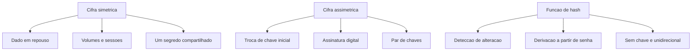

# Simétrica, assimétrica e hashing

Uma ideia central: cada família criptográfica prova uma coisa diferente, e o erro que causa incidente é usar uma família esperando a garantia de outra.

## 1. Objetivo de aprendizagem

Ao final deste tema você deve conseguir: classificar seis operações criptográficas de um ambiente real como cifra simétrica, cifra assimétrica ou função de hash, dizendo para cada uma o que ela prova e o que ela não prova.

## 2. Pré-requisitos

Nada. Este é o primeiro tema da área. Ele pressupõe apenas os objetivos de confidencialidade e integridade da [01 Fundamentos](../01-fundamentos/README.md).

## 3. Pré-teste

Responda de palpite, antes de ler o resto. Anote a confiança de 1 a 5.

1. Liste de cabeça as primitivas criptográficas que você já viu em contrato, questionário de cliente ou ata de comitê. Quantas delas você classificaria sem hesitar?
   Confiança: ___
2. Um fornecedor responde que usa AES-256 e SHA-256. O que você acha que essa frase garante sobre o dado dele em repouso?
   Confiança: ___
3. Onde você aposta que está o material criptográfico mais exposto da sua empresa: no banco de dados, no arquivo de configuração ou no backup?
   Confiança: ___

## 4. Caso real

O FIPS 197 resolve, em uma frase, duas confusões que aparecem juntas em questionário de fornecedor: "This Standard specifies three instantiations of Rijndael: AES-128, AES-192, and AES-256, where the suffix indicates the bit length of the key. The block size is 128 bits in each case." Três algoritmos com tamanhos de chave diferentes processam blocos do mesmo tamanho.

A segunda confusão é a de família. O mesmo padrão trata de cifra de bloco; o FIPS 180-4 trata de outra coisa, e lista sete funções de hash — SHA-1, SHA-224, SHA-256, SHA-384, SHA-512, SHA-512/224 e SHA-512/256 — descritas no próprio documento como funções de hash iterativas e unidirecionais que produzem a partir de uma mensagem uma representação condensada chamada resumo. Nem o hash cifra, nem a cifra gera resumo.

A pergunta que o caso deixa aberta: se o bloco é igual nos três tamanhos de chave, o que exatamente a organização compra quando sobe de AES-128 para AES-256?

## 5. Conteúdo

### 5.1 Conceito

Cifra simétrica usa o mesmo material de chave para cifrar e decifrar. O ganho é desempenho: ela processa volume, e por isso protege dado em repouso e a sessão de dado em trânsito. O custo aparece na distribuição: duas partes precisam do mesmo segredo antes de conversar, e cada par adicional multiplica o número de segredos a administrar. O FIPS 197 define a cifra de bloco que domina esse espaço, com bloco fixo de 128 bits e três tamanhos de chave.

Cifra assimétrica usa um par de chaves matematicamente ligadas, uma publicável e outra guardada. Ela resolve o que a simétrica não resolve — duas partes que nunca se viram estabelecem um segredo comum por canal público, e uma delas pode assinar algo que qualquer outra verifica com a chave pública. O preço é o custo computacional e o tamanho das chaves, o que a empurra para a abertura de sessão e para a assinatura, não para o volume.

Função de hash não usa chave. Ela recebe uma entrada de qualquer tamanho e devolve um resumo de tamanho fixo, e o faz de forma unidirecional e iterativa, conforme o FIPS 180-4 descreve para as sete funções que especifica. A propriedade útil é a de detecção: qualquer alteração na entrada muda o resumo. A propriedade ausente é a de sigilo: quem tem a mensagem calcula o resumo.

O erro de classificação é o que gera incidente. Tratar hash como cifra leva a "proteger" dado sensível com um resumo reversível por dicionário. Tratar assinatura como cifra leva a achar que o conteúdo está escondido quando ele está apenas autenticado. Tratar cifra simétrica como prova de autoria leva a aceitar mensagem forjada por quem compartilha a mesma chave.

### 5.2 Como funciona

Cifra de bloco processa exatamente um bloco por vez: no AES, 128 bits, conforme o FIPS 197. Cifrar um arquivo exige um modo de operação, que encadeia blocos e define o que acontece com dado que não preenche o último bloco. Modo de operação define também se a saída é apenas confidencial ou confidencial e autenticada. A lista de modos aprovados pertence às publicações NIST SP 800-38, que não foram lidas nesta execução — a escolha de modo é decisão de projeto que exige consulta a essa fonte, e não pode ser resolvida por analogia.

Cifra assimétrica se organiza em duas operações distintas. Na troca de chave, as partes combinam um segredo efêmero e derivam uma chave simétrica, que passa a proteger o volume da conversa. Na assinatura, a chave privada produz um valor que a chave pública verifica, e o que se verifica é o resumo da mensagem. Como o resumo tem tamanho fixo e menor que a mensagem, a assinatura cobre o resumo e herda a resistência a colisão da função escolhida.

Hash não ganha resistência por tamanho de chave, porque não tem chave. Ele ganha por tamanho de saída e por maturidade do projeto: o nome da função carrega o tamanho do resumo, e o FIPS 180-4 lista as funções com o tamanho no próprio nome. Um segundo uso do hash em segurança é a derivação de chave a partir de material com pouca entropia, como senha humana, e nesse uso o que importa é o custo de cálculo, não apenas o tamanho da saída.

### 5.3 Exemplo resolvido

Um hospital precisa proteger o prontuário de um paciente que trafega entre três sistemas. Cinco exigências chegam juntas. O trabalho é resolver cada uma com a família correta e dizer o que cada escolha prova.

Exigência 1, o arquivo do prontuário em repouso não pode ser lido por quem tem acesso ao disco. Resposta: cifra simétrica, com chave de 256 bits gerada e custodiada fora do servidor de banco. O que prova: sem a chave, o conteúdo é ilegível. O que não prova: que o conteúdo não foi alterado, e que a chave não vazou junto com o backup.

Exigência 2, o sistema precisa encontrar o paciente por número de registro. Resposta: o valor pesquisável não pode ser o texto cifrado, porque cifra não preserva ordem nem igualdade. Aqui entra um índice derivado — valor de busca calculado a partir do número de registro com um segredo. O que prova: igualdade sem expor o valor. O que não prova: que o índice não é alvo de ataque por força bruta, se o conjunto de números de registro for pequeno e previsível.

Exigência 3, o sistema A precisa garantir ao sistema B que a mensagem veio dele. Resposta: assinatura assimétrica sobre o resumo da mensagem. O que prova: origem e integridade perante quem tem a chave pública de A. O que não prova: sigilo do conteúdo, que segue em claro se não houver canal ou envelope cifrado.

Exigência 4, a senha do operador não pode ser recuperada nem pelo administrador. Resposta: hash com custo de cálculo calibrado, com valor por usuário. O que prova: o sistema nunca precisa guardar a senha, e a comparação é feita sobre o resumo. O que não prova: resistência a senha fraca, porque um espaço pequeno de senhas é testável offline contra um resumo roubado.

Exigência 5, o log de auditoria precisa ser confiável depois de gravado. Resposta: encadeamento por hash entre registros, com o ponto de ancoragem assinado periodicamente. O que prova: alteração de um registro antigo quebra o encadeamento. O que não prova: que o ponto de ancoragem está fora do alcance de quem administra o sistema — se ele estiver no mesmo cofre de acesso, a garantia é interna apenas.

### 5.4 Problema de completar

O mesmo hospital quer expor uma API de resultados de exame para o aplicativo do paciente. Complete a última coluna e a decisão de família.

| Necessidade | Família | Mecanismo | O que prova | O que não prova | Erro típico a evitar |
|---|---|---|---|---|---|
| API só aceita chamada do aplicativo oficial | ______ | ______ | ______ | ______ | ______ |
| Resposta não é lida por quem intercepta a conexão | ______ | ______ | ______ | ______ | ______ |
| Paciente não consegue ler o exame de outro | ______ | ______ | ______ | ______ | ______ |
| Exame antigo não pode ser trocado no banco | ______ | ______ | ______ | ______ | ______ |

Responda ainda em três linhas: qual das quatro necessidades não se resolve com criptografia, e por qual controle ela é resolvida?

## 6. Por que isso importa para o CISO

A frase "usamos AES-256" responde a uma pergunta e esconde quatro. Ela não informa quem gera a chave, onde ela mora, quem consegue exportá-la e o que acontece com o dado quando a chave é destruída. O FIPS 197 garante que existe um algoritmo padronizado com bloco de 128 bits e três tamanhos de chave; ele não garante nada sobre a custódia.

O efeito prático aparece em verba e em risco aceito. Trocar AES-128 por AES-256 em um sistema cujo maior furo é uma chave em arquivo de configuração custa migração e não reduz risco percebido. Colocar a mesma chave em módulo validado, com acesso nominal e registro de uso, reduz risco e às vezes custa menos.

Há também o efeito de inventário. O NIST SP 800-57 Part 1 Rev. 5 é a orientação geral de gestão de material de chaveamento, incluindo definições dos serviços de segurança que a criptografia pode prover, os algoritmos e tipos de chave que podem ser empregados e a proteção de cada tipo. Ler esse documento é o caminho para substituir "temos criptografia" por uma lista de serviços, algoritmos e tipos de chave com dono. O SP 800-131A Rev. 2 complementa o SP 800-57 Part 1 com orientação específica de transição para chaves mais fortes e algoritmos mais fortes — é a referência para decidir quando um algoritmo antigo sai de operação, ainda que a tabela por algoritmo desse documento não tenha sido lida nesta execução, portanto NAO CONFIRMADO em fonte oficial.

## 7. Aplicação prática

Pegue a documentação ou a tela de configuração de três sistemas internos e liste toda primitiva criptográfica citada. Para cada uma, escreva a família, o que ela protege, quem detém o material correspondente e o que aconteceria se esse material virasse público hoje.

Depois marque as linhas em que você não conseguiu preencher "quem detém o material". A quantidade dessas linhas é sua dívida de inventário criptográfico, e ela é o número que o [TEMA-06](TEMA-06-pos-quantica-agilidade-criptografica.md) vai usar como ponto de partida.

## 8. Autoexplicação

Explique em três frases por que um hash de senha não é cifra de senha. Conecte ao seu ambiente: qual sistema da sua organização guarda segredo em arquivo de configuração lido pela aplicação, e quem consegue ler esse arquivo hoje?

## 9. Erros comuns e equívocos

| Equívoco | Por que está errado | O que é correto |
|---|---|---|
| Hash é um tipo de cifra fraca | Hash não tem chave e não é reversível por projeto; cifra é reversível com a chave | Classifique hash como função de integridade, e use cifra quando precisar reaver o conteúdo |
| AES-256 tem bloco de 256 bits | O bloco é de 128 bits nas três instâncias; o sufixo indica a chave | Separe os dois números ao escrever requisito ou questionário |
| Cifrar com a chave privada é assinar | Cifra com chave privada é operação sem garantia de autoria no uso comum; assinatura tem construção própria e é verificada por qualquer um | Use assinatura para autoria e integridade, e cifra com chave pública para sigilo |
| Hash sem chave prova autoria | Quem tem a mensagem recalcula o resumo e pode substituí-lo | Autoria exige material secreto ou chave privada |
| Chave maior resolve qualquer risco | Tamanho de chave não cobre custódia, modo de operação nem exposição do endpoint | Trate chave, modo e custódia como itens separados do plano |
| Qualquer modo do AES entrega autenticação | O modo define se a saída tem apenas confidencialidade ou também autenticação | Consulte a publicação de modos do NIST antes de escolher; a lista não foi conferida nesta execução, portanto NAO CONFIRMADO em fonte oficial |

## 10. Recuperação ativa

Responda tudo antes de abrir o gabarito.

1. Qual é a diferença entre tamanho de chave e tamanho de bloco no AES, e qual dos dois aparece no nome AES-256?
2. O que uma função de hash prova e o que ela não prova?
3. Por que duas partes que nunca se viram conseguem chegar à mesma chave simétrica por canal público?
4. Por que um resumo de tamanho pequeno deixa de servir para assinatura depois que alguém encontra duas mensagens diferentes com o mesmo resumo?
5. Que problema um índice de busca derivado por hash com segredo resolve, e o que ele expõe?
6. Por que "cifrei com a chave privada" não é assinatura, e o que a assinatura prova que a operação de cifra não prova?

Conferir respostas

1. O bloco é o tamanho da unidade processada pelo algoritmo e vale 128 bits nas três instâncias do AES; a chave é o material secreto e tem 128, 192 ou 256 bits. O sufixo do nome AES-256 indica o tamanho da chave.
2. Prova que o conteúdo não foi alterado sem que o resumo mudasse — detecção de alteração. Não prova autoria, não esconde o conteúdo, e não impede que alguém recalcule o resumo de uma mensagem modificada.
3. Porque a troca de chave assimétrica permite combinar um segredo efêmero usando chave pública e chave privada; o segredo derivado dali protege a sessão, e o volume da conversa passa a ser protegido por cifra simétrica.
4. Porque a assinatura cobre o resumo, e o verificador aceita a mensagem cujo resumo confere. Duas mensagens com o mesmo resumo tornam a assinatura de uma válida para a outra.
5. Resolve a necessidade de buscar por igualdade sem guardar o valor em claro, já que cifra não preserva igualdade. Expõe o índice a ataque por força bruta quando o conjunto de valores possíveis é pequeno e previsível.
6. Porque cifrar com chave privada não estabelece autoria perante terceiros no uso comum e não tem a construção de verificação da assinatura. A assinatura prova origem e integridade para quem tem a chave pública, e é verificável sem revelar a chave privada.

## 11. Revisão espaçada

| Intervalo | O que fazer | Se errar |
|---|---|---|
| D+1 | Responder à seção 10 sem reler | Rebaixar: repetir em D+1 |
| D+7 | Explicar as três famílias em três frases, com um uso correto de cada | Rebaixar: repetir em D+3 |
| D+30 | Classificar as primitivas de um sistema que não fazia parte da lista original | Rebaixar: repetir em D+7 |

## 12. Conexões com outros temas

Leitura humana do `relacoes` do frontmatter — que é a fonte. Relações que saem desta área
também aparecem em [mapa-relacoes.md](../mapa-relacoes.md). Regras em
[templates/RELACOES-TEMAS.md](../templates/RELACOES-TEMAS.md).

| Relação | Alvo | Por que |
|---|---|---|
| complementa | 04-identidade-acesso#TEMA-01 | o segundo fator por chave pública só se explica pela mecânica assimétrica, e a autenticação decide o que essa chave prova |

## 13. Certificações e leitura recomendada

| Certificação | Domínio coberto | Recurso | Tipo | Fonte |
|---|---|---|---|---|
| CISSP | Criptografia aplicada: cifra simétrica, cifra assimétrica, função de hash e derivação de chave | ISC2 CISSP Certification Exam Outline | primaria | https://www.isc2.org/certifications/cissp/cissp-certification-exam-outline |
| Security+ | Fundamentos de criptografia e de integridade de dado | CompTIA Security+ SY0-701 Exam Objectives | primaria | https://assets.ctfassets.net/82ripq7fjls2/6TYWUym0Nudqa8nGEnegjG/0f9b974d3b1837fe85ab8e6553f4d623/CompTIA-Security-Plus-SY0-701-Exam-Objectives.pdf |

Leitura recomendada: [FIPS 197, três instâncias do AES e bloco de 128 bits](https://csrc.nist.gov/pubs/fips/197/final); [FIPS 180-4, funções de hash iterativas e unidirecionais](https://nvlpubs.nist.gov/nistpubs/FIPS/NIST.FIPS.180-4.pdf).

## 14. Fontes verificadas

| # | Título | Tipo | URL | Acessado em | Confiança |
|---|---|---|---|---|---|
| 1 | FIPS 197 — três instâncias do Rijndael, o sufixo indica o tamanho da chave e o bloco tem 128 bits em cada caso | primaria | https://csrc.nist.gov/pubs/fips/197/final | "2026-09-25" | alta |
| 2 | FIPS 180-4 — especifica SHA-1, SHA-224, SHA-256, SHA-384, SHA-512, SHA-512/224 e SHA-512/256; funções iterativas e unidirecionais que produzem um resumo | primaria | https://nvlpubs.nist.gov/nistpubs/FIPS/NIST.FIPS.180-4.pdf | "2026-09-25" | alta |
| 3 | SP 800-57 Part 1 Rev. 5 — orientação geral de gestão de material de chaveamento, serviços de segurança, algoritmos e tipos de chave e a proteção de cada tipo | primaria | https://csrc.nist.gov/pubs/sp/800/57/pt1/r5/final | "2026-09-25" | alta |
| 4 | SP 800-131A Rev. 2 — orientação específica de transição para chaves mais fortes e algoritmos mais fortes, complementando o SP 800-57 Part 1; a tabela por algoritmo não foi lida nesta execução | primaria | https://csrc.nist.gov/pubs/sp/800/131/a/r2/final | "2026-09-25" | alta |

Itens não afirmados por falta de verificação nesta execução: a tabela de equivalência entre tamanhos de chave simétrica e assimétrica; a lista de modos de operação aprovados; e a recomendação específica de derivação de chave a partir de senha.

---

| Navegação | |
|---|---|
| Área | [07 Criptografia e gestão de segredos](./README.md) |
| Próximo tema | [TEMA-02](TEMA-02-pki-certificados-cadeia-confianca.md) |
| Home | [README](../README.md) |
