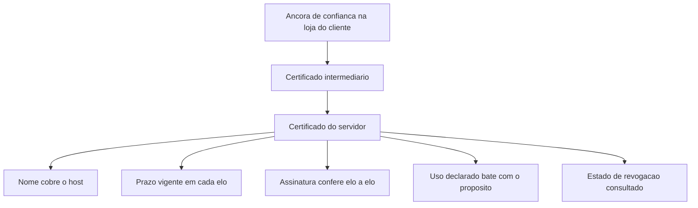

# PKI, certificados e cadeia de confiança

Uma ideia central: um certificado transfere confiança de uma chave pública para uma autoridade que assina, e a cadeia quebra no elo cujo nome, prazo, escopo ou estado de revogação não fecha.

## 1. Objetivo de aprendizagem

Ao final deste tema você deve conseguir: reconstruir a cadeia de confiança de um certificado até a âncora, nomeando três causas de quebra do caminho de validação e a evidência que expõe cada uma.

## 2. Pré-requisitos

[TEMA-01](TEMA-01-simetrica-assimetrica-hashing.md). O certificado é a aplicação direta da cifra assimétrica: a chave pública de uma parte, assinada por terceiro, e a assinatura só se explica com a mecânica do par de chaves.

## 3. Pré-teste

Responda de palpite, antes de ler o resto. Anote a confiança de 1 a 5.

1. Quantos certificados a sua empresa usa? Arrisque um número e diga como faria para descobrir o número certo.
   Confiança: ___
2. Quem renova o certificado de um serviço interno hoje: uma pessoa, um script ou ninguém sabe dizer?
   Confiança: ___
3. Chute o mês da última vez que um serviço seu caiu por certificado vencido. Se nunca aconteceu, chute quando esteve perto.
   Confiança: ___

## 4. Caso real

O RFC 5280 é de maio de 2008 e continua sendo o documento que define o perfil do certificado X.509 e da lista de revogação, o formato da CRL v2 e o algoritmo de validação de caminho de certificação. A peça que sustenta a identidade de máquina na internet tem quase duas décadas e nenhuma substituição completa.

A operação, essa, mudou de ritmo. O RFC 8555, de março de 2019, define o ACME, protocolo para automatizar a gestão de certificados X.509, com autores de Cisco, EFF, Let's Encrypt e University of Michigan — um desenho de automação nascido fora do fornecedor tradicional de certificado. Em paralelo, o CA/Browser Forum mantém os Baseline Requirements do grupo de trabalho de servidores, que os emissores de certificado publicamente confiáveis seguem. Fontes secundárias registram encurtamento repetido do prazo máximo de validade desses certificados; os números e as datas não foram lidos na fonte primária nesta execução, portanto NAO CONFIRMADO em fonte oficial.

A pergunta que o caso deixa aberta: se a validade do certificado encurta e a renovação é manual em metade dos seus serviços, quantas renovações cabem no mesmo time?

## 5. Conteúdo

### 5.1 Conceito

Um certificado é uma estrutura de dados que liga uma chave pública a um nome, assinada por uma autoridade certificadora. A autoridade afirma que quem pediu o certificado controlava aquele nome no momento da emissão. Ela não afirma que o serviço é seguro, não afirma que o código é confiável e não afirma que o dono é idôneo. Essa distinção separa o que a criptografia prova do que o negócio supõe.

Cadeia de confiança é a sequência de certificados até uma âncora: o certificado do servidor, assinado por uma intermediária, assinada por uma raiz que o cliente já conhece e aceita. A validação é feita de baixo para cima, com regras sobre nome, prazo, uso declarado da chave e restrições de escopo. O cliente não precisa conhecer o certificado do servidor; ele precisa conseguir chegar à âncora por uma cadeia que respeite essas regras.

PKI é a infraestrutura em volta disso: emissão, política de emissão, validação de identidade do solicitante, revogação, publicação do estado de revogação e o processo administrativo que decide quem pode pedir certificado e com qual escopo. A parte difícil não é a matemática, é a governança: quem aprova a emissão de um certificado que diz ser o portal de pagamento da empresa.

### 5.2 Como funciona

A validação de caminho segue o algoritmo descrito no RFC 5280 e verifica, a cada elo, cinco coisas. Nome: o certificado do servidor cobre o nome que o cliente pediu, segundo as regras dos campos de nome do certificado. Prazo: emissão e expiração abrangem o instante da conexão, em cada certificado da cadeia, não só no último. Assinatura: cada certificado é assinado pela chave do elo acima. Uso: o certificado foi emitido para o propósito em que está sendo usado. Estado: o certificado não consta de lista de revogação vigente.

A revogação é o ponto frágil conhecido. O RFC 5280 define a lista de revogação e o seu formato; a consulta online de estado existe como outro protocolo, cujo RFC não foi lido nesta execução, portanto NAO CONFIRMADO em fonte oficial. O comportamento prático dos clientes quando a consulta falha é um problema de projeto, não de padrão: falhar fechado derruba serviço, falhar aberto aceita certificado revogado. A escolha pertence à organização e precisa estar escrita.

O ciclo de vida tem sete etapas e a etapa que mais causa indisponibilidade é a penúltima. Geração de par de chaves, idealmente no próprio host ou em módulo que não permite exportação. Solicitação, com o pedido de assinatura contendo a chave pública. Validação de identidade e emissão. Distribuição para o serviço, incluindo a cadeia intermediária. Uso até a proximidade da expiração. Renovação, que é a etapa esquecida. Revogação, usada quando a chave privada vaza ou o serviço deixa de existir. O ACME existe justamente para tirar a renovação do calendário humano.

### 5.3 Exemplo resolvido

Chamado aberto: a integração com o parceiro começou a falhar ontem à noite, sem mudança de código. Cinco verificações, em ordem, resolvem o chamado.

Passo 1, nome. A conexão é feita para `api.parceiro.com.br` e o certificado apresentado cobre `api.parceiro.com`. O SAN não cobre o nome pedido. Sintoma: erro de validação no cliente, não de conectividade. Correção: o parceiro emite certificado com o nome correto. Evidência: a lista de nomes do certificado.

Passo 2, prazo. O certificado do servidor venceu em 23h50 daquele dia. Sintoma: falha que começa a uma hora específica e atinge todos os clientes ao mesmo tempo. Correção: renovação, e processo automático para não repetir. Evidência: campo de expiração, que precisa estar monitorado com antecedência.

Passo 3, cadeia incompleta. O servidor envia apenas o certificado do servidor, sem a intermediária. Clientes com cache da intermediária funcionam; clientes limpos falham. Sintoma: falha intermitente, dependente do cliente. Correção: configurar o envio da cadeia completa. Evidência: a lista de certificados apresentados no handshake.

Passo 4, âncora errada. O parceiro migrou para outra autoridade e o cliente não tem a raiz nova na loja de confiança. Sintoma: a falha atinge quem usa imagem de contêiner atualizada e não atinge o servidor legado, que tem raiz antiga instalada. Correção: publicar a raiz nova no processo de construção de imagem. Evidência: comparação entre a lista de raízes do cliente e o último elo da cadeia.

Passo 5, revogação. O certificado consta de lista de revogação porque a chave privada foi comprometida e reemitida. Sintoma: a falha atinge clientes que consultam a lista e não atinge os que não consultam. Correção: usar o certificado novo. Evidência: consulta da lista publicada pela autoridade.

### 5.4 Problema de completar

O time trocou a autoridade certificadora de todos os serviços públicos. Complete a tabela de diagnóstico antes de escrever o plano de mudança.

| Sintoma observado | Elo provável | Causa provável | Correção | Evidência que confirma |
|---|---|---|---|---|
| Falha só em clientes que usam a imagem nova | ______ | ______ | ______ | ______ |
| Falha que começou em uma hora exata, em todos os clientes | ______ | ______ | ______ | ______ |
| Falha em nome com subdomínio novo, o resto funciona | ______ | ______ | ______ | ______ |
| Falha só quando a consulta de revogação está indisponível | ______ | ______ | ______ | ______ |

Responda ainda em três linhas: qual das quatro linhas exige decisão de arquitetura, e não apenas correção de configuração?

## 6. Por que isso importa para o CISO

Certificado é a identidade da máquina, e identidade sem processo é risco de representação. Uma autoridade certificadora interna entregue sem política de emissão permite que qualquer pessoa peça um certificado com o nome do portal de pagamento e apresente esse certificado a um serviço interno que confia na raiz interna. O controle não está na criptografia, está em quem aprova a emissão e em qual registro fica dela.

A segunda consequência é de continuidade. Renovação manual de certificado é uma falha de disponibilidade com data marcada. O RFC 8555 existe porque o problema é crônico, e automatizar a renovação muda o indicador de risco mais do que qualquer ajuste de suite de cifra.

A terceira é de custo e de escopo. Cada autoridade pública tem custo por certificado, política de validação de identidade e prazo de validade; usar autoridade pública para serviço interno coloca tráfego interno na lista de dependências externas. Autoridade interna separa os dois mundos e cria uma obrigação nova: proteger a chave da raiz, que é o item mais valioso do seu cofre, com o mesmo rigor que o [TEMA-04](TEMA-04-gestao-chaves-ciclo-vida.md) exige.

## 7. Aplicação prática

Monte a lista dos certificados voltados para fora da sua organização. Para cada um, registre o dono, a autoridade emissora, a data de expiração, a forma de renovação — automática ou manual — e quem seria acordado às três da manhã se ele vencer.

Depois faça a mesma lista para os certificados internos. O número de linhas sem dono nomeado é o que você leva à próxima reunião de risco, e a lista é insumo direto do inventário criptográfico do [TEMA-06](TEMA-06-pos-quantica-agilidade-criptografica.md).

## 8. Autoexplicação

Explique em três frases o que a autoridade certificadora afirma e o que ela não afirma. Conecte ao seu ambiente: quantos certificados internos da sua organização foram emitidos no último ano, e quem aprovou cada emissão?

## 9. Erros comuns e equívocos

| Equívoco | Por que está errado | O que é correto |
|---|---|---|
| Certificado válido significa serviço confiável | A autoridade atesta controle do nome e posse da chave, não a qualidade do serviço | Trate o certificado como identidade técnica, e o resto como decisão de negócio |
| Certificado dentro do prazo é certificado válido | Nome, uso declarado, cadeia e revogação também entram na validação | Verifique os cinco critérios, de baixo para cima |
| Cadeia que funciona no navegador funciona em todo cliente | Cada cliente tem loja de raízes e política própria; imagem de contêiner tem loja mínima | Teste com o cliente que a aplicação realmente usa |
| Revogação resolve o comprometimento | A revogação depende de consulta, de cache e do comportamento do cliente sob falha | Combine revogação com reemissão e com rotação de chave |
| Autoridade interna é gratuita | Ela cria custódia de chave de raiz, política de emissão e processo de auditoria | Some o custo operacional da raiz antes de decidir |
| Renovação é tarefa administrativa | É item de disponibilidade com data marcada, e o número de renovação manual tende a crescer | Automatize a renovação e monitore a expiração com antecedência |

## 10. Recuperação ativa

Responda tudo antes de abrir o gabarito.

1. Quais são os cinco critérios verificados na validação de um caminho de certificação?
2. O que a autoridade certificadora afirma, e o que ela não afirma, ao assinar um certificado?
3. Por que um servidor que envia só o próprio certificado funciona para uns clientes e falha para outros?
4. O que muda no risco quando a renovação passa a ser automática?
5. Qual é o item mais valioso de uma autoridade certificadora interna, e como ele deve ser custodiado?
6. Por que o comportamento do cliente quando a consulta de revogação falha é decisão de projeto?

Conferir respostas

1. Nome coberto, prazo vigente em cada elo, assinatura de cada elo pela chave do elo acima, uso declarado compatível com o propósito e estado de revogação.
2. Afirma que o solicitante controlava o nome no momento da emissão e que a chave pública é dele. Não afirma que o serviço é seguro, que o conteúdo é confiável nem que o dono é idôneo.
3. Porque o cliente precisa montar a cadeia até a âncora e pode usar o certificado intermediário que já tem em cache; quem não tem o intermediário não consegue validar.
4. O risco de indisponibilidade por expiração deixa de depender de calendário humano e passa a depender de um processo testado, com monitoramento de falha do próprio processo.
5. A chave privada da raiz. Ela deve ficar em módulo que não permite exportação, com acesso nominal, uso registrado e cerimônia de ativação separada da operação diária.
6. Porque falhar fechado derruba o serviço quando a consulta está indisponível e falhar aberto aceita certificado revogado; o padrão define os formatos, não a política de disponibilidade da organização.

## 11. Revisão espaçada

| Intervalo | O que fazer | Se errar |
|---|---|---|
| D+1 | Repetir os cinco critérios de validação sem consultar | Rebaixar: repetir em D+1 |
| D+7 | Diagnóstico de um chamado real de falha de certificado, por escrito | Rebaixar: repetir em D+3 |
| D+30 | Refazer o inventário de certificados e comparar com o anterior | Rebaixar: repetir em D+7 |

## 12. Conexões com outros temas

Leitura humana do `relacoes` do frontmatter — que é a fonte. Relações que saem desta área
também aparecem em [mapa-relacoes.md](../mapa-relacoes.md). Regras em
[templates/RELACOES-TEMAS.md](../templates/RELACOES-TEMAS.md).

| Relação | Alvo | Por que |
|---|---|---|
| aplicado_em | 03-arquitetura-engenharia#TEMA-05 | escolher cifra e emissor de certificado é requisito não funcional de arquitetura, com critério de aceite verificável |
| complementa | 07-criptografia-segredos#TEMA-03 | aqui está o que o certificado afirma e como a cadeia valida; lá está o que o protocolo faz com esse certificado a cada conexão |

## 13. Certificações e leitura recomendada

| Certificação | Domínio coberto | Recurso | Tipo | Fonte |
|---|---|---|---|---|
| CISSP | Criptografia aplicada: chave pública, certificado e cadeia de confiança | ISC2 CISSP Certification Exam Outline | primaria | https://www.isc2.org/certifications/cissp/cissp-certification-exam-outline |

Leitura recomendada: [RFC 5280, validação de caminho e CRL v2](https://www.rfc-editor.org/info/rfc5280/); [RFC 8555, automação de gestão de certificado com ACME](https://www.rfc-editor.org/rfc/rfc8555.html); [CA/Browser Forum, Baseline Requirements do grupo de trabalho de servidores](https://cabforum.org/working-groups/server/baseline-requirements/).

## 14. Fontes verificadas

| # | Título | Tipo | URL | Acessado em | Confiança |
|---|---|---|---|---|---|
| 1 | RFC 5280, maio de 2008 — perfil de certificado e CRL X.509, formato da CRL v2 e algoritmo de validação de caminho de certificação | primaria | https://www.rfc-editor.org/info/rfc5280/ | "2026-09-25" | alta |
| 2 | RFC 8555, março de 2019 — protocolo ACME para automação da gestão de certificados X.509, com autores de Cisco, EFF, Let's Encrypt e University of Michigan | primaria | https://www.rfc-editor.org/rfc/rfc8555.html | "2026-09-25" | alta |
| 3 | CA/Browser Forum — mantém os Baseline Requirements do grupo de trabalho de servidores, seguidos por emissores de certificado publicamente confiáveis; os limites numéricos de validade vigentes não foram lidos nessa fonte nesta execução | primaria | https://cabforum.org/working-groups/server/baseline-requirements/ | "2026-09-25" | media |
| 4 | SP 800-57 Part 1 Rev. 5 — orientação geral de gestão de material de chaveamento, incluindo o tratamento de chave de longa duração e a proteção exigida | primaria | https://csrc.nist.gov/pubs/sp/800/57/pt1/r5/final | "2026-09-25" | alta |

Itens não afirmados por falta de verificação nesta execução: os prazos máximos de validade de certificado TLS publicamente confiável e o calendário de encurtamento do CA/Browser Forum; o número do RFC do protocolo de verificação online de estado de certificado; e o número do RFC de transparência de certificado. Cada um está marcado como NAO CONFIRMADO em fonte oficial no corpo do tema.

---

| Navegação | |
|---|---|
| Área | [07 Criptografia e gestão de segredos](./README.md) |
| Tema anterior | [TEMA-01](TEMA-01-simetrica-assimetrica-hashing.md) |
| Próximo tema | [TEMA-03](TEMA-03-tls-na-pratica.md) |
| Home | [README](../README.md) |
