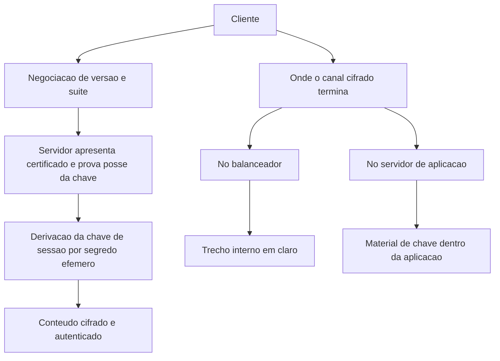

# TLS na prática

Uma ideia central: TLS protege o canal e autentica o servidor, e nenhuma dessas garantias sobrevive a uma versão de protocolo que a política deveria ter proibido.

## 1. Objetivo de aprendizagem

Ao final deste tema você deve conseguir: avaliar a configuração de TLS de cinco serviços internos contra critério verificável de versão, suite, cadeia e validade, classificando cada achado em aceitável, corrigir ou emergência.

## 2. Pré-requisitos

[TEMA-02](TEMA-02-pki-certificados-cadeia-confianca.md). O handshake apresenta o certificado que o tema anterior abre por dentro; sem saber o que a cadeia valida, o diagnóstico de falha de TLS vira tentativa e erro.

## 3. Pré-teste

Responda de palpite, antes de ler o resto. Anote a confiança de 1 a 5.

1. Que percentual dos serviços internos da sua empresa você acha que ainda aceita versão de protocolo anterior à que a política exige?
   Confiança: ___
2. Se um cliente corporativo pedisse hoje prova de que você não aceita versão antiga de protocolo, o que você entregaria em uma hora?
   Confiança: ___
3. Em quem você aposta que percebeu primeiro a última falha de certificado da empresa: no time de segurança, no de infraestrutura ou no usuário?
   Confiança: ___

## 4. Caso real

O NIST SP 800-52 Rev. 2 exige que servidores e clientes TLS do governo dos Estados Unidos suportem TLS 1.2 com suites de cifra de base FIPS e exige suporte a TLS 1.3 até 1º de janeiro de 2024. A data passou. A orientação foi escrita em 2019, publicada como revisão, e o prazo que ela carrega já está no passado — o que significa que qualquer inventário que ainda liste versões anteriores está fora do critério há mais de um ano.

A outra mudança veio do próprio protocolo. O RFC 8446 especifica a versão 1.3 do TLS, obsolesce os RFCs 5077, 5246 e 6961 e atualiza os RFCs 5705 e 6066, além de fixar novos requisitos para implementações de TLS 1.2. Ou seja, mesmo quem permanece na versão 1.2 tem obrigações novas definidas no documento da versão 1.3.

A pergunta que o caso deixa aberta: quantos dos seus serviços internos falam uma versão de protocolo que a própria referência que você cita já proíbe?

## 5. Conteúdo

### 5.1 Conceito

TLS entrega três coisas a uma conexão: confidencialidade do conteúdo, integridade do que trafega e autenticação do servidor. Ele não entrega autorização — saber que o servidor é quem diz ser não diz nada sobre o que quem chama tem direito de acessar. Ele não protege dado em repouso, e não impede que uma aplicação mal configurada devolva o dado de outro usuário por cima de um canal perfeito.

A configuração do protocolo é um conjunto de decisões discretas e verificáveis: versão mínima aceita, versões recusadas, quais algoritmos de troca de chave e de autenticação são negociados, como o certificado é apresentado, e onde o canal cifrado começa e termina. Cada uma dessas decisões é observável de fora, o que permite auditá-la sem ler código.

A versão do protocolo é o critério de maior efeito e o de menor custo de verificação. O SP 800-52 Rev. 2 fixa o mínimo em TLS 1.2 com suites de base FIPS e exige suporte a TLS 1.3 desde 1º de janeiro de 2024 para servidores e clientes TLS do governo dos Estados Unidos. A organização que não tem essa obrigação ainda tem o argumento de custo: manter três versões vivas significa manter três superfícies de falha e três caminhos de teste.

### 5.2 Como funciona

O handshake negocia parâmetros e autentica o servidor. O cliente envia a lista de versões e conjuntos de algoritmos que aceita; o servidor escolhe, apresenta o certificado e prova posse da chave privada correspondente. As duas partes derivam então uma chave de sessão, e a partir daí o conteúdo trafega cifrado e autenticado. O RFC 8446 reorganizou esse fluxo e definiu requisitos novos também para implementações da versão 1.2.

Sigilo encaminhado, ou forward secrecy, vem da escolha da troca de chave. Quando a chave de sessão é derivada de um segredo efêmero em vez da chave privada de longa duração do servidor, o vazamento futuro dessa chave privada não decifra sessões antigas gravadas por quem estava no caminho. É a diferença entre perder a identidade da máquina e perder o histórico de tudo que ela falou.

O ponto onde o canal termina é decisão de arquitetura com efeito em risco. Encerrar o TLS no balanceador concentra o material de chave em um ponto administrado e reduz a exposição da aplicação, ao custo de deixar o trecho interno em claro dentro da rede. Encerrar na aplicação elimina o trecho em claro e espalha material de chave e bibliotecas por todos os hosts. Nenhuma das duas é gratuita, e a escolha deve estar escrita no documento de requisitos.

Sobram dois parâmetros que aparecem em toda auditoria. Autenticação mútua, em que o cliente também apresenta certificado, transforma a conexão em prova de identidade de máquina para máquina, com efeito imediato no inventário de certificados e no ciclo de vida do [TEMA-02](TEMA-02-pki-certificados-cadeia-confianca.md). E o reenvio de dados no primeiro voo após a retomada de sessão, definido no RFC 8446 como dados antecipados, exige cuidado: a seção do RFC que trata do risco de repetição desses dados não foi lida nesta execução, portanto NAO CONFIRMADO em fonte oficial.

### 5.3 Exemplo resolvido

Quatro endpoints internos passaram por verificação de configuração. O critério adotado tem quatro linhas: versão mínima TLS 1.2 com suporte a 1.3; nenhuma versão anterior a 1.2 aceita; cadeia completa apresentada com nome que cobre o host; expiração com renovação automática. O resultado é lido assim.

Endpoint A, portal do cliente. Versão negociada 1.3, cadeia completa, certificado com nome correto, expiração em três meses com renovação automática pelo processo de ACME. Classificação: aceitável. Ação: incluir a expiração no monitoramento e revisar em um ano.

Endpoint B, console administrativo interno. Versão negociada 1.1, aceita por configuração herdada. Classificação: emergência, porque a interface expõe sessão administrativa e a versão antiga não é aceita por nenhum critério vigente. Ação: desabilitar versões anteriores a 1.2, testar o único cliente legado que ainda depende da versão antiga e, se ele não suportar 1.2, isolá-lo em rede segmentada com registro de exceção datada.

Endpoint C, integração entre dois serviços internos. Versão 1.2, cadeia incompleta — só o certificado do servidor é enviado. Classificação: corrigir, com prioridade média. Ação: enviar a cadeia completa; o sintoma esperado, se não corrigir, é falha intermitente que aparece só em cliente com cache limpo.

Endpoint D, serviço de telemetria. Versão 1.2 aceitável, certificado com nome que não cobre o endereço interno usado pelos coletores. Classificação: corrigir, com prazo curto, porque a equipe já instalou exceção no cliente para aceitar a falha. Ação: emitir certificado com o nome correto e remover a exceção, que é o item mais grave da lista, por transformar validação em formalidade.

### 5.4 Problema de completar

Um serviço novo vai expor API para parceiros comerciais. Complete a tabela de decisão antes de escrever o requisito.

| Decisão | Critério verificável | Como verificar | Aceitável | Emergência |
|---|---|---|---|---|
| Versão mínima do protocolo | ______ | ______ | ______ | ______ |
| Autenticação do parceiro | ______ | ______ | ______ | ______ |
| Onde o TLS termina | ______ | ______ | ______ | ______ |
| Renovação do certificado | ______ | ______ | ______ | ______ |
| Suite e algoritmo de troca de chave | ______ | ______ | ______ | ______ |

Responda ainda em três linhas: qual linha da tabela você levaria ao comitê de arquitetura em vez de resolver com o time, e por quê?

## 6. Por que isso importa para o CISO

Configuração de TLS é o item que aparece em varredura de cliente, em questionário de due diligence e em relatório de pentest, sempre com o mesmo formato: uma lista de endpoints e uma versão de protocolo. É o achado mais barato de corrigir e o mais fácil de deixar envelhecer, porque ninguém abre chamado enquanto funciona.

O prazo do SP 800-52 Rev. 2 — suporte a TLS 1.3 até 1º de janeiro de 2024 — mostra o custo de não ter inventário. Quem tinha a lista enfrentou uma tarefa; quem não tinha descobriu o tamanho da tarefa durante a auditoria. O mesmo vale para a organização que cita essa referência em contrato sem saber quantos endpoints próprios a cumprem.

Existe o efeito de arquitetura, que é o mais caro. Trocar onde o TLS termina não é ajuste de configuração: mexe em balanceador, em certificado, em inspeção e em desempenho. Essa decisão precisa ser tomada com antecedência, e a pergunta que o CISO faz é onde fica o material de chave e quem administra o ponto que decifra.

## 7. Aplicação prática

Escolha cinco serviços internos, um deles administrativo, e verifique quatro coisas em cada um: versão negociada, cadeia apresentada, nome coberto pelo certificado e forma de renovação. Para cada serviço, escreva a classificação em aceitável, corrigir ou emergência, com uma frase de justificativa.

Depois responda duas perguntas. Quantos certificados da lista expiram nos próximos 90 dias sem renovação automática? Quem seria acordado se o serviço administrativo parasse hoje por falha de certificado?

## 8. Autoexplicação

Explique em três frases por que TLS bem configurado não impede a aplicação de vazar dado de outro usuário. Conecte ao seu ambiente: qual serviço seu ainda aceita uma versão de protocolo anterior à que a sua política exige?

## 9. Erros comuns e equívocos

| Equívoco | Por que está errado | O que é correto |
|---|---|---|
| Tráfego interno não precisa de TLS | Rede interna é onde o atacante já está depois do primeiro acesso; escuta passiva é trivial | Aplique o mesmo critério mínimo a serviço interno, com exceção registrada e datada |
| Versão antiga aceita é só questão de desempenho | Versão antiga carrega algoritmos e fluxos que o critério vigente já proíbe | Desabilite versões anteriores à política e trate exceção como item de risco |
| Cadeia incompleta é detalhe de configuração | Ela causa falha intermitente dependente do cliente, difícil de reproduzir e de explicar | Configure o envio da cadeia completa e teste com cliente de cache limpo |
| mTLS é sempre melhor | Autenticação mútua multiplica certificados, renovações e revogações a administrar | Decida por mTLS onde a identidade da máquina precisa ser provada, e conte o custo |
| Aceitar o certificado no cliente resolve a falha | A exceção remove a verificação e cria um canal que qualquer certificado satisfaz | Corrija a causa e remova a exceção; exceção permanente é o achado mais grave |
| Renovação automática elimina o risco | Ela troca o risco de expiração pelo risco de o processo automático falhar em silêncio | Monitore a falha do processo e alerte antes da expiração |

## 10. Recuperação ativa

Responda tudo antes de abrir o gabarito.

1. O que o handshake do TLS 1.3 autentica, e o que ele não autentica?
2. Por que a sessão anterior continua protegida quando a chave privada do servidor vaza depois?
3. O que muda quando o TLS termina no balanceador em vez de terminar na aplicação?
4. Qual é o critério verificável para aceitar ou recusar uma versão de protocolo em um serviço interno?
5. Por que aceitar certificado inválido no cliente é pior do que a falha original?
6. Qual é a obrigação de TLS 1.2 e 1.3 no SP 800-52 Rev. 2, e para quem ela vale?

Conferir respostas

1. Autentica o servidor, por meio do certificado e da prova de posse da chave privada, e protege o canal. Não autentica quem chama o serviço nem define o que essa pessoa pode acessar.
2. Porque a chave de sessão foi derivada de um segredo efêmero do handshake, e não da chave privada de longa duração. A chave privada assina e autentica; ela não decifra o histórico de sessões.
3. O canal cifrado passa a terminar antes da aplicação: o trecho até o servidor de aplicação trafega em claro ou sob outra cifra, e o material de chave fica concentrado em um ponto administrado.
4. O critério é a versão mínima definida na política, comparada com a versão efetivamente negociada em cada endpoint, com suporte à versão mais recente exigida. Exceção vive em registro datado, com dono e prazo.
5. Porque a exceção desliga a verificação de identidade de forma permanente e o canal passa a aceitar qualquer certificado, inclusive de um servidor controlado por atacante em posição de rede.
6. O SP 800-52 Rev. 2 exige TLS 1.2 com suites de cifra de base FIPS em todos os servidores e clientes TLS do governo dos Estados Unidos e exige suporte a TLS 1.3 até 1º de janeiro de 2024, com orientação sobre certificados e extensões que afetam a segurança.

## 11. Revisão espaçada

| Intervalo | O que fazer | Se errar |
|---|---|---|
| D+1 | Repetir as três garantias do TLS e as três que ele não dá | Rebaixar: repetir em D+1 |
| D+7 | Reclassificar os cinco endpoints verificados na prática | Rebaixar: repetir em D+3 |
| D+30 | Verificar se as exceções registradas continuam válidas e com prazo | Rebaixar: repetir em D+7 |

## 12. Conexões com outros temas

Leitura humana do `relacoes` do frontmatter — que é a fonte. Relações que saem desta área
também aparecem em [mapa-relacoes.md](../mapa-relacoes.md). Regras em
[templates/RELACOES-TEMAS.md](../templates/RELACOES-TEMAS.md).

| Relação | Alvo | Por que |
|---|---|---|
| complementa | 05-rede-infraestrutura#TEMA-04 | o mesmo protocolo visto pela rede e visto pelo material criptográfico que ele apresenta; um tema fecha o outro |
| complementa | 07-criptografia-segredos#TEMA-02 | aqui o certificado é usado pelo protocolo a cada conexão; no TEMA-02 está o que ele afirma e como a cadeia valida |

## 13. Certificações e leitura recomendada

| Certificação | Domínio coberto | Recurso | Tipo | Fonte |
|---|---|---|---|---|
| CISSP | Criptografia aplicada: protocolo TLS, autenticação do servidor e sigilo encaminhado | ISC2 CISSP Certification Exam Outline | primaria | https://www.isc2.org/certifications/cissp/cissp-certification-exam-outline |
| Security+ | Fundamentos de protocolo seguro e de validação de certificado | CompTIA Security+ SY0-701 Exam Objectives | primaria | https://assets.ctfassets.net/82ripq7fjls2/6TYWUym0Nudqa8nGEnegjG/0f9b974d3b1837fe85ab8e6553f4d623/CompTIA-Security-Plus-SY0-701-Exam-Objectives.pdf |

Leitura recomendada: [SP 800-52 Rev. 2, seleção, configuração e uso de TLS](https://csrc.nist.gov/pubs/sp/800/52/r2/final); [RFC 8446, TLS 1.3 e requisitos novos para implementações da versão 1.2](https://www.rfc-editor.org/info/rfc8446/).

## 14. Fontes verificadas

| # | Título | Tipo | URL | Acessado em | Confiança |
|---|---|---|---|---|---|
| 1 | SP 800-52 Rev. 2 — exige TLS 1.2 com suites de cifra de base FIPS em todos os servidores e clientes TLS do governo dos Estados Unidos e exige suporte a TLS 1.3 até 1º de janeiro de 2024; traz orientação sobre certificados e extensões que afetam a segurança | primaria | https://csrc.nist.gov/pubs/sp/800/52/r2/final | "2026-09-25" | alta |
| 2 | RFC 8446 — especifica o TLS 1.3, obsolesce os RFCs 5077, 5246 e 6961, atualiza os RFCs 5705 e 6066 e especifica novos requisitos para implementações de TLS 1.2; a seção sobre dados antecipados não foi lida nesta execução | primaria | https://www.rfc-editor.org/info/rfc8446/ | "2026-09-25" | alta |
| 3 | RFC 5280 — validação de caminho de certificação, usada aqui para o critério de cadeia válida | primaria | https://www.rfc-editor.org/info/rfc5280/ | "2026-09-25" | alta |

Itens não afirmados por falta de verificação nesta execução: a lista de suites de cifra aprovadas e as extensões exigidas pelo SP 800-52 Rev. 2; a lista de grupos de troca de chave recomendados; e o tratamento do risco de repetição dos dados antecipados no RFC 8446. Todos marcados como NAO CONFIRMADO em fonte oficial no corpo do tema.

---

| Navegação | |
|---|---|
| Área | [07 Criptografia e gestão de segredos](./README.md) |
| Tema anterior | [TEMA-02](TEMA-02-pki-certificados-cadeia-confianca.md) |
| Próximo tema | [TEMA-04](TEMA-04-gestao-chaves-ciclo-vida.md) |
| Home | [README](../README.md) |
