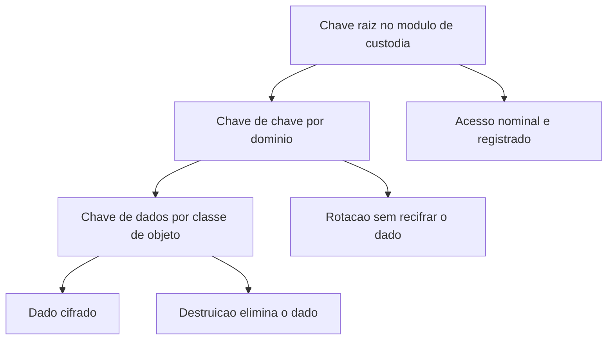

# Gestão de chaves e ciclo de vida

Uma ideia central: a chave é o ativo, e o algoritmo é commodity — quem controla a chave controla o dado, inclusive para destruí-lo.

## 1. Objetivo de aprendizagem

Ao final deste tema você deve conseguir: escrever o ciclo de vida de uma chave de dados — geração, custódia, uso, rotação, backup, destruição e resposta a comprometimento — com dono nomeado e evidência por etapa.

## 2. Pré-requisitos

[TEMA-01](TEMA-01-simetrica-assimetrica-hashing.md). A hierarquia de chaves combina cifra simétrica para o volume e cifra assimétrica para distribuir segredo; sem as duas famílias separadas, o desenho da hierarquia fica arbitrário.

## 3. Pré-teste

Responda de palpite, antes de ler o resto. Anote a confiança de 1 a 5.

1. Quem, na prática, tem hoje poder de exportar uma chave de produção da sua empresa? Se o nome não vem à cabeça, diga quem você acha que sabe.
   Confiança: ___
2. Quantas chaves você estima que existem no ambiente, contando as de backup, as de teste e as que ninguém lembra?
   Confiança: ___
3. Quanto tempo levaria para trocar todas as chaves de produção, se a decisão fosse tomada amanhã?
   Confiança: ___

## 4. Caso real

O NIST SP 800-57 Part 1 Rev. 5 é a orientação geral de gestão de material de chaveamento: define os serviços de segurança que a criptografia pode prover, os algoritmos e tipos de chave que podem ser empregados e a proteção que cada tipo de chave exige. É o documento que a política de chaves da sua organização provavelmente cita.

A página de gestão de chaves do CSRC registra que o rascunho público inicial da revisão 6 foi publicado em 5 de dezembro de 2025, com comentários abertos até 5 de fevereiro de 2026. O documento de referência para custódia de chave está em revisão, e a versão que a sua política cita vai ser substituída.

Do lado do módulo, a régua é o FIPS 140-3, que estabelece quatro níveis crescentes e qualitativos de segurança para módulos criptográficos, cobrindo projeto, implementação e operação. O CMVP valida módulos contra esse padrão desde 22 de setembro de 2020, e submissões sob o FIPS 140-2 foram aceitas até 31 de março de 2022, com exigência de extensão prévia para submissões posteriores a 21 de setembro de 2021.

A pergunta que o caso deixa aberta: quando o seu fornecedor de HSM diz "módulo validado", qual nível, qual versão do padrão e qual data de validação sustentam a frase?

## 5. Conteúdo

### 5.1 Conceito

Chave é material secreto que um algoritmo consome. Ela tem finalidade — cifrar, decifrar, assinar, verificar, envolver outra chave, derivar, autenticar — e o primeiro princípio de gestão é a separação de finalidade: a chave que cifra dado não é a chave que assina log, e nenhuma das duas é a chave que autentica o serviço. Reutilizar material multiplica o escopo de um único vazamento.

Hierarquia resolve o problema de escala. Uma chave de dados, chamada DEK, cifra o conteúdo. Uma chave de chave, chamada KEK, cifra a DEK para armazenamento. Uma chave raiz, ou mestra, protege as KEK e vive no dispositivo de custódia que não exporta material. O ganho aparece na rotação: trocar a KEK re-embrulha as DEK sem tocar no dado, e trocar a chave raiz re-embrulha as KEK. Rotação deixa de ser um projeto de re-cifragem.

O ciclo de vida tem estados e transições que precisam de dono. Geração, com origem de aleatoriedade e local de nascimento definidos. Ativação, quando a chave passa a ser usada. Uso, com registro de cada operação. Suspensão, quando a chave para de ser usada sem ser destruída, útil durante investigação. Desativação, quando a chave só decifra o que ela já cifrou, para permitir leitura de dado antigo sem permitir cifragem nova. Destruição, que é irreversível e elimina a possibilidade de recuperar o dado protegido. O SP 800-57 Part 1 Rev. 5 trata a proteção exigida por tipo de chave; os prazos numéricos e a nomenclatura exata dos estados não foram lidos nesta execução, portanto NAO CONFIRMADO em fonte oficial.

### 5.2 Como funciona

A custódia separa a chave do dado. Guardar a DEK no mesmo banco que ela cifra não é cifrar, é codificar: quem lê o banco lê a chave. A regra prática é que a chave mora em dispositivo que não exporta material em claro, com acesso nominal — pessoa ou serviço identificado — e registro de cada operação de uso.

O backup da chave é diferente do backup do dado. Perder a chave é perder o dado, e perder a chave raiz é perder todas as chaves. Isso obriga a um esquema de recuperação em que o material de recuperação fica sob controle dividido: nenhum indivíduo sozinho reconstrói a chave raiz, e a cerimônia de reconstrução é registrada. O outro lado da moeda é o risco inverso — um material de recuperação mal guardado anula a custódia.

Destruição de chave é operação de negócio, não de infraestrutura. Destruir a KEK de um conjunto de dados torna esses dados irrecuperáveis, o que resolve um pedido de eliminação com custo menor do que reescrever o armazenamento. E torna irreversível um erro de escopo: quem destrói a chave errada não recupera o dado por backup.

Comprometimento exige resposta em ordem. Primeiro dimensionar: quais chaves derivam da comprometida, quais dados ela protege, por quanto tempo, e se o acesso foi gravado. Segundo conter: suspender uso e emitir substituta. Terceiro erradicar: re-embrulhar o que dependia dela e re-cifrar o que estiver exposto. Quarto evidenciar: registro de quem usou, quando e de onde. Um comprometimento sem registro de uso deixa a organização sem resposta para "quanto vazou".

### 5.3 Exemplo resolvido

Um sistema guarda prontuário médico em banco na nuvem, com busca por número de registro, e assina o log de auditoria. Cinco decisões constroem a hierarquia.

Decisão 1, camadas. Chave raiz no módulo de custódia, sem exportação, com cerimônia de ativação registrada. Uma KEK por região de armazenamento e por inquilino, quando houver isolamento contratual. Uma DEK por classe de dado — prontuário, imagem, metadado — com versionamento. Dono da chave raiz: segurança da informação. Dono das DEK: dono do serviço.

Decisão 2, busca. Cifrar o número de registro impede busca por igualdade, porque a saída da cifra não preserva ordem nem igualdade. A solução é um índice derivado, calculado a partir do valor com um segredo separado, guardado com finalidade própria. O índice precisa de chave diferente da que cifra o conteúdo, porque o índice é mais fácil de atacar por força bruta.

Decisão 3, rotação. Cadência definida por classe de chave e por evento, não só por calendário: rotação periódica, rotação por saída de pessoa com acesso, rotação por descontinuação de algoritmo e rotação imediata em caso de suspeita. Automatizada com teste em ambiente de homologação, porque rotação que nunca foi testada é indisponibilidade programada.

Decisão 4, backup e recuperação. DEK e KEK armazenadas apenas em forma embrulhada pela camada de cima. Material de recuperação da chave raiz sob controle dividido, em local diferente do módulo de custódia, com teste de restauração periódico e registro de quem participou.

Decisão 5, destruição. Ao final da retenção, destrói-se a DEK da classe correspondente, o que torna o conteúdo ilegível, e registra-se o evento com identificador da chave, autor, data e escopo. O registro de destruição é a evidência que o pedido de eliminação exige.

### 5.4 Problema de completar

Ambiente descrito: uma única KEK guardada no mesmo cofre que as DEK; uma DEK por aplicação, sem versionamento; a chave privada de assinatura do log é a mesma que autentica o serviço; rotação anual por calendário, sem teste; o backup do cofre fica no mesmo armazenamento do banco cifrado. Preencha a tabela e ordene as correções.

| Falha | Risco que materializa | Correção | Evidência de que a correção foi feita | Ordem |
|---|---|---|---|---|
| KEK e DEK no mesmo cofre | ______ | ______ | ______ | ______ |
| DEK sem versionamento | ______ | ______ | ______ | ______ |
| Chave de assinatura igual à de autenticação | ______ | ______ | ______ | ______ |
| Rotação anual sem teste | ______ | ______ | ______ | ______ |
| Backup do cofre no armazenamento cifrado | ______ | ______ | ______ | ______ |

Responda ainda em três linhas: qual das cinco falhas não se corrige sem parar o serviço, e qual o custo de adiar essa correção?

## 6. Por que isso importa para o CISO

A custódia de chave define o teto de todos os outros controles. Nenhum controle de acesso a dado é mais forte do que o controle de acesso à chave que decifra o dado. Se a chave está no mesmo lugar que o dado, com o mesmo conjunto de administradores, a cifragem protege contra roubo de disco e não protege contra atacante com credencial administrativa.

A frase de auditoria que separa as duas situações é uma pergunta nominal: quem consegue exportar a chave em claro, e qual registro prova isso? A resposta "o time de infraestrutura" indica ausência de controle. A resposta "ninguém exporta; a chave nasce e é usada dentro do módulo, e cada uso tem registro nominal" indica controle verificável.

Há o efeito de contrato e de custo. Exigir do fornecedor módulo validado sob o FIPS 140-3 é pergunta de especificação, e a resposta precisa nomear o nível, a versão do padrão e a data de validação, conforme o CMVP registra módulos validados contra o FIPS 140-3 desde 22 de setembro de 2020. E há o efeito de migração: quando um algoritmo tem data de descontinuação, é o ciclo de vida da chave que define se a troca é re-embrulhar chaves ou re-cifrar todo o dado, o que muda em uma ordem de grandeza o custo do [TEMA-06](TEMA-06-pos-quantica-agilidade-criptografica.md).

## 7. Aplicação prática

Escolha o sistema de maior valor da sua organização e monte a matriz de chaves com seis colunas: identificador, finalidade, quem gera, onde reside, quem consegue usar, como e quando é destruída. Preencha o que souber e deixe em branco o que não souber.

Depois responda três perguntas por linha. A chave tem finalidade única? O uso dela é registrado de forma nominal? A destruição dela é possível sem destruir o serviço? A quantidade de linhas com resposta "não sei" é o escopo do primeiro trabalho com o fornecedor de custódia.

## 8. Autoexplicação

Explique em três frases por que a rotação troca um risco por outro. Conecte ao seu ambiente: qual chave, se destruída hoje por engano, apagaria um dado que você é obrigado a manter?

## 9. Erros comuns e equívocos

| Equívoco | Por que está errado | O que é correto |
|---|---|---|
| Cifrar o dado é suficiente | Sem separação entre dado e chave, um único acesso aos dois resolve o problema do atacante | Separe custódia, com acesso nominal e registro de uso |
| Uma chave por empresa simplifica | Centraliza o dano: um vazamento compromete todo o dado existente | Use hierarquia com DEK por classe e KEK por domínio |
| Rotação é trabalho de calendário | Rotação sem teste derruba serviço, e rotação por evento é a que responde a incidente | Defina gatilhos, teste e monitore |
| Backup da chave é igual ao backup do dado | O material de recuperação mal guardado anula a custódia | Controle dividido, local separado e teste de restauração |
| Destruir a chave é perder dado | É o efeito desejado quando a retenção termina, e é irreversível quando é erro | Trate destruição como operação autorizada, com escopo e registro |
| Fornecedor validado dispensa gestão | Validação atesta o módulo, não o seu processo de chave | Peça nível, versão do padrão e data, e verifique o processo interno |

## 10. Recuperação ativa

Responda tudo antes de abrir o gabarito.

1. Por que uma chave de dados é cifrada por uma chave de chave em vez de ser guardada em claro?
2. O que a destruição da chave de chave faz com os dados que ela protegia?
3. Quais são as evidências mínimas de que ninguém exportou a chave em claro?
4. Por que a chave que cifra o conteúdo não deve ser a mesma que constrói o índice de busca?
5. Qual é a ordem de resposta a um comprometimento de chave, e o que cada etapa entrega?
6. O que a validação FIPS 140-3 de um módulo garante, e o que ela não garante?

Conferir respostas

1. Porque a chave em claro no mesmo local que o dado elimina a proteção: quem lê o armazenamento lê a chave junto. A chave de chave fica em custódia separada, com acesso auditado e destruição controlada.
2. Torna os dados irrecuperáveis, já que sem a chave não há decifragem nem por backup. É o efeito desejado no fim da retenção e o efeito catastrófico no erro de escopo.
3. Operação de uso registrada com identificador de quem chamou, ausência de função de exportação no módulo e prova de que a chave nasceu dentro da fronteira de custódia.
4. Porque o índice responde a busca por igualdade sobre um conjunto de valores pequeno e previsível, o que o torna alvo muito mais barato de atacar por força bruta do que o conteúdo; separar as chaves limita o dano.
5. Dimensionar o escopo, conter com suspensão e substituição, erradicar re-embrulhando e re-cifrando o exposto, e evidenciar com registro de uso. A última etapa responde à pergunta de quanto vazou.
6. Garante o que o módulo atesta nos níveis crescentes de segurança definidos no padrão, conforme a validação registrada no CMVP. Não garante que a organização gera, custodia, roda e destrói chaves de acordo com a política.

## 11. Revisão espaçada

| Intervalo | O que fazer | Se errar |
|---|---|---|
| D+1 | Repetir a hierarquia de três camadas e o ganho de cada uma | Rebaixar: repetir em D+1 |
| D+7 | Refazer a matriz de chaves do sistema escolhido | Rebaixar: repetir em D+3 |
| D+30 | Executar um teste de restauração de chave ou de rotação em homologação | Rebaixar: repetir em D+7 |

## 12. Conexões com outros temas

Leitura humana do `relacoes` do frontmatter — que é a fonte. Relações que saem desta área
também aparecem em [mapa-relacoes.md](../mapa-relacoes.md). Regras em
[templates/RELACOES-TEMAS.md](../templates/RELACOES-TEMAS.md).

| Relação | Alvo | Por que |
|---|---|---|
| complementa | 08-cloud#TEMA-05 | cifrar dado em nuvem depende de quem detém a chave e do ciclo de vida dela, e a décima segunda pergunta do fornecedor é quem consegue exportá-la |
| nao_confundir_com | 07-criptografia-segredos#TEMA-05 | chave é material que um algoritmo consome; segredo é credencial que autentica uma identidade, e o controle de acesso de cada um é diferente |

## 13. Certificações e leitura recomendada

| Certificação | Domínio coberto | Recurso | Tipo | Fonte |
|---|---|---|---|---|
| CISSP | Criptografia aplicada: hierarquia de chave, custódia em módulo validado e ciclo de vida | ISC2 CISSP Certification Exam Outline | primaria | https://www.isc2.org/certifications/cissp/cissp-certification-exam-outline |

Leitura recomendada: [SP 800-57 Part 1 Rev. 5, orientação geral de gestão de material de chaveamento](https://csrc.nist.gov/pubs/sp/800/57/pt1/r5/final); [FIPS 140-3, níveis crescentes de segurança para módulos criptográficos](https://csrc.nist.gov/pubs/fips/140-3/final); [CMVP, validação contra o FIPS 140-3 desde 22/09/2020](https://csrc.nist.gov/Projects/Cryptographic-Module-Validation-Program).

## 14. Fontes verificadas

| # | Título | Tipo | URL | Acessado em | Confiança |
|---|---|---|---|---|---|
| 1 | SP 800-57 Part 1 Rev. 5 — orientação geral e boas práticas de gestão de material de chaveamento, definições dos serviços de segurança, algoritmos e tipos de chave que podem ser empregados e a proteção que cada tipo exige | primaria | https://csrc.nist.gov/pubs/sp/800/57/pt1/r5/final | "2026-09-25" | alta |
| 2 | Página de gestão de chaves do CSRC — rascunho público inicial do SP 800-57 Part 1 Rev. 6 publicado em 05/12/2025, com comentários até 05/02/2026 | primaria | https://csrc.nist.gov/Projects/Key-Management/Key-Management-Guidelines | "2026-09-25" | alta |
| 3 | FIPS 140-3 — quatro níveis crescentes e qualitativos de segurança, com requisitos de projeto, implementação e operação do módulo criptográfico | primaria | https://csrc.nist.gov/pubs/fips/140-3/final | "2026-09-25" | alta |
| 4 | CMVP — valida módulos criptográficos contra o FIPS 140-3 desde 22/09/2020; submissões sob o FIPS 140-2 aceitas até 31/03/2022, com exigência de extensão prévia para submissões posteriores a 21/09/2021 | primaria | https://csrc.nist.gov/Projects/Cryptographic-Module-Validation-Program | "2026-09-25" | alta |
| 5 | SP 800-131A Rev. 2 — orientação específica de transição para chaves mais fortes e algoritmos mais fortes, complementando o SP 800-57 Part 1 | primaria | https://csrc.nist.gov/pubs/sp/800/131/a/r2/final | "2026-09-25" | alta |

Itens não afirmados por falta de verificação nesta execução: os prazos numéricos de uso por tipo de chave e a nomenclatura oficial dos estados do ciclo de vida no SP 800-57 Part 1; os requisitos técnicos de cada nível do FIPS 140-3; e a regra de derivação de chave a partir de senha. Todos marcados como NAO CONFIRMADO em fonte oficial no corpo do tema.

---

| Navegação | |
|---|---|
| Área | [07 Criptografia e gestão de segredos](./README.md) |
| Tema anterior | [TEMA-03](TEMA-03-tls-na-pratica.md) |
| Próximo tema | [TEMA-05](TEMA-05-gestao-segredos-cofres.md) |
| Home | [README](../README.md) |
