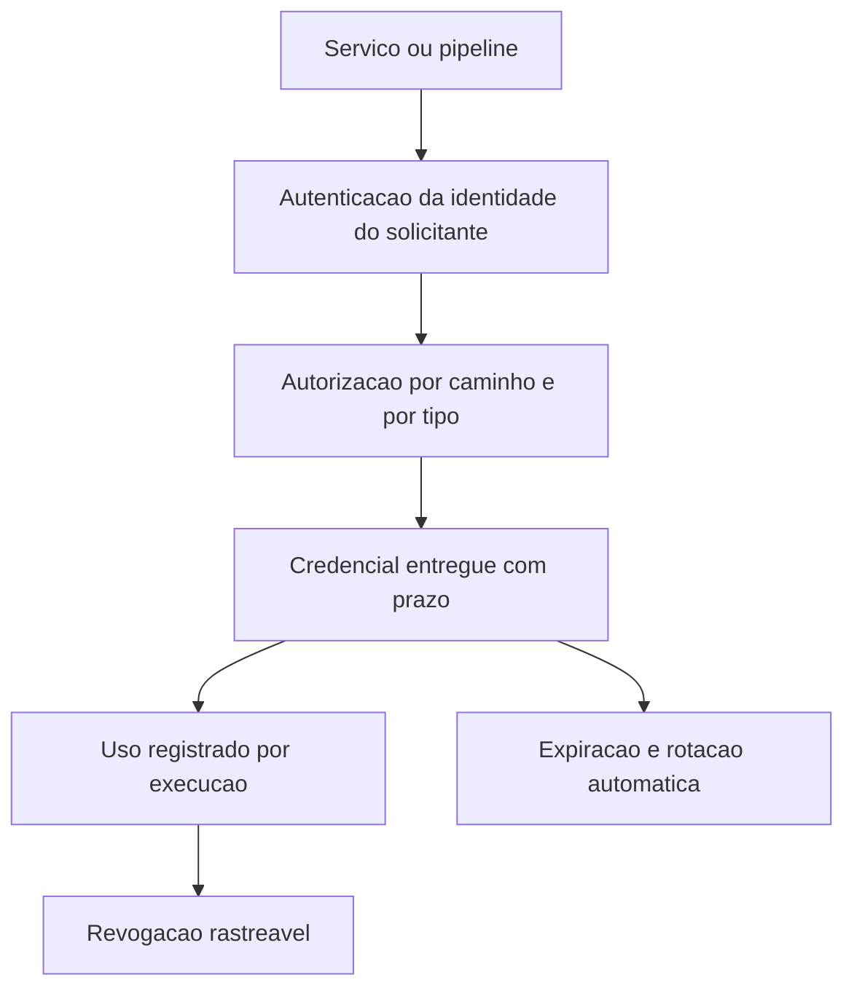

# Gestão de segredos e cofres

Uma ideia central: segredo de aplicação é credencial que autentica uma identidade, e a única forma sustentável de administrá-la é entregá-la com prazo de validade e dono nomeado.

## 1. Objetivo de aprendizagem

Ao final deste tema você deve conseguir: classificar em até três tipos os segredos de um sistema, indicando para cada tipo o cofre, o dono, o prazo de validade e o procedimento de rotação, com evidência de que nenhum segredo vive no código ou no histórico do repositório.

## 2. Pré-requisitos

[TEMA-04](TEMA-04-gestao-chaves-ciclo-vida.md). Os dois temas tratam material secreto e são confundidos o tempo todo: a distinção entre chave e credencial é o que evita colocar chave de cifra dentro de variável de ambiente de pipeline.

## 3. Pré-teste

Responda de palpite, antes de ler o resto. Anote a confiança de 1 a 5.

1. Onde estão os segredos mais fáceis de alguém achar hoje: no repositório de código, no arquivo de configuração ou na esteira de integração?
   Confiança: ___
2. Chute quantos segredos de aplicação a empresa tem. Depois chute quantos estão sob alguma política escrita de validade.
   Confiança: ___
3. Se um desenvolvedor saísse hoje com o segredo de produção no notebook, você saberia? Se a resposta for não, anote onde estaria a primeira pista.
   Confiança: ___

## 4. Caso real

O OWASP Secrets Management Cheat Sheet trata gestão de segredos como problema de política antes de ser problema de ferramenta: usar uma solução centralizada de gestão de segredos ajuda a implementar as políticas, e uma política organizacional de gestão de segredos ajuda a aplicá-las. A frase ordena a sequência, e a ordem importa — ferramenta sem política produz cofre com conteúdo herdado e sem dono.

A série em que essa folha vive reúne mais de 120 folhas de referência mantidas pela comunidade OWASP, conforme a página do projeto Cheat Sheet Series. É material de referência operacional, e o tema aparece ali porque o problema é recorrente: credencial de aplicação espalhada em arquivo de configuração, variável de pipeline, imagem de contêiner e histórico de repositório.

A pergunta que o caso deixa aberta: se a sua política existe só em prática e não em documento, quem decide o que pode ir para uma variável de ambiente?

## 5. Conteúdo

### 5.1 Conceito

Segredo é credencial que autentica uma identidade perante um serviço: senha de banco, chave de API, token de integração, chave privada de certificado de cliente, string de conexão, semente de autenticação de segundo fator. Chave, no sentido do [TEMA-04](TEMA-04-gestao-chaves-ciclo-vida.md), é material que um algoritmo consome para cifrar, assinar ou derivar. A chave privada de um certificado de cliente pertence aos dois mundos, e é exatamente por isso que ela merece tratamento mais restrito do que os outros segredos: ela cifra e ela autentica.

A classificação que funciona na prática tem três tipos. Credencial de pessoa, usada por humano e portanto candidata a segundo fator e a revisão de acesso. Credencial de aplicação, usada por serviço e portanto candidata a substituição automática e a prazo curto. Credencial de automação, usada por pipeline ou robô e portanto a mais exposta de todas, porque vive em ambiente compartilhado e frequentemente sem registro de uso por execução.

O modo de falha é sempre o mesmo. O segredo nasce em um lugar conveniente — arquivo de configuração, variável de ambiente, parâmetro de comando — e ali permanece porque mudar dá trabalho. Depois se copia para o repositório, para o script de implantação, para o documento de passagem de conhecimento e para a imagem construída. Cada cópia sobrevive à remoção do original, e duas delas são permanentes: o histórico de repositório, que é imutável por projeto, e o log de execução, que costuma registrar parâmetro de comando.

### 5.2 Como funciona

Um cofre de segredos centraliza três operações: guardar, entregar e revogar. Guardar exige cifra em repouso e controle de acesso próprio. Entregar exige autenticar quem pede — a identidade do serviço, não uma senha compartilhada por vários serviços — e autorizar por caminho. Revogar exige saber quem recebeu o quê, e essa é a operação que separa um cofre de um arquivo de senhas.

O conceito que muda o jogo é o de credencial de curta duração. Em vez de distribuir uma senha de banco de dados que vale para sempre, a aplicação autentica-se no cofre com a própria identidade, o cofre cria uma credencial específica com validade curta e registro de uso, e ela deixa de existir quando o prazo termina. O número de segredos estáticos cai, e o número de eventos auditáveis sobe.

O cofre tem um problema de inicialização que precisa de resposta escrita. Para abrir, ele exige um material que não pode ficar dentro dele; para reiniciar sozinho após queda, esse material precisa estar acessível a alguém ou a algum processo. As saídas conhecidas são controle dividido entre pessoas, uso de módulo de custódia para o material de abertura ou confiança em identidade de máquina do provedor. Nenhuma é gratuita, e a escolha tem consequência em continuidade: um cofre selado após queda é indisponibilidade de todos os serviços que dependem dele.

A higiene de repositório é parte do mecanismo. Remover o segredo do arquivo não remove o segredo do histórico, e a única resposta completa ao vazamento é revogar, substituir e reescrever o dado quando o escopo exigir. Automatizar a detecção antes do envio é mais barato do que varrer depois, e a RFC 8555, de março de 2019, mostra o caminho quando o assunto é certificado: o protocolo ACME automatiza a gestão de certificados X.509, o que elimina a prática de guardar chave privada de longa duração em servidor.

### 5.3 Exemplo resolvido

Uma chave de acesso de aplicação para serviço de armazenamento foi publicada em repositório aberto. O caso foi detectado por terceiro oito horas depois. Seis passos, em ordem.

Passo 1, revogar antes de investigar. A credencial é invalidada imediatamente. Investigação com credencial ativa é investigação que continua vazando.

Passo 2, dimensionar o uso. O registro de chamadas do serviço de armazenamento é consultado por identificador da credencial no período, para separar chamadas legítimas de chamadas desconhecidas. Sem registro, não existe resposta para "quanto foi lido", e essa ausência vira item de risco no relatório.

Passo 3, avaliar o alcance da permissão. Se a credencial permitia leitura de todos os compartimentos, o incidente alcança todo o dado. Se permitia um prefixo específico, o escopo é menor. O princípio que devia ter limitado isso é o de menor privilégio, e ele falhou na etapa de criação da credencial, não na de vazamento.

Passo 4, substituir. A credencial nova é emitida com escopo restrito ao prefixo necessário, e não com a mesma permissão da anterior. Substituir sem reduzir escopo prepara o próximo incidente.

Passo 5, mudar o mecanismo. A pipeline deixa de carregar credencial estática e passa a assumir identidade própria por federação, obtendo credencial de curta duração a cada execução. É a correção que elimina a classe do problema, e não a instância.

Passo 6, varrer e datar. Uma varredura no histórico de todos os repositórios busca padrões de credencial, gera lista com data e dono, e a lista entra no plano de rotação. A varredura é recorrente, porque o erro se repete com pessoa nova.

### 5.4 Problema de completar

Complete o inventário antes de decidir qual cofre usar.

| Segredo | Tipo | Onde vive hoje | Quem consegue ler | Prazo de validade | Rotação | Evidência de uso por execução |
|---|---|---|---|---|---|---|
| Senha do banco de produção na aplicação | ______ | ______ | ______ | ______ | ______ | ______ |
| Chave de API de serviço externo na pipeline | ______ | ______ | ______ | ______ | ______ | ______ |
| Chave privada do certificado de cliente | ______ | ______ | ______ | ______ | ______ | ______ |
| Token de acesso do painel administrativo | ______ | ______ | ______ | ______ | ______ | ______ |
| Semente de segundo fator de operador | ______ | ______ | ______ | ______ | ______ | ______ |

Responda ainda em três linhas: quais duas linhas você corrige primeiro, e qual controle reduz mais risco pelo menor custo?

## 6. Por que isso importa para o CISO

Credencial de longa duração em pipeline é o caminho de entrada mais provável de um comprometimento, porque o atacante não precisa enganar ninguém: ele lê o que já está lá. Um único token com permissão ampla em um ambiente de construção alcança o ambiente de produção sem exploração de vulnerabilidade nenhuma.

A resposta que o CISO pede tem duas partes verificáveis. Inventário de segredos, com dono e prazo, e prazo curto para tudo que é de automação. Sem inventário, a pergunta "quantos segredos temos" não tem resposta, e sem resposta não existe priorização de verba.

Existe o efeito de auditoria e o efeito de contrato. Registro de uso por execução transforma a resposta de incidente em fato documentado, e a exigência de credencial com prazo entra na cláusula de segurança do fornecedor sem custo adicional de ferramenta. A política organizacional de gestão de segredos, que o OWASP trata como pré-condição para a solução centralizada, é o documento que o auditor vai pedir — e ele custa menos do que o cofre.

## 7. Aplicação prática

Liste os segredos de uma única pipeline de integração e entrega, do gatilho até a implantação. Para cada um, anote onde vive, quem consegue lê-lo hoje e quanto tempo ele vale.

Depois responda três perguntas. Quantos sobrevivem mais de 90 dias sem rotação? Quantos estão em texto claro no repositório ou em log de execução? Quantos você conseguiria revogar hoje sem quebrar o serviço? O terceiro número é o que define se existe processo de rotação ou apenas intenção.

## 8. Autoexplicação

Explique em três frases por que apagar um segredo do repositório não resolve o vazamento. Conecte ao seu ambiente: qual credencial de automação da sua organização tem permissão mais ampla do que a tarefa que ela executa?

## 9. Erros comuns e equívocos

| Equívoco | Por que está errado | O que é correto |
|---|---|---|
| Variável de ambiente é lugar seguro para segredo | Ela é legível por qualquer processo do mesmo contexto e aparece em registro de depuração | Use cofre com entrega autenticada e credencial de curta duração |
| Apagar o arquivo remove o vazamento | O histórico de repositório preserva o conteúdo e o log de execução pode tê-lo gravado | Revogue, substitua, reduza o escopo e varra o histórico |
| Chave de cifra e credencial são a mesma coisa | A chave é consumida por algoritmo e não autentica identidade; a credencial autentica | Separe os dois inventários e os dois controles de acesso |
| Cofre de senha privilegiada cobre tudo | Ele protege credencial de pessoa privilegiada, não a credencial de serviço executada por máquina | Trate cofre de PAM e cofre de aplicação como dois sistemas com donos distintos |
| Rotação é trocar a string | Trocar a string sem automatizar reproduz o problema na próxima cópia | Automatize emissão e expiração, e teste a rotação |
| Cofre resolve a governança | Sem política, o cofre guarda o mesmo material antigo com um nome novo | Escreva a política e defina dono e prazo por tipo de segredo |

## 10. Recuperação ativa

Responda tudo antes de abrir o gabarito.

1. Qual é a diferença entre um segredo de aplicação e a chave que cifra um dado?
2. Quais são os três tipos de segredo usados neste tema, e o que distingue cada um?
3. Por que a credencial de curta duração reduz risco mais do que a rotação periódica da mesma credencial?
4. Por que o cofre de segredos tem um problema de inicialização, e quais são as saídas conhecidas?
5. Por que a remoção do segredo do arquivo não encerra o incidente?
6. Qual é a correção que elimina a classe do problema, e qual apenas remedia a instância?

Conferir respostas

1. O segredo de aplicação autentica uma identidade perante um serviço; a chave é material secreto consumido por um algoritmo. Quando o mesmo material faz as duas coisas, o escopo de exposição dobra.
2. Credencial de pessoa, usada por humano; credencial de aplicação, usada por serviço; credencial de automação, usada por pipeline ou robô. O que distingue é o dono do acesso e o grau de exposição do ambiente.
3. Porque a credencial curta nasce e morre dentro da janela de uso, e o vazamento fora dessa janela não serve para nada; a rotação periódica mantém uma janela longa de validade para quem copiou o valor.
4. Porque o material que abre o cofre não pode ficar dentro dele. As saídas são controle dividido entre pessoas, custódia em módulo que não exporta, ou confiança em identidade de máquina do provedor.
5. Porque o conteúdo do arquivo permanece no histórico de repositório, que é imutável por projeto, e pode ter sido gravado em log de execução; a resposta inclui revogar, substituir e varrer.
6. A correção de classe elimina a credencial estática de longa duração e passa a emitir credencial de curta duração a partir da identidade do executante. A correção de instância troca a string do segredo vazado.

## 11. Revisão espaçada

| Intervalo | O que fazer | Se errar |
|---|---|---|
| D+1 | Repetir os três tipos de segredo e o controle de cada um | Rebaixar: repetir em D+1 |
| D+7 | Refazer o inventário da pipeline escolhida | Rebaixar: repetir em D+3 |
| D+30 | Executar rotação de uma credencial de automação e medir o tempo gasto | Rebaixar: repetir em D+7 |

## 12. Conexões com outros temas

Leitura humana do `relacoes` do frontmatter — que é a fonte. Relações que saem desta área
também aparecem em [mapa-relacoes.md](../mapa-relacoes.md). Regras em
[templates/RELACOES-TEMAS.md](../templates/RELACOES-TEMAS.md).

| Relação | Alvo | Por que |
|---|---|---|
| nao_confundir_com | 04-identidade-acesso#TEMA-05 | cofre de credencial humana privilegiada não substitui o cofre de segredo de aplicação, e o dono do acesso é diferente em cada caso |
| nao_confundir_com | 07-criptografia-segredos#TEMA-04 | chave é material que um algoritmo consome; segredo é credencial que autentica uma identidade, e o controle de acesso de cada um é diferente |

## 13. Certificações e leitura recomendada

| Certificação | Domínio coberto | Recurso | Tipo | Fonte |
|---|---|---|---|---|
| CISSP | Criptografia aplicada: segredo de aplicação, cofre e credencial de curta duração | ISC2 CISSP Certification Exam Outline | primaria | https://www.isc2.org/certifications/cissp/cissp-certification-exam-outline |
| Security+ | Fundamentos de gestão de credencial e de segredo | CompTIA Security+ SY0-701 Exam Objectives | primaria | https://assets.ctfassets.net/82ripq7fjls2/6TYWUym0Nudqa8nGEnegjG/0f9b974d3b1837fe85ab8e6553f4d623/CompTIA-Security-Plus-SY0-701-Exam-Objectives.pdf |

Leitura recomendada: [OWASP Secrets Management Cheat Sheet, política organizacional e solução centralizada](https://cheatsheetseries.owasp.org/cheatsheets/Secrets_Management_Cheat_Sheet.html); [RFC 8555, ACME e o fim da chave de longa duração no servidor](https://www.rfc-editor.org/rfc/rfc8555.html).

## 14. Fontes verificadas

| # | Título | Tipo | URL | Acessado em | Confiança |
|---|---|---|---|---|---|
| 1 | OWASP Secrets Management Cheat Sheet — solução centralizada de gestão de segredos ajuda a implementar as políticas, e uma política organizacional de gestão de segredos ajuda a aplicá-las | primaria | https://cheatsheetseries.owasp.org/cheatsheets/Secrets_Management_Cheat_Sheet.html | "2026-09-25" | alta |
| 2 | OWASP Cheat Sheet Series — mais de 120 folhas de referência mantidas pela comunidade OWASP | primaria | https://owasp.org/projects/cheat-sheet-series | "2026-09-25" | alta |
| 3 | RFC 8555, março de 2019 — protocolo ACME para automação da gestão de certificados X.509 | primaria | https://www.rfc-editor.org/rfc/rfc8555.html | "2026-09-25" | alta |
| 4 | SP 800-57 Part 1 Rev. 5 — orientação geral de gestão de material de chaveamento, usada aqui para separar chave de credencial | primaria | https://csrc.nist.gov/pubs/sp/800/57/pt1/r5/final | "2026-09-25" | alta |

Itens não afirmados por falta de verificação nesta execução: a lista de funcionalidades exigidas de uma solução de gestão de segredos; os prazos recomendados de validade de credencial; e qualquer número de segredos expostos em repositório público, que exigiria estudo próprio. Nenhum deles foi usado como fato no corpo do tema.

---

| Navegação | |
|---|---|
| Área | [07 Criptografia e gestão de segredos](./README.md) |
| Tema anterior | [TEMA-04](TEMA-04-gestao-chaves-ciclo-vida.md) |
| Próximo tema | [TEMA-06](TEMA-06-pos-quantica-agilidade-criptografica.md) |
| Home | [README](../README.md) |
