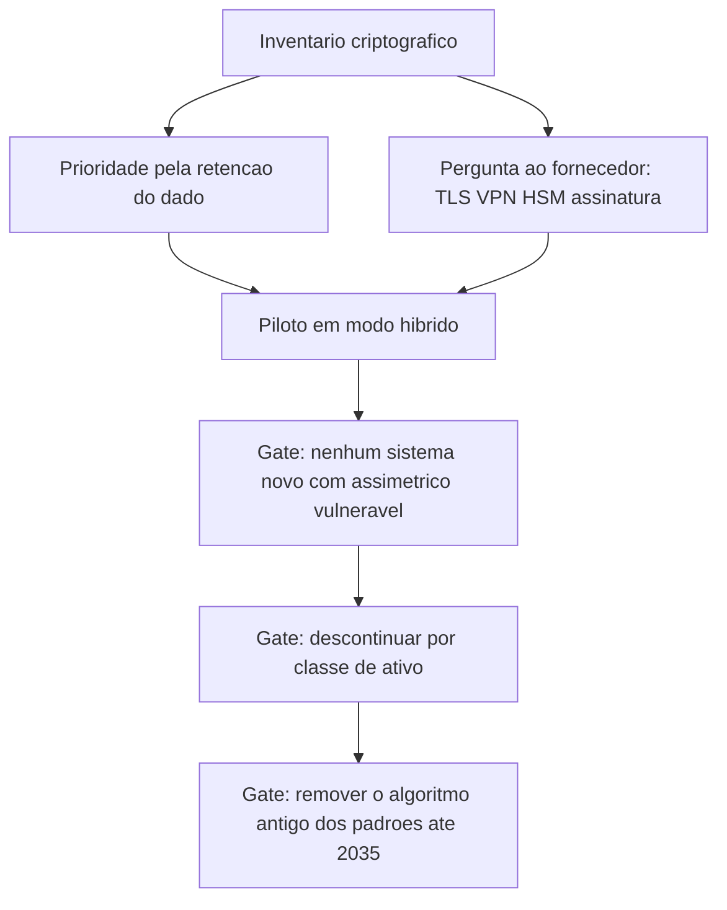

# Criptografia pós-quântica e agilidade criptográfica

Uma ideia central: a data de descontinuação do algoritmo é conhecida, o dado que precisa sobreviver a ela é que define a urgência, e o que decide o custo é a capacidade de trocar algoritmo sem reescrever sistema.

## 1. Objetivo de aprendizagem

Ao final deste tema você deve conseguir: montar um plano de migração pós-quântica com inventário criptográfico, prioridade definida pelo tempo de retenção do dado e gates de descontinuação datados, cada linha com dono nomeado.

## 2. Pré-requisitos

[TEMA-01](TEMA-01-simetrica-assimetrica-hashing.md). A migração troca o que estabelece chave e o que assina; sem separar as famílias, não é possível dizer qual parte do sistema precisa mudar.

## 3. Pré-teste

Responda de palpite, antes de ler o resto. Anote a confiança de 1 a 5.

1. Quantos anos tem o dado mais antigo que a sua empresa ainda precisa conseguir ler? Arrisque um número.
   Confiança: ___
2. Chute o ano em que um algoritmo hoje em uso na sua empresa deixará de ser aceito pelo NIST. Depois chute o ano em que você pretende começar a migração.
   Confiança: ___
3. Você consegue listar hoje onde há criptografia no seu ambiente? Anote quantos sistemas entrariam nessa lista.
   Confiança: ___

## 4. Caso real

O NIST IR 8547, em rascunho público inicial, identifica os padrões criptográficos vulneráveis ao computador quântico e os padrões resistentes para os quais produtos e serviços de tecnologia da informação terão de migrar, e declara que serve para engajar indústria, organizações de padronização e agências na adoção da criptografia pós-quântica. A página do projeto de criptografia pós-quântica do NIST registra o cronograma: o NIST vai descontinuar e por fim remover algoritmos vulneráveis ao computador quântico de seus padrões até 2035, com sistemas de risco alto migrando bem antes.

Os padrões que substituem os vulneráveis já existem. O comunicado do NIST informa que o Secretário de Comércio aprovou três padrões federais de criptografia pós-quântica, o FIPS 203, o FIPS 204 e o FIPS 205, publicados em 2024. O FIPS 203 define o ML-KEM, mecanismo de encapsulamento de chave baseado em retículo modular; o FIPS 204 define o ML-DSA, padrão de assinatura digital da mesma família de construção, para aplicações que exigem assinatura digital em vez de assinatura escrita.

A pergunta que o caso deixa aberta: o cronograma está em rascunho e a expressão "bem antes" para sistemas de risco alto não é data. O que a sua organização usa como marco, se a única referência disponível é 2035?

## 5. Conteúdo

### 5.1 Conceito

Um computador quântico com capacidade suficiente quebra os problemas matemáticos em que se apoia a criptografia assimétrica hoje usada para estabelecer chave e para assinar. O impacto é concentrado no que é assimétrico: troca de chave de TLS e de VPN, assinatura de documento e de código, certificados. Cifra simétrica e função de hash sofrem impacto menor e de outra natureza. A formulação corrente de que a segurança de algoritmos simétricos cai pela metade sob o algoritmo de Grover não foi confirmada em fonte oficial nesta execução, portanto NAO CONFIRMADO em fonte oficial, e não deve ser usada como justificativa de compra.

O prazo do NIST está publicado com dois elementos: remoção de algoritmos vulneráveis dos padrões até 2035, e migração bem antes para sistemas de risco alto, conforme a página do projeto de criptografia pós-quântica. O detalhamento por tipo de algoritmo e por data está no NIST IR 8547, que nesta execução foi verificado como rascunho público inicial — ou seja, os marcos ainda podem mudar antes de virar documento final.

O conceito que transforma o prazo em decisão de hoje é a coleta antecipada. Tráfego cifrado capturado hoje pode ser guardado e decifrado quando houver capacidade de quebra. Quem tem dado com retenção longa obrigatória — prontuário, registro financeiro, propriedade intelectual, dado de identificação civil — já está exposto à janela, mesmo que o computador quântico não exista no dia da captura.

### 5.2 Como funciona

A migração tem três frentes que mudam em ritmos diferentes. A primeira é o que estabelece chave em trânsito, onde o alvo é um mecanismo de encapsulamento de chave como o ML-KEM do FIPS 203: duas partes estabelecem uma chave secreta compartilhada por canal público e usam essa chave com algoritmos simétricos. A segunda é a assinatura, com um esquema pós-quântico como o ML-DSA do FIPS 204, que substitui a assinatura em certificado, em código e em documento. A terceira é a proteção de dado em repouso, onde muda menos: a cifra simétrica permanece, e o que muda é a proteção da chave que a envolve.

A agilidade criptográfica é a capacidade de trocar o algoritmo sem trocar o sistema. Ela se mede por quatro sinais: o algoritmo é configuração e não código compilado; o inventário diz qual algoritmo está em uso em cada serviço; a biblioteca criptográfica aceita troca sem recompilar todo o produto; e o certificado é substituível por processo automatizado. Sem esses quatro, qualquer migração vira projeto de reescrita, e o custo passa a ser medido em anos, não em meses.

O instrumento de inventário é o CBOM, inventário de criptografia. O guia autoritativo do CycloneDX define CBOM como um modelo de objeto para descrever ativos criptográficos e suas dependências, com suporte no CycloneDX v1.6 e superiores, e registra que descobrir, gerir e reportar ativos criptográficos é o primeiro passo da migração para sistemas resistentes ao computador quântico. O CycloneDX é padrão da Ecma International publicado como ECMA-424, o que dá ao artefato o mesmo tipo de rastreabilidade do inventário de dependências do [TEMA-05 de DevSecOps](../09-aplicacoes-devsecops/README.md).

A transição em modo híbrido, combinando troca de chave clássica e pós-quântica na mesma conexão, é a prática usual de migração defensiva: se o esquema novo for quebrado por análise futura, a segurança clássica ainda protege. Nesta execução não foi confirmada uma recomendação normativa específica que obrigue o modo híbrido, portanto NAO CONFIRMADO em fonte oficial; trate a hibridização como decisão de risco, tomada caso a caso, e não como exigência de padrão.

### 5.3 Exemplo resolvido

Matriz de priorização de um grupo com seis classes de ativo. O critério tem três colunas de entrada: exposição a coleta antecipada, tempo de retenção do dado e dependência de fornecedor externo para trocar o algoritmo.

Classe 1, prontuário e imagem médica, retenção de décadas, trafega entre unidades e para operadora. Prioridade máxima: o dado coletado hoje continua sensível quando a capacidade de quebra existir. Ação: iniciar pela chave em trânsito, com modo híbrido, e rever a custódia de chave em nuvem, que é problema do [TEMA-04](TEMA-04-gestao-chaves-ciclo-vida.md).

Classe 2, chaves de VPN e túnel entre unidades, vida útil de anos e troca controlada por equipamento. Prioridade alta, porque exige firmware de fornecedor e ciclo de compra. Ação: incluir na próxima renovação de contrato a exigência de suporte a mecanismo de encapsulamento de chave pós-quântico.

Classe 3, firmware e atualização assinada de dispositivo embarcado, vida útil de dez anos, assinatura verificada dentro do dispositivo. Prioridade alta, porque o custo de troca é o maior de todos e a decisão tem de ser tomada na próxima geração de hardware. Ação: exigir do fabricante o caminho de migração por escrito.

Classe 4, certificados TLS públicos das aplicações expostas. Prioridade média, porque a troca é de relativa simplicidade quando a emissão é automatizada. Ação: garantir renovação automática por ACME, conforme o [TEMA-02](TEMA-02-pki-certificados-cadeia-confianca.md), e testar certificado com assinatura pós-quântica em ambiente de homologação.

Classe 5, token de sessão e chave de assinatura de log. Prioridade média, com retenção curta para a sessão e longa para o log assinado. Ação: separar as duas finalidades, porque a verificação do log assinado vai precisar do algoritmo novo por mais tempo.

Classe 6, backup cifrado com retenção de sete anos. Prioridade média alta, porque é dado em repouso com vida longa e chave envolvida por assimétrica. Ação: planejar re-embrulho da chave de chave como primeiro passo, aproveitando a hierarquia.

### 5.4 Problema de completar

Seu grupo tem quatro classes de ativo. Complete a matriz e escreva os gates.

| Classe de ativo | Retenção do dado | Depende de fornecedor externo | Prioridade | Primeira ação | Dono | Marco datado | Evidência de conclusão |
|---|---|---|---|---|---|---|---|
| Assinatura de código de aplicação | ______ | ______ | ______ | ______ | ______ | ______ | ______ |
| Túnel com o parceiro logístico | ______ | ______ | ______ | ______ | ______ | ______ | ______ |
| Backup cifrado em nuvem | ______ | ______ | ______ | ______ | ______ | ______ | ______ |
| Certificado interno de serviço a serviço | ______ | ______ | ______ | ______ | ______ | ______ | ______ |

Depois escreva três gates em uma linha cada. Gate de entrada: qual exigência os sistemas novos precisam cumprir desde já. Gate de descontinuação: em que data cada classe para de aceitar algoritmo vulnerável. Gate de evidência: qual artefato prova o cumprimento.

## 6. Por que isso importa para o CISO

O cronograma do NIST dá ao CISO algo raro em segurança: uma data. A página do projeto de criptografia pós-quântica registra a remoção de algoritmos vulneráveis dos padrões até 2035, com sistemas de risco alto migrando bem antes. Isso permite abrir linha de orçamento com antecedência em vez de responder a incidente.

O risco maior não é o computador quântico, é a coleta antecipada combinada com retenção longa. A pergunta que decide o orçamento é qual dado da organização precisa continuar secreto depois de 2035, e essa resposta está no inventário de dados, não na área de segurança.

Há uma terceira consequência, de fornecedor. Muita troca de algoritmo não depende da sua equipe, depende de firmware de firewall, de HSM, de biblioteca de sistema e de dispositivo embarcado. O CBOM, com suporte no CycloneDX v1.6 e superiores e publicado como ECMA-424, é o artefato que transforma essa dependência em lista com nome e data, e é o que permite negociar renovação de contrato com pedido específico em vez de promessa genérica. Sem inventário, o CISO descobre o tamanho da migração na mesma semana em que o prazo vence.

## 7. Aplicação prática

Monte o inventário criptográfico de um único sistema, com quatro colunas: onde há criptografia, qual algoritmo, quem controla a troca dele e quanto tempo o dado protegido precisa durar. Não tente cobrir a organização inteira na primeira passada; um sistema bem inventariado vale mais do que uma planilha incompleta.

Depois responda duas perguntas. Qual linha depende de fornecedor que você não controla? Qual linha protege dado que precisa durar mais de dez anos? As duas respostas juntas formam a primeira página do seu plano de migração.

## 8. Autoexplicação

Explique em três frases por que agilidade criptográfica vale mais do que a escolha do algoritmo do momento. Conecte ao seu ambiente: qual sistema da sua organização exigiria substituição de hardware, e não apenas configuração, para trocar o algoritmo de assinatura?

## 9. Erros comuns e equívocos

| Equívoco | Por que está errado | O que é correto |
|---|---|---|
| Pós-quântica é problema de 2035 | A coleta antecipada já expõe dado com retenção longa, e a troca de hardware leva anos | Priorize pelo tempo de retenção e pela dependência de fornecedor |
| Toda a criptografia precisa ser trocada | O impacto concentra-se nos esquemas assimétricos de estabelecimento de chave e de assinatura | Separe assimetria de simetria e de hash antes de orçar |
| Basta escolher o algoritmo mais novo agora | Esquemas pós-quânticos são recentes, e a migração leva anos por causa de inventário e fornecedor | Invista em agilidade e em piloto com modo híbrido |
| O cronograma é definitivo | O NIST IR 8547 estava em rascunho público inicial nesta execução | Use marcos internos datados e re-baseline quando o documento finalizar |
| Inventário é tarefa de ferramenta | A ferramenta produz o artefato; a decisão exige dono por classe de ativo | Nomeie dono e data por linha do inventário |
| Cifra simétrica precisa ser substituída | A cifra de bloco permanece útil; o que muda é a proteção da chave | Trate re-embrulho de chave como primeira ação no dado em repouso |

## 10. Recuperação ativa

Responda tudo antes de abrir o gabarito.

1. Por que o tempo de retenção do dado define a urgência da migração pós-quântica?
2. O que o NIST publicou como cronograma, e qual é o status do documento que detalha os marcos?
3. Quais são os três padrões federais de criptografia pós-quântica aprovados, e o que cada um define?
4. O que é CBOM, e qual é o seu papel no plano de migração?
5. Quais quatro sinais indicam que uma organização tem agilidade criptográfica?
6. Por que a assinatura de firmware de dispositivo com vida útil longa costuma ter prioridade alta, mesmo sem dado pessoal envolvido?

Conferir respostas

1. Porque tráfego cifrado pode ser capturado hoje e decifrado quando houver capacidade de quebra; dado que precisa continuar secreto depois desse horizonte já está exposto.
2. A página do projeto de criptografia pós-quântica do NIST registra a descontinuação e a remoção final de algoritmos vulneráveis dos padrões até 2035, com sistemas de risco alto migrando bem antes. O NIST IR 8547, que detalha a transição, estava em rascunho público inicial.
3. FIPS 203, que define o ML-KEM, mecanismo de encapsulamento de chave; FIPS 204, que define o ML-DSA, padrão de assinatura digital; e FIPS 205, o terceiro padrão aprovado no mesmo comunicado, cujo título completo não foi lido nesta execução, portanto NAO CONFIRMADO em fonte oficial.
4. CBOM é o inventário de criptografia, um modelo de objeto que descreve ativos criptográficos e suas dependências, com suporte no CycloneDX v1.6 e superiores, padrão Ecma publicado como ECMA-424. Ele dá a lista de onde trocar e quem controla a troca.
5. Algoritmo como configuração em vez de código, inventário atualizado por serviço, biblioteca que aceita troca sem recompilar o produto e substituição automatizada de certificado.
6. Porque o dispositivo é verificado por assinatura embutida e a vida útil do parque é longa; trocar o esquema depois exige nova geração de hardware, o que transforma a migração em ciclo de compra e não em atualização de configuração.

## 11. Revisão espaçada

| Intervalo | O que fazer | Se errar |
|---|---|---|
| D+1 | Repetir o cronograma do NIST e o que muda em cada frente | Rebaixar: repetir em D+1 |
| D+7 | Refazer o inventário do sistema escolhido, com quatro colunas | Rebaixar: repetir em D+3 |
| D+30 | Perguntar a um fornecedor a data de suporte a mecanismo pós-quântico e cobrar resposta escrita | Rebaixar: repetir em D+7 |

## 12. Conexões com outros temas

Leitura humana do `relacoes` do frontmatter — que é a fonte. Relações que saem desta área
também aparecem em [mapa-relacoes.md](../mapa-relacoes.md). Regras em
[templates/RELACOES-TEMAS.md](../templates/RELACOES-TEMAS.md).

| Relação | Alvo | Por que |
|---|---|---|
| aplicado_em | 09-aplicacoes-devsecops#TEMA-05 | o inventário criptográfico é o mesmo tipo de artefato que o inventário de dependências, e é alimentado pelo mesmo pipeline |
| nao_confundir_com | 12-vulnerabilidades-threat-intel#TEMA-02 | prazo de descontinuação de algoritmo é decisão de padrão com data, e não pontuação de vulnerabilidade explorada no momento |

## 13. Certificações e leitura recomendada

| Certificação | Domínio coberto | Recurso | Tipo | Fonte |
|---|---|---|---|---|
| CISSP | Criptografia aplicada: descontinuação de algoritmo e agilidade criptográfica | ISC2 CISSP Certification Exam Outline | primaria | https://www.isc2.org/certifications/cissp/cissp-certification-exam-outline |

Leitura recomendada: [NIST IR 8547, rascunho público inicial da transição pós-quântica](https://csrc.nist.gov/pubs/ir/8547/ipd); [página do projeto de criptografia pós-quântica, cronograma até 2035](https://csrc.nist.gov/projects/post-quantum-cryptography); [FIPS 203 e FIPS 204, ML-KEM e ML-DSA](https://csrc.nist.gov/pubs/fips/203/final); [CycloneDX, guia autoritativo de CBOM](https://cyclonedx.org/guides/OWASP_CycloneDX-Authoritative-Guide-to-CBOM-en.pdf).

## 14. Fontes verificadas

| # | Título | Tipo | URL | Acessado em | Confiança |
|---|---|---|---|---|---|
| 1 | NIST IR 8547, rascunho público inicial — identifica os padrões vulneráveis ao computador quântico e os resistentes para os quais produtos e serviços terão de migrar, com objetivo declarado de engajar indústria, organizações de padronização e agências | primaria | https://csrc.nist.gov/pubs/ir/8547/ipd | "2026-09-25" | alta |
| 2 | Página do projeto de criptografia pós-quântica do NIST — descontinuação e remoção final de algoritmos vulneráveis dos padrões até 2035, com sistemas de risco alto migrando bem antes | primaria | https://csrc.nist.gov/projects/post-quantum-cryptography | "2026-09-25" | alta |
| 3 | FIPS 203 — ML-KEM, mecanismo de encapsulamento de chave que permite a duas partes estabelecer chave secreta compartilhada por canal público, usada depois com algoritmos simétricos | primaria | https://csrc.nist.gov/pubs/fips/203/final | "2026-09-25" | alta |
| 4 | FIPS 204 — ML-DSA, padrão de assinatura digital baseado em retículo modular, para aplicações que exigem assinatura digital | primaria | https://nvlpubs.nist.gov/nistpubs/FIPS/NIST.FIPS.204.pdf | "2026-09-25" | alta |
| 5 | Comunicado do NIST — o Secretário de Comércio aprovou três padrões federais de criptografia pós-quântica, FIPS 203, 204 e 205, publicados em 2024 | primaria | https://csrc.nist.gov/News/2024/postquantum-cryptography-fips-approved | "2026-09-25" | alta |
| 6 | CycloneDX, guia autoritativo de CBOM — CBOM é modelo de objeto para descrever ativos criptográficos e suas dependências, com suporte no CycloneDX v1.6 e superiores; descobrir, gerir e reportar ativos criptográficos é o primeiro passo da migração; CycloneDX é padrão Ecma publicado como ECMA-424 | primaria | https://cyclonedx.org/guides/OWASP_CycloneDX-Authoritative-Guide-to-CBOM-en.pdf | "2026-09-25" | alta |
| 7 | SP 800-131A Rev. 2 — orientação específica de transição para chaves mais fortes e algoritmos mais fortes, complementando o SP 800-57 Part 1 | primaria | https://csrc.nist.gov/pubs/sp/800/131/a/r2/final | "2026-09-25" | alta |

Itens não afirmados por falta de verificação nesta execução: o título completo do FIPS 205; a redução de segurança de algoritmos simétricos sob o algoritmo de Grover, frequentemente expressa como metade dos bits; as datas por tipo de algoritmo do NIST IR 8547; e qualquer recomendação normativa que obrigue o modo híbrido. Cada um está marcado como NAO CONFIRMADO em fonte oficial no corpo do tema.

---

| Navegação | |
|---|---|
| Área | [07 Criptografia e gestão de segredos](./README.md) |
| Tema anterior | [TEMA-05](TEMA-05-gestao-segredos-cofres.md) |
| Home | [README](../README.md) |
