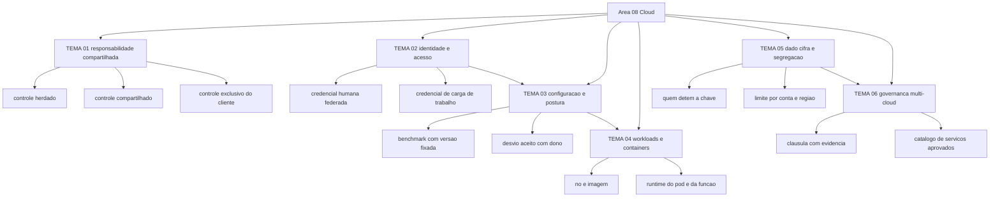

# Segurança em cloud

O NIST SP 800-145, publicado em setembro de 2011, fecha a definição de cloud computing em cinco
características essenciais, três modelos de serviço e quatro modelos de implantação. Cada um desses
números muda quem responde pelo controle: a matriz da Microsoft atribui ao cliente, em qualquer
modelo de implantação, os dados, os endpoints, as contas e a gestão de acesso; a página da AWS
separa segurança *of* the cloud, do provedor, de segurança *in* the cloud, do cliente, e diz que a
fatia do cliente é determinada pelos serviços que ele escolhe. Esta área trata dessa fronteira, da
configuração que a cruza e do contrato que a documenta.

## 1. Introdução

### 1.1 O que é esta área

Cloud é o modelo de acesso sob demanda a um pool compartilhado de recursos configuráveis, com
provisionamento rápido e mínimo esforço de gestão, conforme o NIST SP 800-145. Segurança em cloud
cobre seis decisões sobre esse modelo: onde termina a responsabilidade do provedor, como a
identidade é provada e autorizada dentro da conta, como o desvio de configuração é medido e
corrigido, o que sustenta a carga de trabalho e o contêiner, quem detém a chave do dado e como o
fornecedor é governado por contrato.

Fica fora desta área a criptografia como disciplina, que é o
[07-criptografia-segredos](../07-criptografia-segredos/README.md); o ciclo de vida da identidade
humana e o PAM, que são o [04-identidade-acesso](../04-identidade-acesso/README.md); a
classificação e a retenção do dado, que são o
[14-dados-privacidade](../14-dados-privacidade/README.md); a segurança do pipeline de software, que
é o [09-aplicacoes-devsecops](../09-aplicacoes-devsecops/README.md); e a operação da detecção, que é
o [10-operacoes-soc](../10-operacoes-soc/README.md). Aqui ficam a fronteira de responsabilidade, a
política da conta, o estado de configuração, a carga de trabalho e a cláusula contratual.

### 1.2 Por que isso importa para o CISO

O documento da Google Cloud sobre responsabilidade compartilhada, revisado em agosto de 2023,
declara que muitos incidentes de segurança em nuvem são resultado direto de configuração
incorreta. A mesma página admite que o modelo é difícil de aplicar, porque cada serviço tem perfil
de configuração próprio. O efeito prático na mesa do CISO é esse: a pergunta de auditoria raramente
é "o provedor é certificado"; é "quem configurou isso, com base em qual documento, e onde está o
registro".

O segundo efeito é de contrato e de evidência. A AWS diz que o cliente usa a documentação de
controle e conformidade do provedor para executar seus próprios procedimentos de avaliação e
verificação, e a Google classifica os controles herdados, como a cifra padrão, como itens que podem
compor a evidência de postura apresentada a auditor e regulador. Controle herdado que ninguém sabe
que herdou não entra em evidência nenhuma, e o trabalho de provar recai inteiro sobre um time que
não tem o artefato.

O terceiro efeito é de exposição contratual. O CCM da CSA, na versão 4.1, traz 197 control
objectives em 17 domínios e existe justamente para dizer qual ator da cadeia implementa cada
controle. Sem esse mapa, o questionário que um cliente envia vira negociação caso a caso, e a
resposta padrão da empresa passa a ser "seguimos as boas práticas do provedor".

### 1.3 O que você será capaz de fazer ao final

- Classificar cada controle do seu ambiente em herdado, compartilhado e exclusivo do cliente, com dono e evidência nomeados.
- Escrever a política de identidade de uma conta de nuvem, separando credencial humana federada de credencial de carga de trabalho.
- Fixar a versão de um benchmark de configuração por provedor e registrar o desvio aceito, com prazo e responsável.
- Definir o regime de correção e de hardening de nó, imagem e runtime de contêiner, declarando o que muda no serviço gerenciado.
- Decidir quem detém a chave de cada classe de dado e transformar a decisão em requisito de configuração e de contrato.
- Montar o anexo de segurança e privacidade de um contrato de nuvem, ligando cada cláusula a um controle e a um item de evidência.

### 1.4 Os temas desta área, em prosa

O [TEMA-01](TEMA-01-responsabilidade-compartilhada.md) trata da fronteira: o que o provedor herda,
o que é compartilhado e o que é só seu, com as matrizes dos três provedores como referência. O
[TEMA-02](TEMA-02-identidade-e-acesso-em-nuvem.md) trata da política da conta, onde a chave de
acesso de longa duração é o problema e a federação de identidade é a resposta. O
[TEMA-03](TEMA-03-configuracao-incorreta-e-gestao-de-postura.md) trata do estado de configuração:
benchmark versionado, desvio aceito e fila de correção. O
[TEMA-04](TEMA-04-workloads-e-containers.md) leva o mesmo regime para o nó, a imagem e o runtime do
contêiner e da função. O [TEMA-05](TEMA-05-dados-em-nuvem-criptografia-e-segregacao.md) trata de
quem detém a chave e onde o dado pode ficar. O
[TEMA-06](TEMA-06-governanca-multicloud-e-contrato.md) fecha o ciclo na cláusula contratual, no
catálogo de serviços aprovados e na evidência que sobrevive a uma auditoria de cliente.

## 2. Objetivos de aprendizagem (terminais)

| # | Objetivo | Bloom | Temas que o sustentam |
|---|---|---|---|
| 1 | Classificar os controles de um serviço de nuvem em herdados, compartilhados e exclusivos do cliente, atribuindo dono e evidência a cada linha. | aplicar | TEMA-01 |
| 2 | Escrever a política de identidade de uma conta, decidindo para cada credencial se ela é humana, de carga de trabalho ou de plataforma, com prazo de rotação. | criar | TEMA-02 |
| 3 | Construir a fila de correção de configuração, ligando cada desvio a um benchmark com versão, a um dono e a um prazo. | aplicar | TEMA-03 |
| 4 | Definir o regime de hardening de nó, imagem e runtime, justificando o que muda quando o serviço é gerenciado. | avaliar | TEMA-04 |
| 5 | Decidir a custódia da chave por classe de dado e escrever a decisão como requisito verificável. | avaliar | TEMA-05 |
| 6 | Montar o anexo de segurança e privacidade de um contrato de nuvem, com cláusula, controle e evidência mapeados. | criar | TEMA-06 |

## 3. Diagrama dos tópicos

## 4. Temas

| # | tema_id | Tema | Nível | Tempo |
|---|---|---|---|---|
| 1 | TEMA-01 | Modelo de responsabilidade compartilhada | intermediario | 30-40 min |
| 2 | TEMA-02 | Identidade e acesso em nuvem | intermediario | 35-45 min |
| 3 | TEMA-03 | Configuração incorreta e gestão de postura | intermediario | 35-45 min |
| 4 | TEMA-04 | Segurança de workloads e containers | avancado | 35-50 min |
| 5 | TEMA-05 | Dados em nuvem: criptografia e segregação | intermediario | 30-40 min |
| 6 | TEMA-06 | Governança multi-cloud e contrato | avancado | 35-45 min |

## 5. Pré-requisitos e sequência

O [01 Fundamentos](../01-fundamentos/README.md) fornece o vocabulário de ativo, controle e risco
residual. O [04 Identidade e acesso](../04-identidade-acesso/README.md) vem antes porque a política
da conta de nuvem é uma forma concreta do modelo de decisão de acesso. O
[07 Criptografia e segredos](../07-criptografia-segredos/README.md) vem antes porque a custódia de
chave em nuvem é um caso do ciclo de vida de chave, e não um assunto novo.

| Antes | Esta área | Depois |
|---|---|---|
| 01-fundamentos, 04-identidade-acesso, 07-criptografia-segredos | 08-cloud | 03-arquitetura-engenharia, 06-endpoint-plataforma, 09-aplicacoes-devsecops |

Dentro da área a sequência é sugestão. Quem já opera um provedor pode começar pelo TEMA-03 e voltar
ao TEMA-01 depois, porque a fila de correção só faz sentido quando a fronteira de responsabilidade
está escrita.

## 6. Certificações desta área

Apenas siglas e o que cada credencial usa desta área. Domínios, pesos e custo ficam em
[90-certificacoes/](../90-certificacoes/README.md).

| Certificação | Sigla | O que cobre aqui |
|---|---|---|
| ISC2 Certified Cloud Security Professional | CCSP | Arquitetura e fronteira de responsabilidade, identidade em nuvem, proteção de dado e operação; nomes de domínio NAO CONFIRMADO em fonte oficial nesta execução |
| CSA Certificate of Cloud Security Knowledge | CCSK | Vocabulário e domínios do CCM; nomes de domínio NAO CONFIRMADO em fonte oficial nesta execução |

Ver: [90-certificacoes/](../90-certificacoes/README.md).

## 7. Conexões com outras áreas

Relações de saída dos temas desta área que apontam para fora dela, agregadas do frontmatter
`relacoes`. A visão consolidada está em [mapa-relacoes.md](../mapa-relacoes.md); as regras, em
[templates/RELACOES-TEMAS.md](../templates/RELACOES-TEMAS.md). Alvos marcados como pendentes
ainda não foram escritos.

| Tema daqui | Relação | Destino | Por que |
|---|---|---|---|
| TEMA-01 | aplicado_em | 06-endpoint-plataforma#TEMA-06 | o modelo decide até onde a correção do sistema operacional convidado e da imagem é sua e a partir de onde o provedor responde |
| TEMA-02 | aplicado_em | 04-identidade-acesso#TEMA-06 | a política de identidade do provedor é onde a decisão por recurso do zero trust vira configuração executável |
| TEMA-02 | aprofundado_por | 04-identidade-acesso#TEMA-02 | aqui a autorização aparece como política do provedor; a mecânica de RBAC, ABAC e do modelo de decisão está na área 04 |
| TEMA-03 | aplicado_em | 09-aplicacoes-devsecops#TEMA-04 | a mesma checagem de configuração executada no pipeline evita que o desvio nasça no deploy |
| TEMA-03 | aplicado_em | 12-vulnerabilidades-threat-intel#TEMA-01 | a configuração desviante entra no inventário de exposição como item com dono e prazo, junto da vulnerabilidade de software |
| TEMA-04 | aplicado_em | 10-operacoes-soc#TEMA-02 | o log do plano de controle e o evento do runtime do contêiner são fontes de telemetria para a triagem |
| TEMA-04 | complementa | 06-endpoint-plataforma#TEMA-06 | a carga endurecida no host é a mesma que roda como contêiner ou instância em nuvem, com o mesmo problema de superfície |
| TEMA-05 | aplicado_em | 14-dados-privacidade#TEMA-03 | a cifra e a segregação decididas no desenho do dado em nuvem são executadas na retenção e no descarte |
| TEMA-05 | complementa | 07-criptografia-segredos#TEMA-04 | cifrar dado em nuvem depende de quem detém a chave e do ciclo de vida dela, e a décima segunda pergunta do fornecedor é quem consegue exportá-la |
| TEMA-05 | complementa | 16-ia-seguranca#TEMA-03 | conjunto de treino e índice vetorial vivem em armazenamento gerenciado, e quem detém a chave decide o que acontece com eles |
| TEMA-06 | aplicado_em | 02-governanca-risco-compliance#TEMA-02 | a exigência de segurança do fornecedor vira norma interna publicada, com escopo, responsável e critério verificável |
| TEMA-06 | complementa | 14-dados-privacidade#TEMA-05 | a transferência internacional só se materializa em cláusula contratual e anexo de garantias no contrato de nuvem |

## 8. Atividades práticas e laboratórios

| # | Atividade | O que a prática demonstra | Pré-requisito técnico |
|---|---|---|---|
| 1 | Escolher os três serviços de nuvem mais usados na empresa e classificar 10 controles de cada um em herdado, compartilhado e próprio | Onde a matriz oficial do provedor já responde e onde ela é omissa | nenhum |
| 2 | Listar todas as credenciais de longa duração da conta e a data do último uso | Quantas chaves sobreviveriam a um desligamento sem ninguém notar | leitura do console de identidade |
| 3 | Baixar o CIS Benchmark de fundação do provedor principal e marcar 20 itens, indicando dono e prazo | O desvio real entre a conta como ela é e a conta como deveria ser | benchmark baixado |
| 4 | Perguntar ao time quem responde pelo control plane do cluster gerenciado e quem responde pelo pod | Onde está a lacuna entre o que o provedor cobre e o que a empresa acha que ele cobre | nenhum |
| 5 | Levantar, para cada bucket ou contêiner de armazenamento, quem detém a chave e onde ela está custodiada | Se a resposta sobre cifra é operacional ou declarativa | inventário de armazenamento |
| 6 | Pedir ao jurídico a última versão do contrato de nuvem e procurar a cláusula de auditoria | Se existe direito de verificar controle ou apenas declaração de certificado | nenhum |

## 9. Checkpoint da área

Seis itens retirados dos temas, fora da ordem original. Responda antes de abrir o gabarito.

1. O provedor encerra o serviço do banco de dados gerenciado e afirma cobrir o sistema operacional. Qual linha da sua matriz muda de coluna, e por quê? (TEMA-01)
2. Um script de automação guarda uma chave de acesso em arquivo de configuração do repositório. Qual é a alternativa e o que ela exige do ambiente de execução? (TEMA-02)
3. A conta tem 900 achados de configuração e ninguém sabe qual corrigir primeiro. Qual é o critério que sobrevive a uma auditoria? (TEMA-03)
4. A imagem do contêiner roda com usuário root dentro do pod, sobre um nó gerenciado pelo provedor. Quem responde por cada parte? (TEMA-04)
5. A cifra em repouso é padrão do provedor e a chave é gerenciada por ele. Isso basta como resposta ao regulador? (TEMA-05)
6. O cliente pede direito de auditar as instalações do provedor. Qual é a resposta que o CCM e o contrato permitem oferecer? (TEMA-06)

Conferir respostas e critério

1. A linha do sistema operacional deixa de ser responsabilidade do cliente e passa para o provedor, segundo a matriz da Microsoft, que atribui o sistema operacional ao provedor em PaaS. O que continua com o cliente é configuração, dados, identidade e acesso. A migração muda a coluna, mas não move a linha de configuração.
2. A alternativa é credencial temporária obtida por federação: identidade de carga de trabalho assumindo papel, com o provedor entregando a credencial ao recurso de computação. Exige que o recurso tenha uma identidade própria e que a política de confiança aceite aquele emissor; sem isso, a chave estática volta pela porta dos fundos.
3. O critério é o identificador do benchmark com a versão fixada, o dono e o prazo declarado, mais a lista de desvios aceitos com justificativa. Contagem de achados sem versão de referência e sem dono não sustenta priorização nem decisão de verba.
4. O nó é do provedor, que opera a infraestrutura; o pod e a imagem são do cliente. Executar como root dentro do pod é decisão de configuração do cliente e não é coberta pela gestão do nó, salvo se o serviço gerenciado impuser o controle por padrão.
5. Não basta por si. A cifra padrão é controle herdado e pode compor evidência, mas quem responde pela adequação ao requisito regulatório é a organização, e a resposta precisa declarar quem detém a chave, onde ela é custodiada e qual é o processo de revogação.
6. A resposta padrão é o pacote de conformidade do provedor somado a um questionário respondido, como o CAIQ do CCM, e a evidência de auditoria de terceiro; auditoria direta em instalações raramente é oferecida. O que se negocia é a cláusula de notificação, a de subcontratado e a de saída.

Critério para seguir adiante: acertar 80% ou mais sem consultar os temas. Erro no item 1 ou no item 4 indica confusão sobre a fronteira; releia o TEMA-01 antes de seguir.

## 10. Termos desta área

Termos que o glossário central precisa conter; as definições ficam em [glossario.md](../glossario.md).

- cloud computing
- modelo de responsabilidade compartilhada
- controle herdado (inherited control)
- controle compartilhado (shared control)
- security of the cloud e security in the cloud
- infraestrutura como serviço (IaaS), plataforma como serviço (PaaS), software como serviço (SaaS)
- função como serviço (FaaS) e serverless
- multi-tenancy e pool de recursos
- conta de nuvem e organização
- política de identidade (identity policy) e política de recurso
- credencial temporária (temporary credential)
- federação de identidade de carga de trabalho (workload identity federation)
- chave de acesso de longa duração (long-term access key)
- guardrail e service control policy
- permissão efetiva (effective permission)
- privilégio excessivo (over-permission)
- postura de segurança (security posture)
- benchmark de configuração e versão fixada
- desvio de configuração (configuration drift)
- desvio aceito (accepted deviation)
- varredura de configuração em nuvem
- baseline de configuração
- container e imagem de container
- registro de imagem (image registry) e digest
- plano de controle (control plane)
- identidade de nó (node identity)
- chave gerenciada pelo cliente (customer-managed key)
- HSM e módulo validado
- envelope encryption e chave raiz (root key)
- residência de dado
- subcontratado (subprocessor) e cadeia de fornecedores
- direito de auditoria
- portabilidade e saída (exit)
- evidência de conformidade (compliance artifact)

## 11. Fontes verificadas

| # | Título | Tipo | URL | Acessado em | Confiança |
|---|---|---|---|---|---|
| 1 | NIST SP 800-145 — The NIST Definition of Cloud Computing, setembro de 2011, cinco características essenciais, três modelos de serviço e quatro modelos de implantação | primaria | https://csrc.nist.gov/pubs/sp/800/145/final | "2026-09-25" | alta |
| 2 | NIST SP 800-144 — Guidelines on Security and Privacy in Public Cloud Computing, dezembro de 2011, DOI 10.6028/NIST.SP.800-144 | primaria | https://csrc.nist.gov/pubs/sp/800/144/final | "2026-09-25" | alta |
| 3 | AWS — Shared Responsibility Model, com controles herdados, compartilhados e exclusivos do cliente e variação por serviço | primaria | https://aws.amazon.com/compliance/shared-responsibility-model/ | "2026-09-25" | alta |
| 4 | Microsoft Learn — Shared responsibility in the cloud, matriz por modelo de implantação, última atualização em 24/08/2026 | primaria | https://learn.microsoft.com/en-us/azure/security/fundamentals/shared-responsibility | "2026-09-25" | alta |
| 5 | Google Cloud — Shared responsibilities and shared fate, revisado em 21/08/2023, com declaração de que muitos incidentes resultam de configuração incorreta | primaria | https://cloud.google.com/architecture/framework/security/shared-responsibility-shared-fate | "2026-09-25" | alta |
| 6 | CSA — Cloud Controls Matrix v4.1, 197 control objectives em 17 domínios, com CAIQ e STAR Registry | primaria | https://cloudsecurityalliance.org/research/cloud-controls-matrix | "2026-09-25" | alta |
| 7 | ISO/IEC 27017:2015, edição 1, 30 páginas, retirada em 27/07/2026 e substituída por ISO/IEC 27017:2026 | primaria | https://www.iso.org/standard/43757.html | "2026-09-25" | alta |
| 8 | ISO/IEC 27018:2019, edição 2, 23 páginas, retirada em 26/08/2025 e substituída por ISO/IEC 27018:2025 | primaria | https://www.iso.org/standard/76559.html | "2026-09-25" | alta |
| 9 | CIS Benchmarks List, com versões de provedor de nuvem, inclusive Amazon Web Services Foundations 7.0.0 e Microsoft Azure Foundations 6.0.0 | primaria | https://www.cisecurity.org/cis-benchmarks | "2026-09-25" | alta |
| 10 | AWS Well-Architected Framework — Security Pillar, publicado em 6 de novembro de 2024, seis pilares | primaria | https://docs.aws.amazon.com/wellarchitected/latest/security-pillar/welcome.html | "2026-09-25" | alta |
| 11 | NIST SP 800-190 — Application Container Security Guide, setembro de 2017, DOI 10.6028/NIST.SP.800-190 | primaria | https://csrc.nist.gov/pubs/sp/800/190/final | "2026-09-25" | alta |
| 12 | AWS IAM — Security best practices in IAM, federação de usuário humano e credencial temporária para carga de trabalho | primaria | https://docs.aws.amazon.com/IAM/latest/UserGuide/best-practices.html | "2026-09-25" | alta |
| 13 | AWS KMS — visão geral, chaves protegidas por HSM validado em FIPS 140-3 nível 3, certificado 4884 | primaria | https://docs.aws.amazon.com/kms/latest/developerguide/overview.html | "2026-09-25" | alta |

Três lacunas desta execução ficam registradas. A página do guia de hardening de Kubernetes da
CISA não renderizou em leitura direta; a versão vigente desse documento está como
`NAO CONFIRMADO em fonte oficial` e não é citada em nenhum tema. Os nomes de domínio das
certificações CCSP e CCSK não foram conferidos nesta execução. A edição vigente das normas
ISO/IEC 27017 e ISO/IEC 27018 foi confirmada apenas pelo número da versão sucessora nas páginas
oficiais das edições retiradas.

---

| Navegação | |
|---|---|
| Anterior | [07 Criptografia e gestão de segredos](../07-criptografia-segredos/README.md) |
| Próximo | [03 Arquitetura e engenharia de segurança](../03-arquitetura-engenharia/README.md) |
| Home | [README](../README.md) |
