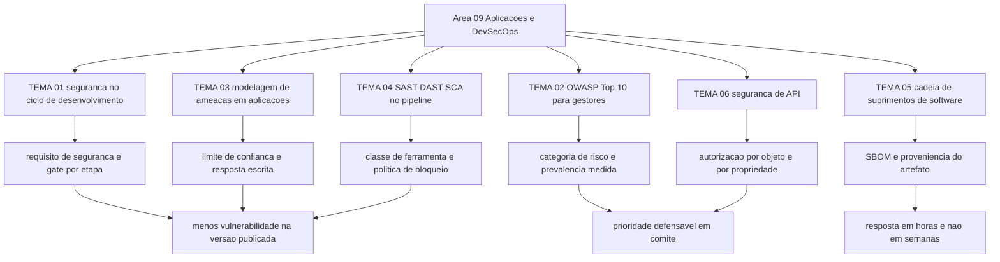

# Segurança de aplicações e DevSecOps

A edição 2025 do OWASP Top 10 é a oitava da série, cria duas categorias e coloca em terceiro lugar a falha da cadeia de suprimentos de software, que a comunidade votou como principal preocupação do ciclo; a categoria tem a menor ocorrência nos dados e a maior média de exploit e impacto entre os CVEs analisados ([top10.owasp.org](https://top10.owasp.org/2025/0x00_2025-Introduction/), acessado em 2026-09-25). Nenhuma dessas dez categorias se resolve com a compra de um produto: elas aparecem no processo de desenvolvimento, na revisão de dependência e no desenho da interface que o negócio publica.

## 1. Introdução

### 1.1 O que é esta área

Cobre o ciclo em que a aplicação nasce e muda: requisito, desenho, código, build, teste, publicação e correção. Estão dentro do escopo o processo de desenvolvimento seguro, o uso das listas de risco da OWASP como instrumento de gestão, a modelagem de ameaças de uma aplicação, as classes de ferramenta que rodam no pipeline, a cadeia de suprimentos de software e a superfície de API. Ficam fora: a arquitetura corporativa de controles (área 03), a segurança de rede e de container (áreas 05 e 08), a resposta a incidente (área 11) e o programa ofensivo (área 13).

### 1.2 Por que isso importa para o CISO

Em fevereiro de 2022 o NIST publicou a versão 1.1 do SSDF para inserir práticas de segurança em qualquer modelo de ciclo de vida, e a página oficial da publicação lista o Executive Order 14028 entre as normas e regulamentos relacionados ([csrc.nist.gov](https://csrc.nist.gov/pubs/sp/800/218/final), acessado em 2026-09-25). Esse vocabulário já chegou aos questionários de fornecedor e às cláusulas de contrato de clientes grandes. O CISO que não conseguir responder "onde está o registro da revisão de código desta versão" perde a diligência, mesmo tendo gasto em ferramenta.

Há um segundo efeito, de orçamento. A conta de scanner cresce com o número de repositórios e com a frequência de build; o passivo de exceção cresce junto e não aparece em nenhum relatório até a auditoria. Sem política escrita de gate e de prazo de correção, a decisão de liberar com achado crítico passa a ser tomada por quem tem pressa, e a assinatura do risco fica sem dono.

### 1.3 O que você será capaz de fazer ao final

- Descrever as etapas de um ciclo de desenvolvimento seguro e o artefato que cada etapa precisa produzir.
- Ler um relatório de achados de aplicação contra as dez categorias do OWASP Top 10:2025 e separar prevalência de risco próprio.
- Produzir o modelo de ameaças de um serviço e convertê-lo em requisitos verificáveis.
- Escrever a política de gates do pipeline, com critério de bloqueio e prazo de correção por severidade.
- Avaliar a exposição da cadeia de suprimentos a partir de um inventário de componentes.
- Escrever o escopo de verificação de uma API exposta, com controle por objeto e por propriedade.

### 1.4 Os temas desta área, em prosa

O [TEMA-01](TEMA-01-seguranca-no-ciclo-de-vida-de-desenvolvimento.md) trata da segurança como etapa de processo, com dono e evidência. O [TEMA-02](TEMA-02-owasp-top-10-para-gestores.md) ensina a ler o OWASP Top 10:2025 como documento de conscientização ordenado por prevalência medida, e não como lista de verificação. O [TEMA-03](TEMA-03-modelagem-de-ameacas-em-aplicacoes.md) leva a modelagem de ameaças para o nível da aplicação, onde o artefato vira requisito testável. O [TEMA-04](TEMA-04-sast-dast-sca-e-seguranca-no-pipeline.md) classifica SAST, DAST, SCA e varredura de segredo pelo que cada um encontra, e define o que bloqueia a entrega. O [TEMA-05](TEMA-05-gestao-de-dependencias-e-cadeia-de-suprimentos.md) trata dependência e cadeia de suprimentos como problema de inventário, com SBOM e proveniência. O [TEMA-06](TEMA-06-seguranca-de-api.md) fecha na superfície que mais cresce em exposição, a API, onde a autorização por objeto e por propriedade decide o resultado.

## 2. Objetivos de aprendizagem (terminais)

| # | Objetivo | Bloom | Temas que o sustentam |
|---|---|---|---|
| 1 | Descrever as etapas de um ciclo de desenvolvimento seguro e o artefato que cada etapa precisa produzir, com dono e critério de saída. | entender | TEMA-01 |
| 2 | Explicar as dez categorias do OWASP Top 10:2025 e o método de ordenação da edição, distinguindo prevalência medida de risco da própria aplicação. | entender | TEMA-02 |
| 3 | Produzir um modelo de ameaças de uma aplicação, com fluxo de dados, limites de confiança marcados, respostas escritas e requisitos testáveis. | aplicar | TEMA-03 |
| 4 | Definir a política de gates de um pipeline, indicando a classe de ferramenta, o que bloqueia a entrega e o prazo de correção por severidade. | criar | TEMA-04 |
| 5 | Avaliar a exposição da cadeia de suprimentos de software, a partir de um inventário de componentes e de um critério de aceite para fornecedor. | avaliar | TEMA-05 |
| 6 | Escrever o escopo de verificação de uma API exposta, com controle de autorização por objeto e por propriedade e inventário de versões. | criar | TEMA-06 |

## 3. Diagrama dos tópicos

## 4. Temas

| # | tema_id | Tema | Nível | Tempo |
|---|---|---|---|---|
| 1 | TEMA-01 | Segurança no ciclo de vida de desenvolvimento | intermediario | 40-50 min |
| 2 | TEMA-02 | OWASP Top 10 para gestores | base | 30-40 min |
| 3 | TEMA-03 | Modelagem de ameaças em aplicações | intermediario | 35-45 min |
| 4 | TEMA-04 | SAST, DAST, SCA e segurança no pipeline | intermediario | 40-50 min |
| 5 | TEMA-05 | Gestão de dependências e cadeia de suprimentos de software | intermediario | 35-45 min |
| 6 | TEMA-06 | Segurança de API | avancado | 40-50 min |

## 5. Pré-requisitos e sequência

A área 03 fornece o requisito não funcional e o método de modelagem que aqui são aplicados a uma aplicação; a área 01 fornece o vocabulário de superfície de ataque. Sair daqui leva a log e detecção na área 10, a gestão de vulnerabilidade na área 12 e a resposta a incidente na área 11.

| Antes | Esta área | Depois |
|---|---|---|
| 01-fundamentos, 03-arquitetura-engenharia | 09-aplicacoes-devsecops | 10-operacoes-soc, 11-resposta-forense, 12-vulnerabilidades-threat-intel |

## 6. Certificações desta área

| Certificação | Sigla | O que cobre aqui |
|---|---|---|
| Certified Secure Software Lifecycle Professional | CSSLP | TEMA-01 e TEMA-03 |
| Offensive Security Web Expert | OSWE | TEMA-03 e TEMA-06, do lado ofensivo |

Ver: [90-certificacoes/](../90-certificacoes/README.md).

NAO CONFIRMADO em fonte oficial nesta execução: os domínios de exame e os pesos do CSSLP e do OSWE não foram conferidos. Os detalhes da credencial pertencem a `90-certificacoes/`.

## 7. Conexões com outras áreas

Relações de saída dos temas desta área que apontam para fora dela, agregadas do frontmatter
`relacoes`. A visão consolidada está em [mapa-relacoes.md](../mapa-relacoes.md); as regras, em
[templates/RELACOES-TEMAS.md](../templates/RELACOES-TEMAS.md). Alvos marcados como pendentes
ainda não foram escritos.

| Tema daqui | Relação | Destino | Por que |
|---|---|---|---|
| TEMA-01 | aplicado_em | 02-governanca-risco-compliance#TEMA-04 | o processo de desenvolvimento verificado é o que o sistema de gestão registra como evidência de controle e o que aparece na auditoria de certificação |
| TEMA-01 | aplicado_em | 03-arquitetura-engenharia#TEMA-05 | o requisito não funcional aprovado é o critério que o ciclo de desenvolvimento verifica a cada entrega; a área 03 declara a mesma relação com o mesmo tipo |
| TEMA-02 | aplicado_em | 12-vulnerabilidades-threat-intel#TEMA-01 | as categorias de risco de aplicação são o que a gestão de vulnerabilidades precisa triar primeiro |
| TEMA-03 | aplicado_em | 03-arquitetura-engenharia#TEMA-02 | o método de modelagem descrito na área 03 é aplicado aqui ao desenho de uma aplicação dentro do ciclo de desenvolvimento; a área 03 declara a mesma relação com o mesmo tipo |
| TEMA-04 | nao_confundir_com | 16-ia-seguranca#TEMA-05 | regra determinística no pipeline e modelo probabilístico na triagem produzem vereditos de natureza diferente e não se substituem; destino planejado |
| TEMA-05 | aplicado_em | 07-criptografia-segredos#TEMA-06 | o inventário criptográfico é o mesmo tipo de artefato que o inventário de dependências e sai do mesmo build; a área 07 declara a mesma relação com o mesmo tipo |
| TEMA-06 | aplicado_em | 04-identidade-acesso#TEMA-02 | o modelo de decisão de autorização vira escopo de token e verificação por objeto na API; a área 04 declara a mesma relação com o mesmo tipo |

## 8. Atividades práticas e laboratórios

| # | Atividade | O que a prática demonstra | Pré-requisito técnico |
|---|---|---|---|
| 1 | Pedir os artefatos da última versão publicada e montar a tabela etapa por etapa do TEMA-01 | onde o processo existe e onde existe só a intenção | nenhum |
| 2 | Classificar os 20 achados mais recentes nas dez categorias do Top 10:2025 | a diferença entre prevalência do setor e risco da sua aplicação | nenhum |
| 3 | Conduzir uma sessão de modelagem de ameaças de 90 minutos com o dono de um serviço | o artefato e a discussão que ele gera | nenhum |
| 4 | Extrair a contagem de achados por severidade dos últimos quatro trimestres | se o passivo está caindo ou apenas mudando de ferramenta | acesso ao painel do scanner |
| 5 | Pedir a lista de componentes da última release de um serviço | se a resposta existe em horas ou em semanas | build com geração de SBOM |
| 6 | Levantar quantos endpoints de API estão publicados e quantos têm dono | o tamanho da superfície invisível | acesso ao gateway ou à documentação |

## 9. Checkpoint da área

Avaliação somativa e intercalada. Os itens vêm das seções de recuperação ativa dos temas e a ordem aqui não segue a ordem dos temas.

1. O que distingue a categoria A03:2025 da categoria A06:2021 que ela expande? (TEMA-05)
2. Qual categoria do Top 10 subiu da posição 5 em 2021 para a posição 2 em 2025, e que percentual de aplicações testadas apresentou ao menos uma das 16 CWEs dela? (TEMA-02)
3. Qual risco ocupa a posição API1:2023 e por que ele é um problema de autorização, e não de autenticação? (TEMA-06)
4. Na trilha de build do SLSA, o que separa Build L1, Build L2 e Build L3? (TEMA-04)
5. Quais três resultados o SSDF declara perseguir, segundo o resumo do NIST? (TEMA-01)
6. O que a categoria A06:2025 registra sobre a evolução da modelagem de ameaças na indústria? (TEMA-03)

Conferir respostas e critério

1. A03:2025 é uma expansão de A06:2021 Vulnerable and Outdated Components para abranger falhas dentro e ao longo de todo o ecossistema de dependências, sistemas de build e infraestrutura de distribuição; tem 5 CWEs, a menor ocorrência nos dados coletados e a maior média de exploit e impacto entre os CVEs analisados.
2. A02:2025 Security Misconfiguration, com 3,00% das aplicações testadas apresentando ao menos uma das 16 CWEs da categoria.
3. API1:2023 Broken Object Level Authorization. O token prova quem é o cliente; a falha está em não verificar se aquele cliente pode operar sobre o identificador de objeto que enviou, o que exige checagem de autorização em cada função que acessa dado por identificador vindo do usuário.
4. Build L1 exige que exista proveniência descrevendo como o artefato foi construído; Build L2 exige proveniência assinada, gerada por plataforma de build hospedada; Build L3 exige plataforma de build endurecida, que impede execuções de influenciarem umas às outras e impede que o material de assinatura fique acessível ao passo de build definido pelo usuário.
5. Reduzir o número de vulnerabilidades na versão publicada, mitigar o impacto potencial da exploração de vulnerabilidades não detectadas ou não tratadas, e endereçar as causas raiz para evitar recorrência.
6. Que a categoria foi introduzida em 2021 e que a indústria mostrou melhoras perceptíveis relacionadas a modelagem de ameaças e a maior ênfase em desenho seguro.

Critério para seguir adiante: acertar 80% ou mais sem consultar os temas. Erro no item 1 ou no item 3 exige releitura do TEMA-05 e do TEMA-06 antes de avançar.

## 10. Termos desta área

- ciclo de vida de desenvolvimento de software (SDLC)
- gate de segurança
- caso de abuso
- modelagem de ameaças
- limite de confiança
- OWASP Top 10
- ASVS
- SSDF
- SAST
- DAST
- SCA
- varredura de segredo
- SBOM
- VEX
- proveniência de build
- SLSA
- dependência transitiva
- Broken Object Level Authorization (BOLA)
- inventário de API

## 11. Fontes verificadas

| # | Título | Tipo | URL | Acessado em | Confiança |
|---|---|---|---|---|---|
| 1 | OWASP Top 10:2025 — Introduction | primaria | https://top10.owasp.org/2025/0x00_2025-Introduction/ | "2026-09-25" | alta |
| 2 | OWASP ASVS 5.0.0, versão estável de maio de 2025 | primaria | https://github.com/OWASP/ASVS | "2026-09-25" | alta |
| 3 | NIST SP 800-218, SSDF Version 1.1, fevereiro de 2022 | primaria | https://csrc.nist.gov/pubs/sp/800/218/final | "2026-09-25" | alta |
| 4 | OWASP API Security Top 10, edição 2023 | primaria | https://owasp.org/API-Security/editions/2023/en/0x11-t10/ | "2026-09-25" | alta |
| 5 | SLSA — níveis da trilha de build | primaria | https://slsa.dev/spec/v1.1/levels | "2026-09-25" | alta |
| 6 | CycloneDX — Specification Overview, versão 1.7 | primaria | https://cyclonedx.org/specification/overview/ | "2026-09-25" | alta |
| 7 | SPDX — Specifications, ISO/IEC 5962:2021 | primaria | https://spdx.dev/use/specifications/ | "2026-09-25" | alta |

NAO CONFIRMADO em fonte oficial nesta execução: a data de publicação da edição 2025 do OWASP Top 10 (um veículo secundário informa 6 de novembro de 2025; a página oficial da edição não traz essa data na leitura feita); a existência de edição posterior a 2023 do OWASP API Security Top 10, já que a página de índice de edições devolveu erro 404 e a página do projeto não declara a edição corrente; a contagem de CWEs das categorias A06 e A08 da edição 2025; os identificadores e nomes dos grupos de prática do SSDF, que vivem na tabela publicada como planilha suplementar na página da publicação; e os domínios de exame do CSSLP e do OSWE.

---

| Navegação | |
|---|---|
| Anterior | [12 Gestão de vulnerabilidades e threat intelligence](../12-vulnerabilidades-threat-intel/README.md) |
| Próximo | [13 Segurança ofensiva](../13-ofensiva-pentest/README.md) |
| Home | [README](../README.md) |
