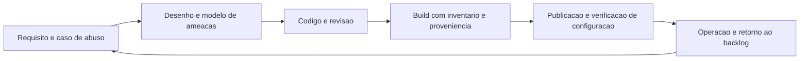

# Segurança no ciclo de vida de desenvolvimento

Uma ideia central: segurança de desenvolvimento é um conjunto de etapas com dono, artefato e critério de saída dentro do fluxo que já existe — e o artefato nasce do trabalho, não da preparação para auditoria.

## 1. Objetivo de aprendizagem

Ao final deste tema você deve conseguir: descrever as etapas de um ciclo de desenvolvimento seguro e o artefato que cada etapa precisa produzir, com dono nomeado e critério de saída, usando o vocabulário do SSDF e do ASVS.

## 2. Pré-requisitos

Nenhum. O requisito não funcional e o desenho seguro vêm do [TEMA-05 da área 03](../03-arquitetura-engenharia/TEMA-05-seguranca-por-design-requisitos-nao-funcionais.md), e a ligação com o sistema de gestão está no [TEMA-04 da área 02](../02-governanca-risco-compliance/TEMA-04-isms-iso-27001.md).

## 3. Pré-teste

Responda de palpite, antes de ler o resto. Anote a confiança de 1 a 5.

1. Quem revisa o código de segurança na última versão que a sua empresa publicou?
   Confiança: ___
2. Em que momento do fluxo alguém verifica se o requisito de segurança foi atendido?
   Confiança: ___
3. O que precisa existir no repositório para provar que uma correção de falha entrou na versão publicada?
   Confiança: ___
4. Se um cliente perguntar se a empresa segue o SSDF do NIST, o que você responde com documento na mão?
   Confiança: ___

## 4. Caso real

Em fevereiro de 2022 o NIST publicou a versão 1.1 do Secure Software Development Framework, com o argumento de que poucos modelos de ciclo de vida tratam segurança de software em detalhe e que as práticas de segurança precisam ser adicionadas a cada modelo de ciclo de vida; o mesmo resumo diz que o conjunto de práticas serve de vocabulário comum para compradores e consumidores de software negociarem com fornecedor ([csrc.nist.gov](https://csrc.nist.gov/pubs/sp/800/218/final), acessado em 2026-09-25). A página da publicação lista o Executive Order 14028 entre as normas relacionadas e traz o SP 800-218A como parte.

O efeito prático chegou aos questionários. Uma empresa que responde "seguimos boas práticas de mercado" cai no mesmo lugar de quem responde "temos política aprovada": nenhuma das duas respostas tem artefato. A pergunta que o caso deixa aberta é o que exatamente deve existir para transformar intenção em prova.

## 5. Conteúdo

### 5.1 Conceito

O SSDF 1.1 é um núcleo de práticas de alto nível que se integram a qualquer implementação de ciclo de vida. O resumo do NIST declara três resultados a perseguir: reduzir o número de vulnerabilidades na versão publicada, mitigar o impacto potencial da exploração de vulnerabilidades não detectadas ou não tratadas, e endereçar as causas raiz para evitar recorrência ([csrc.nist.gov](https://csrc.nist.gov/pubs/sp/800/218/final), acessado em 2026-09-25). Ler os três juntos muda a prioridade: o segundo exige detecção e resposta, o terceiro exige análise depois do incidente, e a maior parte dos programas só financia o primeiro.

O ASVS 5.0.0, versão estável de maio de 2025, foi lançada no Global AppSec EU Barcelona 2025 e define requisitos para projetar, desenvolver e testar aplicações web e serviços web. Cada requisito tem identificador no formato capítulo, seção e número, e a própria documentação recomenda citar a versão junto do identificador, como `v5.0.0-1.2.5`, porque os identificadores mudam entre versões ([github.com/OWASP/ASVS](https://github.com/OWASP/ASVS), acessado em 2026-09-25). Esse detalhe é de gestão: um requisito citado sem versão não pode ser auditado dois anos depois.

Segurança no ciclo é uma cadeia de artefatos, não uma sequência de opiniões. Requisito gera caso de abuso, caso de abuso gera modelo de ameaças, modelo gera requisito testável, requisito testável gera caso de teste, caso de teste gera registro de execução, registro de execução alimenta a decisão de publicar. Quebrar a cadeia em qualquer ponto devolve a decisão para a intuição.

### 5.2 Como funciona

Cinco pontos de controle cobrem a maior parte do risco de aplicação, e cada um tem dono e saída.

**Requisito e caso de abuso.** O requisito funcional descreve o que o sistema faz; o caso de abuso descreve como alguém usa a função contra o interesse da empresa. Dono: analista de negócio com apoio de segurança. Saída: requisito de segurança escrito na mesma ferramenta em que vive o requisito funcional, com identificador.

**Desenho.** O modelo de ameaças da aplicação produz as decisões de desenho e a lista de ameaças com resposta. Dono: arquiteto ou tech lead, com a sessão conduzida por segurança. Saída: diagrama, ameaças com resposta e requisitos testáveis, com data de revisão. O desenvolvimento deste artefato está no [TEMA-03](TEMA-03-modelagem-de-ameacas-em-aplicacoes.md).

**Código.** A revisão por par precisa de um item de segurança na definição de pronto, e a varredura automática de código e de segredo roda na mudança, não no fim do sprint. Dono: time de desenvolvimento. Saída: registro de revisão e resultado de varredura anexado à mudança.

**Build.** O build produz o artefato que será publicado, e é o único momento em que se pode carimbar origem e conteúdo sem depender de memória. Dono: plataforma ou DevOps. Saída: inventário de componentes da versão e proveniência do build, tratados no [TEMA-04](TEMA-04-sast-dast-sca-e-seguranca-no-pipeline.md) e no [TEMA-05](TEMA-05-gestao-de-dependencias-e-cadeia-de-suprimentos.md).

**Publicação e operação.** O teste dinâmico roda contra o ambiente que se parece com produção, e a configuração é verificada como código. Dono: operação com o time de produto. Saída: resultado do teste na versão candidata e registro de exceções aceitas, com prazo.

Duas escolhas decidem se o processo sobrevive. A primeira é onde o gate bloqueia: bloquear na linha principal protege o que vai a produção; bloquear em toda mudança pequena gera fila e contorno. A segunda é quem assina a exceção: exceção aceita por quem tem pressa e não tem risco na carreira vira regra em três meses.

### 5.3 Exemplo resolvido

Função nova: "exportar a base de clientes para o time de campanha" em um sistema interno.

Passo 1, caso de abuso. Funcional: o analista exporta a carteira dele. Abuso: um analista com acesso legítimo exporta a base inteira em cinco madrugadas e leva o arquivo. Requisito que nasce: exportação limitada à carteira do usuário, com limite de volume por hora e registro de auditoria por evento.

Passo 2, desenho. O modelo de ameaças pergunta o que pode dar errado em cada limite de confiança. Achados típicos: a consulta usa um filtro de carteira que a aplicação aplica no cliente e não no servidor; o arquivo gerado fica no armazenamento temporário sem prazo de expiração; o log registra a exportação sem o identificador da carteira.

Passo 3, requisito testável. "A exportação devolve somente registros cuja carteira está atribuída ao usuário autenticado, verificado no servidor; o arquivo expira em 24 horas; cada exportação registra usuário, carteira, volume e horário." O caso de teste tenta exportar a carteira de outro analista e espera negação.

Passo 4, código e build. A mudança entra com o teste acima na esteira, o log de auditoria é validado no teste de integração, e o build carimba o inventário de componentes da versão que contém a correção.

Passo 5, publicação e operação. Antes de publicar em produção, o alerta de "exportação acima do limite" é testado no ambiente de homologação com volume simulado, porque alerta nunca disparado não é alerta.

O que o exemplo mostra: cinco artefatos produzidos pelo trabalho normal, cada um verificável por quem não estava na conversa. Nenhum deles é um documento escrito para o auditor.

### 5.4 Problema de completar

Caso novo: cadastro de beneficiário em um plano de saúde, com integração a uma operadora, prazo de entrega de 6 semanas e time de 4 pessoas. A diretoria quer aprovar o lançamento sem revisão de segurança para não atrasar.

1. Requisito de segurança para o cadastro, escrito em uma frase verificável: ______
2. Caso de abuso correspondente, em uma frase: ______
3. Artefato de desenho que você exigiria antes do código e quem o produz: ______
4. Duas etapas de verificação que caem no pipeline, e o que cada uma procura: ______
5. O que fica registrado quando o lançamento é aprovado com um achado crítico pendente, e quem assina: ______

Regra de conferência: se a resposta do item 5 não tiver nome de pessoa, data de reavaliação e o risco descrito em termos de negócio, a decisão não passou de um acordo verbal.

## 6. Por que isso importa para o CISO

Um processo com artefato muda a negociação de prazo. Quando o time pede para publicar com exceção, o CISO apresenta a lista de achados sem tratamento, o nome de quem aceita e a data de reavaliação; sem esse registro, a discussão vira opinião contra cronograma, e o cronograma ganha quase sempre.

Muda também o custo da conformidade. O mesmo conjunto de artefatos serve para o controle do sistema de gestão da [área 02](../02-governanca-risco-compliance/TEMA-04-isms-iso-27001.md), para o questionário do cliente que cita o SSDF e para a apuração interna depois de um incidente. Montar evidência três vezes custa o triplo; colher no processo custa o processo mais um pouco de disciplina de registro.

O terceiro efeito é sobre o orçamento. Exceção sem prazo é dívida invisível: ninguém sabe quantas estão abertas, nenhuma aparece no relatório, e todas reaparecem na auditoria. Exceção com prazo e dono vira uma linha de gestão, com número que o CISO consegue reduzir e mostrar ao board.

## 7. Aplicação prática

Escolha a última versão publicada do sistema mais importante da empresa e monte, em uma página, a tabela abaixo. Não peça opinião: peça o arquivo.

| Etapa | Dono | Artefato da última versão | Onde está | Se não existe, o que fazer |
|---|---|---|---|---|
| Requisito e caso de abuso | ______ | ______ | ______ | ______ |
| Desenho | ______ | ______ | ______ | ______ |
| Código e revisão | ______ | ______ | ______ | ______ |
| Build | ______ | ______ | ______ | ______ |
| Publicação e configuração | ______ | ______ | ______ | ______ |

Depois leve a tabela a uma reunião de 30 minutos com o dono do serviço e escolha uma etapa para instrumentar no próximo ciclo. Uma etapa instrumentada com registro vale mais que seis etapas prometidas.

## 8. Autoexplicação

Explique em três frases por que o artefato importa mais que o discurso. Conecte ao seu dia: cite uma aprovação recente da qual você participou e diga qual arquivo comprova a decisão tomada ali.

## 9. Erros comuns e equívocos

| Equívoco | Por que está errado | O que é correto |
|---|---|---|
| Segurança é a fase de teste antes do lançamento | O custo de correção cresce a cada etapa e o teste final não vê decisão de desenho | Distribuir verificação por etapa, com o teste final como confirmação |
| Ter política de desenvolvimento seguro equivale a praticá-lo | Política é intenção; delegação sem artefato não é evidência | Exigir o registro da revisão e da varredura de cada versão |
| O SSDF é um framework a ser implantado por completo antes de produzir efeito | Ele é um núcleo de práticas de alto nível que se integra ao modelo de ciclo de vida existente | Escolher as práticas que atacam as causas raiz dos seus achados e instrumentá-las |
| Citar requisito sem versão é suficiente | Os identificadores mudam entre versões do padrão e a citação fica impossível de auditar | Citar com versão, no formato usado pelo ASVS, como v5.0.0-1.2.5 |
| Todos os gates devem bloquear para ter efeito | Gate que bloqueia tudo atrasa a entrega, gera pedido de exceção e acaba desativado | Definir o que bloqueia onde, e registrar o que apenas alerta |
| Exceção aceita é decisão técnica | Sem dono de risco e prazo, a exceção vira regra permanente | Exceção com dono, justificativa, prazo e reavaliação registrados |

## 10. Recuperação ativa

Responda tudo antes de abrir o gabarito.

1. Quais três resultados o SSDF declara perseguir, segundo o resumo do NIST?
2. Qual é a versão estável corrente do ASVS, quando foi lançada e por que a documentação recomenda citar a versão junto do identificador do requisito?
3. Qual a diferença entre requisito funcional, caso de abuso e requisito de segurança?
4. Em que etapa do fluxo a proveniência do build é produzida e por que ela não pode ser reconstruída depois sem custo?
5. Por que um gate que bloqueia toda mudança pequena tende a ser desativado em poucos meses?
6. Cite três itens que um questionário de fornecedor baseado em práticas de desenvolvimento seguro costuma cobrar, e o artefato que responde a cada um.

Conferir respostas

1. Reduzir o número de vulnerabilidades na versão publicada; mitigar o impacto potencial da exploração de vulnerabilidades não detectadas ou não tratadas; endereçar as causas raiz para evitar recorrência.
2. ASVS 5.0.0, versão estável datada de maio de 2025, lançada no Global AppSec EU Barcelona 2025. A recomendação de citar a versão existe porque os identificadores podem mudar entre versões; o formato sugerido é `v5.0.0-1.2.5`.
3. O requisito funcional descreve o que o sistema faz; o caso de abuso descreve como a função pode ser usada contra o interesse da empresa; o requisito de segurança é a exigência verificável que nasce do caso de abuso e pode ser testada.
4. No build. Fora dele, a informação sobre o que foi compilado, com quais entradas e por qual processo, já não está disponível de forma confiável, e reconstruí-la exige investigar histórico e máquina.
5. Porque cria fila, atrasa entrega e transforma o pedido de exceção em rotina; o processo perde autoridade e o controle é removido por decisão informal.
6. Entre outros: revisão de código e análise estática, com o registro da mudança; inventário de componentes e tratamento de dependência vulnerável, com o SBOM da versão; e tratamento de falha encontrada no teste, com o registro da correção e a prova de que entrou na versão publicada.

## 11. Revisão espaçada

| Intervalo | O que fazer | Se errar |
|---|---|---|
| D+1 | Listar os três resultados do SSDF e os cinco pontos de controle | Rebaixar: repetir em D+1 |
| D+7 | Preencher a tabela de artefatos da última versão de outro serviço | Rebaixar: repetir em D+3 |
| D+30 | Escolher uma etapa sem artefato e instrumentá-la, medindo o registro gerado em um ciclo | Rebaixar: repetir em D+7 |

## 12. Conexões com outros temas

Leitura humana do `relacoes` do frontmatter — que é a fonte. Relações que saem desta área
também aparecem em [mapa-relacoes.md](../mapa-relacoes.md). Regras em
[templates/RELACOES-TEMAS.md](../templates/RELACOES-TEMAS.md).

| Relação | Alvo | Por que |
|---|---|---|
| aplicado_em | 02-governanca-risco-compliance#TEMA-04 | o processo de desenvolvimento verificado é o que o sistema de gestão registra como evidência de controle e o que aparece na auditoria de certificação |
| aplicado_em | 03-arquitetura-engenharia#TEMA-05 | o requisito não funcional aprovado é o critério que o ciclo de desenvolvimento verifica a cada entrega; a área 03 declara a mesma relação com o mesmo tipo |

## 13. Certificações e leitura recomendada

| Certificação | Domínio coberto | Recurso | Tipo | Fonte |
|---|---|---|---|---|
| CSSLP | Ciclo de vida de desenvolvimento seguro e requisito de segurança | Índice de certificações do roadmap | secundaria | [90-certificacoes/](../90-certificacoes/README.md) |

Leitura recomendada: [NIST SP 800-218, SSDF 1.1, com a tabela de práticas em planilha suplementar](https://csrc.nist.gov/pubs/sp/800/218/final); [OWASP ASVS 5.0.0, requisitos verificáveis para projeto, desenvolvimento e teste](https://github.com/OWASP/ASVS).

## 14. Fontes verificadas

| # | Título | Tipo | URL | Acessado em | Confiança |
|---|---|---|---|---|---|
| 1 | NIST SP 800-218, SSDF Version 1.1, fevereiro de 2022, DOI 10.6028/NIST.SP.800-218 | primaria | https://csrc.nist.gov/pubs/sp/800/218/final | "2026-09-25" | alta |
| 2 | OWASP ASVS 5.0.0, versão estável de maio de 2025, lançada no Global AppSec EU Barcelona 2025 | primaria | https://github.com/OWASP/ASVS | "2026-09-25" | alta |
| 3 | OWASP Top 10:2025 — Introduction, 248 CWEs em 10 categorias | primaria | https://top10.owasp.org/2025/0x00_2025-Introduction/ | "2026-09-25" | alta |

NAO CONFIRMADO em fonte oficial nesta execução: os identificadores e os nomes dos grupos de prática do SSDF, que ficam na planilha suplementar publicada na página da publicação e não foram lidos; o texto da cláusula do Executive Order 14028 sobre desenvolvimento seguro, cuja associação à publicação foi confirmada apenas pela lista de normas relacionadas; e os domínios de exame do CSSLP e do OSWE.

---

| Navegação | |
|---|---|
| Área | [09 Segurança de aplicações e DevSecOps](./README.md) |
| Próximo tema | [TEMA-02](TEMA-02-owasp-top-10-para-gestores.md) |
| Home | [README](../README.md) |
