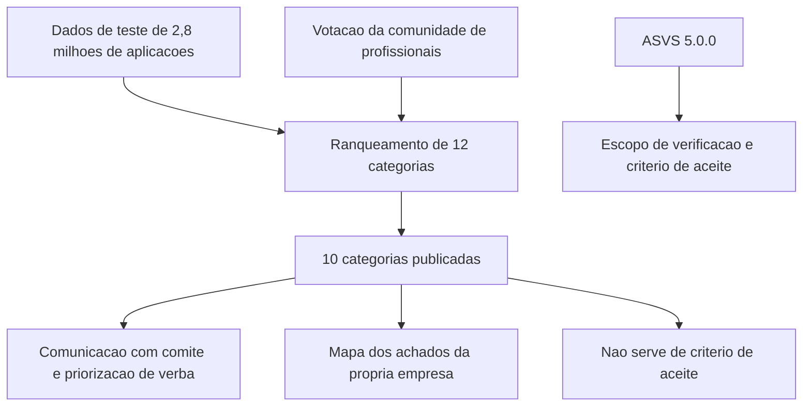

# OWASP Top 10 para gestores

Uma ideia central: o Top 10 é um documento de conscientização ordenado por prevalência medida em uma amostra do setor — serve para comunicar risco e priorizar conversa, e não mede a segurança da sua aplicação.

## 1. Objetivo de aprendizagem

Ao final deste tema você deve conseguir: explicar as dez categorias do OWASP Top 10:2025 e o método que as ordenou, e classificar um relatório de achados da sua empresa nessas categorias, dizendo em cada caso o que é prevalência do setor e o que é risco da sua aplicação.

## 2. Pré-requisitos

O [TEMA-01](TEMA-01-seguranca-no-ciclo-de-vida-de-desenvolvimento.md) vem antes, porque a lista só produz efeito quando existe processo que trate o achado.

## 3. Pré-teste

Responda de palpite, antes de ler o resto. Anote a confiança de 1 a 5.

1. Se o board perguntasse hoje quais são os três riscos mais prováveis nas aplicações da empresa, o que você responderia? Escreva antes de seguir.
   Confiança: ___
2. Dos três riscos que você listou, qual você acha que já causou incidente na empresa nos últimos dois anos?
   Confiança: ___
3. Ao receber um relatório de varredura, o que você olha primeiro: a quantidade de achados, a categoria de cada um ou quem é o dono de cada linha?
   Confiança: ___

## 4. Caso real

A edição 2025 é a oitava da série. O documento declara o método sem rodeio: doze categorias foram ranqueadas a partir dos dados contribuídos, e apenas oito entraram por dado; as outras duas foram promovidas pela votação da comunidade em um levantamento com profissionais de campo, porque "examinar os dados contribuídos é essencialmente olhar para o passado" e testes que ainda não existem em escala não aparecem em amostra nenhuma ([top10.owasp.org](https://top10.owasp.org/2025/0x00_2025-Introduction/), acessado em 2026-09-25). O material veio de mais de 2,8 milhões de aplicações e de aproximadamente 175 mil registros de CVE mapeados a CWEs.

O caso que se repete em comitê: um fornecedor entrega relatório de pentest cujos achados estão rotulados com a taxonomia de 2021, e alguém pergunta se a empresa está "no Top 10". A pergunta que fica aberta é o que uma lista de prevalência do setor permite afirmar sobre a sua aplicação — e o que ela não permite.

## 5. Conteúdo

### 5.1 Conceito

O Top 10 é um documento de conscientização, mantido pela OWASP, que ordena riscos de aplicação web por prevalência. A edição 2025 concentra 248 CWEs em dez categorias, dentro de um dicionário MITRE de 968 CWEs na data do lançamento, e analisou 589 CWEs no conjunto de dados ([top10.owasp.org](https://top10.owasp.org/2025/0x00_2025-Introduction/), acessado em 2026-09-25). A unidade de medida é a aplicação: conta-se quantas aplicações testadas apresentaram ao menos uma instância de alguma CWE da categoria, e a frequência de repetição dentro da mesma aplicação é ignorada de propósito.

As dez categorias da edição 2025, na ordem publicada:

| Posição | Categoria | Movimento em relação a 2021 |
|---|---|---|
| A01:2025 | Broken Access Control | Mantém a primeira posição |
| A02:2025 | Security Misconfiguration | Sobe da 5ª para a 2ª |
| A03:2025 | Software Supply Chain Failures | Nova, expandindo Vulnerable and Outdated Components |
| A04:2025 | Cryptographic Failures | Cai da 2ª para a 4ª |
| A05:2025 | Injection | Cai da 3ª para a 5ª |
| A06:2025 | Insecure Design | Cai da 4ª para a 6ª |
| A07:2025 | Authentication Failures | Mantém a 7ª, com mudança de nome |
| A08:2025 | Software or Data Integrity Failures | Mantém a 8ª |
| A09:2025 | Security Logging & Alerting Failures | Mantém a 9ª, com mudança de nome |
| A10:2025 | Mishandling of Exceptional Conditions | Nova |

Duas mudanças de nome carregam decisão. A07 deixou de se chamar Identification and Authentication Failures para refletir melhor as 36 CWEs da categoria. A09 passou de Security Logging and Monitoring Failures para Security Logging & Alerting Failures, com o argumento registrado no documento de que registro bom sem alerta tem valor mínimo para identificar incidente. Quem tem política escrita com o nome antigo precisa decidir se atualiza a política ou se assume que ela não cobre alerta.

O Top 10 não é padrão de verificação. O ASVS 5.0.0, versão estável de maio de 2025, é o material de requisitos: define exigências para projetar, desenvolver e testar aplicações web e serviços, e cada requisito tem identificador versionado, como `v5.0.0-1.2.5` ([github.com/OWASP/ASVS](https://github.com/OWASP/ASVS), acessado em 2026-09-25). Na prática, o Top 10 serve ao comitê e ao orçamento; o ASVS serve ao escopo de verificação e ao critério de aceite.

### 5.2 Como funciona

O método da edição tem quatro partes. Primeiro, coleta de dados: os contribuidores informaram quantas aplicações foram testadas por ano e quantas apresentaram ao menos uma instância de cada CWE. Segundo, o cálculo de exploit e impacto por CWE a partir de escores de CVE em um recorte da base do NVD — cerca de 175 mil registros, com 643 CWEs distintas mapeadas a CVEs, contra 241 na edição de 2021. Terceiro, o ranqueamento de doze categorias candidatas. Quarto, a votação da comunidade, que promoveu duas categorias fora do dado.

Daí saem três leituras que o gestor precisa saber fazer. A primeira é que o número da categoria é uma prevalência do setor, não um risco da sua aplicação: 3,73% das aplicações testadas apresentaram ao menos uma das 40 CWEs de A01:2025 Broken Access Control, e 3,00% apresentaram ao menos uma das 16 CWEs de A02:2025 Security Misconfiguration. A segunda é que categorias com menos ocorrência podem ter mais gravidade por evento: A03:2025 tem 5 CWEs, a menor ocorrência nos dados e a maior média de escores de exploit e impacto entre os CVEs analisados, e foi votada como principal preocupação pela comunidade. A terceira é que os dados refletem o que a indústria consegue testar de forma automatizada, e a defasagem entre descobrir uma classe de falha e testá-la em escala é de semanas a anos, segundo o próprio documento.

Sobre a relação entre as categorias, duas delimitações úteis. A01:2025 absorveu Server-Side Request Forgery, que em 2021 era categoria própria. E A08:2025 trata da falha em manter limites de confiança e verificar a integridade de software, código e dados em um nível mais baixo que A03:2025, que olha o ecossistema de dependências, o build e a distribuição.

Dizer o nome do ataque ajuda na conversa com o time de desenvolvimento, porque o comitê reconhece o termo ainda que não reconheça a categoria. **CSRF, Cross-Site Request Forgery**, é CWE-352 e entra em A01:2025 Broken Access Control, ao lado de Insecure Direct Object Reference e de Server-Side Request Forgery ([top10.owasp.org](https://top10.owasp.org/2025/A01_2025-Broken_Access_Control/), acessado em 2026-09-25). **XSS** e **SQL Injection** entram em A05:2025 Injection, que reúne 37 CWEs: o documento registra mais de 30 mil CVEs para cross-site scripting, de alta frequência e baixo impacto por evento, e mais de 14 mil para SQL Injection, de baixa frequência e alto impacto ([top10.owasp.org](https://top10.owasp.org/2025/A05_2025-Injection/), acessado em 2026-09-25). **Falha de sessão** entra em A07:2025 Authentication Failures, que lista CWE-384 Session Fixation entre suas CWEs, junto de credential stuffing e de força bruta ([top10.owasp.org](https://top10.owasp.org/2025/A07_2025-Authentication_Failures/), acessado em 2026-09-25).

### 5.3 Exemplo resolvido

Um relatório trimestral de achados traz 40 itens de sete sistemas. Passo a passo do que fazer antes de levar ao comitê.

1. Normalize a taxonomia. Se o relatório usa a edição de 2021, remapeie para 2025 antes de contar. Vulnerable and Outdated Components vira parte de A03:2025; Server-Side Request Forgery passa a A01:2025; falha de autenticação vai para A07:2025.
2. Conte por categoria e por sistema, não só por categoria. A contagem bruta esconde concentração: 26 dos 40 achados podem estar em um único sistema.
3. Separe o que é novo do que é recorrência. Achado repetido em três trimestres na mesma categoria, no mesmo sistema, indica falha de processo, e não de código.
4. Cruze com o que a categoria diz. Se A09:2025 aparece com zero achados e o último incidente demorou dois dias para ser percebido, o zero indica limitação do teste, e não boa prática de monitoramento.
5. Escreva uma frase por categoria com consequência de negócio. "A01:2025 — 9 achados, 6 no portal do cliente, todos de verificação de titularidade em recursos identificados por número; a falha permite que um cliente leia a fatura de outro."

| Categoria | Achados | Sistemas | Recorrente | Frase para o comitê |
|---|---|---|---|---|
| A01:2025 | 9 | 2 | Sim | leitura indevida de dado de cliente por identificador |
| A02:2025 | 11 | 5 | Não | configuração de nuvem divergente da linha de base |
| A05:2025 | 7 | 3 | Sim | injeção em consulta de relatório interno |
| A09:2025 | 0 | 0 | — | ausência de alerta não é evidência de ausência de falha |

6. Feche com uma decisão. A lista existe para escolher onde gastar: no exemplo, dois sistemas concentram 26 dos 40 achados, o que transforma "melhorar o processo de desenvolvimento" em "corrigir a verificação de titularidade no portal e a consulta de relatório, com prazo".

### 5.4 Problema de completar

Classifique os seis achados abaixo nas categorias da edição 2025 e decida o destino de cada um. Os dois últimos exigem que você escolha entre bloquear a entrega ou registrar exceção, e justifique.

| Achado | Categoria 2025 | Destino |
|---|---|---|
| Um endpoint devolve o extrato de qualquer cliente quando o identificador é alterado | ______ | ______ |
| O ambiente de produção mantém a tela de diagnóstico do framework acessível | ______ | ______ |
| Uma biblioteca de geração de PDF, usada por três serviços, tem falha crítica divulgada | ______ | ______ |
| O campo de busca do relatório interno aceita consulta que devolve erro com trecho do comando | ______ | ______ |
| O sistema registra o evento de login, mas nada alerta sobre 500 falhas em uma hora | ______ | ______ |
| O código trata a exceção de pagamento capturando qualquer erro e seguindo com o pedido como aprovado | ______ | ______ |

Pergunta final, em três linhas: qual desses seis achados você levaria ao comitê executivo mesmo sem exploração conhecida, e por quê?

## 6. Por que isso importa para o CISO

O Top 10 é o vocabulário que a diretoria já ouviu. Um CISO que apresenta "60% do esforço do trimestre foi para A01:2025, porque concentra 22 dos nossos 31 achados de acesso" está usando um documento público como referência de priorização, e a discussão desloca da preferência pessoal para o dado.

Há um uso de contrato. Exigir relatório do fornecedor com taxonomia declarada e versão declarada evita comparar achados de 2021 com risco de 2025, e evita a resposta genérica "não temos achados críticos". Declarar a versão da taxonomia é a diferença entre um relatório auditável e uma peça de marketing.

E há o custo de tratar a lista como conformidade. Empresa que compra ferramenta para "ficar em conformidade com o Top 10" fica com relatório verde e com A10:2025 aberta, porque tratamento de condição excepcional — erro de lógica, falha aberta em caso de erro — é difícil de detectar por varredura e foi incluída justamente por votação da comunidade.

## 7. Aplicação prática

Pegue o último relatório de achados ou de pentest da sua empresa e faça o exercício em duas horas: remapear para a edição 2025, contar por categoria e por sistema, marcar recorrência e escrever uma frase de consequência por categoria. Depois responda três perguntas por escrito. Quantos achados existem em A01:2025 e em quantos sistemas? Qual categoria aparece na sua lista e não aparecia no relatório do ano passado? Qual categoria tem zero achado e zero alerta, e o que isso indica sobre o seu monitoramento?

## 8. Autoexplicação

Explique em três frases por que uma categoria pode ter a menor ocorrência nos dados e ainda assim ser prioridade na sua empresa. Use um exemplo do seu ambiente, com nome do sistema e do dado afetado.

## 9. Erros comuns e equívocos

| Equívoco | Por que está errado | O que é correto |
|---|---|---|
| O Top 10 é uma lista de verificação de conformidade | É documento de conscientização ordenado por prevalência medida em amostra do setor | Usar para comunicar e priorizar; usar o ASVS para verificar requisito por requisito |
| Ausência de achado de uma categoria no relatório prova que ela não existe na aplicação | Os dados e os testes cobrem o que é testável de forma automatizada, e há defasagem de anos entre a descoberta da classe de falha e o teste em escala | Tratar zero achado como hipótese a investigar, não como resultado |
| A posição na lista é o grau de risco da minha aplicação | A posição é prevalência no setor | Medir o risco na sua aplicação e usar a posição como contexto |
| As categorias de 2021 servem para relatório de 2026 | A taxonomia mudou, com duas categorias novas e duas renomeadas | Declarar a versão da taxonomia em todo relatório e remapear o histórico |
| Categoria nova significa risco novo | A03:2025 é expansão de uma categoria anterior e A10:2025 foi votada pela comunidade | Ler o que a categoria cobre antes de tratar como novidade |
| Monitoramento registrado é suficiente | O documento mudou o nome da categoria para alerta justamente porque registro sem alerta tem valor mínimo | Verificar alerta, não só log |

## 10. Recuperação ativa

Responda tudo antes de abrir o gabarito.

1. Quantas categorias foram ranqueadas na edição 2025 e quantas delas vieram do levantamento com a comunidade?
2. Quantas CWEs existem dentro das dez categorias e quantas existiam no dicionário MITRE na data do lançamento?
3. Qual categoria subiu da posição 5 em 2021 para a posição 2 em 2025, e que percentual de aplicações testadas apresentou ao menos uma das 16 CWEs dela?
4. O que significa dizer que A03:2025 tem a menor ocorrência nos dados e a maior média de exploit e impacto?
5. Qual a diferença de uso entre o OWASP Top 10 e o OWASP ASVS?
6. Cite duas mudanças de nome de categoria em 2025 e o argumento declarado para cada uma.

Conferir respostas

1. Doze categorias foram ranqueadas; oito entraram por dado e duas foram promovidas pela votação da comunidade, totalizando as dez publicadas.
2. 248 CWEs dentro das dez categorias, contra 968 CWEs no dicionário MITRE disponível na data do lançamento.
3. A02:2025 Security Misconfiguration, com 3,00% das aplicações testadas apresentando ao menos uma das 16 CWEs da categoria.
4. Que a categoria aparece em poucas aplicações da amostra, mas os CVEs associados às suas CWEs têm, em média, os maiores escores de exploit e impacto do conjunto analisado; por isso foi votada como principal preocupação da comunidade.
5. O Top 10 é documento de conscientização, ordenado por prevalência, usado para comunicar e priorizar; o ASVS 5.0.0 é padrão de requisitos de verificação, com identificadores versionados, usado para definir escopo de verificação e critério de aceite.
6. A07:2025 passou de Identification and Authentication Failures para Authentication Failures, para refletir melhor as 36 CWEs da categoria; A09:2025 passou de Security Logging and Monitoring Failures para Security Logging & Alerting Failures, para enfatizar a função de alerta, já que registro sem alerta tem valor mínimo para identificar incidente.

## 11. Revisão espaçada

| Intervalo | O que fazer | Se errar |
|---|---|---|
| D+1 | Escrever as dez categorias de 2025 na ordem, sem consultar | Rebaixar: repetir em D+1 |
| D+7 | Remapear os achados do último relatório para a edição 2025 | Rebaixar: repetir em D+3 |
| D+30 | Apresentar a contagem por categoria e por sistema em uma reunião de 15 minutos | Rebaixar: repetir em D+7 |

## 12. Conexões com outros temas

Leitura humana do `relacoes` do frontmatter — que é a fonte. Relações que saem desta área
também aparecem em [mapa-relacoes.md](../mapa-relacoes.md). Regras em
[templates/RELACOES-TEMAS.md](../templates/RELACOES-TEMAS.md).

| Relação | Alvo | Por que |
|---|---|---|
| aplicado_em | 12-vulnerabilidades-threat-intel#TEMA-01 | as categorias de risco de aplicação são o que a gestão de vulnerabilidades precisa triar primeiro |

## 13. Certificações e leitura recomendada

Certificação não se aplica a este tema.

Leitura recomendada: [OWASP Top 10:2025, introdução e método](https://top10.owasp.org/2025/0x00_2025-Introduction/); [OWASP ASVS 5.0.0, requisitos versionados](https://github.com/OWASP/ASVS).

## 14. Fontes verificadas

| # | Título | Tipo | URL | Acessado em | Confiança |
|---|---|---|---|---|---|
| 1 | OWASP Top 10:2025 — Introduction, oitava edição, método de ranqueamento, 248 CWEs em 10 categorias | primaria | https://top10.owasp.org/2025/0x00_2025-Introduction/ | "2026-09-25" | alta |
| 2 | OWASP Top 10 — página raiz, que redireciona para a edição 2025 | primaria | https://top10.owasp.org/ | "2026-09-25" | alta |
| 3 | OWASP ASVS 5.0.0, versão estável de maio de 2025 | primaria | https://github.com/OWASP/ASVS | "2026-09-25" | alta |

NAO CONFIRMADO em fonte oficial nesta execução: a data de publicação da edição 2025 (um veículo secundário informa 6 de novembro de 2025; a página oficial da edição não traz data na leitura feita); a contagem de CWEs das categorias A06 e A08; e a versão da taxonomia usada por fornecedores específicos de relatório de teste.

---

| Navegação | |
|---|---|
| Área | [09 Segurança de aplicações e DevSecOps](./README.md) |
| Tema anterior | [TEMA-01](TEMA-01-seguranca-no-ciclo-de-vida-de-desenvolvimento.md) |
| Próximo tema | [TEMA-03](TEMA-03-modelagem-de-ameacas-em-aplicacoes.md) |
| Home | [README](../README.md) |
