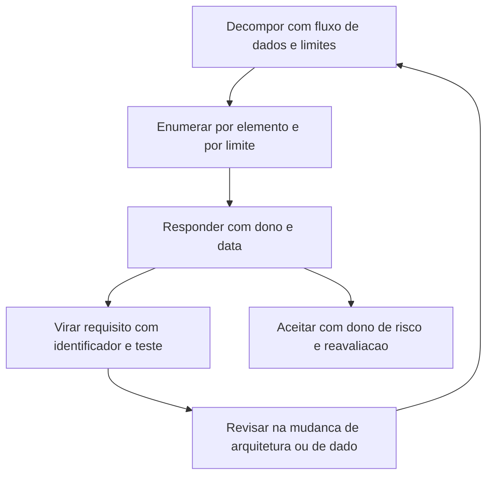

# Modelagem de ameaças em aplicações

Uma ideia central: dentro do desenvolvimento, o modelo de ameaças é o artefato de desenho que converterá suposição em requisito testável antes de existir código — e ele se revisa enquanto a aplicação muda.

## 1. Objetivo de aprendizagem

Ao final deste tema você deve conseguir: produzir o modelo de ameaças de uma aplicação, com diagrama de fluxo de dados, limites de confiança marcados, resposta escrita para cada ameaça e o requisito testável que nasce de cada resposta.

## 2. Pré-requisitos

O [TEMA-01](TEMA-01-seguranca-no-ciclo-de-vida-de-desenvolvimento.md) vem antes: sem etapa de desenho no processo, o modelo nasce órfão e morre na gaveta. O método geral está no [TEMA-02 da área 03](../03-arquitetura-engenharia/TEMA-02-modelagem-de-ameacas.md).

## 3. Pré-teste

Responda de palpite, antes de ler o resto. Anote a confiança de 1 a 5.

1. Quando foi a última vez que alguém desenhou o fluxo de dados de uma aplicação da empresa? Aponte o mês e quem fez.
   Confiança: ___
2. Quantas decisões de risco sobre funcionalidade nova a empresa registrou por escrito nos últimos doze meses? Chute um número.
   Confiança: ___
3. Se um desenvolvedor perguntasse hoje quem ataca aquela aplicação e por onde, a resposta sairia de um documento ou da cabeça de alguém?
   Confiança: ___

## 4. Caso real

O texto de A06:2025 Insecure Design registra que a categoria foi introduzida em 2021 e que a indústria mostrou melhoras perceptíveis relacionadas a modelagem de ameaças e a maior ênfase em desenho seguro, o que fez a categoria cair duas posições no ranking da edição seguinte ([top10.owasp.org](https://top10.owasp.org/2025/0x00_2025-Introduction/), acessado em 2026-09-25). É uma das poucas passagens de um documento público que liga um aumento de prática a uma mudança de posição em lista de risco.

A contrapartida aparece em auditoria. Empresas que respondem "fazemos modelagem de ameaças" e, ao pedido de evidência, apresentam a ata de uma reunião de 2023, ficam no mesmo lugar de quem nunca fez. A pergunta aberta: o que exatamente conta como modelo de ameaças de uma aplicação.

## 5. Conteúdo

### 5.1 Conceito

Modelo de ameaças de aplicação é um artefato mantido junto do sistema, com quatro partes: o desenho atual do fluxo de dados, a lista de ameaças por elemento e por limite de confiança, a resposta acordada para cada uma e os requisitos que nasceram dessas respostas. As quatro perguntas do processo e as seis categorias de ameaça estão registradas no [TEMA-02 da área 03](../03-arquitetura-engenharia/TEMA-02-modelagem-de-ameacas.md), com a fonte na tabela daquele tema.

O que distingue a versão de aplicação é o objeto do modelo. Na área 03 o objeto é um sistema ou um tipo de dado; aqui o objeto é o que a equipe vai construir no próximo ciclo, com o nível de detalhe que permite escrever o teste. Modelar a aplicação com o vocabulário do sistema produz frases como "o atacante pode comprometer a autenticação"; modelar no nível da aplicação produz "o identificador de sessão não rotaciona depois do login, e o teste tenta reutilizar o identificador antigo".

O ganho não está no documento, está na conversão. Uma ameaça sem resposta é ruído; uma resposta sem requisito é intenção; um requisito sem identificador não pode ser citado em relatório de dois anos depois. O ASVS 5.0.0 oferece o formato: cada requisito tem identificador com capítulo, seção e número, e a própria documentação recomenda citar a versão junto, como `v5.0.0-1.2.5` ([github.com/OWASP/ASVS](https://github.com/OWASP/ASVS), acessado em 2026-09-25). Use o mesmo princípio mesmo sem citar o ASVS: numere o requisito que nasceu do modelo.

### 5.2 Como funciona

Quatro etapas, com duração declarada e saída definida.

**Decompor.** Desenhe o fluxo de dados com cinco elementos: entidade externa, processo, depósito de dado, fluxo e limite de confiança. Limite de confiança é onde o nível de confiança muda: navegador para gateway, gateway para serviço, serviço para banco, serviço para serviço de terceiro. Marque também os caminhos que entram sem usuário na frente — webhook de retorno, tarefa agendada, fila consumida por worker — porque é onde a verificação de autorização costuma faltar.

**Enumerar.** Percorra cada elemento e cada limite, aplicando as categorias de ameaça registradas no método geral. Para uma aplicação, três perguntas cobrem a maior parte: quem o sistema acredita que está falando com ele, o que essa pessoa pode alcançar além do que deveria, e o que acontece quando a operação falha no meio.

**Responder.** Cada ameaça recebe mitigar, eliminar, transferir ou aceitar, com nome de quem decidiu e data. Duas regras fazem a diferença entre registro e teatro. A resposta "mitigar" precisa virar requisito com identificador e critério de teste. A resposta "aceitar" precisa de dono de risco, não de dono técnico, e de data de reavaliação.

**Revisar.** Defina o gatilho, não o calendário: mudança de arquitetura, entrada de um tipo de dado novo, integração com terceiro novo, incidente que explorou caminho previsto ou caminho que ninguém previu. Quem revisa é o dono do serviço, o arquiteto e a operação; sem a operação, o limite de frequência e o alerta não entram.

O inventário de serviços ajuda a manter o desenho atualizado. O formato CycloneDX 1.7 inclui um objeto de serviços que descreve URIs de endpoint, requisitos de autenticação e travessias de limite de confiança, além do grafo de dependência entre componentes e entre serviços ([cyclonedx.org](https://cyclonedx.org/specification/overview/), acessado em 2026-09-25). Um desenho que já está declarado no artefato de build não precisa ser redesenhado à mão para a reunião de revisão.

### 5.3 Exemplo resolvido

Aplicação: assinatura eletrônica de contrato de adesão. O cliente assina no navegador, o sistema envia o documento a um provedor de assinatura externo e recebe de volta um webhook com o status.

Etapa 1, decomposição. Entidades externas: cliente e provedor de assinatura. Processos: serviço de contrato e serviço de webhook. Depósitos: contrato assinado em armazenamento de objetos, tabela de status. Fluxos: navegador para serviço, serviço para provedor, provedor para webhook. Limites de confiança: navegador para serviço, serviço para provedor, provedor para webhook, serviço para armazenamento.

Etapa 2, enumeração. No limite navegador e serviço: acesso ao contrato de outro cliente pelo identificador. No limite serviço e provedor: dado pessoal enviado sem necessidade de contrato de tratamento. No limite provedor e webhook: chamada de retorno aceita sem verificar a origem, o que permite forjar assinatura concluída. No limite serviço e armazenamento: documento acessível por URL sem expiração.

Etapa 3, resposta escrita e requisito que nasce.

| Ameaça | Resposta | Requisito com identificador | Teste |
|---|---|---|---|
| Leitura do contrato de outro cliente | Mitigar | `SEC-APP-014` a consulta verifica titularidade no servidor antes de devolver o documento | o teste autentica como cliente A e pede o contrato de B, esperando negação |
| Chamada de retorno forjada | Mitigar | `SEC-APP-015` o webhook valida assinatura criptográfica e identificador de evento antes de mudar o status | o teste envia evento sem assinatura e espera rejeição sem alteração de estado |
| Documento acessível por URL permanente | Mitigar | `SEC-APP-016` o link de download expira em 15 minutos e o acesso fica registrado | o teste tenta baixar depois do prazo e espera expiração |
| Dado pessoal enviado ao provedor além do necessário | Aceitar com controle | registro de risco com dono na área de negócio, cláusula de tratamento no contrato do fornecedor e reavaliação em 6 meses | verificação contratual anual |

Etapa 4, revisão. Gatilhos declarados: troca de provedor de assinatura, entrada de contrato com dado sensível, mudança no formato do webhook. Responsáveis: dono do serviço, arquiteto e operação. A revisão entra no calendário junto com a mudança que a dispara, e não como evento isolado.

O que o exemplo mostra é a proporção: quatro limites de confiança bem marcados geraram quatro ameaças, uma decisão de aceitar com dono e três requisitos numerados com teste escrito na mesma reunião.

### 5.4 Problema de completar

Caso novo: fluxo de recuperação de senha por e-mail, com código de 6 dígitos, em aplicação que atende 200 mil usuários.

| Ameaça | Categoria | Resposta | Requisito com identificador |
|---|---|---|---|
| O código é enviado para o e-mail antigo depois que o usuário troca de endereço | ______ | ______ | ______ |
| O código pode ser testado mil vezes em um minuto | ______ | ______ | ______ |
| A resposta da tela informa se o e-mail existe na base | ______ | ______ | ______ |
| O usuário permanece logado em todas as sessões depois da troca de senha | ______ | ______ | ______ |

Responda ainda em três linhas: qual dessas quatro ameaças é a única em que aceitar é uma resposta defensável, e qual é o efeito dessa escolha sobre o registro de risco.

## 6. Por que isso importa para o CISO

O modelo de ameaças é o único artefato do processo que mostra decisão de desenho antes do código, e é por isso que ele sustenta a conversa de prazo. Quando a área de negócio pede entrega em 6 semanas, o CISO que tem o modelo apresenta as três ameaças sem resposta e o que cada uma permite; quem não tem, apresenta opinião, e opinião perde para cronograma.

Ele também muda o desenho de produto. Um cliente corporativo que pergunta onde o dado dele circula e quem tem acesso recebe resposta de documento, não de memória. As travessias de limite de confiança declaradas no inventário de serviços transformam essa resposta em consulta.

E há o efeito de custo, que é o argumento mais fácil de defender no comitê. Ameaça descoberta na reunião de desenho altera uma frase do requisito; descoberta depois da publicação altera integração, migração e comunicação a cliente. O gasto não é o mesmo, e o modelo existe para mover a descoberta para a esquerda.

## 7. Aplicação prática

Escolha uma função que esteja em especificação agora e convoque 90 minutos com o tech lead, uma pessoa de operação e o dono do produto. Antes da reunião, desenhe o fluxo com cinco elementos e marque os limites de confiança; na reunião, percorra cada limite e escreva, para cada ameaça, a resposta e o requisito numerado com o teste que o verifica. Termine definindo os gatilhos de revisão e quem convoca. Guarde o artefato no mesmo repositório do código, ao lado do documento de arquitetura.

## 8. Autoexplicação

Explique em três frases por que o limite de confiança é o ponto onde a modelagem rende mais. Conecte ao seu ambiente: em qual ponto de um serviço seu o nível de privilégio muda, e qual requisito numerado garante que a titularidade do dado é verificada ali.

## 9. Erros comuns e equívocos

| Equívoco | Por que está errado | O que é correto |
|---|---|---|
| Modelar o sistema inteiro antes de modelar a função | O escopo largo produz frases genéricas e nenhum requisito testável | Modelar a função que está em especificação, com o detalhe que gera teste |
| Modelo de ameaças é uma reunião | Sem artefato mantido, a decisão de 2023 não responde à pergunta de 2026 | Manter diagrama, lista, respostas, requisitos e data de revisão |
| A resposta mitigar encerra o assunto | Sem requisito com identificador e teste, a mitigação não existe em produção | Escrever o requisito e o teste na mesma sessão |
| Aceitar é decidir não fazer nada | Aceitar é decisão de risco, e risco tem dono e prazo | Registrar dono de risco, justificativa e data de reavaliação |
| Caminhos automáticos não precisam de modelo | Webhook, fila e tarefa agendada entram sem usuário na frente e concentram falha de autorização | Marcar esses caminhos no diagrama e tratá-los como limite de confiança |
| Revisar por calendário resolve | A aplicação muda por integração e por dado novo, não por aniversário | Definir gatilhos de revisão ligados à mudança |

## 10. Recuperação ativa

Responda tudo antes de abrir o gabarito.

1. Quais cinco elementos o diagrama de fluxo de dados precisa mostrar para sustentar a etapa de enumeração?
2. O que a categoria A06:2025 registra sobre a evolução da modelagem de ameaças na indústria?
3. Por que a resposta escolhida precisa virar requisito com identificador, e o que acontece quando ela não vira?
4. Por que webhook, fila e tarefa agendada merecem tratamento próprio no desenho?
5. Qual a diferença entre aceitar uma ameaça e ignorá-la?
6. Que gatilhos de revisão você definiria para uma aplicação que integra dois fornecedores externos?

Conferir respostas

1. Entidades externas, processos, depósitos de dado, fluxos de dado e limites de confiança.
2. Que a categoria Insecure Design foi introduzida em 2021 e que a indústria mostrou melhoras perceptíveis relacionadas a modelagem de ameaças e a maior ênfase em desenho seguro, o que contribuiu para a categoria cair duas posições na edição seguinte.
3. Porque o identificador permite citar o requisito em relatório, em contrato e em auditoria anos depois, e porque o teste precisa de um alvo. Sem identificador, a mitigação fica como intenção e não há como provar que ela entrou na versão publicada.
4. Porque nesses caminhos não existe usuário autenticando na frente; a verificação de origem, assinatura, titularidade e limite de frequência precisa ser desenhada explicitamente.
5. Aceitar é decisão registrada, com dono de risco, justificativa, prazo e reavaliação; ignorar é ausência de decisão, e a ameaça continua aberta sem que ninguém saiba.
6. Troca de fornecedor ou de versão da interface, entrada de tipo de dado novo, mudança no formato da chamada de retorno, mudança relevante de arquitetura e incidente que explore caminho previsto ou não previsto no modelo.

## 11. Revisão espaçada

| Intervalo | O que fazer | Se errar |
|---|---|---|
| D+1 | Desenhar de memória os cinco elementos e localizar três limites de confiança em um serviço | Rebaixar: repetir em D+1 |
| D+7 | Conduzir a sessão de 90 minutos em outra função e guardar o artefato | Rebaixar: repetir em D+3 |
| D+30 | Revisar um modelo existente contra os gatilhos declarados | Rebaixar: repetir em D+7 |

## 12. Conexões com outros temas

Leitura humana do `relacoes` do frontmatter — que é a fonte. Relações que saem desta área
também aparecem em [mapa-relacoes.md](../mapa-relacoes.md). Regras em
[templates/RELACOES-TEMAS.md](../templates/RELACOES-TEMAS.md).

| Relação | Alvo | Por que |
|---|---|---|
| aplicado_em | 03-arquitetura-engenharia#TEMA-02 | o método de modelagem descrito na área 03 é aplicado aqui ao desenho de uma aplicação dentro do ciclo de desenvolvimento; a área 03 declara a mesma relação com o mesmo tipo |

## 13. Certificações e leitura recomendada

| Certificação | Domínio coberto | Recurso | Tipo | Fonte |
|---|---|---|---|---|
| CSSLP | Modelagem de ameaças e projeto seguro dentro do ciclo de desenvolvimento | Índice de certificações do roadmap | secundaria | [90-certificacoes/](../90-certificacoes/README.md) |
| OSWE | Análise ofensiva de aplicação web, do lado da falha de projeto | Índice de certificações do roadmap | secundaria | [90-certificacoes/](../90-certificacoes/README.md) |

Leitura recomendada: [OWASP Top 10:2025, texto de A06 Insecure Design](https://top10.owasp.org/2025/0x00_2025-Introduction/); [CycloneDX 1.7, objeto de serviços com travessias de limite de confiança](https://cyclonedx.org/specification/overview/).

## 14. Fontes verificadas

| # | Título | Tipo | URL | Acessado em | Confiança |
|---|---|---|---|---|---|
| 1 | OWASP Top 10:2025 — Introduction, textos de A06:2025, A01:2025 e A02:2025 | primaria | https://top10.owasp.org/2025/0x00_2025-Introduction/ | "2026-09-25" | alta |
| 2 | OWASP ASVS 5.0.0, versão estável de maio de 2025, identificadores versionados | primaria | https://github.com/OWASP/ASVS | "2026-09-25" | alta |
| 3 | CycloneDX 1.7 — Specification Overview, objeto de serviços e travessias de limite de confiança | primaria | https://cyclonedx.org/specification/overview/ | "2026-09-25" | alta |

NAO CONFIRMADO em fonte oficial nesta execução: as quatro perguntas do processo e as seis categorias de ameaça são citadas aqui pela tabela de fontes do [TEMA-02 da área 03](../03-arquitetura-engenharia/TEMA-02-modelagem-de-ameacas.md), sem reabertura da página da OWASP nesta execução; a existência de norma internacional consolidada para o processo de modelagem de ameaças também não foi reconferida aqui; e os domínios de exame do CSSLP e do OSWE seguem sem conferência.

---

| Navegação | |
|---|---|
| Área | [09 Segurança de aplicações e DevSecOps](./README.md) |
| Tema anterior | [TEMA-02](TEMA-02-owasp-top-10-para-gestores.md) |
| Próximo tema | [TEMA-04](TEMA-04-sast-dast-sca-e-seguranca-no-pipeline.md) |
| Home | [README](../README.md) |
