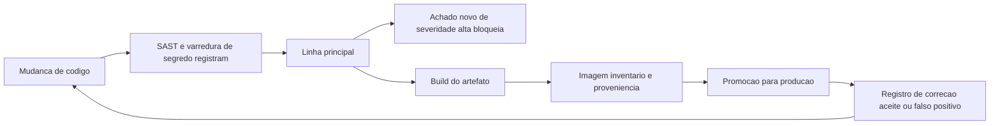

# SAST, DAST, SCA e segurança no pipeline

Uma ideia central: cada classe de ferramenta responde a uma pergunta diferente sobre um artefato diferente, e a política do pipeline decide o que acontece com a resposta — quem só instala ferramenta fica com relatório e sem correção.

## 1. Objetivo de aprendizagem

Ao final deste tema você deve conseguir: definir a política de gates de um pipeline, dizendo para cada classe de ferramenta qual pergunta ela responde, em que momento roda, o que bloqueia a promoção do artefato e qual é o prazo de correção por severidade, com dono nomeado.

## 2. Pré-requisitos

O [TEMA-01](TEMA-01-seguranca-no-ciclo-de-vida-de-desenvolvimento.md) vem antes, porque gate é etapa de processo com dono e critério de saída.

## 3. Pré-teste

Responda de palpite, antes de ler o resto. Anote a confiança de 1 a 5.

1. Quantos achados o último relatório de varredura da sua empresa listou, e quantos foram corrigidos?
   Confiança: ___
2. Qual a diferença entre analisar o código e testar a aplicação rodando?
   Confiança: ___
3. Quem é o dono do achado que aparece na varredura de dependência de um serviço?
   Confiança: ___
4. O que acontece hoje quando um achado crítico aparece às vésperas da entrega?
   Confiança: ___

## 4. Caso real

O documento que ordena o OWASP Top 10 declara duas limitações do próprio dado: os resultados se limitam ao que a indústria consegue testar de forma automatizada, e a defasagem entre descobrir uma classe de falha e conseguir testá-la em escala vai de semanas a anos — por isso duas das dez categorias de 2025 entraram por votação da comunidade, e não por medição ([top10.owasp.org](https://top10.owasp.org/2025/0x00_2025-Introduction/), acessado em 2026-09-25). O mesmo documento informa que o mapeamento de CVE para CWE usado na análise saiu de uma extração do OWASP Dependency Check, com aproximadamente 175 mil registros e 643 CWEs distintas mapeadas a CVEs, contra 241 na edição de 2021.

O caso que se repete: uma empresa liga quatro ferramentas, coleta 4 mil achados por trimestre, e no ano seguinte descobre que o passivo crítico não caiu. A pergunta aberta é o que a ferramenta não resolve sozinha.

## 5. Conteúdo

### 5.1 Conceito

Segurança de pipeline é distribuição de pergunta entre classes de ferramenta, cada uma com um artefato de entrada.

| Classe | Artefato que examina | Momento | Pergunta que responde | O que não encontra |
|---|---|---|---|---|
| SAST | código-fonte | na mudança | o código que escrevi tem padrão conhecido de falha e fluxo de dado não confiável até ponto sensível | configuração de ambiente e falha que só aparece em execução |
| SCA | componentes e dependências declaradas | na mudança e no build | o que eu uso tem falha conhecida e qual versão corrige | falha no código próprio e componente que não está declarado |
| DAST | aplicação rodando | no ambiente de teste | o sistema em execução aceita entrada ou configuração insegura | caminho não exercitado pelo teste e regra de negócio abusada |
| Varredura de segredo | código, histórico e configuração | na mudança e no histórico | credencial e chave ficaram expostas no repositório | segredo guardado fora do repositório |
| Varredura de imagem e de IaC | imagem de container e arquivo de infraestrutura | no build | a base e a definição de infraestrutura carregam falha ou desvio de linha de base | comportamento em tempo de execução |

Nenhuma linha da tabela cobre a categoria de desenho inseguro. A modelagem de ameaças do [TEMA-03](TEMA-03-modelagem-de-ameacas-em-aplicacoes.md) é o instrumento que cobre, e é por isso que ela vive no desenho, e não no pipeline.

O SSDF 1.1 declara três resultados, e dois deles dependem de resposta, não de detecção: mitigar o impacto potencial da exploração de vulnerabilidades não detectadas ou não tratadas, e endereçar as causas raiz para evitar recorrência ([csrc.nist.gov](https://csrc.nist.gov/pubs/sp/800/218/final), acessado em 2026-09-25). Um pipeline que só encontra achado não produz nenhum dos dois.

### 5.2 Como funciona

A política tem quatro decisões e cabe em duas páginas.

**O que entra no gate.** Defina por classe e por ramo. Exemplo de desenho comum: na mudança de trabalho, roda SAST, varredura de segredo e verificação de dependência declarada; nenhuma delas bloqueia, todas registram. Na promoção para a linha principal, o mesmo conjunto bloqueia quando o achado é novo e de severidade alta. No build do artefato, a varredura de imagem e a geração do inventário de componentes rodam e bloqueiam se a imagem base saiu da lista aprovada.

**O que bloqueia.** Bloquear só tem sentido com critério objetivo e com caminho de exceção. Critério comum: bloqueia achado novo, de severidade alta, com exploração conhecida ou com correção disponível, na linha principal. Não bloqueia na ramificação de trabalho, porque isso empurra a correção para o fim da fila e ensina o time a contornar o gate.

**Quem corrige e em quanto tempo.** Severidade sem dono e prazo não é política. Tabela de referência: crítica em 7 dias, alta em 30, média em 90, baixa no próximo ciclo de manutenção, com o dono sendo o time que mantém o componente — e nunca "segurança".

**Como o achado sai da fila.** Três saídas possíveis e todas precisam de registro: corrigido com prova de que entrou na versão publicada, aceito com dono de risco e data de reavaliação, ou falso positivo confirmado por análise, com a justificativa. A terceira é a saída mais mal documentada e a que mais destrói confiança no scanner, porque o mesmo falso positivo volta todo mês.

Sobre o que o relatório precisa carregar para ser útil: identificador do artefato exato que foi analisado e versão do conjunto de regras. Sem isso, não existe forma de provar que a versão publicada foi a versão verificada. O SLSA trata desse ponto para o build: Build L1 exige que exista proveniência descrevendo como o artefato foi construído, Build L2 exige proveniência assinada gerada por plataforma de build hospedada, e Build L3 exige plataforma de build endurecida, que impede execuções de influenciarem umas às outras e impede que o material de assinatura fique acessível ao passo de build definido pelo usuário ([slsa.dev](https://slsa.dev/spec/v1.1/levels), acessado em 2026-09-25).

O ASVS 5.0.0 recomenda citar a versão junto do identificador do requisito, no formato `v5.0.0-1.2.5`, justamente porque identificadores mudam entre versões ([github.com/OWASP/ASVS](https://github.com/OWASP/ASVS), acessado em 2026-09-25). Aplique a mesma disciplina ao achado: achado sem identificador de artefato e sem versão de regra não é rastreável.

### 5.3 Exemplo resolvido

Contexto: 30 repositórios, quatro ferramentas ligadas há um ano, 4 mil achados abertos e nenhuma correção planejada. Passo a passo da política.

1. Meça a concentração antes de decidir qualquer coisa. No exemplo, 12 repositórios respondem por 3.600 dos 4 mil achados, e três serviços concentram todos os 140 críticos. A política passa a tratar três serviços, não trinta repositórios.

2. Separe o que é dívida antiga do que é achado novo. Defina uma data de corte e trate o estoque anterior como linha de base, com plano próprio. O gate passa a julgar apenas o que nascer depois dela. Sem essa separação, o time recebe 4 mil bloqueios e desliga a ferramenta na primeira semana.

3. Cruze classe de ferramenta com natureza do achado. No exemplo, 12 achados críticos vêm de SAST no código próprio e 128 vêm de SCA em dependência. A correção da dependência é atualização de versão, com esforço de horas; a do código exige teste e revisão. A política precisa tratar os dois de forma diferente.

4. Escreva a tabela de prazo e dono.

| Severidade | Bloqueia na linha principal | Prazo | Dono | Registro da exceção |
|---|---|---|---|---|
| Crítica | Sim, se nova e com correção disponível | 7 dias | time que mantém o componente | risco aceito pela área de negócio com data de reavaliação |
| Alta | Sim, se nova | 30 dias | time que mantém o componente | idem |
| Média | Não | 90 dias | time que mantém o componente | idem |
| Baixa | Não | próximo ciclo de manutenção | time que mantém o componente | idem |

5. Instrumente a saída. Todo achado termina em corrigido, aceito ou falso positivo justificado, com data e autor. Acompanhe a razão entre encontrados e fechados por mês; se ela ficar acima de 1 por três meses, o achado virou ruído e a resposta é ajustar regra, e não contratar mais ferramenta.

6. Prove que a versão publicada é a versão verificada. O build produz o artefato com proveniência e inventário, e a promoção para produção usa esse registro. É nesse ponto que o nível de build deixa de ser assunto técnico: sem proveniência, a resposta para "o que foi testado" é uma promessa.

Resultado do exemplo em dois trimestres: os 3.600 achados de linha de base viraram 300; os 140 críticos caíram para 18, com 12 aceitos e registrados; e o gate nunca foi desativado porque só bloqueia o que nasce depois da data de corte.

### 5.4 Problema de completar

Caso novo: serviço de pagamento de uma fintech, três entregas por semana, uma ferramenta de SAST, uma de SCA e uma de DAST agendada para a véspera da publicação.

1. Onde a política deve rodar o SAST, e o que ele bloqueia: ______
2. O que a DAST precisa receber para ser útil, e por que rodar na véspera é uma escolha ruim: ______
3. Qual classe de ferramenta responde pela dependência e o que ela exige que hoje provavelmente não existe: ______
4. Prazo e dono para um achado crítico em dependência com correção disponível: ______
5. O que fica registrado quando a área de negócio decide publicar com um achado crítico sem correção: ______

Pergunta final, em três linhas: qual das três ferramentas você removeria primeiro se o orçamento caísse à metade, e qual argumento sustentaria a decisão.

## 6. Por que isso importa para o CISO

A conta do scanner é fácil de defender e a conta da correção é difícil, porque a primeira aparece na nota fiscal e a segunda aparece na agenda de quem entrega. O CISO que apresenta apenas "quantos achados encontramos" está medindo a ferramenta. A métrica que muda decisão é a razão entre encontrado e fechado, com prazo por severidade e o número de exceções abertas por tempo de vida.

Existe um ganho de contrato. Relatório com identificador do artefato, versão do conjunto de regras e proveniência do build responde à diligência de cliente sem que ninguém refaça análise, e a mesma evidência serve ao sistema de gestão da [área 02](../02-governanca-risco-compliance/TEMA-04-isms-iso-27001.md).

E existe um risco de governança pouco discutido: gate desativado por decisão informal. Mês em que a equipe tem entrega crítica é o mês em que o bloqueio vira discussão, e sem política escrita a decisão de desligar acontece sem registro. A política com data de corte, exceção assinada e prazo é o que mantém o controle vivo durante a semana ruim.

## 7. Aplicação prática

Peça ao time que mantém o pipeline quatro números do último trimestre: achados abertos por severidade, achados fechados por severidade, tempo mediano de correção por severidade e número de exceções abertas com mais de 90 dias. Depois escreva, em uma página, a tabela de bloqueio por ramo e a tabela de prazo por severidade, e leve para aprovação de quem mantém o risco. Se os quatro números não existirem, o trabalho do trimestre é instrumentá-los: sem eles, qualquer política que você escrever será julgada por impressão.

## 8. Autoexplicação

Explique em três frases por que analisar código e testar a aplicação rodando são coisas diferentes. Use um exemplo do seu ambiente: uma falha que só o teste em execução pegaria e uma que só a leitura do código pegaria.

## 9. Erros comuns e equívocos

| Equívoco | Por que está errado | O que é correto |
|---|---|---|
| Instalar ferramenta é implementar controle | Ferramenta produz achado; controle é o que garante correção com dono e prazo | Escrever a política de gate, os prazos e o caminho de exceção |
| Gate que bloqueia tudo é mais rigoroso | Bloqueio amplo empurra a correção para o fim da fila e ensina o time a contornar | Bloquear achado novo e severo na linha principal; registrar o resto |
| Bloquear a ramificação de trabalho acelera a correção | O trabalho ainda está sendo escrito e o bloqueio interrompe o fluxo sem critério | Bloquear na promoção do artefato, com data de corte para o estoque antigo |
| Todos os críticos têm o mesmo esforço de correção | Achado em dependência com correção disponível se resolve com atualização; achado em código próprio exige teste e revisão | Separar por natureza e por classe de ferramenta ao priorizar |
| Falso positivo não precisa de registro | Sem justificativa documentada, o mesmo alerta volta todo mês e consome tempo | Registrar a análise que concluiu pelo falso positivo, com autor e data |
| O relatório de varredura prova o que foi publicado | Sem identificador do artefato e sem proveniência, não se sabe qual versão foi analisada | Ligar o achado ao artefato exato e ao registro de build |

## 10. Recuperação ativa

Responda tudo antes de abrir o gabarito.

1. Que pergunta o SAST responde e que pergunta ele não responde?
2. Por que a análise de dependência precisa de um inventário do que foi construído, e não apenas da lista de dependências declaradas?
3. Por que o documento do OWASP Top 10 reconhece limite nos dados automatizados, e qual a consequência prática disso para a política de gate?
4. Na trilha de build do SLSA, o que separa Build L1, Build L2 e Build L3?
5. Qual a diferença entre um gate que bloqueia e um gate que apenas registra, e quando cada um é a escolha certa?
6. Que dois elementos o relatório de varredura precisa carregar para ser rastreável, e por quê?

Conferir respostas

1. Responde se o código escrito contém padrão conhecido de falha e se dado não confiável chega a ponto sensível. Não responde como o sistema se comporta em execução, nem se a configuração do ambiente está segura.
2. Porque dependência transitiva não aparece na lista declarada: o pacote que você usa traz outros que você não escolheu, e é no inventário gerado no build que eles aparecem.
3. Porque os dados refletem o que a indústria consegue testar automaticamente e há defasagem de semanas a anos entre descobrir uma classe de falha e testá-la em escala; a consequência é que ausência de achado não é evidência de ausência de risco, e o gate precisa de outras fontes de sinal além do scanner.
4. Build L1 exige que exista proveniência descrevendo como o pacote foi construído; Build L2 exige proveniência assinada, gerada por plataforma de build hospedada e validada pelo consumidor; Build L3 exige plataforma de build endurecida, que impede execuções de influenciarem umas às outras e impede que o material de assinatura da proveniência fique acessível ao passo de build definido pelo usuário.
5. O gate que bloqueia impede a promoção do artefato; o gate que registra gera achado e segue. Bloquear é a escolha certa para achado novo e severo que vai a produção; registrar é a escolha certa na ramificação de trabalho e para o estoque anterior à data de corte.
6. Identificador do artefato exato analisado e versão do conjunto de regras. Sem os dois, não há como provar que a versão publicada foi a versão verificada, nem comparar resultado entre execuções.

## 11. Revisão espaçada

| Intervalo | O que fazer | Se errar |
|---|---|---|
| D+1 | Repetir a tabela de classes de ferramenta e o que cada uma não encontra | Rebaixar: repetir em D+1 |
| D+7 | Escrever a tabela de bloqueio por ramo e a de prazo por severidade de um serviço | Rebaixar: repetir em D+3 |
| D+30 | Apurar a razão entre encontrado e fechado dos últimos três meses | Rebaixar: repetir em D+7 |

## 12. Conexões com outros temas

Leitura humana do `relacoes` do frontmatter — que é a fonte. Relações que saem desta área
também aparecem em [mapa-relacoes.md](../mapa-relacoes.md). Regras em
[templates/RELACOES-TEMAS.md](../templates/RELACOES-TEMAS.md).

| Relação | Alvo | Por que |
|---|---|---|
| nao_confundir_com | 16-ia-seguranca#TEMA-05 | regra determinística no pipeline e modelo probabilístico na triagem produzem vereditos de natureza diferente e não se substituem; destino planejado |

## 13. Certificações e leitura recomendada

| Certificação | Domínio coberto | Recurso | Tipo | Fonte |
|---|---|---|---|---|
| CSSLP | Verificação de segurança no pipeline de desenvolvimento | Índice de certificações do roadmap | secundaria | [90-certificacoes/](../90-certificacoes/README.md) |

Leitura recomendada: [SLSA, níveis da trilha de build](https://slsa.dev/spec/v1.1/levels); [NIST SP 800-218, SSDF 1.1](https://csrc.nist.gov/pubs/sp/800/218/final).

## 14. Fontes verificadas

| # | Título | Tipo | URL | Acessado em | Confiança |
|---|---|---|---|---|---|
| 1 | OWASP Top 10:2025 — Introduction, limitações do dado automatizado e números de CVE mapeados a CWEs | primaria | https://top10.owasp.org/2025/0x00_2025-Introduction/ | "2026-09-25" | alta |
| 2 | SLSA — níveis da trilha de build, L0 a L3, versão 1.2 corrente | primaria | https://slsa.dev/spec/v1.1/levels | "2026-09-25" | alta |
| 3 | NIST SP 800-218, SSDF Version 1.1, fevereiro de 2022 | primaria | https://csrc.nist.gov/pubs/sp/800/218/final | "2026-09-25" | alta |
| 4 | OWASP ASVS 5.0.0, versão estável de maio de 2025 | primaria | https://github.com/OWASP/ASVS | "2026-09-25" | alta |

NAO CONFIRMADO em fonte oficial nesta execução: os tempos de correção por severidade usados no exemplo são valores de política escolhidos para o exercício e não vêm de norma; os identificadores de prática do SSDF relacionados a revisão de código e a teste não foram conferidos, porque ficam na planilha suplementar da publicação; e as datas de divulgação pública de falhas usadas em qualquer caso concreto não foram levantadas aqui.

---

| Navegação | |
|---|---|
| Área | [09 Segurança de aplicações e DevSecOps](./README.md) |
| Tema anterior | [TEMA-03](TEMA-03-modelagem-de-ameacas-em-aplicacoes.md) |
| Próximo tema | [TEMA-05](TEMA-05-gestao-de-dependencias-e-cadeia-de-suprimentos.md) |
| Home | [README](../README.md) |
