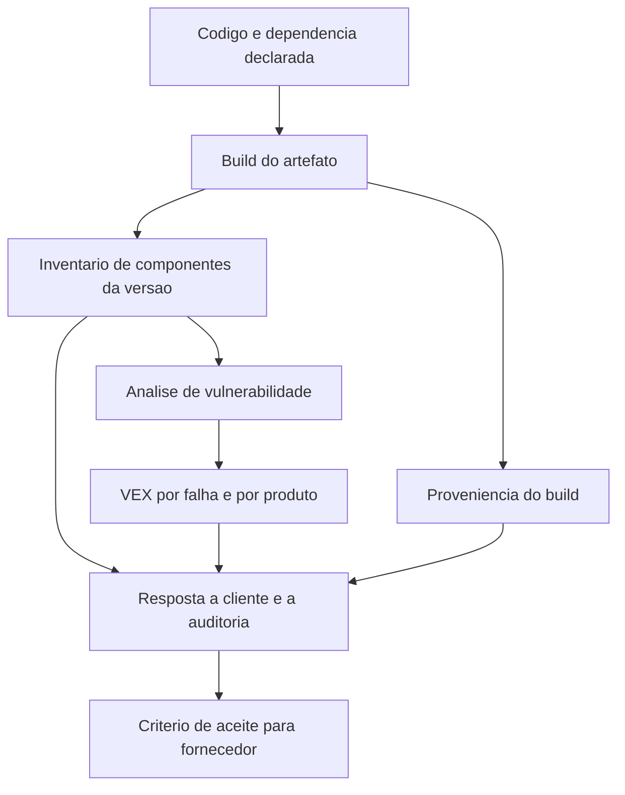

# Gestão de dependências e cadeia de suprimentos de software

Uma ideia central: risco de dependência é problema de inventário antes de ser problema de varredura — sem saber o que está dentro do artefato, a resposta a uma falha divulgada depende de arqueologia.

## 1. Objetivo de aprendizagem

Ao final deste tema você deve conseguir: avaliar a exposição da cadeia de suprimentos de um serviço, usando o inventário de componentes gerado no build e um critério de aceite escrito para fornecedor, e responder em horas quais serviços usam uma biblioteca e em que versão.

## 2. Pré-requisitos

O [TEMA-04](TEMA-04-sast-dast-sca-e-seguranca-no-pipeline.md) vem antes: é no build que o inventário e a proveniência são produzidos, e sem eles este tema trabalha com suposição.

## 3. Pré-teste

Responda de palpite, antes de ler o resto. Anote a confiança de 1 a 5.

1. Se uma biblioteca usada por você tiver falha crítica divulgada hoje, quantas horas você leva para listar os serviços afetados?
   Confiança: ___
2. Quantos componentes de terceiros entram no maior serviço da empresa, contando dependências transitivas?
   Confiança: ___
3. A empresa sabe quais versões de uma mesma biblioteca convivem em produção?
   Confiança: ___
4. O que você pediria a um fornecedor de software para avaliar a cadeia de suprimentos dele?
   Confiança: ___

## 4. Caso real

A categoria A03:2025 Software Supply Chain Failures é uma expansão de A06:2021 Vulnerable and Outdated Components, para abranger comprometimentos que ocorrem dentro e ao longo de todo o ecossistema de dependências, sistemas de build e infraestrutura de distribuição. Ela tem 5 CWEs, a menor ocorrência nos dados coletados e, ainda assim, a maior média de escores de exploit e de impacto entre os CVEs analisados, além de ter sido votada de forma expressiva como principal preocupação no levantamento com a comunidade ([top10.owasp.org](https://top10.owasp.org/2025/0x00_2025-Introduction/), acessado em 2026-09-25). O documento também registra A08:2025 Software or Data Integrity Failures como o nível mais baixo de falha, em que limites de confiança e integridade de software, código e dados deixam de ser verificados.

Uma falha assim produz uma pergunta operacional e não técnica: quais serviços usam a biblioteca e em que versão. Empresa sem inventário responde em semanas, com trabalho manual e lacuna de cobertura. A pergunta que o caso deixa aberta é onde esse inventário precisa nascer para ser confiável.

## 5. Conteúdo

### 5.1 Conceito

Inventário de componentes é a lista do que está dentro do artefato publicado, com nome, versão, identificador e relações de dependência. O formato CycloneDX, mantido pela OWASP Foundation e pela Ecma International, está na versão 1.7, publicada em 21 de outubro de 2025, é registrado como norma ECMA-424 e mantido por comitê técnico na TC54; a especificação define tipo de mídia para JSON, XML e Protobuf e nomes de arquivo convencionais `bom.json` e `bom.xml` ([cyclonedx.org](https://cyclonedx.org/specification/overview/), acessado em 2026-09-25). O SPDX é a outra família em uso, norma internacional ISO/IEC 5962:2021, com versão corrente de documento 3.0 ([spdx.dev](https://spdx.dev/use/specifications/), acessado em 2026-09-25). Escolher formato importa menos que gerar o inventário no lugar certo.

Três frases distinguem o inventário de outros artefatos que costumam ser confundidos com ele. O inventário responde "o que está aqui e em que versão". A varredura responde "o que aqui tem falha conhecida". A proveniência responde "como isso foi construído e por quem". Um arquivo pode ter os três tipos de informação, e nenhum deles substitui os outros.

Dependência transitiva é o ponto cego. O pacote que a equipe escolheu traz outros que não passaram por escolha, e é nessa camada que mora a maior parte do volume. Por isso a contagem declarada em arquivo de dependência é sempre menor que a contagem do artefato construído.

### 5.2 Como funciona

Quatro artefatos e um lugar onde eles nascem.

**Inventário.** Gerado no build, amarrado ao identificador do artefato construído, publicado junto da versão. O inventário precisa dizer a que artefato pertence; um `bom.json` sem referência à versão não permite responder a pergunta de incidente.

**Proveniência.** O SLSA trata desse ponto em níveis: Build L1 exige que exista proveniência descrevendo como o pacote foi construído, Build L2 exige proveniência assinada gerada por plataforma de build hospedada, e Build L3 exige plataforma de build endurecida, que impede execuções de influenciarem umas às outras e impede que o material de assinatura fique acessível ao passo de build definido pelo usuário ([slsa.dev](https://slsa.dev/spec/v1.1/levels), acessado em 2026-09-25). Para o CISO, a leitura é simples: L1 documenta o processo, L2 impede alteração depois do build, L3 dificulta alteração durante o build.

**Análise de vulnerabilidade e VEX.** A análise cruza o inventário com bases de falha conhecidas. O VEX é o artefato que declara, para cada falha encontrada, se o produto é afetado, não afetado ou afetado sob condição. Sem essa declaração, todo cliente que recebe o inventário repete a análise e envia a mesma lista de perguntas.

**Verificação de dependência no consumo.** Antes de adicionar uma dependência nova, a equipe verifica origem, manutenção, licença e histórico. O caminho inverso do normal: a maior parte das empresas só olha a dependência depois que ela aparece em relatório.

**Onde nasce.** No build, e não em um script rodado no fim do trimestre. É no build que a informação sobre o que entrou está completa. Depois dele, resta investigar imagem, ambiente e histórico, com custo e lacuna.

### 5.3 Exemplo resolvido

Uma falha crítica é divulgada em uma biblioteca de serialização usada por serviços internos, e a área de segurança precisa responder hoje quais serviços publicados são afetados.

1. Consulte o inventário dos últimos artefatos publicados, filtrando pelo nome do componente. A consulta devolve os serviços e as versões da biblioteca em cada um. Sem inventário, este passo vira mutirão de busca em repositórios.

2. Separe por alcance real. O serviço que usa a função vulnerável na entrada de dado externo é afetado; o que usa a biblioteca apenas na leitura de configuração interna não é. Essa análise é o que a declaração de VEX formaliza, e é onde a resposta deixa de ser lista e passa a ser decisão.

3. Verifique se a versão corrigida já está disponível e qual é o esforço. Atualização de versão menor com teste de regressão é trabalho de horas; mudança de interface maior é trabalho de sprint.

4. Responda ao cliente com os três registros: inventário do artefato que ele usa, proveniência do build e declaração de VEX. Essa resposta costuma encerrar a diligência no mesmo dia, enquanto a resposta por e-mail com promessa de retorno abre uma segunda rodada de perguntas.

5. Escreva a cláusula de aceite para fornecedor, com quatro itens verificáveis: entrega do inventário de componentes por versão publicada, identificação do artefato ao qual o inventário pertence, plataforma de build que gera e assina a proveniência, e canal de notificação de falha em componente com prazo declarado.

| Item de aceite | O que o fornecedor entrega | Como o comprador verifica |
|---|---|---|
| Inventário por versão | arquivo de inventário a cada publicação | procura o identificador da versão contratada |
| Amarração ao artefato | referência ao artefato no próprio inventário | consulta o componente e confere a versão em uso |
| Proveniência | atestação de build com assinatura | valida a assinatura e o emissor |
| Notificação de falha | canal e prazo declarados em contrato | testa o canal com uma falha simulada |

6. Meça a capacidade de resposta. O indicador que importa não é o número de falhas divulgadas, e sim o tempo entre a divulgação e a resposta ao cliente com a lista de versões afetadas. Empresas com inventário respondem em horas; empresas sem inventário medem em semanas.

### 5.4 Problema de completar

Caso novo: contrato com fornecedor de software de folha de pagamento que processa dado pessoal de 8 mil funcionários. O fornecedor se recusa a entregar o código e a abrir o ambiente de build.

1. Quais dois artefatos você exige mesmo sem acesso ao código, e o que cada um prova: ______
2. O que você faz se o fornecedor entregar o inventário sem o identificador da versão publicada: ______
3. Como você registra a aceitação de um risco de dependência que o fornecedor não corrige: ______
4. Que cláusula cobre a hipótese de o fornecedor ser comprometido antes do build: ______
5. Qual indicador você passa a acompanhar nesse contrato, e com que frequência: ______

Pergunta final, em três linhas: qual dos quatro itens de aceite do exemplo resolvido você consideraria dispensável em um fornecedor pequeno, e qual risco você aceitaria em troca.

## 6. Por que isso importa para o CISO

A03:2025 oferece o argumento mais curto para pedir verba: a categoria tem a menor ocorrência nos dados coletados e a maior média de exploit e impacto entre os CVEs analisados, o que significa que a falha é rara na amostra e cara quando acontece ([top10.owasp.org](https://top10.owasp.org/2025/0x00_2025-Introduction/), acessado em 2026-09-25). É a definição operacional de risco de cauda, e risco de cauda se trata com capacidade de resposta, não com prevenção absoluta.

O inventário é o que transforma uma falha divulgada em tarefa com dono. Sem ele, o CISO comunica incerteza ao cliente e à diretoria no pior momento possível. Com ele, a comunicação já sai com nome de serviço, versão e prazo.

Há um efeito direto sobre contrato nas duas direções. Como comprador, exigir inventário e proveniência é o que dá verificação em vez de declaração. Como fornecedor, entregar os dois artefatos encurta diligência de cliente grande e reduz o custo de responder o mesmo questionário a cada trimestre. O Executive Order 14028 aparece entre as normas relacionadas ao SSDF na página oficial da publicação do NIST ([csrc.nist.gov](https://csrc.nist.gov/pubs/sp/800/218/final), acessado em 2026-09-25), e é esse tipo de exigência que chega traduzido às cláusulas de contrato.

## 7. Aplicação prática

Escolha um serviço e responda quatro perguntas em um dia de trabalho. Quantos componentes entram no artefato publicado, contando dependência transitiva? Qual desses componentes é mantido por um único desenvolvedor ou está sem atualização há mais de dois anos? Quantas versões distintas da mesma biblioteca convivem entre os serviços? Quanto tempo levaria para listar os serviços afetados por uma falha divulgada agora, com o que existe hoje?

Depois escreva a metade da resposta que falta: adicione a geração do inventário ao passo de build de um único serviço, publique o arquivo junto da versão e refaça a primeira pergunta no ciclo seguinte. Um serviço instrumentado mostra o custo real e vira o argumento para os outros.

## 8. Autoexplicação

Explique em três frases por que o inventário precisa nascer no build e não pode ser reconstruído com confiança depois. Conecte ao seu ambiente: cite um serviço seu e diga quem seria capaz de responder hoje, hoje mesmo, quais componentes entraram na versão em produção.

## 9. Erros comuns e equívocos

| Equívoco | Por que está errado | O que é correto |
|---|---|---|
| Inventário de componentes é documento de conformidade | O valor está em responder à falha divulgada e à diligência de cliente | Gerar no build, amarrar ao artefato e usar na resposta a incidente |
| Gerar o inventário uma vez por ano resolve | A cada publicação a lista muda, e a pergunta de incidente é sobre a versão publicada | Gerar a cada build e guardar por versão |
| Varredura de vulnerabilidade substitui o inventário | A varredura responde o que tem falha conhecida; sem inventário ela não sabe o que existe | Manter os dois, com o inventário como base |
| Dependência transitiva é responsabilidade de quem a escreveu | Ela entra no seu artefato e é você que responde ao cliente | Medir a contagem no artefato construído, não na lista declarada |
| Proveniência é assunto de time de plataforma | Ela é o que permite provar que a versão publicada é a versão verificada | Definir o nível de build como decisão de risco, com o dono do risco |
| Declarar não afetado é sempre resposta aceitável | Declaração sem prova de análise vira promessa vazia | Registrar a análise que sustenta o não afetado, com autor e data |

## 10. Recuperação ativa

Responda tudo antes de abrir o gabarito.

1. O que distingue a categoria A03:2025 da categoria A06:2021 que ela expande?
2. Qual a diferença entre inventário de componentes, varredura de vulnerabilidade e proveniência de build?
3. Para que serve o VEX, e o que acontece quando ele não existe?
4. Qual é a versão corrente do CycloneDX, quando foi publicada e sob qual norma ela é registrada?
5. Na trilha de build do SLSA, o que muda entre L1, L2 e L3?
6. Por que a contagem de componentes do artefato construído é maior que a contagem do arquivo de dependências declaradas?

Conferir respostas

1. A03:2025 amplia o escopo para comprometimentos que ocorrem dentro e ao longo de todo o ecossistema de dependências, sistemas de build e infraestrutura de distribuição, enquanto A06:2021 tratava de componentes vulneráveis e desatualizados. A03:2025 tem 5 CWEs, a menor ocorrência nos dados e a maior média de exploit e impacto entre os CVEs analisados.
2. O inventário responde o que está no artefato e em que versão; a varredura responde o que ali tem falha conhecida; a proveniência responde como o artefato foi construído e por quem.
3. O VEX declara, para cada falha, se o produto é afetado, não afetado ou afetado sob condição. Sem ele, cada cliente repete a análise e o fornecedor responde a mesma pergunta várias vezes.
4. Versão 1.7, publicada em 21 de outubro de 2025, registrada como norma ECMA-424, com comitê técnico na TC54 e manutenção da OWASP Foundation com a Ecma International.
5. L1 exige proveniência que descreve como o pacote foi construído; L2 exige proveniência assinada por plataforma de build hospedada, o que protege contra alteração depois do build; L3 exige plataforma endurecida, que protege contra alteração durante o build e impede que o material de assinatura fique acessível ao passo de build definido pelo usuário.
6. Porque dependências transitivas — os pacotes trazidos pelos pacotes que a equipe escolheu — não aparecem no arquivo de dependências declaradas, mas entram no artefato construído.

## 11. Revisão espaçada

| Intervalo | O que fazer | Se errar |
|---|---|---|
| D+1 | Escrever de memória a diferença entre inventário, varredura e proveniência | Rebaixar: repetir em D+1 |
| D+7 | Levantar a contagem de componentes de um serviço, com transitivas | Rebaixar: repetir em D+3 |
| D+30 | Simular a resposta a uma falha divulgada e medir o tempo até a lista de versões | Rebaixar: repetir em D+7 |

## 12. Conexões com outros temas

Leitura humana do `relacoes` do frontmatter — que é a fonte. Relações que saem desta área
também aparecem em [mapa-relacoes.md](../mapa-relacoes.md). Regras em
[templates/RELACOES-TEMAS.md](../templates/RELACOES-TEMAS.md).

| Relação | Alvo | Por que |
|---|---|---|
| aplicado_em | 07-criptografia-segredos#TEMA-06 | o inventário criptográfico é o mesmo tipo de artefato que o inventário de dependências e sai do mesmo build; a área 07 declara a mesma relação com o mesmo tipo |

## 13. Certificações e leitura recomendada

| Certificação | Domínio coberto | Recurso | Tipo | Fonte |
|---|---|---|---|---|
| CSSLP | Cadeia de suprimentos de software dentro do ciclo de desenvolvimento seguro | Índice de certificações do roadmap | secundaria | [90-certificacoes/](../90-certificacoes/README.md) |

Leitura recomendada: [CycloneDX 1.7, especificação e objeto de componentes e dependências](https://cyclonedx.org/specification/overview/); [SPDX 3.0, ISO/IEC 5962:2021](https://spdx.dev/use/specifications/).

## 14. Fontes verificadas

| # | Título | Tipo | URL | Acessado em | Confiança |
|---|---|---|---|---|---|
| 1 | CycloneDX 1.7 — Specification Overview, versão 1.7 de 21/10/2025, ECMA-424, TC54 | primaria | https://cyclonedx.org/specification/overview/ | "2026-09-25" | alta |
| 2 | SPDX — Specifications, ISO/IEC 5962:2021, versão 3.0 | primaria | https://spdx.dev/use/specifications/ | "2026-09-25" | alta |
| 3 | OWASP Top 10:2025 — Introduction, textos de A03:2025 e A08:2025 | primaria | https://top10.owasp.org/2025/0x00_2025-Introduction/ | "2026-09-25" | alta |
| 4 | SLSA — níveis da trilha de build, L0 a L3 | primaria | https://slsa.dev/spec/v1.1/levels | "2026-09-25" | alta |
| 5 | NIST SP 800-218, SSDF Version 1.1, fevereiro de 2022 | primaria | https://csrc.nist.gov/pubs/sp/800/218/final | "2026-09-25" | alta |

NAO CONFIRMADO em fonte oficial nesta execução: o conjunto de elementos mínimos exigidos de um inventário de componentes, publicado por agência governamental dos Estados Unidos, não foi consultado, e nenhuma lista de campos mínimos é afirmada aqui; o texto da cláusula do Executive Order 14028 sobre software não foi lido, sendo confirmada apenas a listagem do decreto entre as normas relacionadas na página do SSDF; e os identificadores de prática do SSDF sobre verificação de componente de terceiro não foram conferidos.

---

| Navegação | |
|---|---|
| Área | [09 Segurança de aplicações e DevSecOps](./README.md) |
| Tema anterior | [TEMA-04](TEMA-04-sast-dast-sca-e-seguranca-no-pipeline.md) |
| Próximo tema | [TEMA-06](TEMA-06-seguranca-de-api.md) |
| Home | [README](../README.md) |
