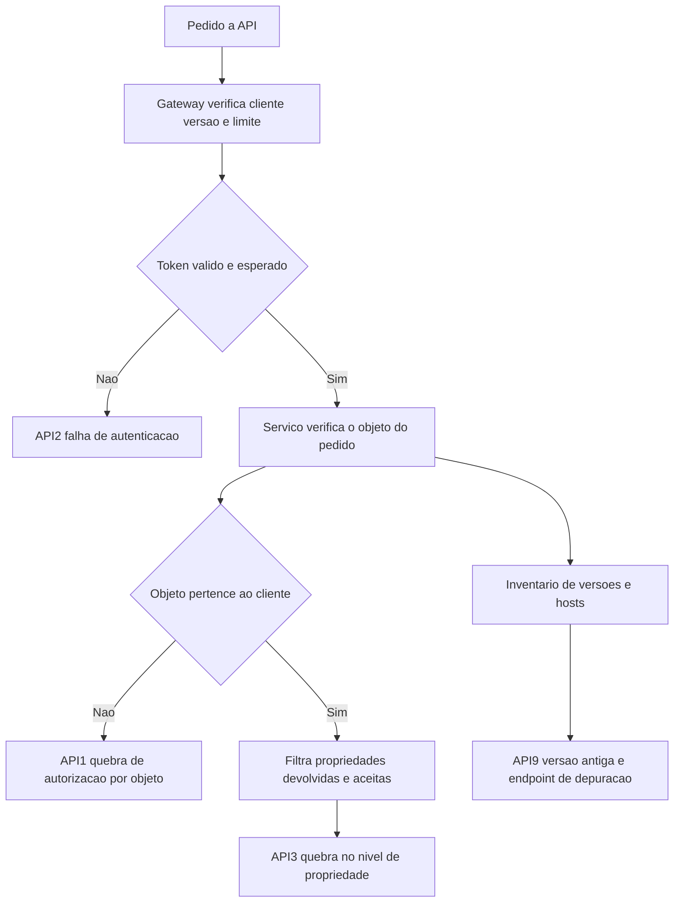

# Segurança de API

Uma ideia central: em API, o risco se concentra em duas perguntas — este cliente pode agir sobre este objeto específico, e o que está publicado e ainda em uso — e nenhuma delas se resolve com token válido.

## 1. Objetivo de aprendizagem

Ao final deste tema você deve conseguir: escrever o escopo de verificação de uma API exposta, com controle de autorização por objeto e por propriedade, inventário de versões e hosts e teste que tenta o acesso de outro titular, dizendo em cada caso quem é o dono do endereço.

## 2. Pré-requisitos

O [TEMA-03](TEMA-03-modelagem-de-ameacas-em-aplicacoes.md) fornece o desenho com limite de confiança e o [TEMA-04](TEMA-04-sast-dast-sca-e-seguranca-no-pipeline.md) fornece a verificação no pipeline. O modelo de decisão de autorização está no [TEMA-02 da área 04](../04-identidade-acesso/TEMA-02-autorizacao-rbac-abac-modelo-de-decisao.md).

## 3. Pré-teste

Responda de palpite, antes de ler o resto. Anote a confiança de 1 a 5.

1. Quantos endpoints de API a sua empresa publica hoje, e quantos estão em versão antiga ainda ativa?
   Confiança: ___
2. Se um cliente autenticado trocar o número do pedido na chamada, o sistema devolve o pedido de outro cliente?
   Confiança: ___
3. Quem aprova a publicação de uma API para parceiro externo hoje?
   Confiança: ___
4. O que a empresa verifica na resposta que recebe de uma API de terceiro antes de confiar no dado?
   Confiança: ___

## 4. Caso real

A página do projeto OWASP API Security Top 10 declara a motivação em uma frase direta: muitas APIs não passam pelo teste de segurança que tornaria o ataque mais difícil, e elas são usadas tanto para tarefas internas quanto para interface com terceiros ([api-security.owasp.org](https://api-security.owasp.org/), acessado em 2026-09-25). A edição publicada do documento lista dez riscos nomeados de API1:2023 a API10:2023, e o primeiro deles é de autorização, não de autenticação: a descrição de API1:2023 Broken Object Level Authorization observa que APIs expõem endpoints que manipulam identificadores de objeto, criando superfície ampla de problemas de controle de acesso nesse nível, e que a verificação de autorização no nível do objeto deve ser considerada em toda função que acessa fonte de dado usando identificador vindo do usuário ([owasp.org](https://owasp.org/API-Security/editions/2023/en/0x11-t10/), acessado em 2026-09-25).

O caso se repete em integração com parceiro. O gateway valida a assinatura do token, o token é legítimo, o cliente é quem diz ser — e o endereço devolve o recurso de outro cliente. A pergunta aberta é por que a verificação que existe não cobre o que aconteceu.

## 5. Conteúdo

### 5.1 Conceito

Os dez riscos da edição 2023 organizam a maior parte do que dá errado em API.

| Risco | O que é |
|---|---|
| API1:2023 | Broken Object Level Authorization: identificador de objeto manipulado sem verificar se o cliente pode agir sobre aquele objeto |
| API2:2023 | Broken Authentication: implementação de autenticação que permite assumir a identidade de outro usuário ou comprometer token |
| API3:2023 | Broken Object Property Level Authorization: falta ou falha de verificação de autorização no nível da propriedade do objeto, unindo exposição excessiva de dado e atribuição em massa |
| API4:2023 | Unrestricted Resource Consumption: consumo de recurso sem limite, com efeito de indisponibilidade ou de custo operacional |
| API5:2023 | Broken Function Level Authorization: hierarquias, grupos e papéis complexos e separação pouco clara entre função administrativa e comum |
| API6:2023 | Unrestricted Access to Sensitive Business Flows: fluxo de negócio sensível exposto a uso automatizado e excessivo, sem falha de implementação |
| API7:2023 | Server Side Request Forgery: busca de recurso remoto a partir de URI fornecido pelo usuário, sem validação |
| API8:2023 | Security Misconfiguration: configuração complexa deixada insegura |
| API9:2023 | Improper Inventory Management: inventário incompleto de hosts e versões, com versão obsoleta e endpoint de depuração exposto |
| API10:2023 | Unsafe Consumption of APIs: confiança no dado vindo de API de terceiro maior que a confiança dada à entrada do próprio usuário |

Duas observações ligam esta lista à edição 2025 do Top 10 de aplicação web. Primeiro, a categoria A01:2025 Broken Access Control mantém a primeira posição e absorveu Server-Side Request Forgery, que deixou de ser categoria separada; a prevalência medida é de 3,73% das aplicações testadas com ao menos uma das 40 CWEs da categoria ([top10.owasp.org](https://top10.owasp.org/2025/0x00_2025-Introduction/), acessado em 2026-09-25). Segundo, API9:2023 mostra que parte do risco não está no código: está em não saber o que está publicado.

O ASVS 5.0.0 cobre aplicações web e serviços web no mesmo conjunto de requisitos, e cada requisito tem identificador versionado ([github.com/OWASP/ASVS](https://github.com/OWASP/ASVS), acessado em 2026-09-25). Ele é o lugar onde o escopo de verificação da API ganha numeração e vira contrato de teste.

### 5.2 Como funciona

Toda chamada passa por duas decisões distintas, e tratar uma como se fosse a outra é a origem do risco.

**Autenticação.** Quem é o cliente. O token precisa ter assinatura verificada, emissor esperado, público correto e validade; a falha aqui aparece como API2:2023.

**Autorização.** O que aquele cliente pode fazer sobre aquele objeto. Três perguntas, na ordem: o objeto pertence a ele ou está no escopo dele; a propriedade específica pode ser lida e escrita; a função pedida está liberada para o papel dele. As falhas correspondem a API1:2023, API3:2023 e API5:2023.

A camada onde a decisão acontece merece atenção explícita. O gateway é bom em política ampla: qual cliente, qual limite de frequência, qual versão, qual endereço de origem. Ele não sabe, em geral, se o pedido número 8842 pertence ao cliente que fez a chamada. Essa verificação pertence ao serviço que acessa o dado, e é ela que precisa constar do escopo de verificação.

Depois vêm três controles que não são de autorização e que respondem por boa parte dos incidentes. Limite de consumo, que ataca API4:2023 e parte de API6:2023. Inventário de hosts e versões, com desligamento planejado da versão antiga, que ataca API9:2023. Verificação do que vem de terceiro — assinatura, esquema, validação, timeout, limite de dado — que ataca API10:2023 e o risco de segurança de terceiro entrar pela sua API de saída.

O inventário de serviços ajuda nas duas pontas. O CycloneDX 1.7 descreve, no objeto de serviços, URIs de endpoint, requisitos de autenticação e travessias de limite de confiança, além do grafo em que serviços dependem de serviços ([cyclonedx.org](https://cyclonedx.org/specification/overview/), acessado em 2026-09-25). Isso permite responder quantos endpoints existem, quem autentica em cada um e por qual limite de confiança a chamada passa.

### 5.3 Exemplo resolvido

API de consulta de pedidos de um portal de parceiro: `GET /pedidos/{id}` com token de cliente, mais `POST /pedidos/{id}/itens` e um conjunto de endereços administrativos sob `/interno`.

1. Inventarie antes de proteger. Liste os hosts, as versões publicadas e quem consome cada uma. No exemplo, a versão 1 continua ativa para dois parceiros que não migraram, e um host de homologação responde na internet com dado de teste real.

2. Classifique cada verificação por risco. `/pedidos/{id}` sem verificação de titularidade é API1:2023. Devolver o objeto completo, incluindo dado interno de margem e observação, quando o parceiro só precisa de status e valor, é API3:2023. O endpoint administrativo sem verificação de papel é API5:2023.

3. Escreva o requisito e o teste para cada um. `SEC-API-021`: a consulta ao pedido devolve dado somente se o cliente autenticado é o titular do pedido, verificado no serviço que acessa a base. O teste autentica como parceiro A, pede o pedido do parceiro B e espera negação com o código de erro correto. `SEC-API-022`: a resposta devolve somente os campos do contrato da interface; o teste compara o esquema da resposta com a lista permitida. `SEC-API-023`: endereço administrativo exige papel administrativo; o teste usa token de parceiro e espera negação.

4. Trate consumo e custo como controle. Limite por cliente e por endereço de origem em consulta e em envio, com alerta acima do limite. Sem isso, o próprio contrato pode ser usado para negar serviço ou para gerar custo de operação, o que é API4:2023.

5. Controle o que vem de terceiro. Assinatura ou origem verificada no webhook de retorno, esquema validado antes de usar o dado, timeout e limite de tamanho. A regra de ouro está na descrição de API10:2023: o dado de API de terceiro não é mais confiável que a entrada do usuário.

6. Desligue versão antiga com plano. Data de encerramento, comunicação ao consumidor e verificação de tráfego residual antes de desativar. Enquanto a versão antiga responde, ela é superfície sem dono.

| Endereço | Risco principal | Requisito | Teste |
|---|---|---|---|
| GET /pedidos/{id} | API1:2023 | `SEC-API-021` titularidade verificada no serviço | trocar o identificador e esperar negação |
| POST /pedidos/{id}/itens | API1:2023 e API3:2023 | `SEC-API-022` campos permitidos por contrato | enviar campo fora do contrato e esperar rejeição |
| /interno/relatorios | API5:2023 | `SEC-API-023` papel administrativo exigido | usar token de parceiro e esperar negação |
| webhook de status do parceiro | API10:2023 | `SEC-API-024` assinatura e esquema verificados | enviar evento sem assinatura e esperar rejeição |

### 5.4 Problema de completar

Caso novo: API de um aplicativo de mobilidade urbana que expõe corrida, localização e pagamento, com SDK para parceiros.

| Endereço ou fluxo | Risco da lista 2023 | Requisito | Teste |
|---|---|---|---|
| GET /corridas/{id} | ______ | ______ | ______ |
| POST /pagamentos com campo de valor aceito do cliente | ______ | ______ | ______ |
| /v1 ativo enquanto /v2 já responde, com consumidor desconhecido | ______ | ______ | ______ |
| Retorno de API de antifraude usado sem validar esquema | ______ | ______ | ______ |

Pergunta final, em três linhas: qual desses quatro itens você não consegue verificar sem tocar em código, e quem precisa aprovar a correção.

## 6. Por que isso importa para o CISO

API é a parte da aplicação que o CISO não vê no inventário tradicional: não tem tela, não tem usuário humano, não aparece em relatório de negócio. API9:2023 existe como risco nomeado exatamente porque inventário incompleto de hosts e versões deixa versão obsoleta e endpoint de depuração expostos ([owasp.org](https://owasp.org/API-Security/editions/2023/en/0x11-t10/), acessado em 2026-09-25). Antes de discutir controle, a pergunta de gestão é quantos endpoints estão publicados e quem responde por cada um.

Há um efeito de contrato e de concentração de risco. API de parceiro transforma o seu ambiente em superfície compartilhada: a falha de autorização por objeto vaza dado de outro cliente e vira obrigação de notificação; a falta de limite de consumo abre caminho para custo e indisponibilidade; e a confiança no dado de terceiro traz para dentro o problema do outro.

E há o argumento econômico, que costuma ser o mais eficaz no comitê. O mesmo esforço aplicado à verificação de titularidade em cada função que acessa dado por identificador reduz simultaneamente A01:2025 no Top 10 de aplicação web e os três primeiros riscos da lista de API, porque os quatro descrevem a mesma classe de falha em superfícies diferentes.

## 7. Aplicação prática

Escolha a API mais exposta da empresa e produza três artefatos em duas semanas.

O inventário: lista de hosts, versões publicadas, consumidor conhecido e data planejada de encerramento para cada versão antiga. Sem isso, o resto não tem base.

O escopo de verificação: quadro com os dez riscos da edição 2023 na primeira coluna, o endereço ou fluxo correspondente na segunda, o requisito numerado na terceira, o teste na quarta e o dono na quinta. Onde você não souber preencher, a lacuna é o trabalho seguinte.

O teste de titularidade: peça a um membro do time que autentique com uma conta de teste e tente acessar o recurso de outra conta, trocando o identificador. Esse teste simples encontra a falha mais comum e mais cara, e pode ser executado sem ferramenta especial.

## 8. Autoexplicação

Explique em três frases por que token válido não é autorização. Conecte ao seu ambiente: cite um endereço da sua API que recebe identificador, e diga onde, no caminho da chamada, o sistema verifica se aquele identificador pertence a quem está chamando.

## 9. Erros comuns e equívocos

| Equívoco | Por que está errado | O que é correto |
|---|---|---|
| Token válido no gateway resolve acesso | O token prova quem chamou, não que aquele objeto pertence a quem chamou | Verificar titularidade no serviço que acessa o dado, por objeto |
| Limite de frequência protege contra quebra de autorização | Limite reduz abuso de volume e não decide quem pode ler o quê | Tratar limite como controle de consumo e autorização como controle separado |
| Filtrar a resposta é o mesmo que não devolver o dado | Exposição excessiva de propriedade e atribuição em massa são o mesmo problema visto de dois lados | Definir lista de campos permitidos na resposta e na entrada |
| Documentar a API resolve o inventário | Documento desatualizado é pior que documento ausente, porque cria confiança falsa | Inventariar hosts e versões em uso, com consumidor e prazo de encerramento |
| Dado de API de terceiro é confiável por vir do parceiro | A descrição de API10:2023 registra que a confiança no terceiro costuma ser maior que a confiança na entrada do usuário, e é por isso que o atacante escolhe o integrador | Validar esquema, verificar origem e assinatura, limitar tamanho e tempo de espera |
| Endpoint de depuração é assunto de time de desenvolvimento | Endpoint de depuração exposto é item nomeado do risco de inventário | Verificar exposição externa como parte da publicação da versão |

## 10. Recuperação ativa

Responda tudo antes de abrir o gabarito.

1. Qual risco ocupa a posição API1:2023 e por que ele é um problema de autorização, e não de autenticação?
2. O que o risco API3:2023 unificou em relação à edição de 2019?
3. Por que inventário de hosts e versões aparece como risco próprio na lista?
4. Segundo API10:2023, por que integrações de terceiros são alvo preferencial do atacante?
5. Que três perguntas de autorização precisam ser respondidas em cada chamada, e em qual camada cada uma costuma ser resolvida?
6. Que categoria da edição 2025 do Top 10 de aplicação web absorveu Server-Side Request Forgery, e qual a prevalência medida dessa categoria?

Conferir respostas

1. API1:2023 Broken Object Level Authorization. O token prova a identidade do cliente; a falha é não verificar se aquele cliente pode agir sobre o identificador de objeto enviado, o que exige verificação de autorização em toda função que acessa dado por identificador vindo do usuário.
2. Unificou Excessive Data Exposure e Mass Assignment da edição de 2019, apontando a causa raiz comum: ausência ou falha de verificação de autorização no nível da propriedade do objeto.
3. Porque APIs expõem mais endpoints que aplicações web tradicionais, e inventário incompleto mantém versões obsoletas e endpoints de depuração acessíveis, sem dono.
4. Porque o desenvolvimento tende a confiar mais no dado recebido de API de terceiro do que na entrada do próprio usuário e, com isso, adota padrão de segurança mais fraco; o atacante ataca o integrador em vez do alvo direto.
5. O objeto pertence ao cliente; a propriedade específica pode ser lida e escrita; a função pedida está liberada para o papel dele. A política ampla costuma ficar no gateway; a verificação do objeto e da propriedade pertence ao serviço que acessa o dado.
6. A01:2025 Broken Access Control absorveu Server-Side Request Forgery, e a prevalência medida foi de 3,73% das aplicações testadas com ao menos uma das 40 CWEs da categoria.

## 11. Revisão espaçada

| Intervalo | O que fazer | Se errar |
|---|---|---|
| D+1 | Repetir os dez riscos da edição 2023 pelo nome | Rebaixar: repetir em D+1 |
| D+7 | Fazer o teste de titularidade em uma API própria, com duas contas de teste | Rebaixar: repetir em D+3 |
| D+30 | Levantar hosts, versões publicadas e consumidor de cada versão | Rebaixar: repetir em D+7 |

## 12. Conexões com outros temas

Leitura humana do `relacoes` do frontmatter — que é a fonte. Relações que saem desta área
também aparecem em [mapa-relacoes.md](../mapa-relacoes.md). Regras em
[templates/RELACOES-TEMAS.md](../templates/RELACOES-TEMAS.md).

| Relação | Alvo | Por que |
|---|---|---|
| aplicado_em | 04-identidade-acesso#TEMA-02 | o modelo de decisão de autorização vira escopo de token e verificação por objeto na API; a área 04 declara a mesma relação com o mesmo tipo |

## 13. Certificações e leitura recomendada

| Certificação | Domínio coberto | Recurso | Tipo | Fonte |
|---|---|---|---|---|
| OSWE | Exploração de aplicação web e de API, do lado ofensivo | Índice de certificações do roadmap | secundaria | [90-certificacoes/](../90-certificacoes/README.md) |
| CSSLP | Projeto e verificação de segurança de API no ciclo de desenvolvimento | Índice de certificações do roadmap | secundaria | [90-certificacoes/](../90-certificacoes/README.md) |

Leitura recomendada: [OWASP API Security Top 10, edição 2023](https://owasp.org/API-Security/editions/2023/en/0x11-t10/); [CycloneDX 1.7, objeto de serviços e travessias de limite de confiança](https://cyclonedx.org/specification/overview/).

## 14. Fontes verificadas

| # | Título | Tipo | URL | Acessado em | Confiança |
|---|---|---|---|---|---|
| 1 | OWASP API Security Top 10, edição 2023, riscos API1:2023 a API10:2023 | primaria | https://owasp.org/API-Security/editions/2023/en/0x11-t10/ | "2026-09-25" | alta |
| 2 | OWASP API Security Top 10, página do projeto e motivação declarada | primaria | https://api-security.owasp.org/ | "2026-09-25" | alta |
| 3 | OWASP Top 10:2025 — Introduction, A01:2025 com prevalência de 3,73% e absorção de SSRF | primaria | https://top10.owasp.org/2025/0x00_2025-Introduction/ | "2026-09-25" | alta |
| 4 | CycloneDX 1.7 — objeto de serviços, autenticação e travessias de limite de confiança | primaria | https://cyclonedx.org/specification/overview/ | "2026-09-25" | alta |
| 5 | OWASP ASVS 5.0.0, versão estável de maio de 2025, requisitos para serviços web | primaria | https://github.com/OWASP/ASVS | "2026-09-25" | alta |

NAO CONFIRMADO em fonte oficial nesta execução: se existe edição do OWASP API Security Top 10 posterior a 2023, já que a página de índice de edições devolveu erro 404 e a página do projeto não declara a edição corrente; a contagem de CWEs por risco, que não aparece no índice lido; os requisitos específicos do ASVS aplicáveis a serviços web, cujo texto por capítulo não foi lido; e os domínios de exame do OSWE e do CSSLP.

---

| Navegação | |
|---|---|
| Área | [09 Segurança de aplicações e DevSecOps](./README.md) |
| Tema anterior | [TEMA-05](TEMA-05-gestao-de-dependencias-e-cadeia-de-suprimentos.md) |
| Home | [README](../README.md) |
