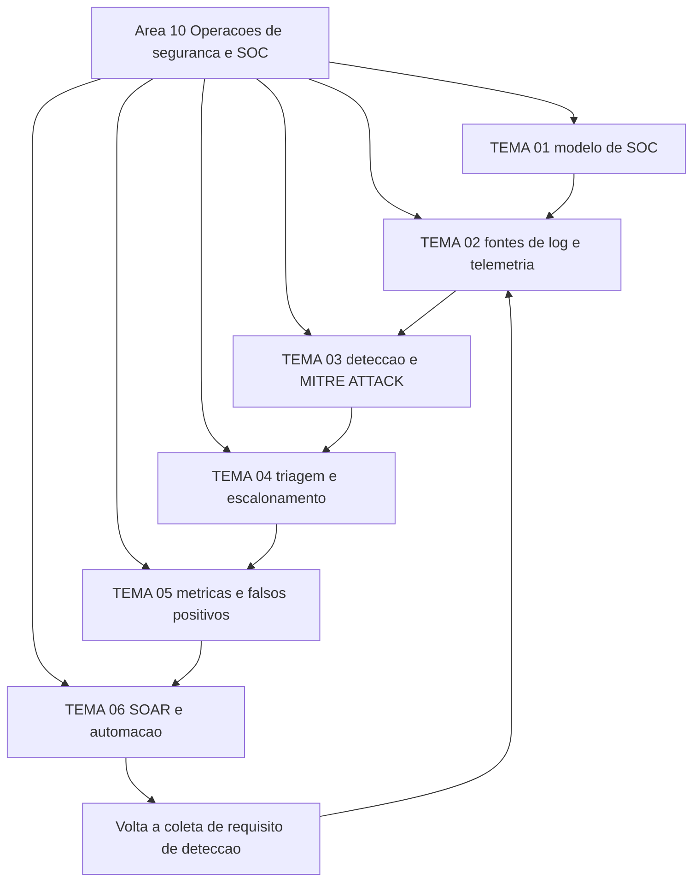

# Operações de segurança e SOC

O playbook de resposta a incidentes do CISA, publicado em novembro de 2021, exige que a agência notifique o órgão central em até uma hora depois de determinar que houve um incidente, e devolve, também em até uma hora, o número de acompanhamento junto com uma nota de risco. Essa hora pertence a quem estiver de plantão. Esta área trata de como essa operação é montada, medida e sustentada.

## 1. Introdução

### 1.1 O que é esta área

Um SOC transforma telemetria em decisão sobre incidente: coleta o evento, aplica a regra de detecção, faz a triagem, classifica a severidade e escala. Estão dentro do escopo desta área a cobertura de fontes de log, a engenharia das regras de detecção, o critério de severidade, as métricas da operação e a automação da triagem.

Ficam fora: o ciclo de resposta, contenção, erradicação e forense, que pertence a [11 Resposta a incidentes](../11-resposta-forense/README.md); a gestão de vulnerabilidades e a produção de threat intelligence, que pertencem a [12 Vulnerabilidades e threat intelligence](../12-vulnerabilidades-threat-intel/README.md); e a operação dos controles de rede e de endpoint, que pertencem a [05 Segurança de rede](../05-rede-infraestrutura/README.md) e [06 Segurança de endpoint](../06-endpoint-plataforma/README.md).

### 1.2 Por que isso importa para o CISO

A operação de detecção é a linha de orçamento que cresce sozinha: licença por gigabyte ingerido, agente por endpoint, plantão por hora. Três decisões desta área aparecem na mesa do executivo com número: quanto se paga para cobrir 24 horas de plantão, quanto custa ampliar a retenção de log para responder a uma pergunta de auditoria, e quanto tempo a organização leva entre o alerta e a decisão de isolar uma máquina. Errar a terceira não gera multa imediata; gera prazo estourado de notificação quando o incidente é real e o relógio regulatório já começou.

### 1.3 O que você será capaz de fazer ao final

Comparar modelos de SOC por custo e capacidade e defender a escolha por escrito. Julgar se a telemetria disponível sustenta a investigação de um incidente declarado. Escrever um caso de uso de detecção com fonte de dados, lógica e mapeamento em ATT&CK. Classificar severidade e decidir escalonamento com critério declarado antes do evento. Escolher o que automatizar primeiro e o que manter sob julgamento humano.

### 1.4 Os temas desta área, em prosa

O TEMA-01 descreve o que um SOC é e quais variáveis definem seu modelo. O TEMA-02 trata das fontes de log e telemetria e do efeito de uma fonte ausente. O TEMA-03 ensina a escrever detecção e a usá-la como mapa de cobertura. O TEMA-04 cuida da triagem, do critério de severidade e do escalonamento. O TEMA-05 trata das métricas da operação e do custo do falso positivo. O TEMA-06 discute automação, playbook executável e o limite entre o que pode ser automático e o que exige julgamento.

## 2. Objetivos de aprendizagem (terminais)

| # | Objetivo | Bloom | Temas que o sustentam |
|---|---|---|---|
| 1 | Descrever um modelo de SOC pelas variáveis de operação, horário e escopo, justificando cada escolha por capacidade e custo. | entender | TEMA-01 |
| 2 | Julgar a cobertura de telemetria de um incidente declarado, nomeando a fonte que falta e a classe de técnica que fica sem evidência. | aplicar | TEMA-02 |
| 3 | Escrever um caso de uso de detecção com lógica, fonte de dados, condição e mapeamento em ATT&CK, declarando o falso positivo esperado. | aplicar | TEMA-03 |
| 4 | Classificar a severidade de um incidente e decidir o escalonamento com o critério declarado antes do evento, dentro do prazo de notificação aplicável. | avaliar | TEMA-04 |
| 5 | Avaliar um painel de métricas de SOC e escolher, entre as rotinas candidatas, o que automatizar e o que exige julgamento humano. | avaliar | TEMA-05, TEMA-06 |

## 3. Diagrama dos tópicos

## 4. Temas

| # | tema_id | Tema | Nível | Tempo |
|---|---|---|---|---|
| 1 | TEMA-01 | [O que é um SOC e seus modelos](TEMA-01-o-que-e-um-soc-e-seus-modelos.md) | base | 35-45 min |
| 2 | TEMA-02 | [Fontes de log e telemetria](TEMA-02-fontes-de-log-e-telemetria.md) | intermediario | 35-45 min |
| 3 | TEMA-03 | [Detecção: regras, casos de uso e MITRE ATT&CK](TEMA-03-deteccao-regras-casos-de-uso-e-mitre-attack.md) | intermediario | 45-60 min |
| 4 | TEMA-04 | [Triagem, severidade e escalonamento](TEMA-04-triagem-severidade-e-escalonamento.md) | base | 35-45 min |
| 5 | TEMA-05 | [Métricas de SOC e o problema dos falsos positivos](TEMA-05-metricas-de-soc-e-falsos-positivos.md) | intermediario | 40-50 min |
| 6 | TEMA-06 | [SOAR, automação e o futuro do SOC](TEMA-06-soar-automacao-e-o-futuro-do-soc.md) | intermediario | 35-45 min |

## 5. Pré-requisitos e sequência

O [06 Segurança de endpoint](../06-endpoint-plataforma/README.md) vem antes porque o agente de EDR é a maior fonte de evento por host e o TEMA-02 depende dessa telemetria. O [05 Segurança de rede](../05-rede-infraestrutura/README.md) fornece o vocabulário de fluxo, resolver e proxy, sem o qual o registro de rede não é interpretável. O [01 Fundamentos](../01-fundamentos/README.md) entrega o vocabulário de controle detectivo e de ativo.

| Antes | Esta área | Depois |
|---|---|---|
| 01-fundamentos, 05-rede-infraestrutura, 06-endpoint-plataforma | 10-operacoes-soc | 11-resposta-forense, 12-vulnerabilidades-threat-intel, 17-lideranca-ciso |

Dentro da área a sequência é sugestão. Quem já opera um SOC pode começar pelo TEMA-05 e voltar ao TEMA-03, porque a métrica é o que revela qual regra precisa de ajuste.

## 6. Certificações desta área

Apenas siglas e o que cada credencial usa desta área. Domínios, pesos e custo ficam em [90-certificacoes/](../90-certificacoes/README.md).

| Certificação | Sigla | O que cobre aqui |
|---|---|---|
| CompTIA Cybersecurity Analyst | CySA+ | TEMA-02, TEMA-03, TEMA-04 |
| GIAC Certified Incident Handler | GCIH | TEMA-01, TEMA-04, TEMA-06 |

Domínio de exame de CySA+ e GCIH: NAO CONFIRMADO em fonte oficial — nenhuma lista de domínio foi conferida nesta execução.

## 7. Conexões com outras áreas

Relações de saída dos temas desta área que apontam para fora dela, agregadas do frontmatter
`relacoes`. A visão consolidada está em [mapa-relacoes.md](../mapa-relacoes.md); as regras, em
[templates/RELACOES-TEMAS.md](../templates/RELACOES-TEMAS.md). Alvos marcados como pendentes
ainda não foram escritos.

| Tema daqui | Relação | Destino | Por que |
|---|---|---|---|
| TEMA-01 | aplicado_em | 17-lideranca-ciso#TEMA-05 | o modelo de SOC escolhido define o que fica com time próprio e o que vai para terceiro |
| TEMA-01 | complementa | 11-resposta-forense#TEMA-01 | o modelo de SOC e o ciclo de resposta descrevem o mesmo plantão: quem atende, com que cobertura horária e em quanto tempo |
| TEMA-01 | complementa | 11-resposta-forense#TEMA-02 | o SOC decide e escala; o ciclo de resposta a incidentes é o outro lado do mesmo processo, e as fases só fecham quando os dois são lidos juntos |
| TEMA-02 | aplicado_em | 11-resposta-forense#TEMA-04 | o log coletado e retido é a evidência que a análise forense usa depois do isolamento, e retenção curta destrói a prova antes da perícia |
| TEMA-02 | complementa | 06-endpoint-plataforma#TEMA-01 | o endpoint é a principal fonte de telemetria do SOC, e sem os eventos do host o caso de uso de detecção nasce cego |
| TEMA-03 | complementa | 02-governanca-risco-compliance#TEMA-05 | o framework declara o resultado de detecção esperado e o caso de uso do SOC é a implementação verificável dele |
| TEMA-03 | complementa | 12-vulnerabilidades-threat-intel#TEMA-04 | as duas leituras usam ATT&CK, uma para escrever a regra e a outra para priorizar o que o adversário explora em campo |
| TEMA-03 | complementa | 13-ofensiva-pentest#TEMA-04 | purple team mede detecção; sem caso de uso no SOC não existe o que medir |
| TEMA-04 | aplicado_em | 11-resposta-forense#TEMA-03 | a decisão de triagem vira ação na contenção e na erradicação, e é lá que a qualidade da decisão é medida |
| TEMA-04 | complementa | 06-endpoint-plataforma#TEMA-04 | a resposta no host e a triagem do SOC são o mesmo incidente visto de dois lugares |
| TEMA-05 | aplicado_em | 02-governanca-risco-compliance#TEMA-06 | a métrica do SOC é o insumo numérico do reporte ao board e da evidência de auditoria |
| TEMA-05 | aplicado_em | 17-lideranca-ciso#TEMA-06 | a maturidade do programa de segurança aparece nas métricas do SOC, que são o número auditável do plano |
| TEMA-06 | aplicado_em | 11-resposta-forense#TEMA-02 | o playbook automatizado é a mesma preparação de papéis, contatos e exercícios, em formato executável |
| TEMA-06 | aprofundado_por | 16-ia-seguranca#TEMA-05 | a automação de triagem evolui para modelos que classificam alerta, e o mecanismo dessa classificação pertence à área de segurança em IA |
| TEMA-06 | complementa | 11-resposta-forense#TEMA-03 | a automação que contém um host em segundos só existe se o playbook tiver decidido antes o que roda sem gente na sala |

## 8. Atividades práticas e laboratórios

| # | Atividade | O que a prática demonstra | Pré-requisito técnico |
|---|---|---|---|
| 1 | Desenhar o caminho de um alerta até o dono da decisão, com horário de cobertura e autoridade de cada elo | se a operação 24x7 existe de fato ou apenas no contrato | nenhum |
| 2 | Marcar quais das fontes de telemetria citadas na instrumentação do playbook do CISA existem no seu ambiente hoje | a lacuna de telemetria antes de qualquer compra de ferramenta | nenhum |
| 3 | Reescrever uma regra de detecção existente acrescentando a lista de falsos positivos esperados e o nível de criticidade | por que a maior parte do ruído nasce na criação da regra, não na triagem | acesso de leitura ao console de detecção |
| 4 | Cronometrar uma triagem simulada de alerta noturno, da leitura do alerta até a decisão de escalar | quanto do prazo de notificação é consumido antes de alguém decidir | nenhum |

## 9. Checkpoint da área

Avaliação somativa e intercalada. Os itens vivem nos temas, seção 10; aqui eles são reordenados e nenhum item novo é criado. Responda antes de abrir o gabarito.

1. Um analista propõe criar três regras separadas para o mesmo padrão, uma por produto de origem do log. Qual recurso da especificação evita essa triplicação e por quê? (TEMA-03)
2. Por que a hora de triagem por caso real muda mais comportamento que a contagem de alertas? (TEMA-05)
3. Uma empresa com obrigação de notificar incidente em uma hora roda monitoramento 24x7 contratado, mas a decisão de declarar incidente é de uma pessoa que dorme às 23h e não tem substituto. Qual é o defeito do modelo e qual é a correção mínima? (TEMA-01)
4. Quem decide escalar o incidente para instância superior de coordenação, segundo o material verificado? (TEMA-04)
5. Um incidente de movimento lateral não deixa vestígio no log de host porque só o tráfego de rede registra. A organização tem fluxo de rede sem captura de pacote e sem log de autenticação centralizado. Nomeie a fonte ausente mais crítica e a técnica que fica sem evidência. (TEMA-02)

Conferir respostas e critério

1. O campo `logsource`, que descreve o dado por categoria, produto e serviço e permite apontar a mesma regra para fontes equivalentes, em vez de replicar a lógica por produto.
2. Porque liga o ruído ao recurso escasso. Alerta é barato de gerar e caro de ler; a hora por caso real revela o custo de atenção que a operação paga para confirmar um único incidente.
3. O defeito é que a capacidade de 24x7 termina no alerta: não há decisão à noite. A correção mínima é designar um substituto com autoridade limitada e declarada — por exemplo, declarar incidente e conter um host sem impacto em produção — e registrar isso na regra de escalonamento.
4. A autoridade central, junto com a polícia federal no caso dos Estados Unidos, conforme o playbook, e não a organização afetada.
5. A fonte crítica é o log de autenticação centralizado; sem ele não há prova de qual conta autenticou onde, e o movimento lateral por uso de conta válida fica sem evidência, junto com a elevação de privilégio e o acesso a credencial.

Critério para seguir adiante: acertar 80% ou mais sem consultar os temas.

## 10. Termos desta área

Lista de termos que o glossário central deve conter. As definições ficam em [glossario.md](../glossario.md).

- SOC
- SIEM
- EDR
- IDS e IPS
- telemetria
- log de auditoria
- retenção de log
- caso de uso de detecção
- regra de correlação
- falso positivo
- falso negativo
- severidade de incidente
- triagem
- escalonamento
- MTTA, MTTD e MTTR
- playbook
- SOAR
- IOC
- TTP
- cobertura de detecção

## 11. Fontes verificadas

| # | Título | Tipo | URL | Acessado em | Confiança |
|---|---|---|---|---|---|
| 1 | NIST SP 800-61 Rev. 3 — Incident Response Recommendations and Considerations for Cybersecurity Risk Management: A CSF 2.0 Community Profile, abril de 2025 | primaria | https://csrc.nist.gov/pubs/sp/800/61/r3/final | "2026-09-25" | alta |
| 2 | NIST SP 800-92 — Guide to Computer Security Log Management, setembro de 2006 | primaria | https://csrc.nist.gov/pubs/sp/800/92/final | "2026-09-25" | alta |
| 3 | NIST SP 800-137 — Information Security Continuous Monitoring (ISCM), setembro de 2011 | primaria | https://csrc.nist.gov/pubs/sp/800/137/final | "2026-09-25" | alta |
| 4 | CISA — Cybersecurity Incident & Vulnerability Response Playbooks, novembro de 2021 | primaria | https://www.cisa.gov/sites/default/files/2024-08/Federal_Government_Cybersecurity_Incident_and_Vulnerability_Response_Playbooks_508C.pdf | "2026-09-25" | alta |
| 5 | MITRE ATT&CK — Tactics, Enterprise, v19.2 | primaria | https://attack.mitre.org/tactics/enterprise/ | "2026-09-25" | alta |
| 6 | MITRE ATT&CK — Version History | primaria | https://attack.mitre.org/resources/versions/ | "2026-09-25" | alta |
| 7 | MITRE D3FEND, versão 1.6.0 | primaria | https://d3fend.mitre.org/ | "2026-09-25" | alta |
| 8 | SigmaHQ — Sigma Rules Specification, versão 2.1.0, 02 de agosto de 2025 | primaria | https://github.com/SigmaHQ/sigma-specification/blob/main/specification/sigma-rules-specification.md | "2026-09-25" | alta |
| 9 | FIRST — Common Vulnerability Scoring System Version 4.0 | primaria | https://www.first.org/cvss/v4.0/ | "2026-09-25" | alta |

Acesso às fontes nesta execução: as páginas do CSRC e do MITRE responderam; `nvlpubs.nist.gov` devolveu erro 504 em duas tentativas para os PDFs do SP 800-92 e do SP 800-61 Rev. 3, cujo conteúdo foi lido a partir da página oficial de publicação do CSRC; a página de destino dos playbooks do CISA devolveu 404 e o PDF foi obtido pelo endereço do arquivo.

---

| Navegação | |
|---|---|
| Anterior | [06 Segurança de endpoint e plataforma](../06-endpoint-plataforma/README.md) |
| Próximo | [11 Resposta a incidentes, forense e resiliência](../11-resposta-forense/README.md) |
| Home | [README](../README.md) |
