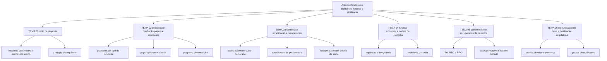

# Resposta a incidentes, forense e resiliência

O art. 6º do Regulamento de Comunicação de Incidente de Segurança da ANPD fixa em **três dias úteis**, contados do conhecimento de que o incidente afetou dados pessoais, o prazo para comunicar a ANPD, com o mesmo prazo para o titular no art. 9º ([in.gov.br](https://www.in.gov.br/web/dou/-/resolucao-cd/anpd-n-15-de-24-de-abril-de-2024-556243024), publicado no DOU de 26/04/2024, acessado em 2026-09-25). Três dias úteis é menos tempo do que a maioria das investigações forenses leva para fechar o escopo. Esta área existe para que o CISO decida com informação incompleta sem transformar a decisão em improviso.

## 1. Introdução

### 1.1 O que é esta área

Esta área cobre o que acontece entre a detecção de um incidente e a volta à operação normal: como o ciclo de resposta é organizado, o que precisa existir antes do primeiro alerta, como se contém e se erradica um adversário, como se produz evidência que se sustenta, quanto tempo a empresa aguenta ficar parada e o que ela comunica a quem.

Ficam fora do escopo: a operação diária de monitoramento e a triagem que decide o que vira incidente (área 10), a exploração técnica usada pelo atacante (área 13), a priorização de vulnerabilidades que alimenta a janela de correção (área 12), a mecânica de criptografia que protege o backup (área 07) e as bases legais de tratamento de dado pessoal (área 14). Aqui se decide o que fazer, em que ordem, com que prova e com que prazo.

### 1.2 Por que isso importa para o CISO

O SP 800-61 Rev. 3 foi publicado em abril de 2025 e substitui a revisão de 06/08/2012; a edição de 2025 descreve as recomendações de resposta a incidentes distribuídas pelas atividades de gestão de risco do CSF 2.0, e não mais como uma sequência isolada de fases ([csrc.nist.gov](https://csrc.nist.gov/pubs/sp/800/61/r3/final), acessado em 2026-09-25). A consequência prática é que a resposta passa a ser avaliada junto com governança, identificação e proteção, e não como um processo à parte que começa quando algo dá errado.

Considere a mesa de decisão de uma sexta-feira à noite. O time detecta exfiltração em um servidor que hospeda dados de clientes. O CISO precisa, antes de ter o escopo completo: autorizar o isolamento de um sistema que fatura, decidir se a comunicação regulatória já foi disparada, dizer ao jurídico o que pode ser afirmado em público e informar ao conselho na segunda-feira de manhã com números. Cada uma dessas decisões pertence a um tema desta área, e todas têm prazo. O prazo da decisão é mais curto que o prazo da verdade.

Há também o custo de não ter nada preparado. O SP 800-84 descreve o desenho, a condução e a avaliação de eventos de teste, treinamento e exercício que treinam pessoas, exercitam planos e testam sistemas antes de uma situação adversa ([csrc.nist.gov](https://csrc.nist.gov/pubs/sp/800/84/final), acessado em 2026-09-25). Empresa sem esse programa descobre quem deveria ter sido avisado durante o incidente, e não antes dele.

### 1.3 O que você será capaz de fazer ao final

- Situar cada atividade do seu time de resposta em uma atividade do processo de gestão de incidentes da ISO/IEC 27035-1:2023 e no SP 800-61 Rev. 3, com o tempo medido de cada transição.
- Montar o playbook de um tipo de incidente com gatilho, matriz de severidade, alçada de decisão e janela de preservação de evidência, sem depender de fornecedor.
- Conduzir um exercício de mesa, produzindo lista de lacunas com dono e prazo, e reexecutar o exercício para medir a correção.
- Decidir contenção, erradicação e recuperação em um incidente em curso, justificando a ordem das ações pelo custo de cada uma.
- Especificar a coleta de evidência de um incidente, com integridade verificável e registro de custódia do primeiro ao último manuseio.
- Determinar, com o texto normativo na mão, quem notifica o quê, com que conteúdo e em quanto tempo.

### 1.4 Os temas desta área, em prosa

O [TEMA-01](TEMA-01-ciclo-de-resposta-a-incidentes.md) estabelece o ciclo: o que conta como incidente confirmado, quais atividades compõem o processo segundo a ISO/IEC 27035-1:2023 e quais marcas de tempo o CISO precisa medir para saber se o ciclo funciona. O [TEMA-02](TEMA-02-preparacao-playbooks-papeis-exercicios.md) trata do que precisa existir antes do alerta: playbook por tipo de incidente, papéis, plantão, alçada para agir em produção e o programa de exercícios que valida tudo isso.

O [TEMA-03](TEMA-03-contencao-erradicacao-recuperacao.md) entra na execução: as opções de contenção com o custo de cada uma, o que erradicar além do arquivo malicioso e quais critérios autorizam voltar à operação normal. O [TEMA-04](TEMA-04-forense-digital-evidencia-cadeia-de-custodia.md) cobre a prova: aquisição, integridade, cadeia de custódia e o limite entre investigar e tratar dado pessoal sem base legal.

O [TEMA-05](TEMA-05-continuidade-de-negocios-recuperacao-de-desastre.md) sai do incidente e entra na capacidade: BIA, RTO, RPO, backup imutável e restauração testada, que definem quanto tempo a empresa aguenta ficar fora do ar. O [TEMA-06](TEMA-06-comunicacao-de-crise-notificacao-regulatoria.md) fecha com comunicação: comitê de crise, porta-voz, conteúdo do comunicado e os prazos de notificação à ANPD, ao titular e às autoridades setoriais.

## 2. Objetivos de aprendizagem (terminais)

| # | Objetivo | Bloom | Temas que o sustentam |
|---|---|---|---|
| 1 | Descrever o processo de gestão de incidentes e situar cada atividade do time em uma de suas etapas, com o tempo medido de cada transição. | entender | TEMA-01, TEMA-02 |
| 2 | Montar o playbook de um tipo de incidente, com gatilho, severidade, papéis, alçada e janela de preservação de evidência. | aplicar | TEMA-02 |
| 3 | Planejar e conduzir um exercício de mesa, produzindo lacunas com dono e prazo, e reexecutá-lo para medir a correção. | aplicar | TEMA-02, TEMA-06 |
| 4 | Decidir contenção, erradicação e recuperação em um incidente em curso, justificando a ordem pelo custo e pela reversibilidade. | avaliar | TEMA-03 |
| 5 | Especificar a coleta de evidência de um incidente, com integridade verificável e custódia registrada, respeitando o limite do dado pessoal. | criar | TEMA-04 |
| 6 | Determinar o que a empresa comunica, a quem e em quanto tempo, sustentando a decisão em registro normativo e no registro do próprio incidente. | avaliar | TEMA-05, TEMA-06 |

## 3. Diagrama dos tópicos

Rótulos sem `<`, `"`, `(` e `#`; nenhum nó usa `end` como id de nó.

## 4. Temas

| # | tema_id | Tema | Nível | Tempo |
|---|---|---|---|---|
| 1 | TEMA-01 | Ciclo de resposta a incidentes | intermediario | 40-50 min |
| 2 | TEMA-02 | Preparação: playbooks, papéis e exercícios | intermediario | 45-55 min |
| 3 | TEMA-03 | Contenção, erradicação e recuperação | intermediario | 40-50 min |
| 4 | TEMA-04 | Forense digital: evidência e cadeia de custódia | avancado | 45-55 min |
| 5 | TEMA-05 | Continuidade de negócios e recuperação de desastre | intermediario | 40-50 min |
| 6 | TEMA-06 | Comunicação de crise e notificação regulatória | avancado | 40-50 min |

## 5. Pré-requisitos e sequência

A área depende de [01 Fundamentos](../01-fundamentos/README.md) para o vocabulário de controle, risco e incidente, e de [10 Operações e SOC](../10-operacoes-soc/README.md) porque o ciclo começa no que a detecção entrega. A ordem `ordem_estudo` desta área é 14 no README raiz, imediatamente depois do SOC.

| Antes | Esta área | Depois |
|---|---|---|
| 06-endpoint-plataforma, 10-operacoes-soc | 11-resposta-forense | 12-vulnerabilidades-threat-intel |

Dentro da área, TEMA-06 pode ser lido depois de TEMA-01: o prazo do regulador corre desde o conhecimento do incidente, e o TEMA-01 define quando esse relógio começa.

## 6. Certificações desta área

Siglas apenas; domínios, pesos, custos e validade pertencem a [90-certificacoes/](../90-certificacoes/README.md). Os domínios de exame de CHFI e GCFA não foram conferidos em fonte primária nesta execução: NAO CONFIRMADO em fonte oficial.

| Certificação | Sigla | O que cobre aqui |
|---|---|---|
| Computer Hacking Forensic Investigator | CHFI | Aquisição de evidência, análise de disco e cadeia de custódia |
| GIAC Certified Forensic Analyst | GCFA | Análise forense de host e reconstrução de linha do tempo |
| ISACA CISM | CISM | Governança da resposta, comunicação ao executivo e continuidade |

## 7. Conexões com outras áreas

Relações de saída dos temas desta área que apontam para fora dela, agregadas do frontmatter
`relacoes`. A visão consolidada está em [mapa-relacoes.md](../mapa-relacoes.md); as regras, em
[templates/RELACOES-TEMAS.md](../templates/RELACOES-TEMAS.md). Alvos marcados como pendentes
ainda não foram escritos.

| Tema daqui | Relação | Destino | Por que |
|---|---|---|---|
| TEMA-01 | complementa | 10-operacoes-soc#TEMA-01 | o modelo de SOC e o ciclo de resposta descrevem o mesmo plantão: quem atende, com que cobertura horária e em quanto tempo |
| TEMA-01 | complementa | 12-vulnerabilidades-threat-intel#TEMA-04 | as técnicas do ATT&CK descrevem o que o adversário faz entre a detecção e a erradicação, e sem elas o ciclo para no primeiro alerta |
| TEMA-02 | aplicado_em | 17-lideranca-ciso#TEMA-03 | a lacuna apontada no exercício só sai do papel quando entra no pedido de verba do ciclo seguinte |
| TEMA-02 | complementa | 10-operacoes-soc#TEMA-01 | o SOC decide e escala; o ciclo de resposta a incidentes é o outro lado do mesmo processo, e as fases só fecham quando os dois são lidos juntos |
| TEMA-02 | complementa | 13-ofensiva-pentest#TEMA-02 | o mesmo escopo autorizado que limita o exercício adversarial limita o exercício de mesa: quem pode ser afetado, com qual finalidade e até onde |
| TEMA-03 | aplicado_em | 02-governanca-risco-compliance#TEMA-02 | isolar um sistema em produção só é permitido se a alçada estiver publicada como procedimento aprovado, com dono e exceção |
| TEMA-03 | complementa | 10-operacoes-soc#TEMA-06 | a automação que contém um host em segundos só existe se o playbook tiver decidido antes o que roda sem gente na sala |
| TEMA-04 | complementa | 05-rede-infraestrutura#TEMA-06 | o fluxo e o pacote retidos são a evidência da investigação, e retenção e integridade se decidem na rede antes do incidente |
| TEMA-04 | nao_confundir_com | 14-dados-privacidade#TEMA-04 | coletar evidência forense não autoriza tratar dado pessoal para outra finalidade |
| TEMA-05 | complementa | 02-governanca-risco-compliance#TEMA-03 | a tolerância a indisponibilidade declarada no apetite de risco é o teto que o RTO do processo crítico não pode ultrapassar |
| TEMA-06 | aplicado_em | 14-dados-privacidade#TEMA-04 | o prazo de três dias úteis da comunicação com dado pessoal obriga o comitê a decidir sob informação incompleta |
| TEMA-06 | complementa | 13-ofensiva-pentest#TEMA-06 | o achado ofensivo que expõe dado pessoal entra na mesma decisão de comunicação, com conteúdo e prazo definidos antes do resultado chegar |

## 8. Atividades práticas e laboratórios

| # | Atividade | O que a prática demonstra | Pré-requisito técnico |
|---|---|---|---|
| 1 | Reconstruir a linha do tempo de três incidentes do último ano, com as seis marcas de tempo do TEMA-01 | Que o tempo maior raramente está na investigação e quase sempre na decisão | acesso ao registro de chamados |
| 2 | Escrever o playbook de conta privilegiada comprometida em duas páginas | Que playbook útil cabe em duas páginas e diz quem decide, não só o que fazer | nenhum |
| 3 | Rodar um exercício de mesa de 90 minutos com jurídico, comunicação e operações | Que as lacunas aparecem nas interfaces entre áreas, não dentro do time técnico | sala e relógio |
| 4 | Isolar uma máquina de laboratório, capturar a memória e conferir o hash da cópia | Que a decisão de desligar antes de capturar destrói a evidência mais volátil | uma máquina virtual |
| 5 | Restaurar um backup real em ambiente separado e cronometrar | Que o RTO declarado raramente é o RTO praticado | acesso ao servidor de backup |
| 6 | Redigir o comunicado de incidente para três públicos e cronometrar o tempo de aprovação | Que o gargalo da notificação regulatória está na aprovação, não na redação | nenhum |

## 9. Checkpoint da área

Cinco itens retirados dos temas, fora da ordem original. Responda antes de abrir o gabarito.

1. O time percebe às 22h de quinta-feira que um servidor com dados de clientes foi acessado por conta de serviço. A investigação só termina na terça. Quando começa o prazo de comunicação à ANPD? (TEMA-01)
2. O playbook diz "em caso de ransomware, isolar a máquina". Quem executa essa ação às 3h da manhã, e o que faz o playbook faltar quando ninguém responde? (TEMA-02)
3. Durante a contenção, o time quer desligar o servidor comprometido para interromper o ataque. Que decisão do TEMA-03 responde a essa pergunta, e o que se perde se ela for tomada sem critério? (TEMA-03)
4. A investigação exige uma cópia do banco de clientes afetado. Que obrigação a cópia cria e qual é o limite entre investigar e tratar dado pessoal? (TEMA-04)
5. O plano declara RTO de 4 horas, mas o cofre de chaves que o sistema usa leva 6 horas para voltar. Qual é o RTO real do serviço? (TEMA-05)
6. A empresa decide não comunicar porque o dado afetado é "só cadastro". Que registro precisa existir, mesmo assim, e por quanto tempo? (TEMA-06)

Conferir respostas e critério

1. O prazo corre do conhecimento de que o incidente afetou dados pessoais, não da conclusão da apuração. Se o controlador soube na quinta à noite que havia dado pessoal no servidor, os três dias úteis contam de sexta-feira; a complementação fundamentada tem prazo próprio, de vinte dias úteis, conforme o art. 6º, §3º, do Regulamento.
2. O playbook precisa nomear o papel de plantão com alçada, não só a ação. Sem cobertura horária declarada, a ação de contenção espera o horário comercial e o atacante ganha o intervalo.
3. A decisão de contenção considera custo e reversibilidade antes de agir. Desligar sem capturar o estado volátil perde processos em execução, conexões abertas e conteúdo de memória, que não voltam depois.
4. A cópia é operação de tratamento com finalidade nova, com base legal própria e prazo de eliminação. A cadeia de custódia explica a origem da cópia; ela não autoriza usar o dado para outra finalidade.
5. Seis horas, porque o RTO do serviço é o maior tempo da cadeia de dependências, e não o menor.
6. O registro do incidente, inclusive do incidente não comunicado, com os motivos da ausência de comunicação entre os oito itens mínimos do art. 10, mantido por no mínimo cinco anos.

Critério para seguir adiante: acertar 80% ou mais sem consultar os temas. Erro no item 3 indica que a contenção ainda está sendo tratada como reflexo técnico e não como decisão de negócio.

## 10. Termos desta área

Termos que o glossário central precisa conter; as definições ficam em [glossario.md](../glossario.md).

- incidente de segurança
- incidente confirmado
- ciclo de resposta a incidentes
- playbook
- matriz de severidade
- alçada de decisão
- plantão de resposta
- exercício de mesa
- teste treinamento e exercício
- contenção
- erradicação
- recuperação
- persistência
- estado volátil
- ordem de volatilidade
- aquisição forense
- imagem de disco
- hash de integridade
- cadeia de custódia
- evidência digital
- análise de impacto no negócio
- RTO
- RPO
- plano de continuidade de negócios
- plano de recuperação de desastre
- backup imutável
- restauração testada
- comitê de crise
- porta-voz
- comunicado de posição
- notificação regulatória
- comunicação de incidente de segurança
- registro do incidente
- ampla divulgação do incidente

## 11. Fontes verificadas

| # | Título | Tipo | URL | Acessado em | Confiança |
|---|---|---|---|---|---|
| 1 | NIST SP 800-61 Rev. 3 — Incident Response Recommendations and Considerations for Cybersecurity Risk Management: A CSF 2.0 Community Profile | primaria | https://csrc.nist.gov/pubs/sp/800/61/r3/final | "2026-09-25" | alta |
| 2 | ISO/IEC 27035-1:2023 — Information security incident management — Part 1: Principles and process | primaria | https://www.iso.org/standard/78973.html | "2026-09-25" | alta |
| 3 | NIST SP 800-86 — Guide to Integrating Forensic Techniques into Incident Response | primaria | https://csrc.nist.gov/pubs/sp/800/86/final | "2026-09-25" | alta |
| 4 | ISO 22301:2019 — Business continuity management systems | primaria | https://www.iso.org/standard/75106.html | "2026-09-25" | media |
| 5 | Resolução CD/ANPD nº 15, de 24 de abril de 2024 | primaria | https://www.in.gov.br/web/dou/-/resolucao-cd/anpd-n-15-de-24-de-abril-de-2024-556243024 | "2026-09-25" | alta |
| 6 | NIST SP 800-184 — Guide for Cybersecurity Event Recovery | primaria | https://csrc.nist.gov/pubs/sp/800/184/final | "2026-09-25" | alta |
| 7 | NIST SP 800-84 — Guide to Test, Training, and Exercise Programs for IT Plans and Capabilities | primaria | https://csrc.nist.gov/pubs/sp/800/84/final | "2026-09-25" | alta |
| 8 | ISO/IEC 27037:2012 — Guidelines for identification, collection, acquisition and preservation of digital evidence | primaria | https://www.iso.org/standard/44381.html | "2026-09-25" | media |

NAO CONFIRMADO em fonte oficial nesta execução: a data de publicação e a edição da ISO 22301:2019 e a identificação completa da ISO/IEC 27037:2012 foram lidas no índice de busca do domínio iso.org, que confirma título e escopo, e não na página de cada norma; os domínios de exame de CHFI, GCFA e CISM; e os prazos específicos de notificação da Diretiva (UE) 2022/2555, cuja página oficial da Comissão Europeia confirma a obrigação de notificar incidentes significativos à autoridade nacional competente sem fixar as horas no texto lido.

---

| Navegação | |
|---|---|
| Anterior | [10 Operações de segurança e SOC](../10-operacoes-soc/README.md) |
| Próximo | [12 Gestão de vulnerabilidades e threat intelligence](../12-vulnerabilidades-threat-intel/README.md) |
| Home | [README](../README.md) |
