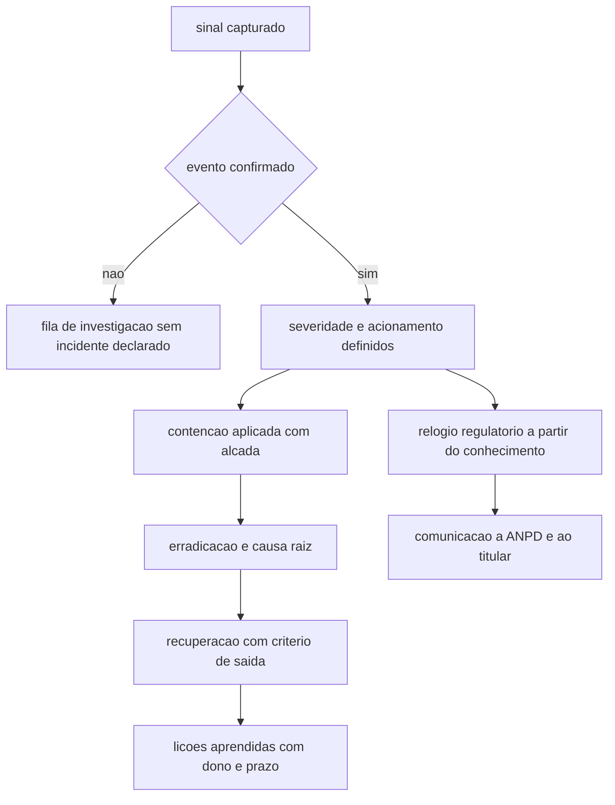

# Ciclo de resposta a incidentes

O Regulamento de Comunicação de Incidente de Segurança define incidente de segurança como **evento adverso confirmado** relacionado à violação das propriedades de confidencialidade, integridade, disponibilidade e autenticidade de dados pessoais (art. 3º, XII, [in.gov.br](https://www.in.gov.br/web/dou/-/resolucao-cd/anpd-n-15-de-24-de-abril-de-2024-556243024), acessado em 2026-09-25). A palavra que muda a rotina do time é *confirmado*: sinal, alerta e suspeita ficam antes da porta, e o ciclo começa quando alguém assume que o evento aconteceu. Essa confirmação tem custo de tempo, e o relógio do regulador já corre a partir do momento em que o controlador sabe que o incidente afetou dados pessoais, contado em três dias úteis (art. 6º, §1º).

## 1. Objetivo de aprendizagem

Ao final deste tema você deve conseguir: descrever as atividades do processo de gestão de incidentes e situar cada uma delas em uma marca de tempo mensurável do próprio ambiente, distinguindo o relógio técnico do relógio regulatório.

## 2. Pré-requisitos

[01 Fundamentos #TEMA-07](../01-fundamentos/TEMA-07-controles-preventivos-detectivos.md), porque o ciclo trabalha com controle detectivo, corretivo e compensatório, e a distinção aparece na hora de justificar por que a contenção foi mais lenta do que o previsto. A leitura prévia de [10 Operações e SOC](../10-operacoes-soc/README.md) ajuda na interface entre detecção e resposta, e não é obrigatória para entender este tema.

## 3. Pré-teste

Responda de palpite, antes de ler o resto. Anote a confiança de 1 a 5.

1. Quantas horas, em média, passaram entre a detecção e a contenção no último incidente da sua empresa?
   Confiança: ___
2. Existe uma data e hora registradas do momento em que a empresa soube que o incidente afetava dados pessoais? Onde está esse registro?
   Confiança: ___
3. Quem, na sua empresa, tem autoridade para declarar que um evento confirmado é um incidente e acionar o time?
   Confiança: ___
4. O que o seu time chama de "encerramento" de um incidente?
   Confiança: ___

## 4. Caso real

Um CISO de uma empresa de serviços financeiros com 4.000 funcionários entra numa segunda-feira com quatro incidentes no registro do trimestre. O relatório mostra a mesma frase nos quatro: "contenção em 26 horas em média". A diretoria pergunta se esse número é bom. Ninguém sabe responder, porque não existe registro do momento da detecção, do momento da confirmação, do momento em que alguém decidiu conter e do tempo que a decisão levou para virar ação em produção.

A pergunta que o caso deixa aberta: das quatro transições entre detecção e contenção, qual é a que consome o tempo. A resposta costuma mudar a natureza do investimento pedido — mais ferramenta, mais plantão ou mais alçada.

## 5. Conteúdo

### 5.1 Conceito

O processo de gestão de incidentes tem atividades nomeadas. A ISO/IEC 27035-1:2023, edição 2 publicada em 13/02/2023, é a base da série 27035 e apresenta conceitos, princípios e processo com as atividades-chave de gestão de incidentes de segurança da informação, descrevendo uma abordagem estruturada para preparar-se para, detectar, reportar, avaliar e responder a incidentes e aplicar as lições aprendidas; a orientação é genérica e aplicável a organizações de qualquer tipo, porte ou natureza, e também a organizações externas que prestam serviços de gestão de incidentes ([iso.org](https://www.iso.org/standard/78973.html), acessado em 2026-09-25). São seis atividades, e preparar aparece antes de tudo.

O NIST mudou o formato do guia de resposta. O SP 800-61 Rev. 3, publicado em abril de 2025, substitui a revisão de 06/08/2012 e se apresenta como um community profile do CSF 2.0: as recomendações de resposta a incidentes são incorporadas às atividades de gestão de risco cibernético descritas no framework, com o objetivo declarado de preparar a organização, reduzir o número e o impacto dos incidentes e melhorar a eficiência das atividades de detecção, resposta e recuperação ([csrc.nist.gov](https://csrc.nist.gov/pubs/sp/800/61/r3/final), acessado em 2026-09-25). Ler o guia como lista de etapas ignora a mudança: o que a edição de 2025 faz é distribuir resposta por governança, identificação, proteção, detecção, resposta e recuperação.

Há uma consequência para a estrutura do time. A ISO/IEC 27035-1:2023 declara aplicabilidade a organizações externas que prestam serviços de gestão de incidentes. Um CISO que contrata resposta gerenciada, forense externo ou serviço de plantão terceirizado precisa saber que a norma cobre o fornecedor também, e que contrato sem atividade, prazo e evidência definidos deixa a empresa sem o serviço que pensava ter comprado.

O ciclo termina em lições aprendidas, e essa atividade tem destinatário. O SP 800-184, publicado em dezembro de 2016, trata de planejamento, desenvolvimento de playbook, teste e melhoria do planejamento de recuperação, e registra que melhorar continuamente o planejamento a partir das lições de eventos passados, inclusive de outras organizações, ajuda a assegurar a continuidade de funções de missão importantes ([csrc.nist.gov](https://csrc.nist.gov/pubs/sp/800/184/final), acessado em 2026-09-25). Lição aprendida sem item de plano, dono e data é ata de reunião.

### 5.2 Como funciona

O ciclo funciona com duas contagens de tempo em paralelo. A primeira é técnica: quanto o time leva para confirmar, avaliar, conter, erradicar e recuperar. A segunda é regulatória: quanto tempo a empresa tem para comunicar. As duas não compartilham o mesmo ponto de partida, e confundi-las é o erro que produz comunicação atrasada.

| Marca | O que é | Quem registra | O que costuma consumir o tempo |
|---|---|---|---|
| t0 | Primeiro sinal, capturado ou não pelo monitoramento | Ferramenta de detecção | Sinal que não gera alerta por falta de caso de uso |
| t1 | Confirmação de que o evento aconteceu | Analista do plantão | Falta de telemetria para distinguir teste de ataque |
| t2 | Decisão de severidade e acionamento do playbook | Dono do plantão | Discutir severidade sem matriz acordada |
| t3 | Contenção aplicada | Quem tem alçada em produção | Escalonamento de aprovação fora do horário |
| t4 | Erradicação concluída | Time técnico | Não saber quais credenciais e chaves foram expostas |
| t5 | Operação normal restabelecida | Dono do serviço | Voltar sem critério de saída e recair |
| tR | Conhecimento de que o incidente afetou dados pessoais | Controlador, pelo encarregado | Depender de inventário de dados que não existe |

O ponto crítico é tR. O prazo de três dias úteis à ANPD e ao titular conta do conhecimento pelo controlador de que o incidente afetou dados pessoais, e não da conclusão da apuração; o próprio regulamento prevê complementação fundamentada em vinte dias úteis, o que existe justamente porque a comunicação inicial é feita com informação incompleta (arts. 6º e 9º do Regulamento). Quem espera a perícia para comunicar perde o prazo e ganha a agravante de ter comunicado fora do prazo.

### 5.3 Exemplo resolvido

Incidente de ransomware em servidor de arquivos de um escritório regional. Os registros permitem reconstruir a linha do tempo abaixo.

| Marca | Hora | Registro |
|---|---|---|
| t0 | Quinta 21h10 | EDR gera alerta de processo de cifra em massa; alerta fica na fila |
| t1 | Quinta 23h40 | Analista de plantão confirma cifra de arquivos de um compartilhamento |
| t2 | Sexta 00h15 | Playbook de ransomware acionado, severidade alta, gerente de plantão notificado |
| t3 | Sexta 01h00 | Host isolado pela rede e conta de serviço desabilitada |
| tR | Sexta 09h30 | Encarregado confirma que o compartilhamento continha dados de clientes |
| t4 | Sexta 18h00 | Persistência removida, credenciais expostas rotacionadas |
| t5 | Sábado 14h00 | Serviço restaurado a partir de backup verificado e monitorado por 14 dias |

Três leituras saem dessa tabela.

Primeira: 2h30 entre t0 e t1, gastas porque o alerta ficou na fila. É problema de plantão e de severidade de alerta, não de ferramenta.

Segunda: 20 minutos entre t1 e t2, e 45 minutos entre t2 e t3. O gargalo da contenção foi a aprovação para isolar um host que servia outra unidade, o que se resolve com alçada pré-aprovada no playbook.

Terceira: tR às 09h30 de sexta-feira. Três dias úteis a partir daí terminam na quarta-feira. A comunicação inicial precisou sair com o escopo conhecido — quatro mil arquivos, categoria de dado a confirmar — e a complementação veio vinte dias úteis depois, com o número fechado.

Regra de conversão que evita erro de calendário: dias úteis não incluem fim de semana nem feriado, e o prazo em dobro do art. 6º, §8º, vale para agente de tratamento de pequeno porte. A contagem começa no primeiro dia útil seguinte ao conhecimento.

### 5.4 Problema de completar

Caso novo: campanha de phishing entrega um infostealer em três estações. O EDR detecta às 14h de terça. O time confirma às 16h. O playbook exige verificar se as credenciais corporativas foram usadas em acesso externo; essa verificação termina na quarta às 10h e mostra um login válido a partir de endereço estrangeiro. O provedor de e-mail em nuvem confirma o acesso, e as caixas contêm dados de clientes anexados em propostas.

Preencha as etapas e feche as três últimas.

1. t0, t1 e t2, com o registro que cada um exige: __________
2. Ação de contenção imediata e quem tem alçada para executá-la: __________
3. Produto da erradicação, além de remover o malware: __________
4. O que define tR neste caso, e quando vence o prazo de três dias úteis: __________
5. Qual lição aprendida gera item de plano com dono e data, dentro do que a ISO/IEC 27035-1:2023 chama de aplicar lições aprendidas: __________

## 6. Por que isso importa para o CISO

A medida do ciclo é o que sustenta o pedido de plantão, de alçada e de orçamento. Sem as marcas de tempo, a conversa com o conselho vira adjetivo; com elas, a comparação fica com números da própria empresa: cada hora adicional entre t1 e t3 é janela em que o adversário move dados, e cada hora entre t1 e tR é risco de prazo regulatório perdido.

Há um segundo efeito, de exposição pessoal. A Diretiva (UE) 2022/2555 exige que as entidades de porte médio e grande em 18 setores críticos adotem medidas de gestão de risco e notifiquem incidentes significativos à autoridade nacional competente, e introduz responsabilização da alta administração pelo descumprimento dessas medidas ([digital-strategy.ec.europa.eu](https://digital-strategy.ec.europa.eu/en/policies/nis2-directive), acessado em 2026-09-25). Um grupo com operação na Europa precisa saber qual autoridade recebe qual notificação, e essa resposta depende do TEMA-06.

E há o efeito que aparece no orçamento do ano seguinte. Lições aprendidas alimentam o plano de maturidade, e o plano de maturidade é o documento que transforma um incidente em três linhas de investimento aprovadas.

## 7. Aplicação prática

Escolha os três incidentes mais caros dos últimos doze meses. Para cada um, reconstrua t0, t1, t2, t3, t4, t5 e tR a partir dos registros que existem: chamado, alerta do EDR, troca de mensagem, log de mudança em produção, registro de comunicação. Monte uma tabela por incidente e calcule as diferenças em horas.

Depois responda três perguntas por escrito, em uma página: qual transição consumiu mais tempo nos três casos; qual delas se corrige com processo e qual exige investimento; e existe registro de tR em algum dos três. Se tR não existir, o primeiro item do plano é instrumentar essa marca, porque sem ela o prazo regulatório fica sem dono.

## 8. Autoexplicação

Explique o tema em três frases, sem consultar o texto. Uma sobre a diferença entre sinal, evento confirmado e incidente; uma sobre as seis atividades do processo da ISO/IEC 27035-1:2023; e uma ligando o relógio técnico ao relógio regulatório usando um incidente que você já viveu.

## 9. Erros comuns e equívocos

| Equívoco | Por que está errado | O que é correto |
|---|---|---|
| O ciclo começa no alerta | O regulamento exige evento adverso confirmado; alerta é sinal | Trate t0 e t1 como marcas separadas, com dono diferente |
| O prazo regulatório conta da conclusão da apuração | O art. 6º conta do conhecimento de que o incidente afetou dados pessoais | Comunique com o que sabe, registre os motivos da demora e complemente em vinte dias úteis |
| Encerrar é parar de receber alertas do caso | Sem lição aprendida com dono e prazo, o mesmo incidente volta | Encerramento exige item de plano, dono e data, e a ISO/IEC 27035-1:2023 nomeia a aplicação de lições aprendidas entre as atividades-chave |
| Investir em ferramenta reduz o tempo total | O tempo costuma estar entre a confirmação e a decisão, e entre a decisão e a ação | Meça cada transição antes de escolher onde gastar |
| Contratar resposta gerenciada transfere a responsabilidade | A ISO/IEC 27035-1:2023 se aplica também a quem presta o serviço, e o contrato precisa definir atividade, prazo e evidência | Escreva o contrato com as marcas de tempo exigidas do fornecedor |
| O incidente mais grave é o que gera mais alertas | Volume de alerta mede ruído de detecção, não impacto | Severidade sai de matriz acordada com o negócio, não da contagem de alertas |

## 10. Recuperação ativa

Responda tudo antes de abrir o gabarito.

1. Quais são as atividades-chave do processo de gestão de incidentes segundo o resumo da ISO/IEC 27035-1:2023, e qual delas vem antes da detecção?
2. O que o SP 800-61 Rev. 3 mudou em relação à edição que ele substitui, e qual foi a data de publicação de cada edição?
3. De que evento o prazo de três dias úteis para comunicar à ANPD começa a contar, e o que o regulamento prevê para informação incompleta?
4. Cite as sete marcas de tempo do ciclo e diga qual delas mede risco regulatório.
5. Por que a ISO/IEC 27035-1:2023 importa para quem contrata serviço externo de resposta?

Conferir respostas

1. Preparar-se para incidentes, detectar, reportar, avaliar, responder e aplicar as lições aprendidas. Preparar vem antes da detecção.
2. A edição de 2025 é um community profile do CSF 2.0 e distribui as recomendações de resposta pelas atividades de gestão de risco cibernético, com publicação em abril de 2025; ela substitui o SP 800-61 Rev. 2, publicado em 06/08/2012.
3. Do conhecimento pelo controlador de que o incidente afetou dados pessoais, não da conclusão da apuração. O regulamento permite complementação fundamentada em vinte dias úteis a contar da comunicação.
4. t0 primeiro sinal, t1 confirmação, t2 decisão de severidade e acionamento, t3 contenção aplicada, t4 erradicação concluída, t5 operação normal restabelecida e tR conhecimento de que houve dado pessoal afetado. tR é a marca que mede risco regulatório.
5. Porque a norma declara aplicabilidade também a organizações externas que prestam serviços de gestão de incidentes, o que permite exigir do fornecedor atividade, prazo e evidência em contrato, em vez de confiar na capacidade declarada.

## 11. Revisão espaçada

Os intervalos abaixo são sugestão. O calendário e o estado pertencem ao plano de estudo ([91-trilhas](../91-trilhas/README.md)), que mantém `proxima_revisao` no registro de progresso.

| Intervalo | O que fazer | Se errar |
|---|---|---|
| D+1 | Responder a seção 10 sem reler | Rebaixar: repetir em D+1 |
| D+7 | Reconstruir a linha do tempo de um incidente real nas sete marcas | Rebaixar: repetir em D+3 |
| D+30 | Levar a tabela de tempos para a reunião de revisão e pedir decisão sobre o maior gargalo | Rebaixar: repetir em D+7 |

## 12. Conexões com outros temas

Leitura humana do `relacoes` do frontmatter — que é a fonte. Relações que saem desta área
também aparecem em [mapa-relacoes.md](../mapa-relacoes.md). Regras em
[templates/RELACOES-TEMAS.md](../templates/RELACOES-TEMAS.md).

| Relação | Alvo | Por que |
|---|---|---|
| complementa | 10-operacoes-soc#TEMA-01 | o modelo de SOC e o ciclo de resposta descrevem o mesmo plantão: quem atende, com que cobertura horária e em quanto tempo |
| complementa | 11-resposta-forense#TEMA-06 | o ciclo define o que fazer e em que ordem; a comunicação define quem sabe o quê e em quanto tempo, e as duas decisões travam uma na outra |
| complementa | 12-vulnerabilidades-threat-intel#TEMA-04 | as técnicas do ATT&CK descrevem o que o adversário faz entre a detecção e a erradicação, e sem elas o ciclo para no primeiro alerta |

## 13. Certificações e leitura recomendada

| Certificação | Domínio coberto | Recurso | Tipo | Fonte |
|---|---|---|---|---|
| CHFI | Aquisição de evidência e cadeia de custódia dentro da resposta | Índice de certificações do roadmap | secundaria | [90-certificacoes/](../90-certificacoes/README.md) |
| GCFA | Análise forense de host durante o tratamento do incidente | Índice de certificações do roadmap | secundaria | [90-certificacoes/](../90-certificacoes/README.md) |

Leitura recomendada: [NIST SP 800-61 Rev. 3, recomendações de resposta organizadas pelas atividades de gestão de risco do CSF 2.0](https://csrc.nist.gov/pubs/sp/800/61/r3/final); [ISO/IEC 27035-1:2023, conceitos, princípios e processo de gestão de incidentes](https://www.iso.org/standard/78973.html); [Regulamento de Comunicação de Incidente de Segurança da ANPD](https://www.in.gov.br/web/dou/-/resolucao-cd/anpd-n-15-de-24-de-abril-de-2024-556243024).

## 14. Fontes verificadas

| # | Título | Tipo | URL | Acessado em | Confiança |
|---|---|---|---|---|---|
| 1 | NIST SP 800-61 Rev. 3 | primaria | https://csrc.nist.gov/pubs/sp/800/61/r3/final | "2026-09-25" | alta |
| 2 | ISO/IEC 27035-1:2023 | primaria | https://www.iso.org/standard/78973.html | "2026-09-25" | alta |
| 3 | Resolução CD/ANPD nº 15, de 24 de abril de 2024 | primaria | https://www.in.gov.br/web/dou/-/resolucao-cd/anpd-n-15-de-24-de-abril-de-2024-556243024 | "2026-09-25" | alta |
| 4 | NIST SP 800-184 — Guide for Cybersecurity Event Recovery | primaria | https://csrc.nist.gov/pubs/sp/800/184/final | "2026-09-25" | alta |
| 5 | Diretiva (UE) 2022/2555 — página oficial da Comissão Europeia | primaria | https://digital-strategy.ec.europa.eu/en/policies/nis2-directive | "2026-09-25" | alta |

NAO CONFIRMADO em fonte oficial nesta execução: as horas específicas de notificação da Diretiva (UE) 2022/2555, que exigem a leitura do artigo pertinente e do ato de transposição nacional; e a fonte primária que formula a ordem de volatilidade usada no TEMA-04, não lida nesta execução.

---

| Navegação | |
|---|---|
| Área | [11 Resposta a incidentes, forense e resiliência](./README.md) |
| Próximo tema | [TEMA-02](TEMA-02-preparacao-playbooks-papeis-exercicios.md) |
| Home | [README](../README.md) |
