# Gestão de vulnerabilidades e threat intelligence

O NIST definiu em abril de 2022 o patch management empresarial como o processo de identificar, priorizar, adquirir, instalar e verificar a instalação de correções em toda a organização, e enquadrou a atividade como manutenção preventiva de tecnologia. Esta área cobre o que vem antes e depois desse processo: o inventário que o alimenta, o critério que ordena a fila, a inteligência que informa o que está sendo explorado, o catálogo de comportamento adversário que orienta a detecção e as métricas que provam se a exposição caiu. Ignorar essa cadeia produz o resultado mais comum em auditoria: nota de severidade sem prazo, prazo sem dono e dono sem evidência de que a correção chegou ao dispositivo.

## 1. Introdução

### 1.1 O que é esta área

A área trata de dois objetos que se cruzam. O primeiro é a vulnerabilidade instalada no seu ambiente — o defeito de código, firmware ou configuração que existe em um ativo identificável, com dono e prazo. O segundo é a informação sobre quem explora o quê — o adversário, sua infraestrutura e o procedimento observado. O cruzamento dos dois é o que separa uma fila de correção defensável de uma lista de CVEs ordenada por nota.

Está dentro do escopo: inventário e descoberta de exposição, pontuação e priorização, ciclo de correção e fechamento, fontes e níveis de threat intelligence, mapeamento em MITRE ATT&CK, divulgação responsável de falhas e métricas de exposição.

Está fora do escopo, por pertencer a outra área: a execução do patch no parque de máquinas (área 06), a percepção de exploração em tempo real e a triagem do alerta (área 10), as metodologias e o escopo do teste ofensivo contratado (área 13) e a resposta ao incidente em si (área 11).

### 1.2 Por que isso importa para o CISO

A FIRST publica diariamente, para cada CVE, uma probabilidade de exploração em campo nos próximos 30 dias, com valor entre 0 e 1 e percentil de ranking, e mantém o CVSS v4.0 como padrão de pontuação com quatro grupos de métricas. A CISA mantém um catálogo que descreve como fonte autoritativa de vulnerabilidades que já foram exploradas em campo, estabelecido pela Binding Operational Directive 22-01. Com esses três insumos públicos e gratuitos, o CISO consegue responder à pergunta que o comitê faz primeiro — "por que aquele item crítico de nota máxima continua aberto há meses?" — com um critério escrito em vez de uma opinião.

O efeito prático é de orçamento e de exposição. Sem critério, a equipe corrige o que é fácil e reporta o que é favorável; a métrica de exposição sobe e o relatório do comitê vira uma lista de porcentagens que ninguém consegue contestar nem usar para decidir. Com critério escrito — exploração confirmada, probabilidade estimada, contexto do ativo — o CISO justifica deixar 200 itens de nota máxima no fim da fila e 9 itens de nota média no topo, e sustenta a decisão quando o auditor perguntar quem autorizou.

### 1.3 O que você será capaz de fazer ao final

- Montar uma fila de correção com critério de priorização declarado, prazo por faixa e registro de verificação por item fechado.
- Ler um vetor CVSS v4.0 e uma pontuação EPSS, e decidir quando cada um dos dois muda a ordem da fila.
- Classificar uma fonte de inteligência por finalidade e por confiança declarada, e transformar um indicador em requisito de detecção ou de coleta.
- Mapear comportamento adversário em MITRE ATT&CK com versão e data, e usar o mapa para justificar lacuna de detecção.
- Avaliar um programa de recebimento de relatos e de divulgação responsável contra o que o ISO/IEC 29147 e o ISO/IEC 30111 exigem de um fornecedor.
- Construir três números de exposição que resistem à auditoria: tempo de exposição, taxa de verificação e concentração de dívida de remediação.

### 1.4 Os temas desta área, em prosa

O TEMA-01 trata do processo completo, do inventário ao fechamento com evidência. O TEMA-02 trata do critério: CVSS v4.0, EPSS e o catálogo de exploração em campo, e o que cada um responde. O TEMA-03 trata das fontes e dos níveis de inteligência, e do requisito que a inteligência precisa atender para valer alguma coisa. O TEMA-04 trata do uso prático do MITRE ATT&CK como linguagem de comportamento, não como lista de ferramentas. O TEMA-05 trata do caminho de entrada do relato externo de falha, do achado de pesquisador ao aviso publicado. O TEMA-06 trata da medição: exposição, tempo e dívida de remediação.

## 2. Objetivos de aprendizagem (terminais)

| # | Objetivo | Bloom | Temas que o sustentam |
|---|---|---|---|
| 1 | Descrever o processo de gestão de vulnerabilidades em cinco etapas, com o estágio de verificação no dispositivo incluído e o registro de fechamento por item. | entender | TEMA-01 |
| 2 | Aplicar CVSS v4.0, EPSS e o catálogo de exploração em campo para ordenar uma fila de correção, justificando a posição de três itens com nota alta deixados no fim. | aplicar | TEMA-02 |
| 3 | Avaliar uma fonte de inteligência quanto à finalidade e à confiança declarada, decidindo se ela muda uma detecção, um prazo ou nenhuma das duas. | avaliar | TEMA-03 |
| 4 | Aplicar MITRE ATT&CK para escolher cobertura de detecção, com versão e data registradas e lacuna declarada por tática. | aplicar | TEMA-04 |
| 5 | Avaliar um programa de recebimento de relatos e divulgação contra os requisitos do ISO/IEC 29147 e do ISO/IEC 30111, apontando o que falta antes de abrir recompensa. | avaliar | TEMA-05 |
| 6 | Construir métricas de exposição e dívida de remediação com definição explícita de numerador, denominador e data de referência, e criticar uma métrica de percentual corrigido. | criar | TEMA-06 |

## 3. Diagrama dos tópicos

```mermaid
flowchart TD
  A[Area 12 Vulnerabilidades e threat intelligence]
  A --> B[TEMA 01 processo do inventario ao fechamento]
  B --> B1[Inventario de software e configuracao]
  B --> B2[Fila com prazo e dono]
  B --> B3[Verificacao no dispositivo]
  A --> C[TEMA 02 CVSS EPSS e exploracao em campo]
  C --> C1[CVSS v4.0 quatro grupos de metricas]
  C --> C2[EPSS probabilidade em 30 dias]
  C --> C3[Catalogo de exploracao confirmada]
  A --> D[TEMA 03 fontes e niveis de inteligencia]
  D --> D1[Requisito de inteligencia]
  D --> D2[Confianca declarada e decay do indicador]
  A --> E[TEMA 04 MITRE ATT&CK na pratica]
  E --> E1[Tatica e tecnica]
  E --> E2[Cobertura e lacuna]
  A --> F[TEMA 05 bug bounty e divulgacao responsavel]
  F --> F1[Canal de recebimento]
  F --> F2[Aviso publicado e CVE]
  A --> G[TEMA 06 metricas de exposicao e divida]
  G --> G1[Tempo de exposicao]
  G --> G2[Taxa de verificacao]
  G --> G3[Concentracao em poucos ativos]
```

Os rótulos do diagrama não usam `<`, `"`, `(` nem `#`, e nenhum nó se chama `end`.

## 4. Temas

| # | tema_id | Tema | Nível | Tempo |
|---|---|---|---|---|
| 1 | TEMA-01 | [Gestão de vulnerabilidades: do inventário ao fechamento](TEMA-01-gestao-de-vulnerabilidades-do-inventario-ao-fechamento.md) | intermediario | 35-45 min |
| 2 | TEMA-02 | [CVSS, EPSS e priorização por risco real](TEMA-02-cvss-epss-e-priorizacao-por-risco-real.md) | intermediario | 40-50 min |
| 3 | TEMA-03 | [Threat intelligence: fontes e níveis](TEMA-03-threat-intelligence-fontes-e-niveis.md) | intermediario | 30-40 min |
| 4 | TEMA-04 | [MITRE ATT&CK na prática](TEMA-04-mitre-attack-na-pratica.md) | intermediario | 35-45 min |
| 5 | TEMA-05 | [Bug bounty e divulgação responsável](TEMA-05-bug-bounty-e-divulgacao-responsavel.md) | intermediario | 30-40 min |
| 6 | TEMA-06 | [Métricas de exposição e dívida de remediação](TEMA-06-metricas-de-exposicao-e-divida-de-remediacao.md) | avancado | 35-45 min |

## 5. Pré-requisitos e sequência

A área 10 entrega a detecção: sem fonte de telemetria mapeada, um indicador de inteligência não vira alerta. A área 11 entrega o ciclo de resposta e a noção de prazo, dono e evidência, que o TEMA-01 reaproveita no fechamento do item de correção. As duas vêm antes por isso, e não por ordem alfabética.

| Antes | Esta área | Depois |
|---|---|---|
| [10-operacoes-soc](../10-operacoes-soc/README.md) | 12-vulnerabilidades-threat-intel | [09-aplicacoes-devsecops](../09-aplicacoes-devsecops/README.md) |
| [11-resposta-forense](../11-resposta-forense/README.md) | 12-vulnerabilidades-threat-intel | [13-ofensiva-pentest](../13-ofensiva-pentest/README.md) |

Dentro da área, o TEMA-02 pressupõe o TEMA-01 (não há fila sem inventário), o TEMA-04 pressupõe o TEMA-03 (não há mapa de comportamento sem fonte), o TEMA-05 pressupõe o TEMA-01 (o relato externo entra no mesmo processo) e o TEMA-06 pressupõe o TEMA-01 e o TEMA-02 (não há métrica sem processo nem sem critério).

## 6. Certificações desta área

| Certificação | Sigla | O que cobre aqui |
|---|---|---|
| CompTIA Cybersecurity Analyst | CySA+ | TEMA-01, TEMA-02, TEMA-03, TEMA-04 |
| Microsoft Security Operations Analyst | SC-200 | TEMA-01, TEMA-02, TEMA-04 |

Os domínios, os pesos e o custo das credenciais ficam em [90-certificacoes/](../90-certificacoes/README.md). O SC-200 é citado por aparecer no TEMA-03 da área 06 com a mesma matéria; a lista de domínios do exame não foi conferida nesta execução: NAO CONFIRMADO em fonte oficial.

## 7. Conexões com outras áreas

Relações de saída dos temas desta área que apontam para fora dela, agregadas do frontmatter
`relacoes`. A visão consolidada está em [mapa-relacoes.md](../mapa-relacoes.md); as regras, em
[templates/RELACOES-TEMAS.md](../templates/RELACOES-TEMAS.md). Alvos marcados como pendentes
ainda não foram escritos.

| Tema daqui | Relação | Destino | Por que |
|---|---|---|---|
| TEMA-01 | complementa | 13-ofensiva-pentest#TEMA-03 | a lista de pares dispositivo e vulnerabilidade é o mesmo objeto que o teste de caixa branca percorre com julgamento humano e escopo acordado |
| TEMA-01 | nao_confundir_com | 13-ofensiva-pentest#TEMA-01 | varredura e inventário de exposição rodam em escala e repetem toda semana; o teste ofensivo encadeia exploração com julgamento humano e escopo acordado |
| TEMA-02 | complementa | 06-endpoint-plataforma#TEMA-03 | o critério de priorização definido aqui só se converte em correção quando a janela de patch do endpoint o executa |
| TEMA-02 | complementa | 13-ofensiva-pentest#TEMA-05 | o achado descrito no relatório de teste entra na fila pelo mesmo critério de probabilidade estimada e contexto do ativo |
| TEMA-02 | nao_confundir_com | 07-criptografia-segredos#TEMA-06 | prazo de descontinuação de algoritmo é decisão de padrão com data; EPSS e CVSS medem a vulnerabilidade explorada no momento |
| TEMA-03 | aplicado_em | 10-operacoes-soc#TEMA-02 | indicador sem fonte de telemetria mapeada vira relatório; o log precisa existir para o indicador virar detecção |
| TEMA-04 | complementa | 10-operacoes-soc#TEMA-03 | a matriz diz qual comportamento observar e o caso de uso de detecção entrega a regra que observa |
| TEMA-04 | complementa | 11-resposta-forense#TEMA-01 | a mesma matriz organiza a triagem do incidente e a hipótese de contenção |
| TEMA-04 | complementa | 13-ofensiva-pentest#TEMA-04 | o exercício adversarial valida no ambiente a cobertura que o mapa de técnicas declarou, e o resultado volta para o mapa |
| TEMA-05 | aplicado_em | 13-ofensiva-pentest#TEMA-06 | autorizar teste e receber relato de falha usam o mesmo documento de escopo e salvo-conduto |
| TEMA-06 | aplicado_em | 02-governanca-risco-compliance#TEMA-06 | exposição e dívida medidas são as linhas de métrica que o comitê consome |
| TEMA-06 | nao_confundir_com | 03-arquitetura-engenharia#TEMA-06 | dívida de desenho adiada e item de correção vencido têm dono, prazo e instrumento de medição diferentes |

## 8. Atividades práticas e laboratórios

| # | Atividade | O que a prática demonstra | Pré-requisito técnico |
|---|---|---|---|
| 1 | Escolher 20 itens corrigidos no último trimestre e tentar preencher quatro datas por item: publicação pelo fornecedor, detecção, instalação e verificação | Quais etapas do processo existem e quais só existem no discurso | Nenhum; ata, chamado e mensagem de time bastam |
| 2 | Consultar a pontuação EPSS e o vetor CVSS de 10 itens do seu inventário e reordenar a fila com os dois números lado a lado | Por que nota alta e probabilidade baixa produzem filas diferentes | Acesso público ao CSV ou à API do EPSS, sem custo |
| 3 | Mapear as três últimas ocorrências de alerta do seu ambiente nas táticas e técnicas do ATT&CK e marcar as táticas sem nenhuma detecção | A diferença entre contagem de regras e cobertura de comportamento | Lista de alertas do último mês |
| 4 | Rodar um exercício de mesa em que um pesquisador externo envia relato de falha e o prazo interno é cumprido ou perdido | Onde o canal de recebimento trava: triagem, área jurídica ou engenharia | Nenhum |
| 5 | Apurar o tempo de exposição de 10 itens abertos há mais de 90 dias e verificar quantos estão em menos de cinco ativos | Que dívida de remediação é frequentemente problema de poucos ativos, não de capacidade de correção | Inventário de software e registro de chamado |

## 9. Checkpoint da área

Avaliação somativa e intercalada. Os itens abaixo vêm das seções de recuperação ativa dos temas, sem item novo, e a ordem das perguntas não segue a ordem dos temas. O sexto item vem de fora da área, do TEMA-03 do guia de endpoint.

1. O que o EPSS estima exatamente, com que horizonte temporal e com que frequência de atualização? (TEMA-02)
2. Qual é o pré-requisito operacional que o OWASP Cheat Sheet de divulgação exige antes de abrir um programa de recompensa? (TEMA-05)
3. O que é dívida de remediação e por que a concentração em poucos ativos muda a decisão? (TEMA-06)
4. Por que um item com instalação concluída e reportada pela ferramenta não fecha sem verificação no dispositivo? (TEMA-01)
5. Quantas táticas a matriz Enterprise do ATT&CK exibia na leitura data desta área, e por que o mapeamento precisa de versão? (TEMA-04)
6. Quais três filtros de priorização o TEMA-03 da área 06 aplica em sequência? (06-endpoint-plataforma#TEMA-03)

Conferir respostas e critério

1. A probabilidade de um CVE publicado ser explorado em campo nos próximos 30 dias. O modelo do FIRST publica um valor entre 0 e 1 com percentil de ranking, todos os dias, para cada CVE, com acesso livre por arquivo CSV e por API.
2. Ter um processo de divulgação maduro, com capacidade de triagem e de correção antes de receber volume externo. Sem isso a recompensa compra fila, não segurança.
3. É o conjunto de itens abertos além do prazo declarado, com dono e idade. Quando a maior parte se concentra em poucos ativos, a decisão muda de natureza: passa a ser substituição, isolamento ou aceite formal, e não mais um ciclo de patch.
4. Porque a instalação pode concluir e o sistema seguir executando o código antigo até o reinício, e porque existem reversão e falha silenciosa. O que prova correção é o estado da versão lido no próprio dispositivo.
5. A matriz exibia 15 táticas na data de acesso registrada em TEMA-04. O mapa precisa de versão e data porque a matriz muda: táticas e sub-técnicas entram e saem, e um mapa sem versão não é auditável.
6. Exploração confirmada em campo, probabilidade estimada de exploração e exposição do dispositivo.

Critério para seguir adiante: acertar 5 dos 6 itens sem consultar os temas. Erro no item 4 ou no item 6 indica que o processo de fechamento ainda não está claro; revisar o TEMA-01 e o TEMA-06 antes de avançar.

## 10. Termos desta área

- vulnerabilidade, exposição e superfície de ataque
- patch management e manutenção preventiva de tecnologia
- CVSS, vetor CVSS, métrica Base, métrica Threat, métrica Environmental
- EPSS, percentil de ranking, probabilidade de exploração em campo
- catálogo de vulnerabilidades exploradas em campo
- threat intelligence, indicador, requisito de inteligência
- MITRE ATT&CK, tática, técnica, sub-técnica, procedimento
- divulgação responsável e divulgação coordenada
- bug bounty, salvo-conduto e canal de recebimento de relato
- aviso de segurança, CVE e identificador de vulnerabilidade
- tempo de exposição e dívida de remediação

As definições pertencem ao [glossario.md](../glossario.md); esta lista apenas declara o que o glossário precisa conter.

## 11. Fontes verificadas

| # | Título | Tipo | URL | Acessado em | Confiança |
|---|---|---|---|---|---|
| 1 | NIST SP 800-40 Rev. 4, abril de 2022, substitui a Rev. 3 de 22/07/2013, DOI 10.6028/NIST.SP.800-40r4; define o processo em identificar, priorizar, adquirir, instalar e verificar | primaria | https://csrc.nist.gov/pubs/sp/800/40/r4/final | "2026-09-25" | alta |
| 2 | NIST SP 800-150, outubro de 2016, DOI 10.6028/NIST.SP.800-150; define informação de ameaça cibernética e orienta o estabelecimento de relações de compartilhamento | primaria | https://csrc.nist.gov/pubs/sp/800/150/final | "2026-09-25" | alta |
| 3 | FIRST — CVSS v4.0 Specification Document, versão 1.2 de 18/06/2024; quatro grupos de métricas, nomenclatura CVSS-B, BT, BE e BTE, escala qualitativa de severidade | primaria | https://www.first.org/cvss/v4.0/specification-document | "2026-09-25" | alta |
| 4 | FIRST — EPSS, probabilidade de exploração em campo nos próximos 30 dias, valor entre 0 e 1 com percentil de ranking, publicada diariamente | primaria | https://www.first.org/epss/ | "2026-09-25" | alta |
| 5 | CISA — Known Exploited Vulnerabilities Catalog, descrito pela agência como fonte autoritativa de vulnerabilidades exploradas em campo, estabelecido pela Binding Operational Directive 22-01 | primaria | https://www.cisa.gov/known-exploited-vulnerabilities-catalog | "2026-09-25" | media |
| 6 | MITRE ATT&CK, base de conhecimento de táticas e técnicas adversariais baseada em observações do mundo real; matriz Enterprise com 15 táticas na leitura | primaria | https://attack.mitre.org/ | "2026-09-25" | alta |
| 7 | ISO/IEC 29147:2018, edição 2, publicada em 23/10/2018, 32 páginas; requisitos e recomendações a fornecedores sobre divulgação de vulnerabilidades | primaria | https://www.iso.org/standard/72311.html | "2026-09-25" | alta |
| 8 | ISO/IEC 30111:2019, edição 2, publicada em 01/10/2019, 13 páginas; requisitos e recomendações para processar e remediar vulnerabilidades reportadas | primaria | https://www.iso.org/standard/69725.html | "2026-09-25" | alta |
| 9 | OWASP Cheat Sheet Series — Vulnerability Disclosure Cheat Sheet; modelos de divulgação, arquivo security.txt conforme RFC 9116 e requisitos de programa de recompensa | primaria | https://cheatsheetseries.owasp.org/cheatsheets/Vulnerability_Disclosure_Cheat_Sheet.html | "2026-09-25" | alta |

Itens não confirmados nesta execução, e por isso não afirmados em nenhum tema: prazos de correção previstos na Binding Operational Directive 22-01 (a página do catálogo e a da diretiva não renderizaram); conteúdo do SSVC (a página devolveu erro de servidor); versão da matriz do MITRE ATT&CK (a data da versão não é exibida na página lida); versões e governança de STIX, TAXII e das taxonomias MISP; escala Admiralty de confiabilidade de fonte; qualquer estatística de tempo de remediação, de quantidade de vulnerabilidades exploradas ou de custo de incidente.

---

| Navegação | |
|---|---|
| Anterior | [11 Resposta a incidentes, forense e resiliência](../11-resposta-forense/README.md) |
| Próximo | [09 Segurança de aplicações e DevSecOps](../09-aplicacoes-devsecops/README.md) |
| Home | [README](../README.md) |
