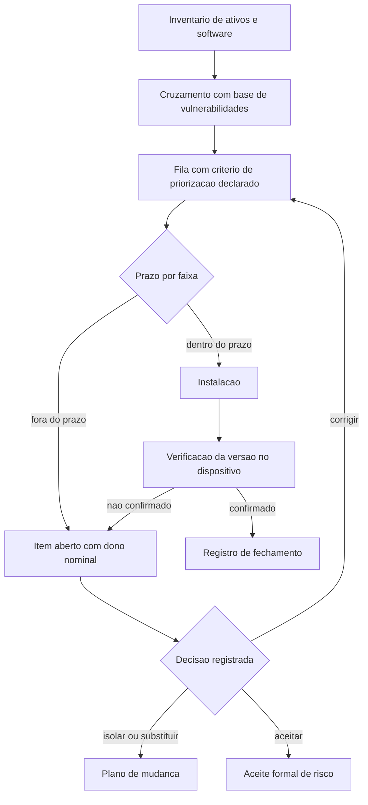

# Gestão de vulnerabilidades: do inventário ao fechamento

Uma ideia central: gestão de vulnerabilidades é um processo de cinco etapas com uma etapa de prova no fim — verificar a instalação no dispositivo — e um item só fecha quando existe registro de que a versão corrigida está em execução.

## 1. Objetivo de aprendizagem

Ao final deste tema você deve conseguir: descrever o processo em cinco etapas, incluindo a verificação no dispositivo e o registro de fechamento por item, e apontar quais dessas etapas a sua organização não executa hoje.

## 2. Pré-requisitos

Nada. Este é o primeiro tema da área. A área 06 trata da execução do patch em si, no parque de máquinas; aqui o objeto é o processo, o critério e a evidência que atravessa o parque inteiro.

## 3. Pré-teste

Responda de palpite, antes de ler o resto. Anote a confiança de 1 a 5.

1. Qual percentual do software instalado no seu parque você aposta que entrou por instalação gerenciada? Dê um número de palpite.
   Confiança: ___
2. Das cinco etapas do processo, quantas você acha que a sua empresa executa com registro, e não apenas com relatório de ferramenta?
   Confiança: ___
3. Se um auditor pedisse hoje o nome do dono de cada item crítico aberto há mais de 90 dias, você aposta que a resposta sairia em uma hora?
   Confiança: ___
## 4. Caso real

O NIST publicou em abril de 2022 o SP 800-40 Rev. 4, com o título Guide to Enterprise Patch Management Planning: Preventive Maintenance for Technology. O documento substitui a Rev. 3, de 22 de julho de 2013, e define o processo em cinco verbos: identificar, priorizar, adquirir, instalar e verificar a instalação de patches, atualizações e upgrades em toda a organização.

O motivo declarado da revisão está na abertura: existe com frequência uma divisão entre donos de negócio e de missão de um lado e a gestão de segurança e tecnologia do outro quanto ao valor de aplicar correção. A resposta do NIST foi reenquadrar a atividade como manutenção preventiva de tecnologia — custo de fazer negócio e parte necessária para cumprir a missão.

Esse mesmo enquadramento é o que permite comparar a gestão de vulnerabilidades com outras manutenções que a empresa já aceita sem discussão: revisão de elevador, troca de filtro, recarga de extintor. Todas têm janela recorrente, orçamento recorrente e registro por execução. Nenhuma delas é negociada de novo a cada ciclo.

A pergunta que o caso deixa aberta: das cinco etapas, qual delas a sua empresa executa com evidência, e não apenas com relatório de ferramenta?

## 5. Conteúdo

### 5.1 Conceito

Vulnerabilidade é uma condição do ativo que pode ser explorada. Ela entra na empresa por três portas: código do sistema operacional, software de terceiro instalado e componente embarcado que ninguém lembra que existe — biblioteca dentro de um agente, firmware de um equipamento de rede, runtime distribuído com uma aplicação. A terceira porta é a que produz surpresa, porque o inventário de software costuma registrar apenas o que passou por instalação gerenciada.

O processo começa pelo inventário e não pela varredura. Varredura sem inventário produz lista de pares dispositivo e vulnerabilidade sem dono, e lista sem dono não vira fila. O inventário precisa responder quatro perguntas por ativo: o que é, quem responde por ele, qual software e qual versão ele executa, e quão exposto ele está. Sem as quatro, a etapa seguinte vira exercício de planilha.

A priorização é decisão declarada, não consequência automática da gravidade. Uma organização que corrige por nota de severidade em ordem decrescente tomou uma decisão, mesmo sem escrever: escolheu ignorar a probabilidade de exploração e o valor do ativo. A decisão escrita é preferível porque sobrevive à troca de analista e porque é auditável.

O fechamento é o que transforma atividade em resultado. Fechar significa instalar, verificar no dispositivo, registrar as datas e, quando o prazo não for cumprido, deixar o item aberto com dono nominal e decisão registrada. As três opções diante de um item que não fecha por correção são substituir, isolar ou aceitar formalmente o risco — e as três exigem assinatura.

### 5.2 Como funciona

O ciclo tem cinco etapas e uma regra de retorno. A regra de retorno é o que impede o ciclo de virar campanha: o item que não fechou volta para a fila com dono e prazo novo, e aparece no relatório seguinte.

A etapa de identificação cruza três conjuntos: inventário de software por dispositivo, versões daquele software e base de vulnerabilidades publicadas. O produto é uma lista de pares dispositivo e vulnerabilidade. Essa lista é maior do que a capacidade de correção da organização, quase sempre, e é por isso que a etapa seguinte existe.

A priorização ordena os pares por mais de um sinal. A pontuação de severidade descreve o defeito. A probabilidade estimada de exploração descreve o comportamento provável do atacante. O catálogo público de exploração confirmada diz o que já foi usado contra organizações reais. O contexto do ativo diz quanto aquilo importa para você. Os quatro respondem a perguntas diferentes e nenhum substitui o outro.

A instalação precisa de janela. Correção de sistema operacional, de software de terceiro e de firmware compete com a produção pela mesma janela de manutenção. Tratar essa disputa como exceção faz cada ciclo virar negociação nova.

A verificação é a etapa que exige instrumentação no dispositivo. O agente lê a versão do componente corrigido e reporta. O que a ferramenta de distribuição reporta é a entrega do pacote. São duas informações diferentes, e apenas a segunda aparece na maioria dos painéis.

### 5.3 Exemplo resolvido

Uma empresa tem 400 estações de trabalho, 60 servidores e 12 equipamentos de rede gerenciáveis. O ciclo mensal de correção produziu 1.240 pares de dispositivo e vulnerabilidade. Cinco passos.

Passo 1 — conferir a cobertura do inventário. O cruzamento encontrou 47 dispositivos com pelo menos um software de terceiro sem registro de instalação gerenciada. Esses 47 entram no inventário antes de entrarem na fila. Sem isso, a fila mediria o processo, não a exposição.

Passo 2 — separar o que tem exploração confirmada em campo. O cruzamento com o catálogo mantido pela CISA — que a própria agência descreve como fonte autoritativa de vulnerabilidades exploradas em campo, estabelecido pela Binding Operational Directive 22-01 — devolveu 14 pares em 9 dispositivos distintos. Esses saem da fila comum e viram tarefa com prazo em dias.

Passo 3 — ordenar o restante. Para cada item, a empresa consulta a probabilidade de exploração publicada pelo FIRST, que estima a chance de exploração em campo nos próximos 30 dias, com valor entre 0 e 1 e percentil de ranking. Dois limites ficam escritos em política: acima do limite superior, fila prioritária; abaixo do limite inferior, fila de rotina. Dois limites escritos valem mais do que uma discussão por item.

Passo 4 — ponderar pelo ativo. Um item de probabilidade média em servidor com serviço exposto sobe à frente de um item de probabilidade média em estação de trabalho sem dado sensível. Este passo é o único que usa informação que só a organização tem, e é o que dá utilidade ao inventário.

Passo 5 — verificar e registrar. Trinta e seis horas depois da janela, o agente lê a versão do componente em cada dispositivo. Comparado com a versão publicada pelo fornecedor, o resultado se divide em três caixas: confirmado, pendente de reinício e revertido. Para cada item, quatro datas entram no registro: publicação pelo fornecedor, detecção no inventário, instalação e verificação.

O que o exercício entrega é uma tabela de tempo de exposição por faixa de prioridade e uma lista curta: os itens que não fecharam. Essa lista, com dono nominal, é o único artefato que o comitê precisa receber.

### 5.4 Problema de completar

O relatório do trimestre chegou com milhares de achados abertos, e a diretoria pergunta quantos são críticos de verdade. Monte a fila de priorização com os critérios deste tema e responda à pergunta final.

| Caso | O que a evidência prova | Ação | Quem assina |
|---|---|---|---|
| A instalação concluiu e o reinício ficou adiado em 22 máquinas | ____________ | ____________ | ____________ |
| O fornecedor publicou correção apenas para a versão mais recente do produto e o parque usa a anterior | ____________ | ____________ | ____________ |
| O agente lê versão antiga em 8 máquinas enquanto a ferramenta de distribuição reporta sucesso | ____________ | ____________ | ____________ |
| O item está em exploração confirmada em campo, segundo o catálogo público | ____________ | ____________ | ____________ |
| O item tem nota de severidade máxima e probabilidade de exploração baixa, em ativo isolado sem dado pessoal | ____________ | ____________ | ____________ |

Responda ainda: qual dos cinco casos exige decisão de arquitetura ou de contrato, e não de operação? Justifique em três linhas.

## 6. Por que isso importa para o CISO

A verificação no dispositivo é o único controle do programa de segurança que pode ser auditado por amostragem simples: pegue dez máquinas ao acaso, leia a versão do componente, compare com a versão publicada pelo fornecedor. Isso muda a conversa com auditor e com seguradora, porque a prova pode ser reproduzida por terceiro sem depender do seu painel.

O segundo efeito é de priorização sob restrição. Com critério escrito, o CISO deixa itens de severidade máxima na fila de rotina e justifica a decisão. Sem critério, a equipe corrige o que é fácil e o relatório do comitê vira defesa de número em vez de decisão de risco.

O terceiro efeito é de negociação interna, e o NIST o registrou: a resistência costuma vir de dono de negócio que enxerga janela de manutenção como parada de produção. Reenquadrar a atividade como manutenção preventiva, com janela e orçamento recorrentes, tira a discussão do terreno da exceção. Orçamento de base é mais fácil de defender do que pedido avulso, e uma janela no calendário anual não precisa ser reconquistada a cada mês.

## 7. Aplicação prática

Escolha vinte itens de correção fechados no último trimestre. Para cada um, tente preencher quatro datas: publicação pelo fornecedor, detecção no inventário, instalação no dispositivo e verificação no dispositivo. Use o que existir — chamado, ata de comitê, mensagem de time. Não precisa de ferramenta nova.

O resultado esperado é que as duas primeiras datas apareçam em quase todas as linhas e as duas últimas em poucas. Depois, conte quantos itens abertos há mais de 90 dias existem hoje e em quantos ativos distintos eles estão concentrados. Se dez ativos concentrarem a maior parte, você não tem um problema de capacidade de correção; tem um problema de dez ativos.

## 8. Autoexplicação

Explique em três frases por que o inventário vem antes da varredura. Ligue ao seu ambiente: escolha um ativo cujo software você não sabe listar de memória — um equipamento de rede, um servidor legado, um agente instalado por fornecedor — e descreva como ele entraria na fila de correção hoje.

## 9. Erros comuns e equívocos

| Equívoco | Por que está errado | O que é correto |
|---|---|---|
| A ferramenta reportou sucesso na instalação, então o item está corrigido | Instalação concluída com reinício pendente mantém o código antigo em execução | Leia a versão do componente no próprio dispositivo |
| Varredura é o começo do processo | Sem inventário com dono, a varredura gera lista sem responsável | Inventarie ativo, dono, software e exposição antes de varrer |
| Severidade alta é prioridade alta | A nota descreve o defeito e ignora a probabilidade de exploração e o valor do ativo | Combine exploração confirmada, probabilidade estimada e contexto do ativo |
| Correção é projeto com data de término | É manutenção preventiva, com janela e orçamento recorrentes | Coloque janela no calendário e orçamento na base |
| Software fora de suporte sai da conta | Sem correção publicada, o item nunca fecha por patch | Decida entre substituir, isolar ou aceitar o risco formalmente |
| A lista de CVEs abertas mede a exposição | Contagem de itens não distingue probabilidade, exposição do ativo nem idade | Meça tempo de exposição, taxa de verificação e concentração |

## 10. Recuperação ativa

Responda tudo antes de abrir o gabarito.

1. Quais são as cinco etapas do processo definidas pelo NIST SP 800-40 Rev. 4, e qual delas exige instrumentação no dispositivo?
2. O que o inventário precisa responder por ativo para que a fila de correção exista?
3. Por que um item com instalação concluída e reportada pela ferramenta não fecha sem verificação no dispositivo?
4. O que significa um item fora do prazo e quais são as três decisões possíveis diante dele?
5. Por quais três portas uma vulnerabilidade entra na empresa, e qual delas costuma escapar do inventário de software?

Conferir respostas

1. Identificar, priorizar, adquirir, instalar e verificar a instalação. A verificação é a etapa que exige instrumentação no dispositivo, porque só o host pode reportar a versão do componente corrigido.
2. O que o ativo é, quem responde por ele, qual software e versão ele executa e quão exposto ele está. Sem dono, a lista de descobertas não vira fila.
3. Porque a instalação pode concluir e o sistema seguir executando o código antigo até o reinício, e porque existem reversão e falha silenciosa. A ferramenta prova entrega de pacote; o dispositivo prova versão corrigida.
4. É o item aberto além do prazo declarado na política. Diante dele, as decisões possíveis são corrigir com novo prazo e dono, isolar ou substituir o ativo, ou registrar aceite formal de risco.
5. Código do sistema operacional, software de terceiro instalado e componente embarcado que ninguém lembra que existe — biblioteca dentro de um agente, firmware de equipamento de rede, runtime distribuído com uma aplicação. A terceira porta é a que escapa, porque o inventário costuma registrar apenas o que passou por instalação gerenciada.

## 11. Revisão espaçada

| Intervalo | O que fazer | Se errar |
|---|---|---|
| D+1 | Listar de memória as cinco etapas e dizer qual delas é a de prova | Rebaixar: repetir em D+1 |
| D+7 | Tentar preencher as quatro datas para dez itens fechados no trimestre | Rebaixar: repetir em D+3 |
| D+30 | Verificar por amostragem dez máquinas contra a versão publicada pelo fornecedor e reportar o resultado ao comitê | Rebaixar: repetir em D+7 |

## 12. Conexões com outros temas

Leitura humana do `relacoes` do frontmatter — que é a fonte. Relações que saem desta área
também aparecem em [mapa-relacoes.md](../mapa-relacoes.md). Regras em
[templates/RELACOES-TEMAS.md](../templates/RELACOES-TEMAS.md).

| Relação | Alvo | Por que |
|---|---|---|
| complementa | 13-ofensiva-pentest#TEMA-03 | a lista de pares dispositivo e vulnerabilidade é o mesmo objeto que o teste de caixa branca percorre com julgamento humano e escopo acordado |
| nao_confundir_com | 13-ofensiva-pentest#TEMA-01 | varredura e inventário de exposição rodam em escala e repetem toda semana; o teste ofensivo encadeia exploração com julgamento humano e escopo acordado |

## 13. Certificações e leitura recomendada

| Certificação | Domínio coberto | Leitura recomendada |
|---|---|---|
| CySA+ | Operações de segurança; gestão de vulnerabilidades; resposta a incidentes; reporte e comunicação | [NIST SP 800-40 Rev. 4](https://csrc.nist.gov/pubs/sp/800/40/r4/final) |
| SC-200 | Cobertura declarada no guia da área (TEMA-01, TEMA-02 e TEMA-04); domínio de exame não publicado nas fontes conferidas | [CISA](https://www.cisa.gov/known-exploited-vulnerabilities-catalog) |
## 14. Fontes verificadas

| # | Título | Tipo | URL | Acessado em | Confiança |
|---|---|---|---|---|---|
| 1 | NIST SP 800-40 Rev. 4, abril de 2022, substitui a Rev. 3 de 22/07/2013, DOI 10.6028/NIST.SP.800-40r4; processo em cinco etapas e enquadramento como manutenção preventiva | primaria | https://csrc.nist.gov/pubs/sp/800/40/r4/final | "2026-09-25" | alta |
| 2 | CISA — Known Exploited Vulnerabilities Catalog, fonte autoritativa de vulnerabilidades exploradas em campo, estabelecida pela Binding Operational Directive 22-01 | primaria | https://www.cisa.gov/known-exploited-vulnerabilities-catalog | "2026-09-25" | media |
| 3 | FIRST — CVSS v4.0 Specification Document, versão 1.2; nota de que provedores de avaliação como o NVD normalmente publicam apenas a pontuação Base | primaria | https://www.first.org/cvss/v4.0/specification-document | "2026-09-25" | alta |

A página do catálogo de vulnerabilidades exploradas em campo não renderizou em leitura direta nesta execução; a descrição citada veio do índice de busca do domínio cisa.gov e a confiança é média. Os prazos de correção previstos na Binding Operational Directive 22-01 não foram lidos: NAO CONFIRMADO em fonte oficial. A página do NVD também não renderizou conteúdo além do título do site; a afirmação sobre o NVD neste tema vem da especificação do CVSS, não do próprio NVD.

---

| Navegação | |
|---|---|
| Área | [12 Gestão de vulnerabilidades e threat intelligence](./README.md) |
| Próximo tema | [TEMA-02](TEMA-02-cvss-epss-e-priorizacao-por-risco-real.md) |
| Home | [README](../README.md) |
