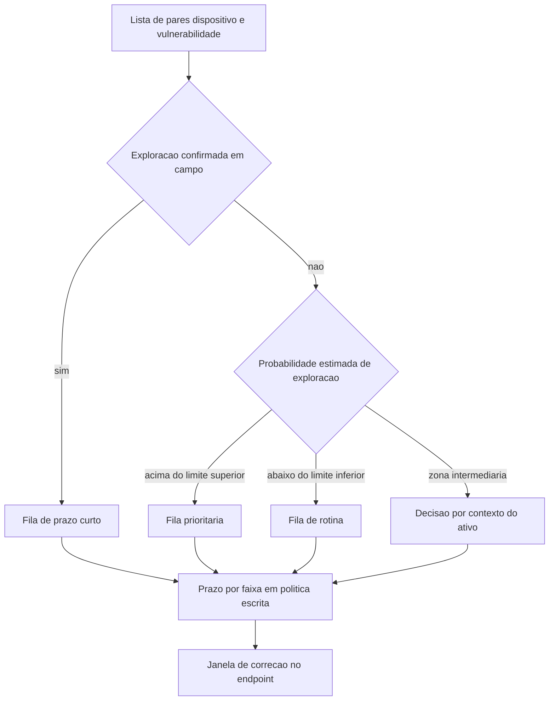

# CVSS, EPSS e priorização por risco real

Uma ideia central: existem três sinais públicos e gratuitos que respondem a perguntas diferentes — a severidade técnica do defeito, a probabilidade de alguém explorá-lo nos próximos 30 dias e a confirmação de que ele já foi explorado em campo — e a fila de correção só fica defensável quando os três entram na conta.

## 1. Objetivo de aprendizagem

Ao final deste tema você deve conseguir: ordenar uma fila de correção combinando CVSS v4.0, EPSS e exploração confirmada em campo, e justificar por escrito a posição de três itens de nota alta deixados no fim da fila.

## 2. Pré-requisitos

O [TEMA-01](TEMA-01-gestao-de-vulnerabilidades-do-inventario-ao-fechamento.md) vem antes: sem inventário e sem lista de pares dispositivo e vulnerabilidade, não existe fila para priorizar. A pontuação é o critério da fila, não o processo.

## 3. Pré-teste

Responda de palpite, antes de ler o resto. Anote a confiança de 1 a 5.

1. Um item de nota máxima e probabilidade de exploração de 0,002: você aposta que ele está no topo da fila da sua empresa hoje? Diga o que espera encontrar.
   Confiança: ___
2. Quando o fornecedor publica apenas a nota Base, o número que chega ao seu painel descreve o seu ambiente ou o pior caso genérico? Aposte antes de ler.
   Confiança: ___
3. Que percentual dos itens críticos abertos você aposta que já apareceu em um catálogo público de exploração confirmada em campo? Chute um número.
   Confiança: ___
## 4. Caso real

A especificação do CVSS v4.0 descreve como o cálculo foi construído: o grupo de trabalho reuniu 15 milhões de vetores CVSS-BTE em 270 conjuntos de equivalência sob uma relação de severidade qualitativa comparável, pediu a especialistas que comparassem vetores representando cada conjunto e usou essas comparações para ordenar os vetores do menos para o mais severo. Depois, escolheu quais conjuntos marcariam a fronteira entre as faixas de severidade, para manter compatibilidade com as faixas do CVSS v3.x.

Dois fatos dessa construção importam para quem usa o número. O primeiro é que as faixas qualitativas — None 0,0; Low 0,1 a 3,9; Medium 4,0 a 6,9; High 7,0 a 8,9; Critical 9,0 a 10,0 — continuam existindo, de propósito, para que a comparação histórica não quebrasse. O segundo é que a especificação afirma explicitamente que consumidores devem enriquecer as métricas Base com valores de Threat e Environmental específicos do seu uso, e que fatores como exigência regulatória, número de clientes afetados, perda financeira, risco à vida ou à propriedade e impacto reputacional estão fora do escopo do CVSS.

A mesma especificação registra que provedores de avaliação, entre eles o National Vulnerability Database, normalmente publicam apenas a pontuação Base, na nomenclatura CVSS-B. Isso significa que o número que chega ao seu painel, no caso mais comum, é o pior caso do defeito avaliado de forma agnóstica ao seu ambiente.

A pergunta que o caso deixa aberta: se o número publicado descreve o pior caso e ignora o seu ambiente, o que exatamente a sua empresa está medindo quando ordena a fila por ele?

## 5. Conteúdo

### 5.1 Conceito

O CVSS v4.0 tem quatro grupos de métricas. Base descreve as características intrínsecas do defeito, constantes no tempo e entre ambientes, assumindo o pior caso razoável. Threat descreve o que muda no tempo, como disponibilidade de código de prova de conceito e exploração ativa. Environmental descreve o que é específico do seu ambiente, incluindo mitigações existentes e criticidade do sistema vulnerável. Supplemental acrescenta contexto e não altera a pontuação.

A nomenclatura resolve uma confusão frequente. Um número publicado como CVSS-B usa apenas as métricas Base. CVSS-BT usa Base e Threat. CVSS-BE usa Base e Environmental. CVSS-BTE usa os três. Quatro números diferentes podem ser calculados para o mesmo defeito, e comparar um CVSS-B de fornecedor com um CVSS-BTE interno sem declarar a nomenclatura produz uma discussão sem chão.

A métrica Exploit Maturity, do grupo Threat, é a ponte entre pontuação e inteligência. Ela aceita quatro valores: Not Defined, Attacked, Proof-of-Concept e Unreported. Not Defined é o padrão e equivale a Attacked no cálculo, porque a regra é assumir o pior caso. A especificação recomenda preferir fontes de inteligência que cubram todas as vulnerabilidades em vez de cobertura parcial, usar mais de uma fonte, atualizar com frequência e automatizar a aplicação.

O EPSS responde a outra pergunta. É um modelo de aprendizado de máquina orientado a dado que estima a probabilidade de um CVE publicado ser explorado em campo nos próximos 30 dias. Publica um valor entre 0 e 1 com percentil de ranking, todos os dias, para cada CVE, com acesso livre por arquivo CSV e por interface de programação. A diferença de natureza em relação ao CVSS é central: a nota descreve o defeito, o EPSS descreve o futuro provável de exploração.

O terceiro sinal é binário e não é estimativa: o catálogo mantido pela CISA, que a agência descreve como fonte autoritativa de vulnerabilidades que já foram exploradas em campo, estabelecido pela Binding Operational Directive 22-01. Se o item está ali, alguém já usou aquele defeito contra uma organização real. Estimativa e confirmação não se substituem.

### 5.2 Como funciona

Os três sinais entram na fila em ordem diferente da que a maioria usa. A verificação de exploração confirmada vem primeiro porque não admite discussão. A probabilidade estimada vem depois, para ordenar o que ainda não foi usado. O contexto do ativo vem por último e é o que a organização acrescenta sozinha.

O ponto de decisão que mais gera atrito é a zona intermediária. Um item com probabilidade estimada média em ativo exposto sobe; o mesmo item em ativo isolado, sem dado pessoal e sem serviço publicado, desce. Esse ajuste é exatamente o que o grupo Environmental do CVSS prevê, e é a razão pela qual o fornecedor não consegue calcular a nota no seu lugar.

Existe um detalhe operacional que decide se o critério vive ou morre: os limites precisam estar escritos e assinados. Um documento de uma página com dois limites numéricos, a regra de desempate e a data de validade evita que cada analista aplique o seu próprio julgamento — e evita que a auditoria trate a fila como arbitrária.

O enriquecimento tem custo de manutenção. A pontuação EPSS muda todo dia. A métrica de maturidade de exploração muda quando aparece código de prova de conceito. Recalcular a fila sobre a base inteira toda semana é inviável na maior parte das empresas. A prática que se sustenta é recálculo automático para a faixa prioritária e recálculo por exceção para o resto.

### 5.3 Exemplo resolvido

A especificação do CVSS v4.0 traz vetores válidos de exemplo. Um deles é um CVSS-BT, ou seja, Base mais Threat:

`CVSS:4.0/AV:A/AC:H/AT:P/PR:L/UI:P/VC:H/VI:H/VA:H/SC:L/SI:L/SA:L/E:P`

Leitura campo a campo, na ordem fixa da especificação:

1. `AV:A` — Attack Vector Adjacent: a exploração é limitada, no nível do protocolo, a uma topologia logicamente adjacente, como a mesma sub-rede local, Bluetooth ou uma VPN dentro de uma zona administrativa.
2. `AC:H` — Attack Complexity High: o ataque depende de contornar mecanismos de proteção, como evasão de ASLR, ou de obter um segredo específico do alvo.
3. `AT:P` — Attack Requirements Present: existem condições de implantação e execução que precisam estar presentes, como vencer uma condição de corrida ou estar no caminho lógico da rede.
4. `PR:L` — Privileges Required Low: o atacante precisa de privilégio básico, limitado a recursos de um usuário comum.
5. `UI:P` — User Interaction Passive: a exploração exige interação involuntária da vítima, como acessar uma página alterada ou usar uma aplicação que gera tráfego em rede não confiável.
6. `VC:H/VI:H/VA:H` — impacto alto em confidencialidade, integridade e disponibilidade do sistema vulnerável.
7. `SC:L/SI:L/SA:L` — impacto baixo no sistema subsequente, aquele que sofre a consequência sem conter o defeito.
8. `E:P` — Exploit Maturity Proof-of-Concept: há código de prova de conceito público, sem conhecimento de tentativa de exploração e sem solução pronta de exploração disponível.

Decisão de fila a partir daí, com a nomenclatura declarada e o contexto do ativo:

- Se o mesmo vetor viesse sem `E`, o valor Not Defined equivaleria a Attacked e o pior caso já estaria embutido. Declarar `E:P` ou `E:U` é o que rebaixa o item, e é a única forma de o escore reagir ao tempo.
- Se o ativo em questão fosse um servidor com interface exposta e o vetor trouxesse `AV:N`, o item subiria de fila, porque Attack Vector Network amplia o conjunto de atacantes possíveis.
- Se o ativo fosse uma estação isolada sem dado pessoal, o item desceria, e o motivo iria escrito: exposição restrita e ausência de dado sensível.
- Se o mesmo item aparecesse no catálogo da CISA, a análise acima seria descartada para fins de prazo: exploração confirmada em campo não é probabilidade.

O número final do escore sai do cálculo de MacroVetores e interpolação descrito na especificação, com a implementação de referência publicada no repositório do projeto. Calcular à mão não é necessário; ler o vetor é.

### 5.4 Problema de completar

Três itens chegam à sua mesa no mesmo dia, todos com pontuação Base publicada como CVSS-B de faixa High e sem métricas de Threat e Environmental.

| Item | Onde está | EPSS do dia | Contexto do ativo |
|---|---|---|---|
| A | no catálogo público de exploração confirmada em campo | não consultado | servidor com serviço exposto |
| B | fora do catálogo | probabilidade alta, percentil de ranking elevado | servidor interno de banco de dados |
| C | fora do catálogo | probabilidade baixa, percentil de ranking pequeno | estação de trabalho sem dado pessoal |

Complete as cinco colunas e depois responda.

| Item | Posição na fila | Prazo sugerido | Motivo em uma linha | Nomenclatura a declarar no registro | Quem aprova a exceção se não fechar |
|---|---|---|---|---|---|
| A | ______ | ______ | ______ | ______ | ______ |
| B | ______ | ______ | ______ | ______ | ______ |
| C | ______ | ______ | ______ | ______ | ______ |

Responda ainda: qual dos três itens exige que você consulte obrigatoriamente as métricas Environmental antes de definir prazo, e por quê, em duas linhas.

## 6. Por que isso importa para o CISO

A conversa de fila muda de natureza quando os três sinais estão separados. Pergunta de comitê do tipo "por que o item crítico não foi corrigido?" deixa de ser respondida com esforço e passa a ser respondida com documento: o item tem nota máxima, probabilidade estimada baixa, ativo isolado sem dado pessoal e ausência no catálogo de exploração confirmada; a política manda ficar na fila de rotina; a decisão está registrada com data.

A segunda consequência é de qualidade de dado. A especificação do CVSS registra que provedores normalmente publicam apenas a pontuação Base. Quando o CISO descobre isso, descobre também que o painel de gestão de vulnerabilidades herdado mostra pior caso agnóstico ao ambiente. Corrigir essa lacuna — enriquecer com Threat e Environmental — é barato e altera a ordem da fila sem comprar nenhuma ferramenta nova.

A terceira consequência é de cobertura contratual. O grupo Supplemental inclui métricas que descrevem esforço de resposta e densidade de valor, e elas não mudam a nota. Elas servem para outra coisa: separar correção que exige substituição física de correção que exige uma atualização remota. Essa separação é o que impede o comitê de prometer prazo curto para um item que depende de janela de manutenção de hardware.

## 7. Aplicação prática

Pegue dez itens críticos ou altos abertos no seu inventário. Para cada um, monte uma linha com cinco colunas: identificador, pontuação publicada com a nomenclatura declarada, probabilidade EPSS do dia com o percentil, presença ou ausência no catálogo de exploração confirmada e exposição do ativo. O EPSS é acessível sem custo por arquivo CSV e por interface de programação.

Depois, reordene os dez por três critérios diferentes, na ordem: exploração confirmada, probabilidade estimada, exposição do ativo. Compare a nova ordem com a ordem atual da sua fila. A diferença entre as duas listas é o argumento que você levará ao comitê, e o número de itens de nota alta que mudaram de posição é o tamanho do problema de priorização.

## 8. Autoexplicação

Explique em três frases por que a nota de severidade sozinha não ordena fila. Ligue ao seu ambiente: escolha um item de nota alta que está aberto há mais tempo do que você gostaria e descreva, sem consultar nada, qual seria a sua justificativa se ele fosse cobrado hoje por um auditor.

## 9. Erros comuns e equívocos

| Equívoco | Por que está errado | O que é correto |
|---|---|---|
| Comparar CVSS-B publicado pelo fornecedor com o escore interno sem declarar nomenclatura | B, BT, BE e BTE usam grupos de métricas diferentes e não são comparáveis diretamente | Registre sempre a nomenclatura junto ao número |
| Usar EPSS como se fosse nota de gravidade | O EPSS estima probabilidade de exploração e não descreve impacto | Use EPSS para ordenar e CVSS para dimensionar o impacto |
| Ordenar a fila por EPSS puro e ignorar contexto | Itens baratos e improváveis ocupam a frente de itens que atingem dado sensível | Ponderação pelo contexto do ativo é o que a organização acrescenta |
| Tratar Not Defined como ausência de informação neutral | O default equivale ao pior caso e já está embutido no cálculo | Preencher a métrica é o único caminho para o escore reagir ao tempo |
| Recalcular tudo toda semana | A pontuação muda todos os dias e a base inteira é grande demais | Automatize a faixa prioritária e recalcule o resto por exceção |
| Confundir prazo de descontinuação de algoritmo com pontuação de vulnerabilidade | São decisões de natureza diferente, com dono e data diferentes | Prazo de migração criptográfica tem data de padrão; vulnerabilidade tem prazo de correção |

## 10. Recuperação ativa

Responda tudo antes de abrir o gabarito.

1. Quais são os quatro grupos de métricas do CVSS v4.0 e o que cada um descreve?
2. Qual é a diferença entre as nomenclaturas CVSS-B e CVSS-BTE, e por que ela importa ao comparar números de fontes diferentes?
3. O que o EPSS estima exatamente, com que horizonte temporal e com que frequência de publicação?
4. O que o valor Not Defined da métrica Exploit Maturity significa no cálculo?
5. Que três sinais se combinam na priorização e o que cada um responde?
6. Que fatores a especificação do CVSS declara fora do seu escopo e que, mesmo assim, entram em uma decisão de risco?

Conferir respostas

1. Base, intrinsicamente constante no tempo e entre ambientes, assumindo o pior caso; Threat, que muda no tempo, como exploração ativa e código de prova de conceito; Environmental, específico do ambiente do consumidor, incluindo mitigações e criticidade; Supplemental, que acrescenta contexto e não altera a pontuação.
2. CVSS-B considera apenas métricas Base; CVSS-BTE considera Base, Threat e Environmental. Números com nomenclaturas diferentes não descrevem a mesma coisa: um traz o pior caso agnóstico e o outro traz o caso do seu ambiente no seu momento.
3. A probabilidade de um CVE publicado ser explorado em campo nos próximos 30 dias, publicada como valor entre 0 e 1 com percentil de ranking, todos os dias, para cada CVE.
4. Equivale a Attacked, porque o cálculo assume o pior caso. Não preencher a métrica mantém a pontuação no teto.
5. Exploração confirmada em campo, que separa o que já foi usado de verdade; probabilidade estimada de exploração, que ordena o que ainda não foi usado; e contexto do ativo, que pondera a fila por exposição e valor.
6. Exigência regulatória, número de clientes afetados, perda financeira, risco à vida ou à propriedade e impacto reputacional. Estão fora do CVSS e continuam dentro da decisão de risco.

## 11. Revisão espaçada

| Intervalo | O que fazer | Se errar |
|---|---|---|
| D+1 | Nomear os quatro grupos de métricas e dizer qual o fornecedor costuma publicar | Rebaixar: repetir em D+1 |
| D+7 | Ler um vetor CVSS v4.0 real e explicar cada campo em uma frase | Rebaixar: repetir em D+3 |
| D+30 | Refazer a ordenação dos dez itens do exercício prático com os dados do mês corrente | Rebaixar: repetir em D+7 |

## 12. Conexões com outros temas

Leitura humana do `relacoes` do frontmatter — que é a fonte. Relações que saem desta área
também aparecem em [mapa-relacoes.md](../mapa-relacoes.md). Regras em
[templates/RELACOES-TEMAS.md](../templates/RELACOES-TEMAS.md).

| Relação | Alvo | Por que |
|---|---|---|
| complementa | 06-endpoint-plataforma#TEMA-03 | o critério de priorização definido aqui só se converte em correção quando a janela de patch do endpoint o executa |
| complementa | 13-ofensiva-pentest#TEMA-05 | o achado descrito no relatório de teste entra na fila pelo mesmo critério de probabilidade estimada e contexto do ativo |
| nao_confundir_com | 07-criptografia-segredos#TEMA-06 | prazo de descontinuação de algoritmo é decisão de padrão com data; EPSS e CVSS medem a vulnerabilidade explorada no momento |

## 13. Certificações e leitura recomendada

| Certificação | Domínio coberto | Leitura recomendada |
|---|---|---|
| CySA+ | Operações de segurança; gestão de vulnerabilidades; resposta a incidentes; reporte e comunicação | [FIRST](https://www.first.org/cvss/v4.0/specification-document) |
## 14. Fontes verificadas

| # | Título | Tipo | URL | Acessado em | Confiança |
|---|---|---|---|---|---|
| 1 | FIRST — CVSS v4.0 Specification Document, versão 1.2 de 18/06/2024; quatro grupos de métricas, nomenclatura B, BT, BE e BTE, escala qualitativa, Exploit Maturity, construção por 15 milhões de vetores em 270 conjuntos de equivalência | primaria | https://www.first.org/cvss/v4.0/specification-document | "2026-09-25" | alta |
| 2 | FIRST — EPSS, modelo de aprendizado de máquina que estima a probabilidade de exploração em campo nos próximos 30 dias, valor entre 0 e 1 com percentil de ranking, publicação diária | primaria | https://www.first.org/epss/ | "2026-09-25" | alta |
| 3 | CISA — Known Exploited Vulnerabilities Catalog, fonte autoritativa de vulnerabilidades exploradas em campo, estabelecida pela Binding Operational Directive 22-01 | primaria | https://www.cisa.gov/known-exploited-vulnerabilities-catalog | "2026-09-25" | media |
| 4 | NIST SP 800-40 Rev. 4, abril de 2022, DOI 10.6028/NIST.SP.800-40r4; a priorização como etapa nomeada do processo | primaria | https://csrc.nist.gov/pubs/sp/800/40/r4/final | "2026-09-25" | alta |

Nenhuma pontuação numérica foi calculada ou citada neste tema: os vetores usados são exemplos publicados na especificação e o resultado final sai da calculadora de referência. As páginas de metodologia do EPSS, que detalham calibração e limites do modelo, não foram abertas nesta execução: NAO CONFIRMADO em fonte oficial. Os prazos de correção da Binding Operational Directive 22-01 não foram lidos. Não há, neste tema, estatística de tempo de remediação, de quantidade de vulnerabilidades exploradas ou de custo de incidente.

---

| Navegação | |
|---|---|
| Área | [12 Gestão de vulnerabilidades e threat intelligence](./README.md) |
| Tema anterior | [TEMA-01](TEMA-01-gestao-de-vulnerabilidades-do-inventario-ao-fechamento.md) |
| Próximo tema | [TEMA-03](TEMA-03-threat-intelligence-fontes-e-niveis.md) |
| Home | [README](../README.md) |
