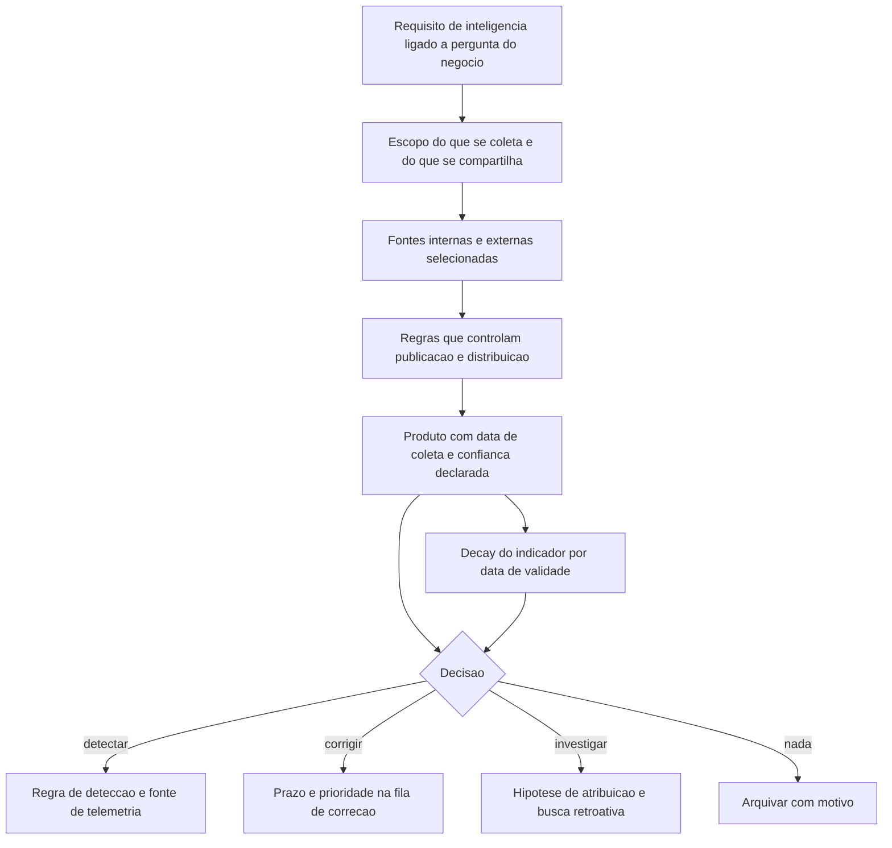

# Threat intelligence: fontes e níveis

Uma ideia central: inteligência é insumo de decisão com prazo de validade, e uma fonte só tem valor se a pergunta que ela responde estiver escrita antes da coleta — do contrário, produz relatório bonito e nenhuma mudança de comportamento.

## 1. Objetivo de aprendizagem

Ao final deste tema você deve conseguir: classificar uma fonte de inteligência pela pergunta que ela responde e pela confiança declarada, e decidir se o que ela entrega muda uma detecção, um prazo de correção ou nenhuma das duas.

## 2. Pré-requisitos

Nada. O [TEMA-01](TEMA-01-gestao-de-vulnerabilidades-do-inventario-ao-fechamento.md) ajuda a situar onde o indicador encosta no processo, mas este tema pode ser lido antes dele.

## 3. Pré-teste

Responda de palpite, antes de ler o resto. Anote a confiança de 1 a 5.

1. Qual pergunta do negócio você aposta que a assinatura de inteligência da sua empresa responde hoje? Escreva a sua aposta antes de conferir com o time.
   Confiança: ___
2. Chega um relatório sem data de coleta e sem prazo de validade. Você acha que ele muda alguma decisão na sua empresa? Sim, não ou depende.
   Confiança: ___
3. Você aposta que um endereço de comando e controle ou um método de persistência rende mais detecção depois de doze meses? Escolha um antes de ler.
   Confiança: ___
## 4. Caso real

O SP 800-150, publicado pelo NIST em outubro de 2016, define informação de ameaça cibernética como qualquer informação que ajude uma organização a identificar, avaliar, monitorar e responder a ameaças cibernéticas. A definição inclui indicadores de comprometimento, táticas, técnicas e procedimentos usados por atores de ameaça, ações sugeridas para detectar, conter ou prevenir ataques e os achados de análise de incidentes. A publicação orienta montar relações de compartilhamento passando por seis atividades: estabelecer metas, identificar fontes, delimitar o escopo, definir regras que controlam publicação e distribuição, engajar comunidades existentes e fazer uso efetivo da informação.

Do outro lado da mesa, a matriz do MITRE ATT&CK documenta comportamento observado em campo que mostra por que a inteligência de vulnerabilidade é disputada. A tática de Reconhecimento inclui Search Closed Sources, com as sub-técnicas Threat Intel Vendors e Purchase Technical Data, além de Search Threat Vendor Data. A tática de Resource Development inclui Obtain Capabilities, com a sub-técnica Vulnerabilities. A mesma tática de Reconhecimento traz Active Scanning com a sub-técnica Vulnerability Scanning.

O que esses nomes descrevem, em conjunto, é um mercado: existem atores que compram informação técnica, consultam fornecedores de inteligência e varrem alvos em busca de defeitos antes de publicar qualquer exploração. Para o defensor, isso significa que a janela de exposição não começa quando a exploração aparece em público.

A pergunta que o caso deixa aberta: se o adversário compra informação de vulnerabilidade antes do patch, o que a sua empresa faz com a informação que compra, e para quem ela é entregue?

## 5. Conteúdo

### 5.1 Conceito

Inteligência de ameaças não é lista de indicadores. A definição do SP 800-150 é funcional: serve para identificar, avaliar, monitorar e responder. Se o material recebido não move nenhuma dessas quatro coisas, ele é leitura, não inteligência. O teste é sempre o mesmo — qual decisão muda por causa disso, e quem a toma.

A segunda distinção útil é de finalidade. Existe material que orienta decisão de longo prazo, do tipo que sustenta verba e arquitetura; material que orienta a operação de uma semana, como campanha ativa contra o seu setor; e material que orienta a ação de uma hora, como um endereço que aparece no seu log agora. São três consumidores diferentes dentro da mesma empresa.

Esse recorte de três camadas é convenção de trabalho adotada neste roadmap — tático, operacional e estratégico. Uma enumeração canônica de níveis de inteligência em fonte oficial não foi localizada e conferida nesta execução: NAO CONFIRMADO em fonte oficial. O que está confirmado é a orientação do SP 800-150 de que a organização estabeleça metas de compartilhamento e delimite o escopo antes de coletar.

A terceira distinção é entre indicador e contexto. Um endereço ou um hash isolado tem vida curta e valor baixo: muda em horas, é trivial de trocar e raramente reaparece. O que envelhece devagar é o procedimento — como o ator entra, o que ele faz depois de entrar, o que ele precisa para persistir. É por isso que a lista de técnicas observadas em campo, mantida com versão e data, tem mais durabilidade do que a lista de indicadores do mês.

### 5.2 Como funciona

A sequência do SP 800-150 resolve o problema na ordem certa: metas, fontes, escopo, regras, comunidades, uso. A regra prática que sai dessa ordem é que a coleta começa pelo requisito e não pelo feed.

O bloco de regras de publicação e distribuição costuma faltar. Ele é o que define quem pode receber o quê, sob quais condições, e o que acontece quando a informação vaza por descuido do próprio time. Compartilhar informação recebida em confiança sem essa regra escrita consome a reputação da função e quebra a relação com a comunidade.

O tratamento do indicador tem três atributos obrigatórios no registro: data de coleta, prazo de validade e confiança declarada. Sem prazo de validade, a lista só cresce e a base de detecção passa a produzir ruído. A prática de expirar o indicador por data é decisão de engenharia da própria organização; uma norma oficial que fixe prazos por tipo de indicador não foi conferida nesta execução: NAO CONFIRMADO em fonte oficial.

A confiança declarada é o que separa um produto utilizável de um boato técnico. A escala de confiabilidade e credibilidade mais conhecida para graduar fonte e informação é a Admiralty, e a sua definição canônica não foi conferida nesta execução: NAO CONFIRMADO em fonte oficial. O mínimo defensável enquanto isso é registrar, em cada produto, três campos: quem informou, como aquilo foi verificado e o que muda se estiver errado.

### 5.3 Exemplo resolvido

A empresa recebe de uma comunidade setorial um aviso com quatro elementos: um endereço usado como infraestrutura de comando e controle, um subdomínio, um método de persistência descrito em uma frase e um nome de agrupamento atribuído ao ataque. Sem código de prova de conceito e sem identificador de vulnerabilidade.

Passo 1 — registrar o requisito. A pergunta que motivou a compra é: existe atividade direcionada ao nosso setor contra serviços que expomos à internet? Essa pergunta foi escrita antes da coleta e é ela que define se o aviso vale resposta.

Passo 2 — separar o que decai do que dura. Endereço e subdomínio decaem rápido; o método de persistência e o nome do agrupamento duram mais. As duas partes saem do mesmo aviso com prazos de validade diferentes.

Passo 3 — testar antes de publicar. O endereço é consultado no histórico de tráfego dos últimos 30 dias. O subdomínio é consultado na resolução de nomes. O método de persistência é traduzido para o que existe no sistema operacional do parque e cruzado com os registros de configuração.

Passo 4 — decidir por camada. Nada apareceu no histórico: o endereço vira regra de detecção para o futuro, com prazo de validade, e o requisito de coleta é ajustado. O método de persistência casa com um comportamento que não é observado hoje: vira caso de uso de detecção, com fonte de telemetria nomeada. O nome do agrupamento entra no acompanhamento de longo prazo, sem ação imediata.

Passo 5 — declarar confiança e distribuir. O produto sai com a fonte nomeada, a data de coleta, o prazo de validade e o que muda se a informação estiver errada. A distribuição segue a regra escrita: quem recebe o quê e sob qual condição.

Passo 6 — registrar a não decisão. Se a resposta ao requisito for "nada mudou", isso também é registrado, com motivo. Um mês depois, quando o mesmo requisito for reavaliado, o registro mostra se a decisão estava errada ou se o material era fraco.

O que o exercício entrega é uma lista curta de mudanças: uma regra de detecção, um caso de uso, um item de acompanhamento e uma decisão de não agir. Quatro saídas rastreáveis de um aviso de três parágrafos.

### 5.4 Problema de completar

Chega um relatório de fornecedor, pago, com 1.200 indicadores, sem data de coleta, sem prazo de validade, sem indicação de verificação e com atribuição a um agrupamento nomeado. O relatório não menciona nenhum dos seus ativos nem do seu setor. Complete a tabela.

| Etapa | Decisão | Motivo em uma linha | Quem decide |
|---|---|---|---|
| Requisito | ______ | ______ | ______ |
| Escopo | ______ | ______ | ______ |
| Validação de uma amostra do indicador | ______ | ______ | ______ |
| Publicação e distribuição | ______ | ______ | ______ |
| Registro do resultado | ______ | ______ | ______ |

Responda ainda: qual é a informação mínima que faltava para você aceitar o relatório como insumo de decisão, e o que você faz primeiro antes de pedir ao fornecedor — descartar o relatório por inteiro ou extrair o que sobrevive ao teste de validade? Justifique em três linhas.

## 6. Por que isso importa para o CISO

Assinatura de inteligência é uma das poucas linhas de orçamento que não tem prova de valor por si. O SP 800-150 indica o caminho: metas de compartilhamento estabelecidas, escopo delimitado, regras de publicação e distribuição escritas e uso efetivo como finalidade. Quando o contrato de inteligência não declara a pergunta que ele responde, a renovação vira discussão de preferência pessoal — e é a primeira linha cortada em ano apertado.

O segundo efeito é de responsabilidade. Compartilhar informação recebida em confiança, ou publicar indicador sem contexto, cria risco de reputação com a comunidade e, em alguns setores, risco contratual com o próprio fornecedor. As regras de publicação e distribuição existem para que essa decisão não fique com o analista mais animado do time.

O terceiro efeito é de prioridade da equipe. Um volume de indicadores sem prazo de validade e sem dono de triagem consome horas de analista e produz a sensação de que a função trabalha muito e entrega pouco. Medir quantos indicadores recebidos geraram regra de detecção nova, prazo alterado ou investigação retroativa é o que converte a assinatura em número defensável.

## 7. Aplicação prática

Escreva, em uma página, três requisitos de inteligência da sua empresa: um que sustenta decisão anual, um que sustenta a semana e um que sustenta a hora seguinte. Cada requisito precisa conter a pergunta, o consumidor por nome, o que faria a resposta mudar algo e a data de reavaliação.

Depois, pegue os últimos cinco produtos de inteligência que chegaram à sua caixa de entrada e classifique cada um nos três requisitos. Os que não se encaixarem em nenhum recebem o rótulo de leitura. A proporção entre produtos classificados e não classificados é o diagnóstico mais rápido do valor da assinatura, e não exige nenhum dado que você não tenha.

## 8. Autoexplicação

Explique em três frases por que um indicador sem data de coleta e sem prazo de validade prejudica a detecção. Ligue ao seu ambiente: cite um feed que você recebe hoje e diga quem, dentro da empresa, usa aquela informação para tomar uma decisão.

## 9. Erros comuns e equívocos

| Equívoco | Por que está errado | O que é correto |
|---|---|---|
| Inteligência é a lista de indicadores do fornecedor | Indicador sem contexto, sem data e sem prazo de validade gera ruído na detecção | Trate o procedimento como o ativo durável e exponha o indicador à expiração |
| Coletar primeiro e perguntar depois | Coleta sem requisito produz volume que ninguém consome | Escreva a pergunta e o consumidor antes de contratar a fonte |
| Mais fontes significam melhor inteligência | Fontes sem regra de distribuição e sem verificação multiplicam o mesmo erro | Priorize verificação e declare a confiança de cada produto |
| Atribuição é o produto principal | Citar um agrupamento sem evidência não muda detecção nem prazo | Separe agrupamento, campanha e infraestrutura, e use a atribuição só quando ela muda uma decisão |
| Compartilhar de volta é cortesia | Informação recebida em confiança tem regra de distribuição | Escritas as regras de publicação, o compartilhamento deixa de ser risco pessoal |
| Relatório sem ação é inútil | A decisão de não agir, registrada com motivo, evita repetir a mesma análise | Registre também a não decisão e reavalie na data marcada |

## 10. Recuperação ativa

Responda tudo antes de abrir o gabarito.

1. Como o SP 800-150 define informação de ameaça cibernética e o que essa definição inclui?
2. Quais são as seis atividades que a mesma publicação encadeia para estabelecer relações de compartilhamento?
3. Quais atributos um indicador precisa carregar no registro para ser utilizável em detecção?
4. O que a matriz do ATT&CK documenta em Reconhecimento e em Resource Development sobre a obtenção de informação de vulnerabilidade por atacantes?
5. Por que um procedimento observado dura mais, como insumo de detecção, do que um endereço ou um hash?
6. O que significa uma relação de inteligência declarar "não decisão" e por que isso precisa ser registrado?

Conferir respostas

1. Qualquer informação que ajude a organização a identificar, avaliar, monitorar e responder a ameaças cibernéticas. Inclui indicadores de comprometimento, táticas, técnicas e procedimentos de atores, ações sugeridas para detectar, conter ou prevenir ataques e achados de análise de incidentes.
2. Estabelecer metas de compartilhamento, identificar fontes de informação, delimitar o escopo das atividades, definir regras que controlam publicação e distribuição, engajar comunidades existentes e fazer uso efetivo da informação.
3. Data de coleta, prazo de validade e confiança declarada, além do requisito a que ele responde.
4. Search Closed Sources, com Threat Intel Vendors e Purchase Technical Data; Search Threat Vendor Data; Obtain Capabilities com a sub-técnica Vulnerabilities; e Active Scanning com a sub-técnica Vulnerability Scanning. Em conjunto, descrevem atacantes que compram ou varrem por informação de vulnerabilidade antes de a exploração aparecer em público.
5. Porque o endereço e o hash mudam em horas e são triviais de trocar, enquanto o procedimento descreve o que o ator precisa fazer para entrar, persistir e sair, e isso muda devagar.
6. Significa que o requisito foi avaliado e nada mudou. O registro com motivo permite distinguir, mais tarde, uma decisão correta diante de material fraco de um erro de análise.

## 11. Revisão espaçada

| Intervalo | O que fazer | Se errar |
|---|---|---|
| D+1 | Repetir de memória as seis atividades do SP 800-150 e os três atributos obrigatórios do indicador | Rebaixar: repetir em D+1 |
| D+7 | Classificar cinco produtos de inteligência recebidos nos três requisitos escritos | Rebaixar: repetir em D+3 |
| D+30 | Reavaliar os requisitos na data marcada e contar quantos produtos mudaram uma decisão no mês | Rebaixar: repetir em D+7 |

## 12. Conexões com outros temas

Leitura humana do `relacoes` do frontmatter — que é a fonte. Relações que saem desta área
também aparecem em [mapa-relacoes.md](../mapa-relacoes.md). Regras em
[templates/RELACOES-TEMAS.md](../templates/RELACOES-TEMAS.md).

| Relação | Alvo | Por que |
|---|---|---|
| aplicado_em | 10-operacoes-soc#TEMA-02 | indicador sem fonte de telemetria mapeada vira relatório; o log precisa existir para o indicador virar detecção |

## 13. Certificações e leitura recomendada

| Certificação | Domínio coberto | Leitura recomendada |
|---|---|---|
| CySA+ | Operações de segurança; gestão de vulnerabilidades; resposta a incidentes; reporte e comunicação | [NIST SP 800-150](https://csrc.nist.gov/pubs/sp/800/150/final) |
## 14. Fontes verificadas

| # | Título | Tipo | URL | Acessado em | Confiança |
|---|---|---|---|---|---|
| 1 | NIST SP 800-150, outubro de 2016, DOI 10.6028/NIST.SP.800-150; definição de informação de ameaça cibernética e as seis atividades de compartilhamento citadas no resumo | primaria | https://csrc.nist.gov/pubs/sp/800/150/final | "2026-09-25" | alta |
| 2 | MITRE ATT&CK, matriz Enterprise; táticas de Reconhecimento e Resource Development com as técnicas e sub-técnicas de busca, compra e varredura citadas | primaria | https://attack.mitre.org/ | "2026-09-25" | alta |
| 3 | CISA — Known Exploited Vulnerabilities Catalog, fonte autoritativa de vulnerabilidades exploradas em campo, estabelecida pela Binding Operational Directive 22-01 | primaria | https://www.cisa.gov/known-exploited-vulnerabilities-catalog | "2026-09-25" | media |

Os nomes e identificadores das técnicas foram lidos na matriz; as descrições oficiais de cada técnica exigem abrir a página da técnica e não foram conferidas: NAO CONFIRMADO em fonte oficial. A escala Admiralty de confiabilidade de fonte e credibilidade de informação não foi conferida. A versão da matriz do ATT&CK usada na leitura não é exibida na página e não é afirmada. Não há, neste tema, estatística de tempo de remediação, de volume de exploração ou de custo.

---

| Navegação | |
|---|---|
| Área | [12 Gestão de vulnerabilidades e threat intelligence](./README.md) |
| Tema anterior | [TEMA-02](TEMA-02-cvss-epss-e-priorizacao-por-risco-real.md) |
| Próximo tema | [TEMA-04](TEMA-04-mitre-attack-na-pratica.md) |
| Home | [README](../README.md) |
